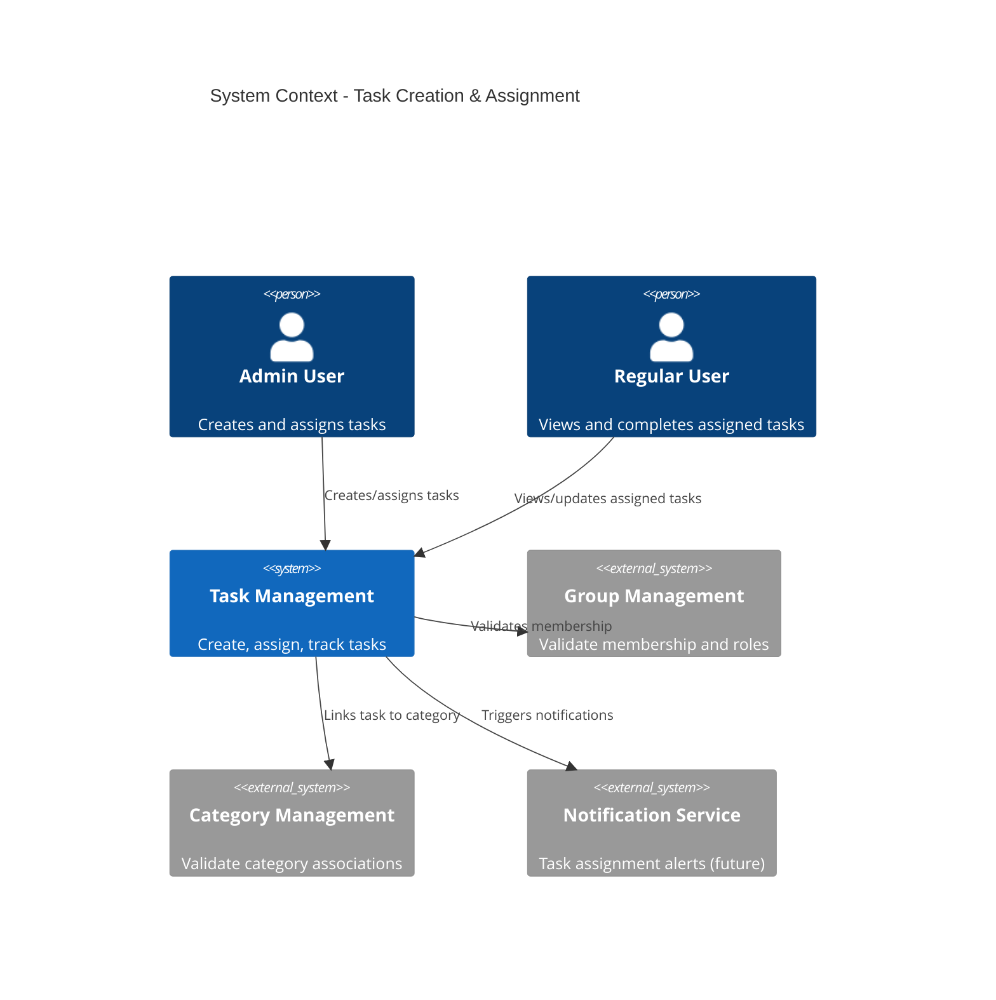
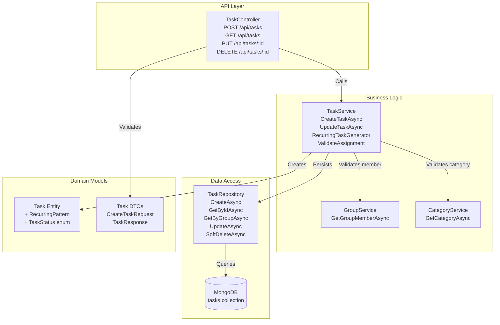
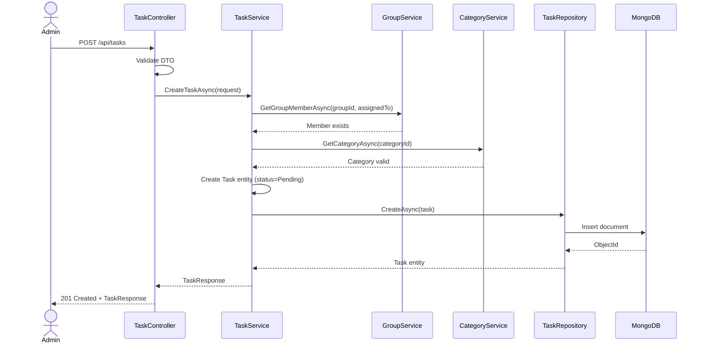
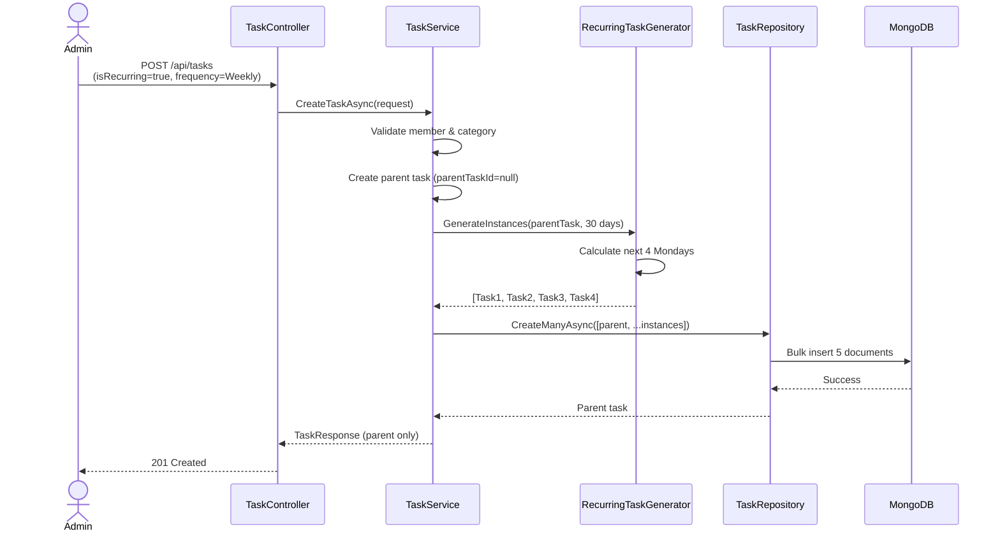
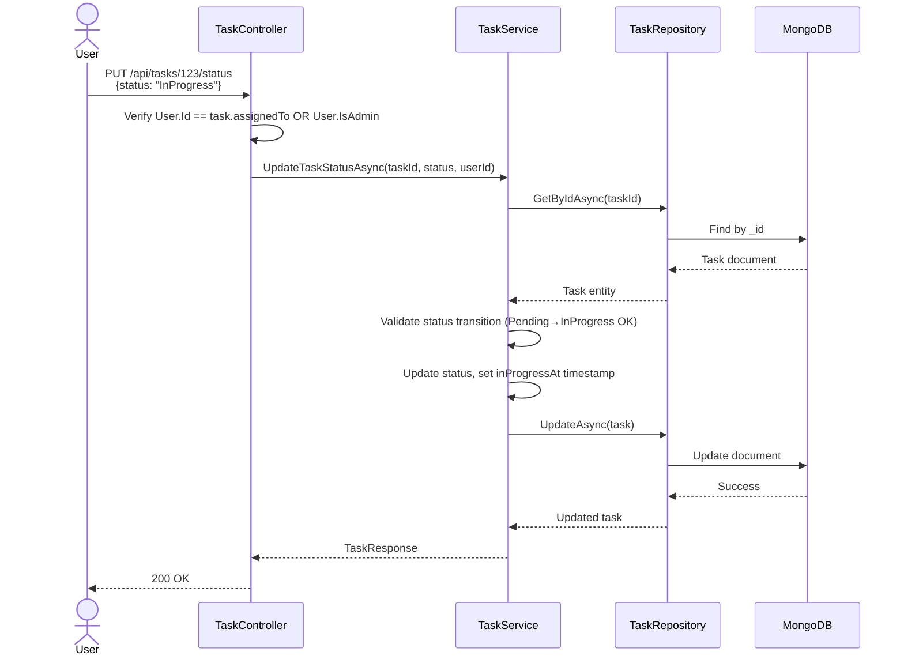

# Technical Design: FR-005 Task Creation & Assignment

**Document Version:** 1.0  
**Last Updated:** December 15, 2025  
**Mode:** NEW_FEATURE  
**PRD Reference:** [../../prd.md](../../prd.md#fr-005-task-creation--assignment)  
**Repository:** my-tasks-tracker-app  

---

## 1. Executive Summary

**Business value:**
- Enable admins to create and assign tasks from library or custom definitions
- Automate recurring task generation (daily, weekly, monthly, custom intervals)
- Provide clear task ownership and deadline tracking for accountability
- Establish foundation for workload balancing and gamification features

**High-level approach:**
- Extend existing Categories feature with Task domain model and endpoints
- Implement TaskController → TaskService → TaskRepository layered pattern
- Support both one-time and recurring task creation with flexible frequency options
- Leverage MongoDB for flexible schema (recurring patterns, status transitions)
- Integrate with existing Group membership validation and Category associations

**Key decisions:**
- **Task status enum:** Pending → In Progress → Completed → Overdue (simple 4-state model)
- **Recurring tasks:** Store pattern (frequency, interval, end date) and generate instances on-demand vs. pre-generate
  - **Decision:** Generate recurring instances for next 30 days on creation/update to simplify queries and notification scheduling
- **Task library:** Phase 2 feature (FR-004), initially support custom task creation only
- **Assignment validation:** Require assignee to be active group member, reject if user not in group
- **Date/time handling:** Store UTC, convert to group timezone for display
- **Edit permissions:** Only Admin can create/edit/delete tasks; assignee can update status only

---

## 2. Requirements Summary (from PRD)

### Functional Requirements
- Create tasks from library (Phase 2) or scratch with name, description, category, difficulty (1-10), duration estimate
- Assign to specific user(s) with deadline (date + time)
- Set frequency: One-time, Daily, Weekly, Bi-weekly, Monthly, Quarterly, Yearly, Custom (e.g., "every 3 days")
- Task status: Pending (default) → In Progress → Completed → Overdue (auto-transition at deadline)
- Admin can edit task properties (name, assignee, deadline, difficulty) before completion
- Admin can reassign task to different user
- Admin can delete tasks (soft delete to preserve history)
- Task belongs to single group and category
- Task requires due date (no open-ended tasks)

### Non-Functional Requirements
- API response time < 200ms for task creation
- Support up to 500 active tasks per group
- Recurring task generation < 100ms for 30-day window
- Task queries paginated (default 20, max 100 per page)
- MongoDB indexes on: groupId, assignedTo, status, dueDate

### Acceptance Criteria
- Admin creates one-time task → task appears in assignee's "My Tasks" view
- Admin creates weekly recurring task → next 4 instances visible in calendar
- Task past due date → status auto-updates to "Overdue" via background job
- Admin reassigns task → notification sent to both old and new assignee
- Assignee marks task "In Progress" → timestamp recorded, status updated
- Edit recurring task → only future instances updated (past instances immutable)

### Constraints
- Max 20 members per group (inherited from FR-002)
- Recurring tasks limited to 365 days lookahead (prevent infinite generation)
- Difficulty must be 1-10 integer
- Task name max 100 chars, description max 1000 chars

### Assumptions
- **Assume:** Categories feature (FR-003) already implemented with CategoryId validation
- **Assume:** Groups feature (FR-002) provides member list and Admin role verification
- **Assume:** Timezone stored at group level (default UTC if not set)
- **Inferred:** Task due time defaults to 23:59 group timezone if not specified
- **Inferred:** Recurring tasks cascade delete when parent deleted

---

## 3. Current Architecture (Relevant Only)

| Component | Responsibility | Status |
|-----------|---------------|--------|
| CategoryController | CRUD categories, validate custom category creation | ✅ Implemented |
| CategoryService | Business logic for category management, uniqueness validation | ✅ Implemented |
| CategoryRepository | MongoDB access for categories collection | ✅ Implemented |
| GroupController | Group CRUD, member invitations, role management | ✅ Implemented |
| GroupService | Membership validation, Admin checks | ✅ Implemented |
| AuthMiddleware | JWT validation, user context injection | ✅ Implemented |
| ApiResponse<T> | Standard response wrapper with success/data/errors | ✅ Implemented |

**Integration points:**
- Task creation validates `CategoryId` via `ICategoryService.GetCategoryAsync()`
- Task assignment validates `AssignedTo` userId via `IGroupService.GetGroupMemberAsync()`
- Task endpoints require `[Authorize]` attribute and Admin role check via `User.IsInRole("Admin")`
- Task notifications (future FR-009) will query tasks by status/dueDate for reminder scheduling

**Gaps/constraints:**
- No task library (FR-004) → custom task creation only for MVP
- No background job scheduler → overdue status update via on-demand check or separate service
- No difficulty-based point calculation (FR-006) → store difficulty value for future leaderboard integration
- No task swap feature (FR-013) → defer to future iteration

---

## 4. Proposed Architecture

### 4.1 System Context (C4)


### 4.2 Component Diagram


### 4.3 Data Model (MongoDB)
```json
{
  "_id": "ObjectId",
  "groupId": "string (FK to groups)",
  "name": "string (max 100 chars)",
  "description": "string (max 1000 chars)",
  "categoryId": "string (FK to categories)",
  "difficulty": "int (1-10)",
  "estimatedDuration": "int (minutes, optional)",
  "assignedTo": "string (userId)",
  "assignedBy": "string (userId, Admin who created task)",
  "dueDate": "DateTime (UTC)",
  "status": "string enum (Pending|InProgress|Completed|Overdue)",
  "isRecurring": "bool",
  "recurringPattern": {
    "frequency": "string (Daily|Weekly|BiWeekly|Monthly|Quarterly|Yearly|Custom)",
    "interval": "int (e.g., 3 for 'every 3 days')",
    "daysOfWeek": "array<int> (0=Sunday, optional for Weekly)",
    "endDate": "DateTime? (null = infinite, max 365 days)",
    "parentTaskId": "string? (null for original)"
  },
  "completedAt": "DateTime? (null until completed)",
  "completedBy": "string? (userId)",
  "approvedBy": "string? (Admin userId)",
  "createdAt": "DateTime (UTC)",
  "updatedAt": "DateTime (UTC)",
  "isDeleted": "bool (soft delete)"
}
```

**Indexes:**
```javascript
db.tasks.createIndex({ "groupId": 1, "status": 1 });
db.tasks.createIndex({ "assignedTo": 1, "dueDate": 1 });
db.tasks.createIndex({ "groupId": 1, "dueDate": 1 });
db.tasks.createIndex({ "isRecurring": 1, "recurringPattern.parentTaskId": 1 });
```

---

## 5. API Specification

### 5.1 Create Task
**Endpoint:** `POST /api/tasks`  
**Authorization:** Admin only  
**Request Body:**
```json
{
  "groupId": "string (required)",
  "name": "string (required, max 100)",
  "description": "string (optional, max 1000)",
  "categoryId": "string (required, validated FK)",
  "difficulty": "int (1-10, required)",
  "estimatedDuration": "int (minutes, optional)",
  "assignedTo": "string (userId, required)",
  "dueDate": "DateTime (ISO 8601, required)",
  "isRecurring": "bool (default false)",
  "recurringPattern": {
    "frequency": "Daily|Weekly|BiWeekly|Monthly|Quarterly|Yearly|Custom",
    "interval": "int (default 1)",
    "daysOfWeek": "[0-6] (optional, for Weekly)",
    "endDate": "DateTime? (optional, max +365 days)"
  }
}
```

**Response:** `201 Created`
```json
{
  "success": true,
  "data": {
    "id": "string",
    "groupId": "string",
    "name": "string",
    "categoryName": "string",
    "assignedToName": "string",
    "dueDate": "DateTime",
    "status": "Pending",
    "isRecurring": false,
    "createdAt": "DateTime"
  }
}
```

**Validation Errors:** `400 Bad Request`
- Name required and <= 100 chars
- AssignedTo must be active group member
- CategoryId must exist and belong to group or be system category
- Difficulty 1-10
- DueDate cannot be in the past
- RecurringPattern.endDate max 365 days from now

### 5.2 Get Tasks (Filtered)
**Endpoint:** `GET /api/tasks?groupId={id}&status={status}&assignedTo={userId}&page={n}&pageSize={m}`  
**Authorization:** Group member  
**Query Parameters:**
- `groupId` (required): filter by group
- `status` (optional): Pending|InProgress|Completed|Overdue
- `assignedTo` (optional): filter by assignee
- `categoryId` (optional): filter by category
- `page` (default 1): pagination page number
- `pageSize` (default 20, max 100): items per page

**Response:** `200 OK`
```json
{
  "success": true,
  "data": {
    "items": [
      {
        "id": "string",
        "name": "string",
        "categoryName": "string",
        "difficulty": 5,
        "assignedToName": "string",
        "dueDate": "DateTime",
        "status": "Pending",
        "isOverdue": false
      }
    ],
    "totalCount": 42,
    "page": 1,
    "pageSize": 20
  }
}
```

### 5.3 Update Task Status
**Endpoint:** `PUT /api/tasks/{id}/status`  
**Authorization:** Assignee or Admin  
**Request Body:**
```json
{
  "status": "InProgress|Completed",
  "notes": "string (optional)"
}
```

**Response:** `200 OK`

### 5.4 Update Task (Admin Only)
**Endpoint:** `PUT /api/tasks/{id}`  
**Authorization:** Admin only  
**Request Body:** Partial update (any field from CreateTaskRequest except groupId)

**Business Rules:**
- Cannot change `groupId` after creation
- Reassigning task triggers notification to old and new assignee
- Editing recurring task updates future instances only (parentTaskId null)
- Cannot edit completed/approved tasks

### 5.5 Delete Task
**Endpoint:** `DELETE /api/tasks/{id}`  
**Authorization:** Admin only  
**Response:** `204 No Content`

**Business Rules:**
- Soft delete: set `isDeleted = true`, preserve data
- Deleting recurring parent cascades to all child instances

---

## 6. Implementation Plan

### Phase 1: Core Task CRUD (2 days)
1. Define `Task` entity with status enum and validation attributes
2. Create `TaskRepository` with CRUD and query methods
3. Implement `TaskService.CreateTaskAsync()` with member/category validation
4. Build `TaskController.CreateTask()` with authorization
5. Add unit tests for service validation logic
6. Add integration tests for POST /api/tasks

### Phase 2: Recurring Tasks (2 days)
1. Define `RecurringPattern` value object
2. Implement `RecurringTaskGenerator.GenerateInstances()` (30-day window)
3. Add `TaskRepository.GetUpcomingRecurringTasksAsync()`
4. Update `TaskService.CreateTaskAsync()` to generate instances
5. Add tests for Daily/Weekly/Monthly patterns

### Phase 3: Task Queries & Filtering (1 day)
1. Implement GET /api/tasks with pagination
2. Add filtering by status, assignedTo, categoryId
3. Add `isOverdue` computed property
4. Implement background job stub for auto-overdue status update (actual job runner in future)

### Phase 4: Update & Delete (1 day)
1. Implement PUT /api/tasks/:id (Admin only)
2. Implement PUT /api/tasks/:id/status (Assignee or Admin)
3. Implement DELETE /api/tasks/:id (soft delete)
4. Add validation for completed task immutability

**Total Estimate:** 6 days (1 developer)

---

## 7. Sequence Diagrams

### 7.1 Admin Creates One-Time Task


### 7.2 Admin Creates Recurring Weekly Task


### 7.3 User Marks Task In Progress


---

## 8. Error Handling

| Scenario | HTTP Code | Error Message | Retry? |
|----------|-----------|---------------|--------|
| Assignee not in group | 400 | "User {userId} is not a member of group {groupId}" | No |
| Invalid category | 400 | "Category {categoryId} does not exist or is not accessible" | No |
| Past due date | 400 | "Due date must be in the future" | No |
| Recurring end date > 365 days | 400 | "Recurring tasks cannot extend beyond 365 days" | No |
| Non-Admin tries to create | 403 | "Only administrators can create tasks" | No |
| Task not found | 404 | "Task {taskId} not found" | No |
| Edit completed task | 409 | "Cannot edit completed or approved tasks" | No |
| MongoDB connection failure | 503 | "Database temporarily unavailable" | Yes (exponential backoff) |

---

## 9. Testing Strategy

### Unit Tests (TaskService)
- ✅ CreateTaskAsync validates assignee membership → throws ArgumentException if not member
- ✅ CreateTaskAsync validates category → throws ArgumentException if invalid
- ✅ CreateTaskAsync sets status to Pending by default
- ✅ RecurringTaskGenerator.Daily generates 30 instances for 30-day window
- ✅ RecurringTaskGenerator.Weekly respects daysOfWeek filter
- ✅ UpdateTaskStatusAsync rejects Completed→Pending transition

### Integration Tests (TaskController)
- ✅ POST /api/tasks with valid data → 201 + task in DB
- ✅ POST /api/tasks with non-member assignee → 400
- ✅ POST /api/tasks as Regular user → 403
- ✅ POST /api/tasks with recurring pattern → parent + 4 instances created
- ✅ GET /api/tasks?groupId=X → returns paginated tasks
- ✅ PUT /api/tasks/:id as Admin → updates task
- ✅ DELETE /api/tasks/:id → soft deletes task (isDeleted=true)

### Manual Testing
- Create daily recurring task ending in 10 days → verify 10 instances
- Mark task overdue (manually set dueDate to past) → status shows Overdue
- Reassign task → verify old assignee no longer sees task in "My Tasks"

---

## 10. Open Questions

1. **Recurring task editing:** When Admin edits a recurring parent task, should we:
   - A) Update all future instances (recommended)
   - B) Update only unstarted instances (Pending status)
   - C) Create new series and mark old instances obsolete?
   - **Recommendation:** Option A for simplicity; track edits in task history (future FR-017)

2. **Overdue status automation:** Should we:
   - A) Use background job (Hangfire/Quartz) to update status hourly
   - B) Check on-demand when user queries tasks
   - C) Hybrid: background job + on-demand fallback
   - **Recommendation:** Option C; background job at 00:05 UTC daily, fallback in query layer

3. **Task reassignment notification:** Should we notify:
   - A) Old and new assignee only
   - B) Old assignee, new assignee, and Admin who made change
   - C) Entire group (if public task, FR-020)
   - **Recommendation:** Option A for MVP; defer group notifications to FR-009/FR-020 integration

4. **Difficulty validation:** Should difficulty be:
   - A) Free-form integer 1-10 (any value allowed)
   - B) Constrained to predefined levels (Easy=1-3, Medium=4-6, Hard=7-10)
   - C) Calculated by AI based on task description (Phase 2)
   - **Recommendation:** Option A for MVP; Option C as Phase 2 enhancement

5. **Recurring pattern constraints:** Should we limit:
   - A) Max instances generated per creation (e.g., 100)
   - B) Max frequency (e.g., no hourly recurrence)
   - C) Both
   - **Recommendation:** Option C; max 365 days (already specified), max frequency = Daily (no hourly/minute)

---

## 11. Dependencies & Risks

### Dependencies
- ✅ FR-002 (Group Management) implemented → can validate membership
- ✅ FR-003 (Category Management) implemented → can validate categoryId
- ⏳ FR-009 (Notifications) not yet implemented → defer task assignment notifications
- ⏳ Background job scheduler not configured → defer overdue auto-update to Phase 2

### Risks
| Risk | Probability | Impact | Mitigation |
|------|-------------|--------|------------|
| Recurring task generation slow for large datasets | Medium | High | Limit to 30-day window; add MongoDB index on dueDate; batch insert |
| User confusion about recurring vs. instance relationship | Medium | Medium | Display parent task indicator in UI; provide "View all instances" link |
| Timezone handling errors (UTC vs. local time) | High | High | Store all dates in UTC; convert to group timezone only in API response; validate group timezone on creation |
| Overdue status not updating real-time | Medium | Low | Implement on-demand check in GET queries; add background job in Phase 2 |

---

## 12. Future Enhancements (Not in MVP)

- **FR-004 Task Library:** Predefined global task templates with defaults
- **FR-007 AI-Powered Distribution:** OpenAI API to suggest task assignments
- **FR-013 Task Swap:** User-initiated swap requests with Admin approval
- **FR-017 Task History:** Full audit log of task changes
- **FR-020 Public/Private Tasks:** Visibility control for sensitive tasks
- **Task attachments:** Upload photos/documents related to task
- **Task dependencies:** Block task completion until prerequisite tasks done
- **Bulk task creation:** Import tasks from CSV or create multiple at once

---

**END OF DESIGN DOCUMENT**

This design focuses on core task creation, assignment, and recurring task generation. Integration with notifications (FR-009), leaderboard (FR-011), and approval workflows (FR-008) will be addressed in separate design documents.
