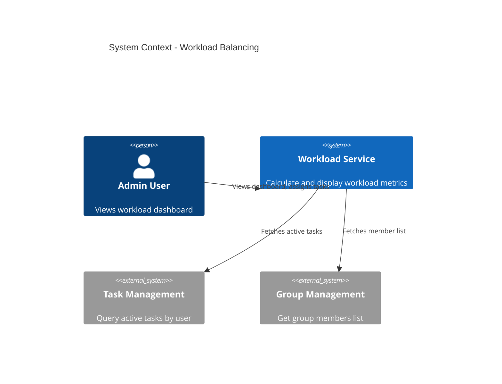
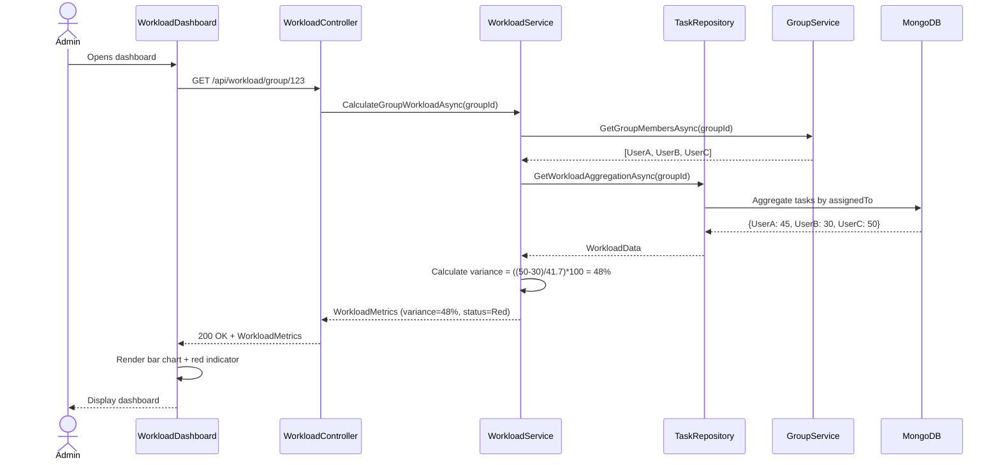
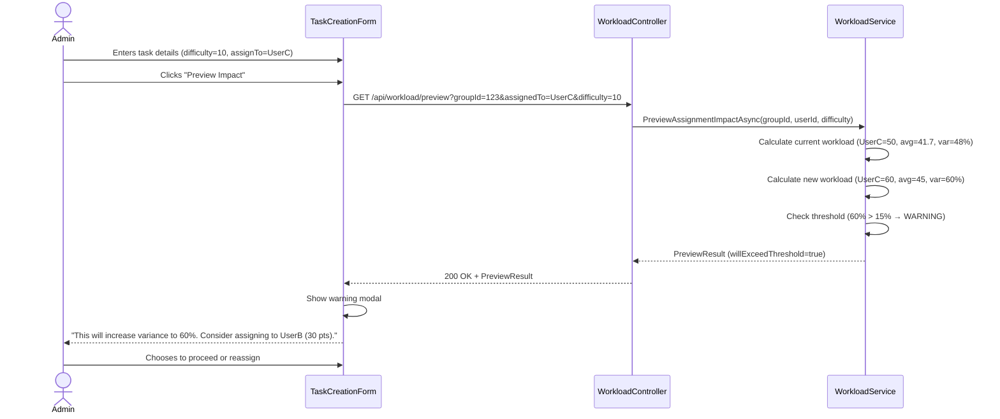
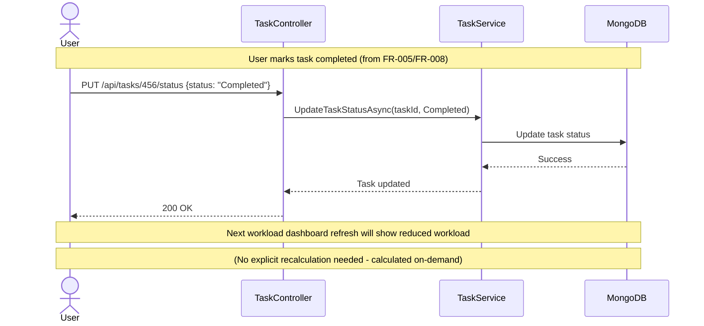

# Technical Design: FR-006 Difficulty Levels & Workload Balancing

**Document Version:** 1.0  
**Last Updated:** December 15, 2025  
**Mode:** NEW_FEATURE  
**PRD Reference:** [../../prd.md](../../prd.md#fr-006-difficulty-levels--workload-balancing)  
**Repository:** my-tasks-tracker-app  

---

## 1. Executive Summary

**Business value:**
- Ensure fair task distribution by quantifying task complexity (difficulty 1-10 scale)
- Provide real-time visibility into workload imbalance across group members
- Enable admins to make informed assignment decisions based on current workload
- Establish foundation for AI-powered task distribution (FR-007) and leaderboard points (FR-011)

**High-level approach:**
- Store difficulty (1-10 integer) on each task during creation (already in FR-005 design)
- Calculate per-user workload as sum of difficulty points for active tasks (Pending + InProgress)
- Display workload metrics in Admin dashboard with variance indicator
- Provide "Workload Preview" before task assignment to show impact
- Alert admin when variance exceeds 15% threshold

**Key decisions:**
- **Workload calculation:** Sum difficulty of Pending + InProgress tasks only (exclude Completed/Overdue)
- **Variance formula:** `(Max Workload - Min Workload) / Average Workload * 100%`
- **Target threshold:** ≤15% variance (PRD requirement), yellow warning at 10%, red alert at 15%
- **Real-time updates:** Calculate on-demand per request (no caching initially) since task count is limited (≤500 per group)
- **Workload scope:** Per-group calculation (users in different groups have independent workloads)

---

## 2. Requirements Summary (from PRD)

### Functional Requirements
- Difficulty scale 1-10 for all tasks (mandatory field during creation)
- Calculate total workload per user = sum of difficulty points for active tasks
- Display workload metrics in Admin dashboard:
  - Per-user workload (numeric + visual bar chart)
  - Group average workload
  - Workload variance percentage
  - Highlight users with highest/lowest workload
- Show "Workload Preview" when creating/reassigning tasks
- Alert admin if action would exceed 15% variance threshold
- Support workload filtering: show tasks by difficulty range (e.g., "Easy: 1-3", "Medium: 4-6", "Hard: 7-10")

### Non-Functional Requirements
- Workload calculation < 50ms for groups up to 20 members
- Dashboard refresh every 30 seconds via polling (or SignalR in future)
- Variance indicator updates in real-time as admin assigns tasks
- API endpoint for workload summary: GET /api/workload/group/{groupId}

### Acceptance Criteria
- Admin views dashboard → sees each member's workload in points and percentage
- Admin assigns 10-point task to user with 30 points → preview shows new total 40 and updated variance
- Variance exceeds 15% → red indicator visible, tooltip explains imbalance
- Admin filters tasks by difficulty "Hard (7-10)" → sees only high-difficulty tasks
- User completes task → their workload auto-decreases by task difficulty

### Constraints
- Variance calculation requires at least 2 active members (cannot calculate for single user)
- Workload excludes overdue tasks (prevent skewing by old uncompleted tasks)
- Difficulty cannot be changed after task completion (preserve historical points for leaderboard)

### Assumptions
- **Assume:** FR-005 (Task Creation) implemented with difficulty field
- **Assume:** Tasks have status enum (Pending, InProgress, Completed, Overdue)
- **Inferred:** Zero-workload members (no assigned tasks) included in variance calculation
- **Inferred:** Admin dashboard accessible via web only initially (mobile in Phase 2)

---

## 3. Current Architecture (Relevant Only)

| Component | Responsibility | Status |
|-----------|---------------|--------|
| Task Entity | Contains difficulty (1-10) and status fields | ✅ Implemented (FR-005) |
| TaskRepository | Query tasks by groupId, assignedTo, status | ✅ Implemented (FR-005) |
| TaskService | Task CRUD, validation, assignment logic | ✅ Implemented (FR-005) |
| GroupService | Get group members list | ✅ Implemented (FR-002) |
| AuthMiddleware | Admin role verification | ✅ Implemented (FR-001) |

**Integration points:**
- Workload calculation queries tasks via `TaskRepository.GetByGroupIdAsync(groupId, statusFilter)`
- Member list fetched via `GroupService.GetGroupMembersAsync(groupId)` to include zero-workload users
- Admin dashboard endpoints require `[Authorize(Roles = "Admin")]` attribute

**Gaps/constraints:**
- No aggregation/caching layer → calculate workload on every request (acceptable for ≤500 tasks/group)
- No real-time push updates → client polls every 30s (SignalR in future FR-009 integration)
- No historical workload tracking → only current snapshot (consider analytics in FR-014)

---

## 4. Proposed Architecture

### 4.1 System Context (C4)


### 4.2 Component Diagram
```mermaid
graph TB
    subgraph "API Layer"
        WC[WorkloadController<br/>GET /api/workload/group/:groupId<br/>GET /api/workload/preview]
    end
    
    subgraph "Business Logic"
        WS[WorkloadService<br/>CalculateWorkloadAsync<br/>CalculateVarianceAsync<br/>PreviewAssignmentImpact]
        TS[TaskService<br/>GetActiveTasksAsync]
        GS[GroupService<br/>GetGroupMembersAsync]
    end
    
    subgraph "Data Access"
        TR[TaskRepository<br/>GetByGroupIdAsync<br/>FilterByStatus]
        MONGO[(MongoDB<br/>tasks collection)]
    end
    
    subgraph "Domain Models"
        WM[WorkloadMetrics<br/>+ UserWorkload[]<br/>+ Variance<br/>+ Threshold]
    end
    
    WC -->|Calls| WS
    WS -->|Fetches tasks| TS
    WS -->|Fetches members| GS
    TS -->|Queries| TR
    TR -->|Reads| MONGO
    WS -->|Returns| WM
```

### 4.3 Data Model Extensions

**No new collections** – workload calculated on-demand from existing tasks.

**Task entity (already defined in FR-005):**
```json
{
  "_id": "ObjectId",
  "groupId": "string",
  "assignedTo": "string",
  "difficulty": "int (1-10)",
  "status": "Pending|InProgress|Completed|Overdue",
  ...
}
```

**MongoDB aggregation query (example):**
```javascript
db.tasks.aggregate([
  {
    $match: {
      groupId: "group-123",
      status: { $in: ["Pending", "InProgress"] },
      isDeleted: false
    }
  },
  {
    $group: {
      _id: "$assignedTo",
      totalDifficulty: { $sum: "$difficulty" },
      taskCount: { $sum: 1 }
    }
  }
]);
```

---

## 5. API Specification

### 5.1 Get Group Workload Summary
**Endpoint:** `GET /api/workload/group/{groupId}`  
**Authorization:** Group member (any role)  
**Query Parameters:**
- `includeCompleted` (bool, default false): include completed tasks in calculation (for historical view)

**Response:** `200 OK`
```json
{
  "success": true,
  "data": {
    "groupId": "string",
    "calculatedAt": "DateTime",
    "userWorkloads": [
      {
        "userId": "string",
        "userName": "string",
        "totalDifficulty": 45,
        "taskCount": 5,
        "percentageOfAverage": 128,
        "tasks": [
          {
            "id": "string",
            "name": "Clean kitchen",
            "difficulty": 8,
            "dueDate": "DateTime"
          }
        ]
      }
    ],
    "groupStats": {
      "totalTasks": 25,
      "totalDifficulty": 175,
      "averageWorkload": 35,
      "minWorkload": 20,
      "maxWorkload": 50,
      "variance": 21.4,
      "isBalanced": false,
      "thresholdExceeded": true
    }
  }
}
```

**Variance Indicator:**
- `variance < 10%` → Green (balanced)
- `10% ≤ variance < 15%` → Yellow (warning)
- `variance ≥ 15%` → Red (unbalanced, threshold exceeded)

### 5.2 Preview Task Assignment Impact
**Endpoint:** `GET /api/workload/preview?groupId={id}&assignedTo={userId}&difficulty={n}`  
**Authorization:** Admin only  
**Query Parameters:**
- `groupId` (required): target group
- `assignedTo` (required): user to receive task
- `difficulty` (required, 1-10): task difficulty

**Response:** `200 OK`
```json
{
  "success": true,
  "data": {
    "currentWorkload": 30,
    "newWorkload": 38,
    "currentVariance": 12.5,
    "newVariance": 18.2,
    "willExceedThreshold": true,
    "recommendation": "Consider assigning to UserB (workload 22) to improve balance"
  }
}
```

**Business Rules:**
- If `willExceedThreshold = true`, show warning dialog in UI
- Recommendation suggests user with lowest workload (if available)
- Admin can override and proceed with assignment

### 5.3 Get Workload by Difficulty Range
**Endpoint:** `GET /api/workload/group/{groupId}/by-difficulty?range={easy|medium|hard}`  
**Authorization:** Group member  
**Response:** `200 OK` (similar to 5.1 but filtered)

**Difficulty Ranges:**
- Easy: 1-3
- Medium: 4-6
- Hard: 7-10

---

## 6. Workload Calculation Logic

### 6.1 Per-User Workload Formula
```
UserWorkload = Σ (task.difficulty) 
               WHERE task.assignedTo = userId 
               AND task.status IN ('Pending', 'InProgress')
               AND task.isDeleted = false
```

### 6.2 Group Variance Formula
```
Average = Total Difficulty / Number of Active Members
Min = Lowest user workload
Max = Highest user workload

Variance (%) = ((Max - Min) / Average) × 100

if Average = 0:
  Variance = 0 (no tasks assigned yet)
```

### 6.3 Threshold Logic
```csharp
public WorkloadStatus GetWorkloadStatus(double variancePercentage)
{
    if (variancePercentage < 10.0)
        return WorkloadStatus.Balanced; // Green
    if (variancePercentage < 15.0)
        return WorkloadStatus.Warning; // Yellow
    return WorkloadStatus.Unbalanced; // Red
}
```

### 6.4 Edge Cases
| Scenario | Calculation | Display |
|----------|-------------|---------|
| Single member group | Variance = 0 (no comparison) | "N/A - single member" |
| No tasks assigned | All workloads = 0, variance = 0 | "0 tasks, balanced by default" |
| All members have equal workload | Variance = 0 | "Perfectly balanced (0%)" |
| Zero-workload member exists | Included in average calculation | Shows 0 for that user |
| Member leaves group mid-assignment | Tasks reassigned or marked unassigned | Recalculate excluding ex-member |

---

## 7. Implementation Plan

### Phase 1: Workload Service Core (2 days)
1. Create `WorkloadService` with `CalculateGroupWorkloadAsync()`
2. Implement aggregation query in `TaskRepository.GetWorkloadByGroup()`
3. Add variance calculation logic
4. Define `WorkloadMetrics` and `UserWorkload` DTOs
5. Unit tests for variance formula and edge cases

### Phase 2: API Endpoints (1 day)
1. Create `WorkloadController` with authorization
2. Implement GET /api/workload/group/:groupId
3. Implement GET /api/workload/preview
4. Add input validation and error handling
5. Integration tests for API responses

### Phase 3: Admin Dashboard UI (Web) (2 days)
1. Create `WorkloadDashboard.tsx` component
2. Fetch workload data via RTK Query
3. Display bar chart (Chart.js or Recharts)
4. Add variance indicator (colored badge)
5. Implement 30-second polling for auto-refresh

### Phase 4: Assignment Preview UI (1 day)
1. Add "Preview Impact" button to task creation form
2. Show modal with before/after workload comparison
3. Display warning if threshold exceeded
4. Allow admin to proceed or cancel

**Total Estimate:** 6 days (1 developer)

---

## 8. Sequence Diagrams

### 8.1 Admin Views Workload Dashboard


### 8.2 Admin Previews Task Assignment


### 8.3 User Completes Task (Workload Auto-Update)


---

## 9. UI/UX Design Guidelines

### 9.1 Workload Dashboard Layout
```
┌─────────────────────────────────────────────────┐
│  Group: Family Tasks                🔄 Refresh  │
├─────────────────────────────────────────────────┤
│  Group Stats                                     │
│  ● Total Tasks: 25   ● Avg Workload: 35 pts    │
│  ● Variance: 48% ⚠️ UNBALANCED                  │
└─────────────────────────────────────────────────┘

┌─────────────────────────────────────────────────┐
│  Member Workloads                                │
├─────────────────────────────────────────────────┤
│  John    ████████████████████ 50 pts (143%) 🔴  │
│           5 tasks                                │
│                                                  │
│  Sarah   ████████████ 30 pts (86%) 🟢           │
│           3 tasks                                │
│                                                  │
│  Mike    ██████████████████████ 45 pts (129%) 🟡│
│           4 tasks                                │
└─────────────────────────────────────────────────┘

[View by Difficulty: All ▾]  [Export Report]
```

### 9.2 Preview Modal
```
┌───────────────────────────────────────┐
│  ⚠️  Workload Impact Preview         │
├───────────────────────────────────────┤
│  Assigning 10-point task to John:    │
│                                       │
│  Current Workload:   50 pts          │
│  New Workload:       60 pts (+20%)   │
│                                       │
│  Group Variance:     48% → 60% 🔴    │
│                                       │
│  💡 Recommendation:                  │
│  Consider assigning to Sarah (30 pts)│
│  to improve balance.                 │
│                                       │
│  [ Proceed Anyway ]  [ Reassign ]    │
└───────────────────────────────────────┘
```

---

## 10. Error Handling

| Scenario | HTTP Code | Error Message | Retry? |
|----------|-----------|---------------|--------|
| Group not found | 404 | "Group {groupId} not found" | No |
| User not in group | 403 | "You are not a member of this group" | No |
| Invalid difficulty range | 400 | "Difficulty must be between 1 and 10" | No |
| Single-member group variance | 200 | variance=0, message="N/A - single member group" | N/A |
| MongoDB aggregation timeout | 503 | "Workload calculation timed out, please retry" | Yes |

---

## 11. Testing Strategy

### Unit Tests (WorkloadService)
- ✅ CalculateWorkloadAsync with 3 users (workloads: 20, 30, 40) → variance = 50%
- ✅ CalculateWorkloadAsync with equal workloads (30, 30, 30) → variance = 0%
- ✅ CalculateWorkloadAsync with single user → variance = 0, message = "N/A"
- ✅ CalculateWorkloadAsync with zero tasks → all workloads = 0, variance = 0
- ✅ PreviewAssignmentImpact increases variance above 15% → willExceedThreshold = true

### Integration Tests (WorkloadController)
- ✅ GET /api/workload/group/123 → returns workload summary with correct variance
- ✅ GET /api/workload/group/123 as non-member → 403 Forbidden
- ✅ GET /api/workload/preview with valid params → returns preview with recommendation
- ✅ GET /api/workload/group/123 with completed tasks → excludes from workload

### Performance Tests
- ✅ Calculate workload for 20 members with 500 tasks → completes in <50ms
- ✅ Dashboard polling every 30s for 10 concurrent admins → no performance degradation

### Manual Testing
- Create unbalanced workload (User A: 10 pts, User B: 40 pts) → variance shows ~75% (red)
- Assign task to User A to balance → variance decreases to <15% (green)
- Mark task completed → dashboard refresh shows reduced workload
- Preview assigning 20-point task to User B → shows warning modal

---

## 12. Open Questions

1. **Overdue task handling:** Should overdue tasks count toward workload?
   - **Recommendation:** No – exclude from active workload to avoid penalizing users for old uncompleted tasks; surface overdue tasks separately in UI

2. **Workload history:** Should we track historical workload snapshots?
   - **Recommendation:** Phase 2 – store daily snapshots in `workload_history` collection for trend analysis (FR-014 Reports)

3. **Difficulty adjustment:** Can admin retroactively change task difficulty?
   - **Recommendation:** Allow editing before completion; freeze after completion to preserve leaderboard point integrity (FR-011)

4. **Multi-group workload:** For users in multiple groups, should we show aggregate workload?
   - **Recommendation:** No – workload calculated per-group independently; add "Total Across Groups" view in user profile (Phase 2)

5. **Notification threshold:** Should admin receive notification when variance exceeds 15%?
   - **Recommendation:** Yes – add email notification option in group settings (integrate with FR-009)

---

## 13. Dependencies & Risks

### Dependencies
- ✅ FR-002 (Group Management) → get member list
- ✅ FR-003 (Categories) → not directly required but tasks reference categories
- ✅ FR-005 (Task Creation) → task difficulty and status fields

### Risks
| Risk | Probability | Impact | Mitigation |
|------|-------------|--------|------------|
| Aggregation query slow for large task counts | Low | Medium | Add MongoDB index on (groupId, status, assignedTo); limit to 500 tasks/group per PRD |
| Variance formula confusing to admins | Medium | Low | Add tooltip with explanation; show visual examples in onboarding |
| Polling overhead on server | Medium | Medium | Implement rate limiting (max 1 req/10s per client); consider WebSocket in Phase 2 |
| Admin ignores warnings and creates imbalance | High | Low | Log override decisions; surface in audit trail (FR-017) |

---

## 14. Future Enhancements (Not in MVP)

- **Historical workload tracking:** Daily snapshots for trend charts
- **Workload forecasting:** Predict future workload based on recurring tasks
- **Smart rebalancing suggestions:** AI-powered task swap recommendations (integrate with FR-007)
- **Workload alerts:** Push notifications when variance exceeds threshold
- **Workload leaderboard:** Recognize users with consistently balanced contributions
- **Difficulty auto-adjustment:** Learn from completion times to refine difficulty ratings

---

**END OF DESIGN DOCUMENT**

This design provides real-time workload visibility and proactive imbalance prevention. Integration with AI distribution (FR-007) and leaderboard points (FR-011) will build upon this foundation.
