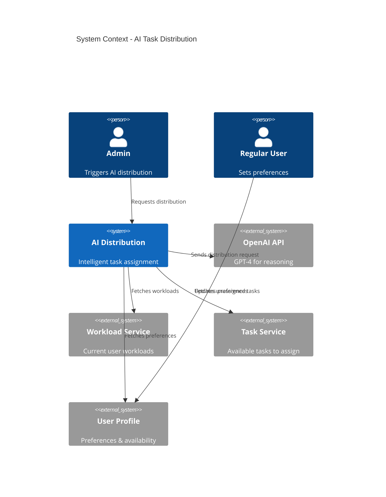
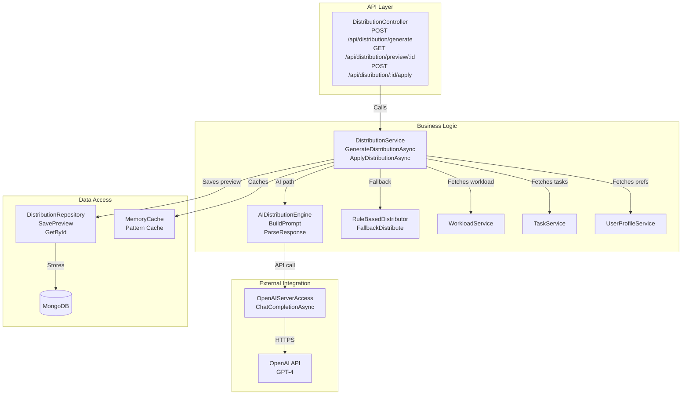
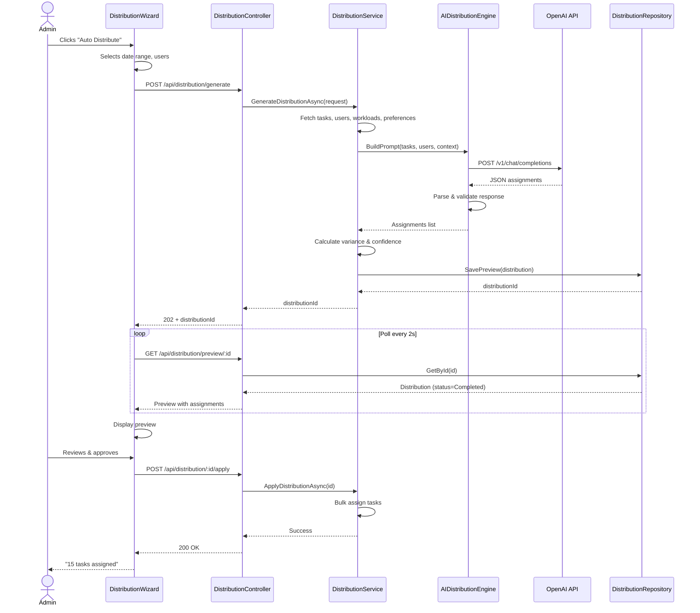
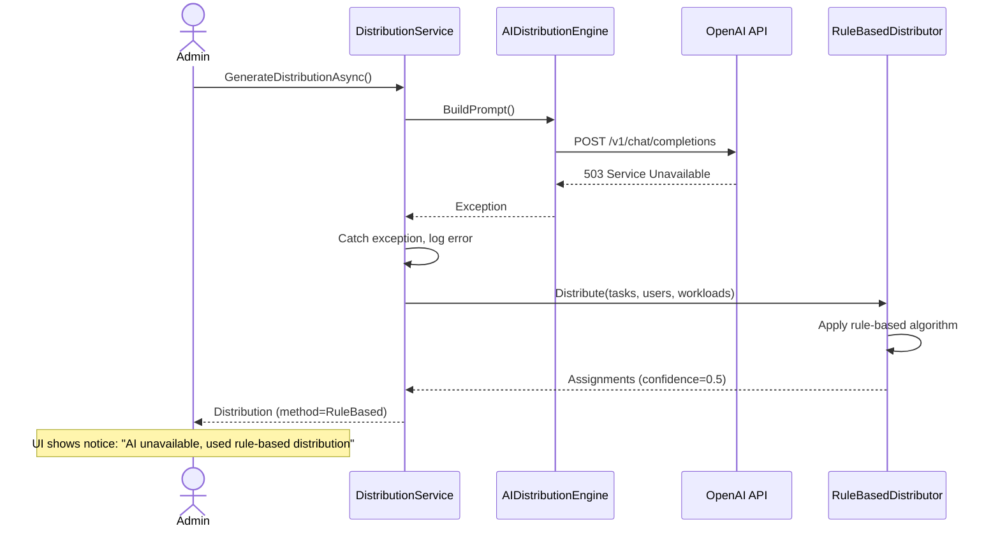

# Technical Design: FR-007 AI-Powered Task Distribution

**Document Version:** 1.0  
**Last Updated:** December 15, 2025  
**Mode:** NEW_FEATURE  
**PRD Reference:** [../../prd.md](../../prd.md#fr-007-ai-powered-task-distribution)  
**Repository:** my-tasks-tracker-app  

---

## 1. Executive Summary

**Business value:**
- Reduce admin time spent on manual task assignment by 70%
- Improve workload fairness through intelligent distribution algorithms
- Consider member preferences, historical performance, and availability
- Provide explainable AI recommendations to build trust
- Scale group task management beyond 5-10 members efficiently

**High-level approach:**
- Integrate OpenAI GPT-4 API for intelligent task-to-user matching
- Collect user preference data (liked/disliked categories, availability dates)
- Analyze historical completion patterns (on-time rate, task types completed)
- Generate distribution proposals with confidence scores and rationale
- Allow admin to review, modify, and approve before committing assignments
- Implement cost controls and fallback to rule-based distribution

**Key decisions:**
- **AI Provider:** OpenAI GPT-4 (flexible prompt engineering, JSON mode support)
- **Fallback strategy:** Rule-based distribution if API fails or quota exceeded (priority: lowest workload → category preference match → round-robin)
- **User control:** Admin reviews and approves all AI suggestions (no auto-assignment)
- **Data privacy:** Only send anonymized task/user metadata to OpenAI (no names, only IDs + categories/preferences)
- **Cost management:** Cache distribution patterns for similar task sets; limit to 1 AI call per distribution session
- **Phase approach:** Phase 2 feature (not MVP) – requires FR-005, FR-006, and user preference data

---

## 2. Requirements Summary (from PRD)

### Functional Requirements
- "Auto Distribute" button in Admin dashboard triggers AI distribution
- Admin selects date range (e.g., next 7 days) and target users (all or subset)
- AI considers factors:
  - **Current workload** (from FR-006): prioritize users with lower workload
  - **Category preferences**: user-marked liked/disliked categories
  - **Historical performance**: on-time completion rate by category
  - **Availability**: user-marked unavailable dates (vacations, busy periods)
  - **Fairness**: minimize variance below 15% target
- Display preview with:
  - Proposed assignments (task → user mapping)
  - Confidence score per assignment (0-100%)
  - Rationale explanation ("Sarah has low workload and prefers kitchen tasks")
- Admin can:
  - Accept all assignments
  - Modify individual assignments (drag-drop or reassign)
  - Regenerate distribution with different constraints
- Users mark preferences and availability in profile settings

### Non-Functional Requirements
- AI API call response time < 5 seconds for 20 tasks × 5 users
- Fallback to rule-based distribution if OpenAI API fails
- Total API cost < $0.50 per distribution request
- Cache distribution logic for common patterns (reduce redundant API calls)
- Explainability: every assignment includes human-readable rationale

### Acceptance Criteria
- Admin clicks "Auto Distribute" for 15 tasks across 5 users → preview shows assignments in <5s
- User A marks "Kitchen" as disliked → AI avoids kitchen tasks for User A
- User B has 80% on-time rate for "Shopping" → AI prioritizes shopping tasks for User B
- Variance in proposed distribution ≤ 15% → fairness indicator shows green
- OpenAI API returns error → system falls back to rule-based distribution + shows notice
- Admin modifies 2 assignments in preview → saves custom distribution

### Constraints
- OpenAI API rate limits: 10,000 tokens/min (monitor usage)
- Max 50 tasks per distribution request (prevent token overflow)
- User preference data optional (AI degrades gracefully without preferences)
- No real-time learning (AI doesn't update model based on user actions)

### Assumptions
- **Assume:** OpenAI API key provided and configured in appsettings.json
- **Assume:** GPT-4 API access (GPT-3.5 insufficient for complex constraint reasoning)
- **Assume:** Users willing to share preferences (provide onboarding incentive)
- **Inferred:** Distribution proposals stored temporarily (24h expiry) for admin review
- **Inferred:** AI context window limited to 8K tokens (use pagination for large task sets)

---

## 3. Current Architecture (Relevant Only)

| Component | Responsibility | Status |
|-----------|---------------|--------|
| WorkloadService | Calculate current user workloads | ✅ Implemented (FR-006) |
| TaskService | Task CRUD, assignment logic | ✅ Implemented (FR-005) |
| TaskRepository | Query tasks by filters | ✅ Implemented (FR-005) |
| GroupService | Get group members | ✅ Implemented (FR-002) |
| User Entity | Basic profile data | ✅ Implemented (FR-001) |

**Integration points:**
- AI distribution queries workload via `WorkloadService.CalculateGroupWorkloadAsync()`
- Task assignments created via `TaskService.AssignTaskAsync()` in batch
- User preferences stored in `UserProfile` entity (extend existing schema)

**Gaps/constraints:**
- No user preference collection → need to extend UserProfile with categoryPreferences, unavailableDates
- No historical completion analysis → need to add TaskRepository queries for completion stats
- No external AI service integration → new ServerAccess layer component needed
- No caching layer for AI responses → implement simple in-memory cache

---

## 4. Proposed Architecture

### 4.1 System Context (C4)


### 4.2 Component Diagram


### 4.3 Data Model Extensions

**UserProfile (extend existing):**
```json
{
  "_id": "ObjectId",
  "userId": "string",
  "categoryPreferences": [
    {
      "categoryId": "string",
      "preference": "Liked|Disliked|Neutral"
    }
  ],
  "unavailableDates": [
    {
      "startDate": "DateTime",
      "endDate": "DateTime",
      "reason": "string (optional)"
    }
  ],
  "skillLevel": {
    "categoryId": "string",
    "level": "Beginner|Intermediate|Expert"
  },
  "updatedAt": "DateTime"
}
```

**DistributionProposal (new collection):**
```json
{
  "_id": "ObjectId",
  "groupId": "string",
  "createdBy": "string (Admin userId)",
  "dateRange": {
    "startDate": "DateTime",
    "endDate": "DateTime"
  },
  "assignments": [
    {
      "taskId": "string",
      "taskName": "string",
      "assignedTo": "string (userId)",
      "confidence": 0.85,
      "rationale": "Low workload, prefers cleaning tasks, 90% on-time rate"
    }
  ],
  "stats": {
    "totalTasks": 15,
    "totalUsers": 5,
    "variance": 12.5,
    "aiGenerated": true
  },
  "status": "Pending|Applied|Expired",
  "createdAt": "DateTime",
  "expiresAt": "DateTime (createdAt + 24h)"
}
```

---

## 5. API Specification

### 5.1 Generate AI Distribution
**Endpoint:** `POST /api/distribution/generate`  
**Authorization:** Admin only  
**Request Body:**
```json
{
  "groupId": "string (required)",
  "dateRange": {
    "startDate": "DateTime (required)",
    "endDate": "DateTime (required, max 30 days)"
  },
  "userIds": ["string"] | null (null = all members),
  "constraints": {
    "maxTasksPerUser": 10,
    "requireCategoryMatch": false,
    "prioritizeBalance": true
  }
}
```

**Response:** `202 Accepted`
```json
{
  "success": true,
  "data": {
    "distributionId": "string",
    "status": "Processing",
    "estimatedTime": 5
  }
}
```

**Async Processing:** Client polls GET /api/distribution/preview/:id

### 5.2 Get Distribution Preview
**Endpoint:** `GET /api/distribution/preview/{distributionId}`  
**Authorization:** Admin only  
**Response:** `200 OK`
```json
{
  "success": true,
  "data": {
    "distributionId": "string",
    "status": "Completed|Processing|Failed",
    "method": "AI|RuleBased",
    "assignments": [
      {
        "taskId": "string",
        "taskName": "Clean kitchen",
        "difficulty": 7,
        "categoryName": "House",
        "assignedTo": "user-123",
        "assignedToName": "Sarah",
        "confidence": 0.92,
        "rationale": "Low workload (20 pts), prefers House tasks, 95% on-time completion"
      }
    ],
    "stats": {
      "variance": 8.5,
      "isBalanced": true,
      "userWorkloads": {
        "user-123": 27,
        "user-456": 31,
        "user-789": 25
      }
    },
    "expiresAt": "DateTime"
  }
}
```

### 5.3 Apply Distribution
**Endpoint:** `POST /api/distribution/{distributionId}/apply`  
**Authorization:** Admin only  
**Request Body:**
```json
{
  "modifications": [
    {
      "taskId": "string",
      "newAssignedTo": "string (userId)"
    }
  ]
}
```

**Response:** `200 OK`
```json
{
  "success": true,
  "data": {
    "tasksAssigned": 15,
    "notificationsSent": 5,
    "finalVariance": 9.2
  }
}
```

---

## 6. AI Prompt Engineering

### 6.1 System Prompt (GPT-4)
```
You are an expert task distribution AI for household and team management.
Your goal is to assign tasks to users fairly while considering preferences, workload, and skills.

Output Format: JSON array of assignments
[
  {
    "taskId": "string",
    "assignedTo": "userId",
    "confidence": 0-1,
    "rationale": "brief explanation"
  }
]

Constraints:
- Minimize workload variance (<15% ideal)
- Respect user unavailability (do not assign if unavailable)
- Prefer category matches (user likes category)
- Consider historical performance (high on-time rate)
- Balance difficulty distribution (avoid overloading with hard tasks)
```

### 6.2 User Prompt (Example)
```
Assign these 10 tasks to 4 users:

Tasks:
1. ID: t1, Name: "Clean kitchen", Category: House, Difficulty: 7, Due: 2025-12-20
2. ID: t2, Name: "Buy groceries", Category: Shopping, Difficulty: 4, Due: 2025-12-18
...

Users:
1. ID: u1, Name: Anonymous, Current Workload: 20 pts
   - Likes: House, Shopping
   - Dislikes: Pets
   - On-time rate: 85%
   - Unavailable: 2025-12-22 to 2025-12-25

2. ID: u2, Name: Anonymous, Current Workload: 35 pts
   - Likes: Yard
   - On-time rate: 92%
   - Available all dates

Generate optimal assignments.
```

### 6.3 Response Parsing
```csharp
public class AIAssignment
{
    public string TaskId { get; set; }
    public string AssignedTo { get; set; }
    public double Confidence { get; set; } // 0.0 - 1.0
    public string Rationale { get; set; }
}

// Parse GPT-4 JSON response
var assignments = JsonSerializer.Deserialize<List<AIAssignment>>(response.Content);
```

---

## 7. Fallback Rule-Based Distribution

**Algorithm (when AI unavailable):**
```
1. Sort tasks by difficulty (descending)
2. Sort users by current workload (ascending)
3. For each task:
   a. Filter users: exclude unavailable, exclude disliked category
   b. If category preference match exists → prioritize
   c. Else → assign to user with lowest workload
   d. Update user workload counter
4. Return assignments with confidence=0.5 (rule-based indicator)
```

**Triggers for fallback:**
- OpenAI API returns 4xx/5xx error
- Response parsing fails (invalid JSON)
- API timeout (>10 seconds)
- Rate limit exceeded
- Admin explicitly selects "Quick Distribution" mode

---

## 8. Implementation Plan

### Phase 1: User Preferences (2 days)
1. Extend UserProfile schema with categoryPreferences, unavailableDates
2. Create UserProfileService with CRUD methods
3. Add API endpoints: PUT /api/profile/preferences
4. Build UI for preference selection (like/dislike categories)
5. Add "Mark Unavailable" calendar UI

### Phase 2: Historical Analytics (1 day)
1. Add TaskRepository query: GetCompletionStatsAsync(userId, categoryId)
2. Calculate on-time completion rate by category
3. Store aggregated stats in UserProfile (update nightly via background job)

### Phase 3: AI Integration (3 days)
1. Create OpenAIServerAccess with ChatCompletionAsync()
2. Implement AIDistributionEngine with prompt builder
3. Add response parsing and validation
4. Configure API key via IConfiguration
5. Unit tests with mocked OpenAI responses

### Phase 4: Rule-Based Fallback (1 day)
1. Implement RuleBasedDistributor algorithm
2. Add fallback logic in DistributionService
3. Test error scenarios (API down, timeout, invalid response)

### Phase 5: API & UI (3 days)
1. Create DistributionController with async endpoints
2. Implement DistributionRepository for preview storage
3. Build "Auto Distribute" wizard UI (React)
4. Display preview with confidence scores
5. Allow drag-drop assignment modifications

**Total Estimate:** 10 days (1 developer)

---

## 9. Sequence Diagrams

### 9.1 AI Distribution Flow (Success)


### 9.2 Fallback to Rule-Based


---

## 10. Cost Analysis

### OpenAI API Pricing (GPT-4)
- Input tokens: $0.03 / 1K tokens
- Output tokens: $0.06 / 1K tokens

**Estimated usage per distribution:**
- System prompt: ~200 tokens
- Task list (20 tasks × 50 tokens): ~1000 tokens
- User context (5 users × 100 tokens): ~500 tokens
- Total input: ~1700 tokens ≈ $0.05
- Output (20 assignments × 50 tokens): ~1000 tokens ≈ $0.06
- **Total per request: ~$0.11**

**Monthly estimate (10 distributions/month/group):**
- 10 requests × $0.11 = $1.10/group/month
- 100 groups = $110/month

**Mitigation strategies:**
- Use GPT-3.5-turbo for simpler distributions ($0.001/1K tokens = 10× cheaper)
- Cache similar distribution patterns (reduce redundant calls)
- Batch multiple small distributions into one API call

---

## 11. Error Handling

| Scenario | Mitigation | User Message |
|----------|------------|--------------|
| OpenAI API timeout (>10s) | Fallback to rule-based | "AI distribution timed out, using standard distribution" |
| Invalid API key | Log error, disable AI feature | "AI distribution unavailable, contact administrator" |
| Rate limit exceeded | Queue request, retry in 60s | "AI service busy, please retry in 1 minute" |
| Response parsing error | Fallback to rule-based | "AI response invalid, using standard distribution" |
| No user preferences available | AI uses workload only | "Distribution based on workload (preferences not set)" |
| All users unavailable for date | Reject distribution request | "No users available for selected date range" |

---

## 12. Testing Strategy

### Unit Tests
- ✅ AIDistributionEngine.BuildPrompt() generates valid JSON structure
- ✅ AIDistributionEngine.ParseResponse() handles malformed JSON
- ✅ RuleBasedDistributor assigns tasks with minimal variance
- ✅ DistributionService falls back when AI throws exception

### Integration Tests
- ✅ POST /api/distribution/generate with OpenAI mock → returns preview
- ✅ POST /api/distribution/generate with API error → falls back to rule-based
- ✅ POST /api/distribution/:id/apply → tasks assigned, notifications sent

### Manual Tests
- Generate distribution with preferences → verify category matches prioritized
- Mark user unavailable → verify no tasks assigned during unavailable period
- Simulate OpenAI downtime → verify fallback works and shows notice
- Modify assignments in preview → verify custom assignments saved

---

## 13. Open Questions

1. **Preference weighting:** Should "Dislike" be a hard constraint (never assign) or soft (deprioritize)?
   - **Recommendation:** Hard constraint for MVP; add "Neutral/Avoid" option in Phase 2

2. **Confidence threshold:** Should low-confidence assignments (<50%) require admin review?
   - **Recommendation:** Display confidence color-coded; admin always reviews before applying

3. **Learning from feedback:** Should system learn when admin modifies AI suggestions?
   - **Recommendation:** Phase 2 – log modifications and fine-tune prompts quarterly

4. **Multi-group optimization:** For users in multiple groups, optimize across all groups?
   - **Recommendation:** No – distribute per-group independently; add cross-group view in Phase 3

5. **Cost control:** Should we implement per-group AI usage limits?
   - **Recommendation:** Yes – max 50 AI calls/month/group; show usage dashboard

---

## 14. Dependencies & Risks

### Dependencies
- ✅ FR-005 (Task Creation) → tasks to distribute
- ✅ FR-006 (Workload Balancing) → workload calculations
- ⏳ User preference collection UI → required for category matching

### Risks
| Risk | Probability | Impact | Mitigation |
|------|-------------|--------|------------|
| OpenAI API unreliable | Medium | Medium | Implement robust fallback + caching |
| AI recommendations poor quality | Medium | High | Human-in-loop (admin approval required) + prompt tuning |
| High API costs | Low | Medium | Usage limits + GPT-3.5 fallback |
| User resistance to AI | Medium | Low | Emphasize time savings + explainability |
| Privacy concerns (data sent to OpenAI) | Medium | High | Anonymize data + disclose in privacy policy |

---

## 15. Future Enhancements

- **Reinforcement learning:** Learn from admin modifications to improve suggestions
- **Multi-objective optimization:** Balance fairness, preferences, AND completion speed
- **Smart scheduling:** Suggest optimal due dates based on user availability
- **Conflict detection:** Warn if assignment conflicts with other groups' tasks
- **Skill development:** Gradually assign harder tasks to grow user capabilities

---

**END OF DESIGN DOCUMENT**

This AI-powered distribution feature provides intelligent, explainable task assignments while maintaining admin control and cost efficiency through rule-based fallback.
