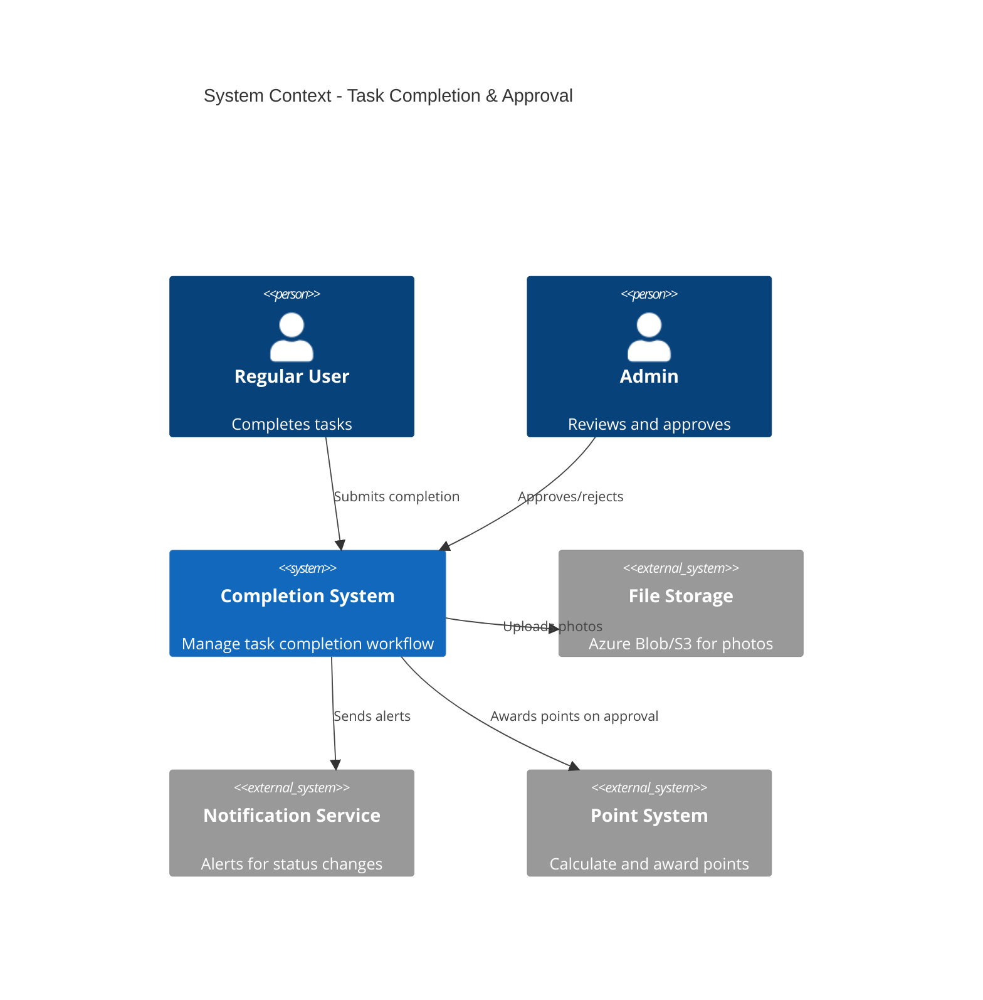
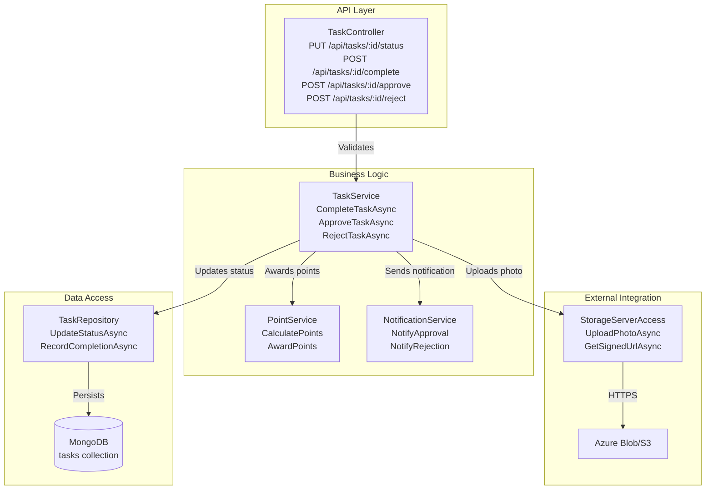
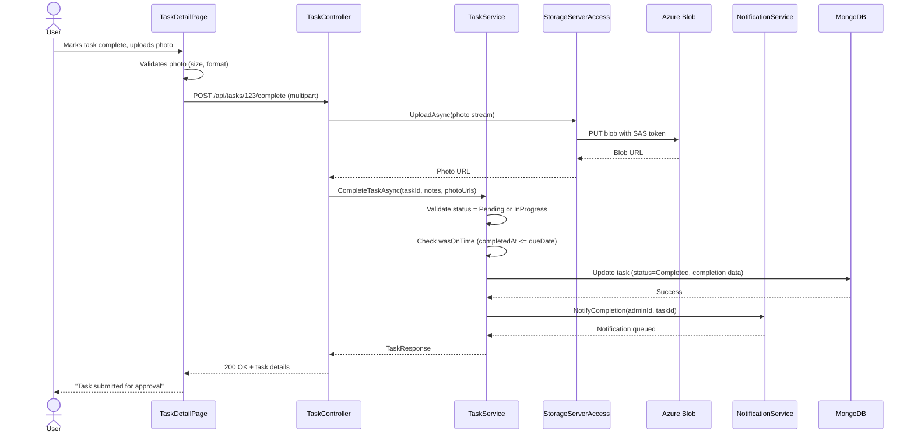
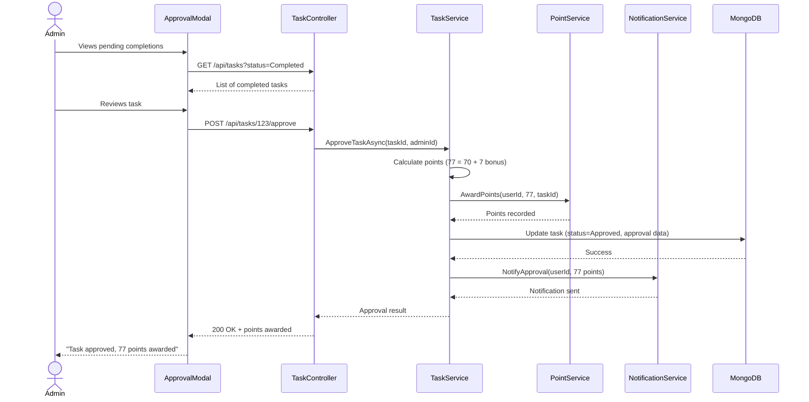
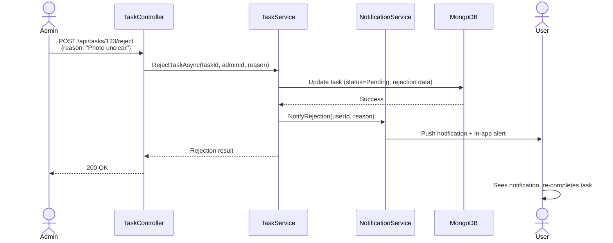

# Technical Design: FR-008 Task Completion & Approval

**Document Version:** 1.0  
**Last Updated:** December 15, 2025  
**Mode:** NEW_FEATURE  
**PRD Reference:** [../../prd.md](../../prd.md#fr-008-task-completion--approval)  
**Repository:** my-tasks-tracker-app  

---

## 1. Executive Summary

**Business value:**
- Establish accountability through verified task completion with photo proof
- Enable quality control via admin approval workflow
- Reward on-time completion with 10% bonus points for leaderboard
- Create audit trail of task actions (who, what, when)
- Reduce disputes through timestamped evidence and approval records

**High-level approach:**
- Extend Task entity with completion metadata (completedAt, completedBy, approvedBy, notes, photoUrl)
- Implement status transitions: Pending → In Progress → Completed → Approved/Rejected
- Add photo upload capability via Azure Blob Storage or AWS S3
- Create approval workflow: user submits completion → admin reviews → approve/reject
- Calculate and award points on approval (difficulty × 10 + on-time bonus)
- Send real-time notifications for status changes

**Key decisions:**
- **Approval requirement:** Configurable per task (requiresApproval flag, default true for difficulty ≥7)
- **Auto-approval:** Tasks with difficulty <7 auto-approve after 24h if admin doesn't review
- **Photo proof:** Optional for difficulty 1-6, required for difficulty 7-10
- **Rejection flow:** Admin can reject with reason → task returns to "Pending" → user re-completes
- **Point calculation:** Triggered only on approval (not on completion submission)
- **Timestamp precision:** Store completedAt, approvedAt/rejectedAt separately for audit

---

## 2. Requirements Summary (from PRD)

### Functional Requirements
- User marks task "In Progress" → timestamp recorded, notification sent to admin
- User marks task "Completed" with optional notes and photo proof
- Admin receives notification of completion submission
- Admin reviews completion with photo/notes → approves or rejects
- Admin can reject with reason → user gets notification + task returns to Pending
- On-time completion earns 10% bonus points (within due date)
- Completed task displays timestamp, user, and approver
- Configurable approval requirement per task (admin can disable for simple tasks)
- Photo upload size limit: 5MB, formats: JPEG/PNG/HEIC

### Non-Functional Requirements
- Photo upload < 10 seconds for 5MB file
- Photo served via CDN with < 500ms load time
- Approval action response time < 200ms
- Support concurrent completions (handle race conditions)
- Store photos with 90-day retention policy

### Acceptance Criteria
- User completes task on Dec 15 (due Dec 20) → earns base points + 10% bonus
- User completes task on Dec 21 (due Dec 20) → earns base points only (no bonus)
- Admin rejects task with "Needs better photo" → user sees rejection reason + task status = Pending
- Task with difficulty 8 submitted without photo → validation error "Photo required"
- Task with requiresApproval=false → auto-approves on completion

### Constraints
- Photo storage max 5MB per file
- Max 3 photos per task
- Retention: photos deleted 90 days after task completion
- Points awarded only once (prevent duplicate awards if task reopened)

### Assumptions
- **Assume:** File storage (Azure Blob/S3) configured and accessible
- **Assume:** Admin reviews completions within 24 hours (SLA for user experience)
- **Inferred:** Photos compressed before upload (client-side optimization)
- **Inferred:** Photo URLs signed with 1-hour expiry for security

---

## 3. Current Architecture (Relevant Only)

| Component | Responsibility | Status |
|-----------|---------------|--------|
| Task Entity | Task data with status enum | ✅ Implemented (FR-005) |
| TaskService | Task CRUD and assignment | ✅ Implemented (FR-005) |
| TaskRepository | MongoDB task queries | ✅ Implemented (FR-005) |
| AuthMiddleware | User authentication | ✅ Implemented (FR-001) |
| NotificationService | Notification creation (stub) | ⏳ Planned (FR-009) |

**Integration points:**
- Completion triggers notification via `NotificationService.SendAsync()`
- Point calculation queries difficulty via Task entity
- Photo upload uses `StorageServerAccess.UploadAsync()`
- Leaderboard update triggered on approval (FR-011 integration point)

**Gaps/constraints:**
- No file storage integration → need StorageServerAccess component
- No point tracking system → need PointService or integrate with LeaderboardService (FR-011)
- No notification infrastructure → stub notifications until FR-009 implemented

---

## 4. Proposed Architecture

### 4.1 System Context (C4)


### 4.2 Component Diagram


### 4.3 Data Model Extensions

**Task Entity (extend from FR-005):**
```json
{
  "_id": "ObjectId",
  "status": "Pending|InProgress|Completed|Approved|Rejected",
  "requiresApproval": "bool (default true)",
  
  "completion": {
    "submittedAt": "DateTime?",
    "submittedBy": "string? (userId)",
    "notes": "string? (max 500 chars)",
    "photoUrls": ["string"] (max 3),
    "wasOnTime": "bool"
  },
  
  "approval": {
    "status": "Pending|Approved|Rejected",
    "reviewedAt": "DateTime?",
    "reviewedBy": "string? (Admin userId)",
    "rejectionReason": "string? (max 500 chars)",
    "pointsAwarded": "int? (calculated on approval)"
  },
  
  "history": [
    {
      "action": "StatusChanged|Completed|Approved|Rejected",
      "timestamp": "DateTime",
      "userId": "string",
      "fromStatus": "string",
      "toStatus": "string",
      "notes": "string?"
    }
  ]
}
```

**Photo Metadata (embedded in task):**
```json
{
  "url": "string (blob storage URL)",
  "thumbnailUrl": "string (optimized 300x300)",
  "fileName": "string",
  "fileSize": "int (bytes)",
  "uploadedAt": "DateTime",
  "expiresAt": "DateTime (uploadedAt + 90 days)"
}
```

---

## 5. API Specification

### 5.1 Mark Task In Progress
**Endpoint:** `PUT /api/tasks/{taskId}/status`  
**Authorization:** Assignee or Admin  
**Request Body:**
```json
{
  "status": "InProgress"
}
```

**Response:** `200 OK`
```json
{
  "success": true,
  "data": {
    "id": "string",
    "status": "InProgress",
    "startedAt": "DateTime"
  }
}
```

### 5.2 Submit Task Completion
**Endpoint:** `POST /api/tasks/{taskId}/complete`  
**Authorization:** Assignee only  
**Request Body (multipart/form-data):**
```
notes: "string (optional, max 500 chars)"
photos: File[] (optional, max 3 files, 5MB each, JPEG/PNG/HEIC)
```

**Response:** `200 OK`
```json
{
  "success": true,
  "data": {
    "id": "string",
    "status": "Completed",
    "completedAt": "DateTime",
    "requiresApproval": true,
    "wasOnTime": true,
    "photoUrls": ["https://cdn.example.com/photos/xyz.jpg"]
  }
}
```

**Business Rules:**
- If difficulty ≥7 and no photos provided → 400 "Photo required for high-difficulty tasks"
- If task already completed → 409 "Task already completed"
- If past due date → wasOnTime = false (no bonus points)
- If requiresApproval = false → auto-approve and award points immediately

**Validation Errors:** `400 Bad Request`
- Notes > 500 chars
- Photo size > 5MB
- More than 3 photos
- Invalid photo format

### 5.3 Approve Task
**Endpoint:** `POST /api/tasks/{taskId}/approve`  
**Authorization:** Admin only  
**Request Body:**
```json
{
  "feedback": "string (optional, max 500 chars)"
}
```

**Response:** `200 OK`
```json
{
  "success": true,
  "data": {
    "id": "string",
    "status": "Approved",
    "approvedAt": "DateTime",
    "approvedBy": "string (Admin name)",
    "pointsAwarded": 77
  }
}
```

**Business Logic:**
- Calculate points: `(difficulty × 10) + (wasOnTime ? difficulty × 10 × 0.1 : 0)`
- Award points via PointService.AwardPoints(userId, points, taskId)
- Send notification to user: "Great job! You earned 77 points 🎉"
- Update leaderboard rankings

### 5.4 Reject Task
**Endpoint:** `POST /api/tasks/{taskId}/reject`  
**Authorization:** Admin only  
**Request Body:**
```json
{
  "reason": "string (required, max 500 chars)"
}
```

**Response:** `200 OK`
```json
{
  "success": true,
  "data": {
    "id": "string",
    "status": "Pending",
    "rejectedAt": "DateTime",
    "rejectionReason": "Photo unclear, please retake"
  }
}
```

**Business Logic:**
- Reset status to "Pending"
- Clear completion data (keep history for audit)
- Send notification to user with rejection reason
- Log rejection in task history

### 5.5 Get Task Completion Details
**Endpoint:** `GET /api/tasks/{taskId}/completion`  
**Authorization:** Group member  
**Response:** `200 OK`
```json
{
  "success": true,
  "data": {
    "taskId": "string",
    "status": "Approved",
    "completion": {
      "submittedAt": "DateTime",
      "submittedBy": "John Doe",
      "notes": "Kitchen cleaned thoroughly",
      "photoUrls": ["https://cdn.example.com/photos/xyz.jpg"],
      "wasOnTime": true
    },
    "approval": {
      "reviewedAt": "DateTime",
      "reviewedBy": "Admin Sarah",
      "pointsAwarded": 77,
      "feedback": "Excellent work! 👍"
    }
  }
}
```

---

## 6. Point Calculation Logic

### 6.1 Base Points Formula
```
Base Points = Difficulty × 10

Examples:
- Difficulty 1 → 10 points
- Difficulty 5 → 50 points
- Difficulty 10 → 100 points
```

### 6.2 On-Time Bonus
```
On-Time Bonus = Base Points × 10%
              = Difficulty × 10 × 0.1
              
Total Points = Base Points + (wasOnTime ? On-Time Bonus : 0)

Examples:
- Difficulty 7, on-time → 70 + 7 = 77 points
- Difficulty 7, late → 70 + 0 = 70 points
- Difficulty 10, on-time → 100 + 10 = 110 points
```

### 6.3 Edge Cases
| Scenario | Points Awarded | Notes |
|----------|----------------|-------|
| Task submitted 1 min before deadline | Base + Bonus | Considered on-time |
| Task submitted exactly at deadline (23:59:59) | Base + Bonus | Inclusive of due date |
| Task submitted 1 min after deadline | Base only | No bonus |
| Task rejected then resubmitted on-time | Base + Bonus | Bonus based on final submission time |
| Task rejected then resubmitted late | Base only | Bonus lost |
| Auto-approved task (no admin review) | Base + Bonus (if on-time) | Points awarded immediately |

---

## 7. Photo Upload Flow

### 7.1 Client-Side Processing
```typescript
// React component
async function handlePhotoUpload(files: File[]) {
  // 1. Validate file size and type
  const validated = files.filter(f => 
    f.size <= 5 * 1024 * 1024 && 
    ['image/jpeg', 'image/png', 'image/heic'].includes(f.type)
  );
  
  // 2. Compress images (optional, reduces bandwidth)
  const compressed = await Promise.all(
    validated.map(f => compressImage(f, { maxWidth: 1920, quality: 0.8 }))
  );
  
  // 3. Upload to API
  const formData = new FormData();
  compressed.forEach(f => formData.append('photos', f));
  formData.append('notes', notes);
  
  const response = await fetch(`/api/tasks/${taskId}/complete`, {
    method: 'POST',
    body: formData,
  });
}
```

### 7.2 Server-Side Processing
```csharp
// TaskController
[HttpPost("{taskId}/complete")]
public async Task<IActionResult> CompleteTask(
    string taskId, 
    [FromForm] string? notes,
    [FromForm] List<IFormFile>? photos)
{
    // 1. Validate files
    if (photos != null && photos.Any(p => p.Length > 5 * 1024 * 1024))
        return BadRequest("File size exceeds 5MB");
    
    // 2. Upload to storage
    var photoUrls = new List<string>();
    foreach (var photo in photos ?? new())
    {
        var url = await _storageAccess.UploadAsync(
            photo.OpenReadStream(), 
            $"tasks/{taskId}/{Guid.NewGuid()}.jpg"
        );
        photoUrls.Add(url);
    }
    
    // 3. Complete task
    await _taskService.CompleteTaskAsync(taskId, userId, notes, photoUrls);
    
    return Ok(new { photoUrls });
}
```

### 7.3 Storage Structure
```
Azure Blob Container: task-photos
├── tasks/
│   ├── {taskId}/
│   │   ├── {guid1}.jpg (original)
│   │   ├── {guid1}_thumb.jpg (thumbnail 300x300)
│   │   ├── {guid2}.jpg
│   │   └── {guid2}_thumb.jpg

Retention Policy: Delete after 90 days from upload
```

---

## 8. Implementation Plan

### Phase 1: Status Transitions & Basic Completion (2 days)
1. Extend Task entity with completion and approval fields
2. Implement status validation logic (state machine)
3. Add TaskService.CompleteTaskAsync() without photos
4. Add TaskController endpoints for status updates
5. Unit tests for status transitions

### Phase 2: Photo Upload Integration (2 days)
1. Create StorageServerAccess with Azure Blob SDK
2. Implement photo upload, compression, and thumbnail generation
3. Add photo validation (size, format, count)
4. Configure blob storage connection string
5. Test multipart/form-data upload

### Phase 3: Approval Workflow (2 days)
1. Implement TaskService.ApproveTaskAsync() with point calculation
2. Implement TaskService.RejectTaskAsync() with status reset
3. Add approval endpoints in TaskController
4. Create PointService stub (integrate with FR-011 later)
5. Integration tests for approve/reject flow

### Phase 4: Notifications & History (1 day)
1. Add NotificationService.NotifyCompletion/Approval/Rejection stubs
2. Implement task history logging (append-only audit trail)
3. Add GET /api/tasks/:id/history endpoint
4. Test notification triggers (verify stubs called)

### Phase 5: UI Components (3 days)
1. Build TaskCompletionForm component (notes + photo upload)
2. Build TaskApprovalModal for admin review
3. Add photo gallery viewer (lightbox)
4. Display completion status and points awarded
5. Show rejection reason with retry button

**Total Estimate:** 10 days (1 developer)

---

## 9. Sequence Diagrams

### 9.1 User Completes Task with Photo


### 9.2 Admin Approves Task


### 9.3 Admin Rejects Task


---

## 10. Error Handling

| Scenario | HTTP Code | Error Message | Retry? |
|----------|-----------|---------------|--------|
| Photo size > 5MB | 400 | "Photo size exceeds 5MB limit" | No |
| Invalid photo format | 400 | "Only JPEG, PNG, HEIC formats supported" | No |
| More than 3 photos | 400 | "Maximum 3 photos per task" | No |
| Task not assigned to user | 403 | "You are not assigned to this task" | No |
| Task already completed | 409 | "Task already marked complete" | No |
| Task not in Completed status (approval) | 409 | "Task must be completed before approval" | No |
| Blob storage unavailable | 503 | "Photo upload failed, please retry" | Yes |

---

## 11. Testing Strategy

### Unit Tests (TaskService)
- ✅ CompleteTaskAsync with on-time submission → wasOnTime = true
- ✅ CompleteTaskAsync with late submission → wasOnTime = false
- ✅ CompleteTaskAsync with difficulty 8 and no photo → throws ValidationException
- ✅ ApproveTaskAsync calculates points: difficulty 7, on-time → 77 points
- ✅ ApproveTaskAsync calculates points: difficulty 7, late → 70 points
- ✅ RejectTaskAsync resets status to Pending and clears completion

### Integration Tests (TaskController)
- ✅ POST /api/tasks/:id/complete with valid photo → 200 + photo URL returned
- ✅ POST /api/tasks/:id/complete as non-assignee → 403
- ✅ POST /api/tasks/:id/approve as Admin → 200 + points awarded
- ✅ POST /api/tasks/:id/reject with reason → 200 + status reset to Pending
- ✅ POST /api/tasks/:id/complete with 6MB photo → 400 validation error

### Manual Testing
- Upload 3 photos (2MB each) → verify all uploaded and thumbnails generated
- Complete task 1 day before deadline → verify on-time bonus applied
- Complete task 1 day after deadline → verify no bonus, only base points
- Admin rejects task → verify user receives notification with reason
- Submit task with requiresApproval=false → verify auto-approval and immediate points

---

## 12. Open Questions

1. **Photo compression:** Should server compress photos or trust client compression?
   - **Recommendation:** Client compresses to reduce bandwidth; server validates size post-compression

2. **Approval timeout:** Auto-approve if admin doesn't review in 24h?
   - **Recommendation:** Yes for low-difficulty (<7); high-difficulty requires explicit approval

3. **Partial credit:** Should rejected tasks still earn some points?
   - **Recommendation:** No – full credit only on approval; prevents gaming system

4. **Resubmission limit:** Max retries after rejection?
   - **Recommendation:** Unlimited retries; log excessive rejections for analytics

5. **Photo privacy:** Should photos be visible to all group members or admin-only?
   - **Recommendation:** Visible to all by default; add privacy toggle in Phase 2 (FR-020 Private Tasks)

---

## 13. Dependencies & Risks

### Dependencies
- ✅ FR-005 (Task Creation) → task entities and status
- ⏳ FR-009 (Notifications) → completion/approval alerts (stub for now)
- ⏳ FR-011 (Leaderboard) → point system integration (stub for now)
- ⏳ File Storage (Azure Blob/S3) → infrastructure configuration required

### Risks
| Risk | Probability | Impact | Mitigation |
|------|-------------|--------|------------|
| Photo upload fails intermittently | Medium | Medium | Implement retry logic + local caching |
| Blob storage costs escalate | Low | Medium | Implement 90-day retention + compression |
| Admin approval bottleneck | High | Medium | Auto-approve low-difficulty + reminder notifications |
| Users game system (fake photos) | Medium | High | Require admin approval for high-difficulty; flag suspicious patterns |
| Concurrent completion attempts | Low | Medium | Use optimistic locking (etag) or database transactions |

---

## 14. Future Enhancements

- **Video proof:** Support short video clips (10s max) for complex tasks
- **GPS verification:** Require location match for outdoor tasks (yard, shopping)
- **Time tracking:** Record actual time spent (start → complete duration)
- **Peer review:** Allow group members to upvote/downvote completion quality
- **Batch approval:** Admin approves multiple tasks at once
- **Smart approval:** AI reviews photo quality and suggests approval/rejection

---

**END OF DESIGN DOCUMENT**

This task completion and approval system ensures accountability, quality control, and fair point distribution through a transparent workflow with photo evidence and admin oversight.
