# Technical Design: FR-009 Notifications & Reminders

**Document Version:** 1.0  
**Last Updated:** December 15, 2025  
**Mode:** NEW_FEATURE  
**PRD Reference:** [../../prd.md](../../prd.md#fr-009-notifications--reminders)  
**Repository:** my-tasks-tracker-app  

---

## 1. Executive Summary

**Business value:**
- Reduce missed tasks through proactive reminders (target: 90% completion rate)
- Increase user engagement with personalized notification schedules
- Enable real-time collaboration via instant push notifications
- Provide admin broadcast capability for group-wide announcements
- Improve user experience with unread badge counts and notification history

**High-level approach:**
- Build notification service with scheduled jobs for daily summaries and reminders
- Implement push notification delivery via Firebase Cloud Messaging (FCM) for mobile + web
- Store notification preferences per user (schedule, DND hours, enabled channels)
- Create notification center UI with inbox, read/unread status, and filtering
- Use background workers (Hangfire or ASP.NET Core HostedService) for scheduled tasks
- Support multiple notification types: task reminders, approvals, messages, broadcasts

**Key decisions:**
- **Push provider:** FCM (cross-platform, free tier sufficient, supports web push)
- **Scheduler:** Hangfire for recurring jobs (cron expressions, retry, monitoring dashboard)
- **Storage:** MongoDB notifications collection with TTL index (90-day retention)
- **DND logic:** Server-side enforcement (respect user timezone + DND hours)
- **Badge count:** Real-time via WebSocket (fallback: polling every 60s)
- **Delivery guarantee:** At-least-once (idempotent handling, deduplication by notificationId)

---

## 2. Requirements Summary (from PRD)

### Functional Requirements
- **Daily summary** at 8:00 AM (user timezone): "You have X tasks today"
- **Standard reminders** at 3:00 PM, 5:00 PM, 6:00 PM for pending tasks
- **Frequent reminders** every 30 min from 7:00-11:00 PM (optional, user-enabled)
- **Customizable schedule:** Users configure reminder times and DND hours
- **Event notifications:** new task assigned, approval/rejection, messages, feedback received
- **Admin broadcasts:** Send announcement to all group members or entire system
- **Badge count:** Real-time unread notification count in app header
- **Notification history:** View all past notifications with filtering (read/unread, type, date)

### Non-Functional Requirements
- **Latency:** Event notifications delivered within 5 seconds of trigger
- **Reliability:** 99.5% delivery rate (FCM SLA)
- **Scalability:** Support 10,000 users with 50 notifications/user/day (500K notifications/day)
- **Performance:** Background job processing < 1s per batch (100 users)
- **Privacy:** Users can disable specific notification types

### Acceptance Criteria
- User in PST with 8:00 AM summary → receives notification at 8:00 AM PST (not UTC)
- User enables DND 10:00 PM - 7:00 AM → no notifications during DND (queued until 7:00 AM)
- Admin broadcasts "Maintenance at 3:00 PM" → all group members receive notification
- User marks notification as read → badge count decrements immediately
- User disables "Message" notifications → no message alerts, other notifications still work

### Constraints
- FCM free tier: 1 million messages/month (sufficient for 10K users × 50 notifications/month)
- Notification payload max size: 4KB (FCM limit)
- Hangfire free tier: sufficient for <100 concurrent jobs
- Notification retention: 90 days (auto-delete older records)

### Assumptions
- **Assume:** Users grant push notification permissions (web/mobile)
- **Assume:** FCM tokens refreshed on app launch (handle token expiry)
- **Inferred:** Notification center shows last 30 days by default (paginated)
- **Inferred:** Badge count includes only unread notifications from last 7 days

---

## 3. Current Architecture (Relevant Only)

| Component | Responsibility | Status |
|-----------|---------------|--------|
| Task Entity | Task data with due dates | ✅ Implemented (FR-005) |
| TaskService | Task CRUD operations | ✅ Implemented (FR-005) |
| AuthMiddleware | User authentication | ✅ Implemented (FR-001) |
| MongoDB | Data persistence | ✅ Configured |

**Integration points:**
- Task creation/assignment triggers "NewTask" notification
- Task approval/rejection (FR-008) triggers "Approval" notification
- Messages (FR-010) trigger "Message" notification
- Background jobs query TaskRepository for due tasks

**Gaps/constraints:**
- No notification service → need NotificationService, NotificationRepository
- No background job scheduler → need Hangfire setup
- No push notification integration → need FCM ServerAccess
- No user preferences for notifications → extend UserProfile entity

---

## 4. Proposed Architecture

### 4.1 System Context (C4)


### 4.2 Component Diagram


### 4.3 Data Model

**Notification Entity:**
```json
{
  "_id": "ObjectId",
  "userId": "string (recipient)",
  "groupId": "string? (null for system notifications)",
  
  "type": "DailySummary|TaskReminder|NewTask|Approval|Rejection|Message|Feedback|Broadcast|SwapRequest",
  "title": "string (50 chars max)",
  "body": "string (200 chars max)",
  
  "metadata": {
    "taskId": "string?",
    "messageId": "string?",
    "senderId": "string?",
    "actionUrl": "string? (deep link)"
  },
  
  "status": "Pending|Sent|Failed",
  "isRead": "bool (default false)",
  "readAt": "DateTime?",
  
  "createdAt": "DateTime (indexed)",
  "sentAt": "DateTime?",
  
  "deliveryAttempts": "int (default 0, max 3)",
  "failureReason": "string?"
}
```

**UserProfile Extension (Notification Preferences):**
```json
{
  "notificationSettings": {
    "dailySummary": {
      "enabled": true,
      "time": "08:00" (HH:mm format, user timezone)
    },
    "reminders": {
      "enabled": true,
      "times": ["15:00", "17:00", "18:00"],
      "frequentMode": false (7PM-11PM every 30 min)
    },
    "dndHours": {
      "enabled": true,
      "start": "22:00",
      "end": "07:00"
    },
    "enabledTypes": {
      "newTask": true,
      "approval": true,
      "rejection": true,
      "message": true,
      "feedback": true,
      "broadcast": true
    }
  },
  "fcmTokens": [
    {
      "token": "string (FCM device token)",
      "platform": "web|ios|android",
      "lastUpdated": "DateTime"
    }
  ]
}
```

**MongoDB Indexes:**
```javascript
db.notifications.createIndex({ userId: 1, createdAt: -1 });
db.notifications.createIndex({ userId: 1, isRead: 1 });
db.notifications.createIndex({ createdAt: 1 }, { expireAfterSeconds: 7776000 }); // 90 days TTL
db.notifications.createIndex({ status: 1, deliveryAttempts: 1 }); // For retry logic
```

---

## 5. API Specification

### 5.1 Get User Notifications
**Endpoint:** `GET /api/notifications`  
**Authorization:** User  
**Query Parameters:**
```
isRead: bool? (filter by read status)
type: string? (filter by notification type)
skip: int (default 0)
limit: int (default 50, max 100)
```

**Response:** `200 OK`
```json
{
  "success": true,
  "data": {
    "notifications": [
      {
        "id": "string",
        "type": "NewTask",
        "title": "New task assigned",
        "body": "Clean the kitchen - due tomorrow at 5 PM",
        "metadata": {
          "taskId": "abc123",
          "actionUrl": "/tasks/abc123"
        },
        "isRead": false,
        "createdAt": "2025-12-15T10:30:00Z"
      }
    ],
    "unreadCount": 5,
    "totalCount": 42
  }
}
```

### 5.2 Mark Notification as Read
**Endpoint:** `PUT /api/notifications/{notificationId}/read`  
**Authorization:** User (must own notification)  
**Response:** `200 OK`
```json
{
  "success": true,
  "data": {
    "id": "string",
    "isRead": true,
    "readAt": "2025-12-15T10:35:00Z"
  }
}
```

### 5.3 Mark All as Read
**Endpoint:** `POST /api/notifications/read-all`  
**Authorization:** User  
**Response:** `200 OK`
```json
{
  "success": true,
  "data": {
    "markedCount": 12
  }
}
```

### 5.4 Get Unread Count
**Endpoint:** `GET /api/notifications/unread-count`  
**Authorization:** User  
**Response:** `200 OK`
```json
{
  "success": true,
  "data": {
    "count": 5
  }
}
```

### 5.5 Update Notification Preferences
**Endpoint:** `PUT /api/preferences/notifications`  
**Authorization:** User  
**Request Body:**
```json
{
  "dailySummary": {
    "enabled": true,
    "time": "08:00"
  },
  "reminders": {
    "enabled": true,
    "times": ["15:00", "17:00", "18:00"],
    "frequentMode": false
  },
  "dndHours": {
    "enabled": true,
    "start": "22:00",
    "end": "07:00"
  },
  "enabledTypes": {
    "newTask": true,
    "message": false
  }
}
```

**Response:** `200 OK`
```json
{
  "success": true,
  "data": {
    "notificationSettings": { /* updated settings */ }
  }
}
```

### 5.6 Admin Broadcast Notification
**Endpoint:** `POST /api/notifications/broadcast`  
**Authorization:** Admin  
**Request Body:**
```json
{
  "groupId": "string? (null for system-wide)",
  "title": "string (50 chars max)",
  "body": "string (200 chars max)",
  "actionUrl": "string? (optional deep link)"
}
```

**Response:** `200 OK`
```json
{
  "success": true,
  "data": {
    "recipientCount": 45,
    "notificationIds": ["id1", "id2", "..."]
  }
}
```

### 5.7 Register FCM Token
**Endpoint:** `POST /api/notifications/fcm-token`  
**Authorization:** User  
**Request Body:**
```json
{
  "token": "string (FCM device token)",
  "platform": "web|ios|android"
}
```

**Response:** `200 OK`
```json
{
  "success": true,
  "data": {
    "tokenId": "string",
    "expiresAt": "2025-12-22T00:00:00Z" (7 days from now)
  }
}
```

---

## 6. Notification Types & Templates

| Type | Trigger | Title Template | Body Template | Action URL |
|------|---------|---------------|---------------|------------|
| **DailySummary** | 8:00 AM daily | "Good morning! 🌅" | "You have {count} tasks today" | /tasks |
| **TaskReminder** | 3/5/6/7-11 PM | "Task reminder ⏰" | "{taskName} - due {dueTime}" | /tasks/{taskId} |
| **NewTask** | Task assigned | "New task assigned 📋" | "{taskName} - due {dueDate}" | /tasks/{taskId} |
| **Approval** | Task approved | "Task approved ✅" | "{taskName} approved! +{points} points 🎉" | /tasks/{taskId} |
| **Rejection** | Task rejected | "Task needs revision ❌" | "{taskName}: {reason}" | /tasks/{taskId} |
| **Message** | Message received | "{senderName} sent a message 💬" | "{messagePreview}" | /messages/{messageId} |
| **Feedback** | Feedback received | "You received feedback 🌟" | "{senderName} reacted with {emoji}" | /tasks/{taskId} |
| **Broadcast** | Admin sends | "{customTitle}" | "{customBody}" | {customUrl} |
| **SwapRequest** | Swap requested | "Task swap request 🔄" | "{senderName} wants to swap {taskName}" | /swaps/{swapId} |

---

## 7. Background Job Schedules

### 7.1 Daily Summary Job
**Schedule:** Every day at 8:00 AM per user timezone  
**Implementation:**
```csharp
public class DailySummaryJob
{
    public async Task ExecuteAsync()
    {
        // 1. Group users by timezone
        var usersByTimezone = await _userRepository.GetUsersGroupedByTimezoneAsync();
        
        foreach (var tzGroup in usersByTimezone)
        {
            var now = TimeZoneInfo.ConvertTimeFromUtc(DateTime.UtcNow, tzGroup.Timezone);
            
            // Only send if current time is 8:00 AM in this timezone
            if (now.Hour != 8 || now.Minute > 5) continue;
            
            foreach (var user in tzGroup.Users)
            {
                if (!user.NotificationSettings.DailySummary.Enabled) continue;
                if (IsInDNDPeriod(user, now)) continue;
                
                var todayTaskCount = await _taskRepository.CountByUserAndDateAsync(user.Id, DateOnly.FromDateTime(now));
                
                await _notificationService.CreateNotificationAsync(new CreateNotificationRequest
                {
                    UserId = user.Id,
                    Type = NotificationType.DailySummary,
                    Title = "Good morning! 🌅",
                    Body = $"You have {todayTaskCount} tasks today",
                    ActionUrl = "/tasks"
                });
            }
        }
    }
}

// Hangfire registration
RecurringJob.AddOrUpdate<DailySummaryJob>(
    "daily-summary",
    job => job.ExecuteAsync(),
    "0 * * * *" // Run every hour, job handles timezone logic
);
```

### 7.2 Reminder Job
**Schedule:** 3:00 PM, 5:00 PM, 6:00 PM (and 7:00-11:00 PM every 30 min if frequent mode enabled)  
**Implementation:**
```csharp
public class ReminderJob
{
    public async Task ExecuteAsync()
    {
        var users = await _userRepository.GetUsersWithRemindersEnabledAsync();
        
        foreach (var user in users)
        {
            var userTime = TimeZoneInfo.ConvertTimeFromUtc(DateTime.UtcNow, user.Timezone);
            var currentTimeStr = userTime.ToString("HH:mm");
            
            // Check if current time matches user's reminder schedule
            bool shouldSendReminder = user.NotificationSettings.Reminders.Times.Contains(currentTimeStr) ||
                                      (user.NotificationSettings.Reminders.FrequentMode && IsFrequentPeriod(userTime));
            
            if (!shouldSendReminder || IsInDNDPeriod(user, userTime)) continue;
            
            var pendingTasks = await _taskRepository.GetPendingTasksByUserAsync(user.Id, DateOnly.FromDateTime(userTime));
            
            foreach (var task in pendingTasks)
            {
                await _notificationService.CreateNotificationAsync(new CreateNotificationRequest
                {
                    UserId = user.Id,
                    Type = NotificationType.TaskReminder,
                    Title = "Task reminder ⏰",
                    Body = $"{task.Name} - due {task.DueDate:MMM dd 'at' h:mm tt}",
                    Metadata = new { taskId = task.Id },
                    ActionUrl = $"/tasks/{task.Id}"
                });
            }
        }
    }
    
    private bool IsFrequentPeriod(DateTime userTime) =>
        userTime.Hour >= 19 && userTime.Hour < 23 && userTime.Minute % 30 == 0;
}

// Hangfire registration (run every 30 minutes to catch all schedules)
RecurringJob.AddOrUpdate<ReminderJob>(
    "task-reminders",
    job => job.ExecuteAsync(),
    "*/30 * * * *"
);
```

### 7.3 Cleanup Job
**Schedule:** Daily at 2:00 AM UTC  
**Purpose:** Delete notifications older than 90 days (backup to TTL index)
```csharp
RecurringJob.AddOrUpdate<CleanupJob>(
    "notification-cleanup",
    job => job.ExecuteAsync(),
    "0 2 * * *"
);
```

---

## 8. DND (Do Not Disturb) Logic

**Server-side enforcement:**
```csharp
public class NotificationService
{
    private bool IsInDNDPeriod(UserProfile user, DateTime userLocalTime)
    {
        if (!user.NotificationSettings.DndHours.Enabled) return false;
        
        var settings = user.NotificationSettings.DndHours;
        var currentTime = TimeOnly.FromDateTime(userLocalTime);
        var dndStart = TimeOnly.Parse(settings.Start);
        var dndEnd = TimeOnly.Parse(settings.End);
        
        // Handle overnight DND (e.g., 22:00 - 07:00)
        if (dndStart > dndEnd)
        {
            return currentTime >= dndStart || currentTime < dndEnd;
        }
        
        return currentTime >= dndStart && currentTime < dndEnd;
    }
    
    public async Task CreateNotificationAsync(CreateNotificationRequest request)
    {
        var user = await _userRepository.GetByIdAsync(request.UserId);
        var userLocalTime = TimeZoneInfo.ConvertTimeFromUtc(DateTime.UtcNow, user.Timezone);
        
        // Check if notification type is enabled
        if (!IsNotificationTypeEnabled(user, request.Type)) return;
        
        // Queue notification if in DND period
        if (IsInDNDPeriod(user, userLocalTime))
        {
            request.ScheduledFor = GetNextAvailableTime(user, userLocalTime);
        }
        
        var notification = new Notification
        {
            UserId = request.UserId,
            Type = request.Type,
            Title = request.Title,
            Body = request.Body,
            Metadata = request.Metadata,
            Status = NotificationStatus.Pending,
            CreatedAt = DateTime.UtcNow
        };
        
        await _notificationRepository.CreateAsync(notification);
        await SendPushNotificationAsync(notification, user.FcmTokens);
    }
}
```

---

## 9. Push Notification Flow

### 9.1 FCM Integration
```csharp
public class FCMServerAccess
{
    private readonly FirebaseMessaging _firebaseMessaging;
    
    public async Task<string> SendToDeviceAsync(string fcmToken, Notification notification)
    {
        var message = new Message
        {
            Token = fcmToken,
            Notification = new FirebaseAdmin.Messaging.Notification
            {
                Title = notification.Title,
                Body = notification.Body,
                ImageUrl = notification.Metadata?.ImageUrl
            },
            Data = new Dictionary<string, string>
            {
                { "notificationId", notification.Id.ToString() },
                { "type", notification.Type.ToString() },
                { "actionUrl", notification.Metadata?.ActionUrl ?? "" }
            },
            Apns = new ApnsConfig
            {
                Aps = new Aps
                {
                    Badge = await GetUnreadCountAsync(notification.UserId),
                    Sound = "default"
                }
            },
            Android = new AndroidConfig
            {
                Priority = Priority.High,
                Notification = new AndroidNotification
                {
                    ChannelId = "task_reminders",
                    Sound = "default"
                }
            }
        };
        
        try
        {
            return await _firebaseMessaging.SendAsync(message);
        }
        catch (FirebaseMessagingException ex) when (ex.MessagingErrorCode == MessagingErrorCode.Unregistered)
        {
            // Remove invalid token
            await _userRepository.RemoveFcmTokenAsync(notification.UserId, fcmToken);
            throw;
        }
    }
    
    public async Task SendToTopicAsync(string topic, string title, string body)
    {
        var message = new Message
        {
            Topic = topic,
            Notification = new FirebaseAdmin.Messaging.Notification
            {
                Title = title,
                Body = body
            }
        };
        
        await _firebaseMessaging.SendAsync(message);
    }
}
```

### 9.2 Broadcast Flow


---

## 10. Real-Time Badge Count

**Approach:** WebSocket + fallback polling

### 10.1 WebSocket Implementation
```csharp
// SignalR Hub
public class NotificationHub : Hub
{
    public async Task SubscribeToNotifications(string userId)
    {
        await Groups.AddToGroupAsync(Context.ConnectionId, $"user-{userId}");
    }
    
    public async Task NotifyUnreadCountChanged(string userId, int count)
    {
        await Clients.Group($"user-{userId}").SendAsync("UnreadCountChanged", count);
    }
}

// NotificationService
public async Task CreateNotificationAsync(CreateNotificationRequest request)
{
    // ... create notification ...
    
    var unreadCount = await GetUnreadCountAsync(request.UserId);
    await _notificationHub.Clients.Group($"user-{request.UserId}")
        .SendAsync("UnreadCountChanged", unreadCount);
}
```

### 10.2 Frontend Integration
```typescript
// React hook
import { useEffect, useState } from 'react';
import * as signalR from '@microsoft/signalr';

export function useNotificationBadge() {
  const [unreadCount, setUnreadCount] = useState(0);
  const userId = useAuth().user?.id;
  
  useEffect(() => {
    if (!userId) return;
    
    const connection = new signalR.HubConnectionBuilder()
      .withUrl('/hubs/notifications')
      .withAutomaticReconnect()
      .build();
    
    connection.on('UnreadCountChanged', (count: number) => {
      setUnreadCount(count);
    });
    
    connection.start()
      .then(() => connection.invoke('SubscribeToNotifications', userId))
      .catch(err => console.error('SignalR error:', err));
    
    // Fallback polling every 60s
    const pollInterval = setInterval(async () => {
      const response = await fetch('/api/notifications/unread-count');
      const data = await response.json();
      setUnreadCount(data.data.count);
    }, 60000);
    
    return () => {
      connection.stop();
      clearInterval(pollInterval);
    };
  }, [userId]);
  
  return unreadCount;
}
```

---

## 11. Implementation Plan

### Phase 1: Core Notification Service (2 days)
1. Create Notification entity and NotificationRepository
2. Implement NotificationService (Create, MarkAsRead, GetByUserId)
3. Add NotificationController with basic CRUD endpoints
4. Unit tests for NotificationService

### Phase 2: FCM Integration (2 days)
1. Set up Firebase project and download service account key
2. Create FCMServerAccess with SendToDeviceAsync()
3. Add FCM token registration endpoint
4. Test push notification delivery (web + mobile)

### Phase 3: Background Jobs (2 days)
1. Install and configure Hangfire
2. Implement DailySummaryJob with timezone logic
3. Implement ReminderJob with customizable schedule
4. Test jobs with various timezones and DND settings

### Phase 4: User Preferences (1 day)
1. Extend UserProfile with notificationSettings
2. Add PreferencesService and preferences endpoints
3. Implement DND logic in NotificationService
4. Test DND enforcement

### Phase 5: Real-Time Badge Count (2 days)
1. Install SignalR and create NotificationHub
2. Implement WebSocket subscription for unread count
3. Add fallback polling mechanism
4. Test real-time updates across multiple devices

### Phase 6: UI Components (3 days)
1. Build NotificationCenter component (inbox UI)
2. Add NotificationBadge to app header
3. Create NotificationPreferences settings page
4. Add notification toast/snackbar for foreground alerts
5. Test notification interactions (read/unread, filtering)

### Phase 7: Admin Broadcast (1 day)
1. Add BroadcastAsync method to NotificationService
2. Build AdminBroadcastModal component
3. Test broadcast to group and system-wide

**Total Estimate:** 13 days (1 developer)

---

## 12. Sequence Diagrams

### 12.1 Daily Summary Notification


### 12.2 Event-Triggered Notification (Task Approved)

```mermaid
sequenceDiagram
    actor Admin
    participant TC as TaskController
    participant TS as TaskService
    participant NS as NotificationService
    participant FCMSA as FCMServerAccess
    participant Hub as SignalR Hub
    actor User
    
    Admin->>TC: POST /api/tasks/123/approve
    TC->>TS: ApproveTaskAsync(taskId, adminId)
    TS->>TS: Calculate points (77)
    TS->>TS: Award points to user
    TS->>NS: CreateNotificationAsync({<br/>type: Approval,<br/>title: "Task approved ✅",<br/>body: "Kitchen cleaned! +77 points 🎉"<br/>})
    NS->>NS: Check DND status (not in DND)
    NS->>NS: Persist notification to DB
    NS->>FCMSA: SendToDeviceAsync(user.fcmToken, notification)
    FCMSA->>User: Push notification
    NS->>Hub: NotifyUnreadCountChanged(userId, 6)
    Hub->>User: WebSocket: UnreadCountChanged(6)
    User->>User: Badge updates to "6"
```


---

## 13. Error Handling

| Scenario | HTTP Code | Error Handling | Retry? |
|----------|-----------|----------------|--------|
| FCM token expired | N/A | Remove token from user profile | No |
| FCM service unavailable | 503 | Set notification status = Failed, retry in 5 min | Yes (max 3) |
| User disabled notification type | N/A | Skip notification creation (silent) | No |
| Invalid notification ID (mark as read) | 404 | "Notification not found" | No |
| Broadcast to empty group | 200 | Return recipientCount = 0 | No |
| Timezone conversion failure | 500 | Log error, use UTC as fallback | No |

---

## 14. Testing Strategy

### Unit Tests (NotificationService)
- ✅ CreateNotificationAsync in DND period → notification queued for next available time
- ✅ CreateNotificationAsync with disabled type → notification not created
- ✅ IsInDNDPeriod with overnight range (22:00-07:00) at 23:00 → returns true
- ✅ IsInDNDPeriod with overnight range at 08:00 → returns false
- ✅ MarkAsReadAsync updates isRead and readAt timestamp
- ✅ GetUnreadCountAsync returns only unread notifications from last 7 days

### Integration Tests (NotificationController)
- ✅ GET /api/notifications?isRead=false → returns only unread notifications
- ✅ PUT /api/notifications/:id/read → marks notification as read, returns updated data
- ✅ POST /api/notifications/read-all → marks all user notifications as read
- ✅ POST /api/notifications/broadcast as Admin → creates notifications for all users in group
- ✅ POST /api/notifications/broadcast as regular user → 403 Forbidden

### Background Job Tests
- ✅ DailySummaryJob at 8:00 AM PST → sends notification to PST users only
- ✅ ReminderJob at 3:00 PM with user in DND → notification queued
- ✅ ReminderJob with frequentMode enabled at 7:30 PM → sends reminder
- ✅ ReminderJob with frequentMode disabled at 7:30 PM → no reminder

### E2E Tests
- ✅ User enables DND 10 PM - 7 AM → no notifications received during DND
- ✅ Admin broadcasts announcement → all group members receive notification within 5s
- ✅ User disables "Message" notifications → message alerts not received
- ✅ User marks notification as read → badge count decrements immediately

---

## 15. Open Questions

1. **Notification sounds:** Should different notification types have different sounds?
   - **Recommendation:** Yes – 3 sound profiles: default, urgent (overdue tasks), silent (broadcasts)

2. **Retry logic:** How many times should we retry failed FCM deliveries?
   - **Recommendation:** 3 attempts with exponential backoff (5 min, 15 min, 1 hour)

3. **Historical notifications:** Should we allow users to delete notification history?
   - **Recommendation:** Yes – add DELETE /api/notifications/:id endpoint

4. **Email fallback:** If push fails, should we send email notification?
   - **Recommendation:** Only for critical notifications (approval/rejection, swaps); requires FR-009 Phase 2

5. **Web push permissions:** How to handle denied permissions?
   - **Recommendation:** Show in-app notification center only; display banner prompting re-enable

---

## 16. Dependencies & Risks

### Dependencies
- ✅ FR-001 (Authentication) → user authentication for notifications
- ✅ FR-005 (Task Creation) → task data for reminders
- ⏳ FR-008 (Task Completion) → approval/rejection notifications (can stub initially)
- ⏳ FR-010 (Messaging) → message notifications (can stub initially)
- ⏳ FCM setup → Firebase project configuration required

### Risks
| Risk | Probability | Impact | Mitigation |
|------|-------------|--------|------------|
| FCM quota exceeded | Low | High | Monitor usage dashboard; implement rate limiting |
| Timezone logic errors | Medium | Medium | Extensive unit tests; use NodaTime library |
| Push permission denial | High | Medium | Fallback to in-app notification center only |
| Hangfire job overlap | Low | Low | Use DisallowConcurrentExecution attribute |
| SignalR connection drops | Medium | Low | Implement auto-reconnect + polling fallback |

---

## 17. Future Enhancements

- **Email notifications:** Send email fallback for critical alerts
- **SMS notifications:** For overdue tasks (via Twilio)
- **Smart scheduling:** ML-based optimal reminder times per user
- **Rich notifications:** Interactive buttons (e.g., "Complete Task" directly from notification)
- **Notification grouping:** Stack multiple task reminders into single push
- **Quiet hours auto-detect:** Suggest DND hours based on user activity patterns
- **Notification analytics:** Track open rates, click-through rates per notification type

---

**END OF DESIGN DOCUMENT**

This notification system provides comprehensive reminder scheduling, real-time push notifications, and customizable user preferences to maximize task completion rates and user engagement.
