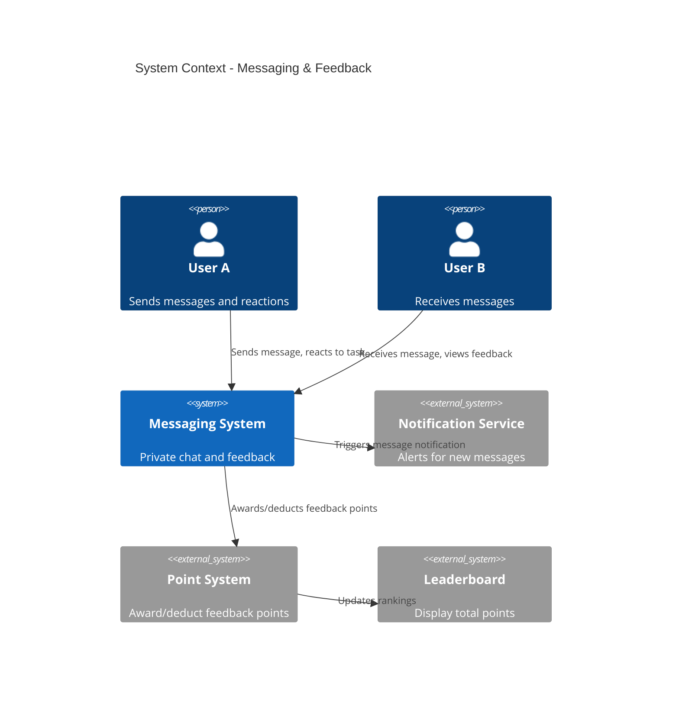
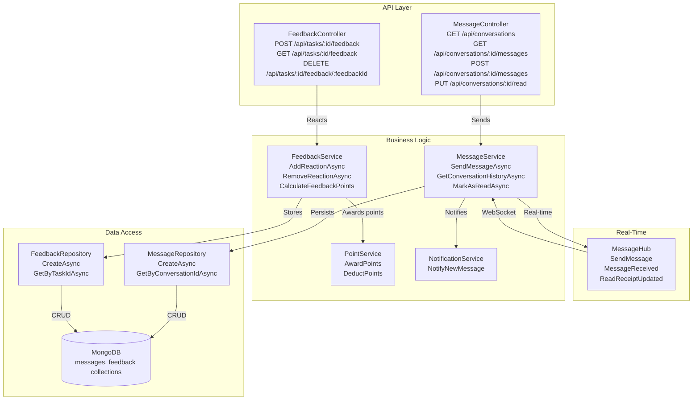
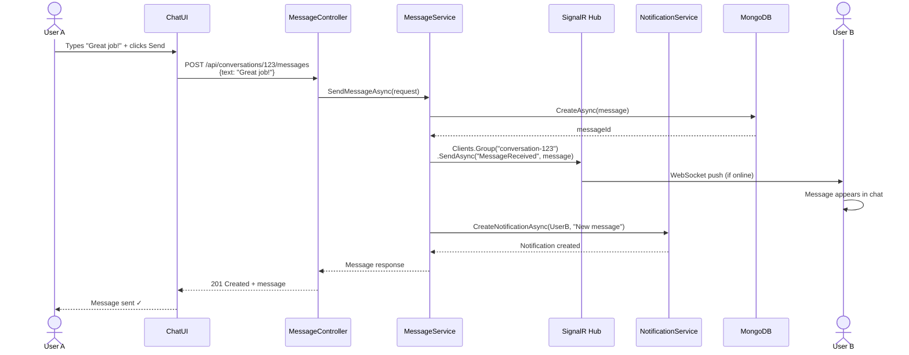
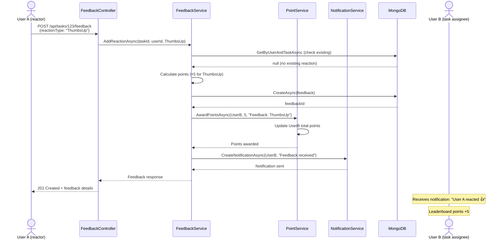
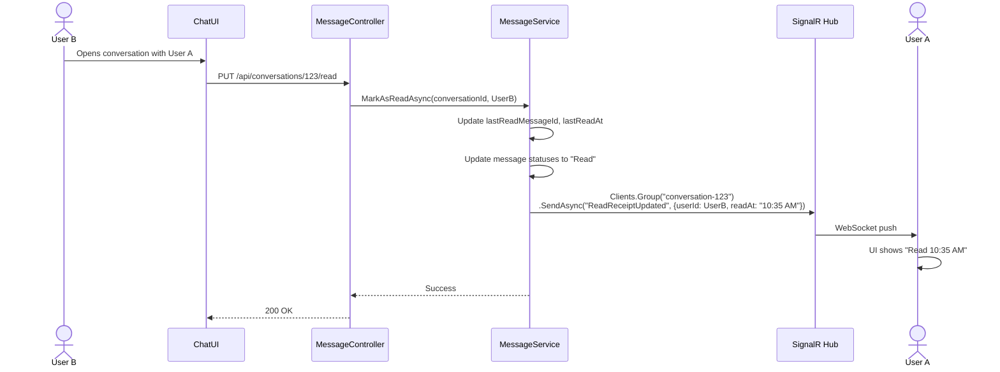

# Technical Design: FR-010 Messaging & Feedback

**Document Version:** 1.0  
**Last Updated:** December 15, 2025  
**Mode:** NEW_FEATURE  
**PRD Reference:** [../../prd.md](../../prd.md#fr-010-messaging--feedback)  
**Repository:** my-tasks-tracker-app  

---

## 1. Executive Summary

**Business value:**
- Enable real-time collaboration through private messaging between group members
- Boost engagement via quick feedback reactions (emoji-based recognition)
- Gamify social interactions by awarding points for positive feedback
- Improve accountability through persistent message history and read receipts
- Foster team culture with instant appreciation and constructive feedback

**High-level approach:**
- Build messaging service with WebSocket support for real-time delivery
- Store messages in MongoDB with conversation threading and read receipts
- Implement 7 quick feedback reactions linked to task completions
- Integrate feedback points into leaderboard system (positive +5, negative -2)
- Create chat UI with conversation list, message thread, and reaction picker
- Support rich content: text, mentions (@username), task links

**Key decisions:**
- **Real-time:** SignalR for WebSocket messaging (fallback: HTTP polling every 5s)
- **Storage:** MongoDB messages collection with compound indexes (conversationId + timestamp)
- **Read receipts:** Track last read message per user per conversation
- **Reactions:** Limited to 7 predefined emojis (prevents spam, ensures consistency)
- **Message threading:** Group messages by conversationId (auto-generated for 1:1 chats)
- **Retention:** Indefinite message history (no auto-deletion unless group deleted)
- **Feedback scope:** Reactions only on completed/approved tasks (prevents gaming system)

---

## 2. Requirements Summary (from PRD)

### Functional Requirements
- **Private messaging:** 1:1 conversations between group members
- **Real-time delivery:** Messages appear instantly without refresh
- **Read receipts:** Show "Read" status and timestamp when recipient opens message
- **Persistent history:** All messages stored and searchable
- **Quick feedback reactions:** 7 emoji options linked to task completions
  - 👍 Thumbs up (positive +5 points)
  - 👎 Thumbs down (negative -2 points)
  - 💪 Strong (positive +5 points)
  - 🎉 Party (positive +5 points)
  - ⭐ Star (positive +5 points)
  - 🔥 Fire (positive +5 points)
  - ❤️ Heart (positive +5 points)
- **Leaderboard integration:** Feedback points contribute to total score
- **Notification triggers:** New message or reaction triggers notification (FR-009)

### Non-Functional Requirements
- **Latency:** Message delivery < 2 seconds end-to-end
- **Scalability:** Support 100 concurrent WebSocket connections per server
- **Message size:** Max 2000 characters per message
- **Reaction limit:** 1 reaction per user per task (can change reaction)
- **History load:** Last 50 messages retrieved in < 500ms

### Acceptance Criteria
- User A sends "Great job!" to User B → User B receives message in < 2s
- User B reads message → User A sees "Read 10:30 AM" receipt
- User A reacts 👍 to User B's completed task → User B earns +5 points
- User A changes reaction from 👍 to 🎉 → points updated (no duplicate award)
- User reacts 👎 to task → points deducted (-2), reflected in leaderboard
- Message with @username mention → recipient receives notification

### Constraints
- Max message length: 2000 characters
- Max 1 reaction per user per task
- Reactions only on completed or approved tasks
- No group messaging in Phase 1 (1:1 only)
- No file attachments in Phase 1 (text only)

### Assumptions
- **Assume:** Users are in same group to message each other (no cross-group messaging)
- **Assume:** Message editing/deletion not supported in Phase 1
- **Inferred:** Read receipts update when user opens conversation (not per-message)
- **Inferred:** Reactions are public (visible to all group members on task detail page)

---

## 3. Current Architecture (Relevant Only)

| Component | Responsibility | Status |
|-----------|---------------|--------|
| Task Entity | Task data with status | ✅ Implemented (FR-005) |
| TaskService | Task operations | ✅ Implemented (FR-005) |
| NotificationService | Notification creation | ✅ Implemented (FR-009) |
| SignalR Hub | Real-time communication | ✅ Implemented (FR-009) |
| PointService (stub) | Point calculation | ⏳ Planned (FR-011) |

**Integration points:**
- New message triggers NotificationService.CreateNotificationAsync(type: Message)
- Feedback reaction triggers PointService.AwardPoints() or DeductPoints()
- SignalR Hub reused for real-time message delivery
- TaskRepository queried to validate task exists before allowing reactions

**Gaps/constraints:**
- No messaging infrastructure → need MessageService, MessageRepository
- No conversation management → need ConversationService
- No point tracking → stub PointService until FR-011 implemented

---

## 4. Proposed Architecture

### 4.1 System Context (C4)


### 4.2 Component Diagram


### 4.3 Data Model

**Conversation Entity:**
```json
{
  "_id": "ObjectId",
  "type": "Direct" (Phase 1 only, future: "Group"),
  "participants": [
    {
      "userId": "string",
      "lastReadMessageId": "ObjectId?",
      "lastReadAt": "DateTime?"
    }
  ],
  "groupId": "string (conversation scoped to group)",
  "lastMessage": {
    "id": "ObjectId",
    "senderId": "string",
    "text": "string (first 100 chars preview)",
    "createdAt": "DateTime"
  },
  "unreadCount": {
    "userId1": 5,
    "userId2": 0
  },
  "createdAt": "DateTime",
  "updatedAt": "DateTime"
}
```

**Message Entity:**
```json
{
  "_id": "ObjectId",
  "conversationId": "ObjectId",
  "senderId": "string",
  "senderName": "string (denormalized for display)",
  
  "text": "string (max 2000 chars)",
  "mentions": ["userId1", "userId2"] (users @mentioned in message),
  
  "metadata": {
    "taskId": "string? (if message references a task)",
    "replyToMessageId": "ObjectId? (for threading, Phase 2)"
  },
  
  "status": "Sent|Delivered|Read",
  "createdAt": "DateTime (indexed)",
  "editedAt": "DateTime? (Phase 2)",
  "deletedAt": "DateTime? (soft delete, Phase 2)"
}
```

**Feedback Entity (Task Reactions):**
```json
{
  "_id": "ObjectId",
  "taskId": "ObjectId",
  "groupId": "string",
  
  "userId": "string (user giving feedback)",
  "userName": "string (denormalized)",
  
  "reactionType": "ThumbsUp|ThumbsDown|Strong|Party|Star|Fire|Heart",
  "emoji": "string (👍👎💪🎉⭐🔥❤️)",
  
  "pointsAwarded": "int (5 for positive, -2 for negative)",
  "targetUserId": "string (task assignee receiving points)",
  
  "createdAt": "DateTime",
  "updatedAt": "DateTime? (if reaction changed)"
}
```

**MongoDB Indexes:**
```javascript
// Messages
db.messages.createIndex({ conversationId: 1, createdAt: -1 });
db.messages.createIndex({ senderId: 1, createdAt: -1 });
db.messages.createIndex({ "mentions": 1, createdAt: -1 }); // For @mention queries

// Conversations
db.conversations.createIndex({ "participants.userId": 1, updatedAt: -1 });
db.conversations.createIndex({ groupId: 1, updatedAt: -1 });

// Feedback
db.feedback.createIndex({ taskId: 1 });
db.feedback.createIndex({ userId: 1, taskId: 1 }, { unique: true }); // Ensure 1 reaction per user per task
db.feedback.createIndex({ targetUserId: 1, createdAt: -1 }); // For user feedback history
```

---

## 5. API Specification

### 5.1 Get Conversations List
**Endpoint:** `GET /api/conversations`  
**Authorization:** User  
**Query Parameters:**
```
groupId: string? (filter by group)
skip: int (default 0)
limit: int (default 20, max 50)
```

**Response:** `200 OK`
```json
{
  "success": true,
  "data": {
    "conversations": [
      {
        "id": "string",
        "type": "Direct",
        "participant": {
          "userId": "user456",
          "name": "Sarah Johnson",
          "avatarUrl": "https://cdn.example.com/avatars/sarah.jpg"
        },
        "lastMessage": {
          "text": "Thanks for completing the kitchen task!",
          "senderId": "user456",
          "createdAt": "2025-12-15T10:30:00Z"
        },
        "unreadCount": 3,
        "updatedAt": "2025-12-15T10:30:00Z"
      }
    ],
    "totalCount": 12
  }
}
```

### 5.2 Get Conversation Messages
**Endpoint:** `GET /api/conversations/{conversationId}/messages`  
**Authorization:** User (must be participant)  
**Query Parameters:**
```
before: string? (messageId, for pagination)
limit: int (default 50, max 100)
```

**Response:** `200 OK`
```json
{
  "success": true,
  "data": {
    "messages": [
      {
        "id": "string",
        "senderId": "user123",
        "senderName": "John Doe",
        "text": "Great job on the kitchen! 👍",
        "mentions": ["user456"],
        "metadata": {
          "taskId": "task789"
        },
        "status": "Read",
        "createdAt": "2025-12-15T10:30:00Z"
      }
    ],
    "hasMore": false
  }
}
```

### 5.3 Send Message
**Endpoint:** `POST /api/conversations/{conversationId}/messages`  
**Authorization:** User (must be participant)  
**Request Body:**
```json
{
  "text": "string (required, max 2000 chars)",
  "mentions": ["userId1"] (optional),
  "taskId": "string? (optional, links message to task)"
}
```

**Response:** `201 Created`
```json
{
  "success": true,
  "data": {
    "id": "string",
    "conversationId": "string",
    "senderId": "string",
    "senderName": "John Doe",
    "text": "Great job on the kitchen! 👍",
    "mentions": ["user456"],
    "status": "Sent",
    "createdAt": "2025-12-15T10:30:00Z"
  }
}
```

**Business Logic:**
- Parse text for @username mentions and convert to userIds
- If taskId provided, validate task exists and user has access
- Send via SignalR to recipient if online
- Create notification for recipient and mentioned users
- Update conversation.lastMessage and updatedAt

**Validation Errors:** `400 Bad Request`
- Text empty or > 2000 chars
- ConversationId not found
- User not participant in conversation

### 5.4 Create or Get Direct Conversation
**Endpoint:** `POST /api/conversations/direct`  
**Authorization:** User  
**Request Body:**
```json
{
  "participantUserId": "string (other user)",
  "groupId": "string"
}
```

**Response:** `200 OK` (if exists) or `201 Created` (if new)
```json
{
  "success": true,
  "data": {
    "id": "string",
    "type": "Direct",
    "participants": [
      { "userId": "user123", "lastReadAt": null },
      { "userId": "user456", "lastReadAt": "2025-12-15T09:00:00Z" }
    ],
    "createdAt": "2025-12-15T08:00:00Z"
  }
}
```

### 5.5 Mark Conversation as Read
**Endpoint:** `PUT /api/conversations/{conversationId}/read`  
**Authorization:** User (must be participant)  
**Response:** `200 OK`
```json
{
  "success": true,
  "data": {
    "conversationId": "string",
    "lastReadMessageId": "string",
    "lastReadAt": "2025-12-15T10:35:00Z"
  }
}
```

**Business Logic:**
- Update participant.lastReadMessageId to latest message in conversation
- Reset unreadCount for this user to 0
- Send SignalR event to other participant: "ReadReceiptUpdated"
- Update message statuses from "Delivered" to "Read"

### 5.6 Add Task Feedback (Reaction)
**Endpoint:** `POST /api/tasks/{taskId}/feedback`  
**Authorization:** User (group member)  
**Request Body:**
```json
{
  "reactionType": "ThumbsUp|ThumbsDown|Strong|Party|Star|Fire|Heart"
}
```

**Response:** `201 Created`
```json
{
  "success": true,
  "data": {
    "id": "string",
    "taskId": "string",
    "userId": "string",
    "userName": "John Doe",
    "reactionType": "ThumbsUp",
    "emoji": "👍",
    "pointsAwarded": 5,
    "targetUserId": "user456",
    "createdAt": "2025-12-15T10:40:00Z"
  }
}
```

**Business Logic:**
- Validate task exists and is completed/approved
- Check if user already reacted → update reaction if exists (upsert)
- If changing reaction: revert old points, apply new points
- Calculate points: positive reactions (+5), negative (-2)
- Award/deduct points via PointService.AwardPoints(targetUserId, points, feedbackId)
- Create notification for target user: "John reacted 👍 to your task"
- Broadcast SignalR event to group: "FeedbackAdded"

**Validation Errors:** `400 Bad Request`
- Task not completed/approved → "Can only react to completed tasks"
- Invalid reactionType → "Invalid reaction type"

**Edge Case:** `409 Conflict`
- User already reacted (should be upsert, but edge case for race conditions)

### 5.7 Get Task Feedback
**Endpoint:** `GET /api/tasks/{taskId}/feedback`  
**Authorization:** User (group member)  
**Response:** `200 OK`
```json
{
  "success": true,
  "data": {
    "taskId": "string",
    "reactions": [
      {
        "id": "string",
        "userId": "user123",
        "userName": "John Doe",
        "reactionType": "ThumbsUp",
        "emoji": "👍",
        "pointsAwarded": 5,
        "createdAt": "2025-12-15T10:40:00Z"
      },
      {
        "id": "string",
        "userId": "user789",
        "userName": "Sarah Lee",
        "reactionType": "Party",
        "emoji": "🎉",
        "pointsAwarded": 5,
        "createdAt": "2025-12-15T11:00:00Z"
      }
    ],
    "summary": {
      "totalPoints": 10,
      "reactionCounts": {
        "ThumbsUp": 1,
        "Party": 1
      }
    }
  }
}
```

### 5.8 Remove Feedback (Undo Reaction)
**Endpoint:** `DELETE /api/tasks/{taskId}/feedback`  
**Authorization:** User (must be reaction creator)  
**Response:** `200 OK`
```json
{
  "success": true,
  "data": {
    "pointsReverted": -5,
    "message": "Reaction removed"
  }
}
```

**Business Logic:**
- Find feedback by taskId + userId
- Revert points: call PointService.DeductPoints(targetUserId, abs(pointsAwarded))
- Soft delete feedback record (keep for audit)
- Notify target user: "John removed their reaction"

---

## 6. Feedback Point Calculation

### 6.1 Reaction Points Mapping
```typescript
const REACTION_POINTS: Record<ReactionType, number> = {
  ThumbsUp: 5,
  ThumbsDown: -2,
  Strong: 5,
  Party: 5,
  Star: 5,
  Fire: 5,
  Heart: 5
};
```

### 6.2 Point Award Logic
```csharp
public class FeedbackService
{
    public async Task<Feedback> AddReactionAsync(string taskId, string userId, ReactionType reaction)
    {
        // 1. Get task and validate
        var task = await _taskRepository.GetByIdAsync(taskId);
        if (task.Status != TaskStatus.Completed && task.Status != TaskStatus.Approved)
            throw new ValidationException("Can only react to completed tasks");
        
        // 2. Check existing reaction (upsert)
        var existingFeedback = await _feedbackRepository.GetByUserAndTaskAsync(userId, taskId);
        
        if (existingFeedback != null)
        {
            // Revert old points
            await _pointService.DeductPointsAsync(
                task.AssignedTo, 
                Math.Abs(existingFeedback.PointsAwarded),
                $"Feedback reverted: {existingFeedback.ReactionType}"
            );
        }
        
        // 3. Calculate new points
        var points = REACTION_POINTS[reaction];
        
        // 4. Create or update feedback
        var feedback = new Feedback
        {
            TaskId = taskId,
            GroupId = task.GroupId,
            UserId = userId,
            UserName = await _userRepository.GetUserNameAsync(userId),
            ReactionType = reaction,
            Emoji = GetEmoji(reaction),
            PointsAwarded = points,
            TargetUserId = task.AssignedTo,
            CreatedAt = DateTime.UtcNow
        };
        
        if (existingFeedback != null)
        {
            feedback.Id = existingFeedback.Id;
            feedback.UpdatedAt = DateTime.UtcNow;
            await _feedbackRepository.UpdateAsync(feedback);
        }
        else
        {
            await _feedbackRepository.CreateAsync(feedback);
        }
        
        // 5. Award points
        await _pointService.AwardPointsAsync(
            task.AssignedTo, 
            points,
            $"Feedback: {reaction} from {feedback.UserName}"
        );
        
        // 6. Notify target user
        await _notificationService.CreateNotificationAsync(new CreateNotificationRequest
        {
            UserId = task.AssignedTo,
            Type = NotificationType.Feedback,
            Title = "You received feedback 🌟",
            Body = $"{feedback.UserName} reacted {feedback.Emoji} to your task",
            Metadata = new { taskId, feedbackId = feedback.Id },
            ActionUrl = $"/tasks/{taskId}"
        });
        
        return feedback;
    }
}
```

### 6.3 Edge Cases
| Scenario | Points Awarded | Notes |
|----------|----------------|-------|
| User reacts 👍 (+5) then changes to 🎉 (+5) | 0 net change | Old +5 reverted, new +5 applied |
| User reacts 👍 (+5) then changes to 👎 (-2) | -7 net change | Old +5 reverted, new -2 applied |
| User reacts 👎 (-2) then removes reaction | +2 (revert) | Negative points reverted |
| User reacts to own task | 0 (blocked) | Validation error: "Cannot react to own task" |
| Multiple users react 👍 to same task | +5 per user | Each user's reaction counted separately |

---

## 7. Real-Time Messaging Flow

### 7.1 SignalR Hub Implementation
```csharp
public class MessageHub : Hub
{
    public async Task JoinConversation(string conversationId)
    {
        await Groups.AddToGroupAsync(Context.ConnectionId, $"conversation-{conversationId}");
    }
    
    public async Task LeaveConversation(string conversationId)
    {
        await Groups.RemoveFromGroupAsync(Context.ConnectionId, $"conversation-{conversationId}");
    }
    
    public async Task SendTypingIndicator(string conversationId, bool isTyping)
    {
        await Clients.OthersInGroup($"conversation-{conversationId}")
            .SendAsync("UserTyping", Context.User.Identity.Name, isTyping);
    }
}
```

### 7.2 MessageService Integration
```csharp
public class MessageService
{
    public async Task<Message> SendMessageAsync(SendMessageRequest request)
    {
        // 1. Create message
        var message = new Message
        {
            ConversationId = request.ConversationId,
            SenderId = request.SenderId,
            SenderName = await _userRepository.GetUserNameAsync(request.SenderId),
            Text = request.Text,
            Mentions = ParseMentions(request.Text),
            Metadata = new { TaskId = request.TaskId },
            Status = MessageStatus.Sent,
            CreatedAt = DateTime.UtcNow
        };
        
        await _messageRepository.CreateAsync(message);
        
        // 2. Update conversation
        await _conversationService.UpdateLastMessageAsync(request.ConversationId, message);
        
        // 3. Send via SignalR (real-time)
        await _messageHub.Clients.Group($"conversation-{request.ConversationId}")
            .SendAsync("MessageReceived", message);
        
        // 4. Create notifications for offline users and mentions
        var conversation = await _conversationRepository.GetByIdAsync(request.ConversationId);
        foreach (var participant in conversation.Participants.Where(p => p.UserId != request.SenderId))
        {
            await _notificationService.CreateNotificationAsync(new CreateNotificationRequest
            {
                UserId = participant.UserId,
                Type = NotificationType.Message,
                Title = $"{message.SenderName} sent a message 💬",
                Body = TruncateText(message.Text, 100),
                Metadata = new { conversationId = request.ConversationId, messageId = message.Id },
                ActionUrl = $"/messages/{request.ConversationId}"
            });
        }
        
        return message;
    }
}
```

---

## 8. Implementation Plan

### Phase 1: Core Messaging (3 days)
1. Create Message, Conversation entities and repositories
2. Implement MessageService (Send, GetHistory, MarkAsRead)
3. Add MessageController with CRUD endpoints
4. Set up SignalR MessageHub
5. Unit tests for MessageService

### Phase 2: Real-Time Delivery (2 days)
1. Implement SignalR message broadcasting
2. Add typing indicators
3. Implement read receipt updates via SignalR
4. Add WebSocket connection management (reconnect logic)
5. Test real-time delivery across multiple clients

### Phase 3: Feedback Reactions (2 days)
1. Create Feedback entity and FeedbackRepository
2. Implement FeedbackService with point calculation
3. Add FeedbackController endpoints
4. Integrate with PointService (stub)
5. Unit tests for feedback point logic

### Phase 4: UI Components (4 days)
1. Build ConversationList component (sidebar)
2. Build MessageThread component (chat view)
3. Add MessageInput with @mention autocomplete
4. Build ReactionPicker component (emoji selector)
5. Add FeedbackDisplay on task detail page
6. Test messaging and reactions end-to-end

### Phase 5: Notifications & Polish (2 days)
1. Integrate message notifications (FR-009)
2. Add unread badge count to conversations list
3. Implement message pagination (load more)
4. Add error handling and retry logic
5. E2E tests for messaging and feedback

**Total Estimate:** 13 days (1 developer)

---

## 9. Sequence Diagrams

### 9.1 Send Message Flow


### 9.2 Add Feedback Reaction Flow


### 9.3 Read Receipt Update Flow


---

## 10. Error Handling

| Scenario | HTTP Code | Error Message | Retry? |
|----------|-----------|---------------|--------|
| Message text empty | 400 | "Message text required" | No |
| Message > 2000 chars | 400 | "Message exceeds 2000 character limit" | No |
| User not in conversation | 403 | "You are not a participant in this conversation" | No |
| Conversation not found | 404 | "Conversation not found" | No |
| React to uncompleted task | 400 | "Can only react to completed tasks" | No |
| React to own task | 400 | "Cannot react to your own task" | No |
| Invalid reaction type | 400 | "Invalid reaction type" | No |
| SignalR connection lost | N/A | Reconnect automatically | Yes (auto) |
| Message send timeout | 504 | "Message send timeout, please retry" | Yes |

---

## 11. Testing Strategy

### Unit Tests (MessageService)
- ✅ SendMessageAsync with @mentions → parses userIds correctly
- ✅ SendMessageAsync with taskId → links message to task
- ✅ MarkAsReadAsync → updates lastReadMessageId and resets unreadCount
- ✅ GetConversationHistoryAsync with pagination → returns correct messages

### Unit Tests (FeedbackService)
- ✅ AddReactionAsync with ThumbsUp → awards +5 points
- ✅ AddReactionAsync with ThumbsDown → deducts -2 points
- ✅ AddReactionAsync (change reaction 👍 → 🎉) → reverts old, applies new
- ✅ AddReactionAsync to own task → throws ValidationException
- ✅ AddReactionAsync to pending task → throws ValidationException
- ✅ RemoveReactionAsync → reverts points correctly

### Integration Tests (MessageController)
- ✅ POST /api/conversations/:id/messages → creates message, returns 201
- ✅ GET /api/conversations/:id/messages → returns paginated messages
- ✅ PUT /api/conversations/:id/read → updates read receipt
- ✅ POST /api/conversations/:id/messages as non-participant → 403

### Integration Tests (FeedbackController)
- ✅ POST /api/tasks/:id/feedback → creates feedback, awards points
- ✅ GET /api/tasks/:id/feedback → returns all reactions with summary
- ✅ DELETE /api/tasks/:id/feedback → removes reaction, reverts points
- ✅ POST /api/tasks/:id/feedback (duplicate reaction) → updates existing

### E2E Tests
- ✅ User A sends message → User B receives in < 2s (real-time)
- ✅ User B opens conversation → User A sees "Read" receipt
- ✅ User A reacts 👍 to User B's task → User B gains +5 points in leaderboard
- ✅ User A changes reaction 👍 → 👎 → points updated correctly (-7 net)
- ✅ WebSocket disconnects → reconnects automatically, no messages lost

---

## 12. Open Questions

1. **Message search:** Should users be able to search message history?
   - **Recommendation:** Phase 2 – add full-text search with MongoDB text index

2. **Message editing:** Allow users to edit sent messages?
   - **Recommendation:** Phase 2 – add "Edited" label, store edit history

3. **Message deletion:** Allow users to delete messages?
   - **Recommendation:** Phase 2 – soft delete with "Message deleted" placeholder

4. **Group messaging:** When should we support group chats (3+ participants)?
   - **Recommendation:** Phase 2 (FR-015 Multi-Group Support)

5. **Reaction spam prevention:** Limit reaction changes per task?
   - **Recommendation:** Yes – max 3 reaction changes per user per task

6. **Anonymous feedback:** Should reactions be anonymous?
   - **Recommendation:** No – transparency fosters accountability

---

## 13. Dependencies & Risks

### Dependencies
- ✅ FR-001 (Authentication) → user authentication for messaging
- ✅ FR-009 (Notifications) → message and feedback notifications
- ⏳ FR-011 (Leaderboard) → point tracking integration (can stub)
- ⏳ FR-005 (Task Creation) → task validation for feedback
- ⏳ SignalR setup → WebSocket infrastructure

### Risks
| Risk | Probability | Impact | Mitigation |
|------|-------------|--------|------------|
| SignalR scaling issues | Medium | High | Use Redis backplane for multi-server setup |
| Message delivery failures | Low | Medium | Implement message queue with retry logic |
| Reaction spam (rapid changes) | Medium | Low | Rate limit: max 3 changes per task per user |
| Negative feedback abuse | High | High | Admin can remove feedback, flag users for review |
| WebSocket connection drops | High | Medium | Auto-reconnect + HTTP polling fallback |

---

## 14. Future Enhancements

- **Rich text formatting:** Bold, italic, links in messages
- **File attachments:** Images, documents (max 10MB)
- **Voice messages:** Record and send audio clips (30s max)
- **Message reactions:** Like/love individual messages (not just tasks)
- **Group chats:** Support 3+ participants in conversation
- **Message search:** Full-text search across conversation history
- **Message encryption:** End-to-end encryption for privacy
- **Scheduled messages:** Send message at specific time
- **Message templates:** Quick replies for common messages
- **Feedback analytics:** Track feedback trends per user

---

**END OF DESIGN DOCUMENT**

This messaging and feedback system enables real-time collaboration, social recognition, and gamified interactions to boost engagement and team cohesion.
