# Technical Design: FR-011 Leaderboard & Gamification

**Document Version:** 1.0  
**Last Updated:** December 15, 2025  
**Mode:** NEW_FEATURE  
**PRD Reference:** [../../prd.md](../../prd.md#fr-011-leaderboard--gamification)  
**Repository:** my-tasks-tracker-app  

---

## 1. Executive Summary

**Business value:**
- Drive engagement through competitive rankings and achievement recognition
- Motivate consistent task completion via point-based rewards system
- Foster team culture with visible progress tracking and badges
- Reduce task abandonment with gamified incentives
- Provide admins with engagement metrics through leaderboard analytics

**High-level approach:**
- Build comprehensive point system: task completion + on-time bonus + feedback points
- Create leaderboard service with configurable time periods (weekly, monthly, quarterly, yearly)
- Implement badge system with milestone-based achievements
- Design responsive leaderboard UI with top 3 highlights (🥇🥈🥉)
- Support leaderboard resets with historical archiving
- Calculate completion percentage and streak tracking

**Key decisions:**
- **Point formula:** `(Difficulty × 10) + On-Time Bonus (10%) + Feedback Points`
- **Leaderboard scope:** Group-specific (each group has independent rankings)
- **Reset frequency:** Configurable per group (default: monthly on 1st day)
- **Historical data:** Archive leaderboards on reset for analytics
- **Badge criteria:** System-defined milestones (10, 50, 100, 500, 1000 tasks)
- **Real-time updates:** Leaderboard updates immediately after point changes (via cache invalidation)
- **Tie-breaking:** If points equal, rank by completion date (earlier = higher rank)

---

## 2. Requirements Summary (from PRD)

### Functional Requirements
- **Point formula:** `(Difficulty × 10) + On-Time Bonus (10%) + Feedback Points`
- **Leaderboard views:** Weekly, monthly, quarterly, yearly rankings
- **Display columns:** Rank, name, points, completion %, badges
- **Top 3 distinction:** 🥇 Gold, 🥈 Silver, 🥉 Bronze medals
- **Badge system:** Milestones like "100 tasks completed", "Perfect week"
- **Configurable resets:** Leaderboard resets monthly (admin can customize)
- **Group-specific:** Each group has independent leaderboard

### Non-Functional Requirements
- **Performance:** Leaderboard query < 200ms for 100 users
- **Real-time updates:** Rank changes reflected within 5s of point award
- **Scalability:** Support 1000 users per group
- **Cache strategy:** Redis cache with 5-minute TTL
- **Accuracy:** Point calculations must be atomic (no race conditions)

### Acceptance Criteria
- User completes difficulty 7 task on-time → earns 70 + 7 = 77 points
- User receives 👍 feedback → earns +5 points, rank updates immediately
- User completes 100th task → unlocks "Centurion" badge
- Leaderboard resets on Dec 1st → new month starts with 0 points, Nov data archived
- Top 3 users displayed with gold/silver/bronze medals
- User with 100 points and 90% completion rate ranks higher than user with 100 points and 80% completion

### Constraints
- Leaderboard limited to top 100 users in UI (full data available via export)
- Badge images < 50KB each
- Point calculations must use transactions to prevent double-counting
- Historical leaderboard data retained for 2 years

### Assumptions
- **Assume:** Points never decrease except for negative feedback (-2 per 👎)
- **Assume:** Completion % calculated from assigned tasks (not group total)
- **Inferred:** Badge unlocks trigger notification to user
- **Inferred:** Leaderboard rankings cached in Redis, invalidated on point change

---

## 3. Current Architecture (Relevant Only)

| Component | Responsibility | Status |
|-----------|---------------|--------|
| Task Entity | Task data with difficulty and status | ✅ Implemented (FR-005) |
| TaskService | Task completion logic | ✅ Implemented (FR-008) |
| FeedbackService | Feedback reactions | ✅ Implemented (FR-010) |
| NotificationService | User notifications | ✅ Implemented (FR-009) |

**Integration points:**
- Task approval (FR-008) triggers PointService.AwardPoints()
- Feedback reaction (FR-010) triggers PointService.AwardPoints() or DeductPoints()
- LeaderboardService queries point totals and calculates rankings
- Badge unlock triggers NotificationService.CreateNotificationAsync()

**Gaps/constraints:**
- No point tracking → need PointService, UserPoints entity
- No leaderboard logic → need LeaderboardService
- No badge system → need BadgeService, Badge entity
- No caching layer → need Redis integration

---

## 4. Proposed Architecture

### 4.1 System Context (C4)


### 4.2 Component Diagram


### 4.3 Data Model

**UserPoints Entity:**
```json
{
  "_id": "ObjectId",
  "userId": "string",
  "groupId": "string",
  "period": "string (e.g., '2025-12' for monthly, '2025-W50' for weekly)",
  
  "points": {
    "total": 385,
    "breakdown": {
      "taskCompletion": 350,
      "onTimeBonus": 35,
      "feedbackReceived": 20,
      "feedbackGiven": 0 (future: points for giving feedback)
    }
  },
  
  "stats": {
    "tasksCompleted": 35,
    "tasksAssigned": 40,
    "completionRate": 87.5,
    "onTimeCount": 30,
    "onTimeRate": 85.7,
    "currentStreak": 7 (consecutive days with completed tasks),
    "longestStreak": 14
  },
  
  "rank": 2 (calculated field, not stored but computed),
  "previousRank": 3,
  
  "createdAt": "DateTime",
  "updatedAt": "DateTime"
}
```

**LeaderboardSnapshot Entity (Historical Archive):**
```json
{
  "_id": "ObjectId",
  "groupId": "string",
  "period": "string (e.g., '2025-11-monthly')",
  "periodType": "Weekly|Monthly|Quarterly|Yearly",
  "startDate": "DateTime",
  "endDate": "DateTime",
  
  "rankings": [
    {
      "rank": 1,
      "userId": "string",
      "userName": "string",
      "points": 450,
      "completionRate": 95.0,
      "tasksCompleted": 42,
      "badges": ["badge1", "badge2"]
    }
  ],
  
  "archivedAt": "DateTime"
}
```

**Badge Entity:**
```json
{
  "_id": "ObjectId",
  "code": "CENTURION" (unique identifier),
  "name": "Centurion",
  "description": "Complete 100 tasks",
  "iconUrl": "https://cdn.example.com/badges/centurion.png",
  "rarity": "Common|Uncommon|Rare|Epic|Legendary",
  
  "criteria": {
    "type": "TaskCount|Streak|OnTimeRate|FeedbackReceived",
    "threshold": 100,
    "comparison": "GreaterThanOrEqual"
  },
  
  "isActive": true,
  "createdAt": "DateTime"
}
```

**UserBadge Entity (User's earned badges):**
```json
{
  "_id": "ObjectId",
  "userId": "string",
  "badgeId": "ObjectId",
  "groupId": "string? (null for global badges)",
  
  "unlockedAt": "DateTime",
  "progress": 100 (percentage toward next tier, if applicable)
}
```

**MongoDB Indexes:**
```javascript
// UserPoints
db.userPoints.createIndex({ groupId: 1, period: 1, "points.total": -1 }); // Leaderboard query
db.userPoints.createIndex({ userId: 1, groupId: 1, period: 1 }, { unique: true }); // User lookup
db.userPoints.createIndex({ groupId: 1, period: 1, "stats.completionRate": -1 }); // Tie-breaking

// LeaderboardSnapshot
db.leaderboardSnapshots.createIndex({ groupId: 1, period: -1 });
db.leaderboardSnapshots.createIndex({ groupId: 1, periodType: 1, endDate: -1 });

// UserBadge
db.userBadges.createIndex({ userId: 1, groupId: 1 });
db.userBadges.createIndex({ userId: 1, badgeId: 1 }, { unique: true }); // Prevent duplicate unlocks
```

---

## 5. API Specification

### 5.1 Get Leaderboard Rankings
**Endpoint:** `GET /api/leaderboard/{groupId}`  
**Authorization:** User (group member)  
**Query Parameters:**
```
period: string? (default "current-month", options: "current-week", "current-month", "current-quarter", "current-year", "2025-11", "2025-W50")
limit: int? (default 100, max 100)
```

**Response:** `200 OK`
```json
{
  "success": true,
  "data": {
    "period": "2025-12",
    "periodType": "Monthly",
    "startDate": "2025-12-01T00:00:00Z",
    "endDate": "2025-12-31T23:59:59Z",
    "rankings": [
      {
        "rank": 1,
        "userId": "user123",
        "userName": "Sarah Johnson",
        "avatarUrl": "https://cdn.example.com/avatars/sarah.jpg",
        "points": 450,
        "breakdown": {
          "taskCompletion": 400,
          "onTimeBonus": 40,
          "feedbackReceived": 10
        },
        "stats": {
          "tasksCompleted": 40,
          "completionRate": 95.2,
          "currentStreak": 12
        },
        "badges": [
          {
            "code": "CENTURION",
            "name": "Centurion",
            "iconUrl": "https://cdn.example.com/badges/centurion.png"
          }
        ],
        "previousRank": 2,
        "rankChange": "+1"
      },
      {
        "rank": 2,
        "userId": "user456",
        "userName": "John Doe",
        "points": 385,
        "breakdown": {
          "taskCompletion": 350,
          "onTimeBonus": 35,
          "feedbackReceived": 0
        },
        "stats": {
          "tasksCompleted": 35,
          "completionRate": 87.5,
          "currentStreak": 7
        },
        "badges": [],
        "previousRank": 1,
        "rankChange": "-1"
      }
    ],
    "currentUserRank": {
      "rank": 5,
      "points": 280,
      "rankChange": "0"
    },
    "totalParticipants": 23
  }
}
```

### 5.2 Get User Profile Stats
**Endpoint:** `GET /api/leaderboard/users/{userId}/stats`  
**Authorization:** User (group member)  
**Query Parameters:**
```
groupId: string (required)
period: string? (default "current-month")
```

**Response:** `200 OK`
```json
{
  "success": true,
  "data": {
    "userId": "user123",
    "userName": "Sarah Johnson",
    "groupId": "group789",
    "period": "2025-12",
    
    "points": {
      "total": 450,
      "breakdown": {
        "taskCompletion": 400,
        "onTimeBonus": 40,
        "feedbackReceived": 10
      }
    },
    
    "stats": {
      "tasksCompleted": 40,
      "tasksAssigned": 42,
      "completionRate": 95.2,
      "onTimeCount": 38,
      "onTimeRate": 95.0,
      "currentStreak": 12,
      "longestStreak": 18
    },
    
    "rank": 1,
    "previousRank": 2,
    "totalParticipants": 23,
    
    "badges": [
      {
        "code": "CENTURION",
        "name": "Centurion",
        "description": "Complete 100 tasks",
        "iconUrl": "https://cdn.example.com/badges/centurion.png",
        "unlockedAt": "2025-12-10T14:30:00Z"
      }
    ]
  }
}
```

### 5.3 Get Leaderboard History
**Endpoint:** `GET /api/leaderboard/{groupId}/history`  
**Authorization:** User (group member)  
**Query Parameters:**
```
periodType: string? (default "Monthly", options: "Weekly", "Monthly", "Quarterly", "Yearly")
limit: int? (default 12, max 24)
```

**Response:** `200 OK`
```json
{
  "success": true,
  "data": {
    "history": [
      {
        "period": "2025-11",
        "periodType": "Monthly",
        "startDate": "2025-11-01T00:00:00Z",
        "endDate": "2025-11-30T23:59:59Z",
        "winner": {
          "userId": "user123",
          "userName": "Sarah Johnson",
          "points": 520
        },
        "totalParticipants": 22
      },
      {
        "period": "2025-10",
        "periodType": "Monthly",
        "winner": {
          "userId": "user456",
          "userName": "John Doe",
          "points": 480
        },
        "totalParticipants": 20
      }
    ]
  }
}
```

### 5.4 Reset Leaderboard
**Endpoint:** `POST /api/leaderboard/{groupId}/reset`  
**Authorization:** Admin only  
**Request Body:**
```json
{
  "period": "current-month",
  "archiveSnapshot": true
}
```

**Response:** `200 OK`
```json
{
  "success": true,
  "data": {
    "groupId": "group789",
    "periodReset": "2025-12",
    "snapshotId": "snapshot123",
    "resetAt": "2025-12-15T10:00:00Z",
    "affectedUsers": 23
  }
}
```

**Business Logic:**
1. Create LeaderboardSnapshot with current rankings
2. Archive snapshot to MongoDB
3. Reset all UserPoints for the period to 0
4. Clear Redis cache for the group
5. Send notification to all group members: "Leaderboard reset! New month begins 🎯"

### 5.5 Get Available Badges
**Endpoint:** `GET /api/badges/available`  
**Authorization:** User  
**Query Parameters:**
```
groupId: string? (filter by group-specific badges)
```

**Response:** `200 OK`
```json
{
  "success": true,
  "data": {
    "badges": [
      {
        "id": "badge1",
        "code": "FIRST_TASK",
        "name": "Getting Started",
        "description": "Complete your first task",
        "iconUrl": "https://cdn.example.com/badges/first-task.png",
        "rarity": "Common",
        "criteria": {
          "type": "TaskCount",
          "threshold": 1
        }
      },
      {
        "id": "badge2",
        "code": "CENTURION",
        "name": "Centurion",
        "description": "Complete 100 tasks",
        "iconUrl": "https://cdn.example.com/badges/centurion.png",
        "rarity": "Rare",
        "criteria": {
          "type": "TaskCount",
          "threshold": 100
        }
      }
    ]
  }
}
```

### 5.6 Get User Badges
**Endpoint:** `GET /api/badges/users/{userId}`  
**Authorization:** User (group member)  
**Query Parameters:**
```
groupId: string? (filter by group)
```

**Response:** `200 OK`
```json
{
  "success": true,
  "data": {
    "userId": "user123",
    "badges": [
      {
        "badge": {
          "code": "CENTURION",
          "name": "Centurion",
          "description": "Complete 100 tasks",
          "iconUrl": "https://cdn.example.com/badges/centurion.png",
          "rarity": "Rare"
        },
        "unlockedAt": "2025-12-10T14:30:00Z",
        "progress": 100
      }
    ],
    "totalBadges": 5,
    "totalAvailable": 15,
    "progressPercent": 33.3
  }
}
```

---

## 6. Point Calculation Logic

### 6.1 Point Sources
```typescript
// Point award events
enum PointSource {
  TaskCompletion = "TaskCompletion",      // Base points from task difficulty
  OnTimeBonus = "OnTimeBonus",            // 10% bonus for on-time completion
  FeedbackReceived = "FeedbackReceived",  // +5 or -2 from reactions
  AdminBonus = "AdminBonus"               // Manual point award (future)
}

// Point calculation
interface PointCalculation {
  taskCompletion: number;    // difficulty × 10
  onTimeBonus: number;       // taskCompletion × 0.1 (if on-time)
  feedbackReceived: number;  // sum of all feedback points
  total: number;             // sum of all sources
}
```

### 6.2 Point Service Implementation
```csharp
public class PointService
{
    public async Task AwardPointsAsync(string userId, string groupId, int points, PointSource source, string reference)
    {
        var period = GetCurrentPeriod(); // e.g., "2025-12"
        
        // Get or create UserPoints for current period
        var userPoints = await _userPointsRepository.GetOrCreateAsync(userId, groupId, period);
        
        // Update points breakdown
        switch (source)
        {
            case PointSource.TaskCompletion:
                userPoints.Points.Breakdown.TaskCompletion += points;
                userPoints.Stats.TasksCompleted++;
                break;
            case PointSource.OnTimeBonus:
                userPoints.Points.Breakdown.OnTimeBonus += points;
                userPoints.Stats.OnTimeCount++;
                break;
            case PointSource.FeedbackReceived:
                userPoints.Points.Breakdown.FeedbackReceived += points;
                break;
        }
        
        // Recalculate total
        userPoints.Points.Total = userPoints.Points.Breakdown.TaskCompletion +
                                  userPoints.Points.Breakdown.OnTimeBonus +
                                  userPoints.Points.Breakdown.FeedbackReceived;
        
        // Update completion rate
        var assignedTasks = await _taskRepository.CountAssignedTasksAsync(userId, groupId, period);
        userPoints.Stats.TasksAssigned = assignedTasks;
        userPoints.Stats.CompletionRate = (double)userPoints.Stats.TasksCompleted / assignedTasks * 100;
        userPoints.Stats.OnTimeRate = (double)userPoints.Stats.OnTimeCount / userPoints.Stats.TasksCompleted * 100;
        
        // Update streak
        await UpdateStreakAsync(userPoints, userId, groupId);
        
        userPoints.UpdatedAt = DateTime.UtcNow;
        
        // Save to database (transaction)
        await _userPointsRepository.UpdateAsync(userPoints);
        
        // Invalidate leaderboard cache
        await _cache.RemoveAsync($"leaderboard:{groupId}:{period}");
        
        // Check badge unlocks
        await _badgeService.CheckBadgeUnlockAsync(userId, groupId);
        
        // Log point transaction for audit
        await _pointTransactionRepository.CreateAsync(new PointTransaction
        {
            UserId = userId,
            GroupId = groupId,
            Period = period,
            Points = points,
            Source = source,
            Reference = reference,
            CreatedAt = DateTime.UtcNow
        });
    }
    
    private async Task UpdateStreakAsync(UserPoints userPoints, string userId, string groupId)
    {
        var today = DateOnly.FromDateTime(DateTime.UtcNow);
        var yesterday = today.AddDays(-1);
        
        var completedToday = await _taskRepository.HasCompletedTaskOnDateAsync(userId, groupId, today);
        var completedYesterday = await _taskRepository.HasCompletedTaskOnDateAsync(userId, groupId, yesterday);
        
        if (completedToday)
        {
            if (completedYesterday)
            {
                // Continue streak
                userPoints.Stats.CurrentStreak++;
            }
            else
            {
                // New streak
                userPoints.Stats.CurrentStreak = 1;
            }
            
            // Update longest streak
            if (userPoints.Stats.CurrentStreak > userPoints.Stats.LongestStreak)
            {
                userPoints.Stats.LongestStreak = userPoints.Stats.CurrentStreak;
            }
        }
        else
        {
            // Streak broken
            userPoints.Stats.CurrentStreak = 0;
        }
    }
}
```

### 6.3 Example Point Calculations
| Scenario | Task Points | On-Time Bonus | Feedback | Total | Notes |
|----------|-------------|---------------|----------|-------|-------|
| Difficulty 7, on-time, no feedback | 70 | 7 | 0 | 77 | Standard completion |
| Difficulty 7, late, no feedback | 70 | 0 | 0 | 70 | No bonus |
| Difficulty 10, on-time, 2× 👍 feedback | 100 | 10 | 10 | 120 | Max task points + feedback |
| Difficulty 5, on-time, 1× 👎 feedback | 50 | 5 | -2 | 53 | Negative feedback |
| Difficulty 3, late, 3× 🎉 feedback | 30 | 0 | 15 | 45 | High feedback compensates |

---

## 7. Leaderboard Ranking Algorithm

### 7.1 Ranking Logic
```csharp
public class LeaderboardService
{
    public async Task<List<LeaderboardEntry>> GetRankingsAsync(string groupId, string period, int limit = 100)
    {
        // Try cache first
        var cacheKey = $"leaderboard:{groupId}:{period}";
        var cached = await _cache.GetAsync<List<LeaderboardEntry>>(cacheKey);
        if (cached != null) return cached.Take(limit).ToList();
        
        // Query database
        var userPoints = await _userPointsRepository.GetByGroupAndPeriodAsync(groupId, period);
        
        // Sort by: 1) Total points DESC, 2) Completion rate DESC, 3) Tasks completed DESC, 4) Updated date ASC (earlier = tie-breaker)
        var ranked = userPoints
            .OrderByDescending(u => u.Points.Total)
            .ThenByDescending(u => u.Stats.CompletionRate)
            .ThenByDescending(u => u.Stats.TasksCompleted)
            .ThenBy(u => u.UpdatedAt)
            .Select((u, index) => new LeaderboardEntry
            {
                Rank = index + 1,
                UserId = u.UserId,
                Points = u.Points.Total,
                Stats = u.Stats,
                PreviousRank = u.Rank // From last snapshot
            })
            .ToList();
        
        // Update ranks in database (async)
        _ = Task.Run(async () =>
        {
            foreach (var entry in ranked)
            {
                await _userPointsRepository.UpdateRankAsync(entry.UserId, groupId, period, entry.Rank);
            }
        });
        
        // Populate user details (name, avatar) and badges
        foreach (var entry in ranked)
        {
            var user = await _userRepository.GetByIdAsync(entry.UserId);
            entry.UserName = user.Name;
            entry.AvatarUrl = user.AvatarUrl;
            
            var badges = await _badgeService.GetUserBadgesAsync(entry.UserId, groupId);
            entry.Badges = badges;
        }
        
        // Cache for 5 minutes
        await _cache.SetAsync(cacheKey, ranked, TimeSpan.FromMinutes(5));
        
        return ranked.Take(limit).ToList();
    }
}
```

### 7.2 Tie-Breaking Rules
1. **Primary:** Total points (higher = better)
2. **Secondary:** Completion rate (higher = better)
3. **Tertiary:** Tasks completed (more = better)
4. **Quaternary:** Last update timestamp (earlier = better, rewards consistency)

**Example:**
- User A: 100 points, 90% completion, 10 tasks, updated Dec 10
- User B: 100 points, 90% completion, 10 tasks, updated Dec 12
- **Result:** User A ranks higher (completed tasks earlier)

---

## 8. Badge System

### 8.1 Predefined Badges
| Code | Name | Description | Criteria | Rarity |
|------|------|-------------|----------|--------|
| FIRST_TASK | Getting Started | Complete your first task | TaskCount ≥ 1 | Common |
| PERFECT_WEEK | Perfect Week | Complete all tasks for 7 consecutive days | CurrentStreak ≥ 7 AND CompletionRate = 100% | Uncommon |
| DECATHLON | Decathlon | Complete 10 tasks | TaskCount ≥ 10 | Common |
| HALF_CENTURY | Half Century | Complete 50 tasks | TaskCount ≥ 50 | Uncommon |
| CENTURION | Centurion | Complete 100 tasks | TaskCount ≥ 100 | Rare |
| TASKMASTER | Taskmaster | Complete 500 tasks | TaskCount ≥ 500 | Epic |
| LEGEND | Legend | Complete 1000 tasks | TaskCount ≥ 1000 | Legendary |
| SPEEDSTER | Speedster | 95% on-time completion rate (min 20 tasks) | OnTimeRate ≥ 95% AND TaskCount ≥ 20 | Rare |
| TEAM_PLAYER | Team Player | Receive 50 positive feedback reactions | FeedbackReceived ≥ 50 | Uncommon |
| CONSISTENCY_KING | Consistency King | Maintain 30-day streak | CurrentStreak ≥ 30 | Epic |

### 8.2 Badge Unlock Logic
```csharp
public class BadgeService
{
    public async Task CheckBadgeUnlockAsync(string userId, string groupId)
    {
        var userPoints = await _userPointsRepository.GetLatestAsync(userId, groupId);
        var availableBadges = await _badgeRepository.GetAllActiveAsync();
        var unlockedBadges = await _badgeRepository.GetUserBadgesAsync(userId, groupId);
        var unlockedCodes = unlockedBadges.Select(b => b.Badge.Code).ToHashSet();
        
        foreach (var badge in availableBadges)
        {
            // Skip if already unlocked
            if (unlockedCodes.Contains(badge.Code)) continue;
            
            // Check criteria
            bool unlocked = badge.Criteria.Type switch
            {
                BadgeCriteriaType.TaskCount => userPoints.Stats.TasksCompleted >= badge.Criteria.Threshold,
                BadgeCriteriaType.Streak => userPoints.Stats.CurrentStreak >= badge.Criteria.Threshold,
                BadgeCriteriaType.OnTimeRate => userPoints.Stats.OnTimeRate >= badge.Criteria.Threshold && userPoints.Stats.TasksCompleted >= 20,
                BadgeCriteriaType.FeedbackReceived => userPoints.Points.Breakdown.FeedbackReceived >= badge.Criteria.Threshold,
                _ => false
            };
            
            if (unlocked)
            {
                // Unlock badge
                await _badgeRepository.UnlockBadgeAsync(userId, badge.Id, groupId);
                
                // Notify user
                await _notificationService.CreateNotificationAsync(new CreateNotificationRequest
                {
                    UserId = userId,
                    Type = NotificationType.Badge,
                    Title = "Badge unlocked! 🏆",
                    Body = $"You earned the '{badge.Name}' badge!",
                    Metadata = new { badgeCode = badge.Code, badgeIconUrl = badge.IconUrl },
                    ActionUrl = $"/profile/{userId}#badges"
                });
            }
        }
    }
}
```

---

## 9. Implementation Plan

### Phase 1: Point System (3 days)
1. Create UserPoints entity and UserPointsRepository
2. Implement PointService (Award, Deduct, GetTotal)
3. Add PointTransaction entity for audit trail
4. Integrate with TaskService (completion triggers point award)
5. Integrate with FeedbackService (reactions trigger point award/deduction)
6. Unit tests for point calculations

### Phase 2: Leaderboard Logic (2 days)
1. Implement LeaderboardService (GetRankings, CalculateRanks)
2. Add LeaderboardController with GET endpoints
3. Implement ranking algorithm with tie-breaking
4. Add Redis caching with 5-minute TTL
5. Integration tests for leaderboard queries

### Phase 3: Badge System (2 days)
1. Create Badge and UserBadge entities
2. Implement BadgeService (CheckUnlock, GetUserBadges)
3. Seed database with predefined badges
4. Add BadgeController endpoints
5. Unit tests for badge unlock logic

### Phase 4: Leaderboard Reset & History (2 days)
1. Create LeaderboardSnapshot entity
2. Implement ResetLeaderboardAsync with archiving
3. Add scheduled job for monthly reset (Hangfire)
4. Implement GET /history endpoint
5. Test reset and archive flow

### Phase 5: UI Components (4 days)
1. Build LeaderboardTable component (top 100 with medals)
2. Build UserProfileCard with stats and badges
3. Add BadgeGallery component (earned + locked)
4. Build LeaderboardHistoryChart (past months)
5. Add real-time rank updates (SignalR)
6. Polish animations and transitions

**Total Estimate:** 13 days (1 developer)

---

## 10. Sequence Diagrams

### 10.1 Award Points After Task Completion


### 10.2 View Leaderboard

```mermaid
sequenceDiagram
    actor User
    participant UI as LeaderboardPage
    participant API as LeaderboardController
    participant LS as LeaderboardService
    participant Cache as Redis
    participant DB as MongoDB
    
    User->>UI: Opens leaderboard
    UI->>API: GET /api/leaderboard/group123?period=current-month
    API->>LS: GetRankingsAsync(groupId, period)
    LS->>Cache: GetAsync("leaderboard:group123:2025-12")
    
    alt Cache Hit
        Cache-->>LS: Cached rankings
        LS-->>API: Rankings (from cache)
    else Cache Miss
        Cache-->>LS: null
        LS->>DB: Query UserPoints (groupId, period)
        DB-->>LS: User points data
        LS->>LS: Sort and rank users
        LS->>LS: Populate user details and badges
        LS->>Cache: SetAsync("leaderboard:...", rankings, 5 min)
        LS-->>API: Rankings
    end
    
    API-->>UI: 200 OK + rankings with medals
    UI-->>User: Display leaderboard (🥇🥈🥉)
```


### 10.3 Monthly Leaderboard Reset


---

## 11. Error Handling

| Scenario | HTTP Code | Error Message | Retry? |
|----------|-----------|---------------|--------|
| Leaderboard not found | 404 | "Leaderboard not found for group" | No |
| User not in group | 403 | "You are not a member of this group" | No |
| Invalid period format | 400 | "Invalid period format (expected: 'YYYY-MM' or 'YYYY-WXX')" | No |
| Reset as non-admin | 403 | "Only admins can reset leaderboard" | No |
| Point award race condition | 409 | "Point update conflict, retrying..." | Yes (auto) |
| Badge already unlocked | 409 | "Badge already unlocked" | No |
| Cache unavailable | N/A | Fall back to database query | Yes (transparent) |

---

## 12. Testing Strategy

### Unit Tests (PointService)
- ✅ AwardPointsAsync with task completion → updates breakdown.taskCompletion
- ✅ AwardPointsAsync with on-time bonus → adds 10% to breakdown.onTimeBonus
- ✅ AwardPointsAsync with feedback → updates breakdown.feedbackReceived
- ✅ DeductPointsAsync with negative feedback → reduces total points
- ✅ UpdateStreakAsync with consecutive days → increments currentStreak
- ✅ UpdateStreakAsync with gap → resets currentStreak to 0

### Unit Tests (LeaderboardService)
- ✅ GetRankingsAsync with 100 users → returns top 100 sorted by points
- ✅ GetRankingsAsync with tie (same points) → sorts by completion rate
- ✅ GetRankingsAsync (cache hit) → returns from Redis, no DB query
- ✅ GetRankingsAsync (cache miss) → queries DB, caches result

### Unit Tests (BadgeService)
- ✅ CheckBadgeUnlockAsync with 100 tasks → unlocks Centurion badge
- ✅ CheckBadgeUnlockAsync with 7-day streak → unlocks Perfect Week
- ✅ CheckBadgeUnlockAsync with already unlocked badge → no duplicate unlock
- ✅ CheckBadgeUnlockAsync triggers notification → user notified

### Integration Tests (LeaderboardController)
- ✅ GET /api/leaderboard/:groupId → returns rankings with medals
- ✅ GET /api/leaderboard/:groupId?period=2025-11 → returns November rankings
- ✅ GET /api/leaderboard/:groupId/history → returns past months
- ✅ POST /api/leaderboard/:groupId/reset as Admin → resets and archives
- ✅ POST /api/leaderboard/:groupId/reset as User → 403 Forbidden

### E2E Tests
- ✅ User completes task → rank updates in leaderboard within 5s
- ✅ User unlocks badge → notification received + badge visible in profile
- ✅ Leaderboard resets on Dec 1st → November archived, December starts at 0
- ✅ Top 3 users displayed with 🥇🥈🥉 medals

---

## 13. Open Questions

1. **Negative points:** Should negative feedback allow total points to go below 0?
   - **Recommendation:** No – clamp minimum points at 0 per period

2. **Badge revocation:** If user's stats drop (e.g., tasks deleted), should badges be revoked?
   - **Recommendation:** No – badges are permanent achievements

3. **Cross-group badges:** Should badges be global or group-specific?
   - **Recommendation:** Both – system badges (global), custom badges (group-specific)

4. **Point decay:** Should points decay over time to encourage consistent activity?
   - **Recommendation:** Phase 2 – optional decay (5% per week inactive)

5. **Leaderboard privacy:** Should users be able to hide from leaderboard?
   - **Recommendation:** Yes – add privacy setting to opt-out (name shown as "Anonymous")

---

## 14. Dependencies & Risks

### Dependencies
- ✅ FR-005 (Task Creation) → task completion data
- ✅ FR-008 (Task Completion) → point award triggers
- ✅ FR-009 (Notifications) → badge unlock notifications
- ✅ FR-010 (Messaging & Feedback) → feedback points
- ⏳ Redis infrastructure → caching required

### Risks
| Risk | Probability | Impact | Mitigation |
|------|-------------|--------|------------|
| Point calculation race conditions | Medium | High | Use MongoDB transactions or optimistic locking |
| Leaderboard caching inconsistencies | Medium | Medium | 5-minute TTL + aggressive invalidation |
| Badge spam (rapid unlocks) | Low | Low | Throttle badge notifications (1 per minute) |
| Reset job failure | Low | High | Implement retry logic + manual reset endpoint |
| Redis outage | Low | Medium | Graceful degradation to DB-only queries |

---

## 15. Future Enhancements

- **Team leaderboards:** Aggregate points for team-based competitions
- **Challenges:** Time-limited competitions with special rewards
- **Custom badges:** Admins create group-specific badges
- **Point marketplace:** Redeem points for rewards (gift cards, perks)
- **Seasonal events:** Holiday-themed badges and bonus points
- **Achievements:** Additional achievements beyond badges (e.g., "First Place 3 Months in a Row")
- **Leaderboard predictions:** ML-based predictions of final rankings
- **Social sharing:** Share badge unlocks to social media

---

**END OF DESIGN DOCUMENT**

This leaderboard and gamification system drives engagement through competitive rankings, milestone-based achievements, and visible progress tracking to motivate consistent task completion.
