# Technical Design: FR-012 User Dashboard & Views

**Document Version:** 1.0  
**Last Updated:** December 15, 2025  
**Mode:** NEW_FEATURE  
**PRD Reference:** [../../prd.md](../../prd.md#fr-012-user-dashboard--views)  
**Repository:** my-tasks-tracker-app  

---

## 1. Executive Summary

**Business value:**
- Provide users with immediate overview of daily tasks and progress
- Reduce time to find relevant tasks through powerful filtering and sorting
- Improve task management efficiency with multiple view modes (list, calendar)
- Enable focus on priorities with customizable filters (category, difficulty, status)
- Increase completion rates through visual progress indicators and summaries

**High-level approach:**
- Build dashboard home page with daily summary widgets (total, completed, pending tasks)
- Implement flexible task view system: My Tasks (assigned to user), All Tasks (group-wide)
- Create advanced filtering: category, date range, difficulty, status, assignee
- Add multiple sort options: due date, difficulty, category, assignment date
- Provide two view modes: List view (default) and Calendar view
- Use Redux for client-side filter state and RTK Query for server-side data fetching
- Optimize queries with MongoDB indexes and pagination

**Key decisions:**
- **Default view:** My Tasks (user-centric, shows only assigned tasks)
- **Filter persistence:** Save user preferences in localStorage
- **Calendar integration:** Full-calendar library for monthly/weekly views
- **Real-time updates:** SignalR for live task updates when others make changes
- **Pagination:** Virtual scrolling for list view (100 items/page), calendar shows month at once
- **Mobile-first:** Responsive design with collapsible filters on mobile
- **Performance target:** < 300ms to load dashboard, < 200ms to apply filters

---

## 2. Requirements Summary (from PRD)

### Functional Requirements
- **Daily summary:** Total tasks, completed count, pending count, overdue count
- **Task views:**
  - **My Tasks:** Only tasks assigned to current user
  - **All Tasks:** All tasks in current group
  - **Group-specific:** Filter by specific group (if multi-group support)
- **Filters:**
  - Category (multi-select)
  - Date range (today, this week, this month, custom)
  - Difficulty (range slider 1-10)
  - Status (Pending, In Progress, Completed, Overdue)
  - Assignee (for All Tasks view)
- **Sort options:**
  - Due date (ascending/descending)
  - Difficulty (ascending/descending)
  - Category (alphabetical)
  - Created date (newest/oldest)
- **View modes:**
  - List view (default, rows with task details)
  - Calendar view (monthly grid, weekly agenda)

### Non-Functional Requirements
- **Performance:** Dashboard loads in < 300ms
- **Responsiveness:** Smooth filtering (no flicker), results in < 200ms
- **Mobile-friendly:** Filters collapse to drawer on small screens
- **Accessibility:** ARIA labels, keyboard navigation
- **Data freshness:** Real-time updates via SignalR

### Acceptance Criteria
- User opens dashboard → sees summary: "5 tasks today, 3 completed, 2 pending"
- User selects "House" category filter → only house tasks displayed
- User switches to Calendar view → tasks displayed on calendar grid by due date
- User sorts by difficulty (high to low) → tasks reordered immediately
- User filters "This Week" → only tasks with due date in current week shown
- Mobile user opens filters → filter panel slides in from side

### Constraints
- List view max 1000 tasks per query (pagination required)
- Calendar view max 500 tasks per month
- Filter combinations limited to 10 active filters at once
- Sort only on indexed fields to maintain performance

### Assumptions
- **Assume:** Users primarily view "My Tasks" (80% of usage)
- **Assume:** Most common filter: "Today" date range + "Pending" status
- **Inferred:** Filter state persists across sessions (localStorage)
- **Inferred:** Calendar view reads due date only (not recurring task expansion)

---

## 3. Current Architecture (Relevant Only)

| Component | Responsibility | Status |
|-----------|---------------|--------|
| Task Entity | Task data with all fields | ✅ Implemented (FR-005) |
| TaskRepository | Task queries | ✅ Implemented (FR-005) |
| TaskController | Task CRUD endpoints | ✅ Implemented (FR-005) |
| AuthMiddleware | User authentication | ✅ Implemented (FR-001) |
| CategoryService | Category management | ✅ Implemented (FR-003) |

**Integration points:**
- Dashboard queries TaskRepository.GetByUserIdAsync() for My Tasks
- Dashboard queries TaskRepository.GetByGroupIdAsync() for All Tasks
- Filters use MongoDB query operators ($in, $gte, $lte)
- Calendar view uses same data as list view (different presentation)

**Gaps/constraints:**
- No dashboard service → need DashboardService for summary calculations
- No optimized filter queries → need compound indexes
- No calendar-specific endpoints → extend TaskController with calendar queries

---

## 4. Proposed Architecture

### 4.1 System Context (C4)


### 4.2 Component Diagram


### 4.3 Data Model Extensions

**TaskFilter DTO (Request):**
```typescript
interface TaskFilter {
  view: 'my-tasks' | 'all-tasks';
  groupId: string;
  
  categories?: string[]; // Category IDs
  dateRange?: {
    start: string; // ISO date
    end: string;
    preset?: 'today' | 'this-week' | 'this-month' | 'custom';
  };
  difficultyRange?: {
    min: number; // 1-10
    max: number;
  };
  statuses?: ('Pending' | 'InProgress' | 'Completed' | 'Overdue')[];
  assignees?: string[]; // User IDs (for All Tasks view)
  searchQuery?: string; // Text search in task name/description
  
  sort?: {
    field: 'dueDate' | 'difficulty' | 'category' | 'createdAt';
    order: 'asc' | 'desc';
  };
  
  pagination?: {
    skip: number;
    limit: number; // Max 100
  };
}
```

**DashboardSummary DTO (Response):**
```typescript
interface DashboardSummary {
  userId: string;
  groupId: string;
  date: string; // ISO date for summary (e.g., "2025-12-15")
  
  counts: {
    total: number;         // All assigned tasks (any status)
    completed: number;     // Completed or Approved
    pending: number;       // Pending or InProgress
    overdue: number;       // Past due date and not completed
    dueToday: number;      // Due today
    dueThisWeek: number;   // Due within 7 days
  };
  
  completionRate: number; // completed / total * 100
  
  upcomingTasks: TaskSummary[]; // Next 5 upcoming tasks
  overdueTaskIds: string[];     // IDs of overdue tasks
  
  generatedAt: string; // Timestamp for cache staleness check
}

interface TaskSummary {
  id: string;
  name: string;
  category: string;
  difficulty: number;
  dueDate: string;
  status: string;
}
```

**MongoDB Indexes (Performance Optimization):**
```javascript
// Compound index for My Tasks with common filters
db.tasks.createIndex({ 
  assignedTo: 1, 
  groupId: 1, 
  status: 1, 
  dueDate: 1 
});

// Compound index for All Tasks with filters
db.tasks.createIndex({ 
  groupId: 1, 
  categoryId: 1, 
  status: 1, 
  dueDate: 1 
});

// Index for difficulty range queries
db.tasks.createIndex({ 
  groupId: 1, 
  difficulty: 1, 
  dueDate: 1 
});

// Index for date range queries (calendar view)
db.tasks.createIndex({ 
  groupId: 1, 
  dueDate: 1, 
  status: 1 
});

// Text index for search
db.tasks.createIndex({ 
  name: "text", 
  description: "text" 
});

// Index for sorting by created date
db.tasks.createIndex({ 
  groupId: 1, 
  createdAt: -1 
});
```

---

## 5. API Specification

### 5.1 Get Dashboard Summary
**Endpoint:** `GET /api/dashboard/summary`  
**Authorization:** User  
**Query Parameters:**
```
groupId: string (required)
date: string? (default today, format: YYYY-MM-DD)
```

**Response:** `200 OK`
```json
{
  "success": true,
  "data": {
    "userId": "user123",
    "groupId": "group789",
    "date": "2025-12-15",
    
    "counts": {
      "total": 42,
      "completed": 30,
      "pending": 10,
      "overdue": 2,
      "dueToday": 5,
      "dueThisWeek": 12
    },
    
    "completionRate": 71.4,
    
    "upcomingTasks": [
      {
        "id": "task1",
        "name": "Clean kitchen",
        "category": "House",
        "difficulty": 5,
        "dueDate": "2025-12-15T17:00:00Z",
        "status": "Pending"
      }
    ],
    
    "overdueTaskIds": ["task10", "task11"],
    
    "generatedAt": "2025-12-15T08:00:00Z"
  }
}
```

**Caching Strategy:**
- Cache key: `dashboard:summary:{userId}:{groupId}:{date}`
- TTL: 5 minutes
- Invalidate on: task completion, task creation, task assignment

### 5.2 Get Filtered Tasks
**Endpoint:** `GET /api/tasks/filter`  
**Authorization:** User  
**Query Parameters:**
```
view: string (required, "my-tasks" or "all-tasks")
groupId: string (required)
categories: string? (comma-separated category IDs)
dateStart: string? (ISO date)
dateEnd: string? (ISO date)
difficultyMin: int? (1-10)
difficultyMax: int? (1-10)
statuses: string? (comma-separated: "Pending,InProgress")
assignees: string? (comma-separated user IDs, for all-tasks view)
search: string? (text search)
sortField: string? (default "dueDate")
sortOrder: string? (default "asc")
skip: int? (default 0)
limit: int? (default 50, max 100)
```

**Response:** `200 OK`
```json
{
  "success": true,
  "data": {
    "tasks": [
      {
        "id": "task1",
        "name": "Clean kitchen",
        "description": "Deep clean kitchen counters and floor",
        "category": {
          "id": "cat1",
          "name": "House",
          "icon": "🏠",
          "color": "#3B82F6"
        },
        "difficulty": 5,
        "dueDate": "2025-12-15T17:00:00Z",
        "status": "Pending",
        "assignedTo": {
          "id": "user123",
          "name": "John Doe"
        },
        "createdAt": "2025-12-10T10:00:00Z"
      }
    ],
    "pagination": {
      "total": 42,
      "skip": 0,
      "limit": 50,
      "hasMore": false
    },
    "filters": {
      "applied": ["category:House", "status:Pending"],
      "resultCount": 42
    }
  }
}
```

**Query Optimization:**
```csharp
public async Task<List<Task>> GetFilteredAsync(TaskFilter filter)
{
    var mongoFilter = Builders<Task>.Filter.And(
        Builders<Task>.Filter.Eq(t => t.GroupId, filter.GroupId)
    );
    
    // View filter
    if (filter.View == "my-tasks")
    {
        mongoFilter &= Builders<Task>.Filter.Eq(t => t.AssignedTo, filter.UserId);
    }
    
    // Category filter
    if (filter.Categories?.Any() == true)
    {
        mongoFilter &= Builders<Task>.Filter.In(t => t.CategoryId, filter.Categories);
    }
    
    // Date range filter
    if (filter.DateRange != null)
    {
        if (filter.DateRange.Start != null)
            mongoFilter &= Builders<Task>.Filter.Gte(t => t.DueDate, filter.DateRange.Start);
        if (filter.DateRange.End != null)
            mongoFilter &= Builders<Task>.Filter.Lte(t => t.DueDate, filter.DateRange.End);
    }
    
    // Difficulty range filter
    if (filter.DifficultyRange != null)
    {
        mongoFilter &= Builders<Task>.Filter.Gte(t => t.Difficulty, filter.DifficultyRange.Min);
        mongoFilter &= Builders<Task>.Filter.Lte(t => t.Difficulty, filter.DifficultyRange.Max);
    }
    
    // Status filter
    if (filter.Statuses?.Any() == true)
    {
        mongoFilter &= Builders<Task>.Filter.In(t => t.Status, filter.Statuses);
    }
    
    // Assignee filter (for all-tasks view)
    if (filter.Assignees?.Any() == true)
    {
        mongoFilter &= Builders<Task>.Filter.In(t => t.AssignedTo, filter.Assignees);
    }
    
    // Text search
    if (!string.IsNullOrEmpty(filter.SearchQuery))
    {
        mongoFilter &= Builders<Task>.Filter.Text(filter.SearchQuery);
    }
    
    // Build sort
    var sort = filter.Sort?.Order == "desc" 
        ? Builders<Task>.Sort.Descending(filter.Sort.Field)
        : Builders<Task>.Sort.Ascending(filter.Sort.Field ?? "dueDate");
    
    // Execute query with pagination
    return await _collection
        .Find(mongoFilter)
        .Sort(sort)
        .Skip(filter.Pagination?.Skip ?? 0)
        .Limit(Math.Min(filter.Pagination?.Limit ?? 50, 100))
        .ToListAsync();
}
```

### 5.3 Get Calendar Tasks
**Endpoint:** `GET /api/tasks/calendar`  
**Authorization:** User  
**Query Parameters:**
```
groupId: string (required)
view: string (required, "my-tasks" or "all-tasks")
startDate: string (required, ISO date for calendar start)
endDate: string (required, ISO date for calendar end)
```

**Response:** `200 OK`
```json
{
  "success": true,
  "data": {
    "events": [
      {
        "id": "task1",
        "title": "Clean kitchen",
        "start": "2025-12-15T17:00:00Z",
        "end": "2025-12-15T18:00:00Z",
        "allDay": false,
        "backgroundColor": "#3B82F6",
        "borderColor": "#2563EB",
        "extendedProps": {
          "taskId": "task1",
          "category": "House",
          "difficulty": 5,
          "status": "Pending",
          "assignedTo": {
            "id": "user123",
            "name": "John Doe"
          }
        }
      }
    ],
    "dateRange": {
      "start": "2025-12-01",
      "end": "2025-12-31"
    },
    "totalEvents": 42
  }
}
```

**Business Logic:**
- Query tasks with dueDate between startDate and endDate
- Transform to FullCalendar event format
- Color code by category or status
- Include task metadata in extendedProps for tooltip display

---

## 6. Frontend Architecture

### 6.1 Component Hierarchy
```
DashboardPage
├── DashboardSummary (summary widgets)
│   ├── StatCard (total tasks)
│   ├── StatCard (completed)
│   ├── StatCard (pending)
│   └── StatCard (overdue)
├── FilterPanel (filters sidebar)
│   ├── ViewToggle (My Tasks / All Tasks)
│   ├── CategoryFilter (multi-select)
│   ├── DateRangeFilter (preset + custom)
│   ├── DifficultySlider (range 1-10)
│   ├── StatusFilter (checkboxes)
│   └── AssigneeFilter (multi-select, all-tasks only)
├── ViewModeToggle (List / Calendar)
├── TaskListView (default)
│   ├── TaskListHeader (sort controls)
│   └── TaskListItem[] (virtual scroll)
└── TaskCalendarView (alternate)
    └── FullCalendar (with event tooltips)
```

### 6.2 State Management (Redux Slice)
```typescript
// Redux slice: dashboardSlice.ts
interface DashboardState {
  summary: DashboardSummary | null;
  filters: TaskFilter;
  viewMode: 'list' | 'calendar';
  selectedGroupId: string | null;
}

const initialState: DashboardState = {
  summary: null,
  filters: {
    view: 'my-tasks',
    groupId: '',
    sort: { field: 'dueDate', order: 'asc' },
    pagination: { skip: 0, limit: 50 }
  },
  viewMode: 'list',
  selectedGroupId: null
};

const dashboardSlice = createSlice({
  name: 'dashboard',
  initialState,
  reducers: {
    setFilters(state, action: PayloadAction<Partial<TaskFilter>>) {
      state.filters = { ...state.filters, ...action.payload };
      // Persist to localStorage
      localStorage.setItem('dashboard:filters', JSON.stringify(state.filters));
    },
    setViewMode(state, action: PayloadAction<'list' | 'calendar'>) {
      state.viewMode = action.payload;
      localStorage.setItem('dashboard:viewMode', action.payload);
    },
    resetFilters(state) {
      state.filters = initialState.filters;
      localStorage.removeItem('dashboard:filters');
    }
  }
});
```

### 6.3 RTK Query API
```typescript
// Redux RTK Query: dashboardApi.ts
export const dashboardApi = createApi({
  reducerPath: 'dashboardApi',
  baseQuery: fetchBaseQuery({ baseUrl: '/api' }),
  tagTypes: ['Dashboard', 'Tasks'],
  endpoints: (builder) => ({
    getDashboardSummary: builder.query<DashboardSummary, { groupId: string; date?: string }>({
      query: ({ groupId, date }) => ({
        url: '/dashboard/summary',
        params: { groupId, date }
      }),
      providesTags: ['Dashboard']
    }),
    
    getFilteredTasks: builder.query<TaskFilterResponse, TaskFilter>({
      query: (filter) => ({
        url: '/tasks/filter',
        params: flattenFilterParams(filter)
      }),
      providesTags: ['Tasks']
    }),
    
    getCalendarTasks: builder.query<CalendarTasksResponse, CalendarQuery>({
      query: ({ groupId, view, startDate, endDate }) => ({
        url: '/tasks/calendar',
        params: { groupId, view, startDate, endDate }
      }),
      providesTags: ['Tasks']
    })
  })
});

export const {
  useGetDashboardSummaryQuery,
  useGetFilteredTasksQuery,
  useGetCalendarTasksQuery
} = dashboardApi;
```

### 6.4 Filter Panel Component
```typescript
// FilterPanel.tsx
export function FilterPanel() {
  const dispatch = useDispatch();
  const filters = useSelector((state: RootState) => state.dashboard.filters);
  const [categories] = useGetCategoriesQuery();
  
  const handleCategoryChange = (selectedIds: string[]) => {
    dispatch(setFilters({ categories: selectedIds }));
  };
  
  const handleDatePresetChange = (preset: 'today' | 'this-week' | 'this-month') => {
    const range = calculateDateRange(preset);
    dispatch(setFilters({ dateRange: { ...range, preset } }));
  };
  
  const handleStatusToggle = (status: TaskStatus) => {
    const statuses = filters.statuses || [];
    const updated = statuses.includes(status)
      ? statuses.filter(s => s !== status)
      : [...statuses, status];
    dispatch(setFilters({ statuses: updated }));
  };
  
  return (
    <div className="w-64 bg-white border-r h-full overflow-y-auto">
      <div className="p-4 space-y-6">
        {/* View Toggle */}
        <ViewToggle />
        
        {/* Category Filter */}
        <div>
          <label className="text-sm font-medium">Categories</label>
          <CategoryMultiSelect 
            categories={categories}
            selected={filters.categories || []}
            onChange={handleCategoryChange}
          />
        </div>
        
        {/* Date Range Filter */}
        <div>
          <label className="text-sm font-medium">Date Range</label>
          <DateRangePresets onSelect={handleDatePresetChange} />
          <DateRangePicker 
            start={filters.dateRange?.start}
            end={filters.dateRange?.end}
            onChange={(range) => dispatch(setFilters({ dateRange: range }))}
          />
        </div>
        
        {/* Difficulty Slider */}
        <div>
          <label className="text-sm font-medium">Difficulty</label>
          <DifficultyRangeSlider 
            min={filters.difficultyRange?.min || 1}
            max={filters.difficultyRange?.max || 10}
            onChange={(range) => dispatch(setFilters({ difficultyRange: range }))}
          />
        </div>
        
        {/* Status Checkboxes */}
        <div>
          <label className="text-sm font-medium">Status</label>
          <div className="space-y-2">
            {['Pending', 'InProgress', 'Completed', 'Overdue'].map(status => (
              <label key={status} className="flex items-center">
                <input 
                  type="checkbox" 
                  checked={filters.statuses?.includes(status) || false}
                  onChange={() => handleStatusToggle(status as TaskStatus)}
                />
                <span className="ml-2">{status}</span>
              </label>
            ))}
          </div>
        </div>
        
        {/* Reset Button */}
        <button 
          onClick={() => dispatch(resetFilters())}
          className="w-full btn btn-secondary"
        >
          Reset Filters
        </button>
      </div>
    </div>
  );
}
```

### 6.5 Task List View Component
```typescript
// TaskListView.tsx
export function TaskListView() {
  const filters = useSelector((state: RootState) => state.dashboard.filters);
  const { data, isLoading } = useGetFilteredTasksQuery(filters);
  
  const handleSort = (field: SortField) => {
    const order = filters.sort?.field === field && filters.sort.order === 'asc' ? 'desc' : 'asc';
    dispatch(setFilters({ sort: { field, order } }));
  };
  
  if (isLoading) return <LoadingSpinner />;
  
  return (
    <div className="flex-1 overflow-hidden flex flex-col">
      {/* Header with sort controls */}
      <div className="bg-gray-50 border-b px-4 py-3 flex items-center justify-between">
        <div className="flex items-center space-x-4">
          <SortButton field="dueDate" label="Due Date" onClick={handleSort} />
          <SortButton field="difficulty" label="Difficulty" onClick={handleSort} />
          <SortButton field="category" label="Category" onClick={handleSort} />
        </div>
        <div className="text-sm text-gray-600">
          {data?.pagination.total} tasks
        </div>
      </div>
      
      {/* Task list with virtual scrolling */}
      <div className="flex-1 overflow-y-auto">
        <VirtualList
          items={data?.tasks || []}
          itemHeight={80}
          renderItem={(task) => <TaskListItem task={task} />}
        />
      </div>
      
      {/* Load more button */}
      {data?.pagination.hasMore && (
        <button 
          onClick={() => dispatch(setFilters({ 
            pagination: { 
              ...filters.pagination, 
              skip: (filters.pagination?.skip || 0) + 50 
            } 
          }))}
          className="btn btn-secondary m-4"
        >
          Load More
        </button>
      )}
    </div>
  );
}
```

### 6.6 Calendar View Component
```typescript
// TaskCalendarView.tsx
import FullCalendar from '@fullcalendar/react';
import dayGridPlugin from '@fullcalendar/daygrid';
import timeGridPlugin from '@fullcalendar/timegrid';
import interactionPlugin from '@fullcalendar/interaction';

export function TaskCalendarView() {
  const filters = useSelector((state: RootState) => state.dashboard.filters);
  const [currentRange, setCurrentRange] = useState({
    start: startOfMonth(new Date()),
    end: endOfMonth(new Date())
  });
  
  const { data } = useGetCalendarTasksQuery({
    groupId: filters.groupId,
    view: filters.view,
    startDate: currentRange.start.toISOString(),
    endDate: currentRange.end.toISOString()
  });
  
  const handleDateClick = (info: DateClickArg) => {
    // Navigate to task creation with pre-filled date
    navigate(`/tasks/new?dueDate=${info.dateStr}`);
  };
  
  const handleEventClick = (info: EventClickArg) => {
    // Navigate to task detail
    const taskId = info.event.extendedProps.taskId;
    navigate(`/tasks/${taskId}`);
  };
  
  const handleDatesSet = (dateInfo: DatesSetArg) => {
    setCurrentRange({
      start: dateInfo.start,
      end: dateInfo.end
    });
  };
  
  return (
    <div className="flex-1 p-4">
      <FullCalendar
        plugins={[dayGridPlugin, timeGridPlugin, interactionPlugin]}
        initialView="dayGridMonth"
        headerToolbar={{
          left: 'prev,next today',
          center: 'title',
          right: 'dayGridMonth,timeGridWeek,timeGridDay'
        }}
        events={data?.events || []}
        dateClick={handleDateClick}
        eventClick={handleEventClick}
        datesSet={handleDatesSet}
        height="auto"
        eventDisplay="block"
        eventTimeFormat={{
          hour: '2-digit',
          minute: '2-digit',
          meridiem: 'short'
        }}
      />
    </div>
  );
}
```

---

## 7. Implementation Plan

### Phase 1: Backend - Dashboard Summary & Filters (3 days)
1. Create DashboardService with GetSummaryAsync()
2. Implement TaskRepository filter methods with MongoDB query builders
3. Add DashboardController with summary endpoint
4. Add TaskController.GetFilteredAsync() with comprehensive filters
5. Unit tests for filter query building

### Phase 2: Backend - Calendar & Optimization (2 days)
1. Add TaskController.GetCalendarTasksAsync() endpoint
2. Create compound MongoDB indexes for filter performance
3. Implement Redis caching for dashboard summary
4. Add pagination support with cursor-based navigation
5. Integration tests for filter combinations

### Phase 3: Frontend - State Management (2 days)
1. Create Redux dashboardSlice with filter state
2. Implement RTK Query dashboardApi with endpoints
3. Add localStorage persistence for filter preferences
4. Set up SignalR subscription for real-time updates
5. Unit tests for Redux reducers

### Phase 4: Frontend - Dashboard Summary (2 days)
1. Build DashboardPage layout
2. Create DashboardSummary component with stat cards
3. Add loading skeletons and error states
4. Implement responsive grid for mobile
5. Component tests with React Testing Library

### Phase 5: Frontend - Filter Panel (3 days)
1. Build FilterPanel with all filter controls
2. Create CategoryMultiSelect component
3. Add DateRangeFilter with presets
4. Build DifficultyRangeSlider with dual handles
5. Add StatusFilter checkboxes and AssigneeFilter
6. Test filter interactions and state updates

### Phase 6: Frontend - Task Views (4 days)
1. Build TaskListView with virtual scrolling
2. Create TaskListItem component with action buttons
3. Implement sort controls in list header
4. Add Calendar view with FullCalendar integration
5. Build ViewModeToggle component
6. Test view switching and data consistency

### Phase 7: Polish & Optimization (2 days)
1. Add mobile-responsive filter drawer
2. Implement filter chips (active filter tags)
3. Add keyboard shortcuts (arrow keys, ESC)
4. Optimize bundle size (code splitting)
5. E2E tests with Playwright

**Total Estimate:** 18 days (1 developer)

---

## 8. Sequence Diagrams

### 8.1 Load Dashboard with Filters


### 8.2 Apply Filter


### 8.3 Real-Time Task Update

```mermaid
sequenceDiagram
    actor UserB as User B (viewer)
    participant UI as DashboardPage
    participant Hub as SignalR Hub
    participant API as TaskController
    actor UserA as User A (completes task)
    
    Note over UserB,UI: User B viewing dashboard
    
    UserA->>API: POST /api/tasks/123/complete
    API->>API: Update task status = Completed
    API->>Hub: Clients.Group("group-123")<br/>.SendAsync("TaskUpdated", task)
    Hub->>UI: WebSocket: TaskUpdated event
    UI->>UI: Update task in Redux cache (RTK Query)
    UI->>UI: Recalculate summary counts
    UI-->>UserB: Task status changes to "Completed" ✨
    UI-->>UserB: Summary updates: "4 completed → 5 completed"
```


---

## 9. Error Handling

| Scenario | HTTP Code | Error Message | User Experience |
|----------|-----------|---------------|-----------------|
| Invalid filter parameters | 400 | "Invalid filter: difficulty must be 1-10" | Show error toast, reset invalid filter |
| Date range too large | 400 | "Date range cannot exceed 1 year" | Prompt to narrow range |
| Too many filters | 400 | "Maximum 10 filters allowed" | Disable additional filters |
| Calendar query timeout | 504 | "Calendar data loading timeout" | Show retry button |
| Summary cache stale | N/A | Transparent refresh | No user impact |
| No tasks found | 200 | Empty state message | Show "No tasks found" with clear filters button |

---

## 10. Testing Strategy

### Unit Tests (DashboardService)
- ✅ GetSummaryAsync with completed tasks → calculates correct completion rate
- ✅ GetSummaryAsync with overdue tasks → identifies past due dates
- ✅ ApplyFiltersAsync with category filter → returns only matching tasks
- ✅ ApplyFiltersAsync with date range → filters by dueDate correctly

### Unit Tests (TaskRepository)
- ✅ GetFilteredAsync with multiple categories → uses $in operator
- ✅ GetFilteredAsync with difficulty range → uses $gte and $lte
- ✅ GetFilteredAsync with text search → uses text index
- ✅ GetFilteredAsync with sort → orders by specified field

### Integration Tests (DashboardController)
- ✅ GET /api/dashboard/summary → returns correct counts and stats
- ✅ GET /api/tasks/filter with filters → returns filtered tasks
- ✅ GET /api/tasks/filter with pagination → returns correct page
- ✅ GET /api/tasks/calendar → returns tasks in date range

### Component Tests (React Testing Library)
- ✅ FilterPanel category select → updates Redux state
- ✅ FilterPanel date preset → applies correct date range
- ✅ TaskListView sort → reorders tasks correctly
- ✅ TaskCalendarView event click → navigates to task detail

### E2E Tests (Playwright)
- ✅ User loads dashboard → sees summary with correct counts
- ✅ User applies category filter → task list updates
- ✅ User switches to calendar view → tasks appear on calendar
- ✅ User sorts by difficulty → tasks reorder immediately
- ✅ Mobile user opens filters → drawer slides in

---

## 11. Open Questions

1. **Filter combinations:** Should incompatible filters be disabled (e.g., "Completed" + "Overdue")?
   - **Recommendation:** Allow all combinations, show empty state if no results

2. **Recurring task display:** How to show recurring tasks in calendar (all instances or next only)?
   - **Recommendation:** Phase 1: show next instance only; Phase 2: expand all occurrences

3. **Default sort:** What should be the default sort order?
   - **Recommendation:** Due date ascending (nearest deadline first)

4. **Filter presets:** Should we offer saved filter presets ("Favorites")?
   - **Recommendation:** Phase 2 – allow users to save custom filter combinations

5. **Export functionality:** Should filtered results be exportable (CSV)?
   - **Recommendation:** Yes – add export button in Phase 2

---

## 12. Dependencies & Risks

### Dependencies
- ✅ FR-001 (Authentication) → user context for My Tasks
- ✅ FR-003 (Categories) → category filter data
- ✅ FR-005 (Task Creation) → task data
- ⏳ FullCalendar library → npm install
- ⏳ Redis setup → caching infrastructure

### Risks
| Risk | Probability | Impact | Mitigation |
|------|-------------|--------|------------|
| Slow filter queries (>1s) | Medium | High | Add compound indexes, optimize queries |
| Calendar performance with 1000+ tasks | Medium | Medium | Limit to 500 tasks per month, pagination |
| Filter state bugs (desynced) | Low | Medium | Comprehensive unit tests, Redux DevTools |
| Mobile filter UX issues | Medium | Low | Extensive mobile testing, collapsible design |
| Real-time update flood | Low | Medium | Debounce SignalR events (max 1 update/sec) |

---

## 13. Future Enhancements

- **Saved views:** Custom filter presets with names ("High Priority", "This Week")
- **Drag-and-drop:** Reorder tasks or drag to calendar dates
- **Bulk actions:** Select multiple tasks for batch status updates
- **Advanced search:** Full-text search with operators (AND, OR, NOT)
- **Custom columns:** User-configurable list view columns
- **Export/import:** CSV export of filtered tasks
- **Widgets:** Customizable dashboard widgets (charts, progress bars)
- **Dark mode:** Theme toggle for dashboard
- **Keyboard shortcuts:** Vim-style navigation, quick filters

---

**END OF DESIGN DOCUMENT**

This dashboard and views system provides comprehensive task overview, powerful filtering capabilities, and flexible visualization modes to maximize user productivity and task completion rates.
