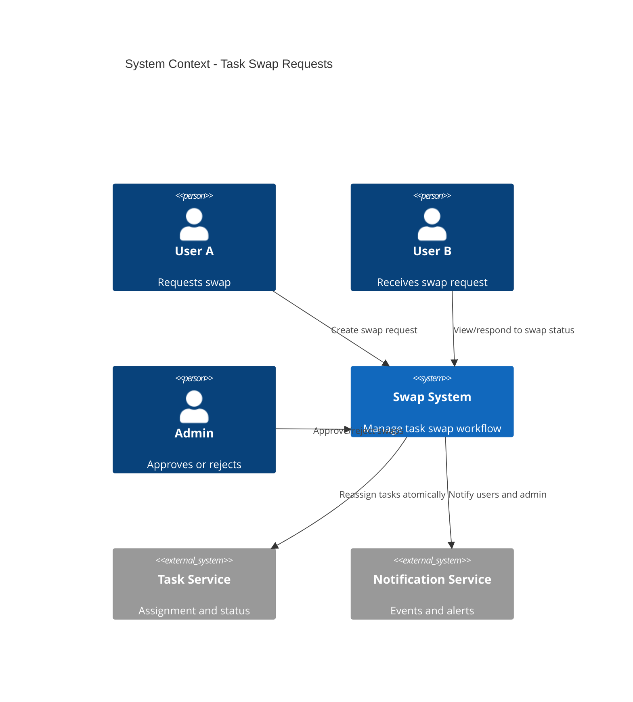
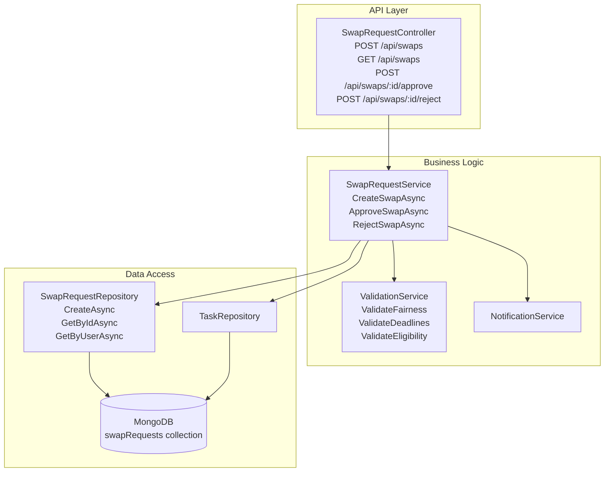
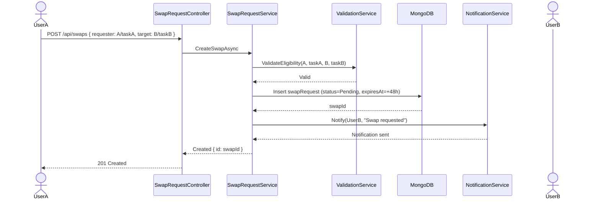
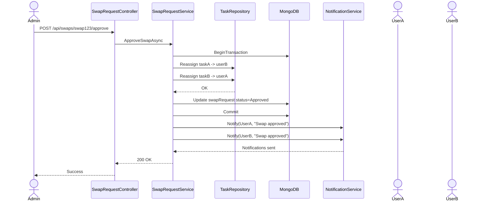
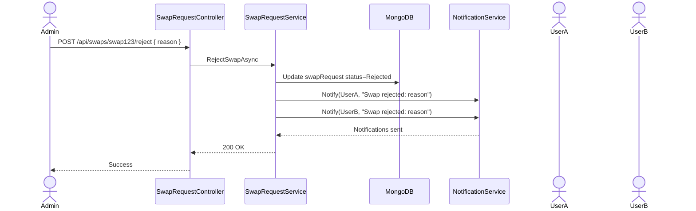

# Technical Design: FR-013 Task Swap Requests

**Document Version:** 1.0  
**Last Updated:** December 15, 2025  
**Mode:** NEW_FEATURE  
**PRD Reference:** [../../prd.md](../../prd.md#fr-013-task-swap-requests)  
**Repository:** my-tasks-tracker-app  

---

## 1. Executive Summary

**Business value:**
- Allow members to exchange tasks fairly when constraints arise (availability, skills, preferences)
- Maintain accountability by requiring Admin approval and audit logging
- Improve satisfaction and workload balance by enabling voluntary redistribution
- Preserve task history and integrity through tracked swap operations

**High-level approach:**
- Introduce `SwapRequest` entity representing a request from `requester` to `target` for specific tasks
- Support three modes: Request to swap A↔B, Offer A-for-any, Accept B-from-any (Phase 2)
- Implement approval workflow: request → admin review → approve/reject → tasks reassigned
- Validate conflicts: due dates, categories, difficulty, workload caps
- Notify involved users on each step via NotificationService (FR-009)
- Log swap in task history and group activity audit

**Key decisions:**
- **Approval required:** Admin approval mandatory for all swaps (Phase 1)
- **Fairness rules:** Difficulty difference threshold ≤ 2 by default (configurable)
- **Deadline safety:** Cannot swap if either task is overdue or within 2 hours of due time
- **Assignment lock:** Swapping only allowed for `Pending` or `InProgress` tasks
- **Audit-first:** Append-only audit logs with swap metadata

---

## 2. Requirements Summary (from PRD)

### Functional Requirements
- Create swap request between two tasks assigned to two members
- Admin approves or rejects the swap
- Notifications sent to all parties
- Swap logged in task history

### Non-Functional Requirements
- Conflicts prevented via validation (deadlines, difficulty gap, workload caps)
- Response time < 250ms for creation and approval actions
- Concurrency-safe reassignment (atomic updates)

### Acceptance Criteria
- User A requests to swap Task A (House, diff 5) with User B's Task B (Yard, diff 6) → Admin approves → tasks reassign correctly
- Admin rejects swap with reason → request shows status Rejected and users notified
- Swap attempted for overdue task → validation error
- Swap attempted where difficulty difference > 2 → validation error unless Admin override

### Constraints
- Phase 1: Only direct A↔B swaps (no multi-party or any-task offers)
- Max 3 active swap requests per user
- Swap requests expire after 48 hours if not approved

### Assumptions
- **Assume:** Both users are in same group
- **Assume:** Admin can override fairness rule (difficulty threshold) via flag
- **Inferred:** Swap does not change task due dates

---

## 3. Proposed Architecture

### 3.1 System Context (C4)


### 3.2 Component Diagram


### 3.3 Data Model

**SwapRequest Entity:**
```json
{
  "_id": "ObjectId",
  "groupId": "string",
  
  "requester": {
    "userId": "string",
    "taskId": "ObjectId"
  },
  "target": {
    "userId": "string",
    "taskId": "ObjectId"
  },
  
  "status": "Pending|Approved|Rejected|Expired",
  "reason": "string? (requester note)",
  "adminDecisionReason": "string?",
  "allowDifficultyOverride": "bool (default false)",
  
  "metrics": {
    "difficultyGap": 1,
    "deadlineGapMinutes": 30
  },
  
  "createdAt": "DateTime",
  "expiresAt": "DateTime (createdAt + 48h)",
  "approvedAt": "DateTime?",
  "approvedBy": "string? (admin userId)",
  "rejectedAt": "DateTime?",
  "rejectedBy": "string? (admin userId)"
}
```

**MongoDB Indexes:**
```javascript
db.swapRequests.createIndex({ groupId: 1, status: 1, expiresAt: 1 });
db.swapRequests.createIndex({ "requester.userId": 1, status: 1 });
db.swapRequests.createIndex({ "target.userId": 1, status: 1 });
db.swapRequests.createIndex({ createdAt: 1 }, { expireAfterSeconds: 1209600 }); // 14-day cleanup TTL
```

---

## 4. API Specification

### 4.1 Create Swap Request
**Endpoint:** `POST /api/swaps`  
**Authorization:** User (both tasks must be in user's group)  
**Request Body:**
```json
{
  "requester": { "userId": "userA", "taskId": "taskA" },
  "target": { "userId": "userB", "taskId": "taskB" },
  "reason": "Can we swap? I have exams",
  "allowDifficultyOverride": false
}
```

**Response:** `201 Created`
```json
{
  "success": true,
  "data": {
    "id": "swap123",
    "status": "Pending",
    "expiresAt": "2025-12-17T10:00:00Z"
  }
}
```

**Validation Rules:**
- Both tasks exist and belong to same group
- Tasks assigned to `requester.userId` and `target.userId` respectively
- Tasks are `Pending` or `InProgress` (not Completed/Approved/Overdue)
- Difficulty gap ≤ 2 unless `allowDifficultyOverride` = true
- Not within 2 hours of either task's due time
- Max 3 active swap requests per requester

### 4.2 Approve Swap Request
**Endpoint:** `POST /api/swaps/{swapId}/approve`  
**Authorization:** Admin  
**Request Body:**
```json
{
  "decisionReason": "Fair swap, approved"
}
```

**Response:** `200 OK`
```json
{
  "success": true,
  "data": {
    "id": "swap123",
    "status": "Approved",
    "approvedAt": "2025-12-15T10:30:00Z",
    "approvedBy": "admin001"
  }
}
```

**Business Logic:**
- Begin transaction
- Reassign Task A to `target.userId` and Task B to `requester.userId`
- Append history log to both tasks: `SwapApproved` with references
- Update SwapRequest status to `Approved`
- Commit transaction
- Send notifications to both users and admin

### 4.3 Reject Swap Request
**Endpoint:** `POST /api/swaps/{swapId}/reject`  
**Authorization:** Admin  
**Request Body:**
```json
{
  "decisionReason": "Difficulty gap too high"
}
```

**Response:** `200 OK`
```json
{
  "success": true,
  "data": {
    "id": "swap123",
    "status": "Rejected",
    "rejectedAt": "2025-12-15T10:40:00Z",
    "rejectedBy": "admin001"
  }
}
```

**Business Logic:**
- Update SwapRequest status to `Rejected`
- Log in both tasks' history as `SwapRejected`
- Notify both users with decision reason

### 4.4 List Swap Requests
**Endpoint:** `GET /api/swaps`  
**Authorization:** User (sees own swaps), Admin (sees group swaps)  
**Query Parameters:**
```
role: "requester|target|admin"
status: "Pending|Approved|Rejected|Expired"
groupId: string
skip: int (default 0)
limit: int (default 50)
```

**Response:** `200 OK`
```json
{
  "success": true,
  "data": {
    "requests": [
      {
        "id": "swap123",
        "groupId": "group001",
        "requester": { "userId": "userA", "taskId": "taskA" },
        "target": { "userId": "userB", "taskId": "taskB" },
        "status": "Pending",
        "createdAt": "2025-12-15T09:00:00Z",
        "expiresAt": "2025-12-17T09:00:00Z"
      }
    ],
    "pagination": { "total": 4, "skip": 0, "limit": 50 }
  }
}
```

---

## 5. Validation & Fairness Rules

### 5.1 Difficulty Gap
```
|A.difficulty - B.difficulty| ≤ 2 (default)
Admin override flag allows larger gaps
```

### 5.2 Deadline Safety
```
No swap if either dueDate - now < 2 hours
No swap for overdue tasks
```

### 5.3 Eligibility
- Only `Pending` or `InProgress` tasks
- Same group required
- Users cannot exceed max 3 active requests

### 5.4 Workload Caps
- Optional: Prevent resulting workload > 120% of group average (Phase 2, ties to FR-006)

---

## 6. Sequence Diagrams

### 6.1 Create Swap Request


### 6.2 Approve Swap


### 6.3 Reject Swap


---

## 7. Implementation Plan

### Phase 1: Core Swap Workflow (3 days)
1. Create SwapRequest entity/repository
2. Implement SwapRequestService (create/approve/reject)
3. Add SwapRequestController endpoints
4. ValidationService for fairness, deadlines, eligibility
5. Unit tests for validation rules

### Phase 2: Concurrency & Transactions (2 days)
1. Implement atomic reassignment with MongoDB transactions
2. Add optimistic locking (task version field)
3. Integration tests for concurrent approvals

### Phase 3: Notifications & History (2 days)
1. Integrate NotificationService (FR-009) for events
2. Append task history entries on swap decisions
3. Add GET /api/swaps listing with filters

### Phase 4: UI Components (3 days)
1. Build SwapRequestModal (select target user and task)
2. Build AdminSwapReviewList (approve/reject actions)
3. Add status badges and timelines on task detail page
4. Tests for UI flows

**Total Estimate:** 10 days (1 developer)

---

## 8. Error Handling

| Scenario | HTTP Code | Error Message | Retry? |
|----------|-----------|---------------|--------|
| Overdue task | 400 | "Cannot swap overdue tasks" | No |
| Due within 2 hours | 400 | "Swap not allowed near deadline" | No |
| Difficulty gap too high | 400 | "Difficulty difference exceeds threshold" | No |
| Max active requests exceeded | 429 | "Too many active swap requests" | No |
| Not same group | 403 | "Users must be in same group" | No |
| Duplicate pending swap | 409 | "Duplicate swap request already exists" | No |
| Concurrency conflict | 409 | "Swap conflict, please retry" | Yes |

---

## 9. Dependencies & Risks

### Dependencies
- ✅ FR-005 (Task Creation) → tasks and assignments
- ✅ FR-009 (Notifications) → alerts for swap events
- ⏳ FR-006 (Workload Balancing) → optional fairness caps (Phase 2)

### Risks
| Risk | Probability | Impact | Mitigation |
|------|-------------|--------|------------|
| Admin backlog delays approvals | Medium | Medium | Add reminders for pending swaps |
| Concurrency race during reassignment | Low | High | Use transactions and optimistic locking |
| Users attempt unfair swaps | Medium | Low | Enforce difficulty thresholds, admin oversight |
| Abuse via spam requests | Medium | Low | Rate limit and cap active requests |

---

## 10. Future Enhancements

- **Any-task offers:** Offer your task in exchange for any task from someone else
- **Multi-party swaps:** 3+ users forming a swap chain
- **Preference-aware suggestions:** Recommend fair swap candidates using category preferences
- **Auto-approval rules:** Allow safe swaps without admin for low stakes
- **Swap analytics:** Track acceptance rates, common swap categories

---

**END OF DESIGN DOCUMENT**

This task swap system enables fair, controlled exchanges between members with clear validation, audit logging, and admin oversight to maintain balance and accountability.
