# Technical Design: FR-014 Reports & Analytics

**Document Version:** 1.0  
**Last Updated:** December 15, 2025  
**Mode:** NEW_FEATURE  
**PRD Reference:** [../../prd.md](../../prd.md#fr-014-reports--analytics)  
**Repository:** my-tasks-tracker-app  

---

## 1. Executive Summary

**Business value:**
- Provide admins and users with insights into productivity trends and bottlenecks
- Enable data-driven decisions for workload balancing and process improvements
- Support exporting and sharing reports for accountability and transparency
- Visualize category breakdowns and completion trends to guide planning

**High-level approach:**
- Implement analytics pipeline via MongoDB aggregations and precomputed snapshots
- Provide reporting endpoints for group statistics and time-based trends
- Build UI with charts (bar, line, progress bars) and export options (CSV, PDF)
- Cache heavy aggregations and schedule nightly snapshot jobs
- Ensure performance with selective indexes and incremental updates

**Key decisions:**
- **Aggregation layer:** MongoDB Aggregation Framework (no separate warehouse in Phase 1)
- **Snapshots:** Nightly `AnalyticsSnapshot` per group for last 90 days
- **Charts:** Use Chart.js (web) and React components for dashboards
- **Exports:** CSV (native), PDF via server-side rendering (Playwright/Chromium) or PuppeteerSharp
- **Caching:** Redis with 15-minute TTL for hot reports
- **Scope:** Group-level analytics; individual user drill-downs included

---

## 2. Requirements Summary (from PRD)

### Functional Requirements
- Group statistics: total tasks, completion rate, average completion time
- Export reports (CSV, PDF)
- Visual charts: bar, line, progress bars
- Category breakdown and trend analysis

### Non-Functional Requirements
- Aggregation response time < 800ms for 10K tasks
- Export generation time < 5s
- Snapshot update time < 2m nightly per group
- Data retention: 2 years for analytics

### Acceptance Criteria
- Admin views group report → sees total tasks, completion rate, average completion time
- Admin filters by date range → charts update accordingly
- Admin downloads CSV → file contains selected date range data
- Admin downloads PDF → report renders with charts and summary
- Category breakdown shows top categories by tasks and completion rate

### Constraints
- Phase 1: Analytics limited to tasks and feedback (no messaging analytics yet)
- Snapshots cover last 90 days; older periods computed on-demand
- PDF generation requires headless browser environment

### Assumptions
- **Assume:** Task history contains sufficient timestamps (created, assigned, completed, approved)
- **Assume:** Feedback points linked to tasks for per-category analysis
- **Inferred:** Overdue detection based on dueDate vs completedAt

---

## 3. Proposed Architecture

### 3.1 System Context (C4)


### 3.2 Component Diagram

```mermaid
graph TB
    subgraph "API Layer"
        RAC[ReportsController<br/>GET /api/reports/group
                            <br/>GET /api/reports/user
                            <br/>GET /api/reports/export/csv
                            <br/>GET /api/reports/export/pdf]
    end
    
    subgraph "Business Logic"
        AS[AnalyticsService<br/>GetGroupStatsAsync<br/>GetCategoryBreakdownAsync<br/>GetTrendsAsync]
        ES[ExportService<br/>GenerateCsvAsync<br/>GeneratePdfAsync]
    end
    
    subgraph "Background Jobs"
        SJ[SnapshotJob<br/>Nightly per group]
    end
    
    subgraph "Data Access"
        AR[AnalyticsRepository<br/>RunAggregationsAsync<br/>GetSnapshotsAsync]
        TR[TaskRepository]
        FR[FeedbackRepository]
        MONGO[(MongoDB)]
    end
    
    subgraph "Caching"
        REDIS[(Redis Cache)]
    end
    
    RAC --> AS
    RAC --> ES
    AS --> AR
    AS --> REDIS
    AR --> MONGO
    ES --> MONGO
    SJ --> AS
```


### 3.3 Data Model

**AnalyticsSnapshot Entity (per group, per day):**
```json
{
  "_id": "ObjectId",
  "groupId": "string",
  "date": "DateOnly",
  
  "counts": {
    "totalTasks": 420,
    "completedTasks": 300,
    "pendingTasks": 100,
    "overdueTasks": 20
  },
  
  "completionRate": 71.4,
  "avgCompletionTimeMinutes": 95.3,
  
  "categoryBreakdown": [
    { "categoryId": "house", "name": "House", "count": 130, "completionRate": 75.0 },
    { "categoryId": "yard", "name": "Yard", "count": 90, "completionRate": 68.2 }
  ],
  
  "feedback": {
    "positive": 180,
    "negative": 15,
    "netPoints": 825
  },
  
  "generatedAt": "DateTime"
}
```

**MongoDB Indexes:**
```javascript
db.analyticsSnapshots.createIndex({ groupId: 1, date: -1 });
db.analyticsSnapshots.createIndex({ "categoryBreakdown.categoryId": 1, date: -1 });
```

---

## 4. Aggregation Pipelines

### 4.1 Group Stats (Date Range)
```javascript
// Input: groupId, startDate, endDate
[
  { $match: { groupId, createdAt: { $gte: startDate, $lte: endDate } } },
  { $facet: {
      counts: [
        { $group: {
            _id: null,
            totalTasks: { $sum: 1 },
            completedTasks: { $sum: { $cond: [{ $in: ["$status", ["Completed", "Approved"]] }, 1, 0] } },
            pendingTasks: { $sum: { $cond: [{ $in: ["$status", ["Pending", "InProgress"]] }, 1, 0] } },
            overdueTasks: { $sum: { $cond: [{ $and: [
              { $lt: ["$dueDate", new Date()] },
              { $not: { $in: ["$status", ["Completed", "Approved"]] } }
            ] }, 1, 0] } }
          }
        }
      ],
      completionTime: [
        { $match: { completedAt: { $ne: null } } },
        { $project: { minutes: { $divide: [{ $subtract: ["$completedAt", "$createdAt"] }, 60000] } } },
        { $group: { _id: null, avgCompletionTimeMinutes: { $avg: "$minutes" } } }
      ]
    }
  }
]
```

### 4.2 Category Breakdown
```javascript
[
  { $match: { groupId, createdAt: { $gte: startDate, $lte: endDate } } },
  { $group: {
      _id: "$categoryId",
      count: { $sum: 1 },
      completedCount: { $sum: { $cond: [{ $in: ["$status", ["Completed", "Approved"]] }, 1, 0] } }
    }
  },
  { $project: {
      categoryId: "$_id",
      count: 1,
      completionRate: { $multiply: [{ $divide: ["$completedCount", "$count"] }, 100] }
    }
  },
  { $sort: { count: -1 } },
  { $limit: 10 }
]
```

### 4.3 Trend Analysis (Daily)
```javascript
[
  { $match: { groupId, createdAt: { $gte: startDate, $lte: endDate } } },
  { $group: {
      _id: { $dateToString: { format: "%Y-%m-%d", date: "$createdAt" } },
      totalTasks: { $sum: 1 },
      completedTasks: { $sum: { $cond: [{ $in: ["$status", ["Completed", "Approved"]] }, 1, 0] } },
      overdueTasks: { $sum: { $cond: [{ $and: [
        { $lt: ["$dueDate", new Date()] },
        { $not: { $in: ["$status", ["Completed", "Approved"]] } }
      ] }, 1, 0] } }
    }
  },
  { $project: {
      date: "$_id",
      completionRate: { $cond: [
        { $gt: ["$totalTasks", 0] },
        { $multiply: [{ $divide: ["$completedTasks", "$totalTasks"] }, 100] },
        0
      ] },
      totalTasks: 1,
      completedTasks: 1,
      overdueTasks: 1
    }
  },
  { $sort: { date: 1 } }
]
```

---

## 5. API Specification

### 5.1 Get Group Report
**Endpoint:** `GET /api/reports/group`  
**Authorization:** Admin  
**Query Parameters:**
```
groupId: string (required)
startDate: string (ISO)
endDate: string (ISO)
useSnapshots: bool? (default true)
```

**Response:** `200 OK`
```json
{
  "success": true,
  "data": {
    "counts": {
      "totalTasks": 420,
      "completedTasks": 300,
      "pendingTasks": 100,
      "overdueTasks": 20
    },
    "completionRate": 71.4,
    "avgCompletionTimeMinutes": 95.3,
    "categoryBreakdown": [
      { "categoryId": "house", "name": "House", "count": 130, "completionRate": 75.0 }
    ],
    "trends": [
      { "date": "2025-12-01", "totalTasks": 12, "completedTasks": 9, "overdueTasks": 1, "completionRate": 75.0 }
    ]
  }
}
```

### 5.2 Get User Report
**Endpoint:** `GET /api/reports/user`  
**Authorization:** User/Admin  
**Query Parameters:**
```
userId: string (required)
groupId: string (required)
startDate: string (ISO)
endDate: string (ISO)
```

**Response:** `200 OK`
```json
{
  "success": true,
  "data": {
    "user": {
      "id": "user123",
      "name": "Sarah Johnson"
    },
    "counts": {
      "assigned": 40,
      "completed": 35,
      "overdue": 2
    },
    "avgCompletionTimeMinutes": 88.2,
    "categoryBreakdown": [
      { "categoryId": "house", "name": "House", "count": 10, "completionRate": 80.0 }
    ],
    "feedback": {
      "positive": 25,
      "negative": 2,
      "netPoints": 123
    }
  }
}
```

### 5.3 Export CSV
**Endpoint:** `GET /api/reports/export/csv`  
**Authorization:** Admin  
**Query Parameters:** same as `GET /api/reports/group`  
**Response:** `200 OK` with `text/csv`
```
Date,Total Tasks,Completed,Pending,Overdue,Completion Rate,Avg Completion Time (min)
2025-12-01,12,9,2,1,75.00,83.2
...
```

### 5.4 Export PDF
**Endpoint:** `GET /api/reports/export/pdf`  
**Authorization:** Admin  
**Query Parameters:** same as `GET /api/reports/group`  
**Response:** `200 OK` with `application/pdf`
- Server renders report page with charts and tables using headless Chromium

---

## 6. Snapshot Job

### 6.1 Nightly Snapshot (per group)
```csharp
public class SnapshotJob
{
    public async Task ExecuteAsync(string groupId)
    {
        var date = DateOnly.FromDateTime(DateTime.UtcNow);
        var snapshot = await _analyticsService.GenerateSnapshotAsync(groupId, date);
        await _analyticsRepository.SaveSnapshotAsync(snapshot);
    }
}

// Hangfire setup (run at 02:15 AM UTC per group)
RecurringJob.AddOrUpdate<SnapshotJob>(
    "analytics-snapshot",
    job => job.ExecuteAsync("{groupId}"),
    "15 2 * * *"
);
```

### 6.2 Generate Snapshot
```csharp
public async Task<AnalyticsSnapshot> GenerateSnapshotAsync(string groupId, DateOnly date)
{
    var startDate = date.ToDateTime(TimeOnly.MinValue).AddDays(-90);
    var endDate = date.ToDateTime(TimeOnly.MaxValue);
    
    var counts = await _analyticsRepository.AggregateCountsAsync(groupId, startDate, endDate);
    var categoryBreakdown = await _analyticsRepository.AggregateCategoryBreakdownAsync(groupId, startDate, endDate);
    var avgCompletion = await _analyticsRepository.AggregateAvgCompletionTimeAsync(groupId, startDate, endDate);
    var feedbackSummary = await _analyticsRepository.AggregateFeedbackSummaryAsync(groupId, startDate, endDate);
    
    return new AnalyticsSnapshot
    {
        GroupId = groupId,
        Date = date,
        Counts = counts,
        CompletionRate = counts.TotalTasks == 0 ? 0 : (double)counts.CompletedTasks / counts.TotalTasks * 100,
        AvgCompletionTimeMinutes = avgCompletion,
        CategoryBreakdown = categoryBreakdown,
        Feedback = feedbackSummary,
        GeneratedAt = DateTime.UtcNow
    };
}
```

---

## 7. Frontend UI

### 7.1 Reports Dashboard
- Widgets: total tasks, completion rate, average completion time
- Charts: bar (category counts), line (daily completion rate), progress bars (overdue vs completed)
- Filters: date range, category, status
- Export buttons: CSV, PDF

### 7.2 Implementation Notes
- Use Chart.js with responsive legends and tooltips
- Debounce filter changes (300ms) to avoid rapid re-queries
- Skeleton loaders for charts while aggregations run
- Persist filter state per group in localStorage

---

## 8. Implementation Plan

### Phase 1: Aggregations & Endpoints (4 days)
1. Implement AnalyticsRepository with aggregation pipelines
2. Create AnalyticsService methods for group/user reports
3. Add ReportsController endpoints
4. Unit tests for pipeline correctness (mock data)

### Phase 2: Snapshots & Caching (3 days)
1. Implement SnapshotJob and GenerateSnapshotAsync
2. Save snapshots and serve from cache by default
3. Add Redis caching for hot queries (15 min TTL)
4. Integration tests for snapshot generation

### Phase 3: Exports (3 days)
1. Implement CSV exporter
2. Implement PDF exporter using Playwright/Chromium
3. Add auth checks and rate limiting for exports
4. E2E tests validating generated files

### Phase 4: Frontend (4 days)
1. Build ReportsDashboard with charts and widgets
2. Add filters and export buttons
3. Connect to backend endpoints via RTK Query
4. Component tests and performance tuning

**Total Estimate:** 14 days (1 developer)

---

## 9. Error Handling

| Scenario | HTTP Code | Error Message | Retry? |
|----------|-----------|---------------|--------|
| Large aggregation timeout | 504 | "Report generation timed out" | Yes (optimize filters) |
| Invalid date range | 400 | "Invalid date range" | No |
| PDF rendering failure | 500 | "Failed to generate PDF" | Yes |
| Snapshot missing | 404 | "Snapshot not found for date" | No |
| Export rate limited | 429 | "Too many export requests" | Wait and retry |

---

## 10. Dependencies & Risks

### Dependencies
- ✅ FR-005 (Task Creation) → source data
- ✅ FR-008 (Completion & Approval) → timestamps and statuses
- ✅ FR-010 (Feedback) → feedback counts and points
- ⏳ Redis and Hangfire setup → caching and scheduling
- ⏳ Headless browser for PDF → Playwright/Chromium

### Risks
| Risk | Probability | Impact | Mitigation |
|------|-------------|--------|------------|
| Heavy aggregations slow | Medium | High | Use snapshots + indexes + caching |
| PDF generation complexity | Medium | Medium | Standardize templates and fonts |
| Data inconsistency (late updates) | Low | Medium | Mark reports with generation timestamp |
| Snapshot job failures | Low | Medium | Retries + monitoring dashboard |

---

## 11. Future Enhancements

- **Drill-down reports:** Click-through from charts to detailed lists
- **Comparative analytics:** Compare groups or periods side-by-side
- **Anomaly detection:** Highlight unusual spikes or drops
- **Forecasting:** Predict future workload/completion using time-series models
- **Email scheduled reports:** Send weekly/monthly reports to admins

---

**END OF DESIGN DOCUMENT**

This reports and analytics module delivers actionable insights with performant aggregations, snapshots, and export capabilities to help teams monitor productivity and make informed decisions.
