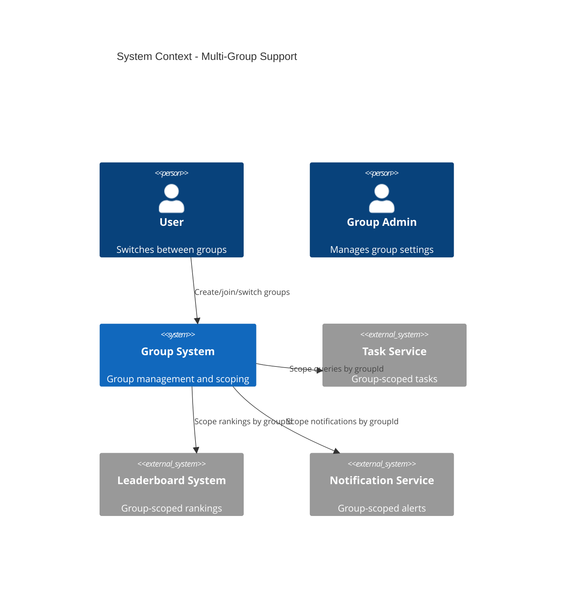

# Technical Design: FR-015 Multi-Group Support

**Document Version:** 1.0  
**Last Updated:** December 15, 2025  
**Mode:** NEW_FEATURE  
**PRD Reference:** [../../prd.md](../../prd.md#fr-015-multi-group-support)  
**Repository:** my-tasks-tracker-app  

---

## 1. Executive Summary

**Business value:**
- Allow users to create or join multiple groups, each with independent settings, tasks, and leaderboards
- Improve flexibility for families, roommates, and teams by separating contexts
- Ensure notifications and views clearly indicate group context to avoid confusion
- Enable scalable administration per group with roles and permissions

**High-level approach:**
- Introduce `Group` entity with settings (name, description, avatar, timezone, language)
- Extend user profile with memberships and active group selection
- Scope all domain entities (tasks, categories, leaderboards, notifications) by `groupId`
- Add group switcher UI and server-side authorization checks per request
- Migrate existing single-group assumptions to group-aware operations

**Key decisions:**
- **Isolation:** Hard scope all queries and caches by `groupId`
- **Membership model:** Roles per group (Admin, Member); no global admin except system owner
- **Active group:** Client stores `activeGroupId`; backend validates membership on every request
- **Notifications:** Include group context in payloads and display; topics per group
- **Default timezone:** Inherit from group settings; user override allowed

---

## 2. Requirements Summary (from PRD)

### Functional Requirements
- Create or join multiple groups
- Independent settings, tasks, leaderboards per group
- Notifications indicate group context

### Non-Functional Requirements
- Clear tenant isolation via `groupId` scoping
- Authorization checks per group membership on every request
- Minimal performance overhead from multi-tenancy

### Acceptance Criteria
- User with 2 groups can switch context via header dropdown; views update accordingly
- Task creation in Group A does not appear in Group B
- Leaderboard in Group A independent of Group B
- Notifications show: "[Group: Home] Task approved"

### Constraints
- Phase 1: No cross-group operations (e.g., cross-group tasks or messages)
- Phase 1: Single active group at a time per client session

### Assumptions
- **Assume:** Existing entities have `groupId` fields or can be extended
- **Assume:** Authentication provides userId; authorization performs group membership checks

---

## 3. Proposed Architecture

### 3.1 System Context (C4)


### 3.2 Component Diagram
```mermaid
graph TB
    subgraph "API Layer"
        GC[GroupController<br/>POST /api/groups<br/>GET /api/groups<br/>POST /api/groups/{id}/join<br/>GET /api/groups/{id}/members]
        Ctx[ContextController<br/>PUT /api/context/active-group]
    end
    
    subgraph "Business Logic"
        GS[GroupService<br/>CreateGroupAsync<br/>JoinGroupAsync<br/>GetMembersAsync]
        CXS[ContextService<br/>SetActiveGroupAsync<br/>ValidateMembership]
        Auth[AuthMiddleware]
    end
    
    subgraph "Data Access"
        GR[GroupRepository]
        MR[MembershipRepository]
        UR[UserRepository]
        MONGO[(MongoDB)]
    end
    
    GC --> GS
    Ctx --> CXS
    GS --> GR
    GS --> MR
    CXS --> MR
    Auth --> CXS
    GR --> MONGO
    MR --> MONGO
```

### 3.3 Data Model

**Group Entity:**
```json
{
  "_id": "ObjectId",
  "name": "string",
  "description": "string?",
  "avatarUrl": "string?",
  "timezone": "string (IANA tz)",
  "language": "string (ISO 639-1)",
  
  "settings": {
    "leaderboardReset": "Monthly|Weekly|None",
    "notificationDefaults": {
      "dailySummaryTime": "08:00",
      "reminderTimes": ["15:00", "17:00", "18:00"]
    }
  },
  
  "createdBy": "string (userId)",
  "createdAt": "DateTime"
}
```

**Membership Entity:**
```json
{
  "_id": "ObjectId",
  "groupId": "string",
  "userId": "string",
  "role": "Admin|Member",
  "joinedAt": "DateTime"
}
```

**UserProfile Extension:**
```json
{
  "memberships": [
    { "groupId": "groupA", "role": "Admin" },
    { "groupId": "groupB", "role": "Member" }
  ],
  "activeGroupId": "groupA"
}
```

**MongoDB Indexes:**
```javascript
db.groups.createIndex({ name: 1 });
db.memberships.createIndex({ userId: 1, groupId: 1 }, { unique: true });
db.memberships.createIndex({ groupId: 1, role: 1 });
```

---

## 4. API Specification

### 4.1 Create Group
**Endpoint:** `POST /api/groups`  
**Authorization:** Authenticated user  
**Request Body:**
```json
{
  "name": "Home",
  "description": "Family chores",
  "timezone": "America/Los_Angeles",
  "language": "en",
  "settings": {
    "leaderboardReset": "Monthly",
    "notificationDefaults": {
      "dailySummaryTime": "08:00",
      "reminderTimes": ["15:00", "17:00", "18:00"]
    }
  }
}
```

**Response:** `201 Created`
```json
{
  "success": true,
  "data": {
    "id": "groupA",
    "name": "Home"
  }
}
```

### 4.2 List User Groups
**Endpoint:** `GET /api/groups`  
**Authorization:** Authenticated user  
**Response:** `200 OK`
```json
{
  "success": true,
  "data": {
    "groups": [
      { "id": "groupA", "name": "Home", "role": "Admin" },
      { "id": "groupB", "name": "Study", "role": "Member" }
    ]
  }
}
```

### 4.3 Join Group (Invite Code)
**Endpoint:** `POST /api/groups/{groupId}/join`  
**Authorization:** Authenticated user  
**Request Body:**
```json
{ "inviteCode": "ABC123" }
```

**Response:** `200 OK`
```json
{
  "success": true,
  "data": {
    "groupId": "groupA",
    "role": "Member"
  }
}
```

### 4.4 Get Group Members
**Endpoint:** `GET /api/groups/{groupId}/members`  
**Authorization:** Group member  
**Response:** `200 OK`
```json
{
  "success": true,
  "data": {
    "members": [
      { "userId": "user1", "name": "John", "role": "Admin" },
      { "userId": "user2", "name": "Sarah", "role": "Member" }
    ]
  }
}
```

### 4.5 Set Active Group
**Endpoint:** `PUT /api/context/active-group`  
**Authorization:** Authenticated user  
**Request Body:**
```json
{ "groupId": "groupA" }
```

**Response:** `200 OK`
```json
{ "success": true }
```

**Business Logic:**
- Validate membership (userId ∈ memberships where groupId)
- Update `activeGroupId` in user profile
- Return success; client stores locally and in state

---

## 5. Backend Changes & Guards

### 5.1 Authorization Filter
```csharp
public class GroupMembershipFilter : IAsyncActionFilter
{
    public async Task OnActionExecutionAsync(ActionExecutingContext context, ActionExecutionDelegate next)
    {
        var userId = context.HttpContext.User.GetUserId();
        var groupId = context.HttpContext.Request.Query["groupId"].FirstOrDefault()
                     ?? context.HttpContext.Items["ActiveGroupId"] as string;
        
        if (string.IsNullOrEmpty(groupId))
        {
            context.Result = new BadRequestObjectResult("groupId required");
            return;
        }
        
        var isMember = await _membershipRepository.IsMemberAsync(userId, groupId);
        if (!isMember)
        {
            context.Result = new ForbidResult();
            return;
        }
        
        await next();
    }
}
```

### 5.2 Repository Scoping
- All repositories must include `groupId` as a filter in queries
- Add helper to enforce scoping and prevent accidental cross-group reads

```csharp
public static FilterDefinition<T> ScopeToGroup<T>(string groupId)
{
    return Builders<T>.Filter.Eq("groupId", groupId);
}
```

### 5.3 Caching Keys
- Include `groupId` in all Redis cache keys, e.g., `leaderboard:{groupId}:{period}`
- Include `groupId` in WebSocket groups (SignalR): `group-{groupId}`

---

## 6. Frontend Changes

### 6.1 Group Switcher UI
- Header dropdown to switch `activeGroupId`
- Shows list of groups with role badges
- Persists selection in localStorage
- Triggers refetch of RTK Query endpoints with `groupId` param

### 6.2 Routing & State
- Global `activeGroupId` in Redux store
- Add `groupId` to all queries, mutations, and WebSocket subscriptions
- Display group name in notification toasts and page headers

### 6.3 Example: Using Active Group
```typescript
const activeGroupId = useSelector((s: RootState) => s.context.activeGroupId);

const { data: tasks } = useGetFilteredTasksQuery({
  view: 'my-tasks',
  groupId: activeGroupId,
  // ...other filters
});
```

---

## 7. Implementation Plan

### Phase 1: Core Entities & Membership (3 days)
1. Create Group and Membership entities/repositories
2. Implement GroupService and GroupController
3. Add ContextService and active group endpoint
4. Unit tests for membership checks

### Phase 2: Backend Scoping (3 days)
1. Update repositories to require `groupId`
2. Add GroupMembershipFilter to protected endpoints
3. Update cache keys and SignalR groups with `groupId`
4. Integration tests for cross-group isolation

### Phase 3: Frontend Switcher (3 days)
1. Build GroupSwitcher component
2. Add context slice with `activeGroupId`
3. Update queries to include `groupId`
4. Component tests for switching

### Phase 4: Polish & Notifications (2 days)
1. Add group context to notification payloads and UI
2. Ensure timezone handling aligns with group settings
3. E2E tests: switch group → data isolation validated

**Total Estimate:** 11 days (1 developer)

---

## 8. Error Handling

| Scenario | HTTP Code | Error Message | UX |
|----------|-----------|---------------|----|
| Missing groupId | 400 | "groupId required" | Prompt to select group |
| Not a member | 403 | "You are not a member of this group" | Show join/invite options |
| Switch to invalid group | 404 | "Group not found" | Reset to previous group |
| Cross-group query attempt | 403 | "Forbidden" | Harden backend filter |

---

## 9. Dependencies & Risks

### Dependencies
- ✅ FR-001 (Auth) → user identity
- ✅ FR-003 (Categories), FR-005 (Tasks), FR-011 (Leaderboard), FR-009 (Notifications) → scoping by groupId
- ⏳ Redux store update for `activeGroupId`

### Risks
| Risk | Probability | Impact | Mitigation |
|------|-------------|--------|------------|
| Missed scoping in legacy queries | Medium | High | Static analysis + tests for groupId presence |
| Confusing UX when switching groups | Medium | Medium | Clear headers + toasts with group name |
| Cache collisions without groupId | Low | High | Audit all keys, add groupId prefix |

---

## 10. Future Enhancements

- **Cross-group roles:** Global admin dashboard
- **Group templates:** Predefined settings for common use cases
- **Group analytics:** Compare metrics across groups
- **Invites & roles management:** Role promotions, bans, audit

---

**END OF DESIGN DOCUMENT**

This multi-group support introduces robust tenant isolation with clear UX for switching contexts, ensuring independent data, leaderboards, and notifications per group.
