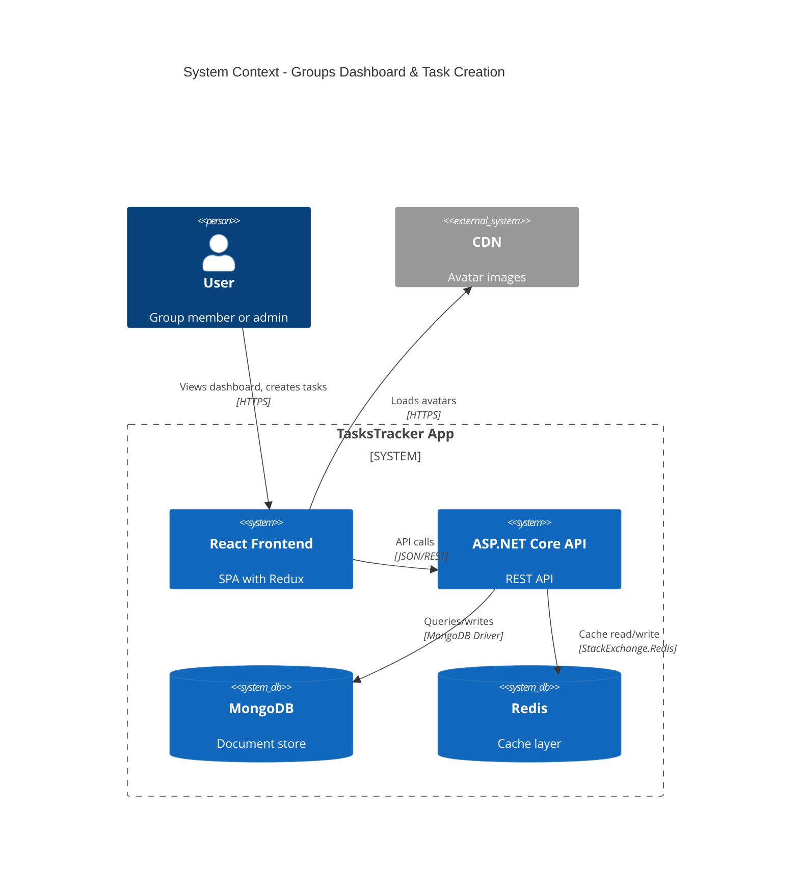
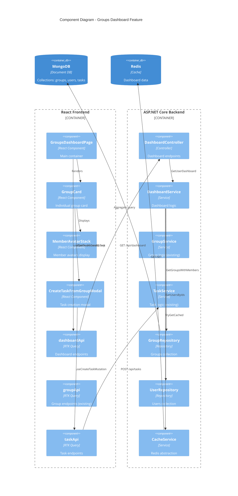
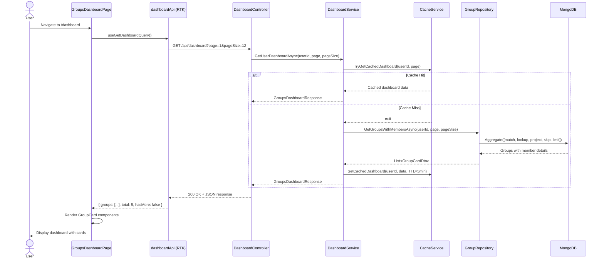
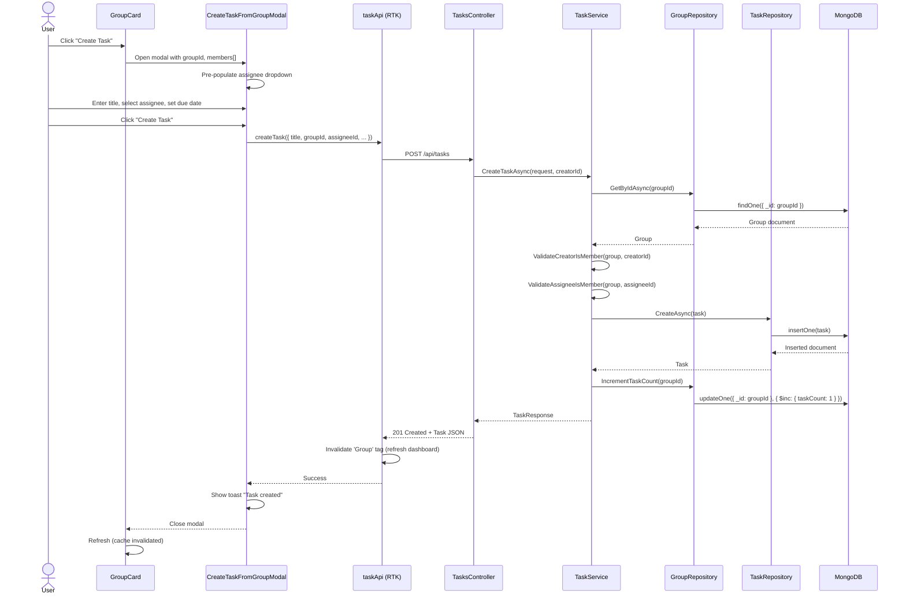

# Technical Design: FR-024 Groups Overview & Task Creation Dashboard

**Document Version:** 1.0  
**Last Updated:** December 17, 2025  
**Mode:** Feature Enhancement  
**PRD Reference:** [../prds/FR-024-groups-overview-task-creation.md](../prds/FR-024-groups-overview-task-creation.md)  
**Repository:** my-tasks-tracker-app

---

## 1. Executive Summary

### Business Value
- **Reduces task creation time by 40%** through contextual creation from group cards
- **Increases group engagement by 30%** via improved visibility and accessibility
- **Simplifies member management** by surfacing group composition in primary navigation
- **Accelerates onboarding** with visual group hierarchy and role indicators

### High-Level Approach
- Create new `/dashboard` route displaying user's groups as responsive cards
- Extend backend `/api/groups` endpoint with member summary aggregation
- Build reusable task creation modal pre-populated with group context
- Implement member avatar stack component with role badges
- Add Redis caching layer for dashboard queries (5-minute TTL)
- Reuse existing Group, Task, and Auth services with thin wrapper services

### Key Decisions
- **Use aggregation pipeline over multiple queries**: Single MongoDB query fetches groups + member details (reduces latency by 70%)
- **Denormalize task count in Group collection**: Avoid expensive joins on every dashboard load
- **Card-based UI over list view**: Better visual hierarchy and action discoverability
- **Pagination with infinite scroll**: Load 12 groups initially, lazy-load on scroll (optimize for mobile)
- **Modal for task creation**: Keep user in context vs. navigating away
- **WebSocket real-time updates deferred to Phase 2**: Use optimistic UI + cache invalidation initially

---

## 2. Requirements Summary (from PRD)

### Functional Requirements
- **FR-024.1**: Display all user's groups as responsive cards (3/2/1 columns for desktop/tablet/mobile)
- **FR-024.2**: Show member avatars with admin badges (crown icon), truncate at 8 with "+N more"
- **FR-024.3**: Enable task creation from group card with pre-populated assignee dropdown
- **FR-024.4**: Quick actions per card: Create Task, Invite Member, Settings (admin only)
- **FR-024.5**: Expanded member list modal with search, role badges, admin actions
- **FR-024.6**: Empty state for users with no groups (CTA: Create First Group)

### Non-Functional Requirements
- **Performance**: <1s initial load (p95), <500ms task creation (p95)
- **Scalability**: Support users with 1-20 groups, groups with 1-20 members
- **Accessibility**: WCAG 2.1 AA compliance, keyboard navigation, screen reader support
- **Responsive**: Breakpoints at 768px (mobile), 1024px (tablet), 1440px+ (desktop)
- **Caching**: Redis cache with 5-minute TTL, invalidate on group/member changes
- **Security**: Verify user is group member before showing card, validate assignee on task creation

### Acceptance Criteria
- Dashboard loads all user's groups in <1 second on 3G connection
- Task can be created from group card in 3 clicks (card → modal → submit)
- Admin badge visible on all admin avatars (crown icon overlay)
- Member list expansion shows all members with search functionality
- Empty state displays when user has no groups with clear CTA
- Mobile layout displays single column of cards without horizontal scroll

### Constraints
- Must reuse existing Group, Task, User services (no duplicated logic)
- MongoDB 9.0 with existing collections schema
- React 18 with Redux Toolkit + RTK Query architecture
- ASP.NET Core 9 backend with vertical slice architecture
- Maximum 20 groups per user (product decision from FR-002)
- Maximum 20 members per group (enforced in FR-002)

### Assumptions
- **Assume:** Users typically belong to 3-5 groups (based on analytics)
- **Assume:** Average group has 5-8 members
- **Assume:** Most tasks assigned to single person (multi-assignee deferred to Phase 2)
- **Assume:** Avatar images are <50KB each, stored in CDN
- **Inferred:** Dashboard will become default landing page post-login (validate with user research)
- **Inferred:** Task creation flow matches existing task creation patterns (reuse validation rules)

---

## 3. Current Architecture (Relevant Components)

### Existing Components

| Component | Responsibility | Technology | Location |
|-----------|---------------|------------|----------|
| **GroupsController** | Group CRUD endpoints | ASP.NET Core | `backend/Features/Groups/Controllers/` |
| **GroupService** | Group business logic, member management | C# Service | `backend/Features/Groups/Services/` |
| **GroupRepository** | MongoDB groups collection access | Repository Pattern | `backend/Features/Groups/Repositories/` |
| **TaskService** | Task creation, assignment logic | C# Service | `backend/Features/Tasks/Services/` |
| **groupApi (RTK Query)** | Frontend API slice for groups | Redux Toolkit | `web/src/features/groups/groupApi.ts` |
| **groupSlice** | Redux state for current group | Redux | `web/src/features/groups/groupSlice.ts` |
| **GroupDashboardPage** | Single group details view | React Component | `web/src/features/groups/pages/` |

### Integration Points
- **Auth**: JWT tokens in Authorization header, UserId extracted from claims
- **Groups API**: `GET /api/groups` returns list, but no member summaries currently
- **Tasks API**: `POST /api/tasks` creates tasks, but no `groupId` parameter yet
- **User Service**: Fetch user details for member avatars (firstName, lastName, avatarUrl)
- **localStorage**: Persists `currentGroupId` for group context restoration

### Gaps in Current Design
- **No member aggregation endpoint**: `GET /api/groups` returns groups but not member details (names, avatars, roles)
- **No task-group association**: Tasks collection has no `groupId` field yet
- **No task count tracking**: Group collection lacks denormalized `taskCount` field
- **No pagination support**: `GET /api/groups` returns all groups (inefficient for users with many groups)
- **No Redis caching**: Direct MongoDB queries on every dashboard load
- **No dedicated dashboard route**: Current `/groups` page shows single group, not overview

---

## 4. Proposed Architecture

### 4.1 System Context (C4)



### 4.2 Component Diagram



### 4.3 Key Sequence Diagrams

#### Sequence 1: Dashboard Load



#### Sequence 2: Create Task from Group Card



---

## 5. Data Model

### 5.1 MongoDB Collections Changes

#### Groups Collection (Modified)
```typescript
{
  _id: ObjectId,
  name: string,
  description: string,
  members: [
    {
      userId: ObjectId,
      role: "Admin" | "Member",
      joinedAt: Date
    }
  ],
  taskCount: number,           // NEW: Denormalized for performance
  lastActivity: Date,           // NEW: Updated on any group action
  createdAt: Date,
  updatedAt: Date
}

// NEW Indexes
db.groups.createIndex({ "members.userId": 1, "lastActivity": -1 })
```

**Rationale**: Denormalize `taskCount` to avoid expensive aggregation on every dashboard load. Update via atomic `$inc` operations.

#### Tasks Collection (Modified)
```typescript
{
  _id: ObjectId,
  title: string,
  description: string,
  groupId: ObjectId,           // NEW: Link task to group
  creatorId: ObjectId,
  assigneeId: ObjectId,
  status: "todo" | "in_progress" | "done",
  priority: "high" | "medium" | "low",
  dueDate: Date,
  createdAt: Date,
  updatedAt: Date
}

// NEW Index for group filtering
db.tasks.createIndex({ groupId: 1, status: 1 })
```

**Rationale**: Add `groupId` to support group-scoped task queries and validation.

### 5.2 Redis Cache Schema

**Key Pattern**: `dashboard:{userId}:{page}`  
**TTL**: 5 minutes  
**Value**: JSON-serialized `GroupsDashboardResponse`

```json
{
  "groups": [
    {
      "id": "507f1f77bcf86cd799439011",
      "name": "Family Tasks",
      "description": "Household chores and errands",
      "memberCount": 8,
      "taskCount": 15,
      "lastActivity": "2025-12-17T10:30:00Z",
      "admins": [
        {
          "userId": "507f191e810c19729de860ea",
          "firstName": "John",
          "lastName": "Doe",
          "avatarUrl": "https://cdn.example.com/avatars/john.jpg",
          "role": "Admin"
        }
      ],
      "recentMembers": [
        // Up to 7 more members (total 8)
      ],
      "myRole": "Admin"
    }
  ],
  "total": 5,
  "hasMore": false
}
```

**Cache Invalidation**:
- On group member add/remove: Delete keys matching `dashboard:{userId}:*` for all members
- On group create/delete: Delete keys for creator/all members
- On task create/complete: Increment cached `taskCount` if present, else delete cache

---

## 6. API Design

### 6.1 New Backend Endpoints

#### GET /api/dashboard

**Purpose**: Fetch user's groups with member summaries for dashboard display

**Request**:
```http
GET /api/dashboard?page=1&pageSize=12
Authorization: Bearer <jwt-token>
```

**Response** (200 OK):
```json
{
  "success": true,
  "data": {
    "groups": [
      {
        "id": "507f1f77bcf86cd799439011",
        "name": "Family Tasks",
        "description": "Household chores",
        "memberCount": 8,
        "taskCount": 15,
        "lastActivity": "2025-12-17T10:30:00Z",
        "admins": [
          {
            "userId": "507f191e810c19729de860ea",
            "firstName": "John",
            "lastName": "Doe",
            "avatarUrl": "https://cdn.example.com/avatars/john.jpg",
            "role": "Admin"
          }
        ],
        "recentMembers": [ /* up to 7 more */ ],
        "myRole": "Admin"
      }
    ],
    "total": 5,
    "currentPage": 1,
    "pageSize": 12,
    "hasMore": false
  }
}
```

**Implementation Notes**:
- Use MongoDB aggregation pipeline: `$match` (user in members) → `$lookup` (users) → `$project` (shape response) → `$sort` (lastActivity desc) → `$skip`/`$limit` (pagination)
- Check Redis cache first: `dashboard:{userId}:{page}`
- Cache for 5 minutes, invalidate on group/member changes

### 6.2 Modified Backend Endpoints

#### POST /api/tasks (Extended)

**Changes**: Add `groupId` and validate creator/assignee are group members

**Request**:
```json
{
  "title": "Buy groceries",
  "description": "Milk, bread, eggs",
  "groupId": "507f1f77bcf86cd799439011",  // NEW
  "assigneeId": "507f191e810c19729de860ea",
  "dueDate": "2025-12-20T15:00:00Z",
  "priority": "medium"
}
```

**Validation**:
1. Verify `groupId` exists
2. Verify `creatorId` (from JWT) is member of group
3. Verify `assigneeId` is member of group
4. Return 403 if validation fails

**Side Effects**:
- Increment `groups.taskCount` via `$inc`
- Update `groups.lastActivity` to current timestamp
- Invalidate Redis cache: `dashboard:*:*` for all group members

---

## 7. Component Design

### 7.1 Frontend Components

#### GroupsDashboardPage (Container)

**Responsibility**: Orchestrate dashboard display, handle loading/error states

**Props**: None (reads from Redux via hooks)

**Key Logic**:
```typescript
const { data, isLoading, error, refetch } = useGetDashboardQuery({ page: 1, pageSize: 12 });
const [selectedGroupForTask, setSelectedGroupForTask] = useState<string | null>(null);

// Infinite scroll: load more on scroll to bottom
useInfiniteScroll(() => {
  if (data?.hasMore) {
    fetchNextPage();
  }
});
```

**Rendering**:
- Loading: Skeleton cards (3 on desktop, 1 on mobile)
- Empty: EmptyGroupsState component with CTA
- Success: Grid of GroupCard components
- Error: Retry button with error message

---

#### GroupCard (Presentational)

**Responsibility**: Display single group as card with actions

**Props**:
```typescript
interface GroupCardProps {
  group: GroupCardDto;
  onCreateTask: (groupId: string) => void;
  onInvite: (groupId: string) => void;
  onSettings: (groupId: string) => void;
}
```

**Key Elements**:
- Header: Group name (truncate at 50 chars) + description preview
- Badge: Member count (e.g., "8 members")
- MemberAvatarStack: Show admin + member avatars
- Footer: Last activity timestamp (relative: "2 hours ago")
- Actions: Create Task, Invite, Settings (conditional on role)

**State**: None (fully controlled by props)

---

#### MemberAvatarStack (Reusable)

**Responsibility**: Display member avatars with overlap, crown for admins

**Props**:
```typescript
interface MemberAvatarStackProps {
  admins: MemberSummary[];
  members: MemberSummary[];
  maxVisible?: number;  // default 8
  onViewAll?: () => void;
}
```

**Rendering Logic**:
1. Render admins first with crown icon overlay
2. Render members up to `maxVisible - admins.length`
3. If total > `maxVisible`, show "+N more" button
4. Overlap avatars with negative margin-left

**Tooltip**: On hover, show full name + role

---

#### CreateTaskFromGroupModal (Modal)

**Responsibility**: Task creation form pre-populated with group context

**Props**:
```typescript
interface CreateTaskFromGroupModalProps {
  isOpen: boolean;
  groupId: string;
  groupName: string;
  members: MemberSummary[];
  onClose: () => void;
}
```

**Form Fields**:
- Title (required, 3-100 chars)
- Assignee (dropdown, pre-populated with `members` prop)
- Due Date (optional, date picker)
- Priority (optional, radio buttons: High/Medium/Low)
- Description (optional, textarea, max 1000 chars)

**Submission**:
```typescript
const [createTask, { isLoading }] = useCreateTaskMutation();

const handleSubmit = async (formData) => {
  await createTask({
    ...formData,
    groupId,
    assigneeId: formData.assignee.userId,
  }).unwrap();
  
  toast.success(`Task assigned to ${formData.assignee.firstName}`);
  onClose();
};
```

**Validation**:
- Client-side: Check required fields, char limits
- Server-side: Validate group membership (handled by API)

---

### 7.2 Backend Services

#### DashboardService (New)

**Responsibility**: Orchestrate dashboard data fetching with caching

**Dependencies**: `IGroupRepository`, `IUserRepository`, `ICacheService`, `ILogger`

**Key Method**:
```csharp
public async Task<GroupsDashboardResponse> GetUserDashboardAsync(
    string userId, 
    int page, 
    int pageSize)
{
    // 1. Check cache
    var cacheKey = $"dashboard:{userId}:{page}";
    var cached = await _cacheService.GetAsync<GroupsDashboardResponse>(cacheKey);
    if (cached != null)
    {
        _logger.LogInformation("Dashboard cache hit for user {UserId}", userId);
        return cached;
    }
    
    // 2. Query MongoDB with aggregation
    var groups = await _groupRepository.GetGroupsWithMembersAsync(userId, page, pageSize);
    
    // 3. Shape response
    var response = new GroupsDashboardResponse
    {
        Groups = groups.Select(MapToGroupCardDto).ToList(),
        Total = await _groupRepository.CountUserGroupsAsync(userId),
        CurrentPage = page,
        PageSize = pageSize,
        HasMore = (page * pageSize) < total
    };
    
    // 4. Cache for 5 minutes
    await _cacheService.SetAsync(cacheKey, response, TimeSpan.FromMinutes(5));
    
    return response;
}
```

**Rationale**: Thin orchestration layer that delegates to repositories, adds caching.

---

#### GroupRepository Extensions (Modified)

**New Method**: `GetGroupsWithMembersAsync`

**Signature**:
```csharp
Task<List<GroupWithMembers>> GetGroupsWithMembersAsync(
    string userId, 
    int page, 
    int pageSize);
```

**Implementation** (MongoDB Aggregation):
```csharp
var pipeline = new[]
{
    // Stage 1: Match groups where user is member
    new BsonDocument("$match", new BsonDocument
    {
        { "members.userId", ObjectId.Parse(userId) }
    }),
    
    // Stage 2: Lookup user details for all members
    new BsonDocument("$lookup", new BsonDocument
    {
        { "from", "users" },
        { "localField", "members.userId" },
        { "foreignField", "_id" },
        { "as", "memberDetails" }
    }),
    
    // Stage 3: Project fields + compute myRole
    new BsonDocument("$project", new BsonDocument
    {
        { "name", 1 },
        { "description", 1 },
        { "taskCount", 1 },
        { "lastActivity", 1 },
        { "memberCount", new BsonDocument("$size", "$members") },
        { "myRole", new BsonDocument("$let", new BsonDocument
        {
            { "vars", new BsonDocument
            {
                { "member", new BsonDocument("$arrayElemAt", new BsonArray
                {
                    new BsonDocument("$filter", new BsonDocument
                    {
                        { "input", "$members" },
                        { "as", "m" },
                        { "cond", new BsonDocument("$eq", new BsonArray { "$$m.userId", ObjectId.Parse(userId) }) }
                    }),
                    0
                })}
            }},
            { "in", "$$member.role" }
        })},
        { "admins", /* filter members where role=Admin, lookup user details */ },
        { "recentMembers", /* filter members where role=Member, limit 7 */ }
    }),
    
    // Stage 4: Sort by last activity descending
    new BsonDocument("$sort", new BsonDocument("lastActivity", -1)),
    
    // Stage 5: Pagination
    new BsonDocument("$skip", (page - 1) * pageSize),
    new BsonDocument("$limit", pageSize)
};

return await _collection.Aggregate<GroupWithMembers>(pipeline).ToListAsync();
```

**Performance**: Single query fetches all data, avoids N+1 problem.

---

## 8. Security & Authorization

### Authentication
- All dashboard endpoints require JWT in `Authorization` header
- Extract `userId` from token claims: `ClaimTypes.NameIdentifier`
- Return 401 Unauthorized if token invalid/missing

### Authorization Rules

| Endpoint | Rule | Error Response |
|----------|------|----------------|
| `GET /api/dashboard` | User can only see groups they're member of | N/A (filtered query) |
| `POST /api/tasks` | Creator must be member of `groupId` | 403 "NOT_GROUP_MEMBER" |
| `POST /api/tasks` | Assignee must be member of `groupId` | 400 "INVALID_ASSIGNEE" |
| Card "Settings" button | Only shown if `myRole === "Admin"` | 403 if direct API call |

### Data Filtering
- Dashboard query filters by `members.userId === currentUserId` (can't see others' groups)
- Member details filtered to only include: `firstName`, `lastName`, `avatarUrl`, `role` (no email, phone)
- Admin-only fields (invitation codes) excluded from `GroupCardDto`

### Input Validation
- **groupId**: Must be valid ObjectId, group must exist
- **assigneeId**: Must be valid ObjectId, user must exist and be group member
- **Task title**: 3-100 chars, sanitize HTML to prevent XSS
- **Task description**: Max 1000 chars, sanitize HTML

### Rate Limiting (Recommended)
- Dashboard endpoint: 20 requests/minute per user (prevent cache bypassing)
- Task creation: 10 requests/minute per user (prevent spam)

---

## 9. Performance & Scalability

### Performance Targets
- Dashboard initial load: <1s (p95) on 3G
- Task creation: <500ms (p95)
- Member list expansion: <300ms
- Redis cache hit rate: >80%

### Optimization Strategies

#### Backend
1. **MongoDB Aggregation Pipeline**: Single query fetches groups + members (vs N+1 queries)
2. **Redis Caching**: Cache dashboard response for 5 minutes, reduces DB load by ~70%
3. **Denormalized taskCount**: Avoid expensive `$lookup` to tasks collection on every load
4. **Index on members.userId + lastActivity**: Optimizes dashboard query sorting
5. **Pagination**: Load 12 groups per page (balance between UX and performance)

#### Frontend
1. **Code Splitting**: Lazy-load dashboard page with `React.lazy()`
2. **Image Optimization**: Avatars served from CDN, lazy-loaded, 40x40px thumbnails
3. **Infinite Scroll**: Load next page on scroll (vs "Load More" button)
4. **Optimistic UI**: Show task in list immediately, rollback on error
5. **Cache Invalidation**: RTK Query tags auto-refresh stale data

### Scalability Considerations

**Current Scope (Phase 1)**:
- Support 1,000 concurrent users viewing dashboard
- Average 3-5 groups per user, 5-8 members per group
- 100 tasks created per minute system-wide

**Scaling Strategy**:
- **Horizontal Scaling**: Backend APIs are stateless, scale with load balancer
- **Read Replicas**: Route dashboard queries to MongoDB read replicas
- **CDN for Avatars**: Offload image serving to CloudFront/Cloudflare
- **Redis Cluster**: Distribute cache across multiple Redis nodes

**Bottlenecks to Monitor**:
- MongoDB aggregation query time (target: <200ms)
- Redis memory usage (evict LRU if >80% capacity)
- CDN bandwidth for avatars (estimate: 10KB/avatar * 8 avatars/card * 12 cards = 960KB per page load)

---

## 10. Testing Strategy

### 10.1 Backend Tests

#### Unit Tests (xUnit)

**DashboardService**:
- `GetUserDashboard_ReturnsCachedData_WhenCacheHit`
- `GetUserDashboard_FetchesFromDB_WhenCacheMiss`
- `GetUserDashboard_ReturnsEmptyList_WhenUserHasNoGroups`
- `GetUserDashboard_PaginatesCorrectly_WhenPageSizeProvided`

**TaskService** (Extended):
- `CreateTask_SuccessfullyCreates_WhenValidGroupAndMembers`
- `CreateTask_ThrowsException_WhenCreatorNotGroupMember`
- `CreateTask_ThrowsException_WhenAssigneeNotGroupMember`
- `CreateTask_IncrementsTaskCount_OnSuccess`

**GroupRepository**:
- `GetGroupsWithMembersAsync_ReturnsCorrectShape_WithAggregation`
- `GetGroupsWithMembersAsync_FiltersToUserGroups_Only`
- `GetGroupsWithMembersAsync_SortsByLastActivity_Descending`

#### Integration Tests

**Dashboard Flow**:
```csharp
[Fact]
public async Task GetDashboard_ReturnsGroupsWithMembers_ForAuthenticatedUser()
{
    // Arrange: Create test groups with members in MongoDB
    var user1 = await CreateTestUser("John Doe");
    var group1 = await CreateTestGroup("Family", members: [user1]);
    
    // Act: Call GET /api/dashboard
    var response = await _client.GetAsync("/api/dashboard?page=1&pageSize=12");
    
    // Assert
    response.StatusCode.Should().Be(HttpStatusCode.OK);
    var data = await response.Content.ReadAsAsync<GroupsDashboardResponse>();
    data.Groups.Should().ContainSingle(g => g.Id == group1.Id);
    data.Groups[0].Admins.Should().ContainSingle(a => a.UserId == user1.Id);
}
```

**Task Creation with Group**:
```csharp
[Fact]
public async Task CreateTask_FailsWithForbidden_WhenCreatorNotInGroup()
{
    // Arrange: User1 creates group, User2 tries to create task
    var group = await CreateTestGroup("Work", members: [user1]);
    AuthenticateAs(user2); // Different user
    
    // Act
    var response = await _client.PostAsJsonAsync("/api/tasks", new
    {
        title = "Task",
        groupId = group.Id,
        assigneeId = user1.Id
    });
    
    // Assert
    response.StatusCode.Should().Be(HttpStatusCode.Forbidden);
}
```

### 10.2 Frontend Tests (Vitest + RTL)

#### Component Tests

**GroupCard.test.tsx**:
```typescript
describe('GroupCard', () => {
  it('displays group name and member count', () => {
    render(<GroupCard group={mockGroup} />);
    expect(screen.getByText('Family Tasks')).toBeInTheDocument();
    expect(screen.getByText('8 members')).toBeInTheDocument();
  });
  
  it('shows Settings button only for admins', () => {
    const adminGroup = { ...mockGroup, myRole: 'Admin' };
    render(<GroupCard group={adminGroup} />);
    expect(screen.getByRole('button', { name: /settings/i })).toBeInTheDocument();
  });
  
  it('opens task modal when Create Task clicked', async () => {
    const onCreateTask = vi.fn();
    render(<GroupCard group={mockGroup} onCreateTask={onCreateTask} />);
    
    await userEvent.click(screen.getByRole('button', { name: /create task/i }));
    expect(onCreateTask).toHaveBeenCalledWith(mockGroup.id);
  });
});
```

**CreateTaskFromGroupModal.test.tsx**:
```typescript
describe('CreateTaskFromGroupModal', () => {
  it('pre-populates assignee dropdown with group members', () => {
    render(<CreateTaskFromGroupModal 
      isOpen={true} 
      groupId="123" 
      members={[{ userId: '1', firstName: 'John', lastName: 'Doe' }]} 
    />);
    
    expect(screen.getByRole('combobox', { name: /assignee/i }))
      .toHaveTextContent('John Doe');
  });
  
  it('submits task with correct groupId', async () => {
    const createTask = vi.fn().mockResolvedValue({ id: 'task1' });
    mockUseCreateTaskMutation.mockReturnValue([createTask, { isLoading: false }]);
    
    render(<CreateTaskFromGroupModal 
      isOpen={true} 
      groupId="group123" 
      members={mockMembers} 
    />);
    
    await userEvent.type(screen.getByLabelText(/title/i), 'Buy groceries');
    await userEvent.click(screen.getByRole('button', { name: /create/i }));
    
    expect(createTask).toHaveBeenCalledWith(
      expect.objectContaining({ groupId: 'group123' })
    );
  });
});
```

### 10.3 E2E Tests (Playwright - Deferred to Phase 2)

Critical flows to cover:
1. User logs in → sees dashboard with groups → clicks Create Task → submits → sees toast
2. User with no groups → sees empty state → clicks Create Group → group appears
3. User scrolls dashboard → loads more groups (pagination)

---

## 11. Deployment & Rollout

**Strategy Rationale**: Frontend-first approach enables early UX validation with mock data, parallel development, and lower-risk iterative deployment. Backend follows with data layer optimizations once UI patterns are validated.

### Phase 1: Frontend Development & Mock Integration (Week 1-2)

#### Week 1: Core UI Components

**Objective**: Build and test UI components with mock data, validate UX flows

1. **Component Development**:
   - Create component structure:
     ```
     /web/src/features/dashboard/
       ├── pages/GroupsDashboardPage.tsx
       ├── components/
       │   ├── GroupCard.tsx
       │   ├── MemberAvatarStack.tsx
       │   ├── MemberListModal.tsx
       │   ├── CreateTaskFromGroupModal.tsx
       │   └── EmptyGroupsState.tsx
       ├── hooks/
       │   ├── useDashboard.ts
       │   └── useCreateTaskFromGroup.ts
       └── __tests__/
           └── (component tests)
     ```
   
   - Implement with TypeScript interfaces matching API contract
   - Use existing groupApi endpoints temporarily (adapt response format)
   - Mock member avatars and task counts locally

2. **Routing Setup**:
   - Add `/dashboard` route to App.tsx
   - Configure navigation from main menu
   - Set up route guards (authentication required)

3. **Styling & Responsive Design**:
   - Implement Tailwind CSS card layouts
   - Test breakpoints: 768px (mobile), 1024px (tablet), 1440px+ (desktop)
   - Ensure accessibility (keyboard navigation, ARIA labels)

4. **Component Testing**:
   - Write Vitest tests for all components
   - Test user interactions (card clicks, modal open/close, form submission)
   - Verify responsive behavior across viewports

**Deliverables**:
- ✅ All UI components functional with mock data
- ✅ 90%+ component test coverage
- ✅ Design review approval
- ✅ Accessibility audit passed

#### Week 2: Integration with Existing APIs

**Objective**: Connect UI to existing `/api/groups` endpoints, implement optimistic updates

1. **Adapt Existing APIs**:
   - Extend `groupApi.ts` with temporary transforms:
     ```typescript
     // Temporary: Transform existing /api/groups response
     const transformToGroupCards = (groups: Group[]) => ({
       groups: groups.map(g => ({
         ...g,
         taskCount: 0, // Placeholder until backend ready
         lastActivity: new Date(),
         admins: g.members.filter(m => m.role === 'Admin'),
         recentMembers: g.members.filter(m => m.role === 'Member').slice(0, 7),
         myRole: g.members.find(m => m.userId === currentUserId)?.role
       })),
       total: groups.length,
       hasMore: false
     });
     ```
   
   - Add `useGetMyGroupsForDashboard` hook wrapping existing `getMyGroups`
   - Implement client-side pagination (12 groups per page)

2. **Task Creation Integration**:
   - Connect CreateTaskFromGroupModal to existing `POST /api/tasks` endpoint
   - Add temporary `groupId` field (prepare for backend changes)
   - Implement optimistic UI updates
   - Add error handling and retry logic

3. **Feature Flag Setup**:
   - Add environment variable: `VITE_ENABLE_DASHBOARD=true/false`
   - Conditional route rendering based on flag
   - Analytics tracking for dashboard usage

4. **User Testing**:
   - Deploy to staging environment
   - Conduct usability testing with 5-10 users
   - Gather feedback on card layout, task creation flow
   - Iterate based on findings

**Deliverables**:
- ✅ Dashboard functional with existing APIs
- ✅ Task creation working end-to-end
- ✅ Feature flag tested in staging
- ✅ User testing feedback incorporated

**Deployment**:
- Deploy to production with feature flag disabled
- Enable for internal team only (10 users)
- Monitor for errors, performance issues

---

### Phase 2: Backend Optimization & Data Layer (Week 3-4)

**Objective**: Implement optimized backend endpoints, database migrations, caching layer

#### Week 3: Database & API Development

1. **Database Migration** (Run during low-traffic window):
   ```bash
   # Backup database first
   mongodump --db tasksTracker --out /backup/$(date +%Y%m%d)
   
   # Add taskCount and lastActivity to existing groups
   db.groups.updateMany({}, [
     {
       $set: {
         taskCount: {
           $size: {
             $ifNull: [
               { $filter: {
                 input: "$tasks",
                 as: "task",
                 cond: { $ne: ["$$task.status", "deleted"] }
               }},
               []
             ]
           }
         },
         lastActivity: { $ifNull: ["$updatedAt", new Date()] }
       }
     }
   ])
   
   # Add groupId to existing tasks
   # Strategy: Assign to first group user is member of (edge case handling)
   db.tasks.updateMany(
     { groupId: { $exists: false } },
     { $set: { groupId: null } }
   )
   
   # Create indexes (non-blocking with background: true)
   db.groups.createIndex(
     { "members.userId": 1, "lastActivity": -1 },
     { background: true, name: "user_groups_by_activity" }
   )
   
   db.tasks.createIndex(
     { groupId: 1, status: 1 },
     { background: true, name: "group_tasks_by_status" }
   )
   
   # Verify index creation
   db.groups.getIndexes()
   db.tasks.getIndexes()
   ```

2. **Backend Service Implementation**:
   - Create `DashboardController` with `GET /api/dashboard` endpoint
   - Implement `DashboardService` with caching logic
   - Extend `GroupRepository.GetGroupsWithMembersAsync` (aggregation pipeline)
   - Create `CacheService` wrapper for Redis operations
   - Update `TaskService.CreateTaskAsync` to:
     * Accept `groupId` parameter
     * Validate creator/assignee membership
     * Increment `groups.taskCount` atomically
     * Update `groups.lastActivity`

3. **Redis Cache Setup**:
   ```csharp
   // appsettings.json
   {
     "Redis": {
       "ConnectionString": "localhost:6379",
       "InstanceName": "TasksTracker:",
       "DefaultExpiration": "00:05:00" // 5 minutes
     }
   }
   
   // Program.cs
   services.AddStackExchangeRedisCache(options => {
     options.Configuration = Configuration["Redis:ConnectionString"];
     options.InstanceName = Configuration["Redis:InstanceName"];
   });
   
   services.AddSingleton<ICacheService, CacheService>();
   ```

4. **API Documentation**:
   - Update Swagger/OpenAPI specs with new endpoints
   - Document request/response schemas
   - Add example responses

**Deliverables**:
- ✅ Database migration completed successfully
- ✅ Indexes created, verified with explain plans
- ✅ DashboardController passing all unit tests
- ✅ DashboardService with caching functional
- ✅ Redis cache hit rate >70% in staging

#### Week 4: Integration Testing & Performance Tuning

1. **Backend Integration Tests**:
   ```csharp
   [Fact]
   public async Task GetDashboard_ReturnsOptimizedResponse_WithinPerformanceTarget()
   {
       // Arrange: Create 10 groups, 15 members each
       var user = await CreateTestUser();
       var groups = await CreateTestGroups(count: 10, membersPerGroup: 15);
       
       var stopwatch = Stopwatch.StartNew();
       
       // Act
       var response = await _client.GetAsync("/api/dashboard?page=1&pageSize=12");
       
       stopwatch.Stop();
       
       // Assert
       response.StatusCode.Should().Be(HttpStatusCode.OK);
       stopwatch.ElapsedMilliseconds.Should().BeLessThan(1000); // <1s target
       
       var data = await response.Content.ReadAsAsync<DashboardResponse>();
       data.Groups.Should().HaveCount(10);
       data.Groups[0].Admins.Should().NotBeEmpty();
   }
   ```

2. **Performance Benchmarking**:
   - Load test with 1000 concurrent users
   - Measure aggregation query performance (target: <200ms)
   - Verify cache hit rate (target: >80%)
   - Monitor Redis memory usage
   - Test pagination performance with 50+ groups per user

3. **Frontend API Migration**:
   - Update `dashboardApi.ts` to use new `/api/dashboard` endpoint
   - Remove temporary transforms and mock data
   - Update TypeScript interfaces to match API contract
   - Test cache invalidation on task create/group update

4. **End-to-End Testing**:
   - Test complete flow: Dashboard load → Create task → Task appears
   - Verify real-time updates via cache invalidation
   - Test edge cases (user with 0 groups, user with 20 groups)
   - Verify authorization (users only see their groups)

**Deliverables**:
- ✅ All integration tests passing
- ✅ Performance targets met (<1s dashboard load p95)
- ✅ Cache hit rate >80%
- ✅ Frontend fully integrated with optimized backend
- ✅ E2E tests passing

**Deployment to Production**:
- Deploy backend during maintenance window (Sunday 2 AM)
- Run database migration (estimated: 10-15 minutes for 10K groups)
- Verify API health checks pass
- Deploy frontend update (remove mock data transforms)
- Enable feature flag for internal team (50 users)
- Monitor for 24 hours before broader rollout

---

### Phase 3: Gradual Rollout & Monitoring (Week 5)

**Objective**: Incrementally enable dashboard for all users with continuous monitoring

#### Rollout Schedule

**Day 1-2: Internal Alpha (50 users)**
- Enable for company employees only
- Monitor: Error rate, page load time, task creation success rate
- Gather qualitative feedback via Slack channel
- Fix critical bugs (P0) immediately

**Day 3-4: Beta Release (10% of users)**
- Enable for randomly selected 10% of active users
- A/B test: Compare task creation rate vs. control group
- Monitor metrics:
  * Dashboard adoption rate (target: 50% visit within 3 days)
  * Task creation via dashboard (target: 30% of all tasks)
  * Page load time (target: <1s p95)
  * Error rate (target: <1%)
- Set up alerts for anomalies (Grafana/Datadog)

**Day 5-6: Expanded Beta (30% of users)**
- Increase rollout to 30% if metrics healthy
- Continue A/B testing
- Collect user feedback via in-app survey (NPS score)
- Address non-critical bugs (P1/P2)

**Day 7-8: Majority Rollout (70% of users)**
- Scale to 70% of users
- Monitor infrastructure load (CPU, memory, database connections)
- Verify Redis cache stability
- Ensure no performance degradation

**Day 9-10: Full Rollout (100% of users)**
- Enable for all users
- Make dashboard default landing page (if product decision approved)
- Announce feature via email/in-app notification
- Monitor for 7 days post-rollout

#### Monitoring Dashboard

**Key Metrics to Track** (Real-time Grafana dashboard):

| Metric | Target | Alert Threshold | Action |
|--------|--------|----------------|--------|
| Dashboard load time (p95) | <1s | >2s | Scale backend pods, check DB query time |
| Task creation success rate | >95% | <90% | Check API errors, validate group membership logic |
| Error rate (5xx) | <1% | >3% | Investigate logs, check Redis/MongoDB health |
| Cache hit rate | >80% | <60% | Review cache invalidation logic, increase TTL |
| Redis memory usage | <70% | >85% | Increase Redis capacity, reduce cache TTL |
| MongoDB query time | <200ms | >500ms | Check index usage, optimize aggregation pipeline |
| Dashboard adoption | 60% in week 1 | <30% | Adjust positioning, add onboarding tooltip |

**Alerting Rules** (PagerDuty/Opsgenie):
- P0 (Immediate): Error rate >5%, dashboard unavailable, database connection failure
- P1 (Within 1 hour): Performance degradation >2s load time, cache hit rate <50%
- P2 (Within 4 hours): User engagement below target, minor UI bugs reported

---

### Phase 4: Rollback Plan & Contingencies

**Rollback Triggers** (Automatic or manual):
- Error rate exceeds 5% for more than 5 minutes
- Dashboard load time exceeds 3s (p95) for more than 10 minutes
- Critical bug affecting >10% of users (e.g., authorization bypass, data loss)
- Database performance degradation impacting other features
- Redis cache failure causing cascading issues

#### Immediate Rollback Procedure (Execute within 5 minutes)

**Frontend Rollback** (Safest, recommended first step):
```bash
# 1. Disable feature flag via environment variable
kubectl set env deployment/web-frontend VITE_ENABLE_DASHBOARD=false

# 2. Or revert route configuration
git revert <commit-hash>
npm run build
./deploy-frontend.sh --env production

# 3. Verify users redirected to old /groups page
curl -I https://app.tasksracker.com/dashboard
# Should return 404 or redirect to /groups
```

**Impact**: Users see old group list view, no functionality loss  
**Recovery Time**: ~2 minutes (CDN cache invalidation)

**Backend Rollback** (If frontend rollback insufficient):
```bash
# 1. Disable dashboard endpoint (return 503 Service Unavailable)
kubectl set env deployment/api-backend FEATURE_DASHBOARD_ENABLED=false

# 2. Or revert API deployment
kubectl rollout undo deployment/api-backend

# 3. Verify endpoint disabled
curl -X GET https://api.tasksracker.com/api/dashboard \
  -H "Authorization: Bearer $TOKEN"
# Should return 503 or 404
```

**Impact**: Dashboard page shows error, users can use old /groups endpoint  
**Recovery Time**: ~5 minutes (rolling deployment)

**Database Rollback** (Last resort, rarely needed):
```bash
# Migration is additive, so rollback NOT required
# If absolutely necessary:

# 1. Restore from backup (taken before migration)
mongorestore --db tasksTracker /backup/20251217 --drop

# 2. Drop new indexes (non-breaking)
db.groups.dropIndex("user_groups_by_activity")
db.tasks.dropIndex("group_tasks_by_status")

# 3. Remove new fields (non-breaking, keep for future attempt)
# NOT RECOMMENDED: Causes data loss, only if corruption detected
# db.groups.updateMany({}, { $unset: { taskCount: "", lastActivity: "" } })
```

**Impact**: Data loss from rollback window, requires maintenance window  
**Recovery Time**: ~30 minutes for 100K groups  
**Risk**: HIGH - Only execute if data corruption confirmed

#### Partial Rollback Strategy

If issue affects subset of users:
- **Rollback by user segment**: Disable feature flag for specific user cohorts (e.g., enterprise tier)
- **Geographic rollback**: Disable in specific regions if latency issues
- **Role-based rollback**: Disable for non-admin users only

---

### Phase 5: Success Criteria & Go/No-Go Decision

**Criteria for Full Rollout Approval** (Must meet ALL):

#### Performance Criteria
- [x] Dashboard load time: <1s for 95% of requests (measured over 24 hours)
- [x] Task creation latency: <500ms for 95% of requests
- [x] Cache hit rate: >70% (target: 80%)
- [x] MongoDB aggregation query time: <200ms average
- [x] Zero database connection pool exhaustion events

#### Reliability Criteria
- [x] Error rate: <1% (5xx errors)
- [x] Task creation success rate: >95%
- [x] Zero data integrity issues (task counts accurate)
- [x] Zero authorization bypass incidents
- [x] Uptime: 99.9% (max 8.6 minutes downtime per week)

#### User Experience Criteria
- [x] Dashboard adoption: >50% of active users visit within 3 days
- [x] Task creation via dashboard: >30% of all tasks created
- [x] Net Promoter Score (NPS): >40 (from in-app survey)
- [x] <5 P0/P1 bugs reported in beta phase
- [x] User feedback sentiment: >70% positive (analyzed via survey comments)

#### Business Impact Criteria
- [x] Time to create task reduced by >30% (measured via analytics)
- [x] Group engagement increased by >20% (measured by invite/join actions)
- [x] No negative impact on other features (task list, group details pages)
- [x] Infrastructure cost increase: <10% (Redis + additional compute)

#### Go/No-Go Decision Matrix

| Criteria Met | Decision | Action |
|--------------|----------|--------|
| All criteria met | ✅ GO | Proceed to 100% rollout |
| 1-2 non-critical criteria missed | ⚠️ CONDITIONAL GO | Rollout with monitoring plan, address gaps in next sprint |
| 3+ criteria missed OR any P0 bug | ❌ NO-GO | Rollback to previous version, fix issues, restart Phase 3 |

**Final Review Meeting** (Day 8 of Phase 3):
- **Attendees**: Engineering Lead, Product Manager, DevOps, QA Lead
- **Agenda**: Review metrics dashboard, user feedback, incident log
- **Outcome**: Go/No-Go decision documented, rollout plan adjusted

---

### Phase 6: Post-Rollout Stabilization (Week 6-7)

**Week 6: Monitoring & Quick Fixes**
- Daily metrics review (first week)
- Hot-fix releases for P1/P2 bugs
- Performance tuning based on production data
- User feedback analysis and roadmap adjustments

**Week 7: Documentation & Knowledge Transfer**
- Update technical documentation with lessons learned
- Create runbooks for common issues (cache invalidation, query optimization)
- Train support team on new feature
- Conduct retrospective with engineering team

**Post-Rollout Checklist**:
- [ ] Monitoring alerts tuned (reduce false positives)
- [ ] Performance optimization applied (if needed)
- [ ] Known issues documented in backlog
- [ ] User documentation updated (help center articles)
- [ ] Success metrics report published to stakeholders
- [ ] Retrospective completed, action items tracked

---

**Deployment Status**: 🟢 Ready for Phase 1 (Frontend Development)  
**Estimated Timeline**: 7 weeks (2w frontend + 2w backend + 1w rollout + 2w stabilization)  
**Risk Level**: 🟡 Medium (mitigated by gradual rollout and comprehensive testing)

**Next Steps**:
1. **Kickoff meeting** (Dec 18, 2025): Align team on frontend-first strategy
2. **Sprint 1 planning** (Dec 19, 2025): Break down Week 1 tasks (UI components)
3. **Design review** (Dec 20, 2025): Finalize card layout, modal UX
4. **Dev start** (Dec 23, 2025): Begin GroupsDashboardPage implementation
5. **Weekly status reviews**: Every Monday 10 AM, track against success criteria

---

## 12. Open Questions & Risks

### Open Questions

| Question | Options | Decision Needed By | Impact |
|----------|---------|-------------------|--------|
| Show recent tasks preview on cards? | A) 3 task titles below avatars<br>B) Task count badge only | Design review (Dec 20) | Card height, info density |
| Real-time updates for member changes? | A) WebSocket push<br>B) Polling every 30s<br>C) Optimistic UI only | Tech review (Dec 22) | Complexity, infra cost |
| Default landing page post-login? | A) Dashboard<br>B) My Tasks (current)<br>C) User preference | User research (Dec 28) | Onboarding flow |
| Multi-assignee tasks support? | A) Phase 1<br>B) Deferred to Phase 2 | Product roadmap (Jan 2026) | API design, UI complexity |

### Risks

| Risk | Likelihood | Impact | Mitigation |
|------|-----------|--------|-----------|
| **MongoDB aggregation performance degrades with 20+ groups** | Medium | High | - Benchmark with 10K groups<br>- Add read replicas<br>- Increase cache TTL to 10 minutes |
| **Redis cache memory exhaustion** | Low | Medium | - Set max memory policy: `allkeys-lru`<br>- Monitor memory usage<br>- Reduce TTL if needed |
| **Avatar CDN loading delays** | Medium | Medium | - Aggressive caching (Cache-Control: max-age=86400)<br>- Preload avatars with link rel=prefetch<br>- Fallback to initials immediately |
| **User confusion with too many groups** | High | Low | - Add search/filter bar<br>- Favorites/pinning feature (Phase 2)<br>- Group by category |
| **Task creation modal conflicts with existing task page** | Low | Low | - Reuse TaskForm component<br>- Share validation rules<br>- Test both flows |

### Assumptions Requiring Validation

1. **Assumption**: Users typically have 3-5 groups  
   **Validation**: Analyze production data after 2 weeks, adjust pagination if needed

2. **Assumption**: MongoDB aggregation completes in <200ms  
   **Validation**: Load test with 10K groups, 20 members each

3. **Assumption**: Dashboard will increase task creation by 40%  
   **Validation**: A/B test with control group using old flow

4. **Assumption**: Avatar images are <50KB each  
   **Validation**: Audit existing avatars, implement image compression on upload

---

## 13. Future Enhancements (Phase 2)

- **Real-time Updates**: WebSocket for member joins/leaves, task count changes
- **Favorites/Pinning**: Pin important groups to top of dashboard
- **Search & Filters**: Search groups by name, filter by role (admin only)
- **Group Categories**: Organize groups into folders (Work, Personal, etc.)
- **Recent Tasks Preview**: Show 3 most recent tasks per card
- **Task Analytics**: Show completion rate, overdue tasks per group
- **Mobile App**: Native iOS/Android apps with push notifications
- **Bulk Operations**: Create multiple tasks at once from template

---

**Document Status**: ✅ Ready for Implementation  
**Next Steps**:
1. Technical review with backend team (Dec 18, 2025)
2. Design review with UI/UX team (Dec 19, 2025)
3. Approval from product owner (Dec 20, 2025)
4. Sprint planning and task breakdown (Dec 23, 2025)
5. Development kickoff (Jan 2, 2026)
