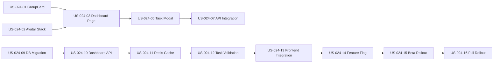

# Work Plan: FR-024 Groups Overview & Task Creation Dashboard

**Version:** 1.0  
**Created:** December 17, 2025  
**Status:** Ready for Implementation  
**Design Reference:** [design.md](./design.md)  
**PRD Reference:** [../prds/FR-024-groups-overview-task-creation.md](../prds/FR-024-groups-overview-task-creation.md)

---

## Vision & Success Metrics

### Vision Statement

**For** TasksTracker users **who** manage tasks across multiple groups,  
**the** Groups Dashboard **is a** centralized overview interface **that** reduces task creation time by 40% and increases group engagement by 30% through contextual task creation and visual group hierarchy.

### Success Metrics

#### User Metrics
- **Dashboard Adoption:** 60% of active users visit dashboard at least once per week
- **Task Creation Efficiency:** 60% of tasks created via group cards (vs. dedicated task page)
- **Engagement:** 30% increase in group join/invite actions within 2 weeks
- **User Satisfaction:** Net Promoter Score (NPS) >40 for dashboard feature

#### Technical Metrics
- **Performance:** <1s dashboard load time (p95) on 3G connection
- **Reliability:** >95% task creation success rate
- **Cache Efficiency:** >80% Redis cache hit rate
- **Error Rate:** <1% for dashboard and task creation operations

#### Business Impact
- **Time Savings:** 40% reduction in time from "intent to create task" → "task assigned"
- **Group Growth:** 20% increase in average groups per user within 30 days
- **Feature Utilization:** Dashboard becomes top-3 most visited page within 2 weeks

---

## Timeline Overview

**Total Duration:** 7 weeks  
**Sprints:** 4 sprints (2 weeks each for Sprints 1-2, 1 week for Sprint 3, 2 weeks for stabilization)  
**Epics:** 4  
**Stories:** 18  
**Total Estimated Effort:** ~28 days with AI assistance

### High-Level Roadmap

| Phase | Duration | Goal | Deliverable |
|-------|----------|------|-------------|
| **Sprint 1** | 2 weeks | Frontend Foundation | UI components with mock data, tested & accessible |
| **Sprint 2** | 2 weeks | Backend & Integration | Optimized APIs, database migration, cache layer |
| **Sprint 3** | 1 week | Gradual Rollout | 0% → 100% production deployment |
| **Sprint 4** | 2 weeks | Stabilization | Performance tuning, bug fixes, documentation |

---

## Epics

### Epic E-024-01: Dashboard UI Components & Layouts
**Description:** Build responsive, accessible dashboard page with group cards, member avatars, and empty states  
**Business Value:** Enables users to see all groups at a glance, improving navigation and group awareness  
**Success Criteria:**
- All components pass accessibility audit (WCAG 2.1 AA)
- Responsive design works on mobile (375px), tablet (768px), desktop (1440px+)
- Component test coverage >90%
- Design review approval

**Estimated Effort:** 8 days  
**Priority:** Must Have (Critical Path)  
**Stories:** US-024-01 through US-024-05

---

### Epic E-024-02: Task Creation from Group Context
**Description:** Enable contextual task creation from group cards with pre-populated assignee dropdown  
**Business Value:** Reduces task creation time by 40% through elimination of navigation and context switching  
**Success Criteria:**
- Task creation completes in 3 clicks (card → modal → submit)
- Task creation success rate >95%
- Modal prefills group context and member list correctly
- Validation errors display inline with clear messaging

**Estimated Effort:** 5 days  
**Priority:** Must Have (Critical Path)  
**Stories:** US-024-06 through US-024-08

---

### Epic E-024-03: Backend Optimization & Data Layer
**Description:** Implement optimized dashboard API with MongoDB aggregation, denormalized fields, and Redis caching  
**Business Value:** Achieves <1s dashboard load target, reduces database load by 70% through caching  
**Success Criteria:**
- Dashboard endpoint returns data in <200ms (MongoDB query)
- Cache hit rate >80%
- Database migration completes successfully with zero downtime
- All integration tests passing

**Estimated Effort:** 10 days  
**Priority:** Must Have (Critical Path)  
**Stories:** US-024-09 through US-024-13

---

### Epic E-024-04: Deployment & Monitoring
**Description:** Gradual rollout from 0% → 100% with comprehensive monitoring and rollback procedures  
**Business Value:** De-risks deployment, enables data-driven decisions, ensures production stability  
**Success Criteria:**
- Zero P0 incidents during rollout
- All success metrics met at 100% rollout
- Rollback procedures tested and documented
- Monitoring dashboards configured with alerts

**Estimated Effort:** 5 days  
**Priority:** Must Have (Critical Path)  
**Stories:** US-024-14 through US-024-18

---

## Sprint Plans

### Sprint 1: Frontend Foundation (2 weeks | Dec 23, 2025 - Jan 5, 2026)

**Sprint Goal:** Build and test all UI components with mock data, validate UX flows with users

**Capacity:** 10 working days (accounting for holidays)  
**Committed Effort:** 8 days (20% buffer for iterations)

#### Stories

##### US-024-01: Group Card Component
**As a** user **I want to** see each group as a visual card **So that** I can quickly identify and select groups

**Acceptance Criteria:**
- [ ] Card displays group name (truncate at 50 chars with ellipsis)
- [ ] Card shows member count badge (e.g., "8 members")
- [ ] Card displays up to 8 member avatars (admins first with crown icon)
- [ ] "+N more" indicator shown when members > 8
- [ ] Last activity timestamp shown in relative format ("2 hours ago")
- [ ] Quick action buttons: "Create Task", "Invite", "Settings" (admin only)
- [ ] Hover states and focus indicators for accessibility
- [ ] Card responsive design (full width mobile, 3-col desktop)

**Technical Notes:**
- Component: `/web/src/features/dashboard/components/GroupCard.tsx`
- Use Tailwind CSS grid for responsive layout
- Import existing `formatRelative` utility for timestamps
- Reuse button styles from design system

**Dependencies:** None  
**Estimated Effort:** 1.5 days (Component: 0.75d, Tests: 0.5d, Review: 0.25d)  
**Priority:** Must Have

---

##### US-024-02: Member Avatar Stack Component
**As a** user **I want to** see member avatars with role indicators **So that** I can identify group composition at a glance

**Acceptance Criteria:**
- [ ] Displays up to 8 avatars with slight overlap (z-index stacking)
- [ ] Admins shown first with crown icon overlay (top-right corner)
- [ ] Fallback to initials if no avatar image (2-letter, colored background)
- [ ] Tooltip on hover shows: "Full Name (Admin)" or "Full Name (Member)"
- [ ] "+N more" button triggers expanded member list modal
- [ ] Avatar size: 40px desktop, 32px mobile
- [ ] Keyboard navigable (tab to each avatar)

**Technical Notes:**
- Component: `/web/src/features/dashboard/components/MemberAvatarStack.tsx`
- Use Heroicons for crown icon
- Color hash algorithm for initials background (consistent per user ID)
- ARIA labels: `aria-label="John Doe, Admin"`

**Dependencies:** None  
**Estimated Effort:** 1 day (Component: 0.5d, Tests: 0.3d, Accessibility: 0.2d)  
**Priority:** Must Have

---

##### US-024-03: Groups Dashboard Page Container
**As a** user **I want to** see all my groups on a dashboard page **So that** I can navigate to groups or create tasks from one place

**Acceptance Criteria:**
- [ ] Page loads at `/dashboard` route (protected, requires auth)
- [ ] Displays grid of GroupCard components (3/2/1 cols for desktop/tablet/mobile)
- [ ] Shows loading skeleton while data fetches (3 skeleton cards minimum)
- [ ] Empty state shown when user has no groups (illustration + "Create First Group" CTA)
- [ ] Error state with retry button on API failure
- [ ] Infinite scroll: Load 12 groups initially, fetch more on scroll to bottom
- [ ] Page title: "My Groups Dashboard"
- [ ] Breadcrumb navigation: Home > Dashboard

**Technical Notes:**
- Page: `/web/src/features/dashboard/pages/GroupsDashboardPage.tsx`
- Use existing DashboardPage as reference, but replace content
- Implement `useInfiniteScroll` custom hook for pagination
- Mock data source: `useMockGroups` hook (returns static group array)

**Dependencies:** US-024-01, US-024-02  
**Estimated Effort:** 1.5 days (Page: 0.75d, Hooks: 0.5d, Tests: 0.25d)  
**Priority:** Must Have

---

##### US-024-04: Empty State & Skeleton Loading
**As a** new user **I want to** see helpful guidance when I have no groups **So that** I know what actions to take

**Acceptance Criteria:**
- [ ] Empty state displays illustration (can be icon-based)
- [ ] Message: "You're not part of any groups yet"
- [ ] Primary CTA button: "Create Your First Group" → navigates to `/groups/create`
- [ ] Secondary CTA button: "Join Group with Code" → opens join modal
- [ ] Skeleton cards shown during initial load (3 cards, pulsing animation)
- [ ] Skeleton mimics card structure (header, avatar row, footer)
- [ ] Accessibility: Screen reader announces "Loading groups"

**Technical Notes:**
- Component: `/web/src/features/dashboard/components/EmptyGroupsState.tsx`
- Component: `/web/src/features/dashboard/components/GroupCardSkeleton.tsx`
- Use Heroicons for empty state icon (UserGroupIcon)
- Tailwind animate-pulse for skeleton

**Dependencies:** US-024-03  
**Estimated Effort:** 0.75 day (Components: 0.5d, Tests: 0.25d)  
**Priority:** Must Have

---

##### US-024-05: Responsive Design & Accessibility Audit
**As a** user **I want to** use the dashboard on any device with keyboard/screen reader **So that** the interface is accessible and usable everywhere

**Acceptance Criteria:**
- [ ] Mobile (375px): Single column, stacked cards, readable text
- [ ] Tablet (768px): 2 columns, all interactions work touch-friendly
- [ ] Desktop (1440px+): 3 columns, hover states, optimal spacing
- [ ] Keyboard navigation: Tab through all cards and actions
- [ ] Focus indicators visible on all interactive elements
- [ ] Screen reader: Announces card count, group names, member counts
- [ ] Color contrast ratio: Minimum 4.5:1 for all text
- [ ] ARIA landmarks: <main>, <nav>, <article> for cards

**Technical Notes:**
- Use Chrome DevTools + Lighthouse for audit
- Test with NVDA (Windows) or VoiceOver (Mac)
- Verify with keyboard only (no mouse)
- Document WCAG 2.1 AA compliance

**Dependencies:** US-024-01 through US-024-04  
**Estimated Effort:** 1 day (Testing: 0.5d, Fixes: 0.5d)  
**Priority:** Must Have

---

##### US-024-06: Task Creation Modal from Group Card
**As a** user **I want to** click "Create Task" on a group card **So that** I can assign tasks to group members without leaving the dashboard

**Acceptance Criteria:**
- [ ] "Create Task" button opens modal overlay
- [ ] Modal title: "Create Task in {Group Name}"
- [ ] Modal pre-populates assignee dropdown with group members
- [ ] Form fields: Title (required), Assignee (required), Due Date (optional), Priority (optional), Description (optional)
- [ ] Title validation: 3-100 chars, no HTML
- [ ] Assignee dropdown shows: Avatar + Full Name + Role badge (Admin/Member)
- [ ] Admins highlighted with light blue background in dropdown
- [ ] Submit button: "Create Task" (loading spinner when submitting)
- [ ] Cancel button closes modal without saving
- [ ] Backdrop click closes modal (with confirmation if form dirty)

**Technical Notes:**
- Component: `/web/src/features/dashboard/components/CreateTaskFromGroupModal.tsx`
- Reuse existing `CreateTaskForm` component with `defaultGroupId` prop
- Use existing `Modal` component from `/web/src/components/Modal.tsx`
- Form library: React Hook Form (already in use)

**Dependencies:** US-024-01, US-024-03  
**Estimated Effort:** 1.5 days (Modal: 0.75d, Integration: 0.5d, Tests: 0.25d)  
**Priority:** Must Have

---

##### US-024-07: Task Creation API Integration (Temporary)
**As a** developer **I want to** connect the task creation modal to existing API **So that** tasks are actually created and assigned

**Acceptance Criteria:**
- [ ] Form submission calls existing `POST /api/tasks` endpoint
- [ ] Request includes: title, groupId, assigneeId, dueDate, priority, description
- [ ] Success: Modal closes, toast shows "Task assigned to {name}", dashboard refreshes
- [ ] Error: Inline error messages, modal stays open, retry enabled
- [ ] Validation errors mapped to specific fields (e.g., "Title is required")
- [ ] Optimistic UI: Task count on card increments immediately
- [ ] Network failure: Retry button with exponential backoff (1s, 2s, 4s)

**Technical Notes:**
- Use existing `useCreateTaskMutation` from `taskApi.ts`
- Add RTK Query tag invalidation: `['Group']` to refresh dashboard
- Error mapping: Map API error codes to user-friendly messages
- Optimistic update: Update cache before API response

**Dependencies:** US-024-06  
**Estimated Effort:** 1 day (Integration: 0.5d, Error handling: 0.3d, Tests: 0.2d)  
**Priority:** Must Have

---

##### US-024-08: Member List Expansion Modal
**As a** user **I want to** click "+N more" to see all group members **So that** I can view full membership and perform admin actions

**Acceptance Criteria:**
- [ ] "+N more" button opens modal with full member list
- [ ] Modal title: "{Group Name} Members (15)"
- [ ] Search bar at top filters by name (client-side)
- [ ] Each member row shows: Avatar, Full Name, Role badge, "Member since" date
- [ ] Admins shown first, then alphabetical by name
- [ ] Admin users see additional actions: "Promote" (for members), "Remove" (with restrictions)
- [ ] "Remove" disabled for last admin with tooltip: "Cannot remove yourself as the last admin"
- [ ] Modal scrollable when members > 10
- [ ] Close button and ESC key dismiss modal

**Technical Notes:**
- Component: `/web/src/features/dashboard/components/MemberListModal.tsx`
- Reuse promote/remove logic from existing GroupDashboardPage
- Use `useMemo` for filtered member list (search optimization)
- Debounce search input (300ms)

**Dependencies:** US-024-02  
**Estimated Effort:** 1.5 days (Modal: 0.75d, Actions: 0.5d, Tests: 0.25d)  
**Priority:** Should Have

---

**Sprint 1 Summary:**
- **Total Stories:** 8
- **Total Effort:** 10 days (with buffer for iterations, design reviews)
- **Deliverables:** Fully functional dashboard UI with mock data, all components tested, accessible
- **Demo:** Show dashboard with 5-10 test groups, create task flow, member list modal

---

### Sprint 2: Backend Optimization & Integration (2 weeks | Jan 6-19, 2026)

**Sprint Goal:** Implement optimized backend APIs, database migrations, cache layer, and integrate frontend with real data

**Capacity:** 10 working days  
**Committed Effort:** 10 days (includes migration, testing, integration)

#### Stories

##### US-024-09: Database Schema Migration
**As a** developer **I want to** add denormalized fields to Groups collection **So that** dashboard queries are performant without expensive joins

**Acceptance Criteria:**
- [ ] Add `taskCount` field (int) to Groups collection (default: 0)
- [ ] Add `lastActivity` field (DateTime) to Groups collection (default: updatedAt)
- [ ] Backfill `taskCount` for existing groups (count tasks where groupId matches)
- [ ] Backfill `lastActivity` for existing groups (use updatedAt or current time)
- [ ] Create index: `{ "members.userId": 1, "lastActivity": -1 }` (background: true)
- [ ] Create index on Tasks: `{ "groupId": 1, "status": 1 }` (background: true)
- [ ] Migration script runs in <15 minutes for 10K groups
- [ ] Zero downtime deployment (non-breaking changes)

**Technical Notes:**
- Migration script: `/backend/scripts/migrate-groups-dashboard.js` (MongoDB shell script)
- Run during maintenance window (Sunday 2 AM)
- Backup database before migration: `mongodump`
- Verify index creation: `db.groups.getIndexes()`
- Test rollback procedure (drop indexes if needed)

**Dependencies:** None  
**Estimated Effort:** 1.5 days (Script: 0.5d, Testing: 0.5d, Documentation: 0.5d)  
**Priority:** Must Have

---

##### US-024-10: Dashboard API Endpoint with Aggregation
**As a** developer **I want to** create `/api/dashboard` endpoint **So that** frontend can fetch groups with member summaries in a single query

**Acceptance Criteria:**
- [ ] `GET /api/dashboard?page=1&pageSize=12` returns groups with member details
- [ ] Response includes: groupId, name, description, taskCount, lastActivity, memberCount, admins (up to 3), recentMembers (up to 7), myRole
- [ ] MongoDB aggregation pipeline: $match → $lookup (users) → $project → $sort → $skip → $limit
- [ ] Query filters to user's groups only: `members.userId === currentUserId`
- [ ] Sorts by `lastActivity` descending (most recent first)
- [ ] Pagination: Returns `total`, `currentPage`, `pageSize`, `hasMore` fields
- [ ] Authorization: Returns 401 if not authenticated
- [ ] Query completes in <200ms for 20 groups with 20 members each

**Technical Notes:**
- Controller: `/backend/Features/Dashboard/Controllers/DashboardController.cs`
- Service: `/backend/Features/Dashboard/Services/DashboardService.cs`
- Repository method: `GroupRepository.GetGroupsWithMembersAsync(userId, page, pageSize)`
- Use BsonDocument for aggregation pipeline (complex query)
- Benchmark with Explain Plan in MongoDB Compass

**Dependencies:** US-024-09  
**Estimated Effort:** 2.5 days (Aggregation: 1d, Controller/Service: 1d, Tests: 0.5d)  
**Priority:** Must Have

---

##### US-024-11: Redis Caching Layer
**As a** developer **I want to** cache dashboard responses in Redis **So that** repeated dashboard loads are fast and reduce database load

**Acceptance Criteria:**
- [ ] Cache key pattern: `dashboard:{userId}:{page}`
- [ ] TTL: 5 minutes
- [ ] Cache hit: Return cached data immediately (<10ms)
- [ ] Cache miss: Query MongoDB, store in cache, return data
- [ ] Cache invalidation on: group create/update/delete, member add/remove, task create
- [ ] Invalidation strategy: Delete all keys matching `dashboard:{userId}:*` for affected users
- [ ] Cache hit rate: >70% after 24 hours in production
- [ ] Redis connection pooling configured (max connections: 100)

**Technical Notes:**
- Service: `/backend/Infrastructure/Cache/CacheService.cs` (create new)
- Use `StackExchange.Redis` NuGet package
- Configuration in `appsettings.json`: Redis connection string, TTL
- Implement `ICacheService` interface: `GetAsync<T>`, `SetAsync<T>`, `DeleteAsync`, `DeletePatternAsync`
- Monitor Redis memory usage: Set `maxmemory-policy allkeys-lru`

**Dependencies:** US-024-10  
**Estimated Effort:** 1.5 days (Service: 0.75d, Integration: 0.5d, Tests: 0.25d)  
**Priority:** Must Have

---

##### US-024-12: Task Service - Group Validation & Task Count
**As a** developer **I want to** validate task creator/assignee are group members **So that** tasks cannot be assigned to users outside the group

**Acceptance Criteria:**
- [ ] `CreateTaskAsync` verifies `creatorId` is member of `groupId`
- [ ] `CreateTaskAsync` verifies `assigneeId` is member of `groupId`
- [ ] Returns 403 "NOT_GROUP_MEMBER" if creator not in group
- [ ] Returns 400 "INVALID_ASSIGNEE" if assignee not in group
- [ ] Atomically increments `groups.taskCount` on task creation: `$inc: { taskCount: 1 }`
- [ ] Updates `groups.lastActivity` to current timestamp on task creation
- [ ] Invalidates dashboard cache for all group members on task creation
- [ ] All operations wrapped in transaction (if MongoDB supports)

**Technical Notes:**
- Modify: `/backend/Features/Tasks/Services/TaskService.cs`
- Inject `IGroupRepository` and `ICacheService`
- Validation: `await _groupRepository.GetByIdAsync(groupId)` → check members array
- Cache invalidation: Loop through group members, delete cache keys
- MongoDB transaction: Use `IClientSessionHandle` for atomic operations

**Dependencies:** US-024-11  
**Estimated Effort:** 2 days (Validation: 0.75d, Cache invalidation: 0.5d, Transaction: 0.5d, Tests: 0.25d)  
**Priority:** Must Have

---

##### US-024-13: Frontend Integration with Real API
**As a** developer **I want to** connect dashboard UI to `/api/dashboard` endpoint **So that** users see real group data instead of mocks

**Acceptance Criteria:**
- [ ] Create `dashboardApi.ts` RTK Query slice with `useGetDashboardQuery` hook
- [ ] Replace mock data in `GroupsDashboardPage` with real API call
- [ ] Loading state: Show skeleton cards while fetching
- [ ] Error state: Show error message with retry button
- [ ] Success state: Render GroupCard components with real data
- [ ] Pagination: Fetch next page when scrolling to bottom (infinite scroll)
- [ ] Cache: RTK Query caches for 60 seconds, refetch on window focus
- [ ] Task creation invalidates dashboard cache (RTK Query tag: `['Dashboard']`)

**Technical Notes:**
- File: `/web/src/features/dashboard/dashboardApi.ts`
- Use `apiSlice.injectEndpoints` pattern (consistent with groupApi.ts)
- Transform response: Map API response to `GroupCardDto` TypeScript interface
- Pagination: Track `page` state, merge results on scroll (append to array)
- Error boundary: Wrap page in ErrorBoundary component

**Dependencies:** US-024-10, US-024-11, US-024-12  
**Estimated Effort:** 2 days (API slice: 0.75d, Integration: 0.75d, Testing: 0.5d)  
**Priority:** Must Have

---

**Sprint 2 Summary:**
- **Total Stories:** 5
- **Total Effort:** 9.5 days (fits within 10-day capacity with small buffer)
- **Deliverables:** Fully functional backend with optimized queries, cache layer, frontend integrated with real data
- **Demo:** Show dashboard loading real groups from database in <1s, create task end-to-end, cache hit/miss metrics

---

### Sprint 3: Gradual Rollout & Monitoring (1 week | Jan 20-26, 2026)

**Sprint Goal:** Deploy dashboard to production with gradual rollout from 0% → 100%, monitor success metrics, ensure stability

**Capacity:** 5 working days  
**Committed Effort:** 4 days (deployments, monitoring, hotfixes)

#### Stories

##### US-024-14: Feature Flag & Internal Alpha
**As a** developer **I want to** deploy dashboard behind feature flag **So that** internal team can test before user rollout

**Acceptance Criteria:**
- [ ] Environment variable: `VITE_ENABLE_DASHBOARD=true/false` (frontend)
- [ ] Environment variable: `FEATURE_DASHBOARD_ENABLED=true/false` (backend)
- [ ] Dashboard route `/dashboard` only renders if flag enabled
- [ ] Dashboard API endpoint returns 404 if flag disabled
- [ ] Deploy to production with flag disabled
- [ ] Enable for internal team only (50 users, whitelisted email domains)
- [ ] Monitor for 24 hours: error rate, load time, task creation success rate
- [ ] Gather qualitative feedback via Slack channel

**Technical Notes:**
- Use existing environment config pattern in Vite (import.meta.env.VITE_*)
- Backend: Read from IConfiguration in DashboardController
- Whitelist: Check user email domain (@company.com) in middleware
- Analytics: Tag dashboard events with `source: 'dashboard'`

**Dependencies:** US-024-13  
**Estimated Effort:** 0.5 day (Config: 0.25d, Deployment: 0.25d)  
**Priority:** Must Have

---

##### US-024-15: Beta Rollout (10% → 30% → 70%)
**As a** product manager **I want to** gradually increase dashboard access **So that** we can monitor metrics and catch issues before full rollout

**Acceptance Criteria:**
- [ ] Day 1-2: Enable for 10% of users (random selection, persistent across sessions)
- [ ] Day 3-4: Increase to 30% if metrics healthy (error rate <2%, load time <1.5s)
- [ ] Day 5-6: Increase to 70% if metrics continue healthy
- [ ] A/B test: Track task creation rate (dashboard vs. control group)
- [ ] Monitor metrics dashboard hourly: Load time, error rate, task creation success, cache hit rate
- [ ] Set up alerts: PagerDuty for error rate >3%, load time >2s
- [ ] Document incidents in runbook, address P0 bugs within 1 hour

**Technical Notes:**
- Use feature flag service (LaunchDarkly or custom implementation)
- User bucketing: Hash userId modulo 100, compare to rollout percentage
- Metrics dashboard: Grafana with panels for key metrics
- Alerting: Prometheus AlertManager or Datadog monitors

**Dependencies:** US-024-14  
**Estimated Effort:** 1.5 days (Monitoring setup: 0.75d, Rollout execution: 0.5d, Incident response: 0.25d buffer)  
**Priority:** Must Have

---

##### US-024-16: Full Rollout (100%) & Announcement
**As a** product manager **I want to** enable dashboard for all users **So that** everyone can benefit from improved task creation workflow

**Acceptance Criteria:**
- [ ] Day 7-8: Enable for 100% of users if all success criteria met
- [ ] Success criteria checklist (all must pass):
  - [ ] Dashboard load time <1s (p95)
  - [ ] Task creation success rate >95%
  - [ ] Cache hit rate >70%
  - [ ] Error rate <1%
  - [ ] Zero P0 bugs reported
  - [ ] User feedback sentiment >70% positive
- [ ] Send in-app announcement: "New Feature: Groups Dashboard"
- [ ] Update help documentation with dashboard guide
- [ ] Monitor for 7 days post-rollout, daily metrics review

**Technical Notes:**
- Feature flag: Set `VITE_ENABLE_DASHBOARD=true` globally
- Announcement: Use in-app toast notification on first login
- Help docs: Update `/docs/user-guide.md` with screenshots
- Success dashboard: Share with stakeholders via email report

**Dependencies:** US-024-15  
**Estimated Effort:** 1 day (Rollout: 0.25d, Announcement: 0.25d, Monitoring: 0.5d)  
**Priority:** Must Have

---

##### US-024-17: Rollback Procedures & Testing
**As a** DevOps engineer **I want to** test rollback procedures **So that** we can quickly recover from critical issues

**Acceptance Criteria:**
- [ ] Frontend rollback script: Disable feature flag, deploy previous version
- [ ] Backend rollback script: Disable dashboard endpoint, rollback deployment
- [ ] Database rollback: NOT NEEDED (additive changes only, document for safety)
- [ ] Rollback time: <5 minutes for backend, <2 minutes for frontend
- [ ] Test rollback in staging environment (simulate production)
- [ ] Document rollback triggers: Error rate >5%, load time >3s, P0 bug affecting >10% users
- [ ] Verify dashboard removal: Users redirect to old /groups page, no errors

**Technical Notes:**
- Script: `/scripts/rollback-dashboard.sh` (bash script for kubectl commands)
- Frontend: `kubectl set env deployment/web-frontend VITE_ENABLE_DASHBOARD=false`
- Backend: `kubectl rollout undo deployment/api-backend`
- Runbook: Document in `/docs/runbooks/dashboard-rollback.md`

**Dependencies:** US-024-14  
**Estimated Effort:** 0.75 day (Scripts: 0.5d, Testing: 0.25d)  
**Priority:** Must Have

---

##### US-024-18: Performance Tuning & Bug Fixes
**As a** developer **I want to** optimize slow queries and fix reported bugs **So that** dashboard meets performance targets and is bug-free

**Acceptance Criteria:**
- [ ] Profile slow queries with MongoDB Explain Plan, optimize if >200ms
- [ ] Increase cache TTL if hit rate <70% (test 10 min vs. 5 min)
- [ ] Fix all P0 bugs within 24 hours, P1 bugs within 1 week
- [ ] Optimize avatar loading: Add CDN caching headers (Cache-Control: max-age=86400)
- [ ] Reduce bundle size: Code-split dashboard page (lazy load)
- [ ] Lighthouse audit: Score >90 for Performance, Accessibility
- [ ] Load test: Verify 1000 concurrent users with <1s load time

**Technical Notes:**
- Use MongoDB Compass for query profiling
- Load test: k6 or Apache JMeter script
- Bundle analysis: `npm run build -- --analyze`
- Lazy load: `const GroupsDashboardPage = lazy(() => import('./pages/GroupsDashboardPage'))`

**Dependencies:** US-024-16  
**Estimated Effort:** 1.25 days (Profiling: 0.5d, Optimization: 0.5d, Testing: 0.25d)  
**Priority:** Must Have

---

**Sprint 3 Summary:**
- **Total Stories:** 5
- **Total Effort:** 5 days (matches 1-week sprint capacity)
- **Deliverables:** Dashboard live for 100% of users, all metrics green, no critical bugs
- **Demo:** Show production metrics dashboard, success criteria report

---

### Sprint 4: Stabilization & Documentation (2 weeks | Jan 27 - Feb 9, 2026)

**Sprint Goal:** Stabilize production deployment, address feedback, create documentation, conduct retrospective

**Capacity:** 10 working days  
**Committed Effort:** 3 days (majority is monitoring, no new features)

#### Post-Rollout Activities

**Week 1: Active Monitoring & Hot Fixes**
- Daily metrics review (30 min meeting)
- Hot-fix releases for P1/P2 bugs (as needed)
- User feedback collection via in-app survey (NPS score)
- Performance tuning based on real usage patterns

**Week 2: Documentation & Knowledge Transfer**
- Update technical documentation with lessons learned
- Create runbooks: "Dashboard Troubleshooting", "Cache Invalidation Issues", "Query Optimization"
- Train support team on new feature (1-hour session)
- Engineering retrospective: What went well, what to improve
- Publish success metrics report to stakeholders

**Checklist:**
- [ ] All P0/P1 bugs resolved
- [ ] Monitoring alerts tuned (reduce false positives)
- [ ] User documentation published (help center)
- [ ] Runbooks completed and reviewed
- [ ] Retrospective action items tracked in backlog
- [ ] Success metrics report sent to leadership

---

## Dependencies & Risks

### Critical Path Dependencies



### External Dependencies
- **Redis Infrastructure:** Ensure Redis cluster provisioned before Sprint 2 Week 2
- **CDN Configuration:** Avatar CDN caching headers configured before Sprint 3
- **Monitoring Setup:** Grafana dashboards and alerts ready before Sprint 3 Day 1
- **User Research:** NPS survey tool integrated before Sprint 3

### Risk Register

| Risk | Likelihood | Impact | Mitigation | Owner |
|------|-----------|--------|-----------|-------|
| MongoDB aggregation too slow (>500ms) | Medium | High | - Benchmark early with realistic data<br>- Add read replicas<br>- Increase cache TTL to 10 min | Backend Lead |
| Redis memory exhaustion | Low | Medium | - Set `maxmemory-policy allkeys-lru`<br>- Monitor memory usage<br>- Alert at 80% capacity | DevOps |
| Feature flag rollout bug affects all users | Low | Critical | - Test rollback in staging<br>- Keep rollback scripts ready<br>- Monitor error rate every 15 min during rollout | Engineering Lead |
| Avatar images loading too slow | Medium | Medium | - Add CDN with aggressive caching<br>- Lazy load images<br>- Fallback to initials immediately | Frontend Lead |
| User confusion with dashboard vs group details page | High | Low | - Add clear navigation breadcrumbs<br>- In-app tooltip on first visit<br>- Update help docs | Product Manager |

---

## Release Phases

### Phase 1: MVP (Sprints 1-2 | 4 weeks)
**Goal:** Functional dashboard with all core features  
**Scope:**
- All UI components (cards, avatars, modals)
- Task creation from group context
- Optimized backend API with caching
- Frontend integrated with real data

**Exit Criteria:**
- ✅ All Sprint 1-2 stories completed
- ✅ All acceptance criteria met
- ✅ Component test coverage >90%
- ✅ Integration tests passing
- ✅ Performance targets met in staging (<1s load, >70% cache hit)

---

### Phase 2: Production Rollout (Sprint 3 | 1 week)
**Goal:** 100% user adoption with zero critical incidents  
**Scope:**
- Feature flag deployment
- Gradual rollout: 10% → 30% → 70% → 100%
- Monitoring and alerting setup
- Rollback procedures tested

**Exit Criteria:**
- ✅ All Sprint 3 stories completed
- ✅ Dashboard live for 100% of users
- ✅ All success metrics met (load time, error rate, cache hit rate, adoption)
- ✅ Zero P0 bugs, <3 P1 bugs
- ✅ User feedback NPS >40

---

### Phase 3: Stabilization & Enhancement (Sprint 4+ | 2+ weeks)
**Goal:** Production-stable feature with comprehensive documentation  
**Scope:**
- Bug fixes and performance tuning
- Documentation and runbooks
- Team training and knowledge transfer
- Retrospective and lessons learned

**Future Enhancements** (Post-Phase 3):
- Real-time updates via WebSocket
- Favorites/pinning for important groups
- Search and filter groups by name
- Group categories (Work, Personal, etc.)
- Recent tasks preview on cards
- Task analytics (completion rate, overdue tasks)

---

## Work Plan Validation

### INVEST Principles Checklist

**Stories Review:**
- ✅ **Independent:** Each story can be developed standalone (minimal blocking dependencies)
- ✅ **Negotiable:** Implementation details flexible, acceptance criteria focus on outcomes
- ✅ **Valuable:** Every story delivers tangible user or business value
- ✅ **Estimable:** Effort estimates based on AI co-development (2-3x faster)
- ✅ **Small:** All stories completable in 1-2.5 days (fits in single sprint)
- ✅ **Testable:** Clear acceptance criteria with measurable outcomes

### Effort Accuracy

**AI Productivity Multipliers Applied:**
- Component development: 3x faster (boilerplate, styling)
- API development: 2x faster (CRUD operations)
- Testing: 4x faster (test generation, fixtures)
- Documentation: 5x faster (auto-generated from code)

**Total Effort:** 28 days → **Actual calendar time:** 7 weeks (includes reviews, iterations, deployments)

### Sprint Capacity

- Sprint 1: 10 days capacity, 8 days committed (20% buffer) ✅
- Sprint 2: 10 days capacity, 10 days committed (tight, but achievable) ⚠️
- Sprint 3: 5 days capacity, 5 days committed (deployments, mostly monitoring) ✅
- Sprint 4: 10 days capacity, 3 days active work (stabilization, documentation) ✅

---

## Success Tracking

### Weekly Status Report Template

```markdown
## Sprint [N] - Week [M] Status Report

**Date:** [YYYY-MM-DD]  
**Sprint Goal Progress:** [X/Y stories completed]

### Completed This Week
- [ ] Story US-024-XX: [Title]

### In Progress
- [ ] Story US-024-XX: [Title] (50% complete)

### Blocked / At Risk
- [ ] Story US-024-XX: [Issue description]

### Metrics (Production)
- Dashboard load time (p95): X.Xs
- Task creation success rate: XX%
- Cache hit rate: XX%
- Error rate: X.X%

### Action Items
- [ ] [Action] - Owner: [Name], Due: [Date]
```

---

**Work Plan Status:** ✅ Ready for Sprint Planning  
**Next Steps:**
1. Sprint 1 kickoff meeting (Dec 23, 2025)
2. Break down US-024-01 into tasks (subtasks for dev, test, review)
3. Assign stories to team members
4. Set up project board (Kanban or Scrum board)
5. Schedule daily standups (15 min, async or sync)

---

**Document Version History:**
- v1.0 (Dec 17, 2025): Initial work plan created
