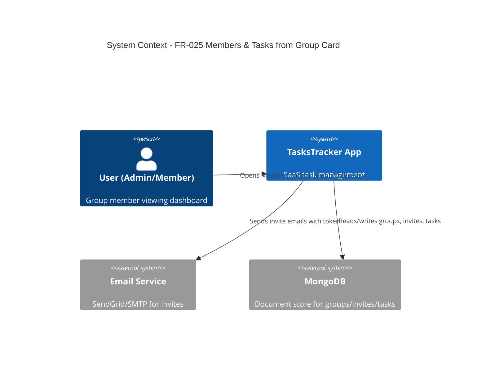
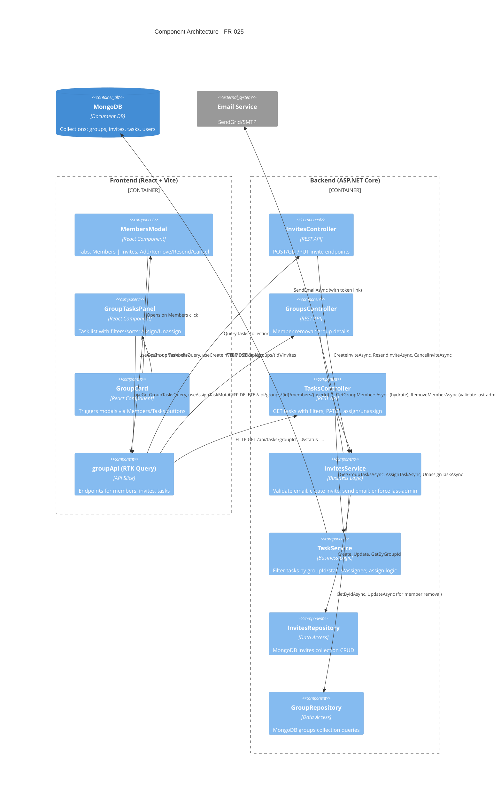
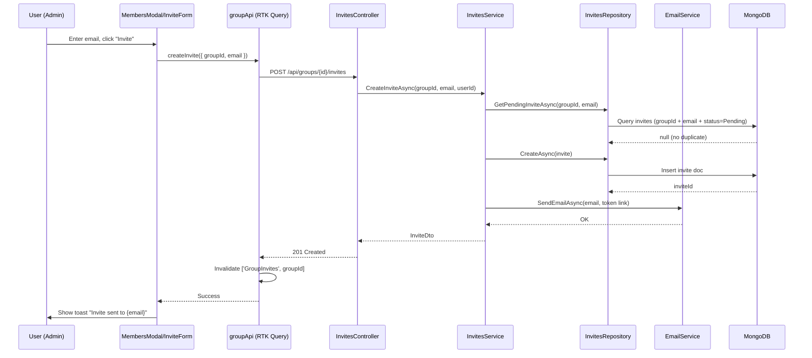

# Technical Design: Group Members & Tasks from Group Card

**Document Version:** 1.0  
**Last Updated:** December 17, 2025  
**Mode:** Feature Enhancement  
**PRD Reference:** [docs/prds/FR-025-group-members-and-tasks.md](../prds/FR-025-group-members-and-tasks.md)  
**Repository:** my-tasks-tracker-app

---

## 1. Executive Summary

**Business Value:**
- Reduces navigation friction: 50% fewer clicks for task assignment and member management
- Clarifies invite lifecycle: Pending/Joined/Declined states visible in one place
- Accelerates group administration: <5s invite send, <3s member removal (target)
- Improves onboarding: prevents duplicate invites, shows status transparency

**High-Level Approach:**
- Add Members modal (tabbed: Members | Invites) opened from group card
- Add Group Tasks view (drawer/modal) with filters/sorts opened from group card
- Introduce `invites` collection for email-based invite lifecycle
- Reuse existing GroupService/TaskService; add thin InviteService wrapper
- Frontend: React functional components with RTK Query for state; Tailwind for styling
- Backend: extend Groups feature with InvitesController, InvitesRepository; Task filtering endpoints

**Key Decisions:**
- **Invites are separate from GroupMember:** `invites` collection tracks pre-join state; on acceptance → create GroupMember
- **Last-admin protection:** Enforced server-side; prevents removing last admin; UI shows warning
- **Email-only invites (v1):** No username-based invites; token-based join flow via email link
- **Inline task assign/unassign:** Admin-only in v1; self-assign policy deferred (open question)
- **Cache invalidation strategy:** Invalidate group details + tasks on member/invite changes to refresh assignee lists
- **Pagination for large lists:** Members/invites/tasks use cursor or offset pagination (default 50 items)

---

## 2. Requirements Summary (from PRD)

**Functional Requirements:**
- Open Members modal from group card with tabs: Members, Invites
- Display members: First/Last Name, Role (Admin/RegularUser), JoinedAt
- Display invites: Email, Status (Pending/Joined/Declined), InvitedBy, InvitedAt
- Add Member (Admin): validate email; prevent duplicates (existing member or pending invite); send email with token
- Remove Member (Admin): confirm; block if last admin; revoke access
- Resend/Cancel Invite (Admin): allowed only when Pending; increment sendCount on resend
- Open Group Tasks view from group card
- List tasks: Name, Assignee (avatar/name), Status (Pending/InProgress/Completed)
- Filter by: Status, Assignee (All + members)
- Sort by: CreatedDate, UpdatedAt (asc/desc)
- Assign/Unassign inline (Admin); click row → details panel
- Persist filters/sort per group in localStorage

**Non-Functional Requirements:**
- Performance: P95 <150ms for list queries; <300ms for assign/unassign
- Error rate: <1% for invite send over 7 days
- Adoption: 80% of active groups use modals within 2 weeks
- Accessibility: keyboard navigation, focus trap in modals, ARIA labels
- Security: Admin-only actions enforced server-side; no email exposure to non-admins
- Logging: no tokens, emails, or PII in production logs

**Acceptance Criteria:**
- Admin can invite via email; email sent with join link; status=Pending
- Duplicate pending invite blocked; existing member blocked
- Admin can remove member; last admin removal blocked with error
- Admin can resend/cancel pending invite
- Members tab lists all members; Invites tab lists all invites (default: Pending/Joined/Declined visible)
- Tasks view filters by status/assignee; sorts by created/updated
- Assign/unassign reflects immediately; assignee avatar/name updates
- Filters/sort persist per group across sessions

**Constraints:**
- Use existing email infra (InvitationService stub; integrate SendGrid or SMTP later)
- No role change/promotion in this epic (display-only)
- No real-time updates (SignalR deferred)
- Self-assign policy TBD (default: Admin-only assignment)

**Assumptions:**
- **Assume:** Email addresses are unique per user (no multi-email accounts)
- **Assume:** Invite token is opaque, single-use, and validated on join
- **Assume:** Expired invites (e.g., 14-day default) marked via scheduled job or read-time evaluation (implementation TBD)
- **Inferred:** Group tasks already exist in `tasks` collection with `groupId` and `assignedUserId` fields
- **Inferred:** Frontend group card already has Members/Tasks buttons or will be added as part of this work

---

## 3. Current Architecture (Relevant Only)

| Component | Responsibility |
|-----------|---------------|
| `Group` (Domain) | Group entity with members list (`GroupMember[]`); roles: Admin/RegularUser |
| `GroupService` | Create/update groups; add/remove members (via invitation code join flow) |
| `InvitationService` | Sends email invitations (stub; logs URL); validates invitation codes |
| `GroupRepository` | MongoDB access for groups collection; queries by userId, invitationCode |
| `TaskItem` (Domain) | Task entity with groupId, assignedUserId, status (Pending/InProgress/Completed) |
| `TaskService` | CRUD tasks; assign/reassign; filter by groupId/status/assignee |
| `groupApi` (Frontend) | RTK Query endpoints for groups CRUD, member management, invites |
| `InviteMembersModal` (Frontend) | Existing modal for inviting via email (to be enhanced or replaced) |

**Integration Points:**
- Email sending: `InvitationService` logs URLs; needs SendGrid/SMTP integration (separate epic)
- User hydration: `UserRepository.GetByIdAsync` for displaying member names
- Auth: JWT-based; userId extracted from claims; role checked server-side

**Gaps/Constraints:**
- No `invites` collection exists; currently uses invitation code (shareable link) only
- No email-based invite tracking (Pending/Joined/Declined states)
- Tasks endpoint does not support group-scoped filtering with status/assignee query params
- Frontend group card may not have Members/Tasks buttons yet (verify in GroupDashboardPage)
- Last-admin protection not enforced in current `RemoveMemberAsync` (needs add)

---

## 4. Proposed Architecture

### 4.1 System Context (C4)



### 4.2 Component Architecture



---

## 5. Frontend Design (Client-Side First)

### 5.1 Component Breakdown

| Component | Props | Responsibility |
|-----------|-------|---------------|
| **MembersModal** | `{ groupId, isOpen, onClose }` | Modal with tabs: Members \| Invites; Admin sees Add/Remove/Resend/Cancel actions |
| **MembersTab** | `{ groupId, myRole }` | Lists members (First Last, Role badge, JoinedAt); Remove button (Admin only); last-admin protection |
| **InvitesTab** | `{ groupId, myRole }` | Lists invites (Email, Status chip, InvitedBy, InvitedAt); Resend/Cancel buttons (Admin, Pending only) |
| **InviteForm** | `{ groupId, onSuccess }` | Email input + submit; validates format; prevents duplicates; shows success toast |
| **GroupTasksPanel** | `{ groupId, isOpen, onClose }` | Drawer/modal with task list; filters (Status, Assignee); sort (Created/Updated); Assign/Unassign inline |
| **GroupTaskRow** | `{ task, members, myRole }` | Displays task name, assignee avatar/name, status chip; click → details panel; Assign dropdown (Admin) |
| **TaskDetailsSidePanel** | `{ taskId, groupId, myRole }` | Quick triage: edit assignee, status; close returns to list |

### 5.2 RTK Query Endpoints (New/Modified)

**New Endpoints:**
```typescript
// groupApi.ts additions
getGroupMembers: builder.query<MemberResponse[], string>  // groupId
getGroupInvites: builder.query<InviteResponse[], string>  // groupId
createInvite: builder.mutation<InviteResponse, { groupId: string; email: string }>
resendInvite: builder.mutation<void, { groupId: string; inviteId: string }>
cancelInvite: builder.mutation<void, { groupId: string; inviteId: string }>
removeMember: builder.mutation<void, { groupId: string; userId: string }>

// taskApi.ts (new or extend existing)
getGroupTasks: builder.query<TaskListResponse, { groupId: string; status?: string; assigneeId?: string; sortBy?: string; order?: 'asc'|'desc'; page?: number }>
assignTask: builder.mutation<TaskResponse, { taskId: string; userId: string }>
unassignTask: builder.mutation<TaskResponse, { taskId: string }>
```

**Invalidation Strategy:**
- `createInvite`, `resendInvite`, `cancelInvite` → invalidate `['GroupInvites', groupId]`
- `removeMember` → invalidate `['GroupMembers', groupId]`, `['GroupTasks', groupId]` (assignees list changes)
- `assignTask`, `unassignTask` → invalidate `['GroupTasks', groupId]`, `['Task', taskId]`

### 5.3 State Management

**localStorage Persistence:**
```typescript
// Key: `groupTasks:${groupId}`
// Value: { status?: string, assigneeId?: string, sortBy: string, order: 'asc'|'desc' }
```
- Read on mount; write on filter/sort change
- Clear on group switch or modal close (optional; UX decision)

**Accessibility:**
- Focus trap in modals; ESC to close; return focus to trigger button
- ARIA labels: `aria-label="Members modal"`, `role="dialog"`, `aria-describedby`
- Keyboard nav: Tab through list; Enter to select; Space for checkboxes

### 5.4 UI/UX Patterns

**Members Tab:**
- List: Avatar/Initials (32px) | First Last | Role badge (Admin/Member) | JoinedAt (relative, e.g., "2 days ago") | Remove icon (Admin only, hover red)
- Add Member button (Admin): Opens inline form or separate dialog with email input
- Empty state: "No members yet. Invite someone to get started!"
- Loading: Skeleton rows (shimmer animation)

**Invites Tab:**
- List: Email | Status chip (Pending=yellow, Joined=green, Declined=gray) | InvitedBy (name) | InvitedAt (relative) | Actions: Resend/Cancel (Pending only)
- Empty state: "No pending invites."
- Error handling: Toast for failures (duplicate email, network error)

**Group Tasks Panel:**
- Header: "Tasks in {groupName}" | Close button
- Filters row: Status dropdown (All/Pending/InProgress/Completed) | Assignee dropdown (All + member names)
- Sort row: "Sort by: Created (desc)" toggle
- Task rows: Task Name | Assignee (avatar + name or "Unassigned") | Status chip | Click → details side panel
- Inline Assign: Dropdown with member names (Admin only); saves on select
- Empty state: "No tasks match your filters."
- Loading: Skeleton rows

---

## 6. Backend Design

### 6.1 New Domain Model: Invite

```csharp
// backend/src/TasksTracker.Api/Core/Domain/Invite.cs
public class Invite
{
    [BsonId]
    [BsonRepresentation(BsonType.ObjectId)]
    public string Id { get; set; } = string.Empty;

    [BsonRepresentation(BsonType.ObjectId)]
    public string GroupId { get; set; } = string.Empty;

    public string Email { get; set; } = string.Empty;

    public InviteStatus Status { get; set; } = InviteStatus.Pending;

    public string Token { get; set; } = string.Empty;  // Opaque join token (GUID or JWT)

    [BsonRepresentation(BsonType.ObjectId)]
    public string InvitedBy { get; set; } = string.Empty;

    public DateTime InvitedAt { get; set; } = DateTime.UtcNow;

    public DateTime? RespondedAt { get; set; }  // Joined/Declined timestamp

    public DateTime? LastSentAt { get; set; }  // Last email send

    public int SendCount { get; set; } = 1;  // Resend counter

    public string? Notes { get; set; }  // Optional metadata
}

public enum InviteStatus
{
    Pending,
    Joined,
    Declined,
    Canceled,
    Expired
}
```

### 6.2 MongoDB Indexes

**invites collection:**
```javascript
db.invites.createIndex({ groupId: 1, status: 1, invitedAt: -1 });  // List/filter
db.invites.createIndex({ email: 1, groupId: 1 }, { unique: true, partialFilterExpression: { status: "Pending" } });  // Prevent duplicate pending
db.invites.createIndex({ token: 1 });  // Validate join link
```

**Rationale:**
- Compound index on `groupId + status + invitedAt` supports dashboard listing sorted by date
- Unique partial index prevents duplicate pending invites per group (reject at DB level)
- Token index for fast join validation

### 6.3 New Repository: InvitesRepository

```csharp
// backend/src/TasksTracker.Api/Core/Interfaces/IInvitesRepository.cs
public interface IInvitesRepository
{
    Task<Invite> CreateAsync(Invite invite);
    Task<Invite?> GetByIdAsync(string id);
    Task<Invite?> GetByTokenAsync(string token);
    Task<List<Invite>> GetByGroupIdAsync(string groupId, InviteStatus? status = null);
    Task<Invite?> GetPendingInviteAsync(string groupId, string email);  // Check duplicates
    Task UpdateAsync(string id, Invite invite);
    Task DeleteAsync(string id);
}
```

### 6.4 New Service: InvitesService

```csharp
// backend/src/TasksTracker.Api/Features/Groups/Services/InvitesService.cs
public class InvitesService : IInvitesService
{
    // Dependencies: IInvitesRepository, IGroupRepository, IUserRepository, IEmailService, ILogger

    public async Task<InviteDto> CreateInviteAsync(string groupId, string email, string invitedByUserId)
    {
        // 1. Validate group exists and inviter is Admin
        // 2. Check if email already a member (groupRepository.GetByIdAsync → members list)
        // 3. Check if pending invite exists (invitesRepository.GetPendingInviteAsync)
        // 4. Generate token (Guid.NewGuid().ToString())
        // 5. Create invite entity (status=Pending, invitedAt=now, sendCount=1)
        // 6. Save to DB (invitesRepository.CreateAsync)
        // 7. Send email with join link (emailService.SendAsync)
        // 8. Return DTO
    }

    public async Task ResendInviteAsync(string groupId, string inviteId, string userId)
    {
        // 1. Validate user is Admin
        // 2. Get invite; check status=Pending
        // 3. Increment sendCount, update lastSentAt
        // 4. Resend email
        // 5. Update invite
    }

    public async Task CancelInviteAsync(string groupId, string inviteId, string userId)
    {
        // 1. Validate user is Admin
        // 2. Get invite; check status=Pending
        // 3. Set status=Canceled, respondedAt=now
        // 4. Update invite
    }

    public async Task<List<InviteDto>> GetGroupInvitesAsync(string groupId, string userId)
    {
        // 1. Validate user is member (groupRepository)
        // 2. If Admin: return all invites (Pending/Joined/Declined)
        // 3. If Member: return empty (or own invites only if policy allows)
        // 4. Hydrate invitedBy user names
    }
}
```

**Last-Admin Protection Logic:**
```csharp
// In GroupService.RemoveMemberAsync (enhance existing)
public async Task RemoveMemberAsync(string groupId, string userIdToRemove, string requestingUserId)
{
    var group = await groupRepository.GetByIdAsync(groupId);
    
    // Existing checks: group exists, requesting user is Admin
    
    // NEW: Last-admin protection
    var admins = group.Members.Where(m => m.Role == GroupRole.Admin).ToList();
    if (admins.Count == 1 && admins[0].UserId == userIdToRemove)
    {
        throw new InvalidOperationException("Cannot remove the last admin. Promote another member first.");
    }
    
    // Proceed with removal
}
```

### 6.5 Modified Controller: GroupsController

```csharp
// Add endpoints (or create InvitesController under Groups feature)
[HttpGet("{groupId}/members")]
public async Task<ActionResult<List<MemberDto>>> GetMembers(string groupId)
{
    // Returns hydrated member list (First/Last/Role/JoinedAt)
}

[HttpDelete("{groupId}/members/{userId}")]
public async Task<ActionResult> RemoveMember(string groupId, string userId)
{
    // Validates last-admin; removes member
}

// Invites endpoints (or move to InvitesController)
[HttpPost("{groupId}/invites")]
public async Task<ActionResult<InviteDto>> CreateInvite(string groupId, [FromBody] CreateInviteRequest request)

[HttpGet("{groupId}/invites")]
public async Task<ActionResult<List<InviteDto>>> GetInvites(string groupId)

[HttpPost("{groupId}/invites/{inviteId}/resend")]
public async Task<ActionResult> ResendInvite(string groupId, string inviteId)

[HttpDelete("{groupId}/invites/{inviteId}")]
public async Task<ActionResult> CancelInvite(string groupId, string inviteId)
```

### 6.6 Modified Service: TaskService

```csharp
// Extend GetTasksAsync with group-scoped filtering
public async Task<TaskListResponse> GetGroupTasksAsync(
    string groupId, 
    string? status = null, 
    string? assigneeId = null, 
    string sortBy = "createdAt", 
    string order = "desc", 
    int page = 1, 
    int pageSize = 50)
{
    var filter = Builders<TaskItem>.Filter.Eq(t => t.GroupId, groupId);
    
    if (!string.IsNullOrEmpty(status))
    {
        filter &= Builders<TaskItem>.Filter.Eq(t => t.Status, Enum.Parse<TaskStatus>(status, true));
    }
    
    if (!string.IsNullOrEmpty(assigneeId))
    {
        filter &= Builders<TaskItem>.Filter.Eq(t => t.AssignedUserId, assigneeId);
    }
    
    var sortDef = order == "asc" 
        ? Builders<TaskItem>.Sort.Ascending(sortBy) 
        : Builders<TaskItem>.Sort.Descending(sortBy);
    
    var tasks = await taskRepository.GetPagedAsync(filter, sortDef, page, pageSize);
    
    // Hydrate assignee names (batch)
    var userIds = tasks.Select(t => t.AssignedUserId).Distinct().ToList();
    var users = await userRepository.GetByIdsAsync(userIds);
    
    return new TaskListResponse
    {
        Tasks = tasks.Select(t => MapToDto(t, users)),
        Total = await taskRepository.CountAsync(filter)
    };
}

public async Task<TaskDto> AssignTaskAsync(string taskId, string userId, string requestingUserId)
{
    // Validate task exists, requesting user is Admin
    // Update assignedUserId
    // Return updated task
}

public async Task<TaskDto> UnassignTaskAsync(string taskId, string requestingUserId)
{
    // Validate Admin; set assignedUserId to null or placeholder
}
```

### 6.7 API Endpoints Summary

| Method | Endpoint | Request | Response | Auth |
|--------|----------|---------|----------|------|
| GET | `/api/groups/{groupId}/members` | - | `MemberDto[]` | Member+ |
| DELETE | `/api/groups/{groupId}/members/{userId}` | - | 204 | Admin |
| POST | `/api/groups/{groupId}/invites` | `{ email }` | `InviteDto` | Admin |
| GET | `/api/groups/{groupId}/invites` | - | `InviteDto[]` | Admin |
| POST | `/api/groups/{groupId}/invites/{id}/resend` | - | 200 | Admin |
| DELETE | `/api/groups/{groupId}/invites/{id}` | - | 204 | Admin |
| GET | `/api/tasks?groupId={id}&status=...&assigneeId=...` | Query params | `TaskListResponse` | Member+ |
| PATCH | `/api/tasks/{id}/assign` | `{ userId }` | `TaskDto` | Admin |
| PATCH | `/api/tasks/{id}/unassign` | - | `TaskDto` | Admin |

---

## 7. Data Flow Sequences

### 7.1 Sequence: Create Invite



### 7.2 Sequence: Remove Member (Last-Admin Protection)

```mermaid
sequenceDiagram
    participant U as User (Admin)
    participant UI as MembersModal/MembersTab
    participant API as groupApi (RTK Query)
    participant Ctrl as GroupsController
    participant Svc as GroupService
    participant Repo as GroupRepository
    participant DB as MongoDB

    U->>UI: Click "Remove" on member row
    UI->>U: Confirm dialog "Remove {name}?"
    U->>UI: Confirm
    UI->>API: removeMember({ groupId, userId })
    API->>Ctrl: DELETE /api/groups/{id}/members/{userId}
    Ctrl->>Svc: RemoveMemberAsync(groupId, userId, requestingUserId)
    Svc->>Repo: GetByIdAsync(groupId)
    Repo->>DB: Find group
    DB-->>Repo: Group doc
    Svc->>Svc: Count admins
    alt Only 1 admin and removing self
        Svc-->>Ctrl: Throw InvalidOperationException("Cannot remove last admin")
        Ctrl-->>API: 400 Bad Request
        API-->>UI: Error
        UI->>U: Show error toast "Cannot remove last admin"
    else Safe to remove
        Svc->>Repo: UpdateAsync(remove member)
        Repo->>DB: $pull member from array
        DB-->>Repo: OK
        Svc-->>Ctrl: Success
        Ctrl-->>API: 204 No Content
        API->>API: Invalidate ['GroupMembers', groupId], ['GroupTasks', groupId]
        API-->>UI: Success
        UI->>U: Member removed; list refreshes
    end
```

### 7.3 Sequence: Filter Group Tasks

```mermaid
sequenceDiagram
    participant U as User
    participant UI as GroupTasksPanel
    participant API as taskApi (RTK Query)
    participant Ctrl as TasksController
    participant Svc as TaskService
    participant DB as MongoDB

    U->>UI: Select filter "Status: InProgress"
    UI->>UI: Update local state; save to localStorage
    UI->>API: getGroupTasks({ groupId, status: 'InProgress', sortBy: 'updatedAt', order: 'desc' })
    API->>Ctrl: GET /api/tasks?groupId={id}&status=InProgress&sortBy=updatedAt&order=desc
    Ctrl->>Svc: GetGroupTasksAsync(groupId, status, null, 'updatedAt', 'desc')
    Svc->>DB: Find tasks (groupId + status=InProgress) + sort
    DB-->>Svc: Task docs
    Svc->>Svc: Hydrate assignee names (batch user lookup)
    Svc-->>Ctrl: TaskListResponse
    Ctrl-->>API: 200 OK
    API-->>UI: TaskListResponse
    UI->>U: Display filtered task list
```

---

## 8. Security & Validation

**Server-Side Authorization:**
- All Admin-only actions (invite, remove, assign) validate `myRole == Admin` via JWT claims
- Member removal checks last-admin constraint before proceeding
- Invite creation validates email format (RFC compliance) and prevents duplicates

**Input Validation:**
- Email: regex `^[^@]+@[^@]+\.[^@]+$` + max length 254
- Invite token: GUID format or JWT; validated on join
- Status/Assignee filters: enum validation (whitelist)

**Data Exposure:**
- Invites list: Admin-only; Members cannot see invite emails
- Member list: All members can view; hydrated with First/Last/Role/JoinedAt
- Tasks: All members can view; assignee names visible

**Logging:**
- Log actions: `"User {userId} invited {email} to group {groupId}"`
- **Never log:** tokens, full email lists, PII in production
- Use structured logging (Serilog) with sanitization

---

## 9. Testing Strategy

**Unit Tests (Backend):**
- `InvitesService.CreateInviteAsync`: duplicate pending invite rejected; last-admin removal blocked; email validation
- `TaskService.GetGroupTasksAsync`: filters/sorts applied correctly; pagination
- `GroupService.RemoveMemberAsync`: last-admin protection logic

**Integration Tests (Backend):**
- POST `/api/groups/{id}/invites`: returns 201; invite created in DB; email sent (mock)
- DELETE `/api/groups/{id}/members/{userId}`: last admin → 400; other member → 204
- GET `/api/tasks?groupId=...`: filters/sorts return correct subset

**Frontend Tests (Vitest + RTL):**
- `MembersModal`: renders tabs; Admin sees Add/Remove; Member sees view-only
- `InviteForm`: validates email; shows error on duplicate; success toast
- `GroupTasksPanel`: filters update query; tasks list renders; Assign dropdown (Admin only)

**E2E Tests (Optional):**
- Full flow: Admin invites → email sent → user joins → member appears in list
- Task assignment: Admin assigns task → assignee name updates in list

**Coverage Target:** ~70% (critical paths: invite lifecycle, last-admin, filtering)

---

## 10. Performance Considerations

**Backend:**
- Batch user hydration: 1 query for N member names (avoid N+1)
- MongoDB indexes: compound indexes for filtering/sorting
- Pagination: default 50 items; offset or cursor-based (cursor for large lists)

**Frontend:**
- Cache RTK Query results: `keepUnusedDataFor: 300` (5 min)
- Optimistic updates: UI reflects assign/unassign immediately; rollback on error
- Debounce filters: 300ms delay on status/assignee dropdown change
- Virtual scrolling: if lists exceed 100 items (optional; deferred)

**Metrics:**
- P95 latency targets: list queries <150ms, assign/unassign <300ms
- Monitor via `/api/dashboard/metrics` (FR-024 integration if available)

---

## 11. Deployment & Rollout

**Migration Steps:**
1. Deploy `invites` collection indexes (no data migration; fresh collection)
2. Deploy backend: new InvitesController, InvitesService, InvitesRepository
3. Deploy frontend: MembersModal, GroupTasksPanel, RTK Query endpoints
4. Feature flag (optional): `FeatureFlags.GroupMembersTasksModal` (boolean; default=true)

**Rollback Plan:**
- Disable feature flag → hides Members/Tasks buttons on group card
- Revert frontend deployment
- invites collection remains (no impact on existing groups)

**Monitoring:**
- Error rate: <1% for invite send
- Latency: P95 <150ms for list queries
- Adoption: track modal open events via analytics (optional)

---

## 12. Open Questions & Risks

**Open Questions:**
1. **Self-assign policy:** Should non-admin members self-assign tasks? (Default: Admin-only; TBD per PRD)
2. **Invite expiry:** Default 14 or 30 days? Scheduled job vs read-time evaluation? (Recommend: read-time with cached expiry check)
3. **Email template:** Localization (EN/HE)? Sender domain? (Use existing infra; templates TBD)
4. **Rate limiting:** Max resends per invite? (Recommend: 3/day per invite)
5. **Real-time updates:** SignalR for member/task changes? (Out of scope v1; follow-up epic)

**Risks:**
- **Email deliverability:** If SendGrid not configured, invites log URLs only → users must manually share links (mitigate: clear docs)
- **Last-admin edge case:** User removes self as admin before promoting another → group locked (mitigate: UI warning + server validation)
- **Large task lists:** 500+ tasks may slow filtering → pagination required (mitigate: default 50 items, add "Load more")
- **Cache invalidation complexity:** Stale assignee names if member removed mid-session (mitigate: invalidate tasks cache on member removal)

---

## 13. Related Documents

- **PRD:** [docs/prds/FR-025-group-members-and-tasks.md](../prds/FR-025-group-members-and-tasks.md)
- **Invites Data Model:** [docs/tech/invites-data-model.md](../tech/invites-data-model.md)
- **Frontend Components:** [docs/frontend/members-tasks-components.md](../frontend/members-tasks-components.md)
- **Prior Context:** [docs/prds/FR-024-groups-overview-task-creation.md](../prds/FR-024-groups-overview-task-creation.md)

---

**Document Status:** Draft for review  
**Next Steps:** Review with team → finalize open questions → create workplan (sprints/stories) → begin implementation
