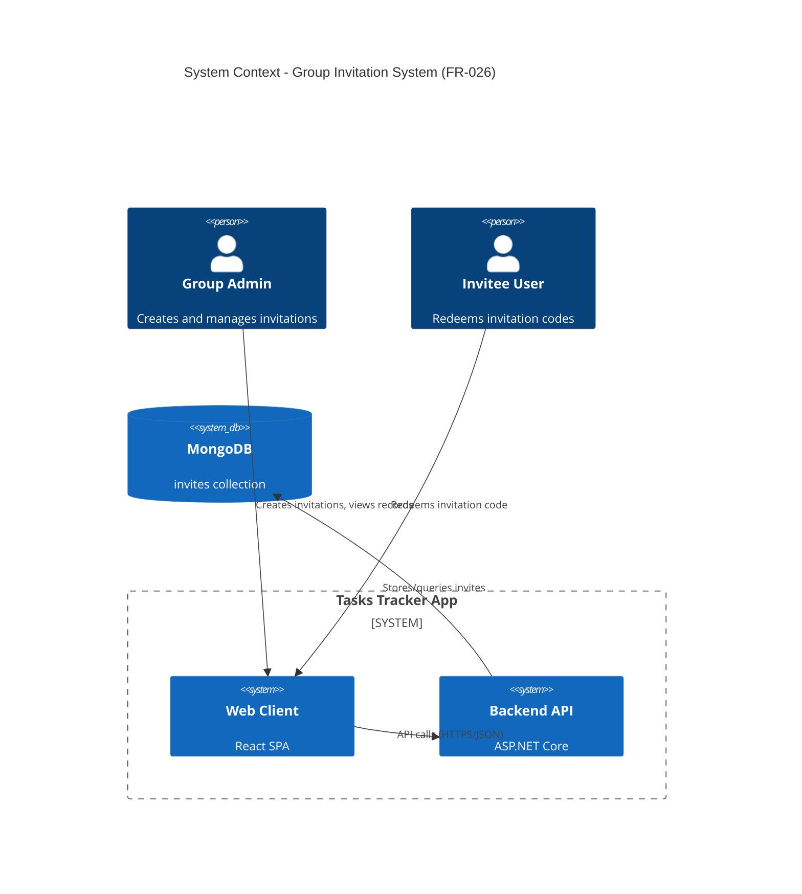
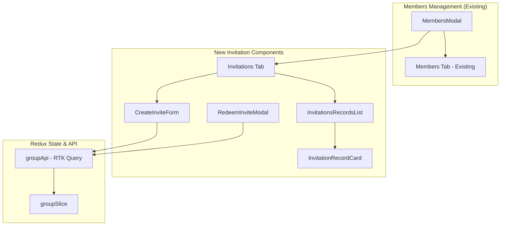
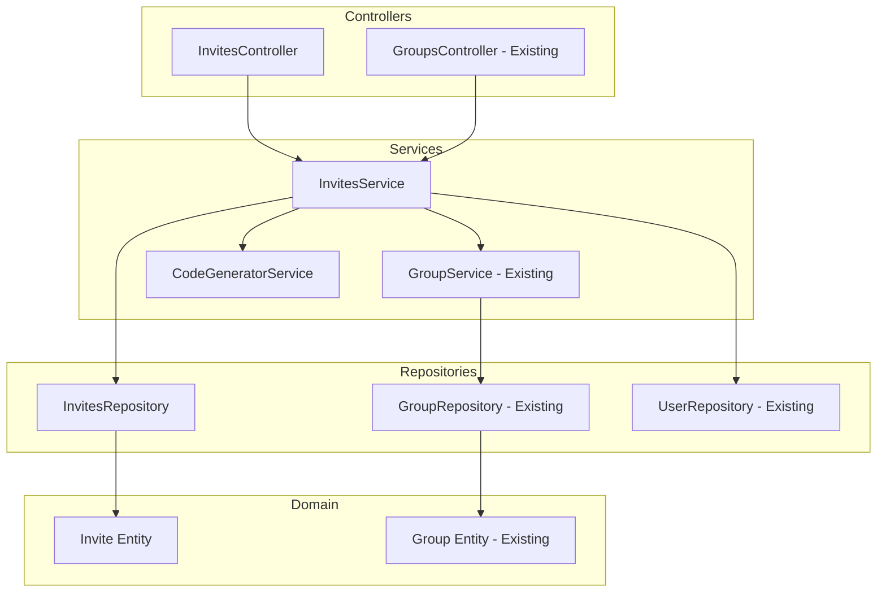
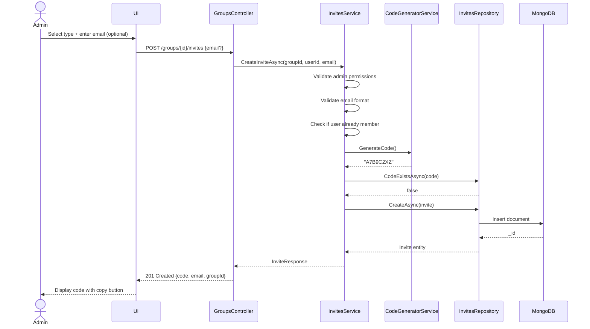
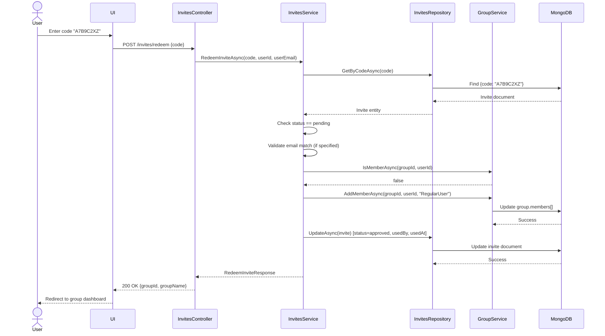
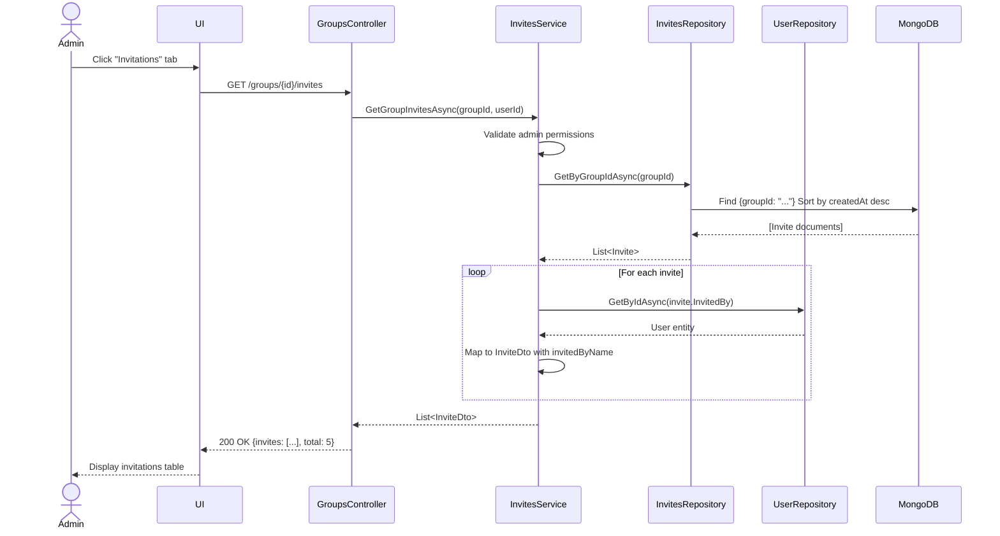

# Technical Design: FR-026 Group Member Invitation System

**Document Version:** 1.0  
**Last Updated:** December 17, 2025  
**Mode:** Feature Enhancement  
**PRD Reference:** [docs/prds/FR-026-group-member-invitation-system.md](../prds/FR-026-group-member-invitation-system.md)  
**Repository:** my-tasks-tracker-app

---

## 1. Executive Summary

**Business Value:**
- Enables controlled group onboarding with flexible invitation mechanisms
- Reduces friction for group admins managing membership
- Provides audit trail and visibility into invitation usage
- Improves security by validating email-specific invitations

**High-Level Approach:**
- New `invites` MongoDB collection separate from existing groups collection
- Client-side: Invitation management UI within existing Members Management modal
- Backend: New InvitesController + InvitesService for invitation CRUD and redemption
- Unique code generation using cryptographically secure random strings
- Single-use validation prevents code reuse after approval

**Key Decisions:**
- **Separate collection** for invites (not embedded in groups) for better scalability and querying
- **Two invitation types**: email-specific (validated) vs. open "any user" (no email validation)
- **Single-use codes**: status transitions from "pending" → "approved", no reuse allowed
- **Admin-only creation**: Only group admins can create/view invitations
- **Case-insensitive email matching** for better UX
- **8-character alphanumeric codes** (e.g., "A7B9C2XZ") for balance of security and usability

---

## 2. Requirements Summary (from PRD)

**Functional Requirements:**
- FR-026.1: Group admin generates email-specific invitation code
- FR-026.2: Group admin generates open "any user" invitation code
- FR-026.3: User redeems invitation code with validation (email match if specified)
- FR-026.4: Group admin views all invitations for their group
- FR-026.5: Authorization: admins create/view, any auth user redeems

**Non-Functional Requirements:**
- Code generation must be cryptographically secure with zero collisions
- Redemption validation completes in <200ms
- Database queries use indexes for performance
- Clear error messages for failed redemptions
- UI distinguishes between specific and "any user" invitations

**Acceptance Criteria:**
- Admin can create both invitation types successfully
- Codes are unique across all groups
- Email-specific codes reject wrong email addresses
- Codes cannot be reused after approval
- Admin UI displays all invitation records with correct metadata
- Redemption flow adds user to group and updates invite status

**Constraints:**
- Must integrate with existing group membership system
- No invitation expiration in v1 (future enhancement)
- No email notifications on invite creation (future enhancement)
- No bulk invitation generation

**Assumptions:**
- **Assume:** User email is available from JWT claims during redemption
- **Assume:** Existing GroupService has `AddMemberAsync` method
- **Assume:** Members Management UI already exists and can be extended
- **Inferred:** Use existing authorization attributes (`[RequireGroupAdmin]`)
- **Inferred:** Follow existing repository pattern for InvitesRepository

---

## 3. Current Architecture (Relevant Components)

| Component | Responsibility | Location |
|-----------|---------------|----------|
| `GroupsController` | Group CRUD, member management endpoints | `backend/Features/Groups/Controllers/` |
| `GroupService` | Group business logic, add/remove members | `backend/Features/Groups/Services/` |
| `GroupRepository` | MongoDB groups collection access | `backend/Infrastructure/Repositories/` |
| `Group` (Domain) | Group entity with members list | `backend/Core/Domain/Group.cs` |
| `groupApi` (RTK Query) | Frontend API slice for groups | `web/src/features/groups/groupApi.ts` |
| `MembersModal` | Existing members management UI | `web/src/features/groups/components/` |
| `[RequireGroupAdmin]` | Authorization attribute for admin-only actions | `backend/Core/Attributes/` |

**Integration Points:**
- InvitesService will call `GroupService.AddMemberAsync()` during redemption
- GroupRepository provides group membership validation
- Existing Members Management UI will add Invitations tab/section
- groupApi will add new RTK Query endpoints for invites

**Gaps/Constraints:**
- No existing invites infrastructure → full implementation required
- Need new MongoDB collection with indexes
- Need code generation utility (not currently available)
- Members Management UI needs extension for invitations tab

---

## 4. Proposed Architecture

### 4.1 System Context (C4)



---

## 5. Client-Side Design (Frontend)

### 5.1 Component Architecture



### 5.2 New Frontend Components

| Component | Type | Responsibility | Props |
|-----------|------|---------------|-------|
| **InvitationsTab** | Tab Panel | Container for invitation management | `groupId: string` |
| **CreateInviteForm** | Form | Radio buttons (specific/any) + email input + submit | `groupId: string`, `onSuccess: (code) => void` |
| **InvitationsRecordsList** | List | Display all invitations for group | `groupId: string` |
| **InvitationRecordCard** | Card | Single invitation record display | `invite: Invite` |
| **RedeemInviteModal** | Modal | Code input + redeem button (global access) | `isOpen: boolean`, `onClose: () => void` |

### 5.3 Frontend Data Flow

**Create Invitation:**
1. Admin clicks "Invitations" tab in Members Management modal
2. Admin selects invitation type (radio buttons: "Specific Email" / "Any User")
3. If specific: email input field appears (with validation)
4. Admin clicks "Generate Code"
5. Call `useCreateInviteMutation({ groupId, email?: string })`
6. On success: Display code in modal with copy button, show success toast
7. Refresh invitations list

**View Invitations:**
1. Invitations tab automatically calls `useGetGroupInvitesQuery(groupId)`
2. Display table/list with columns: Code, Target, Invited By, Status, Created
3. "Target" shows email or badge "Any User"
4. Status shows badge: "Pending" (yellow) / "Approved" (green)

**Redeem Invitation:**
1. User clicks "Join Group" button (in nav or dedicated page)
2. Modal opens with code input field
3. User enters code, clicks "Redeem"
4. Call `useRedeemInviteMutation({ code })`
5. On success: Redirect to group dashboard, show success message
6. On error: Display error message (invalid code, wrong email, already used)

### 5.4 RTK Query Endpoints (groupApi Extension)

```typescript
// web/src/features/groups/groupApi.ts

createInvite: builder.mutation<InviteResponse, CreateInviteRequest>({
  query: ({ groupId, email }) => ({
    url: `/groups/${groupId}/invites`,
    method: 'POST',
    body: { email },
  }),
  invalidatesTags: (_result, _error, { groupId }) => [
    { type: 'Invite', id: groupId },
  ],
}),

getGroupInvites: builder.query<InvitesListResponse, string>({
  query: (groupId) => `/groups/${groupId}/invites`,
  providesTags: (result, _error, groupId) =>
    result
      ? [
          ...result.invites.map(({ id }) => ({ type: 'Invite' as const, id })),
          { type: 'Invite', id: groupId },
        ]
      : [{ type: 'Invite', id: groupId }],
}),

redeemInvite: builder.mutation<RedeemInviteResponse, RedeemInviteRequest>({
  query: ({ code }) => ({
    url: '/invites/redeem',
    method: 'POST',
    body: { code },
  }),
  invalidatesTags: (_result, _error) => [
    { type: 'Group', id: 'LIST' },
  ],
}),
```

### 5.5 TypeScript Types

```typescript
// web/src/types/invite.ts

export interface Invite {
  id: string;
  groupId: string;
  code: string;
  email: string | null;
  invitedBy: string;
  invitedByName: string; // Populated from User
  status: 'pending' | 'approved';
  usedBy: string | null;
  createdAt: string;
  usedAt: string | null;
}

export interface CreateInviteRequest {
  groupId: string;
  email?: string;
}

export interface InviteResponse {
  code: string;
  email: string | null;
  groupId: string;
  createdAt: string;
}

export interface InvitesListResponse {
  invites: Invite[];
  total: number;
}

export interface RedeemInviteRequest {
  code: string;
}

export interface RedeemInviteResponse {
  groupId: string;
  groupName: string;
  message: string;
}
```

### 5.6 UI/UX Specifications

**Invitations Tab:**
- Add tab to MembersModal: "Members" | "Invitations" (only for admins)
- Tab badge shows pending invitations count (e.g., "Invitations (3)")

**Create Invite Form:**
- Radio buttons: `○ Specific Email` / `○ Any User`
- Conditional email input (Tailwind: `input` + validation styling)
- Button: "Generate Invitation Code" (primary, full width)
- Success state: Display generated code in copy-to-clipboard input + "Copy Code" button
- Helper text: "Share this code with the person you want to invite"

**Invitations List:**
- Empty state: "No invitations yet. Create your first invitation above."
- Table columns: Code | Target | Invited By | Status | Created | Actions (future: Revoke)
- Target: `user@example.com` or `<Badge>Any User</Badge>`
- Status: `<Badge color="yellow">Pending</Badge>` / `<Badge color="green">Approved</Badge>`
- Mobile responsive: Stack to cards on small screens

**Redeem Modal:**
- Accessible from: Navigation bar "Join Group" link OR dedicated page
- Input: "Enter Invitation Code" (8-char, uppercase, auto-format)
- Button: "Join Group" (primary, disabled if code invalid format)
- Error messages: Display below input with red text

---

## 6. Backend Design (API Layer)

### 6.1 Backend Component Architecture



### 6.2 New Backend Components

| Component | Type | Responsibility | Dependencies |
|-----------|------|---------------|--------------|
| **InvitesController** | Controller | API endpoints for invite CRUD and redemption | InvitesService |
| **InvitesService** | Service | Business logic: create, validate, redeem invites | InvitesRepository, GroupService, UserRepository, CodeGeneratorService |
| **InvitesRepository** | Repository | MongoDB operations on invites collection | MongoDbContext |
| **CodeGeneratorService** | Utility | Generate unique cryptographic codes | - |
| **Invite** | Domain Entity | Invite data model | - |

### 6.3 Domain Model

**Invite Entity:**
```csharp
// backend/src/TasksTracker.Api/Core/Domain/Invite.cs

using MongoDB.Bson;
using MongoDB.Bson.Serialization.Attributes;

namespace TasksTracker.Api.Core.Domain;

public class Invite
{
    [BsonId]
    [BsonRepresentation(BsonType.ObjectId)]
    public string Id { get; set; } = string.Empty;
    
    [BsonElement("groupId")]
    [BsonRepresentation(BsonType.ObjectId)]
    public string GroupId { get; set; } = string.Empty;
    
    [BsonElement("code")]
    public string Code { get; set; } = string.Empty;
    
    [BsonElement("email")]
    public string? Email { get; set; }
    
    [BsonElement("invitedBy")]
    [BsonRepresentation(BsonType.ObjectId)]
    public string InvitedBy { get; set; } = string.Empty;
    
    [BsonElement("status")]
    public InviteStatus Status { get; set; } = InviteStatus.Pending;
    
    [BsonElement("usedBy")]
    [BsonRepresentation(BsonType.ObjectId)]
    public string? UsedBy { get; set; }
    
    [BsonElement("createdAt")]
    public DateTime CreatedAt { get; set; } = DateTime.UtcNow;
    
    [BsonElement("usedAt")]
    public DateTime? UsedAt { get; set; }
}

public enum InviteStatus
{
    Pending,
    Approved
}
```

### 6.4 Repository Interface & Implementation

**IInvitesRepository:**
```csharp
// backend/src/TasksTracker.Api/Core/Interfaces/IInvitesRepository.cs

public interface IInvitesRepository
{
    Task<Invite> CreateAsync(Invite invite, CancellationToken cancellationToken = default);
    Task<Invite?> GetByCodeAsync(string code, CancellationToken cancellationToken = default);
    Task<List<Invite>> GetByGroupIdAsync(string groupId, InviteStatus? status = null, CancellationToken cancellationToken = default);
    Task<Invite> UpdateAsync(Invite invite, CancellationToken cancellationToken = default);
    Task<bool> CodeExistsAsync(string code, CancellationToken cancellationToken = default);
    Task<bool> EnsureIndexesAsync();
}
```

**InvitesRepository Implementation:**
```csharp
// backend/src/TasksTracker.Api/Infrastructure/Repositories/InvitesRepository.cs

public class InvitesRepository : BaseRepository<Invite>, IInvitesRepository
{
    public InvitesRepository(MongoDbContext context) 
        : base(context, "invites") { }
    
    public async Task<Invite?> GetByCodeAsync(string code, CancellationToken cancellationToken = default)
    {
        var filter = Builders<Invite>.Filter.Eq(i => i.Code, code);
        return await _collection.Find(filter).FirstOrDefaultAsync(cancellationToken);
    }
    
    public async Task<List<Invite>> GetByGroupIdAsync(string groupId, InviteStatus? status = null, CancellationToken cancellationToken = default)
    {
        var filterBuilder = Builders<Invite>.Filter;
        var filter = filterBuilder.Eq(i => i.GroupId, groupId);
        
        if (status.HasValue)
        {
            filter &= filterBuilder.Eq(i => i.Status, status.Value);
        }
        
        var sort = Builders<Invite>.Sort.Descending(i => i.CreatedAt);
        return await _collection.Find(filter).Sort(sort).ToListAsync(cancellationToken);
    }
    
    public async Task<Invite> UpdateAsync(Invite invite, CancellationToken cancellationToken = default)
    {
        var filter = Builders<Invite>.Filter.Eq(i => i.Id, invite.Id);
        await _collection.ReplaceOneAsync(filter, invite, cancellationToken: cancellationToken);
        return invite;
    }
    
    public async Task<bool> CodeExistsAsync(string code, CancellationToken cancellationToken = default)
    {
        var filter = Builders<Invite>.Filter.Eq(i => i.Code, code);
        return await _collection.Find(filter).AnyAsync(cancellationToken);
    }
    
    public async Task<bool> EnsureIndexesAsync()
    {
        var codeIndex = new CreateIndexModel<Invite>(
            Builders<Invite>.IndexKeys.Ascending(i => i.Code),
            new CreateIndexOptions { Unique = true });
        
        var groupIdStatusIndex = new CreateIndexModel<Invite>(
            Builders<Invite>.IndexKeys
                .Ascending(i => i.GroupId)
                .Ascending(i => i.Status));
        
        await _collection.Indexes.CreateManyAsync(new[] { codeIndex, groupIdStatusIndex });
        return true;
    }
}
```

### 6.5 Service Layer

**IInvitesService Interface:**
```csharp
// backend/src/TasksTracker.Api/Features/Groups/Services/IInvitesService.cs

public interface IInvitesService
{
    Task<InviteResponse> CreateInviteAsync(string groupId, string adminUserId, string? email, CancellationToken cancellationToken = default);
    Task<List<InviteDto>> GetGroupInvitesAsync(string groupId, string userId, CancellationToken cancellationToken = default);
    Task<RedeemInviteResponse> RedeemInviteAsync(string code, string userId, string userEmail, CancellationToken cancellationToken = default);
}
```

**InvitesService Implementation:**
```csharp
// backend/src/TasksTracker.Api/Features/Groups/Services/InvitesService.cs

public class InvitesService : IInvitesService
{
    private readonly IInvitesRepository _invitesRepository;
    private readonly IGroupService _groupService;
    private readonly IUserRepository _userRepository;
    private readonly CodeGeneratorService _codeGenerator;
    private readonly ILogger<InvitesService> _logger;
    
    public InvitesService(
        IInvitesRepository invitesRepository,
        IGroupService groupService,
        IUserRepository userRepository,
        CodeGeneratorService codeGenerator,
        ILogger<InvitesService> logger)
    {
        _invitesRepository = invitesRepository;
        _groupService = groupService;
        _userRepository = userRepository;
        _codeGenerator = codeGenerator;
        _logger = logger;
    }
    
    public async Task<InviteResponse> CreateInviteAsync(
        string groupId, 
        string adminUserId, 
        string? email, 
        CancellationToken cancellationToken = default)
    {
        // Validate admin permissions
        var isAdmin = await _groupService.IsGroupAdminAsync(groupId, adminUserId, cancellationToken);
        if (!isAdmin)
        {
            throw new UnauthorizedAccessException("Only group admins can create invitations");
        }
        
        // Validate email format if provided
        if (!string.IsNullOrEmpty(email) && !IsValidEmail(email))
        {
            throw new ArgumentException("Invalid email format", nameof(email));
        }
        
        // Check if user already a member (if email specified)
        if (!string.IsNullOrEmpty(email))
        {
            var user = await _userRepository.GetByEmailAsync(email, cancellationToken);
            if (user != null)
            {
                var isMember = await _groupService.IsMemberAsync(groupId, user.Id, cancellationToken);
                if (isMember)
                {
                    throw new InvalidOperationException("User is already a member of this group");
                }
            }
        }
        
        // Generate unique code
        var code = await GenerateUniqueCodeAsync(cancellationToken);
        
        // Create invite
        var invite = new Invite
        {
            GroupId = groupId,
            Code = code,
            Email = string.IsNullOrEmpty(email) ? null : email.ToLowerInvariant(),
            InvitedBy = adminUserId,
            Status = InviteStatus.Pending,
            CreatedAt = DateTime.UtcNow
        };
        
        await _invitesRepository.CreateAsync(invite, cancellationToken);
        
        _logger.LogInformation(
            "Invitation created: Code={Code}, GroupId={GroupId}, Email={Email}, InvitedBy={UserId}",
            code, groupId, email ?? "any", adminUserId);
        
        return new InviteResponse
        {
            Code = code,
            Email = email,
            GroupId = groupId,
            CreatedAt = invite.CreatedAt
        };
    }
    
    public async Task<RedeemInviteResponse> RedeemInviteAsync(
        string code, 
        string userId, 
        string userEmail, 
        CancellationToken cancellationToken = default)
    {
        // Find invite by code
        var invite = await _invitesRepository.GetByCodeAsync(code, cancellationToken);
        if (invite == null)
        {
            throw new KeyNotFoundException("Invalid invitation code");
        }
        
        // Check if already used
        if (invite.Status == InviteStatus.Approved)
        {
            throw new InvalidOperationException("This invitation has already been used");
        }
        
        // Validate email if invite is email-specific
        if (!string.IsNullOrEmpty(invite.Email))
        {
            if (!userEmail.Equals(invite.Email, StringComparison.OrdinalIgnoreCase))
            {
                throw new UnauthorizedAccessException(
                    "This invitation is for a different email address");
            }
        }
        
        // Check if user already a member
        var isMember = await _groupService.IsMemberAsync(invite.GroupId, userId, cancellationToken);
        if (isMember)
        {
            throw new InvalidOperationException("You are already a member of this group");
        }
        
        // Add user to group
        await _groupService.AddMemberAsync(invite.GroupId, userId, "RegularUser", cancellationToken);
        
        // Update invite status
        invite.Status = InviteStatus.Approved;
        invite.UsedBy = userId;
        invite.UsedAt = DateTime.UtcNow;
        await _invitesRepository.UpdateAsync(invite, cancellationToken);
        
        // Get group details
        var group = await _groupService.GetGroupAsync(invite.GroupId, userId, cancellationToken);
        
        _logger.LogInformation(
            "Invitation redeemed: Code={Code}, UserId={UserId}, GroupId={GroupId}",
            code, userId, invite.GroupId);
        
        return new RedeemInviteResponse
        {
            GroupId = group.Id,
            GroupName = group.Name,
            Message = $"Successfully joined {group.Name}"
        };
    }
    
    public async Task<List<InviteDto>> GetGroupInvitesAsync(
        string groupId, 
        string userId, 
        CancellationToken cancellationToken = default)
    {
        // Validate admin permissions
        var isAdmin = await _groupService.IsGroupAdminAsync(groupId, userId, cancellationToken);
        if (!isAdmin)
        {
            throw new UnauthorizedAccessException("Only group admins can view invitations");
        }
        
        var invites = await _invitesRepository.GetByGroupIdAsync(groupId, null, cancellationToken);
        
        // Populate invitedBy user names
        var inviteDtos = new List<InviteDto>();
        foreach (var invite in invites)
        {
            var inviter = await _userRepository.GetByIdAsync(invite.InvitedBy, cancellationToken);
            inviteDtos.Add(new InviteDto
            {
                Id = invite.Id,
                GroupId = invite.GroupId,
                Code = invite.Code,
                Email = invite.Email,
                InvitedBy = invite.InvitedBy,
                InvitedByName = inviter?.FullName ?? "Unknown",
                Status = invite.Status.ToString().ToLower(),
                UsedBy = invite.UsedBy,
                CreatedAt = invite.CreatedAt,
                UsedAt = invite.UsedAt
            });
        }
        
        return inviteDtos;
    }
    
    private async Task<string> GenerateUniqueCodeAsync(CancellationToken cancellationToken)
    {
        var maxAttempts = 10;
        for (var i = 0; i < maxAttempts; i++)
        {
            var code = _codeGenerator.GenerateCode();
            var exists = await _invitesRepository.CodeExistsAsync(code, cancellationToken);
            if (!exists)
            {
                return code;
            }
        }
        throw new InvalidOperationException("Failed to generate unique invitation code");
    }
    
    private static bool IsValidEmail(string email)
    {
        return System.Text.RegularExpressions.Regex.IsMatch(
            email,
            @"^[^@\s]+@[^@\s]+\.[^@\s]+$",
            System.Text.RegularExpressions.RegexOptions.IgnoreCase);
    }
}
```

### 6.6 Code Generator Service

```csharp
// backend/src/TasksTracker.Api/Core/Services/CodeGeneratorService.cs

using System.Security.Cryptography;

namespace TasksTracker.Api.Core.Services;

public class CodeGeneratorService
{
    private const string Chars = "ABCDEFGHIJKLMNOPQRSTUVWXYZ0123456789";
    private const int CodeLength = 8;
    
    public string GenerateCode()
    {
        var code = new char[CodeLength];
        var randomBytes = new byte[CodeLength];
        
        using (var rng = RandomNumberGenerator.Create())
        {
            rng.GetBytes(randomBytes);
        }
        
        for (var i = 0; i < CodeLength; i++)
        {
            code[i] = Chars[randomBytes[i] % Chars.Length];
        }
        
        return new string(code);
    }
}
```

### 6.7 Controller Endpoints

**InvitesController:**
```csharp
// backend/src/TasksTracker.Api/Features/Groups/Controllers/InvitesController.cs

[ApiController]
[Route("api/invites")]
[Authorize]
public class InvitesController : ControllerBase
{
    private readonly IInvitesService _invitesService;
    private readonly ILogger<InvitesController> _logger;
    
    private string UserId => User.FindFirst(ClaimTypes.NameIdentifier)?.Value 
        ?? throw new UnauthorizedAccessException("User ID not found in token");
    
    private string UserEmail => User.FindFirst(ClaimTypes.Email)?.Value 
        ?? throw new UnauthorizedAccessException("Email not found in token");
    
    public InvitesController(IInvitesService invitesService, ILogger<InvitesController> logger)
    {
        _invitesService = invitesService;
        _logger = logger;
    }
    
    /// <summary>
    /// Redeem an invitation code to join a group
    /// </summary>
    [HttpPost("redeem")]
    [ProducesResponseType(typeof(ApiResponse<RedeemInviteResponse>), StatusCodes.Status200OK)]
    [ProducesResponseType(typeof(ApiResponse<object>), StatusCodes.Status400BadRequest)]
    [ProducesResponseType(typeof(ApiResponse<object>), StatusCodes.Status403Forbidden)]
    [ProducesResponseType(typeof(ApiResponse<object>), StatusCodes.Status404NotFound)]
    public async Task<IActionResult> RedeemInvite([FromBody] RedeemInviteRequest request)
    {
        if (string.IsNullOrWhiteSpace(request.Code))
        {
            return BadRequest(ApiResponse<object>.ErrorResponse(
                "VALIDATION_ERROR", "Invitation code is required"));
        }
        
        try
        {
            var response = await _invitesService.RedeemInviteAsync(
                request.Code.ToUpperInvariant(), UserId, UserEmail);
            
            return Ok(ApiResponse<RedeemInviteResponse>.SuccessResponse(response));
        }
        catch (KeyNotFoundException)
        {
            return NotFound(ApiResponse<object>.ErrorResponse(
                "NOT_FOUND", "Invalid invitation code"));
        }
        catch (UnauthorizedAccessException ex)
        {
            return StatusCode(403, ApiResponse<object>.ErrorResponse(
                "FORBIDDEN", ex.Message));
        }
        catch (InvalidOperationException ex)
        {
            return BadRequest(ApiResponse<object>.ErrorResponse(
                "INVALID_OPERATION", ex.Message));
        }
        catch (Exception ex)
        {
            _logger.LogError(ex, "Error redeeming invitation");
            return StatusCode(500, ApiResponse<object>.ErrorResponse(
                "SERVER_ERROR", "An error occurred while redeeming the invitation"));
        }
    }
}
```

**Extension to GroupsController:**
```csharp
// backend/src/TasksTracker.Api/Features/Groups/Controllers/GroupsController.cs
// Add these endpoints to existing GroupsController

/// <summary>
/// Create invitation for a group (admin only)
/// </summary>
[HttpPost("{groupId}/invites")]
[ProducesResponseType(typeof(ApiResponse<InviteResponse>), StatusCodes.Status201Created)]
[ProducesResponseType(typeof(ApiResponse<object>), StatusCodes.Status400BadRequest)]
[ProducesResponseType(typeof(ApiResponse<object>), StatusCodes.Status403Forbidden)]
public async Task<IActionResult> CreateInvite(
    string groupId, 
    [FromBody] CreateInviteRequest request)
{
    try
    {
        var response = await _invitesService.CreateInviteAsync(
            groupId, UserId, request.Email);
        
        _logger.LogInformation(
            "Invitation created for group {GroupId} by user {UserId}", 
            groupId, UserId);
        
        return CreatedAtAction(
            nameof(GetGroupInvites),
            new { groupId },
            ApiResponse<InviteResponse>.SuccessResponse(response));
    }
    catch (UnauthorizedAccessException ex)
    {
        return StatusCode(403, ApiResponse<object>.ErrorResponse(
            "FORBIDDEN", ex.Message));
    }
    catch (ArgumentException ex)
    {
        return BadRequest(ApiResponse<object>.ErrorResponse(
            "VALIDATION_ERROR", ex.Message));
    }
    catch (InvalidOperationException ex)
    {
        return BadRequest(ApiResponse<object>.ErrorResponse(
            "INVALID_OPERATION", ex.Message));
    }
    catch (Exception ex)
    {
        _logger.LogError(ex, "Error creating invitation");
        return StatusCode(500, ApiResponse<object>.ErrorResponse(
            "SERVER_ERROR", "An error occurred while creating the invitation"));
    }
}

/// <summary>
/// Get all invitations for a group (admin only)
/// </summary>
[HttpGet("{groupId}/invites")]
[ProducesResponseType(typeof(ApiResponse<InvitesListResponse>), StatusCodes.Status200OK)]
[ProducesResponseType(typeof(ApiResponse<object>), StatusCodes.Status403Forbidden)]
public async Task<IActionResult> GetGroupInvites(string groupId)
{
    try
    {
        var invites = await _invitesService.GetGroupInvitesAsync(groupId, UserId);
        
        return Ok(ApiResponse<InvitesListResponse>.SuccessResponse(
            new InvitesListResponse 
            { 
                Invites = invites,
                Total = invites.Count
            }));
    }
    catch (UnauthorizedAccessException ex)
    {
        return StatusCode(403, ApiResponse<object>.ErrorResponse(
            "FORBIDDEN", ex.Message));
    }
    catch (Exception ex)
    {
        _logger.LogError(ex, "Error fetching invitations");
        return StatusCode(500, ApiResponse<object>.ErrorResponse(
            "SERVER_ERROR", "An error occurred while fetching invitations"));
    }
}
```

### 6.8 DTOs (Request/Response Models)

```csharp
// backend/src/TasksTracker.Api/Features/Groups/Models/InviteDtos.cs

public record CreateInviteRequest
{
    public string? Email { get; init; }
}

public record InviteResponse
{
    public required string Code { get; init; }
    public string? Email { get; init; }
    public required string GroupId { get; init; }
    public DateTime CreatedAt { get; init; }
}

public record RedeemInviteRequest
{
    public required string Code { get; init; }
}

public record RedeemInviteResponse
{
    public required string GroupId { get; init; }
    public required string GroupName { get; init; }
    public required string Message { get; init; }
}

public record InviteDto
{
    public required string Id { get; init; }
    public required string GroupId { get; init; }
    public required string Code { get; init; }
    public string? Email { get; init; }
    public required string InvitedBy { get; init; }
    public required string InvitedByName { get; init; }
    public required string Status { get; init; }
    public string? UsedBy { get; init; }
    public DateTime CreatedAt { get; init; }
    public DateTime? UsedAt { get; init; }
}

public record InvitesListResponse
{
    public required List<InviteDto> Invites { get; init; }
    public int Total { get; init; }
}
```

---

## 7. Data Design

### 7.1 MongoDB Schema

**invites Collection:**
```json
{
  "_id": ObjectId("..."),
  "groupId": ObjectId("..."),
  "code": "A7B9C2XZ",
  "email": "user@example.com" | null,
  "invitedBy": ObjectId("..."),
  "status": "pending" | "approved",
  "usedBy": ObjectId("...") | null,
  "createdAt": ISODate("2025-12-17T10:30:00Z"),
  "usedAt": ISODate("2025-12-17T11:00:00Z") | null
}
```

### 7.2 Indexes

```javascript
// Unique index on code
db.invites.createIndex({ "code": 1 }, { unique: true })

// Compound index for querying by group + status
db.invites.createIndex({ "groupId": 1, "status": 1 })

// Index for group listing (covered query)
db.invites.createIndex({ "groupId": 1, "createdAt": -1 })
```

### 7.3 Query Patterns

| Query | Index Used | Performance Target |
|-------|-----------|-------------------|
| Find by code | `code` (unique) | <10ms (primary key lookup) |
| List group invites | `groupId + createdAt` | <50ms (indexed range scan) |
| Filter by status | `groupId + status` | <30ms (compound index) |
| Check code exists | `code` (unique) | <10ms (indexed lookup) |

---

## 8. Security & Authorization

### 8.1 Authorization Matrix

| Endpoint | User Type | Authorization Check |
|----------|-----------|-------------------|
| POST `/groups/{id}/invites` | Group Admin | `IsGroupAdminAsync(groupId, userId)` |
| GET `/groups/{id}/invites` | Group Admin | `IsGroupAdminAsync(groupId, userId)` |
| POST `/invites/redeem` | Any Authenticated User | JWT validation only |

### 8.2 Validation Rules

**Create Invitation:**
- GroupId must exist
- User must be admin of group
- Email format validation (if provided): `^[^@\s]+@[^@\s]+\.[^@\s]+$`
- Email must not already be a member (if provided)

**Redeem Invitation:**
- Code must exist and be uppercase
- Status must be "pending" (not already used)
- If email specified: user's email must match (case-insensitive)
- User must not already be a member of the group

### 8.3 Error Handling

| Error Scenario | HTTP Status | Error Code | Message |
|---------------|-------------|------------|---------|
| Code not found | 404 | NOT_FOUND | Invalid invitation code |
| Already used | 400 | INVALID_OPERATION | This invitation has already been used |
| Email mismatch | 403 | FORBIDDEN | This invitation is for a different email address |
| Already a member | 400 | INVALID_OPERATION | You are already a member of this group |
| Not admin | 403 | FORBIDDEN | Only group admins can create invitations |
| Invalid email format | 400 | VALIDATION_ERROR | Invalid email format |
| Code generation failure | 500 | SERVER_ERROR | Failed to generate unique invitation code |

---

## 9. Sequence Diagrams

### 9.1 Create Invitation Flow



### 9.2 Redeem Invitation Flow



### 9.3 View Invitations Flow



---

## 10. Testing Strategy

### 10.1 Unit Tests

**InvitesService Tests:**
- ✅ CreateInvite_WithValidEmail_Success
- ✅ CreateInvite_WithoutEmail_Success (any user)
- ✅ CreateInvite_NonAdmin_ThrowsUnauthorized
- ✅ CreateInvite_InvalidEmail_ThrowsArgumentException
- ✅ CreateInvite_UserAlreadyMember_ThrowsInvalidOperation
- ✅ RedeemInvite_ValidCode_Success
- ✅ RedeemInvite_InvalidCode_ThrowsKeyNotFound
- ✅ RedeemInvite_AlreadyUsed_ThrowsInvalidOperation
- ✅ RedeemInvite_EmailMismatch_ThrowsUnauthorized
- ✅ RedeemInvite_AlreadyMember_ThrowsInvalidOperation
- ✅ GetGroupInvites_AsAdmin_Success
- ✅ GetGroupInvites_NonAdmin_ThrowsUnauthorized

**CodeGeneratorService Tests:**
- ✅ GenerateCode_ReturnsEightCharacters
- ✅ GenerateCode_ReturnsUppercaseAlphanumeric
- ✅ GenerateCode_GeneratesUniqueCodes (1000 iterations, no duplicates)

**InvitesRepository Tests:**
- ✅ CreateAsync_Success
- ✅ GetByCodeAsync_ExistingCode_ReturnsInvite
- ✅ GetByCodeAsync_NonExistingCode_ReturnsNull
- ✅ GetByGroupIdAsync_WithStatusFilter_ReturnsFiltered
- ✅ UpdateAsync_Success
- ✅ CodeExistsAsync_True/False

### 10.2 Integration Tests

**InvitesController Tests:**
- ✅ CreateInvite_AsAdmin_Returns201
- ✅ CreateInvite_NonAdmin_Returns403
- ✅ RedeemInvite_ValidCode_Returns200_AddsToGroup
- ✅ RedeemInvite_InvalidCode_Returns404
- ✅ RedeemInvite_EmailMismatch_Returns403
- ✅ GetGroupInvites_AsAdmin_Returns200
- ✅ GetGroupInvites_NonAdmin_Returns403

### 10.3 E2E Tests (Frontend)

**Invitation Creation:**
- ✅ Admin can create specific email invitation
- ✅ Admin can create "any user" invitation
- ✅ Generated code is displayed with copy button
- ✅ Invitation appears in list after creation

**Invitation Redemption:**
- ✅ User can redeem valid code
- ✅ User redirected to group dashboard after success
- ✅ Error message shown for invalid code
- ✅ Error message shown for wrong email

**Invitation Management:**
- ✅ Admin sees all invitations in list
- ✅ Pending invitations show yellow badge
- ✅ Approved invitations show green badge
- ✅ "Any User" invitations show correct label

---

## 11. Deployment Considerations

### 11.1 Database Migration

**MongoDB Index Creation:**
```bash
# Run after deployment
db.invites.createIndex({ "code": 1 }, { unique: true })
db.invites.createIndex({ "groupId": 1, "status": 1 })
db.invites.createIndex({ "groupId": 1, "createdAt": -1 })
```

### 11.2 Dependency Injection Registration

```csharp
// Program.cs
builder.Services.AddScoped<IInvitesRepository, InvitesRepository>();
builder.Services.AddScoped<IInvitesService, InvitesService>();
builder.Services.AddSingleton<CodeGeneratorService>();
```

### 11.3 Configuration

No new configuration required. Uses existing:
- MongoDB connection string
- JWT authentication settings

### 11.4 Rollback Plan

If issues arise:
1. Remove InvitesController routes (API returns 404)
2. Hide Invitations tab in UI
3. Drop `invites` collection if needed: `db.invites.drop()`
4. No impact on existing group functionality

---

## 12. Open Questions & Decisions

### 12.1 Resolved Decisions

| Question | Decision | Rationale |
|----------|----------|-----------|
| Code format | 8-char uppercase alphanumeric | Balance of security and UX |
| Email matching | Case-insensitive | Better UX, standard email handling |
| Collection design | Separate `invites` collection | Scalability, indexing, queries |
| Code reuse | Single-use (no reuse after approval) | Security, audit trail clarity |
| Authorization | Admin creates/views, any user redeems | Follows least privilege principle |

### 12.2 Open Questions

1. **Invitation Expiration:** Should codes expire after X days? (Future: add `expiresAt` field)
2. **Revocation:** Should admins be able to revoke pending invitations? (Future: DELETE endpoint)
3. **Rate Limiting:** Should we limit redemption attempts per user? (Consider if abuse detected)
4. **Email Privacy:** Mask emails in admin view? (e.g., "u***@example.com")
5. **Notification:** Send email when invitation is created or redeemed? (Future: integrate EmailServerAccess)

---

## 13. Success Criteria & Acceptance

**Functional:**
- ✅ Admin can create email-specific invitations
- ✅ Admin can create "any user" invitations
- ✅ Codes are unique and 8 characters
- ✅ User can redeem valid codes
- ✅ Email-specific codes validate email match
- ✅ Codes cannot be reused after approval
- ✅ Admin can view all invitations with metadata
- ✅ Proper error messages for all failure scenarios

**Non-Functional:**
- ✅ Code generation <10ms with zero collisions
- ✅ Redemption validation <200ms
- ✅ All queries use indexes
- ✅ 70%+ code coverage
- ✅ API documented with Swagger/OpenAPI

**User Experience:**
- ✅ Clear UI distinction between invitation types
- ✅ Copy-to-clipboard for generated codes
- ✅ Intuitive error messages
- ✅ Minimal clicks to create/redeem (2-3 clicks)

---

**Document Version:** 1.0  
**Status:** Ready for Implementation  
**Next Steps:**
1. Backend implementation (InvitesService, Repository, Controller)
2. Frontend implementation (UI components, RTK Query endpoints)
3. Unit/integration tests
4. E2E tests
5. Documentation update (API docs, user guide)
