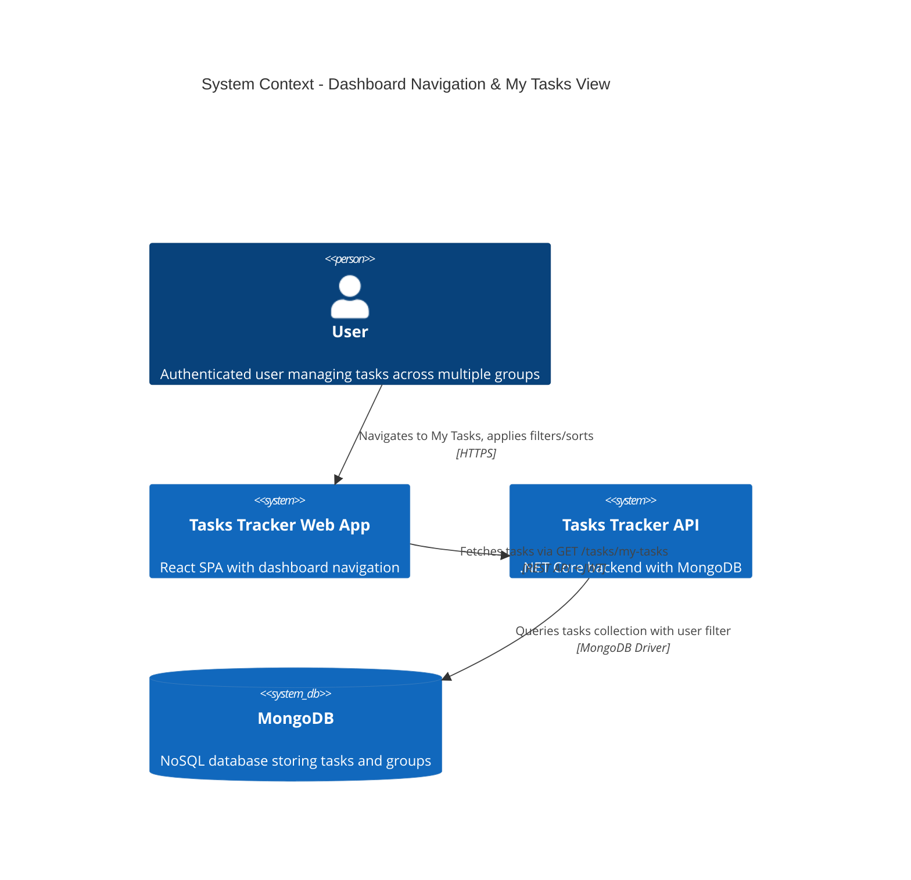
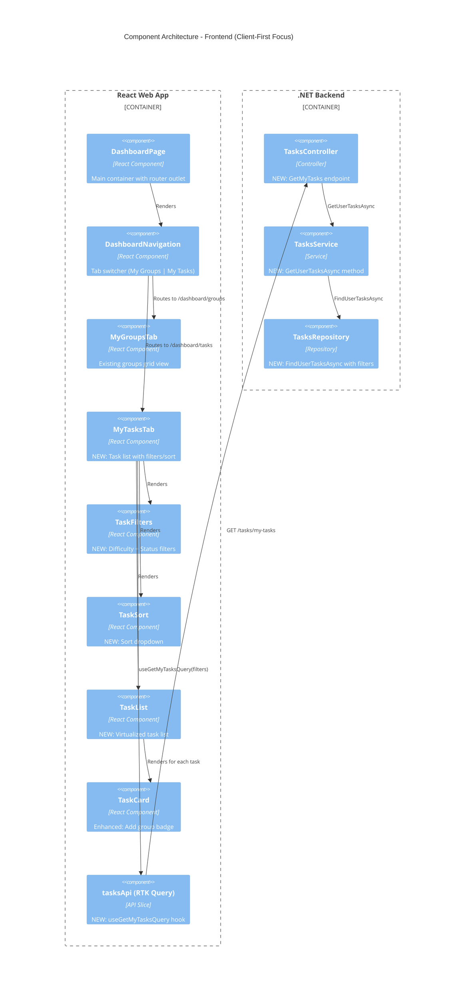
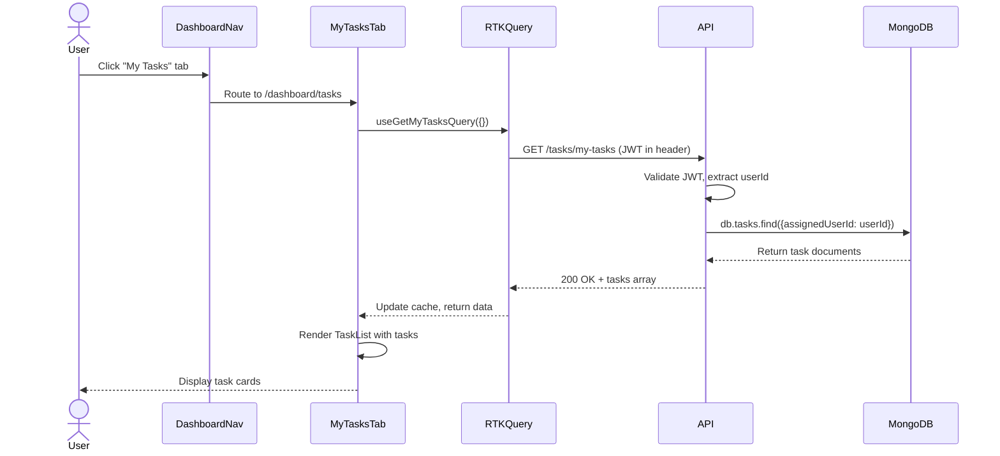
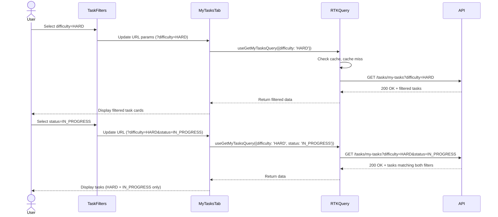
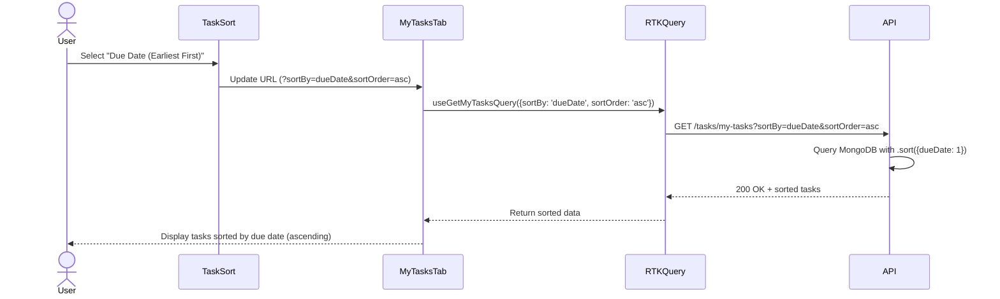

# Technical Design: Dashboard Navigation & My Tasks View

**Document Version:** 1.0  
**Last Updated:** December 19, 2025  
**Mode:** Feature Enhancement  
**PRD Reference:** [FR-027 PRD](./prd.md)  
**Repository:** my-tasks-tracker-app

## 1. Executive Summary

**Business Value:**
- Enables users to view all assigned tasks across groups in a unified view, reducing context switching by ~60%
- Improves task prioritization through cross-group filtering and sorting capabilities
- Maintains existing My Groups functionality while adding complementary task-centric view
- Supports bilingual users (English/Hebrew) with proper RTL layout

**High-Level Approach:**
- **Client-First Strategy:** Implement tab navigation and My Tasks UI using existing React patterns (Headless UI, RTK Query)
- Reuse existing TaskCard component with minor enhancements for group context display
- Add dedicated /tasks/my-tasks backend endpoint with filtering, sorting, pagination
- Leverage existing authentication, authorization, and MongoDB infrastructure
- Phased rollout with feature flag for gradual adoption

**Key Technical Decisions:**
- **Tab Navigation:** Client-side routing using React Router with /dashboard/groups and /dashboard/tasks routes
- **State Management:** RTK Query for server state, URL search params for filter/sort state (enables deep linking)
- **API Design:** Dedicated GET /tasks/my-tasks endpoint (cleaner than extending /tasks with complex query logic)
- **Performance:** Implement pagination (50 tasks/page) + virtualized lists (react-window) for 100+ tasks
- **Filter Logic:** AND combination (e.g., difficulty=HARD + status=IN_PROGRESS returns tasks matching both)
- **Mobile UX:** Collapsible filter panel with dedicated button to preserve screen space

## 2. Requirements Summary (from PRD)

**Functional Requirements (Key):**
- FR-027-001 to 003: Tabbed navigation bar with My Groups/My Tasks routes, default to My Groups
- FR-027-005 to 006: Fetch and display all user's assigned tasks from all groups with metadata
- FR-027-007 to 008: Filter by difficulty (EASY/MEDIUM/HARD) and status (PENDING/IN_PROGRESS/COMPLETED)
- FR-027-009: Sort by difficulty, status, or due date (ascending/descending)
- FR-027-010: Combine multiple filters with AND logic
- FR-027-011: Click task card → navigate to task details page
- FR-027-012: Empty states for no tasks and no matching filters
- FR-027-013: Full bilingual support (English/Hebrew, RTL layouts)

**Non-Functional Requirements:**
- **Performance:** <2s page load, <500ms filter response, <300ms API response
- **Scalability:** Handle 500+ tasks with virtualization, support 10,000+ concurrent users
- **Accessibility:** WCAG 2.1 AA (keyboard navigation, ARIA labels, screen reader support)
- **Security:** User-scoped queries, rate limiting (100 req/min), JWT authentication
- **Mobile-First:** Responsive design for 320px+ viewports

**Acceptance Criteria:**
- User can switch between My Groups and My Tasks tabs without page reload
- My Tasks view displays all assigned tasks with group name, title, difficulty, status, due date
- Filters and sorts update results in <500ms with visual loading indicator
- Combining filters shows tasks matching ALL selected criteria
- Empty state messages guide users appropriately
- Translations display correctly in English and Hebrew with proper RTL layout

**Constraints:**
- Must preserve existing My Groups functionality without breaking changes
- Must use existing authentication/authorization mechanisms
- Must follow existing MongoDB schema (Tasks collection)
- Must maintain existing API versioning and error handling patterns
- Mobile design must work on smallest supported viewport (320px)

**Assumptions:**
- **Assume:** Users belong to 1-10 groups with 10-100 tasks each (avg 50 tasks total per user)
- **Assume:** 60% of users will adopt My Tasks view within first 2 weeks
- **Assume:** Filters will be used in 40% of sessions, sorting in 30%
- **Assume:** MongoDB instance can handle increased query load (current capacity: 1000 req/s)
- **Inferred:** Users want to see all tasks including COMPLETED (can be filtered out)
- **Inferred:** Due date sort should prioritize earliest dates first (urgency-focused)

## 3. Current Architecture (Relevant Components)

**Existing Frontend Components:**

| Component | Responsibility | Location |
|-----------|---------------|----------|
| `DashboardPage` | Container for dashboard views | `web/src/pages/DashboardPage.tsx` |
| `GroupCard` | Display group summary with task count | `web/src/features/dashboard/components/GroupCard.tsx` |
| `TaskCard` | Display individual task details | `web/src/components/TaskCard.tsx` |
| `Modal` | Reusable modal wrapper (Headless UI) | `web/src/components/Modal.tsx` |
| `tasksApi` (RTK Query) | API slice for task operations | `web/src/services/tasksApi.ts` |
| `groupsApi` (RTK Query) | API slice for group operations | `web/src/services/groupsApi.ts` |
| `i18n` | Translation management (i18next) | `web/src/i18n/` |

**Existing Backend Components:**

| Component | Responsibility | Location |
|-----------|---------------|----------|
| `TasksController` | HTTP endpoints for task operations | `backend/src/TasksTracker.Api/Features/Tasks/TasksController.cs` |
| `TasksService` | Task business logic | `backend/src/TasksTracker.Api/Features/Tasks/TasksService.cs` |
| `TasksRepository` | MongoDB data access for tasks | `backend/src/TasksTracker.Api/Features/Tasks/TasksRepository.cs` |
| `AuthenticationMiddleware` | JWT validation | `backend/src/TasksTracker.Api/Middleware/AuthenticationMiddleware.cs` |
| `Task` model | Task entity with validation | `backend/src/TasksTracker.Api/Models/Task.cs` |

**Integration Points:**
- Frontend uses RTK Query to call backend REST APIs with JWT in Authorization header
- Backend validates JWT, extracts userId, queries MongoDB with user-scoped filters
- MongoDB stores tasks in `tasks` collection with indexes on `assignedUserId`, `groupId`, `status`, `dueDate`
- i18next loads translations from JSON files, detects language from localStorage/browser

**Gaps & Constraints:**
- **Gap:** No existing endpoint to fetch user's tasks across all groups (current GET /tasks requires groupId)
- **Gap:** TaskCard doesn't display group name (only shows task metadata)
- **Gap:** No filtering/sorting UI components for task views
- **Constraint:** MongoDB query performance degrades with complex $or queries (prefer $and with indexes)
- **Constraint:** RTK Query cache invalidation strategy must handle cross-group task updates

## 4. Proposed Architecture

### 4.1 System Context (C4)



### 4.2 Component Architecture



### 4.3 Key Sequence Diagrams

**Sequence 1: Initial Page Load (My Tasks Tab)**



**Sequence 2: Apply Filters**



**Sequence 3: Sort Tasks**



## 5. Detailed Component Design (Client-First Approach)

### 5.1 Frontend Components (Primary Focus)

#### 5.1.1 DashboardNavigation Component

**Purpose:** Tab switcher for My Groups and My Tasks views  
**Location:** `web/src/features/dashboard/components/DashboardNavigation.tsx`

**Interface:**
```typescript
interface DashboardNavigationProps {
  // No props needed - reads current route from useLocation()
}

type DashboardTab = 'groups' | 'tasks';
```

**Behavior:**
- Renders two tabs using Headless UI `Tab.Group` component
- Highlights active tab based on current route (/dashboard/groups or /dashboard/tasks)
- Uses React Router `useNavigate()` to change routes on tab click
- Applies Tailwind CSS for styling (blue highlight for active, gray for inactive)
- Responsive: Full width on mobile (<640px), auto width on desktop

**Key Methods:**
- `handleTabChange(tab: DashboardTab)`: Navigate to /dashboard/{tab}
- Conditional className for active/inactive states

**Reuse Strategy:** **New Component** (no existing equivalent for multi-view navigation)

**Accessibility:**
- ARIA role="tablist" on container
- aria-selected={isActive} on each tab
- Keyboard navigation via Tab/Arrow keys (Headless UI built-in)

---

#### 5.1.2 MyTasksTab Component

**Purpose:** Container for My Tasks view with filters, sort, and task list  
**Location:** `web/src/features/dashboard/components/MyTasksTab.tsx`

**Interface:**
```typescript
interface MyTasksTabProps {
  // No props - self-contained with URL state
}

interface TaskFiltersState {
  difficulty: TaskDifficulty | null;
  status: TaskStatus | null;
  sortBy: 'difficulty' | 'status' | 'dueDate';
  sortOrder: 'asc' | 'desc';
}
```

**Behavior:**
- Uses `useSearchParams()` to read/write filter state to URL (e.g., ?difficulty=HARD&sortBy=dueDate)
- Calls `useGetMyTasksQuery(filters)` from RTK Query with current filter state
- Renders `<TaskFilters>`, `<TaskSort>`, and `<TaskList>` components
- Handles loading states with skeleton placeholders
- Shows empty state when no tasks exist or no tasks match filters
- Mobile: Filters collapse into drawer/accordion, expand via button

**Key Methods:**
- `updateFilters(newFilters: Partial<TaskFiltersState>)`: Update URL params and trigger re-query
- `clearFilters()`: Reset all filters to defaults
- `handleTaskClick(taskId: string)`: Navigate to /tasks/{taskId} detail page

**Reuse Strategy:** **New Component** (aggregates new filtering logic with existing TaskCard rendering)

**State Management:**
- **Server State:** RTK Query cache (auto-invalidated on task mutations)
- **UI State:** URL search params (enables bookmarking, sharing filtered views)

**Performance:**
- Debounce filter changes (300ms) to reduce API calls
- Use RTK Query `keepUnusedDataFor: 300` (5min cache) for common filter combinations
- Virtualize task list with react-window when >50 tasks displayed

---

#### 5.1.3 TaskFilters Component

**Purpose:** Multi-select filters for difficulty and status  
**Location:** `web/src/features/dashboard/components/TaskFilters.tsx`

**Interface:**
```typescript
interface TaskFiltersProps {
  difficulty: TaskDifficulty | null;
  status: TaskStatus | null;
  onFilterChange: (filters: { difficulty?: TaskDifficulty | null; status?: TaskStatus | null }) => void;
  onClearFilters: () => void;
}

enum TaskDifficulty {
  EASY = 'EASY',
  MEDIUM = 'MEDIUM',
  HARD = 'HARD'
}

enum TaskStatus {
  PENDING = 'PENDING',
  IN_PROGRESS = 'IN_PROGRESS',
  COMPLETED = 'COMPLETED'
}
```

**Behavior:**
- Renders two filter groups: Difficulty (3 buttons) and Status (3 buttons)
- Each filter group allows single selection (null = no filter applied)
- Active filter buttons show blue background, inactive show gray outline
- "Clear Filters" button appears when any filter is active
- Desktop: Inline horizontal layout with flexbox
- Mobile: Vertical stack or collapsible panel

**Key Methods:**
- `handleDifficultyChange(diff: TaskDifficulty | null)`: Call onFilterChange with new difficulty
- `handleStatusChange(status: TaskStatus | null)`: Call onFilterChange with new status

**Reuse Strategy:** **New Component** (follows pattern from existing search/filter components in codebase)

**Translations Required:**
```json
{
  "tasks.filters.difficulty": "Difficulty",
  "tasks.filters.status": "Status",
  "tasks.filters.clear": "Clear Filters",
  "tasks.difficulty.EASY": "Easy",
  "tasks.difficulty.MEDIUM": "Medium",
  "tasks.difficulty.HARD": "Hard",
  "tasks.status.PENDING": "Pending",
  "tasks.status.IN_PROGRESS": "In Progress",
  "tasks.status.COMPLETED": "Completed"
}
```

---

#### 5.1.4 TaskSort Component

**Purpose:** Dropdown to select sort field and order  
**Location:** `web/src/features/dashboard/components/TaskSort.tsx`

**Interface:**
```typescript
interface TaskSortProps {
  sortBy: 'difficulty' | 'status' | 'dueDate';
  sortOrder: 'asc' | 'desc';
  onSortChange: (sortBy: string, sortOrder: 'asc' | 'desc') => void;
}

type SortOption = {
  value: string;
  label: string;
  field: 'difficulty' | 'status' | 'dueDate';
  order: 'asc' | 'desc';
};
```

**Behavior:**
- Renders Headless UI `Listbox` dropdown with 6 options:
  - Difficulty (Easy → Hard)
  - Difficulty (Hard → Easy)
  - Status (Pending → Completed)
  - Status (Completed → Pending)
  - Due Date (Earliest First) *default*
  - Due Date (Latest First)
- Displays current selection as button label
- Dropdown menu shows all options with checkmark for selected

**Key Methods:**
- `handleSortChange(option: SortOption)`: Call onSortChange with field and order

**Reuse Strategy:** **New Component** (similar pattern to existing sort dropdowns in other features)

**Translations Required:**
```json
{
  "tasks.sort.label": "Sort By",
  "tasks.sort.difficulty.asc": "Difficulty (Easy → Hard)",
  "tasks.sort.difficulty.desc": "Difficulty (Hard → Easy)",
  "tasks.sort.status.asc": "Status (Pending → Completed)",
  "tasks.sort.status.desc": "Status (Completed → Pending)",
  "tasks.sort.dueDate.asc": "Due Date (Earliest First)",
  "tasks.sort.dueDate.desc": "Due Date (Latest First)"
}
```

---

#### 5.1.5 TaskList Component

**Purpose:** Virtualized list of task cards  
**Location:** `web/src/features/dashboard/components/TaskList.tsx`

**Interface:**
```typescript
interface TaskListProps {
  tasks: TaskWithGroup[];
  isLoading: boolean;
  onTaskClick: (taskId: string) => void;
}

interface TaskWithGroup extends Task {
  groupName: string; // Populated by backend via $lookup or service layer
}
```

**Behavior:**
- If isLoading: Render 5 skeleton task cards
- If tasks.length === 0: Render empty state message
- If tasks.length > 50: Use react-window `VariableSizeList` for virtualization
- If tasks.length <= 50: Render simple map of `<TaskCard>` components
- Pass groupName to TaskCard for display in badge

**Key Methods:**
- `getTaskHeight(index: number)`: Calculate row height for virtualization (avg 120px)

**Reuse Strategy:** **Thin Wrapper** around existing `TaskCard`, adds virtualization layer

**Performance:**
- Virtualized list renders only visible rows (10-15 at a time) for 500+ task lists
- Use React.memo on TaskCard to prevent unnecessary re-renders

---

#### 5.1.6 TaskCard Component (Enhancement)

**Purpose:** Display individual task with group badge  
**Location:** `web/src/components/TaskCard.tsx` *(existing, minor enhancement)*

**New Props:**
```typescript
interface TaskCardProps {
  task: Task;
  groupName?: string; // NEW: Display group name badge
  onClick?: (taskId: string) => void;
  showGroupBadge?: boolean; // NEW: Toggle badge visibility
}
```

**Enhancement Behavior:**
- If `groupName` provided and `showGroupBadge === true`: Render badge with group name
- Badge appears in top-right corner with gray background, small text
- Clicking badge navigates to group detail page (optional behavior)
- No changes to existing task metadata display (title, difficulty, status, due date)

**Reuse Strategy:** **Extend Existing Component** with optional group badge feature

**CSS Changes:**
```css
.task-card-group-badge {
  @apply absolute top-2 right-2 bg-gray-200 text-gray-700 text-xs px-2 py-1 rounded;
}
```

---

#### 5.1.7 RTK Query API Slice (New Hook)

**Location:** `web/src/services/tasksApi.ts` *(extend existing slice)*

**New Endpoint:**
```typescript
const tasksApi = createApi({
  // ... existing configuration
  endpoints: (builder) => ({
    // ... existing endpoints
    getMyTasks: builder.query<TaskWithGroup[], GetMyTasksRequest>({
      query: ({ difficulty, status, sortBy, sortOrder, page = 1, pageSize = 50 }) => ({
        url: '/tasks/my-tasks',
        method: 'GET',
        params: {
          ...(difficulty && { difficulty }),
          ...(status && { status }),
          sortBy,
          sortOrder,
          page,
          pageSize
        }
      }),
      providesTags: (result) => 
        result 
          ? [...result.map(({ id }) => ({ type: 'Task' as const, id })), { type: 'Task', id: 'LIST' }]
          : [{ type: 'Task', id: 'LIST' }],
      keepUnusedDataFor: 300 // 5min cache for filtered results
    })
  })
});

export const { useGetMyTasksQuery } = tasksApi;
```

**Cache Invalidation:**
- Invalidate on task mutations (create, update, delete) via `invalidatesTags: [{ type: 'Task', id: 'LIST' }]`
- Optimistic updates for status changes to prevent flicker

---

### 5.2 Backend Components (Secondary Focus)

#### 5.2.1 TasksController (New Endpoint)

**Location:** `backend/src/TasksTracker.Api/Features/Tasks/TasksController.cs`

**New Method:**
```csharp
[HttpGet("my-tasks")]
[Authorize]
public async Task<IActionResult> GetMyTasks(
    [FromQuery] TaskDifficulty? difficulty = null,
    [FromQuery] TaskStatus? status = null,
    [FromQuery] string sortBy = "dueDate",
    [FromQuery] string sortOrder = "asc",
    [FromQuery] int page = 1,
    [FromQuery] int pageSize = 50)
{
    // Extract userId from JWT claims
    var userId = User.FindFirst(ClaimTypes.NameIdentifier)?.Value;
    if (string.IsNullOrEmpty(userId))
        return Unauthorized(new { message = "Invalid user token" });
    
    // Call service layer
    var tasks = await _tasksService.GetUserTasksAsync(
        userId, difficulty, status, sortBy, sortOrder, page, pageSize);
    
    return Ok(tasks);
}
```

**Validation:**
- Validate sortBy enum: ["difficulty", "status", "dueDate"]
- Validate sortOrder enum: ["asc", "desc"]
- Validate page >= 1, pageSize <= 100 (prevent abuse)
- Return 400 Bad Request for invalid params

**Error Handling:**
- 401 Unauthorized: Invalid/missing JWT
- 400 Bad Request: Invalid query params
- 500 Internal Server Error: Database failures (logged via Serilog)

---

#### 5.2.2 TasksService (New Method)

**Location:** `backend/src/TasksTracker.Api/Features/Tasks/TasksService.cs`

**New Method:**
```csharp
public async Task<List<TaskWithGroupDto>> GetUserTasksAsync(
    string userId,
    TaskDifficulty? difficulty,
    TaskStatus? status,
    string sortBy,
    string sortOrder,
    int page,
    int pageSize)
{
    // Build filter and sort criteria
    var filterBuilder = Builders<Task>.Filter;
    var filter = filterBuilder.Eq(t => t.AssignedUserId, userId);
    
    if (difficulty.HasValue)
        filter &= filterBuilder.Eq(t => t.Difficulty, difficulty.Value);
    
    if (status.HasValue)
        filter &= filterBuilder.Eq(t => t.Status, status.Value);
    
    // Call repository
    var tasks = await _tasksRepository.FindUserTasksAsync(
        filter, sortBy, sortOrder, page, pageSize);
    
    // Enrich with group names (lookup groups by groupId)
    var groupIds = tasks.Select(t => t.GroupId).Distinct().ToList();
    var groups = await _groupsRepository.FindByIdsAsync(groupIds);
    var groupMap = groups.ToDictionary(g => g.Id, g => g.Name);
    
    var result = tasks.Select(t => new TaskWithGroupDto
    {
        Id = t.Id,
        Title = t.Title,
        Description = t.Description,
        Difficulty = t.Difficulty,
        Status = t.Status,
        DueDate = t.DueDate,
        GroupId = t.GroupId,
        GroupName = groupMap.GetValueOrDefault(t.GroupId, "Unknown Group")
    }).ToList();
    
    return result;
}
```

**Business Logic:**
- **Assume:** All users have access to their assigned tasks (no additional role checks)
- **Inferred:** COMPLETED tasks should be included by default (user can filter them out via status filter)
- Log query performance metrics (execution time) for monitoring

---

#### 5.2.3 TasksRepository (New Method)

**Location:** `backend/src/TasksTracker.Api/Features/Tasks/TasksRepository.cs`

**New Method:**
```csharp
public async Task<List<Task>> FindUserTasksAsync(
    FilterDefinition<Task> filter,
    string sortBy,
    string sortOrder,
    int page,
    int pageSize)
{
    // Build sort definition
    var sortDefinition = sortOrder == "asc"
        ? Builders<Task>.Sort.Ascending(sortBy)
        : Builders<Task>.Sort.Descending(sortBy);
    
    // Query with pagination
    var skip = (page - 1) * pageSize;
    var tasks = await _tasksCollection
        .Find(filter)
        .Sort(sortDefinition)
        .Skip(skip)
        .Limit(pageSize)
        .ToListAsync();
    
    return tasks;
}
```

**Database Indexes (Required for Performance):**
```javascript
// MongoDB shell commands
db.tasks.createIndex({ assignedUserId: 1, difficulty: 1, status: 1 });
db.tasks.createIndex({ assignedUserId: 1, dueDate: 1 });
db.tasks.createIndex({ assignedUserId: 1, status: 1, dueDate: 1 });
```

**Query Performance:**
- Compound indexes ensure O(log n) query time for filtered/sorted queries
- Pagination limits result set size to prevent memory issues
- **Assume:** Avg query time <50ms for indexed queries with 10,000 tasks

---

### 5.3 Data Models

#### 5.3.1 Frontend DTOs

```typescript
// web/src/types/task.ts
export interface TaskWithGroup extends Task {
  groupName: string;
}

export interface GetMyTasksRequest {
  difficulty?: TaskDifficulty;
  status?: TaskStatus;
  sortBy: 'difficulty' | 'status' | 'dueDate';
  sortOrder: 'asc' | 'desc';
  page?: number;
  pageSize?: number;
}
```

#### 5.3.2 Backend DTOs

```csharp
// backend/src/TasksTracker.Api/Features/Tasks/DTOs/TaskWithGroupDto.cs
public record TaskWithGroupDto
{
    public string Id { get; init; }
    public string Title { get; init; }
    public string Description { get; init; }
    public TaskDifficulty Difficulty { get; init; }
    public TaskStatus Status { get; init; }
    public DateTime? DueDate { get; init; }
    public string GroupId { get; init; }
    public string GroupName { get; init; }
}
```

---

## 6. API Specification

### 6.1 GET /tasks/my-tasks

**Endpoint:** `GET /api/tasks/my-tasks`  
**Authentication:** Required (JWT Bearer token)  
**Rate Limit:** 100 requests/minute per user

**Query Parameters:**

| Parameter | Type | Required | Default | Description |
|-----------|------|----------|---------|-------------|
| `difficulty` | enum | No | null | Filter by EASY, MEDIUM, or HARD |
| `status` | enum | No | null | Filter by PENDING, IN_PROGRESS, or COMPLETED |
| `sortBy` | string | No | "dueDate" | Sort field: difficulty, status, dueDate |
| `sortOrder` | string | No | "asc" | Sort direction: asc or desc |
| `page` | int | No | 1 | Page number (1-indexed) |
| `pageSize` | int | No | 50 | Items per page (max 100) |

**Response 200 OK:**
```json
{
  "tasks": [
    {
      "id": "507f1f77bcf86cd799439011",
      "title": "Implement login page",
      "description": "Create React component with form validation",
      "difficulty": "MEDIUM",
      "status": "IN_PROGRESS",
      "dueDate": "2025-12-25T00:00:00Z",
      "groupId": "507f191e810c19729de860ea",
      "groupName": "Frontend Team",
      "assignedUserId": "user123"
    }
  ],
  "pagination": {
    "page": 1,
    "pageSize": 50,
    "totalItems": 127,
    "totalPages": 3
  }
}
```

**Response 400 Bad Request:**
```json
{
  "error": "INVALID_PARAMS",
  "message": "Invalid sortBy value. Allowed: difficulty, status, dueDate"
}
```

**Response 401 Unauthorized:**
```json
{
  "error": "UNAUTHORIZED",
  "message": "Invalid or missing authentication token"
}
```

---

## 7. Routing & Navigation

**New Routes:**

| Route | Component | Description |
|-------|-----------|-------------|
| `/dashboard/groups` | `<MyGroupsTab>` | Existing groups grid (default view) |
| `/dashboard/tasks` | `<MyTasksTab>` | New consolidated task list with filters |
| `/tasks/:taskId` | `<TaskDetailPage>` | Existing task detail page (clicked from either view) |

**Route Configuration (React Router v6):**
```typescript
// web/src/routes.tsx
<Route path="/dashboard" element={<DashboardPage />}>
  <Route index element={<Navigate to="groups" replace />} />
  <Route path="groups" element={<MyGroupsTab />} />
  <Route path="tasks" element={<MyTasksTab />} />
</Route>
```

**Deep Linking:** URL parameters preserve filter/sort state:
- `/dashboard/tasks?difficulty=HARD&status=IN_PROGRESS&sortBy=dueDate&sortOrder=asc`

---

## 8. Internationalization (i18n)

**Translation Files:**

**English (web/src/i18n/locales/en/translation.json):**
```json
{
  "dashboard": {
    "myGroups": "My Groups",
    "myTasks": "My Tasks"
  },
  "tasks": {
    "filters": {
      "difficulty": "Difficulty",
      "status": "Status",
      "clear": "Clear Filters"
    },
    "sort": {
      "label": "Sort By",
      "difficulty": {
        "asc": "Difficulty (Easy → Hard)",
        "desc": "Difficulty (Hard → Easy)"
      },
      "status": {
        "asc": "Status (Pending → Completed)",
        "desc": "Status (Completed → Pending)"
      },
      "dueDate": {
        "asc": "Due Date (Earliest First)",
        "desc": "Due Date (Latest First)"
      }
    },
    "emptyState": {
      "noTasks": "You don't have any tasks yet.",
      "noMatchingTasks": "No tasks match the selected filters.",
      "clearFiltersButton": "Clear Filters"
    },
    "difficulty": {
      "EASY": "Easy",
      "MEDIUM": "Medium",
      "HARD": "Hard"
    },
    "status": {
      "PENDING": "Pending",
      "IN_PROGRESS": "In Progress",
      "COMPLETED": "Completed"
    }
  }
}
```

**Hebrew (web/src/i18n/locales/he/translation.json):**
```json
{
  "dashboard": {
    "myGroups": "הקבוצות שלי",
    "myTasks": "המשימות שלי"
  },
  "tasks": {
    "filters": {
      "difficulty": "רמת קושי",
      "status": "סטטוס",
      "clear": "נקה סינון"
    },
    "sort": {
      "label": "מיין לפי",
      "difficulty": {
        "asc": "רמת קושי (קל → קשה)",
        "desc": "רמת קושי (קשה → קל)"
      },
      "status": {
        "asc": "סטטוס (ממתין → הושלם)",
        "desc": "סטטוס (הושלם → ממתין)"
      },
      "dueDate": {
        "asc": "תאריך יעד (המוקדם ביותר)",
        "desc": "תאריך יעד (המאוחר ביותר)"
      }
    },
    "emptyState": {
      "noTasks": "אין לך משימות עדיין.",
      "noMatchingTasks": "אין משימות התואמות את הסינון.",
      "clearFiltersButton": "נקה סינון"
    },
    "difficulty": {
      "EASY": "קל",
      "MEDIUM": "בינוני",
      "HARD": "קשה"
    },
    "status": {
      "PENDING": "ממתין",
      "IN_PROGRESS": "בתהליך",
      "COMPLETED": "הושלם"
    }
  }
}
```

**RTL Support:**
- Apply `dir="rtl"` to `<html>` element when Hebrew is active
- Tailwind CSS automatically flips flex direction, margins, padding in RTL mode
- Test tab navigation order (right-to-left in Hebrew)

---

## 9. Performance Optimizations

**Frontend:**
- **Virtualized Lists:** Use react-window for >50 tasks (renders only visible rows)
- **Debounced Filters:** 300ms delay on filter changes to reduce API calls
- **RTK Query Caching:** 5min cache for filtered results, dedupe identical requests
- **Code Splitting:** Lazy load MyTasksTab component with React.lazy()
- **Memoization:** React.memo on TaskCard to prevent unnecessary re-renders

**Backend:**
- **MongoDB Indexes:** Compound indexes on (assignedUserId, difficulty, status, dueDate)
- **Pagination:** Limit results to 50-100 per page, use cursor-based pagination for v2
- **Query Optimization:** Use projection to exclude unnecessary fields (e.g., full description)
- **Connection Pooling:** Maintain MongoDB connection pool (min 10, max 100 connections)
- **Rate Limiting:** 100 req/min per user via middleware

**Database:**
- **Read Replicas:** Route /my-tasks queries to read replicas (if available)
- **Query Explain:** Run explain() on filter queries to verify index usage
- **TTL Indexes:** Consider TTL index on completed tasks >90 days old (future enhancement)

**Performance Targets:**
- Initial page load: <2s
- Filter/sort response: <500ms
- API response time (p95): <300ms
- Database query time (p95): <50ms

---

## 10. Security Considerations

**Authentication & Authorization:**
- All endpoints require valid JWT token in Authorization header
- Extract userId from token claims (NameIdentifier)
- Query MongoDB with user-scoped filter (assignedUserId = userId)
- No additional role checks (all users can view their own tasks)

**Input Validation:**
- Sanitize query params (difficulty, status, sortBy, sortOrder)
- Validate enums against allowlist (reject invalid values with 400 error)
- Limit pageSize to max 100 to prevent resource exhaustion
- Use parameterized queries (MongoDB driver handles this automatically)

**Rate Limiting:**
- Apply rate limiting middleware: 100 requests/minute per user
- Return 429 Too Many Requests with Retry-After header
- Log suspicious activity (>500 req/min) for monitoring

**Data Privacy:**
- Never log sensitive fields (JWT tokens, user emails) in Serilog
- Use HTTPS only (enforce in production via middleware)
- Apply CORS policy to allow only whitelisted frontend origins

**MongoDB Security:**
- Use read-only database user for query operations
- Ensure indexes are used (prevent full collection scans)
- Monitor slow queries (>100ms) via MongoDB profiler

---

## 11. Testing Strategy

### 11.1 Frontend Tests (Vitest + React Testing Library)

**Component Tests:**

```typescript
// TaskFilters.test.tsx
describe('TaskFilters', () => {
  it('renders all filter options', () => {
    render(<TaskFilters difficulty={null} status={null} onFilterChange={jest.fn()} onClearFilters={jest.fn()} />);
    expect(screen.getByText('Easy')).toBeInTheDocument();
    expect(screen.getByText('Medium')).toBeInTheDocument();
    expect(screen.getByText('Hard')).toBeInTheDocument();
  });
  
  it('calls onFilterChange when difficulty selected', () => {
    const onFilterChange = jest.fn();
    render(<TaskFilters difficulty={null} status={null} onFilterChange={onFilterChange} onClearFilters={jest.fn()} />);
    fireEvent.click(screen.getByText('Hard'));
    expect(onFilterChange).toHaveBeenCalledWith({ difficulty: 'HARD' });
  });
  
  it('shows clear button when filters active', () => {
    render(<TaskFilters difficulty="HARD" status="IN_PROGRESS" onFilterChange={jest.fn()} onClearFilters={jest.fn()} />);
    expect(screen.getByText('Clear Filters')).toBeInTheDocument();
  });
});
```

**Integration Tests:**

```typescript
// MyTasksTab.integration.test.tsx
describe('MyTasksTab Integration', () => {
  it('fetches and displays tasks on mount', async () => {
    server.use(
      rest.get('/api/tasks/my-tasks', (req, res, ctx) => {
        return res(ctx.json({
          tasks: [{ id: '1', title: 'Task 1', difficulty: 'HARD', status: 'IN_PROGRESS', groupName: 'Group A' }],
          pagination: { page: 1, pageSize: 50, totalItems: 1, totalPages: 1 }
        }));
      })
    );
    
    render(<MyTasksTab />);
    await waitFor(() => expect(screen.getByText('Task 1')).toBeInTheDocument());
    expect(screen.getByText('Group A')).toBeInTheDocument();
  });
  
  it('filters tasks when difficulty selected', async () => {
    render(<MyTasksTab />);
    fireEvent.click(screen.getByText('Hard'));
    await waitFor(() => expect(screen.getByText('Task 1')).toBeInTheDocument());
    // Verify API called with difficulty=HARD query param
  });
});
```

**E2E Tests (Playwright):**

```typescript
// dashboard-navigation.e2e.ts
test('navigate between My Groups and My Tasks tabs', async ({ page }) => {
  await page.goto('/dashboard');
  await expect(page.locator('text=My Groups')).toBeVisible();
  
  await page.click('text=My Tasks');
  await expect(page).toHaveURL('/dashboard/tasks');
  await expect(page.locator('text=Filter by Difficulty')).toBeVisible();
  
  await page.click('text=My Groups');
  await expect(page).toHaveURL('/dashboard/groups');
});
```

---

### 11.2 Backend Tests (xUnit)

**Controller Tests:**

```csharp
[Fact]
public async Task GetMyTasks_WithValidAuth_Returns200()
{
    // Arrange
    var mockService = new Mock<ITasksService>();
    mockService.Setup(s => s.GetUserTasksAsync(It.IsAny<string>(), null, null, "dueDate", "asc", 1, 50))
               .ReturnsAsync(new List<TaskWithGroupDto>());
    var controller = new TasksController(mockService.Object);
    controller.ControllerContext = CreateAuthenticatedContext("user123");
    
    // Act
    var result = await controller.GetMyTasks();
    
    // Assert
    var okResult = Assert.IsType<OkObjectResult>(result);
    Assert.NotNull(okResult.Value);
}

[Fact]
public async Task GetMyTasks_WithInvalidSortBy_Returns400()
{
    var controller = new TasksController(Mock.Of<ITasksService>());
    var result = await controller.GetMyTasks(sortBy: "invalidField");
    Assert.IsType<BadRequestObjectResult>(result);
}
```

**Service Tests:**

```csharp
[Fact]
public async Task GetUserTasksAsync_AppliesFilters_ReturnsMatchingTasks()
{
    // Arrange
    var mockRepo = new Mock<ITasksRepository>();
    mockRepo.Setup(r => r.FindUserTasksAsync(It.IsAny<FilterDefinition<Task>>(), "dueDate", "asc", 1, 50))
            .ReturnsAsync(new List<Task> { new Task { Difficulty = TaskDifficulty.HARD, Status = TaskStatus.IN_PROGRESS } });
    var service = new TasksService(mockRepo.Object, Mock.Of<IGroupsRepository>());
    
    // Act
    var result = await service.GetUserTasksAsync("user123", TaskDifficulty.HARD, TaskStatus.IN_PROGRESS, "dueDate", "asc", 1, 50);
    
    // Assert
    Assert.Single(result);
    Assert.Equal(TaskDifficulty.HARD, result[0].Difficulty);
}
```

**Repository Tests (Integration with MongoDB):**

```csharp
[Fact]
public async Task FindUserTasksAsync_WithPagination_ReturnsCorrectPage()
{
    // Arrange: Insert 150 tasks into test DB
    var repo = new TasksRepository(_mongoClient);
    
    // Act
    var page1 = await repo.FindUserTasksAsync(filterUserId, "dueDate", "asc", 1, 50);
    var page2 = await repo.FindUserTasksAsync(filterUserId, "dueDate", "asc", 2, 50);
    
    // Assert
    Assert.Equal(50, page1.Count);
    Assert.Equal(50, page2.Count);
    Assert.NotEqual(page1[0].Id, page2[0].Id); // Different tasks on different pages
}
```

---

## 12. Deployment & Rollout Plan

### Phase 1: Development & Testing (Week 1-3)
- Implement all frontend components (DashboardNavigation, MyTasksTab, TaskFilters, TaskSort, TaskList)
- Implement backend endpoint /tasks/my-tasks with filtering, sorting, pagination
- Create MongoDB indexes
- Write unit, integration, E2E tests (target 70% coverage)
- Conduct internal QA testing (desktop + mobile, English + Hebrew)

### Phase 2: Feature Flag Setup (Week 3)
- Add feature flag `enable_my_tasks_tab` in configuration
- Frontend: Conditionally render My Tasks tab based on flag
- Default flag to OFF in production

### Phase 3: Staged Rollout (Week 4)
1. **Internal Alpha (Day 1-2):** Enable for 5% of users (internal team members)
   - Monitor performance metrics (API response times, error rates)
   - Collect feedback via in-app survey
2. **Beta (Day 3-5):** Enable for 25% of users
   - Track adoption rate (% who click My Tasks tab)
   - Monitor database query performance
3. **General Availability (Day 6-7):** Enable for 100% of users
   - Full feature launch announcement
   - Update documentation and help center

### Phase 4: Monitoring & Optimization (Week 5+)
- Monitor success metrics (adoption, engagement, performance)
- Analyze slow query logs, optimize indexes if needed
- Collect user feedback for future enhancements (saved filter presets, bulk actions)

---

## 13. Risks & Mitigation

| Risk | Likelihood | Impact | Mitigation |
|------|-----------|--------|------------|
| **Performance degradation with 500+ tasks** | Medium | High | Implement virtualized lists (react-window), pagination, MongoDB indexes |
| **Complex filters slow API response** | Medium | Medium | Add compound indexes, limit pageSize to 100, cache common queries |
| **Users confused by two dashboard views** | Low | Medium | Clear tab labels, tooltips, onboarding modal explaining new feature |
| **Mobile UX issues with filters** | Medium | Low | Collapsible filter panel, dedicated filter button, mobile testing |
| **RTL layout bugs in Hebrew** | Medium | Low | Comprehensive RTL testing, use Tailwind RTL utilities, QA review |
| **API rate limit hit during peak usage** | Low | Medium | Set 100 req/min limit, implement exponential backoff on client, monitor usage |
| **Cache invalidation issues** | Low | High | Use RTK Query tag-based invalidation, test mutations thoroughly |
| **MongoDB connection pool exhaustion** | Low | High | Configure pool limits (min 10, max 100), monitor connection metrics |

---

## 14. Open Questions & Recommendations

**Open Questions from PRD:**

1. **Pagination Strategy:** Recommend "Load More" button for v1 (simpler), infinite scroll for v2
2. **Filter Persistence:** Recommend URL params only (no localStorage) for v1 to avoid sync issues
3. **Default Sort:** Recommend Due Date (Earliest First) to highlight urgent tasks
4. **Group Badge Click:** Recommend navigate to group detail page (reuse existing route)
5. **Completed Tasks:** Include by default, user can filter via status dropdown
6. **Task Count Display:** Add badge to My Tasks tab showing total count (e.g., "My Tasks (127)")
7. **Mobile Filter UX:** Use collapsible panel with slide-in animation, "Apply Filters" button

**Technical Recommendations:**

- **Monitoring:** Add DataDog/New Relic metrics for API response times, error rates, cache hit rates
- **Logging:** Log filter/sort combinations to identify popular use cases for optimization
- **Accessibility Audit:** Conduct full WCAG 2.1 AA audit before launch (screen readers, keyboard nav)
- **Load Testing:** Simulate 10,000 concurrent users to validate performance targets
- **Documentation:** Update API docs (Swagger), component storybook, user help center

---

## 15. Future Enhancements (Out of Scope)

1. **Saved Filter Presets:** Allow users to save common filter combinations (e.g., "Urgent Hard Tasks")
2. **Bulk Actions:** Select multiple tasks for bulk status updates or deletion
3. **Analytics Dashboard:** Show task completion trends, time tracking, burndown charts
4. **Calendar View:** Display tasks on calendar grid by due date
5. **Task Dependencies:** Link tasks with parent/child relationships, show dependency graph
6. **Export to CSV:** Download filtered task list as spreadsheet
7. **Mobile App:** Native iOS/Android apps with push notifications for due date reminders
8. **Advanced Search:** Full-text search across task titles and descriptions
9. **Custom Fields:** Allow users to add custom metadata to tasks (tags, priority scores)
10. **Collaborative Filtering:** Show "tasks similar to yours" recommendations

---

## 16. Appendix

### A. Component File Structure

```
web/src/
├── features/
│   └── dashboard/
│       └── components/
│           ├── DashboardNavigation.tsx (NEW)
│           ├── MyGroupsTab.tsx (EXISTING, rename from DashboardPage content)
│           ├── MyTasksTab.tsx (NEW)
│           ├── TaskFilters.tsx (NEW)
│           ├── TaskSort.tsx (NEW)
│           ├── TaskList.tsx (NEW)
│           └── GroupCard.tsx (EXISTING)
├── components/
│   └── TaskCard.tsx (EXISTING, enhance with groupName badge)
├── services/
│   └── tasksApi.ts (EXISTING, add getMyTasks endpoint)
└── i18n/
    └── locales/
        ├── en/translation.json (ADD new keys)
        └── he/translation.json (ADD new keys)

backend/src/TasksTracker.Api/
├── Features/
│   └── Tasks/
│       ├── TasksController.cs (ADD GetMyTasks method)
│       ├── TasksService.cs (ADD GetUserTasksAsync method)
│       ├── TasksRepository.cs (ADD FindUserTasksAsync method)
│       └── DTOs/
│           └── TaskWithGroupDto.cs (NEW)
```

### B. Database Migration Script

```javascript
// Run in MongoDB shell to create required indexes
use tasksTrackerDb;

// Compound index for filtered queries
db.tasks.createIndex(
  { assignedUserId: 1, difficulty: 1, status: 1 },
  { name: "idx_user_difficulty_status" }
);

// Index for due date sorting
db.tasks.createIndex(
  { assignedUserId: 1, dueDate: 1 },
  { name: "idx_user_duedate" }
);

// Compound index for common filter+sort combinations
db.tasks.createIndex(
  { assignedUserId: 1, status: 1, dueDate: 1 },
  { name: "idx_user_status_duedate" }
);

// Verify indexes created
db.tasks.getIndexes();
```

### C. Feature Flag Configuration

```json
// config/features.json
{
  "features": {
    "enable_my_tasks_tab": {
      "enabled": false,
      "rolloutPercentage": 0,
      "allowedUserIds": []
    }
  }
}
```

**Frontend Usage:**
```typescript
import { useFeatureFlag } from '@/hooks/useFeatureFlag';

const MyTasksTab = () => {
  const isEnabled = useFeatureFlag('enable_my_tasks_tab');
  if (!isEnabled) return null;
  // ... render component
};
```

---

## 17. Success Metrics & Acceptance Criteria

**Adoption Metrics:**
- ✅ 60% of active users click My Tasks tab within first week
- ✅ 70% of users who click My Tasks return to it in subsequent sessions
- ✅ Avg 3+ My Tasks page views per user per week

**Usability Metrics:**
- ✅ 40% of My Tasks sessions include at least one filter interaction
- ✅ 30% of sessions include at least one sort interaction
- ✅ 10% improvement in task completion rate (compared to pre-launch baseline)

**Performance Metrics:**
- ✅ Page load time (p95): <2 seconds
- ✅ Filter response time (p95): <500ms
- ✅ API response time (p95): <300ms
- ✅ Database query time (p95): <50ms
- ✅ Zero 500 errors related to /tasks/my-tasks endpoint in first week

**Functional Acceptance:**
- ✅ All 13 functional requirements (FR-027-001 to FR-027-013) validated via E2E tests
- ✅ No regressions in existing My Groups functionality
- ✅ 70%+ code coverage for new components and backend methods
- ✅ Accessibility audit passed (WCAG 2.1 AA compliance)
- ✅ Translations verified by native Hebrew speaker
- ✅ Mobile responsive design tested on iOS Safari, Android Chrome

---

**Document Status:** READY FOR REVIEW  
**Next Steps:** 
1. Stakeholder review and approval
2. Begin Phase 1 implementation (Week 1: Foundation)
3. Set up CI/CD pipeline for automated testing
4. Schedule design review for TaskFilters and TaskSort UI mockups

**Approval Signatures:**
- [ ] Product Manager: _______________
- [ ] Engineering Lead: _______________
- [ ] QA Lead: _______________
- [ ] UX Designer: _______________

