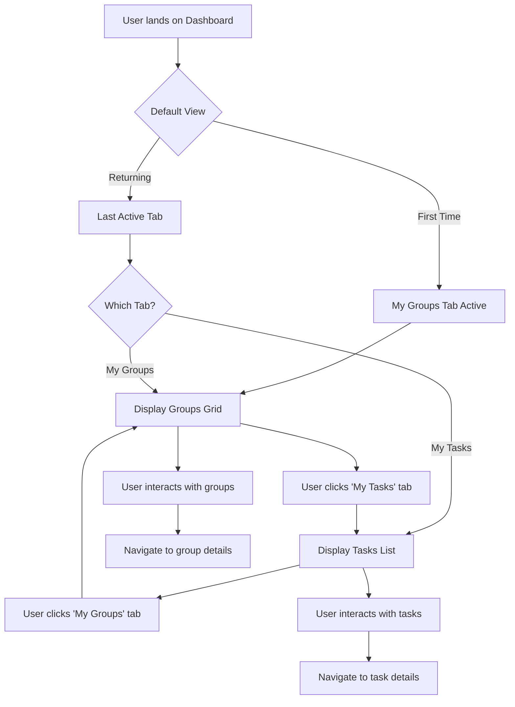
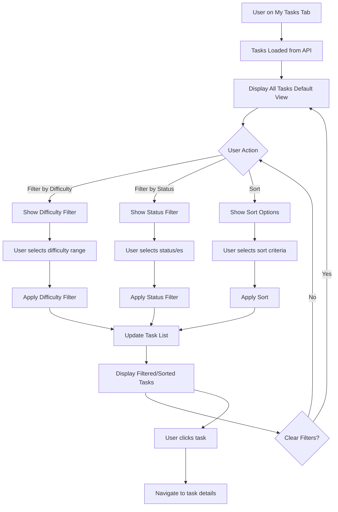
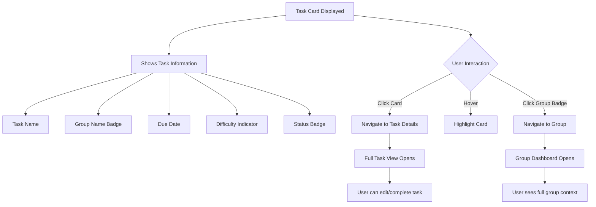

# Product Requirements Document (PRD)

**Feature ID:** FR-027  
**Feature Name:** Dashboard Navigation & My Tasks View  
**Created:** December 19, 2025  
**Status:** Draft

---

## 1. Executive Summary

This feature introduces a tabbed navigation system to the dashboard, splitting the existing single-view dashboard into two distinct views: **My Groups** and **My Tasks**. The My Groups view maintains the current functionality, while the new My Tasks view provides users with a consolidated, filterable, and sortable view of all their tasks across all groups.

**Expected Impact:**
- Improved task visibility and management across multiple groups
- Enhanced user experience with dedicated task-focused view
- Better task prioritization through filtering and sorting capabilities

---

## 2. Problem Statement

Currently, users can only view tasks within the context of individual groups. This creates several pain points:

1. **Fragmented Task View**: Users must navigate through multiple groups to see all their assigned tasks
2. **No Cross-Group Prioritization**: Difficult to prioritize tasks when they're scattered across different group views
3. **Limited Task Management**: No unified interface for filtering and sorting tasks by key attributes (difficulty, status, due date)
4. **Poor Task Discovery**: Users may miss urgent tasks in groups they don't frequently check

**User Story:**
> "As a user belonging to multiple groups, I want to see all my tasks in one place with the ability to filter and sort them, so I can prioritize my work effectively without navigating between different groups."

---

## 3. Goals & Non-Goals

### Goals
1. ✅ Add top navigation bar with two tabs: "My Groups" and "My Tasks"
2. ✅ Preserve existing dashboard functionality in "My Groups" tab
3. ✅ Create new "My Tasks" view showing all user's tasks from all groups
4. ✅ Implement task filtering by:
   - Difficulty level (1-10)
   - Status (Pending, InProgress, Completed, Overdue)
5. ✅ Implement task sorting by:
   - Difficulty (ascending/descending)
   - Status (by priority order)
   - Due Date (earliest/latest)
6. ✅ Provide clear visual indicators for task status and difficulty
7. ✅ Support both English and Hebrew languages

### Non-Goals
1. ❌ Task editing or inline task management (use existing task detail views)
2. ❌ Bulk task operations (reassign, delete, etc.)
3. ❌ Task analytics or statistics in this iteration
4. ❌ Saved filter presets or custom views
5. ❌ Calendar view or timeline visualization
6. ❌ Task notifications or reminders

---

## 4. User Flows

### Flow 1: Navigating Between Dashboard Views



**Key Actors:** End User (group member)

**Main Flow:**
1. User lands on dashboard
2. Default view shows "My Groups" tab (current behavior)
3. Top navigation displays two tabs: "My Groups" | "My Tasks"
4. User can switch between tabs with a single click
5. Selected tab is visually highlighted
6. Tab selection persists during session

**Edge Cases:**
- User with no groups: Show empty state in My Groups
- User with no tasks: Show empty state in My Tasks
- User with tasks but no active groups: Tasks still visible in My Tasks

---

### Flow 2: Filtering and Sorting My Tasks



**Key Actors:** End User viewing their tasks

**Main Flow:**
1. User navigates to "My Tasks" tab
2. System fetches all tasks assigned to user across all groups
3. Tasks displayed in default order (by due date, earliest first)
4. User can apply filters:
   - **Difficulty Filter**: Slider or dropdown for difficulty range (1-10)
   - **Status Filter**: Multi-select checkboxes (Pending, InProgress, Completed, Overdue)
5. User can apply sorting:
   - **By Difficulty**: Low to High or High to Low
   - **By Status**: Priority order (Overdue → InProgress → Pending → Completed)
   - **By Due Date**: Earliest first or Latest first
6. Filters and sorts can be combined
7. Clear filters button resets to default view
8. Applied filters/sorts persist during session

**Decision Points:**
- Multiple filters active: Apply AND logic (all filters must match)
- Conflicting sorts: Last selected sort takes precedence
- Empty results: Show "No tasks match your filters" message

**Edge Cases:**
- All tasks filtered out: Show empty state with "Clear Filters" button
- Tasks without due date: Appear at end of due date sort
- Tasks without assigned difficulty: Default to difficulty 5

---

### Flow 3: Task Card Interaction



**Key Actors:** End User interacting with task cards

**Main Flow:**
1. Each task displayed as a card with key information
2. Card shows:
   - Task name and description preview
   - Group name (as clickable badge)
   - Due date with visual urgency indicator
   - Difficulty level (visual indicator: color/stars/numbers)
   - Status badge (color-coded)
   - Assignee avatar (user's own)
3. Click anywhere on card → Navigate to task details
4. Click group badge → Navigate to that group's page
5. Visual feedback on hover/focus

**Edge Cases:**
- Overdue tasks: Red highlight or urgent badge
- Tasks due today: Yellow/amber highlight
- Completed tasks: Muted styling or strikethrough

---

## 5. Functional Requirements

### 5.1 Navigation Bar

**FR-027-001: Top Navigation Tabs**
- Display horizontal tab navigation at top of dashboard
- Two tabs: "My Groups" and "My Tasks"
- Active tab visually distinguished (underline, bold, color)
- Tabs horizontally aligned (LTR for English, RTL for Hebrew)
- Responsive design: tabs stack or remain horizontal on mobile

**FR-027-002: Tab Switching**
- Single click switches between tabs
- No page reload required (SPA behavior)
- Smooth transition animation (optional)
- URL updates to reflect active tab (e.g., `/dashboard/groups`, `/dashboard/tasks`)
- Browser back/forward buttons work correctly

**FR-027-003: Default Tab**
- "My Groups" is default tab on first visit
- Last active tab persists within session
- Optional: Remember last tab preference in localStorage

---

### 5.2 My Groups Tab

**FR-027-004: Preserve Existing Functionality**
- All current dashboard features remain in "My Groups" tab
- Group cards display
- Create group button
- Join with code button
- Group filtering/searching (if exists)
- No functional changes to existing group view

---

### 5.3 My Tasks View

**FR-027-005: Task Data Fetching**
- Fetch all tasks where user is assigned from all groups
- API endpoint: `GET /tasks/my-tasks` or `GET /tasks?assignedTo={userId}`
- Support pagination (optional for v1)
- Include group information for each task
- Real-time updates not required for v1

**FR-027-006: Task List Display**
- Display tasks in grid or list layout
- Each task card shows:
  - Task name (max 60 chars with ellipsis)
  - Group name (clickable badge)
  - Due date (formatted, with relative time: "Due in 2 days")
  - Difficulty level (visual: color scale, stars, or number/10)
  - Status badge (Pending/InProgress/Completed/Overdue)
  - Task description preview (optional, 2 lines max)
- Responsive layout: cards reflow on mobile
- Loading state while fetching
- Empty state when no tasks

**FR-027-007: Difficulty Filter**
- Filter component above task list
- Input type: Range slider or dropdown with ranges (1-3, 4-6, 7-10)
- Label: "Difficulty Level"
- Visual feedback when filter applied
- Clear/reset filter option

**FR-027-008: Status Filter**
- Multi-select checkbox group or dropdown
- Options:
  - ☐ Pending
  - ☐ In Progress
  - ☐ Completed
  - ☐ Overdue
- Label: "Status"
- Default: All statuses selected
- Visual indicator of active filters

**FR-027-009: Sort Options**
- Dropdown or button group for sort selection
- Options:
  - **Due Date**: Earliest First | Latest First
  - **Difficulty**: Low to High | High to Low
  - **Status**: By Priority (Overdue → InProgress → Pending → Completed)
- Label: "Sort by"
- Default sort: Due Date (Earliest First)
- Visual indicator of active sort

**FR-027-010: Filter & Sort Combination**
- Filters and sorts work together
- Filters use AND logic (all must match)
- Sort applied after filtering
- "Clear All Filters" button to reset

**FR-027-011: Task Card Interactions**
- Click card → Navigate to task detail page
- Click group badge → Navigate to group page
- Hover effect on card
- Keyboard navigation support (Tab, Enter)
- ARIA labels for accessibility

**FR-027-012: Empty States**
- No tasks at all: "You don't have any tasks yet. Tasks assigned to you will appear here."
- No tasks after filtering: "No tasks match your filters. Try adjusting your filter criteria."
- Each with relevant icon/illustration

---

### 5.4 Internationalization

**FR-027-013: Multi-Language Support**
- All UI text translated (English, Hebrew)
- RTL layout support for Hebrew
- Date formatting respects locale
- Translation keys:
  - `dashboard.myGroups`
  - `dashboard.myTasks`
  - `tasks.filterByDifficulty`
  - `tasks.filterByStatus`
  - `tasks.sortBy`
  - `tasks.noTasksAvailable`
  - `tasks.noTasksMatchFilters`
  - `tasks.clearFilters`
  - `tasks.dueIn` (for relative dates)
  - Status labels (pending, inProgress, completed, overdue)

---

## 6. Technical Considerations

### 6.1 Frontend Architecture

**Component Structure:**
```
DashboardPage
├── DashboardNavigation (NEW)
│   ├── TabButton: My Groups
│   └── TabButton: My Tasks
├── MyGroupsTab (existing dashboard content)
└── MyTasksTab (NEW)
    ├── TaskFilters
    │   ├── DifficultyFilter
    │   └── StatusFilter
    ├── TaskSort
    └── TaskList
        └── TaskCard[]
```

**State Management:**
- Active tab: Local component state or URL-based routing
- Filter state: React state with RTK Query parameters
- Sort state: React state
- Task data: RTK Query cache
- Consider `useSearchParams` for filter/sort persistence in URL

**Routing:**
- `/dashboard` → redirects to `/dashboard/groups`
- `/dashboard/groups` → My Groups tab
- `/dashboard/tasks` → My Tasks tab
- Optional: `/dashboard/tasks?difficulty=5-10&status=pending&sort=dueDate-asc`

---

### 6.2 Backend API

**New Endpoint (Option A - Dedicated):**
```
GET /api/tasks/my-tasks
Query Parameters:
  - difficulty: string (e.g., "5-10" or "5,6,7")
  - status: string[] (e.g., ["Pending", "InProgress"])
  - sortBy: string (e.g., "dueDate", "difficulty", "status")
  - sortOrder: "asc" | "desc"
  - page: number (optional pagination)
  - pageSize: number (optional pagination)

Response:
{
  "items": [
    {
      "id": "task-id",
      "name": "Task name",
      "description": "Task description",
      "groupId": "group-id",
      "groupName": "Group name",
      "difficulty": 7,
      "status": "InProgress",
      "dueAt": "2025-12-25T23:59:00Z",
      "assignedUserId": "user-id",
      "createdAt": "...",
      "updatedAt": "..."
    }
  ],
  "total": 42,
  "page": 1,
  "pageSize": 20
}
```

**Alternative (Option B - Extend Existing):**
```
GET /api/tasks
Query Parameters:
  - assignedTo: userId (filter to current user)
  - includeGroupInfo: boolean (include group names)
  - ... (rest same as above)
```

**Recommendation:** Option A (dedicated endpoint) for cleaner separation and optimized query.

**Backend Implementation:**
1. TaskService.GetMyTasksAsync(userId, filters, sorting, pagination)
2. Join with Groups collection to get group names
3. Apply filters in MongoDB query for performance
4. Apply sorting in MongoDB query
5. Return paginated results

**Database Query Optimization:**
- Index on `assignedUserId` field
- Compound index on `assignedUserId + status + dueAt`
- Consider caching frequently accessed task lists (Redis)

---

### 6.3 Performance Considerations

**Frontend:**
- Lazy load MyTasksTab component (code splitting)
- Virtualized list for 100+ tasks (react-window or similar)
- Debounce filter inputs (300ms)
- Memoize task cards with React.memo
- RTK Query caching: 60 second stale time

**Backend:**
- Efficient MongoDB queries with proper indexes
- Limit page size to 50-100 tasks
- Consider cursor-based pagination for large datasets
- Cache group names to avoid repeated joins

**Data Volume Estimates:**
- Average user: 10-50 tasks across 3-5 groups
- Power user: 100-200 tasks across 10-15 groups
- System should handle 500 tasks per user gracefully

---

### 6.4 Dependencies

**Frontend:**
- React Router (if not already used) for tab routing
- RTK Query for API integration (already in use)
- Existing UI component library (Headless UI, Tailwind)
- i18next for translations (already in use)

**Backend:**
- No new external dependencies
- Use existing MongoDB driver
- Use existing authentication/authorization middleware

---

### 6.5 Security & Authorization

- Only return tasks where `assignedUserId === currentUser.id`
- No sensitive information exposed (other users' emails, etc.)
- Group information limited to group name and ID
- Respect existing role-based access controls
- Rate limiting on API endpoint to prevent abuse

---

## 7. Success Metrics

### 7.1 Adoption Metrics
- **Primary:** % of users who click "My Tasks" tab within first week
  - Target: 60%+ adoption
- **Engagement:** Average sessions with "My Tasks" view per user per week
  - Target: 3+ sessions
- **Retention:** % of users who return to "My Tasks" view after first use
  - Target: 70%+

### 7.2 Usability Metrics
- **Filter Usage:** % of users who apply at least one filter
  - Target: 40%+
- **Sort Usage:** % of users who change sort order
  - Target: 30%+
- **Task Completion Rate:** Change in task completion rate after feature launch
  - Target: 10% improvement

### 7.3 Performance Metrics
- **Page Load Time:** My Tasks initial load time
  - Target: < 2 seconds (p95)
- **Filter Response Time:** Time from filter change to UI update
  - Target: < 500ms (p95)
- **API Response Time:** /tasks/my-tasks endpoint
  - Target: < 300ms (p95)

### 7.4 Acceptance Criteria
- ✅ All functional requirements implemented
- ✅ Both tabs functional and switchable
- ✅ All three filters work correctly
- ✅ All three sort options work correctly
- ✅ Filters and sorts can be combined
- ✅ Empty states display appropriately
- ✅ Full English and Hebrew translation
- ✅ RTL layout works in Hebrew
- ✅ Mobile responsive design
- ✅ Keyboard navigation functional
- ✅ No regression in existing "My Groups" functionality
- ✅ API returns correct filtered/sorted data
- ✅ Performance targets met

---

## 8. Open Questions / Risks

### Open Questions

1. **Pagination Strategy:**
   - Q: Should we paginate the task list, or show all tasks?
   - Recommendation: Start with "load more" button, implement infinite scroll in v2

2. **Filter Persistence:**
   - Q: Should filters persist across sessions (localStorage)?
   - Recommendation: Yes, save filter state in localStorage for better UX

3. **Default Sort Order:**
   - Q: What should be the default sort? Due date (earliest) or status priority?
   - Recommendation: Due date (earliest first) to highlight urgent tasks

4. **Group Badge Click Behavior:**
   - Q: Should clicking group badge open in new tab or same page?
   - Recommendation: Same page navigation, consistent with existing behavior

5. **Completed Tasks Display:**
   - Q: Should completed tasks be hidden by default?
   - Recommendation: Show all by default, but add "Hide Completed" quick filter

6. **Task Count:**
   - Q: Show total task count and filtered count?
   - Recommendation: Yes, e.g., "Showing 15 of 42 tasks"

7. **Mobile UX:**
   - Q: Should filters be in a drawer/modal on mobile?
   - Recommendation: Yes, collapsible filter panel with "Filter" button

### Risks & Mitigations

| Risk | Impact | Probability | Mitigation |
|------|--------|-------------|------------|
| **Performance degradation with 500+ tasks** | High | Medium | Implement virtualized lists, pagination, and efficient queries |
| **Complex filter combinations slow down API** | Medium | Low | Add database indexes, optimize queries, implement caching |
| **Users confused by two-tab interface** | Medium | Low | Clear labeling, tooltips, user onboarding guide |
| **Increased API load from new endpoint** | Medium | Medium | Implement rate limiting, caching, and monitor API performance |
| **Mobile UX cramped with filters** | Low | Medium | Use collapsible filter panel, responsive design testing |
| **Translation inconsistencies** | Low | Low | Comprehensive i18n review before release |
| **Browser compatibility issues** | Low | Low | Cross-browser testing (Chrome, Firefox, Safari, Edge) |
| **RTL layout bugs in Hebrew** | Medium | Medium | Dedicated RTL testing, BiDi component review |

### Assumptions

1. Existing task API can be extended or new endpoint created without major refactor
2. Users typically have < 200 tasks across all groups
3. Task data structure includes all required fields (difficulty, status, dueAt)
4. Groups already have names stored and accessible
5. Current authentication/authorization system works for new endpoint
6. Existing Redux/RTK Query setup can handle new state management needs
7. Design system components (tabs, filters, cards) are available or easy to create

---

## 9. Implementation Phases

### Phase 1: Foundation (Week 1)
- Create navigation tab component
- Set up routing for /dashboard/groups and /dashboard/tasks
- Implement basic My Tasks tab with empty state
- Add translations for new UI elements

### Phase 2: Backend API (Week 1-2)
- Create GET /tasks/my-tasks endpoint
- Implement filtering logic (difficulty, status)
- Implement sorting logic (difficulty, status, due date)
- Add database indexes
- API testing and optimization

### Phase 3: Frontend Core (Week 2)
- Implement task list display
- Create TaskCard component
- Integrate with API via RTK Query
- Add loading and empty states

### Phase 4: Filters & Sorting (Week 3)
- Implement difficulty filter UI
- Implement status filter UI
- Implement sort dropdown
- Connect filters/sorts to API
- Add "Clear Filters" functionality

### Phase 5: Polish & Testing (Week 3-4)
- Responsive design for mobile
- RTL layout for Hebrew
- Keyboard navigation
- Cross-browser testing
- Performance optimization
- User acceptance testing

### Phase 6: Launch (Week 4)
- Feature flag rollout to 10% users
- Monitor metrics and performance
- Gather feedback
- Full rollout to 100% users

---

## 10. Future Enhancements (Out of Scope)

- Task analytics dashboard (completion rates, time spent, etc.)
- Saved filter presets ("My Urgent Tasks", "This Week", etc.)
- Calendar view of tasks
- Bulk task operations (reassign, mark complete, etc.)
- Task dependencies and subtasks
- Gantt chart or timeline view
- Export tasks to CSV/PDF
- Task templates and recurring tasks
- Task comments and activity log
- Mobile app dedicated task view
- Push notifications for due tasks

---

## Appendix A: Wireframes

### Desktop - My Groups Tab
```
┌────────────────────────────────────────────────────────┐
│  Dashboard                                    [User]    │
├────────────────────────────────────────────────────────┤
│  [MY GROUPS] │  My Tasks                               │
├────────────────────────────────────────────────────────┤
│  ┌─────────────┐  ┌─────────────┐  ┌─────────────┐   │
│  │  Family     │  │   Work      │  │  Hobbies    │   │
│  │  👥 5       │  │   👥 12     │  │  👥 3       │   │
│  │  📋 8       │  │   📋 15     │  │  📋 4       │   │
│  └─────────────┘  └─────────────┘  └─────────────┘   │
│  [+ Create Group]  [Join with Code]                    │
└────────────────────────────────────────────────────────┘
```

### Desktop - My Tasks Tab
```
┌────────────────────────────────────────────────────────┐
│  Dashboard                                    [User]    │
├────────────────────────────────────────────────────────┤
│  My Groups  │  [MY TASKS]                              │
├────────────────────────────────────────────────────────┤
│  Filters: [Difficulty ▼] [Status ▼]  Sort: [Due Date ▼]│
│  Showing 15 of 42 tasks               [Clear Filters]  │
├────────────────────────────────────────────────────────┤
│  ┌──────────────────────────────────────────────────┐ │
│  │ 🔴 Complete Report              [Work Group]     │ │
│  │ Difficulty: ⭐⭐⭐⭐⭐⭐⭐⭐ (8/10)                   │ │
│  │ Status: In Progress  Due: Tomorrow               │ │
│  └──────────────────────────────────────────────────┘ │
│  ┌──────────────────────────────────────────────────┐ │
│  │ Review PR #245                  [Work Group]     │ │
│  │ Difficulty: ⭐⭐⭐⭐⭐ (5/10)                       │ │
│  │ Status: Pending      Due: Dec 22, 2025           │ │
│  └──────────────────────────────────────────────────┘ │
└────────────────────────────────────────────────────────┘
```

### Mobile - My Tasks Tab
```
┌──────────────────────┐
│ Dashboard       [≡]  │
├──────────────────────┤
│ My Groups │[MY TASKS]│
├──────────────────────┤
│ [🔍 Filter] [Sort ▼] │
├──────────────────────┤
│ ┌──────────────────┐ │
│ │ Complete Report  │ │
│ │ [Work] 🔴        │ │
│ │ ⭐⭐⭐⭐⭐⭐⭐⭐ (8/10)  │ │
│ │ Due: Tomorrow    │ │
│ └──────────────────┘ │
│ ┌──────────────────┐ │
│ │ Review PR #245   │ │
│ │ [Work] 🟡        │ │
│ │ ⭐⭐⭐⭐⭐ (5/10)      │ │
│ │ Due: Dec 22      │ │
│ └──────────────────┘ │
└──────────────────────┘
```

---

## Appendix B: API Examples

### Request: Get My Tasks with Filters
```http
GET /api/tasks/my-tasks?difficulty=5-10&status=Pending&status=InProgress&sortBy=dueDate&sortOrder=asc
Authorization: Bearer {token}
```

### Response: Success
```json
{
  "items": [
    {
      "id": "67890abcdef",
      "name": "Complete quarterly report",
      "description": "Compile and analyze Q4 metrics",
      "groupId": "group-123",
      "groupName": "Work Team",
      "difficulty": 8,
      "status": "InProgress",
      "dueAt": "2025-12-20T23:59:00Z",
      "assignedUserId": "user-456",
      "createdAt": "2025-12-15T10:00:00Z",
      "updatedAt": "2025-12-18T14:30:00Z"
    },
    {
      "id": "12345fedcba",
      "name": "Review pull request #245",
      "description": "Code review for authentication feature",
      "groupId": "group-123",
      "groupName": "Work Team",
      "difficulty": 5,
      "status": "Pending",
      "dueAt": "2025-12-22T17:00:00Z",
      "assignedUserId": "user-456",
      "createdAt": "2025-12-19T09:00:00Z",
      "updatedAt": "2025-12-19T09:00:00Z"
    }
  ],
  "total": 15,
  "page": 1,
  "pageSize": 20
}
```

### Response: No Tasks Found
```json
{
  "items": [],
  "total": 0,
  "page": 1,
  "pageSize": 20
}
```

---

## Document History

| Version | Date | Author | Changes |
|---------|------|--------|---------|
| 1.0 | 2025-12-19 | Copilot PRD Architect | Initial PRD creation for FR-027 |

---

**Approvals:**

- [ ] Product Manager: _____________________ Date: _______
- [ ] Engineering Lead: _____________________ Date: _______
- [ ] Design Lead: _____________________ Date: _______
- [ ] QA Lead: _____________________ Date: _______
