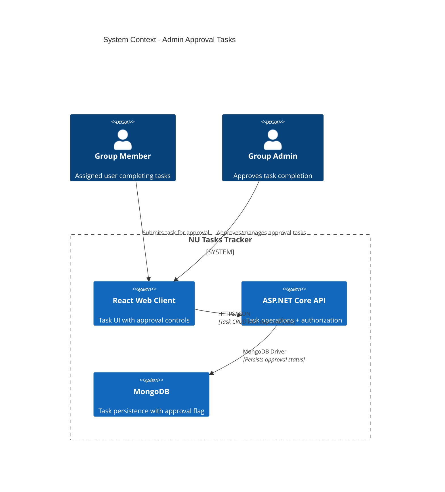
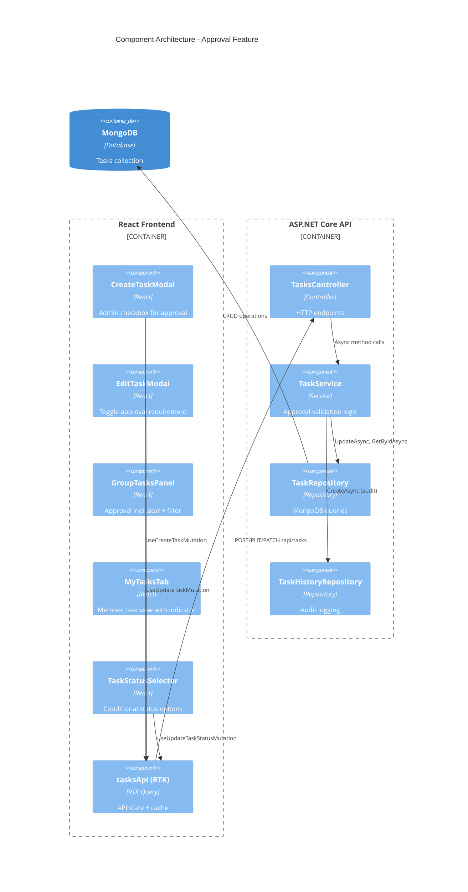
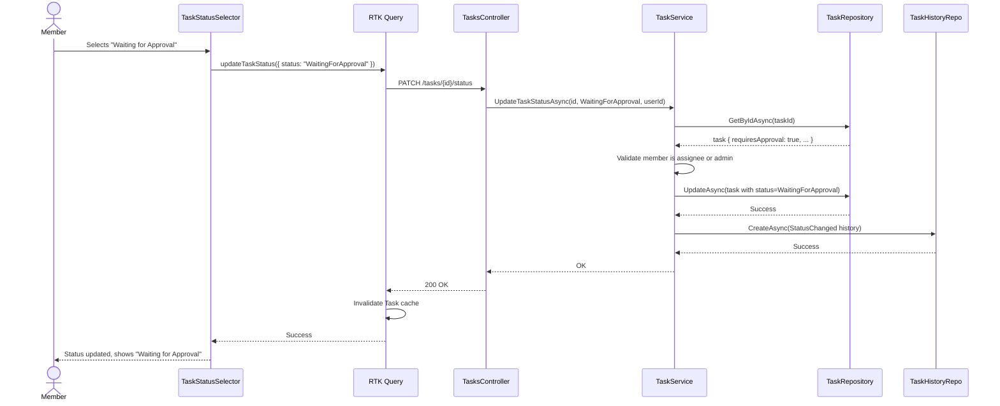
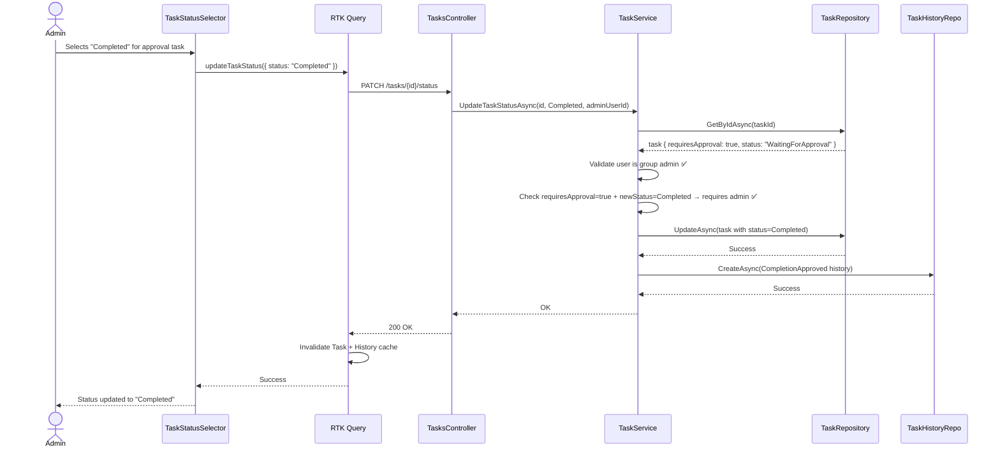

# Technical Design: Task Completion Admin Approval System

**Document Version:** 1.0  
**Last Updated:** December 23, 2025  
**Mode:** Feature Enhancement  
**PRD Reference:** `/docs/prds/FR-028-admin-approval-tasks.md`  
**Repository:** NU Tasks Management Application  
**Development Order:** Client → Backend → Integration

---

## 1. Executive Summary

### Business Value
- Enables quality gates for high-value/critical tasks requiring admin verification
- Provides administrative oversight without disrupting normal task workflows
- Increases accountability through explicit approval tracking
- Zero impact on existing tasks (opt-in feature with backward compatibility)

### High-Level Approach
- **Client-First Strategy:** Build UI components and state management before backend changes
- Add `requiresApproval` boolean field to task domain (default: false)
- Introduce `WaitingForApproval` status to task lifecycle
- Implement conditional status transitions based on approval requirement and user role
- Reuse existing task history infrastructure for approval event logging
- Leverage existing admin role verification at service layer

### Key Technical Decisions
- **Status Enum Extension:** Add `WaitingForApproval` to existing TaskStatus enum (non-breaking)
- **Frontend-Driven Design:** UI mock approval workflow first, wire to API second
- **Thin Wrapper Pattern:** Extend existing TaskService methods vs creating separate approval service
- **Single Field Approach:** Use boolean flag vs complex approval object (YAGNI principle)
- **Permission Model:** Reuse existing group admin role checks (no new permission system)
- **History Integration:** Leverage TaskHistory with existing `CompletionApproved` action

---

## 2. Requirements Summary

### Functional Requirements (from PRD §5)
- Admin-only checkbox to mark tasks as "requires approval" during creation/editing
- New `WaitingForApproval` status available when member submits approval-required task
- Only admins can transition approval-required tasks from `WaitingForApproval` → `Completed`
- Visual approval indicator (shield icon) on all task displays
- Status selector shows context-appropriate options (member vs admin, approval vs standard)
- Task history logs approval requirement changes and completion approvals
- Filter tasks by `WaitingForApproval` status in GroupTasksPanel and MyTasksTab
- Existing tasks unaffected (default `requiresApproval: false`)

### Non-Functional Requirements
- **Performance:** No query degradation; single boolean field adds <1% storage overhead
- **Backward Compatibility:** Existing API clients work without changes
- **Security:** All authorization enforced at service layer (frontend UI is convenience)
- **I18n:** Full English/Hebrew translation support for all approval UI elements
- **Accessibility:** Approval indicators must have ARIA labels and screen reader support

### Acceptance Criteria
1. Admin can create task with approval requirement → flag persists and returns in all endpoints
2. Member cannot directly complete approval-required task → only `WaitingForApproval` available
3. Admin can approve → status changes to `Completed` with history logged
4. Approval indicator visible on all task views → shield icon with tooltip
5. Non-admin cannot set approval flag → backend returns 403 Forbidden
6. Existing tasks work identically → zero behavior change for tasks without flag

### Constraints
- Must maintain existing feature-based architecture (Controller → Service → Repository)
- Cannot introduce new authentication/authorization system (use existing group admin role)
- No breaking changes to existing API contracts (additive only)
- Must support MongoDB 4.4+ (field addition compatible)

### Assumptions
- **Assume:** Single admin approval sufficient (no multi-approver chains)
- **Assume:** No approval rejection workflow in initial release (admin sets to InProgress manually)
- **Assume:** No approval notifications/alerts (future enhancement)
- **Assume:** Task history visibility unchanged (all members see approval events)

---

## 3. Current Architecture (Relevant Components)

### Existing Components

| Component | Responsibility | Modification Needed |
|-----------|----------------|---------------------|
| `TaskItem` (Domain) | Task entity with status, assignee, metadata | Add `requiresApproval: boolean` field |
| `TaskStatus` (Enum) | Task lifecycle states | Add `WaitingForApproval` value |
| `TaskService` | Business logic, validation, authorization | Extend status transition validation |
| `TasksController` | HTTP endpoints for task operations | No structural changes (pass-through) |
| `TaskHistoryRepository` | Audit log storage | Reuse existing (no changes) |
| `tasksApi.ts` (RTK Query) | Client-side API state management | Add `requiresApproval` to interfaces |
| `GroupTasksPanel` (React) | Admin task management UI | Add approval checkbox + indicator |
| `MyTasksTab` (React) | User task list UI | Add approval indicator + status filter |

### Integration Points
- **Authorization:** `TaskService` validates group admin role via `IGroupRepository.GetByIdAsync()`
- **History Logging:** `TaskService` calls `ITaskHistoryRepository.CreateAsync()` for audit trail
- **Status Display:** Components use `getStatusLabel()` helper for i18n translations
- **API Communication:** All components use RTK Query hooks (auto cache invalidation)

### Gaps in Current Design
- No approval-specific status in lifecycle (only Pending/InProgress/Completed/Overdue)
- No mechanism to restrict status transitions based on task properties
- No visual differentiation for tasks requiring special handling
- No filtering by approval status in task panels

---

## 4. Proposed Architecture

### 4.1 System Context (C4)



### 4.2 Component Diagram



---

## 5. Detailed Design

### 5.1 Client-Side Design (Priority 1)

#### 5.1.1 Data Model Extensions

**TypeScript Interface Updates:**
```typescript
// tasksApi.ts
export interface TaskResponse {
  // ... existing fields
  requiresApproval: boolean;  // NEW
}

export interface CreateTaskRequest {
  // ... existing fields
  requiresApproval?: boolean;  // NEW - optional, defaults false
}

export interface UpdateTaskRequest {
  // ... existing fields
  requiresApproval?: boolean;  // NEW - optional
}

export type TaskStatus = 
  | 'Pending' 
  | 'InProgress' 
  | 'WaitingForApproval'  // NEW
  | 'Completed' 
  | 'Overdue';
```

**Rationale:** Use optional fields to maintain backward compatibility. Existing API clients without approval support will ignore the field.

#### 5.1.2 UI Component Changes (Client-First Development)

**A. CreateTaskModal Component**

```typescript
// Pseudo-implementation showing approval checkbox integration
const CreateTaskModal = ({ groupId, myRole, isOpen, onClose }) => {
  const [requiresApproval, setRequiresApproval] = useState(false);
  const isAdmin = myRole === 'Admin';
  
  // ... existing form state
  
  return (
    <Dialog open={isOpen} onClose={onClose}>
      {/* ... existing fields (name, assignee, difficulty, dueAt) */}
      
      {/* NEW: Admin-Only Approval Checkbox */}
      {isAdmin && (
        <div className="flex items-center gap-2">
          <input
            type="checkbox"
            id="requiresApproval"
            checked={requiresApproval}
            onChange={(e) => setRequiresApproval(e.target.checked)}
          />
          <label htmlFor="requiresApproval">
            {t('createTask.requiresApprovalLabel')}
            <Tooltip content={t('createTask.requiresApprovalHelp')}>
              <QuestionMarkCircleIcon className="h-4 w-4" />
            </Tooltip>
          </label>
        </div>
      )}
      
      {/* Submit sends requiresApproval in request */}
    </Dialog>
  );
};
```

**B. Task Approval Indicator Component (Reusable)**

```typescript
// New component: ApprovalIndicator.tsx
export const ApprovalIndicator = ({ 
  requiresApproval, 
  status, 
  size = 'sm' 
}: {
  requiresApproval: boolean;
  status: TaskStatus;
  size?: 'sm' | 'md' | 'lg';
}) => {
  if (!requiresApproval) return null;
  
  return (
    <Tooltip content={t('tasks.requiresApprovalHint')}>
      <ShieldCheckIcon 
        className={`text-amber-600 ${sizeClasses[size]}`}
        aria-label={t('tasks.requiresApproval')}
      />
    </Tooltip>
  );
};
```

**Usage:** Insert `<ApprovalIndicator />` next to task name in all task displays (GroupTasksPanel, MyTasksTab, task cards).

**C. Status Selector Logic (Conditional Options)**

```typescript
// TaskStatusSelector.tsx - Enhanced with approval logic
const TaskStatusSelector = ({ 
  task, 
  currentUserId, 
  myRole, 
  onStatusChange 
}) => {
  const isAdmin = myRole === 'Admin';
  const isAssignee = task.assignedUserId === currentUserId;
  
  // Compute available statuses based on approval requirement
  const availableStatuses = useMemo(() => {
    const base: TaskStatus[] = ['Pending', 'InProgress'];
    
    if (task.requiresApproval) {
      // Approval-required task
      if (isAdmin) {
        // Admin sees all statuses including Completed
        return [...base, 'WaitingForApproval', 'Completed'];
      } else {
        // Member cannot complete; only submit for approval
        return [...base, 'WaitingForApproval'];
      }
    } else {
      // Standard task - existing behavior
      if (isAdmin || isAssignee) {
        return [...base, 'Completed'];
      }
      return base;
    }
  }, [task.requiresApproval, isAdmin, isAssignee]);
  
  return (
    <select value={task.status} onChange={e => onStatusChange(e.target.value)}>
      {availableStatuses.map(status => (
        <option key={status} value={status}>
          {getStatusLabel(status)}
        </option>
      ))}
    </select>
  );
};
```

**Key Decision:** UI hides unavailable options rather than showing disabled options. Clearer UX for members who cannot complete approval tasks.

#### 5.1.3 RTK Query Mutations (No Breaking Changes)

```typescript
// tasksApi.ts - Existing mutations extended
export const tasksApi = apiSlice.injectEndpoints({
  endpoints: (builder) => ({
    createTask: builder.mutation<{ id: string }, CreateTaskRequest>({
      query: (body) => ({ 
        url: '/tasks', 
        method: 'POST', 
        body  // Now includes optional requiresApproval
      }),
      invalidatesTags: [{ type: 'Task', id: 'LIST' }],
    }),
    
    updateTask: builder.mutation<void, { taskId: string; data: UpdateTaskRequest }>({
      query: ({ taskId, data }) => ({
        url: `/tasks/${taskId}`,
        method: 'PUT',
        body: data  // Now includes optional requiresApproval
      }),
      invalidatesTags: (_result, _error, { taskId }) => [
        { type: 'Task', id: taskId },
        { type: 'Task', id: 'LIST' },
      ],
    }),
    
    // No changes to updateTaskStatus mutation
    // Validation happens server-side
  }),
});
```

#### 5.1.4 Internationalization Keys

**Translation Keys to Add:**
```json
{
  "tasks.requiresApproval": "Requires Admin Approval",
  "tasks.requiresApprovalHint": "This task must be approved by an admin before completion",
  "tasks.status.waitingForApproval": "Waiting for Approval",
  "createTask.requiresApprovalLabel": "Requires Admin Approval",
  "createTask.requiresApprovalHelp": "If enabled, only admins can mark this task as completed",
  "groupTasksPanel.filters.waitingForApproval": "Waiting for Approval",
  "groupTasksPanel.approvalIndicator": "Approval Required"
}
```

Hebrew translations provided in PRD Appendix.

---

### 5.2 Backend Design (Priority 2)

#### 5.2.1 Domain Model Update

```csharp
// TaskItem.cs - Add single field
public class TaskItem
{
    // ... existing fields
    
    public bool RequiresApproval { get; set; } = false;  // NEW
}

// TaskStatus enum extension
public enum TaskStatus
{
    Pending,
    InProgress,
    WaitingForApproval,  // NEW - enum value 2 (maintains order)
    Completed,
    Overdue
}
```

**Database Migration:**
```javascript
// MongoDB migration script
db.tasks.updateMany(
  { requiresApproval: { $exists: false } },
  { $set: { requiresApproval: false } }
);
```

**Index Consideration:** No new indexes required. Existing `(groupId, status)` index sufficient for filtering.

#### 5.2.2 Service Layer Logic (Core Business Rules)

```csharp
// TaskService.cs - Enhanced validation
public async Task UpdateTaskStatusAsync(
    string taskId, 
    TaskStatus newStatus, 
    string requestingUserId, 
    CancellationToken ct)
{
    var task = await _taskRepository.GetByIdAsync(taskId, ct);
    if (task == null) throw new KeyNotFoundException($"Task {taskId} not found");
    
    var group = await _groupRepository.GetByIdAsync(task.GroupId);
    if (group == null) throw new KeyNotFoundException($"Group not found");
    
    var requestingMember = group.Members.FirstOrDefault(m => m.UserId == requestingUserId);
    if (requestingMember == null) 
        throw new UnauthorizedAccessException("Not a group member");
    
    // NEW: Approval-specific validation
    if (task.RequiresApproval && newStatus == TaskStatus.Completed)
    {
        // Only admins can complete approval-required tasks
        if (requestingMember.Role != GroupRole.Admin)
        {
            throw new UnauthorizedAccessException(
                "Only group admins can mark approval-required tasks as completed");
        }
    }
    
    // Existing validation for non-approval tasks
    var isAssignee = task.AssignedUserId == requestingUserId;
    var isAdmin = requestingMember.Role == GroupRole.Admin;
    
    if (!isAssignee && !isAdmin)
        throw new UnauthorizedAccessException("Only assignee or admin can update status");
    
    var oldStatus = task.Status;
    task.Status = newStatus;
    await _taskRepository.UpdateAsync(task, ct);
    
    // Log history with appropriate action
    var historyAction = newStatus == TaskStatus.Completed && task.RequiresApproval
        ? TaskHistoryAction.CompletionApproved
        : TaskHistoryAction.StatusChanged;
    
    await _taskHistoryRepository.CreateAsync(new TaskHistory
    {
        TaskId = taskId,
        GroupId = task.GroupId,
        ChangedByUserId = requestingUserId,
        Action = historyAction,
        Changes = new Dictionary<string, string>
        {
            ["OldStatus"] = oldStatus.ToString(),
            ["NewStatus"] = newStatus.ToString()
        }
    });
}
```

**Key Validation Rules:**
1. If `requiresApproval = true` AND `newStatus = Completed` → require admin role
2. If `requiresApproval = false` → existing behavior (assignee or admin can complete)
3. All other status transitions → existing authorization checks apply

#### 5.2.3 DTO Updates (Request/Response)

```csharp
// CreateTaskRequest.cs
public class CreateTaskRequest
{
    // ... existing fields
    public bool RequiresApproval { get; set; } = false;  // NEW - defaults to false
}

// UpdateTaskRequest.cs
public class UpdateTaskRequest
{
    // ... existing fields
    public bool? RequiresApproval { get; set; }  // NEW - nullable for optional update
}

// TaskResponse.cs
public class TaskResponse
{
    // ... existing fields
    public bool RequiresApproval { get; set; }  // NEW - always returned
}
```

**Backward Compatibility:** 
- Existing API clients that don't send `requiresApproval` get default `false` (no behavior change)
- Response always includes field (clients can ignore)

#### 5.2.4 Controller Changes (Minimal)

```csharp
// TasksController.cs - No structural changes, pass-through only
[HttpPost]
public async Task<IActionResult> Create([FromBody] CreateTaskRequest request, CancellationToken ct)
{
    // Validation: Only admins can set requiresApproval = true
    if (request.RequiresApproval)
    {
        var userId = User.FindFirst(ClaimTypes.NameIdentifier)?.Value ?? string.Empty;
        // Service layer validates admin role; controller just passes through
    }
    
    var id = await _taskService.CreateAsync(request, userId, isAdmin: true, ct);
    return Created($"/api/tasks/{id}", new { id });
}
```

**Rationale:** Keep controller thin. Authorization enforcement happens in `TaskService` where group membership is validated.

---

### 5.3 Integration & Data Flow

#### 5.3.1 Sequence Diagram: Member Submits Task for Approval



#### 5.3.2 Sequence Diagram: Admin Approves Task



---

## 6. Security & Authorization

### Authorization Matrix

| Operation | RequiresApproval | User Role | Allowed? | Enforced By |
|-----------|------------------|-----------|----------|-------------|
| Create task with approval=true | N/A | Admin | ✅ Yes | TaskService.CreateAsync |
| Create task with approval=true | N/A | Member | ❌ No (403) | TaskService.CreateAsync |
| Update approval flag | N/A | Admin | ✅ Yes | TaskService.UpdateTaskAsync |
| Update approval flag | N/A | Member | ❌ No (403) | TaskService.UpdateTaskAsync |
| Set status to Completed | true | Admin | ✅ Yes | TaskService.UpdateTaskStatusAsync |
| Set status to Completed | true | Member | ❌ No (403) | TaskService.UpdateTaskStatusAsync |
| Set status to Completed | false | Assignee | ✅ Yes | TaskService.UpdateTaskStatusAsync |
| Set status to WaitingForApproval | true | Assignee | ✅ Yes | TaskService.UpdateTaskStatusAsync |

**Security Principles:**
- **Defense in Depth:** Frontend hides UI elements; backend enforces authorization
- **Least Privilege:** Members cannot set approval flag or complete approval tasks
- **Audit Trail:** All approval events logged in TaskHistory with user attribution
- **No New Permissions:** Reuses existing GroupRole.Admin check

---

## 7. Testing Strategy

### Unit Tests (Backend)
```csharp
// TaskServiceTests.cs - New test cases
[Fact]
public async Task UpdateTaskStatus_ApprovalRequiredTask_MemberCannotComplete()
{
    // Arrange: task with requiresApproval=true, member user
    // Act: UpdateTaskStatusAsync(taskId, Completed, memberUserId)
    // Assert: throws UnauthorizedAccessException
}

[Fact]
public async Task UpdateTaskStatus_ApprovalRequiredTask_AdminCanComplete()
{
    // Arrange: task with requiresApproval=true, admin user
    // Act: UpdateTaskStatusAsync(taskId, Completed, adminUserId)
    // Assert: status updated, CompletionApproved history logged
}
```

### Component Tests (Frontend)
```typescript
// CreateTaskModal.test.tsx
describe('CreateTaskModal', () => {
  it('shows approval checkbox only to admins', () => {
    const { queryByLabelText } = render(
      <CreateTaskModal myRole="Member" {...props} />
    );
    expect(queryByLabelText(/requires admin approval/i)).toBeNull();
    
    const { getByLabelText } = render(
      <CreateTaskModal myRole="Admin" {...props} />
    );
    expect(getByLabelText(/requires admin approval/i)).toBeInTheDocument();
  });
});

// TaskStatusSelector.test.tsx
it('hides Completed option for members on approval tasks', () => {
  const task = { requiresApproval: true, status: 'InProgress' };
  const { queryByText } = render(
    <TaskStatusSelector task={task} myRole="Member" {...props} />
  );
  expect(queryByText('Completed')).toBeNull();
  expect(queryByText('Waiting for Approval')).toBeInTheDocument();
});
```

### Integration Tests
1. **Approval Workflow E2E:** Admin creates approval task → Member submits → Admin approves → Verify history
2. **Non-Admin Rejection:** Member tries to create approval task → API returns 403
3. **Backward Compatibility:** Existing task without approval flag → Completes normally

---

## 8. Implementation Plan

### Phase 1: Client-Side Foundation (Days 1-2)
**Goal:** UI components functional with mock approval flow

1. Update TypeScript interfaces (TaskResponse, CreateTaskRequest, etc.)
2. Add `WaitingForApproval` to TaskStatus type
3. Create `ApprovalIndicator` component
4. Add approval checkbox to CreateTaskModal (admin-only visibility)
5. Update TaskStatusSelector with conditional logic (mock admin check)
6. Add i18n keys (English + Hebrew)
7. Component tests for approval UI

**Deliverable:** Functional approval UI that can be demoed (with hardcoded backend responses)

### Phase 2: Backend Implementation (Days 3-4)
**Goal:** API supports approval field and validation

1. Add `RequiresApproval` field to TaskItem domain model
2. Run MongoDB migration script
3. Extend TaskStatus enum with WaitingForApproval
4. Update CreateTaskRequest, UpdateTaskRequest, TaskResponse DTOs
5. Implement approval validation in TaskService.UpdateTaskStatusAsync
6. Update TaskService.CreateAsync to accept approval flag
7. Unit tests for approval validation logic

**Deliverable:** API endpoints accept and enforce approval rules

### Phase 3: Integration & Polish (Days 5-6)
**Goal:** End-to-end approval workflow functional

1. Wire frontend RTK Query mutations to new API contracts
2. Add approval filter to GroupTasksPanel
3. Add approval indicator to MyTasksTab
4. Update EditTaskModal with approval checkbox
5. Integration tests for approval workflow
6. Manual QA testing (admin creates → member submits → admin approves)
7. Fix bugs and edge cases

**Deliverable:** Feature complete and tested

### Phase 4: Documentation & Release (Day 7)
1. Update API documentation (Swagger annotations)
2. Update user guide with approval feature instructions
3. Update progress.md with implementation summary
4. Code review and approval
5. Deploy to staging → production

**Total Estimated Time:** 7 days

---

## 9. Risks & Mitigations

| Risk | Likelihood | Impact | Mitigation |
|------|------------|--------|------------|
| Enum value order breaks serialization | Low | High | TaskStatus enum uses explicit int values; test deserialization |
| Frontend-backend mismatch on status options | Medium | Medium | Backend validation is source of truth; frontend UI is guidance only |
| Approval bottleneck (admin overload) | Medium | High | Make approval opt-in (not default); add "Waiting for Approval" filter for quick triage |
| Scope creep (rejection workflow requests) | High | Medium | Document non-goals clearly; plan Phase 2 for rejection feature |
| Migration fails on large task collections | Low | Medium | Test migration script on staging; add index if performance degrades |

---

## 10. Open Questions

1. **Q:** Should we add an index on `(groupId, requiresApproval, status)` for approval task filtering?  
   **A:** Monitor query performance in staging. Add if filter queries >100ms.

2. **Q:** Can admin remove approval requirement from task currently "Waiting for Approval"?  
   **A:** Yes, but admin must manually change status (to InProgress or Completed). Document in user guide.

3. **Q:** Should we track approval time (time between WaitingForApproval and Completed)?  
   **A:** Out of scope for Phase 1. Add in future analytics feature.

4. **Q:** What happens if task is overdue while "Waiting for Approval"?  
   **A:** Overdue status takes precedence (existing behavior). Approval indicator still shows.

---

**DOCUMENT STATUS:** Complete  
**Next Steps:** Review with engineering team → Approve design → Begin Phase 1 implementation
