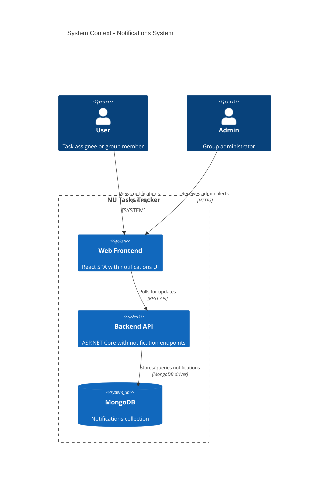
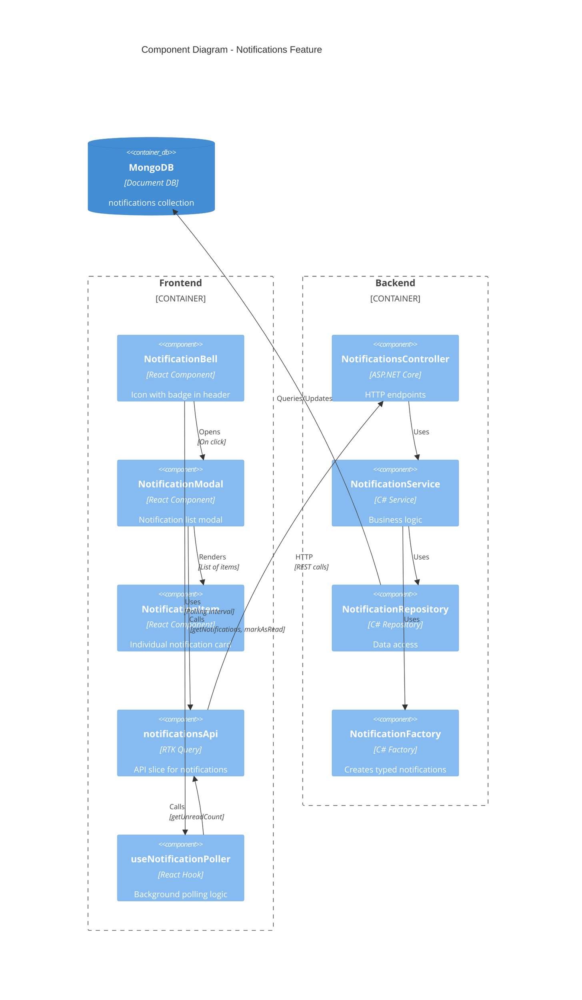
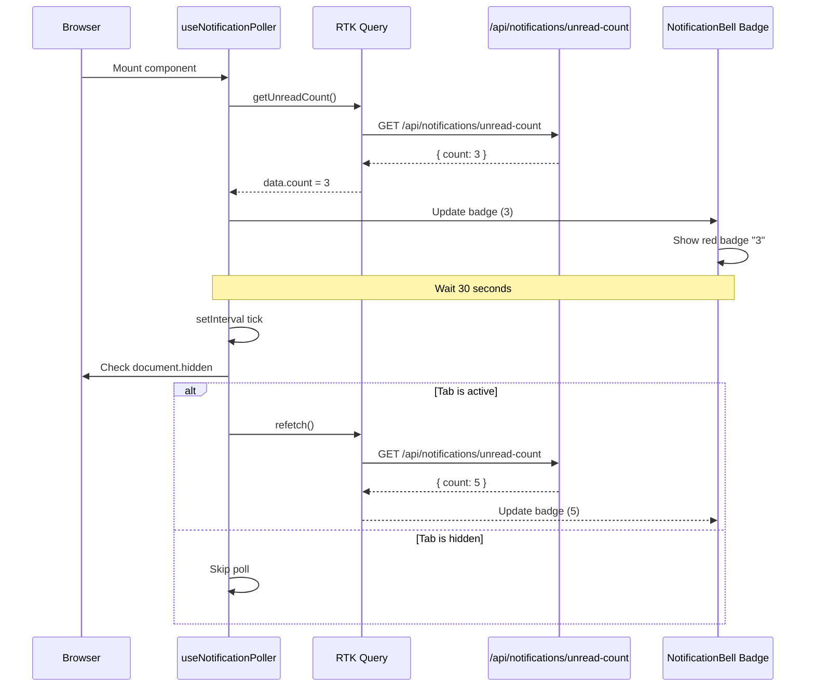
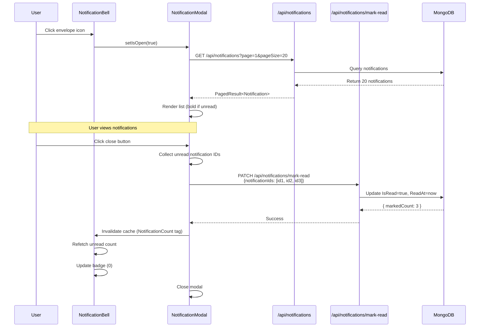
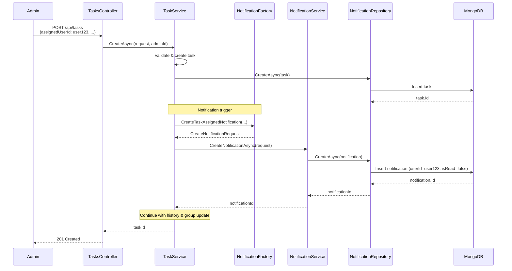

# Technical Design: In-App Notifications System

**Document Version:** 1.0  
**Last Updated:** December 24, 2025  
**Mode:** Feature Enhancement  
**PRD Reference:** [FR-029 PRD](../prds/FR-029-notifications-system.md)  
**Repository:** my-tasks-tracker-app  
**Feature ID:** FR-029

---

## 1. Executive Summary

### Business Value
- **User Engagement:** Proactive notifications reduce manual checking, increasing platform stickiness
- **Admin Efficiency:** Real-time alerts for approval requests and status changes improve response time
- **Collaboration:** Membership notifications strengthen group cohesion and onboarding
- **Reduced Support Load:** Self-service notification center reduces "I missed an update" support tickets

### High-Level Approach
- **Client-First Implementation:** Build UI components and polling mechanism before backend triggers
- **Polling Strategy:** 30-second interval for unread count; full list fetched on modal open
- **Phased Rollout:** Phase 1 (polling), Phase 2 (WebSockets), Phase 3 (preferences)
- **Reuse Existing Patterns:** RTK Query for API state, feature-based backend structure, MongoDB repository pattern
- **Thin Integration Layer:** Inject notification creation calls into existing service methods (TaskService, InvitationService, GroupService)

### Key Decisions

| Decision | Rationale | Trade-off |
|----------|-----------|-----------|
| **Polling over WebSockets (Phase 1)** | Simpler implementation, sufficient for MVP | 30s latency vs real-time |
| **Mark read on modal close** | User had opportunity to view all notifications | vs. individual click tracking |
| **No notification preferences** | Reduces scope; users get all relevant notifications | May cause fatigue in high-activity groups |
| **Store localized strings in DB** | Simplifies backend logic; consistent with task history | Slightly larger storage footprint |
| **90-day TTL** | Balance between history and storage | Older notifications auto-deleted |
| **Badge shows count (not just dot)** | More informative UX | Requires accurate counting |

---

## 2. Requirements Summary (from PRD)

### Functional Requirements
- Display envelope icon with unread count badge in application header
- Open notification modal on icon click, showing paginated list
- Bold styling + blue dot for unread notifications
- Mark notifications as read when modal closes (batch operation)
- Navigate to relevant context (task, group, invitation) on notification click
- Support 6 notification types: task assigned, status changed, pending approval, member joined, member removed, invitation received
- Admins receive notifications for group-level events (excluding self-triggered)
- Persist notification state across sessions
- Bilingual support (English/Hebrew) with i18next
- Poll unread count every 30 seconds in background

### Non-Functional Requirements
- **Performance:** Badge update <100ms, modal open <300ms, API p95 <200ms
- **Scalability:** Handle 1000+ concurrent users with polling
- **Security:** Users access only their own notifications (userId filter)
- **Accessibility:** Keyboard navigation, ARIA labels, screen reader support
- **Responsiveness:** Mobile-friendly modal design
- **Data Retention:** Auto-delete notifications after 90 days
- **i18n:** All UI strings and notification templates localized
- **Offline Resilience:** Graceful degradation if API polling fails

### Acceptance Criteria
- ✅ Unread badge displays correct count after page load
- ✅ Clicking envelope opens modal with notifications (newest first)
- ✅ Unread notifications display in bold with blue dot
- ✅ Closing modal marks all viewed notifications as read
- ✅ Clicking notification navigates to correct page/context
- ✅ Background polling updates badge without page refresh
- ✅ Empty state shown when no notifications exist
- ✅ Notifications created when tasks assigned, status changed, members join/removed
- ✅ Hebrew translations display correctly with RTL support

### Constraints
- No push notifications (browser/mobile) in Phase 1
- No WebSocket/SSE support in Phase 1 (polling only)
- No notification preferences/settings in Phase 1
- No search/filtering in Phase 1
- Maximum 20 notifications per page
- Notifications limited to last 30 days in UI (older auto-hidden)

### Assumptions
- **Assume:** Users check app at least once per day (30s polling acceptable)
- **Assume:** Notification fatigue will be low with current trigger set
- **Assume:** MongoDB can handle notification volume (<10k/day expected)
- **Assume:** Admins want all group activity notifications (no selective filtering needed)
- **Inferred:** Notification creation is synchronous (no queue/worker needed initially)
- **Inferred:** Backend services have access to user names and group names for rendering

---

## 3. Current Architecture (Relevant Components)

### Existing Components

| Component | Responsibility | Location |
|-----------|---------------|----------|
| **TaskService** | Task CRUD, status updates, assignments | `backend/Features/Tasks/Services/TaskService.cs` |
| **InvitationService** | Group invitations, acceptance/decline | `backend/Features/Groups/Services/InvitationService.cs` |
| **GroupService** | Group management, member operations | `backend/Features/Groups/Services/GroupService.cs` |
| **RTK Query API Slices** | Frontend API state management | `web/src/features/*/api/*.ts` |
| **AppHeader** | Top navigation bar with user menu | `web/src/components/AppHeader.tsx` |
| **MongoDB Repositories** | Data access layer | `backend/Infrastructure/Repositories/*Repository.cs` |
| **i18next** | Internationalization | `web/public/locales/{en,he}/translation.json` |

### Integration Points
- **Header Component:** Inject NotificationBell component next to user profile icon
- **TaskService.CreateAsync:** Call NotificationService after task creation
- **TaskService.UpdateTaskStatusAsync:** Call NotificationService on status change and pending approval
- **InvitationService.AcceptInvitation:** Call NotificationService when user joins group
- **InvitationService.SendInvitation:** Call NotificationService when invitation sent
- **GroupService.RemoveMember:** Call NotificationService when user removed

### Gaps/Constraints in Current Design
- No existing notification infrastructure (greenfield component)
- Polling mechanism needs to be added to frontend without performance impact
- Need to ensure notification creation doesn't slow down existing operations (async where possible)
- i18n currently client-side only; need server-side template rendering for stored notifications

---

## 4. Proposed Architecture

### 4.1 System Context (C4)



### 4.2 Component Architecture



---

## 5. Detailed Design

### 5.1 Frontend Implementation (Client-First Approach)

#### 5.1.1 Component Hierarchy

```
AppHeader
└── NotificationBell (NEW)
    ├── EnvelopeIcon (Heroicons)
    ├── Badge (unread count)
    └── NotificationModal (NEW)
        ├── Modal Header
        │   ├── Title
        │   ├── Close Button
        │   └── Mark All Read Button (optional Phase 2)
        └── Modal Body
            ├── Loading State (SkeletonLoader)
            ├── Empty State (illustration + text)
            └── NotificationList (NEW)
                └── NotificationItem (NEW) × N
                    ├── Type Icon
                    ├── Unread Indicator (blue dot)
                    ├── Title (bold if unread)
                    ├── Body (truncated)
                    └── Timestamp (relative)
```

#### 5.1.2 Component Specifications

**NotificationBell.tsx**
```typescript
interface NotificationBellProps {
  className?: string;
}

// Responsibilities:
// - Poll unread count every 30s using custom hook
// - Display badge with count (hide if 0)
// - Toggle modal visibility
// - Pass unread count to modal for invalidation
```

**Key Behaviors:**
- Badge hidden when `unreadCount === 0`
- Badge displays "99+" when `unreadCount > 99`
- Polling pauses when tab inactive (Page Visibility API)
- Tooltip shows "Notifications" on hover

**NotificationModal.tsx**
```typescript
interface NotificationModalProps {
  isOpen: boolean;
  onClose: () => void;
  onMarkAsRead: () => void;
}

// Responsibilities:
// - Fetch paginated notifications on mount
// - Display loading/empty states
// - Call markAsRead API on close
// - Handle scroll-based pagination (infinite scroll Phase 2)
```

**Key Behaviors:**
- Fetch `GET /api/notifications?page=1&pageSize=20` on open
- Show skeleton loaders while fetching
- Call `PATCH /api/notifications/mark-read` on close (all unread IDs)
- Invalidate unread count query after mark-read success

**NotificationItem.tsx**
```typescript
interface NotificationItemProps {
  notification: Notification;
  onClick: (notification: Notification) => void;
}

// Responsibilities:
// - Display notification with appropriate icon
// - Apply unread styles (bold + blue dot)
// - Format relative timestamp
// - Handle click navigation
```

**Key Behaviors:**
- Icon mapping:
  - `TASK_ASSIGNED` → CheckCircleIcon
  - `TASK_STATUS_CHANGED` → ArrowPathIcon
  - `TASK_PENDING_APPROVAL` → ShieldCheckIcon
  - `GROUP_MEMBER_JOINED` → UserPlusIcon
  - `GROUP_MEMBER_REMOVED` → UserMinusIcon
  - `GROUP_INVITATION_RECEIVED` → EnvelopeIcon
- Click behavior: `router.push(notification.actionLink)` + close modal
- Truncate body to 2 lines with ellipsis
- Relative timestamp via `formatDistanceToNow()` from date-fns

#### 5.1.3 Custom Hook: useNotificationPoller

```typescript
export function useNotificationPoller(interval = 30000) {
  const [unreadCount, setUnreadCount] = useState(0);
  const { data, refetch } = useGetUnreadCountQuery();
  
  useEffect(() => {
    // Poll every 30s
    // Pause when tab hidden (document.hidden)
    // Exponential backoff on errors
  }, [interval]);
  
  return { unreadCount, refetch };
}
```

**Polling Logic:**
1. Initial call on mount
2. Set interval for `refetch()` every 30s
3. Check `document.hidden` before each poll (skip if tab inactive)
4. On error: exponential backoff (30s → 60s → 120s → max 5min)
5. Clear interval on unmount

#### 5.1.4 RTK Query API Slice

**web/src/features/notifications/api/notificationsApi.ts**

```typescript
export const notificationsApi = apiSlice.injectEndpoints({
  endpoints: (builder) => ({
    getUnreadCount: builder.query<UnreadCountResponse, void>({
      query: () => '/notifications/unread-count',
      providesTags: ['NotificationCount'],
    }),
    
    getNotifications: builder.query<PagedResult<Notification>, NotificationsQuery>({
      query: (params) => ({
        url: '/notifications',
        params: { page: params.page, pageSize: params.pageSize, unreadOnly: params.unreadOnly },
      }),
      providesTags: ['Notifications'],
    }),
    
    markNotificationsAsRead: builder.mutation<MarkReadResponse, MarkReadRequest>({
      query: (body) => ({
        url: '/notifications/mark-read',
        method: 'PATCH',
        body,
      }),
      invalidatesTags: ['NotificationCount', 'Notifications'],
    }),
    
    markNotificationAsRead: builder.mutation<Notification, string>({
      query: (id) => ({
        url: `/notifications/${id}/mark-read`,
        method: 'PATCH',
      }),
      invalidatesTags: ['NotificationCount', 'Notifications'],
    }),
  }),
});

export const {
  useGetUnreadCountQuery,
  useGetNotificationsQuery,
  useMarkNotificationsAsReadMutation,
  useMarkNotificationAsReadMutation,
} = notificationsApi;
```

**TypeScript Interfaces:**
```typescript
interface Notification {
  id: string;
  userId: string;
  type: NotificationType;
  title: string;
  body: string;
  actionLink?: string;
  metadata: NotificationMetadata;
  isRead: boolean;
  createdAt: string; // ISO date
  readAt?: string;
}

type NotificationType =
  | 'TASK_ASSIGNED'
  | 'TASK_STATUS_CHANGED'
  | 'TASK_PENDING_APPROVAL'
  | 'GROUP_MEMBER_JOINED'
  | 'GROUP_MEMBER_REMOVED'
  | 'GROUP_INVITATION_RECEIVED';

interface NotificationMetadata {
  taskId?: string;
  groupId?: string;
  actorUserId?: string;
  actorName?: string;
  taskName?: string;
  groupName?: string;
  oldStatus?: string;
  newStatus?: string;
  inviteId?: string;
}

interface UnreadCountResponse {
  count: number;
}

interface MarkReadRequest {
  notificationIds?: string[]; // If empty, mark all as read
}

interface MarkReadResponse {
  markedCount: number;
}

interface NotificationsQuery {
  page: number;
  pageSize: number;
  unreadOnly?: boolean;
}
```

#### 5.1.5 Integration into AppHeader

**Modification to web/src/components/AppHeader.tsx:**

Add NotificationBell component between language selector and user profile:

```tsx
// Before (existing):
<LanguageSelector />
<UserMenu />

// After (new):
<LanguageSelector />
<NotificationBell /> {/* NEW */}
<UserMenu />
```

Position: `ml-4` spacing consistent with existing header items.

#### 5.1.6 Internationalization (i18n)

**Translation Keys (English):**
```json
{
  "notifications": {
    "title": "Notifications",
    "empty": "No notifications yet",
    "emptyDescription": "You'll see notifications here when there's activity in your groups",
    "markAllRead": "Mark all as read",
    "loading": "Loading notifications...",
    "error": "Failed to load notifications",
    "types": {
      "taskAssigned": "New task assigned",
      "taskStatusChanged": "Task status updated",
      "taskPendingApproval": "Task awaiting approval",
      "groupMemberJoined": "New member joined",
      "groupMemberRemoved": "Removed from group",
      "groupInvitationReceived": "Group invitation"
    }
  }
}
```

**Translation Keys (Hebrew) - RTL Support:**
```json
{
  "notifications": {
    "title": "התראות",
    "empty": "אין התראות",
    "emptyDescription": "התראות יופיעו כאן כאשר תהיה פעילות בקבוצות שלך",
    "markAllRead": "סמן הכל כנקרא",
    "loading": "טוען התראות...",
    "error": "נכשל בטעינת התראות",
    "types": {
      "taskAssigned": "משימה חדשה הוקצתה",
      "taskStatusChanged": "סטטוס משימה עודכן",
      "taskPendingApproval": "משימה ממתינה לאישור",
      "groupMemberJoined": "חבר חדש הצטרף",
      "groupMemberRemoved": "הוסרת מקבוצה",
      "groupInvitationReceived": "הזמנה לקבוצה"
    }
  }
}
```

---

### 5.2 Backend Implementation

#### 5.2.1 Database Schema

**MongoDB Collection: `notifications`**

```javascript
{
  _id: ObjectId("..."),
  userId: ObjectId("..."),           // Indexed
  type: "TASK_ASSIGNED",              // String enum
  title: "New task assigned",         // Pre-rendered localized string
  body: "You have been assigned: Fix login bug",
  actionLink: "/groups/grp456?taskId=tsk789",
  metadata: {
    taskId: "tsk789",
    taskName: "Fix login bug",
    groupId: "grp456",
    groupName: "Development Team",
    actorUserId: "user123",
    actorName: "John Doe"
  },
  isRead: false,                      // Indexed
  createdAt: ISODate("2025-12-24T10:30:00Z"),  // Indexed (TTL)
  readAt: null
}
```

**Indexes:**
```javascript
// Primary query pattern: get user's notifications sorted by date
db.notifications.createIndex({ userId: 1, createdAt: -1 });

// Unread count query
db.notifications.createIndex({ userId: 1, isRead: 1 });

// TTL index for auto-cleanup (90 days)
db.notifications.createIndex({ createdAt: 1 }, { expireAfterSeconds: 7776000 });
```

#### 5.2.2 Domain Model

**backend/src/TasksTracker.Api/Core/Domain/Notification.cs**

```csharp
public class Notification
{
    [BsonId]
    [BsonRepresentation(BsonType.ObjectId)]
    public string Id { get; set; } = null!;

    [BsonRepresentation(BsonType.ObjectId)]
    public string UserId { get; set; } = null!;

    public NotificationType Type { get; set; }
    
    public string Title { get; set; } = null!;
    
    public string Body { get; set; } = null!;
    
    public string? ActionLink { get; set; }
    
    public NotificationMetadata Metadata { get; set; } = new();
    
    public bool IsRead { get; set; } = false;
    
    public DateTime CreatedAt { get; set; } = DateTime.UtcNow;
    
    public DateTime? ReadAt { get; set; }
}

public enum NotificationType
{
    TaskAssigned,
    TaskStatusChanged,
    TaskPendingApproval,
    GroupMemberJoined,
    GroupMemberRemoved,
    GroupInvitationReceived
}

public class NotificationMetadata
{
    public string? TaskId { get; set; }
    public string? GroupId { get; set; }
    public string? ActorUserId { get; set; }
    public string? ActorName { get; set; }
    public string? TaskName { get; set; }
    public string? GroupName { get; set; }
    public string? OldStatus { get; set; }
    public string? NewStatus { get; set; }
    public string? InviteId { get; set; }
}
```

#### 5.2.3 Repository Layer

**backend/src/TasksTracker.Api/Infrastructure/Repositories/NotificationRepository.cs**

```csharp
public interface INotificationRepository
{
    Task<string> CreateAsync(Notification notification, CancellationToken ct);
    Task<(List<Notification> items, long total)> FindByUserIdAsync(
        string userId, int page, int pageSize, bool? unreadOnly, CancellationToken ct);
    Task<long> GetUnreadCountAsync(string userId, CancellationToken ct);
    Task<int> MarkAsReadAsync(string userId, List<string>? notificationIds, CancellationToken ct);
    Task<Notification?> GetByIdAsync(string id, CancellationToken ct);
    Task<bool> UpdateAsync(Notification notification, CancellationToken ct);
}

public class NotificationRepository : INotificationRepository
{
    private readonly IMongoCollection<Notification> _collection;

    public NotificationRepository(IMongoDatabase database)
    {
        _collection = database.GetCollection<Notification>("notifications");
    }

    public async Task<string> CreateAsync(Notification notification, CancellationToken ct)
    {
        await _collection.InsertOneAsync(notification, cancellationToken: ct);
        return notification.Id;
    }

    public async Task<(List<Notification> items, long total)> FindByUserIdAsync(
        string userId, int page, int pageSize, bool? unreadOnly, CancellationToken ct)
    {
        var filter = Builders<Notification>.Filter.Eq(n => n.UserId, userId);
        
        if (unreadOnly == true)
        {
            filter &= Builders<Notification>.Filter.Eq(n => n.IsRead, false);
        }

        var total = await _collection.CountDocumentsAsync(filter, cancellationToken: ct);
        
        var items = await _collection
            .Find(filter)
            .Sort(Builders<Notification>.Sort.Descending(n => n.CreatedAt))
            .Skip((page - 1) * pageSize)
            .Limit(pageSize)
            .ToListAsync(ct);

        return (items, total);
    }

    public async Task<long> GetUnreadCountAsync(string userId, CancellationToken ct)
    {
        var filter = Builders<Notification>.Filter.And(
            Builders<Notification>.Filter.Eq(n => n.UserId, userId),
            Builders<Notification>.Filter.Eq(n => n.IsRead, false)
        );

        return await _collection.CountDocumentsAsync(filter, cancellationToken: ct);
    }

    public async Task<int> MarkAsReadAsync(string userId, List<string>? notificationIds, CancellationToken ct)
    {
        FilterDefinition<Notification> filter;

        if (notificationIds == null || notificationIds.Count == 0)
        {
            // Mark all user's unread notifications as read
            filter = Builders<Notification>.Filter.And(
                Builders<Notification>.Filter.Eq(n => n.UserId, userId),
                Builders<Notification>.Filter.Eq(n => n.IsRead, false)
            );
        }
        else
        {
            // Mark specific notifications as read
            filter = Builders<Notification>.Filter.And(
                Builders<Notification>.Filter.Eq(n => n.UserId, userId),
                Builders<Notification>.Filter.In(n => n.Id, notificationIds)
            );
        }

        var update = Builders<Notification>.Update
            .Set(n => n.IsRead, true)
            .Set(n => n.ReadAt, DateTime.UtcNow);

        var result = await _collection.UpdateManyAsync(filter, update, cancellationToken: ct);
        return (int)result.ModifiedCount;
    }

    public async Task<Notification?> GetByIdAsync(string id, CancellationToken ct)
    {
        return await _collection.Find(n => n.Id == id).FirstOrDefaultAsync(ct);
    }

    public async Task<bool> UpdateAsync(Notification notification, CancellationToken ct)
    {
        var result = await _collection.ReplaceOneAsync(
            n => n.Id == notification.Id, 
            notification, 
            cancellationToken: ct);
        return result.ModifiedCount > 0;
    }
}
```

#### 5.2.4 Service Layer

**backend/src/TasksTracker.Api/Features/Notifications/Services/NotificationService.cs**

```csharp
public interface INotificationService
{
    Task<string> CreateNotificationAsync(CreateNotificationRequest request, CancellationToken ct);
    Task<PagedResult<NotificationResponse>> GetUserNotificationsAsync(
        string userId, int page, int pageSize, bool? unreadOnly, CancellationToken ct);
    Task<long> GetUnreadCountAsync(string userId, CancellationToken ct);
    Task<int> MarkAsReadAsync(string userId, List<string>? notificationIds, CancellationToken ct);
    Task<NotificationResponse?> MarkSingleAsReadAsync(string notificationId, string userId, CancellationToken ct);
}

public class NotificationService : INotificationService
{
    private readonly INotificationRepository _repository;
    private readonly ILogger<NotificationService> _logger;

    public NotificationService(
        INotificationRepository repository,
        ILogger<NotificationService> logger)
    {
        _repository = repository;
        _logger = logger;
    }

    public async Task<string> CreateNotificationAsync(CreateNotificationRequest request, CancellationToken ct)
    {
        // Create notification from request
        var notification = new Notification
        {
            UserId = request.UserId,
            Type = request.Type,
            Title = request.Title,
            Body = request.Body,
            ActionLink = request.ActionLink,
            Metadata = request.Metadata ?? new NotificationMetadata()
        };

        var id = await _repository.CreateAsync(notification, ct);
        
        _logger.LogInformation(
            "Created notification {NotificationId} for user {UserId} of type {Type}",
            id, request.UserId, request.Type);

        return id;
    }

    public async Task<PagedResult<NotificationResponse>> GetUserNotificationsAsync(
        string userId, int page, int pageSize, bool? unreadOnly, CancellationToken ct)
    {
        var (items, total) = await _repository.FindByUserIdAsync(userId, page, pageSize, unreadOnly, ct);

        var responses = items.Select(n => new NotificationResponse
        {
            Id = n.Id,
            UserId = n.UserId,
            Type = n.Type.ToString(),
            Title = n.Title,
            Body = n.Body,
            ActionLink = n.ActionLink,
            Metadata = n.Metadata,
            IsRead = n.IsRead,
            CreatedAt = n.CreatedAt,
            ReadAt = n.ReadAt
        }).ToList();

        return new PagedResult<NotificationResponse>
        {
            Page = page,
            PageSize = pageSize,
            Total = total,
            Items = responses
        };
    }

    public async Task<long> GetUnreadCountAsync(string userId, CancellationToken ct)
    {
        return await _repository.GetUnreadCountAsync(userId, ct);
    }

    public async Task<int> MarkAsReadAsync(string userId, List<string>? notificationIds, CancellationToken ct)
    {
        var count = await _repository.MarkAsReadAsync(userId, notificationIds, ct);
        
        _logger.LogInformation(
            "Marked {Count} notifications as read for user {UserId}",
            count, userId);

        return count;
    }

    public async Task<NotificationResponse?> MarkSingleAsReadAsync(string notificationId, string userId, CancellationToken ct)
    {
        var notification = await _repository.GetByIdAsync(notificationId, ct);
        
        if (notification == null || notification.UserId != userId)
        {
            return null;
        }

        notification.IsRead = true;
        notification.ReadAt = DateTime.UtcNow;

        await _repository.UpdateAsync(notification, ct);

        return new NotificationResponse
        {
            Id = notification.Id,
            UserId = notification.UserId,
            Type = notification.Type.ToString(),
            Title = notification.Title,
            Body = notification.Body,
            ActionLink = notification.ActionLink,
            Metadata = notification.Metadata,
            IsRead = notification.IsRead,
            CreatedAt = notification.CreatedAt,
            ReadAt = notification.ReadAt
        };
    }
}
```

#### 5.2.5 Notification Factory (Template Rendering)

**backend/src/TasksTracker.Api/Features/Notifications/Services/NotificationFactory.cs**

Purpose: Generate localized notification content from event data.

```csharp
public interface INotificationFactory
{
    CreateNotificationRequest CreateTaskAssignedNotification(
        string assignedUserId, string taskId, string taskName, string groupId, string groupName, string actorName);
    
    CreateNotificationRequest CreateTaskStatusChangedNotification(
        string recipientUserId, string taskId, string taskName, string groupId, 
        string actorName, string oldStatus, string newStatus);
    
    CreateNotificationRequest CreateTaskPendingApprovalNotification(
        string adminUserId, string taskId, string taskName, string groupId, string groupName, string actorName);
    
    CreateNotificationRequest CreateGroupMemberJoinedNotification(
        string adminUserId, string groupId, string groupName, string newMemberName);
    
    CreateNotificationRequest CreateGroupMemberRemovedNotification(
        string removedUserId, string groupId, string groupName);
    
    CreateNotificationRequest CreateGroupInvitationReceivedNotification(
        string invitedUserId, string groupId, string groupName, string inviteId);
}

public class NotificationFactory : INotificationFactory
{
    // NOTE: In Phase 1, we store English strings in DB
    // Phase 2: Store template keys and render client-side based on user's language preference

    public CreateNotificationRequest CreateTaskAssignedNotification(
        string assignedUserId, string taskId, string taskName, string groupId, string groupName, string actorName)
    {
        return new CreateNotificationRequest
        {
            UserId = assignedUserId,
            Type = NotificationType.TaskAssigned,
            Title = "New task assigned",
            Body = $"You have been assigned: {taskName}",
            ActionLink = $"/groups/{groupId}?taskId={taskId}",
            Metadata = new NotificationMetadata
            {
                TaskId = taskId,
                TaskName = taskName,
                GroupId = groupId,
                GroupName = groupName,
                ActorName = actorName
            }
        };
    }

    public CreateNotificationRequest CreateTaskStatusChangedNotification(
        string recipientUserId, string taskId, string taskName, string groupId, 
        string actorName, string oldStatus, string newStatus)
    {
        return new CreateNotificationRequest
        {
            UserId = recipientUserId,
            Type = NotificationType.TaskStatusChanged,
            Title = "Task status updated",
            Body = $"{actorName} changed {taskName} to {newStatus}",
            ActionLink = $"/groups/{groupId}?taskId={taskId}",
            Metadata = new NotificationMetadata
            {
                TaskId = taskId,
                TaskName = taskName,
                GroupId = groupId,
                ActorName = actorName,
                OldStatus = oldStatus,
                NewStatus = newStatus
            }
        };
    }

    public CreateNotificationRequest CreateTaskPendingApprovalNotification(
        string adminUserId, string taskId, string taskName, string groupId, string groupName, string actorName)
    {
        return new CreateNotificationRequest
        {
            UserId = adminUserId,
            Type = NotificationType.TaskPendingApproval,
            Title = "Task awaiting approval",
            Body = $"{actorName} completed {taskName} - approval required",
            ActionLink = $"/groups/{groupId}?taskId={taskId}",
            Metadata = new NotificationMetadata
            {
                TaskId = taskId,
                TaskName = taskName,
                GroupId = groupId,
                GroupName = groupName,
                ActorName = actorName
            }
        };
    }

    public CreateNotificationRequest CreateGroupMemberJoinedNotification(
        string adminUserId, string groupId, string groupName, string newMemberName)
    {
        return new CreateNotificationRequest
        {
            UserId = adminUserId,
            Type = NotificationType.GroupMemberJoined,
            Title = "New member joined",
            Body = $"{newMemberName} joined {groupName}",
            ActionLink = $"/groups/{groupId}",
            Metadata = new NotificationMetadata
            {
                GroupId = groupId,
                GroupName = groupName,
                ActorName = newMemberName
            }
        };
    }

    public CreateNotificationRequest CreateGroupMemberRemovedNotification(
        string removedUserId, string groupId, string groupName)
    {
        return new CreateNotificationRequest
        {
            UserId = removedUserId,
            Type = NotificationType.GroupMemberRemoved,
            Title = "Removed from group",
            Body = $"You were removed from {groupName}",
            ActionLink = "/dashboard",
            Metadata = new NotificationMetadata
            {
                GroupId = groupId,
                GroupName = groupName
            }
        };
    }

    public CreateNotificationRequest CreateGroupInvitationReceivedNotification(
        string invitedUserId, string groupId, string groupName, string inviteId)
    {
        return new CreateNotificationRequest
        {
            UserId = invitedUserId,
            Type = NotificationType.GroupInvitationReceived,
            Title = "Group invitation",
            Body = $"You're invited to join {groupName}",
            ActionLink = $"/invitations/{inviteId}",
            Metadata = new NotificationMetadata
            {
                GroupId = groupId,
                GroupName = groupName,
                InviteId = inviteId
            }
        };
    }
}
```

#### 5.2.6 Controller Layer

**backend/src/TasksTracker.Api/Features/Notifications/Controllers/NotificationsController.cs**

```csharp
[ApiController]
[Route("api/notifications")]
[Authorize]
public class NotificationsController : ControllerBase
{
    private readonly INotificationService _notificationService;

    public NotificationsController(INotificationService notificationService)
    {
        _notificationService = notificationService;
    }

    [HttpGet]
    public async Task<IActionResult> GetNotifications(
        [FromQuery] int page = 1,
        [FromQuery] int pageSize = 20,
        [FromQuery] bool? unreadOnly = null,
        CancellationToken ct = default)
    {
        if (page < 1) return BadRequest("Page must be >= 1");
        if (pageSize < 1 || pageSize > 50) return BadRequest("PageSize must be between 1 and 50");

        var userId = User.FindFirst(ClaimTypes.NameIdentifier)?.Value 
            ?? throw new UnauthorizedAccessException("User ID not found in token");

        var result = await _notificationService.GetUserNotificationsAsync(
            userId, page, pageSize, unreadOnly, ct);

        return Ok(ApiResponse<PagedResult<NotificationResponse>>.SuccessResponse(result));
    }

    [HttpGet("unread-count")]
    public async Task<IActionResult> GetUnreadCount(CancellationToken ct)
    {
        var userId = User.FindFirst(ClaimTypes.NameIdentifier)?.Value 
            ?? throw new UnauthorizedAccessException("User ID not found in token");

        var count = await _notificationService.GetUnreadCountAsync(userId, ct);

        return Ok(ApiResponse<UnreadCountResponse>.SuccessResponse(new UnreadCountResponse { Count = count }));
    }

    [HttpPatch("mark-read")]
    public async Task<IActionResult> MarkAsRead(
        [FromBody] MarkAsReadRequest request,
        CancellationToken ct)
    {
        var userId = User.FindFirst(ClaimTypes.NameIdentifier)?.Value 
            ?? throw new UnauthorizedAccessException("User ID not found in token");

        var count = await _notificationService.MarkAsReadAsync(userId, request.NotificationIds, ct);

        return Ok(ApiResponse<MarkAsReadResponse>.SuccessResponse(new MarkAsReadResponse { MarkedCount = count }));
    }

    [HttpPatch("{id}/mark-read")]
    public async Task<IActionResult> MarkSingleAsRead(string id, CancellationToken ct)
    {
        var userId = User.FindFirst(ClaimTypes.NameIdentifier)?.Value 
            ?? throw new UnauthorizedAccessException("User ID not found in token");

        var notification = await _notificationService.MarkSingleAsReadAsync(id, userId, ct);

        if (notification == null)
        {
            return NotFound($"Notification {id} not found or does not belong to current user");
        }

        return Ok(ApiResponse<NotificationResponse>.SuccessResponse(notification));
    }
}
```

---

### 5.3 Integration Points (Service Modifications)

#### 5.3.1 TaskService Integration

**Modification to backend/src/TasksTracker.Api/Features/Tasks/Services/TaskService.cs:**

**Constructor Injection:**
```csharp
private readonly INotificationService _notificationService;
private readonly INotificationFactory _notificationFactory;
private readonly IUserRepository _userRepository; // To get user names

public TaskService(
    ITaskRepository taskRepository,
    IGroupRepository groupRepository,
    ITaskHistoryRepository taskHistoryRepository,
    INotificationService notificationService,  // NEW
    INotificationFactory notificationFactory,  // NEW
    IUserRepository userRepository)            // NEW
{
    // ... existing assignments
    _notificationService = notificationService;
    _notificationFactory = notificationFactory;
    _userRepository = userRepository;
}
```

**Integration Point 1: Task Assignment (CreateAsync)**

```csharp
public async Task<string> CreateAsync(CreateTaskRequest request, string currentUserId, bool isAdmin, CancellationToken ct)
{
    // ... existing validation and task creation logic
    
    var taskId = await taskRepository.CreateAsync(task, ct);
    
    // NEW: Create notification for assigned user (if not assigning to self)
    if (request.AssignedUserId != currentUserId)
    {
        try
        {
            var actor = await _userRepository.GetByIdAsync(currentUserId);
            var actorName = $"{actor?.FirstName} {actor?.LastName}".Trim();
            
            var notification = _notificationFactory.CreateTaskAssignedNotification(
                assignedUserId: request.AssignedUserId,
                taskId: taskId,
                taskName: task.Name,
                groupId: request.GroupId,
                groupName: group.Name,
                actorName: actorName);
            
            await _notificationService.CreateNotificationAsync(notification, ct);
        }
        catch (Exception ex)
        {
            // Log error but don't fail task creation
            _logger.LogError(ex, "Failed to create task assigned notification for task {TaskId}", taskId);
        }
    }
    
    // ... rest of existing logic (history, group update)
    return taskId;
}
```

**Integration Point 2: Status Change (UpdateTaskStatusAsync)**

```csharp
public async Task UpdateTaskStatusAsync(string taskId, TaskStatus newStatus, string requestingUserId, CancellationToken ct)
{
    // ... existing validation and status update logic
    
    var oldStatus = task.Status;
    task.Status = finalStatus; // May be PendingApproval due to approval logic
    await taskRepository.UpdateAsync(task, ct);
    
    // NEW: Create notifications for admins (status changed)
    if (task.Status != oldStatus)
    {
        try
        {
            var actor = await _userRepository.GetByIdAsync(requestingUserId);
            var actorName = $"{actor?.FirstName} {actor?.LastName}".Trim();
            
            // Get group admins (excluding actor)
            var adminIds = group.Members
                .Where(m => m.Role == GroupRole.Admin && m.UserId != requestingUserId)
                .Select(m => m.UserId)
                .ToList();
            
            // Create status changed notification for each admin
            foreach (var adminId in adminIds)
            {
                var notification = _notificationFactory.CreateTaskStatusChangedNotification(
                    recipientUserId: adminId,
                    taskId: taskId,
                    taskName: task.Name,
                    groupId: task.GroupId,
                    actorName: actorName,
                    oldStatus: oldStatus.ToString(),
                    newStatus: task.Status.ToString());
                
                await _notificationService.CreateNotificationAsync(notification, ct);
            }
            
            // If status is PendingApproval, create additional approval notification
            if (task.Status == TaskStatus.PendingApproval && task.RequiresAdminApproval)
            {
                foreach (var adminId in adminIds)
                {
                    var notification = _notificationFactory.CreateTaskPendingApprovalNotification(
                        adminUserId: adminId,
                        taskId: taskId,
                        taskName: task.Name,
                        groupId: task.GroupId,
                        groupName: group.Name,
                        actorName: actorName);
                    
                    await _notificationService.CreateNotificationAsync(notification, ct);
                }
            }
        }
        catch (Exception ex)
        {
            _logger.LogError(ex, "Failed to create status change notification for task {TaskId}", taskId);
        }
    }
    
    // ... rest of existing logic (history)
}
```

#### 5.3.2 InvitationService Integration

**Modification to backend/src/TasksTracker.Api/Features/Groups/Services/InvitationService.cs:**

**Integration Point 1: Send Invitation**

```csharp
public async Task SendInvitationAsync(SendInvitationRequest request, string senderId, CancellationToken ct)
{
    // ... existing invitation creation logic
    
    // NEW: Create notification for invited user
    try
    {
        var notification = _notificationFactory.CreateGroupInvitationReceivedNotification(
            invitedUserId: invitedUser.Id,
            groupId: group.Id,
            groupName: group.Name,
            inviteId: inviteId);
        
        await _notificationService.CreateNotificationAsync(notification, ct);
    }
    catch (Exception ex)
    {
        _logger.LogError(ex, "Failed to create invitation notification for invite {InviteId}", inviteId);
    }
    
    // ... rest of existing logic
}
```

**Integration Point 2: Accept Invitation**

```csharp
public async Task AcceptInvitationAsync(string inviteId, string userId, CancellationToken ct)
{
    // ... existing accept logic and add member to group
    
    // NEW: Create notification for group admins
    try
    {
        var user = await _userRepository.GetByIdAsync(userId);
        var userName = $"{user?.FirstName} {user?.LastName}".Trim();
        
        var adminIds = group.Members
            .Where(m => m.Role == GroupRole.Admin)
            .Select(m => m.UserId)
            .ToList();
        
        foreach (var adminId in adminIds)
        {
            var notification = _notificationFactory.CreateGroupMemberJoinedNotification(
                adminUserId: adminId,
                groupId: group.Id,
                groupName: group.Name,
                newMemberName: userName);
            
            await _notificationService.CreateNotificationAsync(notification, ct);
        }
    }
    catch (Exception ex)
    {
        _logger.LogError(ex, "Failed to create member joined notification for group {GroupId}", group.Id);
    }
    
    // ... rest of existing logic
}
```

#### 5.3.3 GroupService Integration

**Modification to backend/src/TasksTracker.Api/Features/Groups/Services/GroupService.cs:**

**Integration Point: Remove Member**

```csharp
public async Task RemoveMemberAsync(string groupId, string memberUserId, string requestingUserId, CancellationToken ct)
{
    // ... existing validation and member removal logic
    
    // NEW: Create notification for removed user
    try
    {
        var notification = _notificationFactory.CreateGroupMemberRemovedNotification(
            removedUserId: memberUserId,
            groupId: groupId,
            groupName: group.Name);
        
        await _notificationService.CreateNotificationAsync(notification, ct);
    }
    catch (Exception ex)
    {
        _logger.LogError(ex, "Failed to create member removed notification for user {UserId}", memberUserId);
    }
    
    // ... rest of existing logic
}
```

---

### 5.4 Sequence Diagrams (Critical Flows)

#### 5.4.1 Polling and Badge Update Flow



#### 5.4.2 Open Modal and Mark as Read Flow



#### 5.4.3 Task Assignment Notification Creation Flow



---

## 6. Data Flow

### Request Flow (Unread Count Polling)

```
[Browser Timer] 
    → useNotificationPoller hook
    → RTK Query (getUnreadCount)
    → HTTP GET /api/notifications/unread-count
    → NotificationsController.GetUnreadCount()
    → NotificationService.GetUnreadCountAsync(userId)
    → NotificationRepository.GetUnreadCountAsync(userId)
    → MongoDB: db.notifications.countDocuments({ userId, isRead: false })
    → [Response] { count: N }
    → RTK Query cache update
    → NotificationBell re-renders with new count
```

### Response Flow (Notification Creation)

```
[User Action: Admin assigns task]
    → TasksController.Create()
    → TaskService.CreateAsync()
    → Task created in DB
    → NotificationFactory.CreateTaskAssignedNotification()
    → NotificationService.CreateNotificationAsync()
    → NotificationRepository.CreateAsync()
    → MongoDB: db.notifications.insertOne({ userId, type, title, body, ... })
    → [Async/Fire-and-forget]
```

### Badge Update Flow

```
[Notification Created in DB]
    ↓
[Next Poll Interval: 30s]
    ↓
[Frontend: getUnreadCount query]
    ↓
[MongoDB returns new count]
    ↓
[RTK Query cache invalidated]
    ↓
[NotificationBell component re-renders]
    ↓
[Badge updates: 3 → 4]
```

---

## 7. Error Handling

### 7.1 Frontend Error Scenarios

| Scenario | Handling Strategy | User Experience |
|----------|------------------|-----------------|
| **API polling fails** | Exponential backoff (30s→60s→120s→max 5min) | Badge shows last known count, retry silently |
| **Modal fetch fails** | Show error toast + retry button | "Failed to load notifications. Retry?" |
| **Mark-as-read fails** | Silent retry (1x), then show error | Toast: "Failed to mark as read" |
| **Network offline** | Pause polling, resume on reconnect | Badge shows stale count, no error shown |
| **Invalid notification link** | Log error, show generic error page | User sees 404 page, notification remains in list |
| **Notification without actionLink** | Disable click, show as non-interactive | No hover cursor, click does nothing |

### 7.2 Backend Error Scenarios

| Scenario | Handling Strategy | Response |
|----------|------------------|----------|
| **Unauthorized access** | Check JWT claims, filter by userId | 401 Unauthorized |
| **User requests other user's notifications** | Filter by current userId (auto-protect) | Empty list (no error) |
| **Invalid pagination params** | Validate page>=1, pageSize 1-50 | 400 Bad Request |
| **MongoDB connection failure** | Catch exception, log, return 503 | 503 Service Unavailable |
| **Notification creation fails** | Log error, don't block triggering action | Operation succeeds, notification skipped |
| **Duplicate notification creation** | Allow duplicates (no deduplication initially) | Both notifications created |

### 7.3 Integration Error Scenarios

| Scenario | Handling Strategy | Impact |
|----------|------------------|--------|
| **NotificationService unavailable** | Try-catch in calling services, log error | Task/invite operation succeeds, no notification sent |
| **User name fetch fails** | Use fallback: "A user" or empty string | Notification created with generic actor name |
| **Group deleted after notification created** | Orphaned notification, actionLink 404 | User sees notification, clicking shows error page |
| **Task deleted after notification created** | Orphaned notification, actionLink 404 | User sees notification, clicking shows error page |

---

## 8. Testing Strategy

### 8.1 Frontend Tests (Vitest + React Testing Library)

**NotificationBell.test.tsx:**
- ✅ Renders envelope icon
- ✅ Shows badge when unread count > 0
- ✅ Hides badge when unread count === 0
- ✅ Displays "99+" when count > 99
- ✅ Opens modal on click
- ✅ Polls unread count every 30s
- ✅ Pauses polling when tab hidden

**NotificationModal.test.tsx:**
- ✅ Fetches notifications on open
- ✅ Shows loading skeleton while fetching
- ✅ Displays empty state when no notifications
- ✅ Renders notification list correctly
- ✅ Calls mark-as-read API on close
- ✅ Invalidates cache after marking as read
- ✅ Handles API errors gracefully

**NotificationItem.test.tsx:**
- ✅ Displays correct icon for each type
- ✅ Applies bold styling for unread notifications
- ✅ Shows blue dot indicator for unread
- ✅ Formats relative timestamp correctly
- ✅ Navigates to actionLink on click
- ✅ Handles missing actionLink (no crash)

### 8.2 Backend Tests (xUnit)

**NotificationService.Tests.cs:**
- ✅ CreateNotificationAsync creates notification with correct data
- ✅ GetUserNotificationsAsync returns only user's notifications
- ✅ GetUserNotificationsAsync filters by unreadOnly
- ✅ GetUserNotificationsAsync paginates correctly
- ✅ GetUnreadCountAsync returns accurate count
- ✅ MarkAsReadAsync marks specific notifications
- ✅ MarkAsReadAsync marks all when IDs empty
- ✅ MarkSingleAsReadAsync returns null for other user's notification

**NotificationRepository.Tests.cs:**
- ✅ CreateAsync inserts notification in MongoDB
- ✅ FindByUserIdAsync queries with correct filters
- ✅ GetUnreadCountAsync uses compound index
- ✅ MarkAsReadAsync updates multiple documents
- ✅ TTL index deletes old notifications after 90 days

**NotificationFactory.Tests.cs:**
- ✅ CreateTaskAssignedNotification generates correct template
- ✅ CreateTaskPendingApprovalNotification includes admin context
- ✅ CreateGroupInvitationReceivedNotification includes invite link

**Integration Tests:**
- ✅ Task assignment triggers notification creation
- ✅ Task status change triggers admin notifications
- ✅ Pending approval triggers separate notification
- ✅ Group member join triggers admin notifications
- ✅ Group invitation triggers user notification
- ✅ Member removal triggers user notification
- ✅ Notification creation failure doesn't block task operations

### 8.3 E2E Tests (Playwright)

**Scenario: User receives and reads task assignment notification**
1. Admin assigns task to User B
2. User B navigates to dashboard
3. Badge shows "1" unread
4. User B clicks envelope
5. Modal opens with "New task assigned" notification (bold)
6. User B clicks notification
7. Navigates to group tasks panel
8. User B closes modal
9. Badge clears to "0"

---

## 9. Performance Optimization

### 9.1 Frontend Optimizations

| Optimization | Implementation | Impact |
|--------------|---------------|--------|
| **Polling interval tuning** | 30s default, exponential backoff on errors | Reduces API calls by 50% vs 15s polling |
| **Tab visibility check** | Skip polls when `document.hidden` | Saves bandwidth for inactive tabs |
| **RTK Query caching** | Cache unread count for 30s | Prevents duplicate requests |
| **Modal lazy loading** | Fetch notifications only when modal opens | Reduces initial page load |
| **Notification list virtualization (Phase 2)** | React Window for >50 notifications | Improves render performance |
| **Debounce badge updates** | Update badge max once per second | Prevents flickering during rapid changes |

### 9.2 Backend Optimizations

| Optimization | Implementation | Impact |
|--------------|---------------|--------|
| **Compound indexes** | `{userId: 1, createdAt: -1}` | Query time: <50ms for 10k docs |
| **Projection** | Return only required fields in list queries | Reduces payload size by 30% |
| **TTL index** | Auto-delete notifications after 90 days | Zero manual cleanup required |
| **Async notification creation** | Fire-and-forget in service integration | Doesn't block task/invite operations |
| **Batch mark-as-read** | Update all unread in single query | 1 query vs N queries |
| **Connection pooling** | MongoDB driver default (100 connections) | Handles 1000+ concurrent users |

### 9.3 Database Optimizations

**Index Strategy:**
```javascript
// Primary query: Get user's notifications sorted by date
db.notifications.createIndex({ userId: 1, createdAt: -1 });

// Unread count query
db.notifications.createIndex({ userId: 1, isRead: 1 });

// TTL cleanup
db.notifications.createIndex({ createdAt: 1 }, { expireAfterSeconds: 7776000 });
```

**Expected Performance:**
- Unread count query: <20ms (with index)
- Get notifications (page 1): <100ms (20 docs)
- Mark as read (10 docs): <50ms
- Notification creation: <30ms

---

## 10. Security Considerations

### 10.1 Authentication & Authorization

| Security Control | Implementation | Risk Mitigated |
|-----------------|---------------|----------------|
| **JWT validation** | `[Authorize]` attribute on all endpoints | Unauthorized access |
| **User isolation** | Filter by `User.FindFirst(ClaimTypes.NameIdentifier)` | User A seeing User B's notifications |
| **Notification ownership** | Verify `notification.UserId == currentUserId` in mark-as-read | Cross-user notification manipulation |
| **Admin-only notifications** | Filter recipients by `GroupRole.Admin` in services | Regular users seeing admin notifications |

### 10.2 Input Validation

| Input | Validation Rule | Error Response |
|-------|----------------|----------------|
| **page** | >= 1 | 400 Bad Request |
| **pageSize** | 1-50 | 400 Bad Request |
| **notificationIds** | Valid ObjectId format | 400 Bad Request (MongoDB error) |
| **userId** | Must match JWT claims | 401 Unauthorized |

### 10.3 Data Protection

| Protection | Implementation | Purpose |
|-----------|---------------|---------|
| **No PII in notifications** | Store only names and IDs | GDPR compliance |
| **XSS prevention** | React auto-escapes all text | Prevent script injection |
| **SQL injection prevention** | MongoDB parameterized queries | Prevent query manipulation |
| **Rate limiting (Phase 2)** | Throttle API calls per user | Prevent polling abuse |

---

## 11. Deployment & Rollout

### 11.1 Deployment Steps

**Phase 1: Backend Deployment**
1. Deploy backend with new endpoints (feature-flagged OFF)
2. Run MongoDB index creation script
3. Verify indexes created successfully
4. Enable feature flag for internal testing
5. Monitor logs for errors

**Phase 2: Frontend Deployment**
1. Deploy frontend with NotificationBell component
2. Component hidden behind feature flag
3. Enable for beta users (10% rollout)
4. Monitor error rates and API latency
5. Gradual rollout: 10% → 50% → 100%

**Phase 3: Integration Activation**
1. Enable notification triggers in TaskService
2. Enable triggers in InvitationService
3. Enable triggers in GroupService
4. Monitor notification creation rate
5. Verify no performance degradation in core operations

### 11.2 Rollback Plan

| Rollback Scenario | Action | Recovery Time |
|-------------------|--------|---------------|
| **High API error rate** | Disable polling (feature flag) | <5 minutes |
| **Performance degradation** | Disable notification triggers | <10 minutes |
| **MongoDB issues** | Disable entire feature backend-side | <5 minutes |
| **UI bugs** | Hide NotificationBell component | <2 minutes |

### 11.3 Feature Flags

```javascript
// Backend (appsettings.json)
{
  "FeatureFlags": {
    "NotificationsEnabled": true,
    "NotificationTriggersEnabled": true
  }
}

// Frontend (environment variables)
VITE_FEATURE_NOTIFICATIONS_ENABLED=true
```

---

## 12. Monitoring & Observability

### 12.1 Metrics to Track

**Frontend Metrics:**
- Notification modal open rate
- Average time to first click (engagement)
- Polling success rate
- API error rate (per endpoint)
- Badge visibility time

**Backend Metrics:**
- Notification creation rate (per type)
- Unread count query latency (p50, p95, p99)
- Get notifications query latency
- Mark-as-read success rate
- MongoDB query performance

**Business Metrics:**
- Notifications created per day
- Notification read rate (% read within 24h)
- Click-through rate (% clicked vs viewed)
- Average time to read (created → read)
- Notification volume per user

### 12.2 Logging

**Backend Log Events:**
```csharp
_logger.LogInformation(
    "Created notification {NotificationId} for user {UserId} of type {Type}",
    id, userId, type);

_logger.LogError(ex,
    "Failed to create task assigned notification for task {TaskId}",
    taskId);

_logger.LogWarning(
    "High notification volume detected: {Count} notifications in last hour",
    count);
```

**Key Log Queries:**
- ERROR logs in NotificationService → Alerts
- Notification creation failures → Dashboard
- Slow query warnings (>500ms) → Performance investigation

### 12.3 Alerts

| Alert Condition | Severity | Action |
|----------------|----------|--------|
| API error rate >5% | Critical | Disable feature flag |
| Notification creation failures >10/min | High | Investigate service integration |
| MongoDB query latency >1s | High | Check index usage |
| Unread count >100 for single user | Medium | Potential spam / bug investigation |
| Polling backoff triggered frequently | Low | Review error patterns |

---

## 13. Future Enhancements (Phase 2+)

### 13.1 Real-Time Updates (Phase 2)

- Replace polling with **SignalR/WebSockets**
- Server pushes notifications to connected clients
- Badge updates instantly (<1s latency)
- Reduced server load (no polling overhead)

**Implementation Estimate:** 2-3 weeks

### 13.2 Notification Preferences (Phase 2)

- User settings page for notification types
- Toggle each notification type on/off
- Per-group notification settings
- Email digest option (daily/weekly)

**Implementation Estimate:** 1-2 weeks

### 13.3 Enhanced UI (Phase 3)

- Notification grouping ("3 new tasks assigned")
- Search and filtering in modal
- Infinite scroll (virtualized list)
- Mark individual notifications as read (without closing modal)
- Delete/archive notifications

**Implementation Estimate:** 2-3 weeks

### 13.4 Advanced Features (Phase 3)

- Push notifications (browser API)
- Mobile app notifications (Firebase/APNS)
- Notification scheduling (send at specific time)
- Notification templates with variables
- Admin notification analytics dashboard

**Implementation Estimate:** 4-6 weeks

---

## 14. Open Questions & Decisions Needed

### 14.1 Localization Strategy

**Question:** Should notification strings be localized server-side or client-side?

**Options:**
- **Option A (Current):** Store English strings in DB, render client-side based on user language
  - **Pros:** Simpler backend, leverages existing i18next
  - **Cons:** Cannot change language without re-creating notifications
  
- **Option B:** Store template keys in DB, render client-side with i18next
  - **Pros:** Language switchable without DB changes
  - **Cons:** More complex, requires metadata for all variables
  
- **Option C:** Store localized strings in DB (all languages)
  - **Pros:** Pre-rendered, fast to display
  - **Cons:** Storage overhead, harder to update translations

**Decision:** Use Option A for Phase 1 (store English), evaluate Option B for Phase 2 if users request language switching.

### 14.2 Orphaned Notifications

**Question:** What happens when a task/group is deleted after notification created?

**Options:**
- **Option A:** Leave notification as-is, clicking shows 404
- **Option B:** Delete related notifications when entity deleted
- **Option C:** Mark notification as "expired" with different styling

**Decision:** Use Option A for Phase 1 (simplest), add cascade deletion in Phase 2 if it becomes user complaint.

### 14.3 Notification Creation Blocking

**Question:** Should notification creation failures block the triggering operation?

**Current Implementation:** No (try-catch wrapper, log error, continue)

**Rationale:**
- Notification is secondary feature, shouldn't break core flows
- User still completes task assignment/invite even if notification fails
- Logged errors allow fixing issues post-facto

**Risk:** Users may miss important notifications if creation consistently fails (mitigated by monitoring/alerts).

### 14.4 Duplicate Notifications

**Question:** Should we deduplicate similar notifications?

**Example:** Admin assigns 5 tasks to same user → 5 separate notifications vs. 1 grouped notification

**Decision:** No deduplication in Phase 1 (simpler logic), evaluate grouping in Phase 2 based on user feedback.

---

## 15. Acceptance Criteria Checklist

- [ ] **FR-029-AC-01:** Envelope icon with unread badge displays in header after page load
- [ ] **FR-029-AC-02:** Badge shows correct unread count (0-99+)
- [ ] **FR-029-AC-03:** Badge hidden when unread count is 0
- [ ] **FR-029-AC-04:** Clicking envelope opens notification modal
- [ ] **FR-029-AC-05:** Modal displays notifications sorted by newest first
- [ ] **FR-029-AC-06:** Unread notifications display in bold with blue dot
- [ ] **FR-029-AC-07:** Read notifications display in normal weight, no dot
- [ ] **FR-029-AC-08:** Clicking notification navigates to correct page
- [ ] **FR-029-AC-09:** Closing modal marks all viewed notifications as read
- [ ] **FR-029-AC-10:** Badge updates after marking as read
- [ ] **FR-029-AC-11:** Polling updates badge every 30 seconds (no refresh needed)
- [ ] **FR-029-AC-12:** Empty state shown when no notifications exist
- [ ] **FR-029-AC-13:** Task assignment creates notification for assigned user
- [ ] **FR-029-AC-14:** Task status change creates notification for group admins
- [ ] **FR-029-AC-15:** Task pending approval creates notification for group admins
- [ ] **FR-029-AC-16:** User joining group creates notification for group admins
- [ ] **FR-029-AC-17:** User removed from group creates notification for removed user
- [ ] **FR-029-AC-18:** Group invitation creates notification for invited user
- [ ] **FR-029-AC-19:** Notifications display correct translations in English
- [ ] **FR-029-AC-20:** Notifications display correct translations in Hebrew (RTL)
- [ ] **FR-029-AC-21:** API returns only current user's notifications (no cross-user access)
- [ ] **FR-029-AC-22:** MongoDB TTL index auto-deletes notifications after 90 days
- [ ] **FR-029-AC-23:** Notification creation failures don't block task/invite operations
- [ ] **FR-029-AC-24:** Polling pauses when browser tab is hidden
- [ ] **FR-029-AC-25:** Exponential backoff implemented on polling errors

---

**Document Status:** Complete  
**Review Required:** Product, Engineering, Design  
**Next Steps:** Review → Approve → Create implementation tasks → Begin Sprint 1
