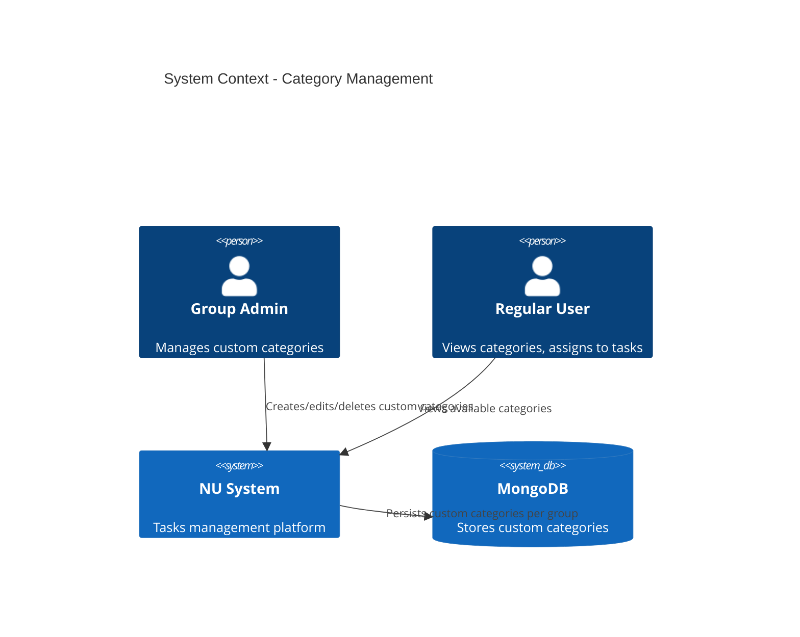
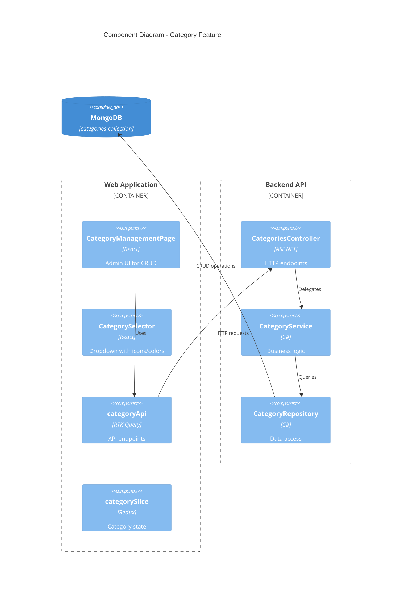

# Technical Design: Category Management (FR-003)

**Document Version:** 1.0  
**Last Updated:** December 15, 2025  
**Mode:** Feature Enhancement  
**PRD Reference:** [docs/prd.md](prd.md#fr-003-category-management)  
**Repository:** my-tasks-tracker-app

---

## 1. Executive Summary

**Business Value:**
- Structured task organization through predefined and custom categories
- Improved task filtering and reporting by category
- Group-specific customization while maintaining system defaults
- Visual identification through icons and colors

**High-Level Approach:**
- 10 system-provided default categories (immutable)
- Group-specific custom categories (admin-managed)
- Icon picker and color palette for visual customization
- Prevent deletion of categories with assigned tasks
- MongoDB collection with composite indexing (groupId + name)
- Thin wrapper around existing repository pattern

**Key Decisions:**
- **System categories are global constants** (no DB entries) for performance
- **Custom categories stored per group** with `groupId` reference
- **Soft validation on delete:** Check task count before allowing removal
- **Icon library:** Use Heroicons for consistency with existing UI
- **Color palette:** Predefined Tailwind colors to ensure accessibility
- **No category hierarchy:** Keep flat structure for MVP simplicity

---

## 2. Requirements Summary

### Functional Requirements (from PRD FR-003)
- **FR-003.1:** 10 system default categories: House, Yard, Pets, Studies, Work, Vehicle, Finance, Shopping, Health, Other
- **FR-003.2:** Each category has icon (Heroicon name) and color (Tailwind class)
- **FR-003.3:** Admin can create custom categories for their group
- **FR-003.4:** Admin can edit/delete custom categories if no tasks assigned
- **FR-003.5:** Categories are group-specific (scoped to groupId)

### Non-Functional Requirements
- **Performance:** Category list retrieval <50ms (cached in RTK Query for 10 minutes)
- **Validation:** Unique category names within a group (case-insensitive)
- **Security:** Only group admins can create/edit/delete custom categories
- **Scalability:** Support up to 50 custom categories per group
- **UX:** Instant feedback on delete conflicts (task count display)

### Acceptance Criteria
- System categories always visible to all users
- Admin can create custom category with unique name, icon, and color
- Attempting to delete category with tasks shows error with task count
- Category list combines system + custom categories, sorted by name
- Category selection dropdown shows icon and color preview

### Constraints
- No category hierarchy (parent/child relationships) in MVP
- Cannot modify or delete system categories
- Custom category names must be 2-50 characters
- Maximum 50 custom categories per group

### Assumptions
- **Assume:** Heroicons library already included in frontend (verified: Yes)
- **Assume:** Task entity has `categoryId` field (check existing schema)
- **Inferred:** Category deletion requires zero associated tasks
- **Inferred:** Category updates only affect future task assignments (existing tasks retain old category)

---

## 3. Current Architecture

### Existing Components (Relevant)
| Component | Responsibility | Status |
|-----------|---------------|--------|
| `GroupService` | Manages group CRUD operations | ✅ Exists |
| `GroupRepository` | MongoDB operations for groups | ✅ Exists |
| `groupSlice` (Redux) | Client-side group state | ✅ Exists |
| `groupApi` (RTK Query) | API endpoints for groups | ✅ Exists |
| `BaseRepository<T>` | Generic MongoDB repository | ✅ Exists |

### Integration Points
- **Task Creation Flow:** Task form must include category selection dropdown
- **Task Library:** Templates can have default category associations
- **Workload Dashboard:** Filter tasks by category for reporting
- **Group Dashboard:** Display category-wise task distribution

### Gaps in Current Design
- No `Category` entity or repository yet
- No category endpoints in backend API
- No category management UI components
- Task entity may need `categoryId` field (validation required)

---

## 4. Proposed Architecture

### 4.1 System Context (C4)



### 4.2 Component Diagram



---

## 5. Data Design

### 5.1 MongoDB Schema

**Collection:** `categories`

```json
{
  "_id": "ObjectId",
  "groupId": "ObjectId",
  "name": "Vehicle Maintenance",
  "icon": "wrench-screwdriver",
  "color": "blue-500",
  "isSystemCategory": false,
  "createdAt": "ISODate",
  "createdBy": "ObjectId",
  "schemaVersion": 1
}
```

**Indexes:**
- `groupId + name` (unique, compound) — Ensures unique category names per group
- `groupId + createdAt` — Fast queries for category list

**System Categories (Constants):**
Defined in code, not in DB:

| Name | Icon | Color |
|------|------|-------|
| House | home | orange-500 |
| Yard | scissors | green-600 |
| Pets | paw | amber-500 |
| Studies | academic-cap | purple-600 |
| Work | briefcase | blue-600 |
| Vehicle | truck | gray-700 |
| Finance | currency-dollar | emerald-600 |
| Shopping | shopping-cart | pink-600 |
| Health | heart | red-500 |
| Other | ellipsis-horizontal | slate-500 |

### 5.2 Domain Model

**Category Entity (C#):**
```csharp
public class Category
{
    [BsonId]
    [BsonRepresentation(BsonType.ObjectId)]
    public string Id { get; set; }
    
    [BsonRepresentation(BsonType.ObjectId)]
    public string GroupId { get; set; }
    
    [BsonRequired]
    [BsonElement("name")]
    public string Name { get; set; }
    
    [BsonElement("icon")]
    public string Icon { get; set; }  // Heroicon name
    
    [BsonElement("color")]
    public string Color { get; set; }  // Tailwind class
    
    [BsonElement("isSystemCategory")]
    public bool IsSystemCategory { get; set; } = false;
    
    [BsonElement("createdAt")]
    public DateTime CreatedAt { get; set; } = DateTime.UtcNow;
    
    [BsonElement("createdBy")]
    [BsonRepresentation(BsonType.ObjectId)]
    public string CreatedBy { get; set; }
    
    [BsonElement("schemaVersion")]
    public int SchemaVersion { get; set; } = 1;
}
```

---

## 6. API Design

### 6.1 Endpoints

| Endpoint | Method | Auth | Request | Response | Notes |
|----------|--------|------|---------|----------|-------|
| `/api/categories` | GET | JWT | Query: `groupId` | `CategoryResponse[]` | Returns system + custom categories |
| `/api/categories` | POST | JWT, Admin | `CreateCategoryRequest` | `CategoryResponse` | 201 Created |
| `/api/categories/{id}` | GET | JWT | - | `CategoryResponse` | 200 OK |
| `/api/categories/{id}` | PUT | JWT, Admin | `UpdateCategoryRequest` | `CategoryResponse` | 200 OK |
| `/api/categories/{id}` | DELETE | JWT, Admin | - | 204 No Content | 409 if tasks exist |

### 6.2 DTOs

**CreateCategoryRequest:**
```csharp
public class CreateCategoryRequest
{
    [Required]
    [StringLength(50, MinimumLength = 2)]
    public string Name { get; set; }
    
    [Required]
    public string Icon { get; set; }  // Heroicon name
    
    [Required]
    [RegularExpression(@"^[a-z]+-\d{3}$")]
    public string Color { get; set; }  // e.g., "blue-500"
}
```

**UpdateCategoryRequest:**
```csharp
public class UpdateCategoryRequest
{
    [StringLength(50, MinimumLength = 2)]
    public string? Name { get; set; }
    
    public string? Icon { get; set; }
    
    [RegularExpression(@"^[a-z]+-\d{3}$")]
    public string? Color { get; set; }
}
```

**CategoryResponse:**
```csharp
public class CategoryResponse
{
    public string Id { get; set; }
    public string GroupId { get; set; }
    public string Name { get; set; }
    public string Icon { get; set; }
    public string Color { get; set; }
    public bool IsSystemCategory { get; set; }
    public int TaskCount { get; set; }  // Populated from task query
    public DateTime CreatedAt { get; set; }
}
```

---

## 7. Component Implementation

### 7.1 Backend Components

#### CategoriesController
```csharp
[ApiController]
[Route("api/[controller]")]
[Authorize]
public class CategoriesController(
    ICategoryService categoryService,
    ILogger<CategoriesController> logger) : ControllerBase
{
    [HttpGet]
    public async Task<IActionResult> GetCategories([FromQuery] string groupId)
    {
        var userId = User.FindFirst(ClaimTypes.NameIdentifier)?.Value;
        var categories = await categoryService.GetCategoriesAsync(groupId, userId);
        return Ok(ApiResponse<List<CategoryResponse>>.SuccessResponse(categories));
    }
    
    [HttpPost]
    public async Task<IActionResult> CreateCategory([FromBody] CreateCategoryRequest request)
    {
        // Validation + Admin check in service
        var category = await categoryService.CreateCategoryAsync(request, UserId, GroupId);
        return CreatedAtAction(nameof(GetCategory), new { id = category.Id }, 
            ApiResponse<CategoryResponse>.SuccessResponse(category));
    }
    
    [HttpDelete("{id}")]
    public async Task<IActionResult> DeleteCategory(string id)
    {
        await categoryService.DeleteCategoryAsync(id, UserId);
        return NoContent();
    }
}
```

#### CategoryService
**Key Methods:**
- `GetCategoriesAsync(groupId, userId)` → Combines system + custom categories
- `CreateCategoryAsync(request, userId)` → Validates admin, checks name uniqueness
- `UpdateCategoryAsync(id, request, userId)` → Admin-only, prevents system category edits
- `DeleteCategoryAsync(id, userId)` → Checks task count, throws 409 if > 0
- `GetSystemCategories()` → Returns hardcoded list of 10 system categories

**Validation Logic:**
```csharp
public async Task<CategoryResponse> CreateCategoryAsync(
    CreateCategoryRequest request, string userId, string groupId)
{
    // 1. Verify user is admin of group
    var isAdmin = await groupService.IsUserAdminAsync(groupId, userId);
    if (!isAdmin) throw new UnauthorizedAccessException("Only admins can create categories");
    
    // 2. Check name uniqueness (case-insensitive)
    var exists = await categoryRepository.NameExistsInGroupAsync(groupId, request.Name);
    if (exists) throw new ArgumentException($"Category '{request.Name}' already exists");
    
    // 3. Create and persist
    var category = new Category
    {
        GroupId = groupId,
        Name = request.Name,
        Icon = request.Icon,
        Color = request.Color,
        CreatedBy = userId
    };
    
    await categoryRepository.CreateAsync(category);
    return category.ToResponse(0);  // taskCount = 0 for new category
}
```

#### CategoryRepository
Extends `BaseRepository<Category>` with:
- `GetByGroupAsync(groupId)` → Fetch all custom categories for group
- `NameExistsInGroupAsync(groupId, name, excludeId?)` → Check uniqueness
- `GetTaskCountAsync(categoryId)` → Count associated tasks

---

## 8. Frontend Components

### 8.1 State Management (RTK Query)

**categoryApi.ts:**
```typescript
export const categoryApi = apiSlice.injectEndpoints({
  endpoints: (builder) => ({
    getCategories: builder.query<CategoryResponse[], string>({
      query: (groupId) => `/categories?groupId=${groupId}`,
      providesTags: ['Category'],
      keepUnusedDataFor: 600,  // 10 minutes cache
    }),
    createCategory: builder.mutation<CategoryResponse, CreateCategoryRequest>({
      query: (body) => ({ url: '/categories', method: 'POST', body }),
      invalidatesTags: ['Category'],
    }),
    deleteCategory: builder.mutation<void, string>({
      query: (id) => ({ url: `/categories/${id}`, method: 'DELETE' }),
      invalidatesTags: ['Category'],
    }),
  }),
});
```

### 8.2 UI Components

**CategoryManagementPage.tsx:**
- Table: Name | Icon Preview | Color Badge | Task Count | Actions
- "Create Category" button (admin-only, opens modal)
- Edit icon (inline editing or modal)
- Delete icon (disabled if `taskCount > 0`, tooltip explains why)
- Filter: Show All / System Only / Custom Only

**CategorySelector.tsx:**
- Dropdown with search
- Each option shows: `[Icon] Name` with color badge
- Used in task creation/edit forms
- Groups system categories at top

**CategoryIconPicker.tsx:**
- Grid of Heroicons with search
- Previews selected icon in real-time
- Hardcoded list of ~50 common icons

**CategoryColorPicker.tsx:**
- Palette of 20 predefined Tailwind colors
- Shows color name + hex preview
- Ensures WCAG AA contrast

---

## 9. Testing Strategy

### Unit Tests
**Backend (xUnit + Moq):**
- `CategoryService.CreateCategoryAsync` → Admin check, name uniqueness validation
- `CategoryService.DeleteCategoryAsync` → Task count validation (409 Conflict)
- `CategoryRepository.NameExistsInGroupAsync` → Case-insensitive matching

**Frontend (Vitest + RTL):**
- `CategorySelector` → Renders system + custom categories
- `CategoryManagementPage` → Delete button disabled when `taskCount > 0`
- `CategoryIconPicker` → Search filters icon list

### Integration Tests
- **API Test:** POST `/api/categories` with duplicate name → 400 Bad Request
- **API Test:** DELETE `/api/categories/{id}` with tasks → 409 Conflict
- **E2E Test (Playwright):** Admin creates custom category → appears in task form dropdown

---

## 10. Rollout Plan

### Phase 1: Backend (Sprint 1, 3 days)
- Day 1: Create `Category` entity, repository, indexes
- Day 2: Implement `CategoryService` with validation logic
- Day 3: Add `CategoriesController` with 5 endpoints

### Phase 2: Frontend (Sprint 1, 4 days)
- Day 1: Add `categoryApi` to RTK Query
- Day 2: Build `CategorySelector` component (reusable)
- Day 3: Create `CategoryManagementPage` with CRUD UI
- Day 4: Integrate category selection into task creation flow

### Phase 3: Testing & Refinement (Sprint 2, 2 days)
- Day 1: Write unit + integration tests
- Day 2: QA testing, bug fixes, UX polish

---

## 11. Open Questions

1. **Icon Library:** Confirm Heroicons v2 is installed and version compatible?
2. **Task Entity:** Does `Task` entity already have `categoryId` field, or add migration?
3. **Default Category:** Should tasks created before FR-003 default to "Other" category?
4. **Category Stats:** Should category list show task count by status (pending/completed)?
5. **Bulk Edit:** Allow admins to reassign tasks from one category to another?

---

## 12. Future Enhancements (Post-MVP)

- **Category Groups:** Parent/child hierarchy (e.g., "Home" → "Kitchen", "Bathroom")
- **Custom Icons:** Upload PNG/SVG for custom categories
- **Category Analytics:** Task completion rate by category in reports
- **Favorites:** Users can mark preferred categories for quick access
- **Category Templates:** Pre-configured category sets for different group types (family, office, roommates)

---

**DOCUMENT COMPLETE**
