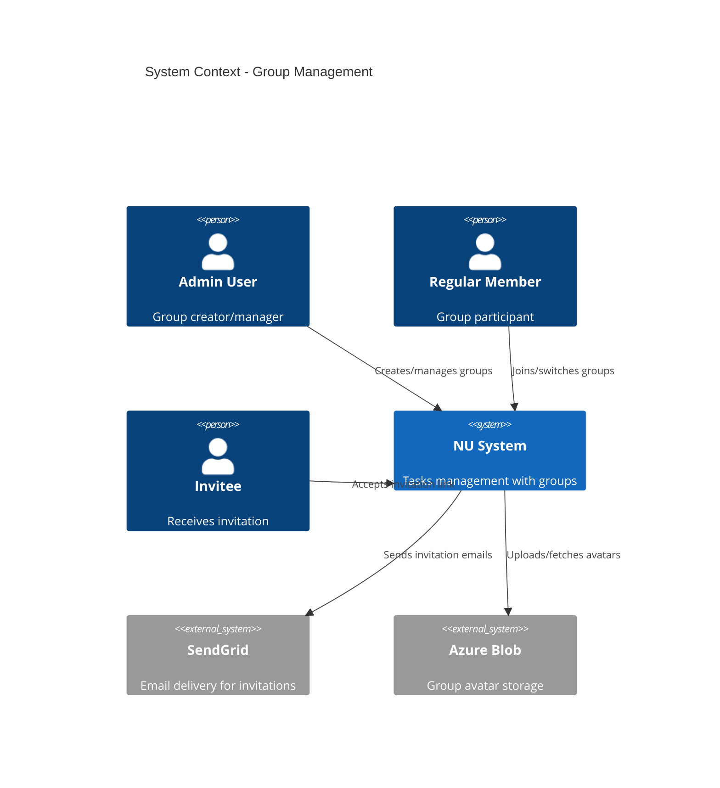
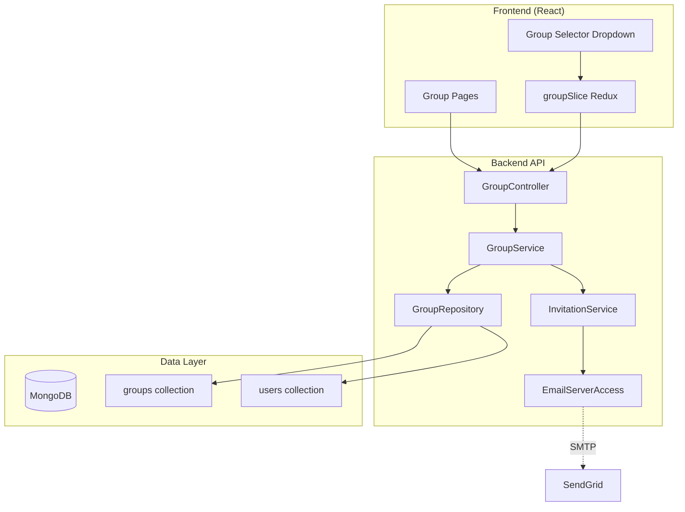
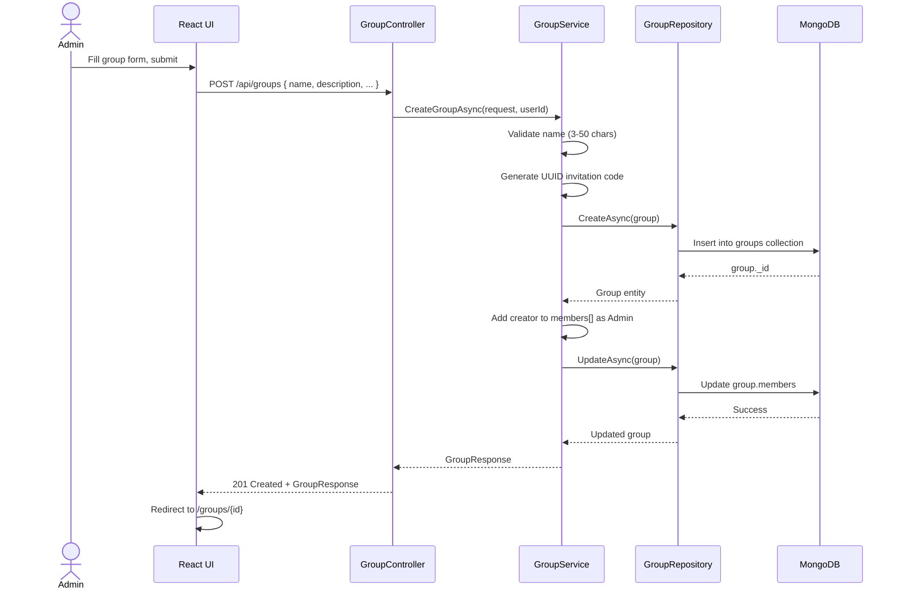
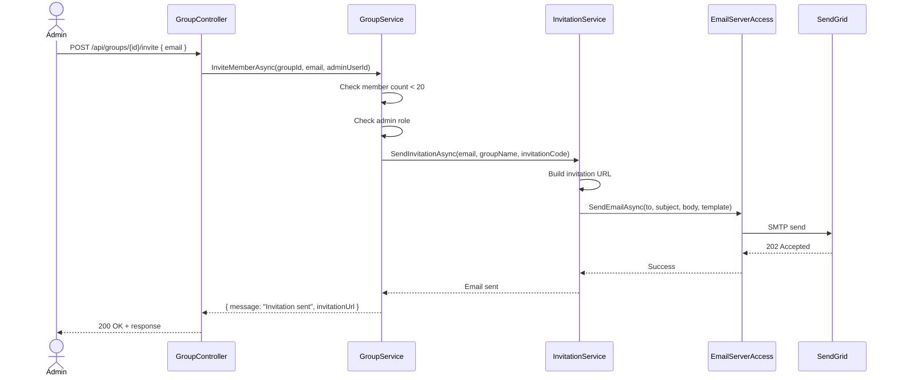
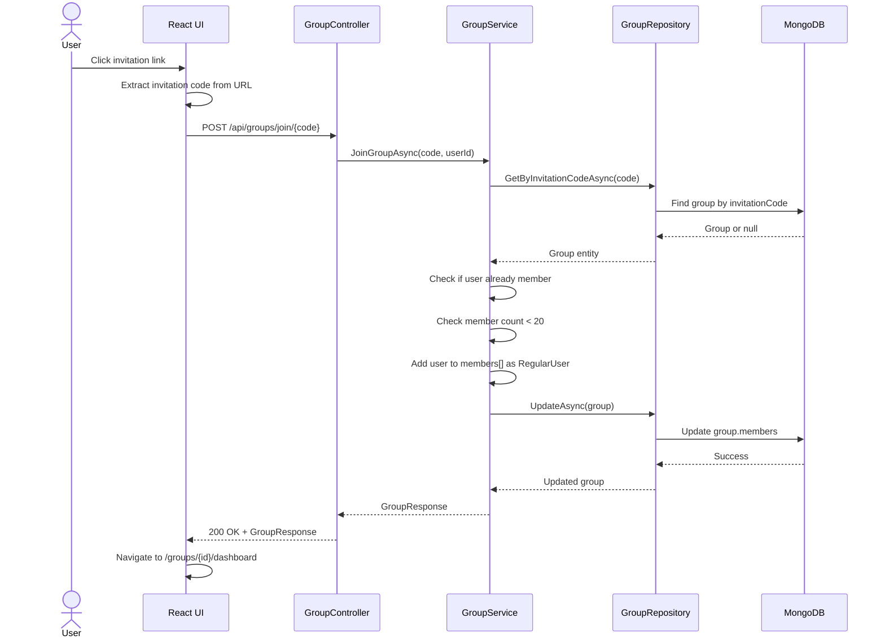

# Technical Design: Group Management

**Document Version:** 1.0  
**Last Updated:** December 15, 2025  
**Mode:** Feature Enhancement  
**PRD Reference:** [docs/prd.md](prd.md) - FR-002  
**Repository:** my-tasks-tracker-app  
**Existing Design:** [docs/design.md](design.md)

---

## 1. Executive Summary

**Business Value:**
- Enables multi-user collaboration (core value proposition)
- Supports up to 20 members per group with role-based access
- Users can participate in multiple groups (family, work, friends)
- Foundation for all collaborative features (tasks, leaderboard, races)

**High-Level Approach:**
- Extend existing auth system with group-based authorization
- Implement invitation system (email + shareable link)
- Store group membership with role (Admin/RegularUser) in MongoDB
- Create Group Management UI in React with role-based controls
- Reuse existing JWT claims for group context

**Key Decisions:**
- **Group ownership:** Creator becomes Admin automatically; can promote others
- **Multi-group support:** Users belong to N groups; switch context via dropdown
- **Invitation strategy:** Email (via SendGrid) + shareable code (UUID-based link)
- **Max members:** Hard limit of 20 enforced at API level
- **Data model:** Embedded members array in Group document (acceptable at scale)
- **Authorization:** Group-scoped JWT claims + per-request membership validation

---

## 2. Requirements Summary (from PRD FR-002)

**Functional Requirements:**
- Create group with name, description, avatar, timezone, language
- Invite members via email or shareable link
- Maximum 20 members per group (hard constraint)
- Admin can promote users to Admin role
- Admin can remove members
- Users can join multiple groups
- Switch active group context via UI dropdown/tabs
- Group-scoped data isolation (tasks, leaderboard visible only to members)

**Non-Functional Requirements:**
- Group creation: <500ms response time
- Invitation delivery: <2s (async email processing acceptable)
- Support 10K+ groups in database
- Group list query: <200ms for user's groups
- Concurrent member operations handled safely (optimistic locking)

**Acceptance Criteria:**
- Admin creates group → becomes owner with Admin role
- Admin invites via email → recipient receives link, clicks, joins group
- Admin invites via link → shares URL, recipient joins without email
- Member limit enforced → 21st invite rejected with clear error
- Admin promotes user → user gains Admin privileges immediately
- Admin removes member → member loses access, data remains for audit
- User switches groups → UI updates to show selected group's data

**Constraints:**
- Max 20 members per group (business rule)
- No group ownership transfer (MVP scope)
- No sub-groups or hierarchies
- Group deletion requires manual intervention (future: cascade delete tasks)

**Assumptions:**
- **Assume:** SendGrid configured for invitation emails
- **Assume:** User already authenticated (JWT in place)
- **Assume:** MongoDB indexing supports efficient group queries
- **Inferred:** Group avatar stored as URL (Azure Blob/S3 reference)
- **Inferred:** Timezone/language used for group-level defaults

---

## 3. Current Architecture (Relevant Components)

| Component | Responsibility | Location |
|-----------|---------------|----------|
| AuthController | User registration, login, JWT generation | `backend/Features/Auth/Controllers/` |
| UserRepository | User CRUD operations | `backend/Infrastructure/Repositories/` |
| JWT Middleware | Token validation, HttpContext.User population | ASP.NET Core pipeline |
| Redux authSlice | Current user state, token storage | `web/src/features/auth/authSlice.ts` |
| apiSlice (RTK Query) | Base API config, auto-refresh | `web/src/app/api/apiSlice.ts` |

**Integration Points:**
- JWT claims currently include: userId, email, roles (Admin/RegularUser)
- MongoDB `users` collection: stores user profile, no group references yet
- Frontend auth state: user object, accessToken, refreshToken

**Gaps/Constraints:**
- No Group entity in database
- No group membership tracking
- JWT claims lack group context
- No invitation system (email or link)
- UI has no group selector component

---

## 4. Proposed Architecture

### 4.1 System Context (C4)



### 4.2 Component Architecture



**New Components:**

| Component | Type | Responsibility |
|-----------|------|---------------|
| GroupController | Controller | HTTP endpoints for group CRUD, invitations, member management |
| GroupService | Service | Business logic: validation, authorization, orchestration |
| InvitationService | Service | Generate codes, send emails, validate invitation links |
| GroupRepository | Repository | MongoDB operations for groups collection |
| EmailServerAccess | ServerAccess | SendGrid integration (reuse/extend existing) |
| GroupSelector | React Component | Dropdown to switch active group context |
| groupSlice | Redux Slice | Current group state, user's groups list |
| groupApi | RTK Query | API endpoints for groups (injected into apiSlice) |

---

## 5. Data Design

### 5.1 MongoDB Schema

**groups Collection:**
```typescript
{
  _id: ObjectId,
  name: string,                    // max 50 chars
  description?: string,            // max 500 chars
  avatarUrl?: string,              // Azure Blob URL
  timezone: string,                // IANA timezone (e.g., "America/New_York")
  language: 'en' | 'he',           // Group default language
  invitationCode: string,          // UUID v4, unique index
  createdBy: ObjectId,             // User ID of creator
  members: [
    {
      userId: ObjectId,            // Reference to users._id
      role: 'Admin' | 'RegularUser',
      joinedAt: Date,
      invitedBy: ObjectId          // User ID who sent invitation
    }
  ],
  settings: {
    maxMembers: 20,                // Hard limit
    requireApproval: boolean       // For task completion (future)
  },
  createdAt: Date,
  updatedAt: Date,
  schemaVersion: 1
}
```

**users Collection (no changes, reference only):**
- Existing fields: `_id`, `email`, `firstName`, `lastName`, `passwordHash`, etc.
- **Note:** No `groups` array in User; query groups via `groups.members.userId`

**Indexes:**
- `groups.invitationCode` (unique)
- `groups.members.userId` (multikey)
- `groups.createdBy`

### 5.2 DTOs (Request/Response Models)

**CreateGroupRequest:**
```csharp
{
  Name: string,           // required, 3-50 chars
  Description?: string,   // optional, max 500 chars
  AvatarUrl?: string,     // optional, valid URL
  Timezone: string,       // required, IANA format
  Language: string        // required, 'en' or 'he'
}
```

**GroupResponse:**
```csharp
{
  Id: string,
  Name: string,
  Description: string,
  AvatarUrl: string,
  Timezone: string,
  Language: string,
  InvitationCode: string,     // Only visible to Admins
  MemberCount: int,
  Members: MemberDto[],        // Full list only for Admins
  MyRole: string,              // 'Admin' or 'RegularUser'
  CreatedAt: DateTime
}
```

**InviteMemberRequest:**
```csharp
{
  Email?: string,              // For email invitation
  InvitationCode?: string      // For shareable link (server validates)
}
```

---

## 6. API Design

### 6.1 Group CRUD Endpoints

| Endpoint | Method | Auth | Request | Response | Notes |
|----------|--------|------|---------|----------|-------|
| `/api/groups` | POST | JWT | CreateGroupRequest | GroupResponse | Creates group, user becomes Admin |
| `/api/groups` | GET | JWT | Query: `page, pageSize` | `{ groups[], total }` | User's groups only |
| `/api/groups/{id}` | GET | JWT | None | GroupResponse | Requires membership |
| `/api/groups/{id}` | PUT | JWT (Admin) | UpdateGroupRequest | GroupResponse | Admin only |
| `/api/groups/{id}` | DELETE | JWT (Admin) | None | 204 No Content | Soft delete (future) |

### 6.2 Invitation Endpoints

| Endpoint | Method | Auth | Request | Response | Notes |
|----------|--------|------|---------|----------|-------|
| `/api/groups/{id}/invite` | POST | JWT (Admin) | `{ email }` | `{ message, invitationUrl }` | Sends email + returns link |
| `/api/groups/join/{code}` | POST | JWT | None | GroupResponse | Join via invitation code |
| `/api/groups/{id}/members/{userId}/promote` | POST | JWT (Admin) | None | 200 OK | Promote to Admin |
| `/api/groups/{id}/members/{userId}` | DELETE | JWT (Admin) | None | 204 No Content | Remove member |

**Authorization Rules:**
- All endpoints require authenticated user (JWT)
- Admin-only endpoints check `members.role == 'Admin'`
- Member removal: cannot remove self if last Admin
- Group access: user must be in `members[]` array

---

## 7. Detailed Flows

### 7.1 Create Group Flow



### 7.2 Invite Member via Email Flow



### 7.3 Join Group via Link Flow



---

## 8. Frontend Implementation

### 8.1 Redux State (groupSlice)

```typescript
interface GroupState {
  currentGroupId: string | null;      // Active group context
  groups: Group[];                    // User's groups list
  currentGroup: Group | null;         // Full details of active group
  loading: boolean;
  error: string | null;
}

// Actions:
setCurrentGroup(groupId)
addGroup(group)
updateGroup(group)
removeGroup(groupId)
```

### 8.2 Key Components

| Component | Location | Purpose |
|-----------|----------|---------|
| GroupSelector | `components/GroupSelector.tsx` | Dropdown to switch active group |
| CreateGroupPage | `features/groups/pages/CreateGroupPage.tsx` | Group creation form |
| GroupDashboard | `features/groups/pages/GroupDashboard.tsx` | Group overview, members list |
| InviteMembersModal | `features/groups/components/InviteMembersModal.tsx` | Email + link invite UI |
| MembersList | `features/groups/components/MembersList.tsx` | Table with role, actions (promote/remove) |

### 8.3 RTK Query API (groupApi)

```typescript
export const groupApi = apiSlice.injectEndpoints({
  endpoints: (builder) => ({
    getMyGroups: builder.query<GroupsResponse, void>(),
    getGroup: builder.query<GroupResponse, string>(),
    createGroup: builder.mutation<GroupResponse, CreateGroupRequest>(),
    inviteMember: builder.mutation<InviteResponse, { groupId: string, email: string }>(),
    joinGroup: builder.mutation<GroupResponse, string>(), // invitation code
    promoteMember: builder.mutation<void, { groupId: string, userId: string }>(),
    removeMember: builder.mutation<void, { groupId: string, userId: string }>(),
  }),
});
```

---

## 9. Security & Authorization

**Authorization Matrix:**

| Action | Admin | Regular Member | Non-Member |
|--------|-------|----------------|------------|
| View group details | ✅ | ✅ | ❌ |
| Invite members | ✅ | ❌ | ❌ |
| Promote members | ✅ | ❌ | ❌ |
| Remove members | ✅ (not self if last Admin) | ❌ | ❌ |
| Update group settings | ✅ | ❌ | ❌ |
| Leave group | ✅ (if not last Admin) | ✅ | N/A |

**Implementation:**
- **Backend:** Middleware checks `groups.members[]` for userId + role
- **Frontend:** Conditional rendering based on `myRole` in GroupResponse
- **Invitation codes:** Single-use validation (check if user already member)

---

## 10. Error Handling

| Scenario | HTTP Status | Error Code | Message |
|----------|-------------|------------|---------|
| Group not found | 404 | GROUP_NOT_FOUND | "Group does not exist" |
| Not a member | 403 | NOT_MEMBER | "You are not a member of this group" |
| Not an admin | 403 | NOT_ADMIN | "This action requires Admin role" |
| Member limit reached | 400 | MEMBER_LIMIT | "Group has reached maximum of 20 members" |
| Invalid invitation code | 400 | INVALID_CODE | "Invitation code is invalid or expired" |
| Already a member | 400 | ALREADY_MEMBER | "You are already a member of this group" |
| Cannot remove self | 400 | CANNOT_REMOVE_SELF | "Cannot remove yourself as the last Admin" |

---

## 11. Testing Strategy

**Unit Tests:**
- GroupService: member limit enforcement, role validation, invitation code generation
- GroupRepository: CRUD operations, query by invitation code
- Redux groupSlice: state updates on actions

**Integration Tests:**
- Create group → user is Admin → invitation code generated
- Invite member → email sent → join via code → member added
- Promote member → role updated → Admin can invite
- Remove member → member cannot access group
- Switch groups → UI displays correct group data

**E2E Tests (Playwright):**
- Full onboarding flow: create group → invite → accept → switch groups

---

## 12. Open Questions & Assumptions

**Open Questions:**
- **Q:** Should invitation codes expire?
  - **A (Assumed):** No expiry for MVP; future: 7-day expiry
- **Q:** Can user decline invitation?
  - **A (Assumed):** Ignore link = decline; no explicit reject action
- **Q:** What happens to tasks when member removed?
  - **A (Assumed):** Tasks remain assigned; future: reassign or unassign

**Assumptions Recap:**
- SendGrid configured with API key in appsettings.json
- Avatar upload handled separately (not in group creation flow)
- Group deletion not implemented in MVP
- No audit log for member actions (future enhancement)

---

## 13. Success Metrics

- Group creation success rate: >95%
- Invitation acceptance rate: >70% within 48 hours
- Average groups per user: 2-3
- Member limit never exceeded (100% enforcement)
- Group switching latency: <100ms (frontend state update)

---

**Document Status:** ✅ Complete  
**Next Steps:** Review → Implement → Test → Deploy
