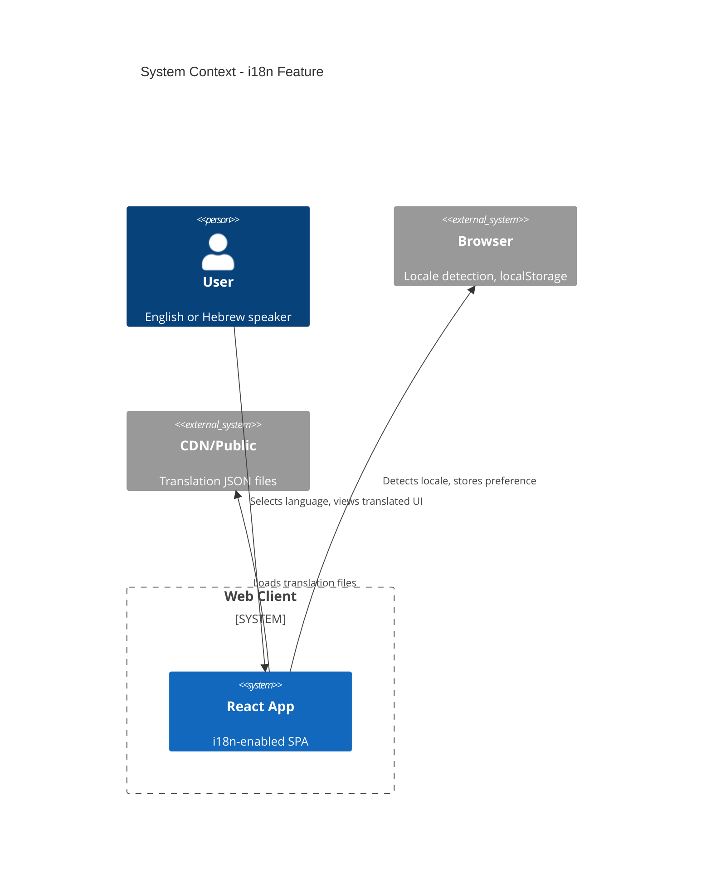
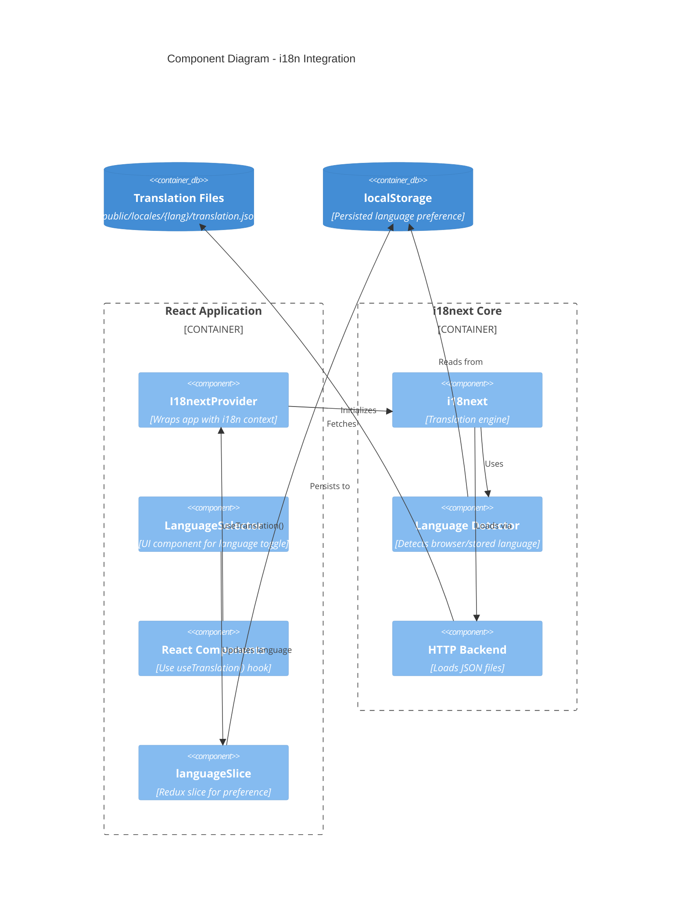
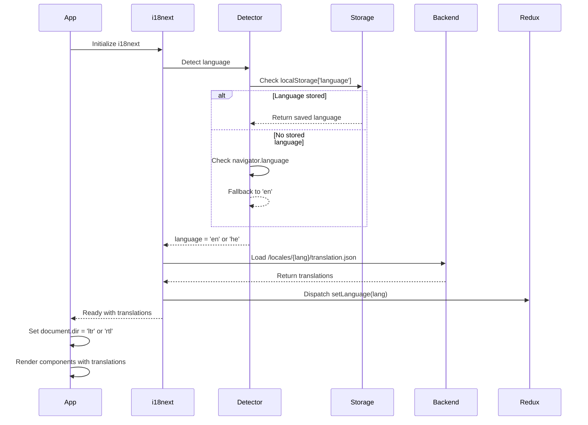
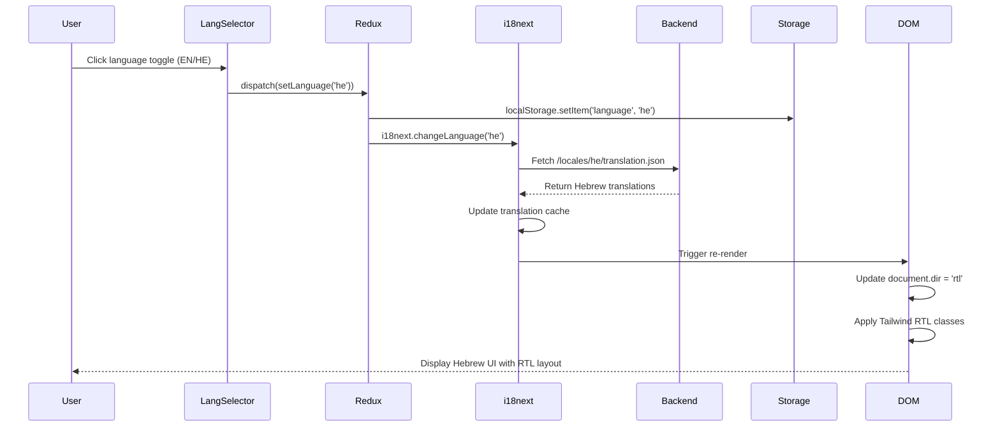

# Technical Design: Internationalization (i18n) & RTL Support

**Document Version:** 1.0  
**Last Updated:** December 14, 2025  
**Mode:** Feature Enhancement  
**Repository:** my-tasks-tracker-app  
**Target:** Web Client (React + TypeScript)

---

## 1. Executive Summary

**Business Value:**
- Enable global user base access in native languages (English, Hebrew initially)
- Improve user experience and adoption in Hebrew-speaking markets
- Establish foundation for future language expansion
- Comply with accessibility standards for RTL language support

**High-Level Approach:**
- Integrate react-i18next library for translation management
- Implement key-based translation system with JSON resource files
- Add RTL/LTR layout detection and automatic switching
- Integrate with Redux for persistent language preference
- Support dynamic language switching without page reload

**Key Decisions:**
- **Library:** react-i18next (most popular, Redux-compatible, TypeScript support)
- **Translation Storage:** JSON files per language in `/public/locales/{lang}/translation.json`
- **RTL Strategy:** CSS-in-JS with Tailwind CSS RTL utilities + HTML `dir` attribute
- **Language Detection:** Browser locale → localStorage → fallback to English
- **Namespace Strategy:** Single namespace initially (`translation`) with feature-based keys

---

## 2. Requirements Summary

### Functional Requirements
- **FR-I18N-001:** Support multiple languages (English, Hebrew minimum)
- **FR-I18N-002:** All user-facing text uses translation keys
- **FR-I18N-003:** Dynamic language switching without page reload
- **FR-I18N-004:** Persist user language preference across sessions
- **FR-I18N-005:** Automatic RTL layout for Hebrew, LTR for English
- **FR-I18N-006:** Date/time formatting respects selected locale
- **FR-I18N-007:** Number formatting respects selected locale
- **FR-I18N-008:** Language selector in user settings/navigation

### Non-Functional Requirements
- **Performance:** Translation loading <100ms, no layout shift on language change
- **Developer Experience:** Simple `t('key')` API, TypeScript autocomplete for keys
- **Maintainability:** Centralized translation files, missing key warnings in dev
- **Scalability:** Support addition of new languages without code changes
- **Bundle Size:** Lazy load translation files per language (<50KB per language)

### Acceptance Criteria
- [ ] All hardcoded strings replaced with translation keys
- [ ] Language toggle switches between English and Hebrew
- [ ] Hebrew displays correct RTL layout (right-aligned text, reversed navigation)
- [ ] Language preference persists in localStorage
- [ ] No console errors for missing translations
- [ ] Date/time formatted correctly per locale

### Constraints
- Must work with existing Redux Toolkit + RTK Query architecture
- Must support existing Tailwind CSS styling system
- Must not break existing authentication flows
- Translation files must be version-controlled

### Assumptions
- **Assume:** Professional translators will provide Hebrew translations
- **Assume:** Backend API responses remain in English (translation client-side only)
- **Inferred:** Language preference stored client-side only (no backend API required)
- **Inferred:** Future languages (Arabic, Spanish) will follow same patterns

---

## 3. Current Architecture (Relevant Components)

| Component | Current Responsibility | i18n Integration Point |
|-----------|----------------------|----------------------|
| **Redux Store** | Global state management | Add `language` slice for preference |
| **App.tsx** | Root routing component | Wrap with `I18nextProvider`, set `dir` attribute |
| **Auth Pages** | Login, Register, Profile | Replace all text with `t()` calls |
| **Dashboard** | Main app interface | Replace all text with `t()` calls |
| **Tailwind Config** | Styling utilities | Add RTL variants, directionality plugins |

**Integration Points:**
- Redux store for language persistence
- All React components for text translation
- CSS/Tailwind for layout directionality
- Vite config for translation file loading

**Gaps/Constraints:**
- No existing i18n infrastructure
- Hardcoded strings throughout all components
- No RTL support in current layout
- No locale-aware date/number formatting

---

## 4. Proposed Architecture

### 4.1 System Context (C4)



### 4.2 Component Architecture



### 4.3 Key Design Decisions

| Decision | Rationale | Alternatives Considered |
|----------|-----------|------------------------|
| **react-i18next** | Industry standard, 10M+ downloads/month, excellent TypeScript support | react-intl (more complex), custom solution (reinventing wheel) |
| **JSON translation files** | Simple, version-controlled, standard format | Database storage (overkill), YAML (less standard) |
| **Single namespace** | Simpler initially, clear key structure (`auth.login.title`) | Multiple namespaces (premature optimization) |
| **Client-side only** | Faster implementation, simpler architecture | Server-side rendering (not needed with SPA) |
| **Tailwind RTL plugin** | Automatic RTL utility generation | Manual RTL CSS (error-prone) |

---

## 5. Data Flow

### 5.1 Language Detection & Initialization



### 5.2 Language Switching Flow



---

## 6. Implementation Details

### 6.1 File Structure

```
web/
├── public/
│   └── locales/
│       ├── en/
│       │   └── translation.json       # English translations
│       └── he/
│           └── translation.json       # Hebrew translations
├── src/
│   ├── app/
│   │   └── slices/
│   │       └── languageSlice.ts       # Redux slice for language preference
│   ├── i18n/
│   │   ├── config.ts                  # i18next configuration
│   │   └── types.ts                   # TypeScript translation key types
│   ├── components/
│   │   └── LanguageSelector.tsx       # Language toggle component
│   └── hooks/
│       └── useRTL.ts                  # Hook for RTL detection
├── tailwind.config.js                 # Add RTL plugin
└── package.json                       # Add dependencies
```

### 6.2 Translation Key Structure

```json
{
  "common": {
    "appName": "NU Tasks Tracker",
    "loading": "Loading...",
    "error": "Error",
    "save": "Save",
    "cancel": "Cancel"
  },
  "auth": {
    "login": {
      "title": "Sign In",
      "email": "Email Address",
      "password": "Password",
      "submit": "Log In",
      "forgotPassword": "Forgot Password?",
      "noAccount": "Don't have an account?",
      "register": "Register"
    },
    "register": {
      "title": "Create Account",
      "firstName": "First Name",
      "lastName": "Last Name",
      "email": "Email Address",
      "password": "Password",
      "confirmPassword": "Confirm Password",
      "submit": "Create Account",
      "hasAccount": "Already have an account?",
      "login": "Sign In"
    }
  },
  "dashboard": {
    "title": "Dashboard",
    "welcome": "Welcome, {{name}}!",
    "myTasks": "My Tasks",
    "noTasks": "No tasks yet"
  },
  "settings": {
    "title": "Settings",
    "language": "Language",
    "profile": "Profile",
    "logout": "Logout"
  }
}
```

### 6.3 Redux Language Slice

```typescript
// Minimal code example - actual implementation will be complete
interface LanguageState {
  current: 'en' | 'he';
  direction: 'ltr' | 'rtl';
}

const initialState: LanguageState = {
  current: 'en',
  direction: 'ltr'
};

// Reducer handles setLanguage action
// Persisted via redux-persist
```

### 6.4 RTL Support Strategy

**Tailwind CSS Configuration:**
- Add `tailwindcss-rtl` plugin
- Enable `rtl:` variant prefix for utilities
- Example: `ml-4 rtl:mr-4` (margin-left becomes margin-right in RTL)

**HTML Direction Attribute:**
- Set `<html dir="ltr">` or `<html dir="rtl">` based on language
- Updated in `App.tsx` via `useEffect` on language change

**Component-Level RTL:**
- Use `useRTL()` custom hook to detect direction
- Conditional class application: `className={isRTL ? 'text-right' : 'text-left'}`

---

## 7. Dependencies

**New npm Packages:**
- `react-i18next` (^14.0.0) - React bindings for i18next
- `i18next` (^23.7.0) - Core i18n framework
- `i18next-http-backend` (^2.4.0) - Load translations via HTTP
- `i18next-browser-languagedetector` (^7.2.0) - Detect user language
- `tailwindcss-rtl` (^0.9.0) - RTL utilities for Tailwind

**Bundle Impact:**
- Base i18n libraries: ~25KB gzipped
- Translation files: ~15-20KB per language (lazy loaded)
- Total initial bundle increase: ~25KB

---

## 8. Migration Strategy

**Phase 1: Foundation (Sprint 1)**
1. Install dependencies
2. Configure i18next in `/src/i18n/config.ts`
3. Create English translation file (extract all existing strings)
4. Wrap App.tsx with I18nextProvider
5. Add Redux language slice
6. Configure Tailwind RTL plugin

**Phase 2: Component Migration (Sprint 2)**
1. Replace hardcoded strings in Auth pages (Login, Register, Profile)
2. Replace hardcoded strings in Dashboard
3. Add LanguageSelector component to navigation
4. Test language switching

**Phase 3: Hebrew Translation & RTL (Sprint 3)**
1. Professional translation of English → Hebrew
2. Test RTL layout, fix spacing/alignment issues
3. Add RTL-specific styling where needed
4. Test date/time formatting

**Phase 4: Polish (Sprint 4)**
1. Add missing translation keys
2. TypeScript strict typing for translation keys
3. Add developer warnings for missing translations
4. Performance optimization (lazy loading)

---

## 9. Testing Strategy

**Unit Tests:**
- Test `useTranslation()` hook returns correct translations
- Test `languageSlice` reducer updates state correctly
- Test `useRTL()` hook detects direction

**Integration Tests:**
- Test language switching updates all text
- Test RTL layout applies correctly
- Test localStorage persistence

**Manual Testing Checklist:**
- [ ] All pages display English correctly
- [ ] Language toggle switches to Hebrew
- [ ] Hebrew text is right-aligned
- [ ] Navigation menu reverses in RTL
- [ ] Forms display correctly in RTL
- [ ] Language persists after page refresh
- [ ] No missing translation warnings

---

## 10. Open Questions & Risks

**Open Questions:**
1. Do we need to translate error messages from backend API?
2. Should we support more languages (Arabic, Spanish) in initial release?
3. Do we need professional translation service integration (e.g., Localize.js)?

**Risks:**
| Risk | Impact | Mitigation |
|------|--------|------------|
| Missing translations | High | Fallback to English, dev warnings |
| RTL layout bugs | Medium | Thorough testing, Tailwind RTL utilities |
| Bundle size increase | Low | Lazy load translations, code splitting |
| Developer adoption | Medium | Clear documentation, simple API |

---

## 11. Future Enhancements

- **Translation Management UI:** Admin panel for translators
- **Pluralization Rules:** Smart plural handling per language
- **Interpolation:** Dynamic values in translations (already supported by i18next)
- **Gender-Specific Translations:** For languages with grammatical gender
- **Translation Versioning:** Track changes to translation files
- **Automated Translation:** Integration with Google Translate API for draft translations
- **SEO:** Localized meta tags and URLs

---

**Document Status:** COMPLETE  
**Next Steps:** Review with team → Implement Phase 1 → User acceptance testing
