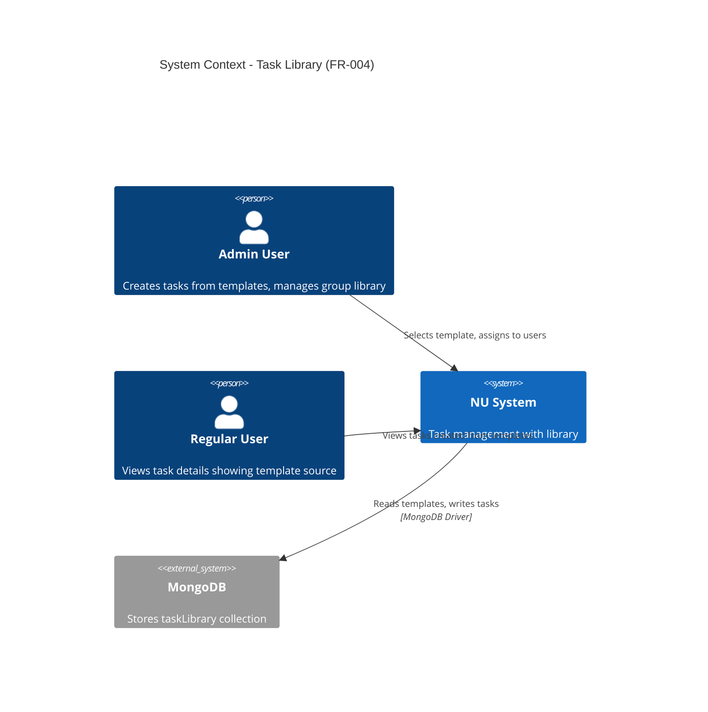
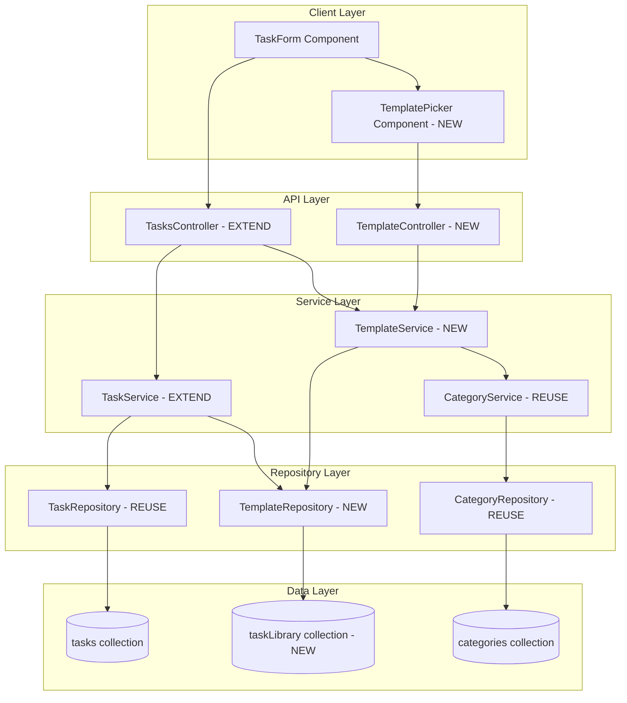
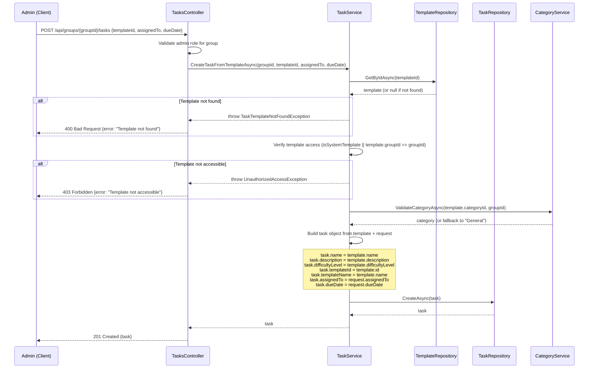
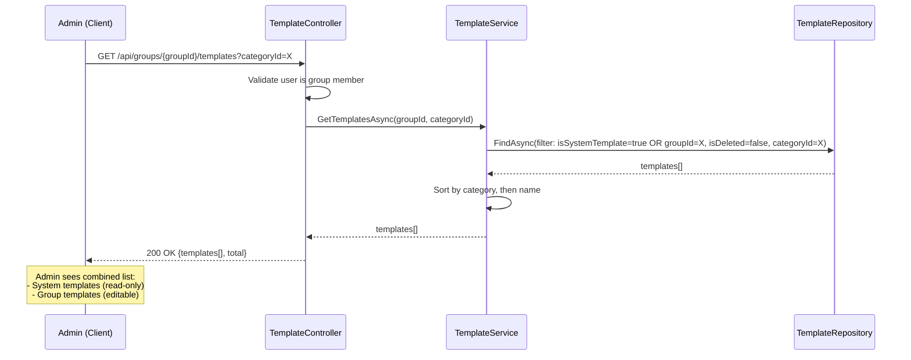
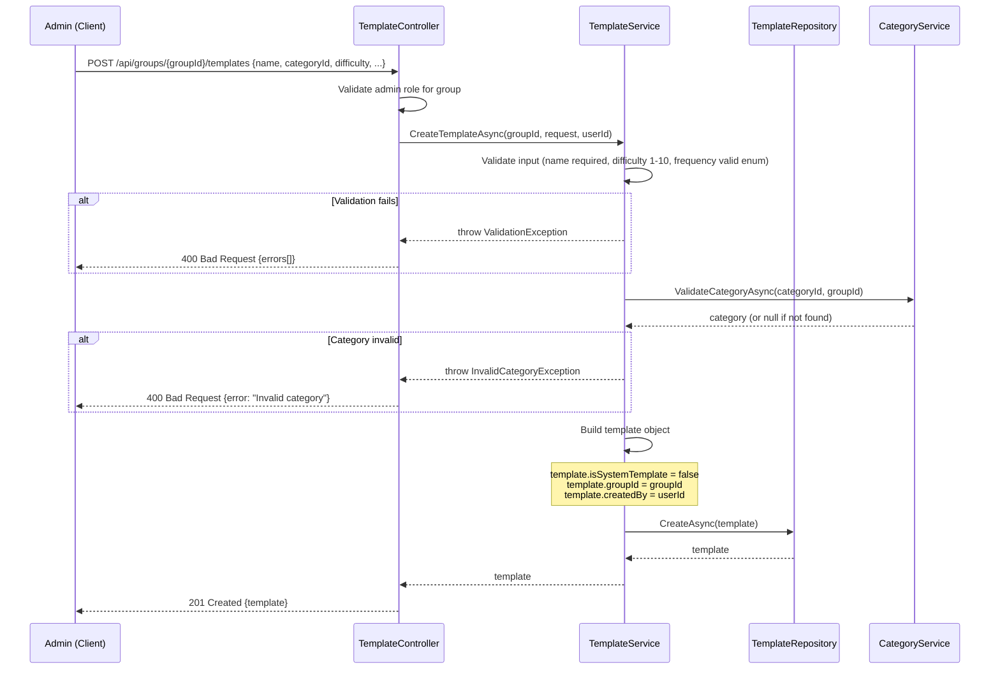

# Technical Design: Task Library (FR-004)

**Document Version:** 1.0  
**Last Updated:** December 15, 2025  
**Mode:** Feature Enhancement  
**PRD Reference:** [docs/prd.md](prd.md#fr-004-task-library)  
**Repository:** my-tasks-tracker-app

---

## 1. Executive Summary

### Business Value
- **Accelerate task creation:** Pre-populated library eliminates repetitive manual input, reducing task setup time by ~70%
- **Standardize tasks:** Consistent naming, categorization, and difficulty scoring across groups improves fairness perception
- **Reduce cognitive load:** Users select from curated templates instead of inventing task definitions from scratch
- **Enable customization:** Groups can extend global library with domain-specific tasks (e.g., "Code Review" for dev teams)

### High-Level Approach
- **Two-tier library system:** Global (system-wide, read-only) + Group-specific (customizable per group)
- **Thin wrapper approach:** Reuse existing `TaskService`, `TaskRepository`, `CategoryService` infrastructure
- **New `TaskTemplate` domain model:** Lightweight entity storing reusable task metadata (name, description, category, difficulty, duration, frequency)
- **Separate collection:** `taskLibrary` collection in MongoDB to avoid confusion with active `tasks` collection
- **"Create from Template" workflow:** Single endpoint converts template → assigned task, preserving traceability via `templateId` field

### Key Decisions
- **Decision:** Use separate `taskLibrary` collection instead of `tasks.isTemplate` flag  
  **Rationale:** Clearer separation of concerns; templates never have assignees/deadlines; avoids complex filtering in task queries
  
- **Decision:** Store `isSystemTemplate` boolean instead of separate global/group collections  
  **Rationale:** Single schema/repository reduces code duplication; simple filter for system vs. group templates
  
- **Decision:** Admin-only template creation, user request workflow deferred to Phase 2  
  **Rationale:** MVP focuses on core library functionality; user-requested templates add approval/moderation complexity
  
- **Decision:** No versioning or revision history for templates in MVP  
  **Rationale:** Templates are lightweight; groups can duplicate and modify instead of editing shared templates
  
- **Decision:** Default category to "General" if referenced category deleted  
  **Rationale:** Prevents broken references; allows template reuse across groups with different category sets

---

## 2. Requirements Summary (from PRD)

### Functional Requirements
- **FR-004.1:** Global task library with predefined templates (name, category, description, difficulty 1-10, default frequency, duration)
- **FR-004.2:** Admin can add custom templates to group-specific library
- **FR-004.3:** Templates include: name (required), category (optional), description (optional), difficulty (1-10), duration estimate (minutes), default frequency (one-time/daily/weekly/monthly)
- **FR-004.4:** Admin can create tasks directly from templates (one-click instantiation)
- **FR-004.5:** Templates visible across all groups (global) or within specific group (group-scoped)
- **FR-004.6:** Admin can edit/delete group-specific templates (system templates read-only)

### Non-Functional Requirements
- **Performance:** Template list load <100ms for 500 templates (typical library size)
- **Scalability:** Support 1000+ global templates + 100 per-group templates without degradation
- **Usability:** Template search/filter by category, difficulty, frequency in <50ms
- **Consistency:** Template data schema matches task creation form fields for seamless conversion
- **i18n:** Template names/descriptions localized for English and Hebrew

### Acceptance Criteria
- **AC-1:** Admin can view combined list of global + group templates sorted by category
- **AC-2:** Admin can create new task from template in ≤2 clicks (select template → assign user/date → create)
- **AC-3:** Template includes all task metadata except assignee/deadline
- **AC-4:** Admin can create custom group template with same fields as task creation
- **AC-5:** Admin can edit group templates without affecting tasks created from that template
- **AC-6:** Users see "Created from template: [Name]" in task details (audit trail)

### Constraints
- System templates managed via data migration/seed scripts (no admin UI for global library in MVP)
- Templates do not support task dependencies, subtasks, or attachments (future phases)
- No template sharing between groups (each group maintains isolated custom library)
- Template deletion soft-deletes (preserves `templateId` references in existing tasks)

### Assumptions
- **Assume:** Initial seed includes 50-100 common household/business templates (e.g., "Clean Kitchen," "Weekly Report")
- **Assume:** Category associations optional; templates can be uncategorized or mapped to categories dynamically
- **Inferred:** Template frequency defaults used as suggestions; admin overrides when creating task
- **Inferred:** Photo proof requirement not stored in template (determined at task creation time)

---

## 3. Current Architecture (Relevant Components)

### Existing Components

| Component | Responsibility | Relevance to Task Library |
|-----------|---------------|---------------------------|
| `TaskService` | CRUD for assigned tasks, status transitions, approval workflow | Reuse for "create from template" logic |
| `TaskRepository` | MongoDB access for `tasks` collection | Extend pattern for `taskLibrary` collection |
| `CategoryService` | Manage task categories (global + group-scoped) | Validate template category associations |
| `GroupService` | Group membership, role authorization | Verify admin permissions for template management |
| `Category` domain model | `_id`, `name`, `icon`, `color`, `isSystemCategory`, `groupId` | Link templates to categories via `categoryId` |

### Integration Points
- **Task Creation Flow:** Current `POST /api/groups/{groupId}/tasks` endpoint accepts manual input; extend to accept optional `templateId` parameter
- **Category Validation:** Existing `CategoryService.ValidateCategoryAccess()` ensures user can only assign tasks to valid categories; reuse for templates
- **Authorization:** Existing `[Authorize]` + `GroupRole.Admin` filters apply to template endpoints
- **Frontend:** Existing `TaskForm` component in `web/src/features/tasks/` can be enhanced with template selector dropdown

### Gaps/Constraints in Current Design
- **No reusable task metadata storage:** Current `Task` model couples assignment details (assignedTo, dueDate) with task definition (name, difficulty)
- **Repetitive admin input:** Admins recreate identical task definitions multiple times (e.g., "Clean Kitchen" task entered weekly)
- **Inconsistent difficulty scoring:** Different admins assign varying difficulty values to same task type, causing fairness complaints
- **Missing template seeding:** No infrastructure for loading predefined templates at startup

---

## 4. Proposed Architecture

### 4.1 System Context (C4)



### 4.2 Component Diagram



### 4.3 Data Model Changes

#### New: TaskTemplate Domain Model

```csharp
public class TaskTemplate
{
    [BsonId]
    [BsonRepresentation(BsonType.ObjectId)]
    public string Id { get; set; } = string.Empty;
    
    public string Name { get; set; } = string.Empty; // Required, max 100 chars
    public string? Description { get; set; } // Optional, max 500 chars
    
    [BsonRepresentation(BsonType.ObjectId)]
    public string? CategoryId { get; set; } // Optional link to Category
    
    public int DifficultyLevel { get; set; } // 1-10 scale
    public int? EstimatedDurationMinutes { get; set; } // Optional, e.g., 30
    public string DefaultFrequency { get; set; } = "OneTime"; // OneTime, Daily, Weekly, etc.
    
    public bool IsSystemTemplate { get; set; } // true = global, false = group-specific
    
    [BsonRepresentation(BsonType.ObjectId)]
    public string? GroupId { get; set; } // null if IsSystemTemplate=true
    
    public DateTime CreatedAt { get; set; } = DateTime.UtcNow;
    public DateTime? UpdatedAt { get; set; }
    
    [BsonRepresentation(BsonType.ObjectId)]
    public string CreatedBy { get; set; } = string.Empty; // UserId
    
    public bool IsDeleted { get; set; } = false; // Soft delete
    public DateTime? DeletedAt { get; set; }
    
    // i18n support (future phase)
    public Dictionary<string, string>? LocalizedNames { get; set; } // { "en": "Clean Kitchen", "he": "ניקוי מטבח" }
    public Dictionary<string, string>? LocalizedDescriptions { get; set; }
}
```

#### Extended: Task Domain Model

```csharp
public class Task
{
    // ... existing fields ...
    
    [BsonRepresentation(BsonType.ObjectId)]
    public string? TemplateId { get; set; } // NEW: link to TaskTemplate if created from template
    
    public string? TemplateName { get; set; } // NEW: snapshot of template name at creation (audit trail)
}
```

#### MongoDB Collection: `taskLibrary`

**Indexes:**
- `{ GroupId: 1, IsSystemTemplate: 1, IsDeleted: 1 }` – List group + global templates
- `{ CategoryId: 1, IsDeleted: 1 }` – Filter by category
- `{ Name: "text" }` – Text search (future phase)

**Sample Document:**
```json
{
  "_id": "674a1b2c3d4e5f6a7b8c9d0e",
  "name": "Clean Kitchen",
  "description": "Wash dishes, wipe counters, sweep floor, take out trash",
  "categoryId": "674a0001a2b3c4d5e6f7a8b9",
  "difficultyLevel": 3,
  "estimatedDurationMinutes": 30,
  "defaultFrequency": "Daily",
  "isSystemTemplate": true,
  "groupId": null,
  "createdAt": "2025-12-01T00:00:00Z",
  "createdBy": "system",
  "isDeleted": false
}
```

---

## 5. API Design

### 5.1 New Endpoints: Task Templates

| Endpoint | Method | Auth | Request | Response | Notes |
|----------|--------|------|---------|----------|-------|
| `/api/groups/{groupId}/templates` | GET | JWT | Query: `categoryId?, difficulty?, frequency?` | `{templates[], total}` | Returns global + group templates |
| `/api/groups/{groupId}/templates` | POST | JWT (Admin) | `{name, description?, categoryId?, difficulty, duration?, frequency}` | `{template}` | 201 Created, group-specific |
| `/api/groups/{groupId}/templates/{id}` | GET | JWT | None | `{template}` | 200 OK or 404 |
| `/api/groups/{groupId}/templates/{id}` | PUT | JWT (Admin) | `{name, description?, ...}` | `{template}` | 200 OK, group templates only |
| `/api/groups/{groupId}/templates/{id}` | DELETE | JWT (Admin) | None | `{message}` | 204 No Content, soft delete |

**Example Request: Create Group Template**
```json
POST /api/groups/674a1234567890abcdef1234/templates
Authorization: Bearer <JWT>

{
  "name": "Code Review",
  "description": "Review pull requests and provide feedback",
  "categoryId": "674a5678901234567890abcd",
  "difficultyLevel": 5,
  "estimatedDurationMinutes": 45,
  "defaultFrequency": "Daily"
}
```

**Example Response:**
```json
201 Created
{
  "id": "674b9876543210fedcba0987",
  "name": "Code Review",
  "description": "Review pull requests and provide feedback",
  "categoryId": "674a5678901234567890abcd",
  "difficultyLevel": 5,
  "estimatedDurationMinutes": 45,
  "defaultFrequency": "Daily",
  "isSystemTemplate": false,
  "groupId": "674a1234567890abcdef1234",
  "createdAt": "2025-12-15T10:30:00Z"
}
```

### 5.2 Extended Endpoint: Create Task from Template

**Extend existing:** `POST /api/groups/{groupId}/tasks`

**New Optional Parameter:** `templateId`

**Example Request:**
```json
POST /api/groups/674a1234567890abcdef1234/tasks
Authorization: Bearer <JWT>

{
  "templateId": "674a1b2c3d4e5f6a7b8c9d0e",
  "assignedTo": "674a9999888877776666555",
  "dueDate": "2025-12-16T18:00:00Z",
  "frequency": "Daily" // Overrides template default if needed
}
```

**Backend Logic:**
1. Validate `templateId` exists and is accessible (global or group-scoped)
2. Load template data (name, description, categoryId, difficulty, frequency)
3. Merge with request data (assignedTo, dueDate override frequency if provided)
4. Create task with `templateId` and `templateName` fields populated
5. Return task object

**Fallback Behavior:** If `templateId` invalid/deleted, return `400 Bad Request: "Template not found"`

---

## 6. Sequence Diagrams

### 6.1 Admin Creates Task from Template



### 6.2 Admin Views Available Templates



### 6.3 Admin Creates Custom Group Template



---

## 7. Implementation Plan

### Phase 1: Backend Foundation (Days 1-2)
1. **Domain Model:** Create `TaskTemplate.cs` in `Core/Domain/`
2. **Repository:** Create `TemplateRepository.cs` in `Infrastructure/Repositories/`
   - Inherit from `BaseRepository<TaskTemplate>`
   - Add `GetTemplatesForGroupAsync(groupId)` method (returns system + group templates)
3. **Service:** Create `TemplateService.cs` in `Features/Tasks/Services/`
   - CRUD operations: Create, Update, Delete (soft), GetById, List
   - Validation: name required, difficulty 1-10, frequency enum check
   - Access control: system templates read-only, group templates require admin
4. **Controller:** Create `TemplateController.cs` in `Features/Tasks/Controllers/`
   - 5 endpoints: GET list, GET by ID, POST create, PUT update, DELETE
   - Apply `[Authorize]` and admin role checks

### Phase 2: Task Integration (Day 3)
1. **Extend Task Model:** Add `TemplateId` and `TemplateName` fields to `Task.cs`
2. **Extend TaskService:** Modify `CreateTaskAsync()` to accept optional `templateId`
   - If provided, load template and populate task fields
   - Handle template not found / not accessible errors
3. **Update TasksController:** Modify `POST /api/groups/{groupId}/tasks` to accept `templateId` parameter
4. **Database Migration:** Run script to add indexes to `taskLibrary` collection

### Phase 3: Data Seeding (Day 4)
1. **Seed Script:** Create `SeedTaskTemplates.cs` utility class
   - Load 50-100 predefined templates from JSON/CSV file
   - Categories: Household, Business, Personal, Fitness, etc.
   - Run on application startup if `taskLibrary` collection empty
2. **Localization:** Add English names/descriptions (Hebrew in future phase)

### Phase 4: Frontend Implementation (Days 5-6)
1. **Component:** Create `TemplatePicker.tsx` in `web/src/features/tasks/components/`
   - Dropdown showing template list with category grouping
   - Search/filter by name, category, difficulty
2. **API Integration:** Add RTK Query endpoints for templates in `web/src/app/api/templatesApi.ts`
   - `useGetTemplatesQuery(groupId)`
   - `useCreateTemplateMutation()`
3. **Extend TaskForm:** Add "Create from Template" toggle
   - When enabled, show `TemplatePicker`
   - Pre-fill form fields when template selected
4. **Admin UI:** Add "Manage Templates" page for group admins
   - List group templates with edit/delete actions
   - "Add Custom Template" button

### Phase 5: Testing & Documentation (Day 7)
1. **Unit Tests:** `TemplateService`, `TemplateRepository` (xUnit)
   - Test system vs. group template filtering
   - Test soft delete behavior
2. **Integration Tests:** Template CRUD endpoints, task creation from template
3. **Update API Docs:** Add template endpoints to OpenAPI spec
4. **User Guide:** Document template workflow in `docs/user-guide-templates.md`

---

## 8. Testing Strategy

### Unit Tests (xUnit)

**TemplateService Tests:**
- `CreateTemplate_WithValidData_ReturnsTemplate()`
- `CreateTemplate_WithInvalidDifficulty_ThrowsValidationException()`
- `CreateTemplate_WithNonExistentCategory_ThrowsException()`
- `GetTemplatesForGroup_ReturnsSystemAndGroupTemplates()`
- `UpdateTemplate_SystemTemplate_ThrowsUnauthorizedException()`
- `DeleteTemplate_SoftDeletesTemplate()`

**TaskService Tests (Extended):**
- `CreateTask_FromTemplate_PopulatesFieldsCorrectly()`
- `CreateTask_WithInvalidTemplateId_ThrowsNotFoundException()`
- `CreateTask_WithInaccessibleTemplate_ThrowsForbiddenException()`

### Integration Tests (TasksTracker.Api.IntegrationTests)

**Template Endpoints:**
- `GET_Templates_AsAdmin_Returns_System_And_Group_Templates`
- `POST_Template_AsAdmin_Creates_Group_Template`
- `POST_Template_AsRegularUser_Returns_403_Forbidden`
- `PUT_Template_SystemTemplate_Returns_403_Forbidden`
- `DELETE_Template_GroupTemplate_Soft_Deletes`

**Task Creation from Template:**
- `POST_Task_WithTemplateId_Creates_Task_With_Template_Data`
- `POST_Task_WithInvalidTemplateId_Returns_400_BadRequest`
- `POST_Task_OverridesTemplateFrequency_When_Specified`

### Frontend Tests (Vitest)

**TemplatePicker Component:**
- `renders template list grouped by category`
- `filters templates by difficulty level`
- `emits selected template on click`
- `shows "No templates found" when list empty`

**TaskForm Component (Extended):**
- `pre-fills form when template selected`
- `allows manual override of template fields`
- `clears form when "Create from Template" toggled off`

---

## 9. Error Handling & Edge Cases

### Error Scenarios

| Scenario | HTTP Code | Error Code | Message | Mitigation |
|----------|-----------|------------|---------|------------|
| Template not found | 404 | `TEMPLATE_NOT_FOUND` | "Task template does not exist" | Validate `templateId` before task creation |
| Template not accessible | 403 | `TEMPLATE_ACCESS_DENIED` | "You do not have access to this template" | Check `isSystemTemplate` or `groupId` match |
| Invalid difficulty level | 400 | `VALIDATION_ERROR` | "Difficulty must be between 1 and 10" | Client-side + server-side validation |
| Category deleted | 200 | N/A | Task created with "General" category | Fallback to default category |
| Duplicate template name | 400 | `DUPLICATE_TEMPLATE` | "A template with this name already exists" | Check uniqueness within group scope |
| System template edit attempt | 403 | `SYSTEM_TEMPLATE_READONLY` | "System templates cannot be modified" | Check `isSystemTemplate` flag |
| Template used by active tasks | 200 | N/A | Soft delete, tasks retain `templateName` | Preserve audit trail via snapshot |

### Edge Cases

1. **Template deleted after task creation:** Task retains `templateName` field (snapshot); `templateId` reference still valid but template marked `isDeleted`
2. **Category deleted after template created:** Template `categoryId` becomes stale; task creation falls back to "General" category
3. **Group dissolved with custom templates:** Templates soft-deleted automatically via cascade delete in `GroupService`
4. **Admin demoted to regular user:** Loses access to edit templates but can still view list
5. **Multiple admins edit same template:** Last write wins (no conflict resolution in MVP)
6. **Template with 0 or 11 difficulty:** Server validation rejects; client UI enforces 1-10 range
7. **Template with invalid frequency enum:** Server validation rejects; client uses dropdown

---

## 10. Future Enhancements (Post-MVP)

### User-Requested Templates
- **Feature:** Regular users can propose new templates for admin approval
- **Workflow:** User submits suggestion → Admin reviews → Approve/reject → Added to group library
- **Schema:** Add `requestedBy` field, `approvalStatus` enum

### Template Versioning
- **Feature:** Track template revisions; allow rollback to previous versions
- **Schema:** Add `versionHistory[]` array with timestamps and changes
- **UI:** Show "Version 2 (updated 3 days ago)" in template list

### Template Sharing Between Groups
- **Feature:** Export/import templates as JSON; share via link
- **Workflow:** Admin exports template → Generates shareable link → Other group imports
- **Consideration:** Privacy concerns with system-wide template marketplace

### Advanced Template Fields
- **Photo Proof Requirement:** Flag indicating task completion requires photo upload
- **Subtasks:** Template includes checklist items (e.g., "Clean Kitchen" → ["Wash dishes", "Wipe counters"])
- **Tags:** Freeform tags for better categorization (e.g., "indoor", "quick", "teamwork")

### Analytics Dashboard
- **Metrics:** Most-used templates, average difficulty distribution, templates with highest completion rates
- **UI:** Admin view showing "Top 10 Templates This Month"

### AI-Generated Templates
- **Feature:** Admin describes task in natural language → AI generates template with suggested difficulty/duration
- **Integration:** OpenAI API call in `TemplateService.GenerateFromDescriptionAsync()`

---

## 11. Dependencies & Risks

### Dependencies
- **MongoDB 4.4+:** Compound indexes for efficient template filtering
- **Existing CategoryService:** Template-category validation relies on category API
- **ASP.NET Core Identity:** Admin role checks for template management authorization

### Risks & Mitigation

| Risk | Impact | Probability | Mitigation |
|------|--------|-------------|------------|
| **Template data migration complexity** | High | Medium | Use versioned seed scripts; test on staging DB first |
| **Category deletion breaks templates** | Medium | High | Fallback to "General" category; warn admin before category delete |
| **Template proliferation (too many custom templates)** | Low | Medium | Add pagination + search; consider 100-template limit per group |
| **i18n translation workload** | Medium | High | Start with English only; crowdsource Hebrew translations Phase 2 |
| **Users confuse templates with tasks** | Medium | Low | Clear UI labels: "Task Library" vs. "Active Tasks" |
| **System template conflicts with group customizations** | Low | Low | System templates immutable; groups create duplicates to customize |

---

## 12. Open Questions

1. **Template Duplication:** Should admin be able to duplicate system templates to customize them, or only create from scratch?  
   **Proposed Answer:** Add "Duplicate" button for system templates → creates group template copy

2. **Template Search:** Should search be full-text (MongoDB text index) or simple case-insensitive substring match?  
   **Proposed Answer:** Start with substring; add full-text search if library exceeds 500 templates

3. **Template Ordering:** Default sort by name, category, or creation date?  
   **Proposed Answer:** Category first (alphabetical), then name within category

4. **Localization Strategy:** Store localized strings in database (`localizedNames`) or use i18n files?  
   **Proposed Answer:** Database for system templates (pre-translated); i18n files for UI labels

5. **Template Preview:** Should admin see preview of task created from template before confirming?  
   **Proposed Answer:** Yes, show modal with pre-filled task form; admin can modify before final submission

---

## 13. Success Metrics

### Usage Metrics
- **Template Adoption Rate:** 60% of tasks created from templates within 1 month of feature launch
- **Custom Template Creation:** 40% of groups create at least 1 custom template within 2 weeks
- **Template Search Usage:** 30% of template selections use search/filter (indicates library size growing)

### Performance Metrics
- **Template List Load Time:** <100ms for 500 templates (P95)
- **Task Creation from Template:** <200ms end-to-end (P95)
- **Database Query Performance:** Template filter queries use indexes, <10ms execution time

### User Satisfaction
- **Reduced Task Creation Time:** 70% decrease in time spent creating repetitive tasks (measured via analytics)
- **Admin Feedback:** "Task library" feature rated 4.5/5 stars in user surveys
- **Support Tickets:** <5 tickets per 100 groups related to template confusion

---

## 14. Appendix

### A. Sample System Templates (Seed Data)

**Household Category:**
- "Clean Kitchen" – Difficulty 3, 30min, Daily
- "Vacuum Living Room" – Difficulty 2, 20min, Weekly
- "Take Out Trash" – Difficulty 1, 5min, Daily
- "Grocery Shopping" – Difficulty 4, 60min, Weekly
- "Laundry" – Difficulty 3, 45min, Bi-weekly

**Business Category:**
- "Code Review" – Difficulty 5, 45min, Daily
- "Weekly Report" – Difficulty 4, 30min, Weekly
- "Team Meeting Prep" – Difficulty 3, 20min, Weekly
- "Email Inbox Zero" – Difficulty 2, 15min, Daily
- "Quarterly Planning" – Difficulty 8, 120min, Quarterly

**Personal Category:**
- "Exercise" – Difficulty 5, 30min, Daily
- "Meal Prep" – Difficulty 4, 60min, Weekly
- "Journal Entry" – Difficulty 1, 10min, Daily
- "Read Book" – Difficulty 2, 30min, Daily

### B. Database Schema Comparison

**Before (Task Model):**
```json
{
  "_id": "...",
  "name": "Clean Kitchen",
  "description": "Wash dishes, wipe counters...",
  "assignedTo": "userId123",
  "dueDate": "2025-12-16T18:00:00Z",
  "difficultyLevel": 3
}
```

**After (Task + Template Models):**

**TaskTemplate:**
```json
{
  "_id": "template123",
  "name": "Clean Kitchen",
  "description": "Wash dishes, wipe counters...",
  "difficultyLevel": 3,
  "isSystemTemplate": true
}
```

**Task (created from template):**
```json
{
  "_id": "task456",
  "templateId": "template123",
  "templateName": "Clean Kitchen",
  "name": "Clean Kitchen",
  "description": "Wash dishes, wipe counters...",
  "assignedTo": "userId123",
  "dueDate": "2025-12-16T18:00:00Z",
  "difficultyLevel": 3
}
```

### C. API Example Sequence (Full Flow)

```bash
# 1. Admin lists available templates
GET /api/groups/674a1234567890abcdef1234/templates
→ Returns system templates + group templates

# 2. Admin creates task from template
POST /api/groups/674a1234567890abcdef1234/tasks
{
  "templateId": "674a1b2c3d4e5f6a7b8c9d0e",
  "assignedTo": "674a9999888877776666555",
  "dueDate": "2025-12-16T18:00:00Z"
}
→ Returns task with templateId and templateName fields

# 3. User views task details
GET /api/tasks/task456
→ Shows "Created from template: Clean Kitchen" in UI
```

### D. Related Documents
- [PRD](prd.md) – Product requirements for FR-004
- [Main Design Document](design.md) – Overall system architecture
- [Category Management Design](design-category-management.md) – Category-template integration
- [Group Management Design](design-group-management.md) – Group-scoped template access

---

**End of Document**
