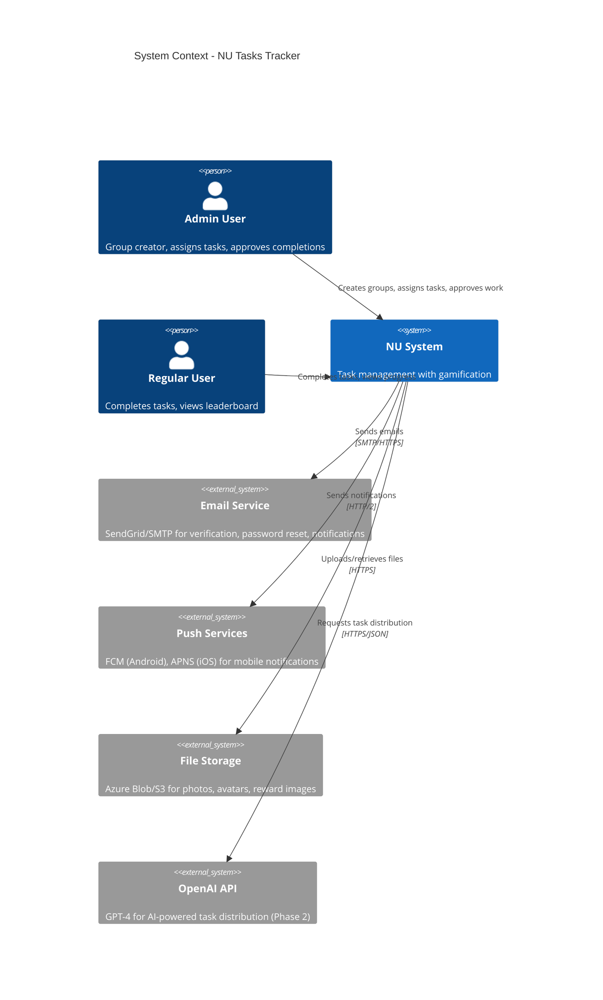
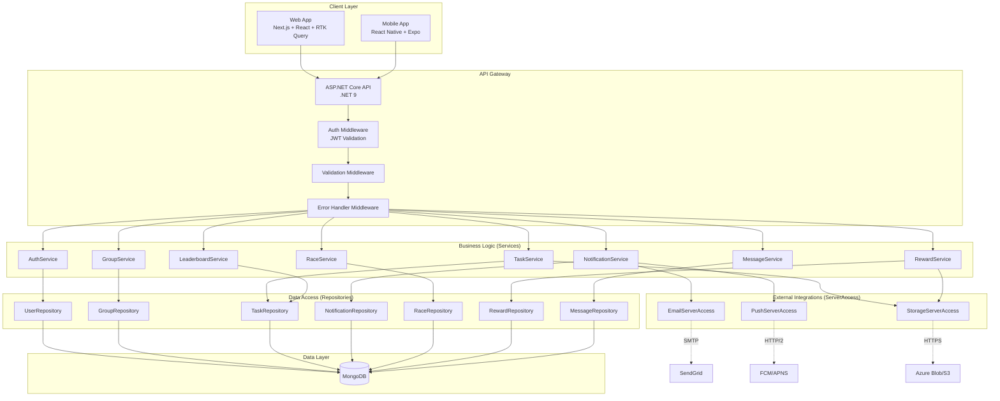
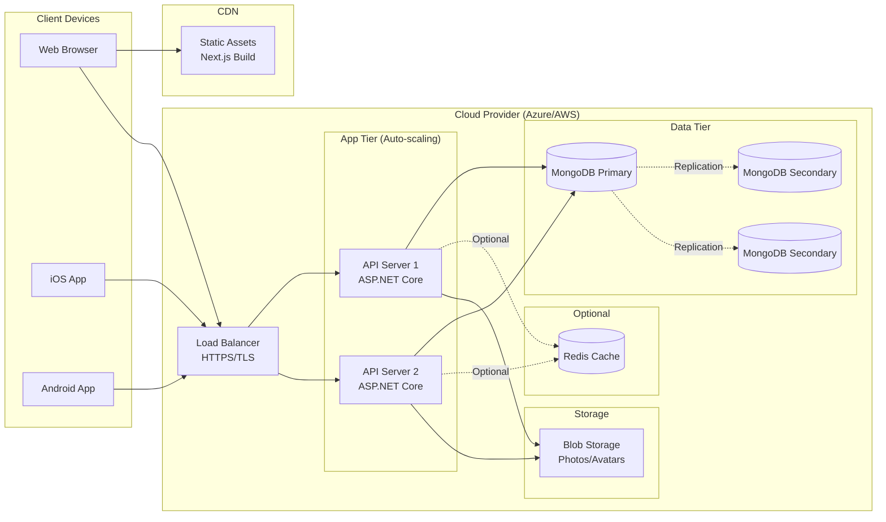
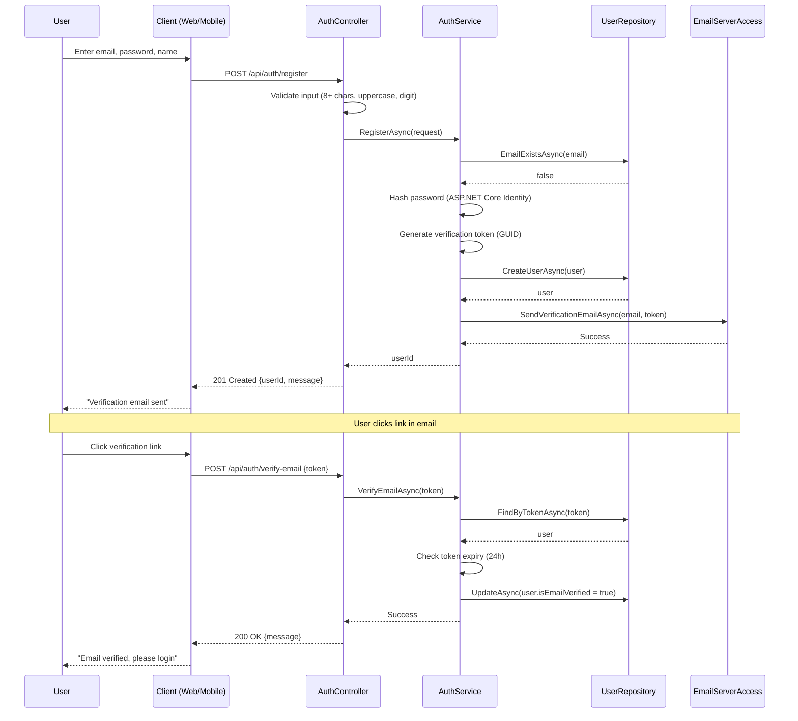
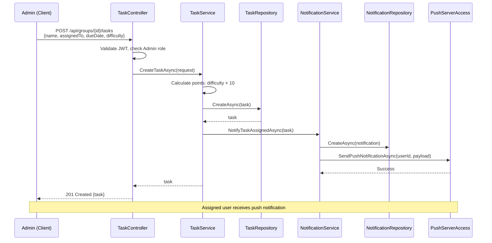
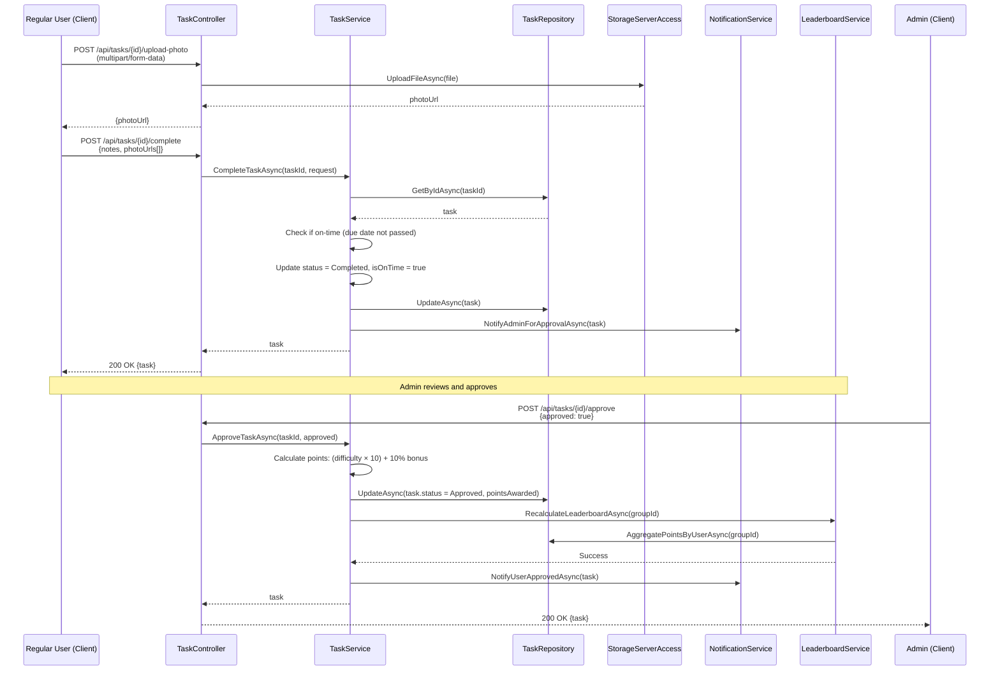
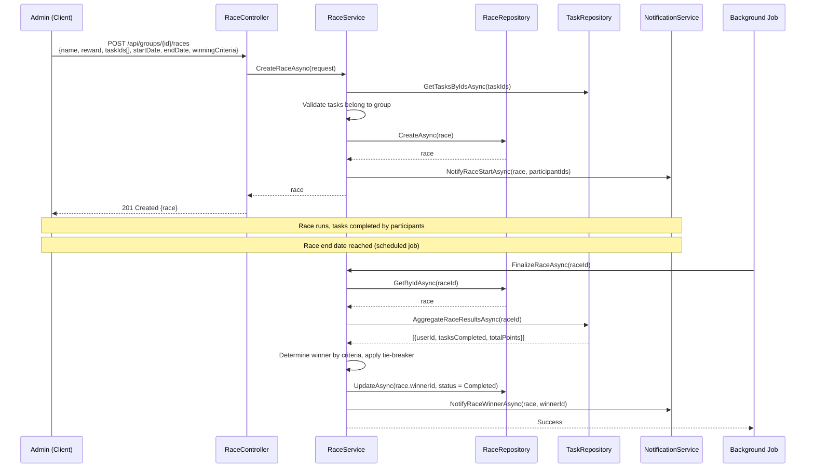

# Technical Design: NU - Tasks Management Application

**Document Version:** 1.0  
**Last Updated:** December 14, 2025  
**Mode:** New Project  
**PRD Reference:** [docs/prd.md](prd.md)  
**Target Stack:** .NET 9 + ASP.NET Core + MongoDB + React + RTK Query + Tailwind

---

## 1. Executive Summary

**What is being built:**
- Cross-platform task management SaaS for families, roommates, and small businesses (≤20 members/group)
- Real-time task synchronization, AI-powered distribution, gamification (races, rewards, leaderboards)
- Web (Next.js) and mobile (React Native/Expo) clients with ASP.NET Core backend and MongoDB database

**High-level approach:**
- **Layered architecture:** Controllers → Services → Repositories → MongoDB
- **Feature-based organization:** Auth, Groups, Tasks, Notifications, Races, Rewards, Leaderboard, Messages
- **JWT authentication** with refresh tokens, role-based authorization (Admin/RegularUser)
- **RTK Query** for frontend state management and API caching
- **SignalR** for real-time updates (future phase)
- **Push notifications** via FCM/APNS, email via SendGrid/SMTP

**Key architectural decisions:**
- **MongoDB over PostgreSQL:** Flexible schema for evolving features (races, rewards), faster prototyping
- **Controllers over Minimal APIs:** Team familiarity, clearer structure for complex validation
- **RTK Query over React Query:** Redux ecosystem consistency, built-in caching/optimistic updates
- **Feature-based folders:** Scalability, team autonomy per feature
- **Async/await throughout:** Non-blocking I/O for high concurrency
- **Repository pattern:** Testability, abstraction over MongoDB driver
- **Primary constructors:** Cleaner DI syntax (.NET 9 feature)

---

## 2. Requirements Summary

### Functional Requirements (Core Features)
- **FR-001:** Email/password auth with JWT (60min expiry), refresh tokens (7 days), email verification, password reset, account lockout after 5 failed attempts
- **FR-002:** Group management (max 20 members), invite via email/link, multi-group support, role promotion
- **FR-005:** Task CRUD from library/custom, assign with deadlines, recurring schedules (daily/weekly/monthly/custom), status tracking
- **FR-006:** Difficulty-based workload balancing (1-10 scale), 15% variance target across users
- **FR-008:** Task completion with photo proof, admin approval workflow, 10% on-time bonus points
- **FR-009:** Smart notifications (daily summary 8AM, reminders 3/5/6PM, frequent 7-11PM), customizable, Do Not Disturb
- **FR-011:** Leaderboard with point formula: `(Difficulty × 10) + On-Time Bonus (10%) + Feedback Points`, weekly/monthly/quarterly/yearly rankings
- **FR-021:** Competitive races with rewards, real-time standings, multiple criteria (most tasks/highest points), tie-breakers
- **FR-022:** Admin-awarded rewards for exceptional work, visible in user profile, claim tracking

### Non-Functional Requirements
- **Performance:** API <200ms (95th percentile), mobile app launch <2s, web load <3s, 10K concurrent users
- **Security:** HTTPS only, JWT 256-bit signing, ASP.NET Core Identity password hashing (PBKDF2), parameterized queries, rate limiting (5 login attempts/min)
- **Scalability:** Horizontal scaling via load balancer, MongoDB connection pooling (max 100), Redis caching (optional), pagination (20 items/page)
- **Reliability:** 99.5% uptime, daily backups (2AM), graceful degradation for external services, Serilog logging
- **Compatibility:** iOS 14+, Android 10+, Chrome/Firefox/Safari/Edge (latest 2 versions), .NET 9, MongoDB 4.4+
- **i18n:** English and Hebrew support, RTL for Hebrew, localized dates/times

### Acceptance Criteria
- **User Adoption:** 80% of invited members active within 2 weeks
- **Task Completion:** 85% on-time completion rate
- **Notification Engagement:** 70% respond within 2 hours
- **Workload Fairness:** <15% variance in difficulty points across users
- **App Store Rating:** 4.5/5 stars within 6 months

### Constraints
- Max 20 members per group
- No video conferencing, document editing, or file storage beyond task attachments
- No payment processing (rewards are descriptive only)
- MongoDB Atlas or self-hosted (no SQL database)

### Assumptions
- **Assume:** Users have stable internet (offline mode in future phase)
- **Assume:** SendGrid free tier sufficient initially (100 emails/day)
- **Assume:** FCM/APNS setup by deployment (API keys provided)
- **Assume:** OpenAI API for AI distribution (Phase 2, not MVP)
- **Inferred:** Single MongoDB replica set initially, shard later if needed
- **Inferred:** File storage (Azure Blob/S3) for photos/avatars, not MongoDB GridFS

---

## 3. Architecture Overview

### 3.1 System Context (C4)



### 3.2 High-Level Architecture (Component Diagram)



### 3.3 Deployment Architecture



**Deployment Notes:**
- **Hosting:** Azure App Service or AWS Elastic Beanstalk for .NET apps, Vercel/Netlify for Next.js
- **Scaling:** Horizontal auto-scaling (2-10 instances) based on CPU >70% or requests/sec
- **Database:** MongoDB Atlas (M10 cluster minimum) with 3-node replica set
- **CDN:** Cloudflare or Azure CDN for static assets
- **SSL/TLS:** Let's Encrypt or cloud provider certificates
- **Monitoring:** Application Insights (Azure) or CloudWatch (AWS)

---

## 4. Detailed Component Design

### 4.1 Backend Components

#### Controllers (API Layer)
- **Responsibility:** HTTP request/response handling, input validation (custom), authorization checks
- **Technology:** ASP.NET Core Controllers (not Minimal APIs)
- **Key Classes:**
  - `AuthController`: Register, login, logout, refresh token, email verification, password reset
  - `GroupController`: CRUD groups, invite members, manage roles
  - `TaskController`: CRUD tasks, assign, complete, approve/reject, swap requests
  - `NotificationController`: Get notifications, mark read, update settings
  - `LeaderboardController`: Get rankings (weekly/monthly/quarterly/yearly)
  - `RaceController`: CRUD races, get standings, announce winner
  - `RewardController`: Award rewards, get user rewards, mark claimed
  - `MessageController`: Send messages, get conversations, mark read

**Validation Approach:** Custom validation in controller actions (validate DTOs), return 400 Bad Request with structured errors.

---

#### Services (Business Logic Layer)
- **Responsibility:** Business rules, orchestration, authorization logic, transaction coordination
- **Technology:** C# classes with dependency injection
- **Key Classes:**
  - `AuthService`: Password hashing/verification, JWT generation, token validation, account lockout logic
  - `GroupService`: Group creation, member management, invitation code generation, authorization checks (Admin only)
  - `TaskService`: Task CRUD, recurring task generation, workload calculation, photo upload via `StorageServerAccess`, difficulty point calculation
  - `NotificationService`: Notification creation, scheduling (daily summaries, reminders), push notification via `PushServerAccess`, email via `EmailServerAccess`
  - `LeaderboardService`: Point calculation `(Difficulty × 10) + On-Time Bonus + Feedback Points`, ranking aggregation, badge assignment
  - `RaceService`: Race lifecycle management, real-time standing calculation, winner determination with tie-breaker logic
  - `RewardService`: Reward creation, claim tracking, expiry management, image upload
  - `MessageService`: Message sending, conversation threading, read receipt tracking

**Primary Constructors:** Use .NET 9 primary constructors for DI:
```csharp
public class TaskService(ITaskRepository taskRepo, IStorageServerAccess storage, INotificationService notif)
{
    public async Task<TaskDto> CreateTaskAsync(CreateTaskRequest request) { /* ... */ }
}
```

---

#### Repositories (Data Access Layer)
- **Responsibility:** MongoDB CRUD operations, query building, indexing
- **Technology:** MongoDB.Driver
- **Key Classes:**
  - `UserRepository`: User CRUD, email lookup (indexed), token lookups
  - `GroupRepository`: Group CRUD, member queries, invitation code lookup
  - `TaskRepository`: Task CRUD, complex queries (by group, user, status, date range), aggregation for workload
  - `NotificationRepository`: Notification CRUD, unread count queries
  - `MessageRepository`: Message CRUD, conversation queries
  - `RaceRepository`: Race CRUD, participant/task queries
  - `RewardRepository`: Reward CRUD, recipient queries

**MongoDB Indexes:**
- `users`: `email` (unique), `emailVerificationToken`, `refreshToken`
- `groups`: `invitationCode` (unique), `members.userId`
- `tasks`: `groupId + assignedTo + status`, `groupId + dueDate`, `raceId`
- `notifications`: `userId + isRead + createdAt`
- `messages`: `senderId + recipientId`, `recipientId + isRead + createdAt`
- `races`: `groupId + status + startDate`
- `rewards`: `recipientId + status`

---

#### ServerAccess (External Integrations)
- **Responsibility:** Third-party API calls (email, push, storage)
- **Technology:** HTTP clients, SDK wrappers
- **Key Classes:**
  - `EmailServerAccess`: SendGrid/SMTP client, email template rendering (verification, password reset, notifications)
  - `PushServerAccess`: FCM (Android) and APNS (iOS) clients, device token management, notification payload building
  - `StorageServerAccess`: Azure Blob Storage or AWS S3 client, file upload/download, URL generation (SAS tokens or pre-signed URLs)

**Configuration:** Inject `IOptions<EmailSettings>`, `IOptions<PushSettings>`, `IOptions<StorageSettings>` for API keys, endpoints.

---

### 4.2 Frontend Components (Web & Mobile)

#### State Management (RTK Query)
- **API Slice:** `apiSlice.ts` with endpoints for auth, groups, tasks, notifications, leaderboard, races, rewards, messages
- **Caching:** Aggressive caching with `keepUnusedDataFor: 300` (5 minutes), tag-based invalidation (`['Task', 'Leaderboard', 'Notification']`)
- **Optimistic Updates:** For task completion, mark read notifications
- **Authentication:** Custom `baseQuery` with JWT injection, automatic refresh token flow on 401

#### UI Components (React + Tailwind)
- **Shared:** `Button`, `Input`, `Modal`, `Card`, `Avatar`, `Badge`, `Spinner`, `Toast`
- **Auth:** `LoginForm`, `RegisterForm`, `ForgotPasswordForm`, `ResetPasswordForm`
- **Dashboard:** `TaskList`, `TaskCard`, `TaskFilters`, `CalendarView`, `WorkloadChart`
- **Leaderboard:** `LeaderboardTable`, `RankingCard`, `BadgeDisplay`
- **Races:** `RaceCard`, `RaceLeaderboard`, `RaceCreationModal`
- **Notifications:** `NotificationBell`, `NotificationList`, `NotificationItem`
- **Messages:** `ConversationList`, `MessageThread`, `MessageComposer`

---

## 5. Data Design (MongoDB Collections)

| Collection | Key Fields | Indexes | Purpose |
|------------|-----------|---------|---------|
| `users` | `_id`, `email`, `passwordHash`, `firstName`, `lastName`, `refreshToken`, `isEmailVerified`, `failedLoginAttempts` | `email` (unique), `refreshToken` | User accounts, auth |
| `groups` | `_id`, `name`, `members[]`, `invitationCode`, `settings`, `createdBy` | `invitationCode` (unique), `members.userId` | Groups with members |
| `categories` | `_id`, `name`, `icon`, `color`, `isSystemCategory`, `groupId` | `groupId`, `isSystemCategory` | Task categories |
| `taskLibrary` | `_id`, `name`, `categoryId`, `difficultyLevel`, `isSystemTask`, `groupId` | `groupId`, `categoryId` | Reusable task templates |
| `tasks` | `_id`, `groupId`, `assignedTo`, `dueDate`, `status`, `difficultyLevel`, `completionData`, `raceId` | `groupId+assignedTo+status`, `groupId+dueDate`, `raceId` | Assigned tasks |
| `taskHistory` | `_id`, `taskId`, `actionType`, `performedBy`, `timestamp` | `taskId+timestamp`, `groupId` | Audit log |
| `notifications` | `_id`, `userId`, `type`, `isRead`, `createdAt` | `userId+isRead+createdAt` | User notifications |
| `messages` | `_id`, `groupId`, `senderId`, `recipientId`, `isRead`, `createdAt` | `senderId+recipientId`, `recipientId+isRead+createdAt` | Private messages |
| `feedback` | `_id`, `taskId`, `fromUserId`, `toUserId`, `reactionType`, `pointsImpact` | `toUserId+groupId+createdAt` | Quick reactions |
| `leaderboards` | `_id`, `groupId`, `period`, `periodStart`, `rankings[]` | `groupId+period+periodStart` | Pre-calculated rankings |
| `races` | `_id`, `groupId`, `participantIds[]`, `taskIds[]`, `status`, `startDate`, `endDate`, `winnerId` | `groupId+status+startDate` | Competitive races |
| `rewards` | `_id`, `groupId`, `recipientId`, `status`, `awardedBy`, `relatedTaskIds[]` | `recipientId+status` | Awarded rewards |

**Schema Versioning:** Include `schemaVersion: 1` field in all collections for future migrations.

---

## 6. API Design (High-Level)

### 6.1 Authentication Endpoints

| Endpoint | Method | Auth | Request | Response | Notes |
|----------|--------|------|---------|----------|-------|
| `/api/auth/register` | POST | None | `{email, password, firstName, lastName}` | `{userId, message}` | 201 Created, sends verification email |
| `/api/auth/verify-email` | POST | None | `{token}` | `{message}` | 200 OK or 400 invalid token |
| `/api/auth/login` | POST | None | `{email, password}` | `{accessToken, refreshToken, user}` | 200 OK, 401 invalid, 423 locked |
| `/api/auth/refresh-token` | POST | None | `{refreshToken}` | `{accessToken, refreshToken}` | Issues new tokens |
| `/api/auth/forgot-password` | POST | None | `{email}` | `{message}` | Always 200 OK (security) |
| `/api/auth/reset-password` | POST | None | `{token, newPassword}` | `{message}` | 200 OK or 400 invalid |
| `/api/auth/logout` | POST | JWT | None | `{message}` | Invalidates refresh token |

### 6.2 Group Endpoints

| Endpoint | Method | Auth | Request | Response | Notes |
|----------|--------|------|---------|----------|-------|
| `/api/groups` | GET | JWT | Query: `page, pageSize` | `{groups[], total}` | User's groups, paginated |
| `/api/groups` | POST | JWT | `{name, description?, avatarUrl?, timezone, language}` | `{group}` | 201 Created, user becomes Admin |
| `/api/groups/{id}` | GET | JWT | None | `{group}` | 200 OK or 404 |
| `/api/groups/{id}` | PUT | JWT (Admin) | `{name, description?, settings}` | `{group}` | 200 OK, Admin only |
| `/api/groups/{id}` | DELETE | JWT (Admin) | None | `{message}` | 204 No Content, Admin only |
| `/api/groups/{id}/invite` | POST | JWT (Admin) | `{emails[]}` or `{generateLink: true}` | `{invitations[], link?}` | Sends emails or returns shareable link |
| `/api/groups/{id}/members` | GET | JWT | None | `{members[]}` | List members with roles |
| `/api/groups/{id}/members/{userId}` | PATCH | JWT (Admin) | `{role}` | `{member}` | Promote/demote user |
| `/api/groups/{id}/members/{userId}` | DELETE | JWT (Admin) | None | `{message}` | Remove member |
| `/api/groups/join/{code}` | POST | JWT | None | `{group}` | Join via invitation code |

### 6.3 Task Endpoints

| Endpoint | Method | Auth | Request | Response | Notes |
|----------|--------|------|---------|----------|-------|
| `/api/groups/{groupId}/tasks` | GET | JWT | Query: `status, assignedTo, category, date, page` | `{tasks[], total}` | Filtered, paginated |
| `/api/groups/{groupId}/tasks` | POST | JWT (Admin) | `{name, categoryId, assignedTo, dueDate, frequency, difficulty}` | `{task}` | 201 Created |
| `/api/tasks/{id}` | GET | JWT | None | `{task}` | Visibility check (private tasks) |
| `/api/tasks/{id}` | PUT | JWT (Admin) | `{name, dueDate, assignedTo, ...}` | `{task}` | Admin only |
| `/api/tasks/{id}` | DELETE | JWT (Admin) | None | `{message}` | 204 No Content |
| `/api/tasks/{id}/complete` | POST | JWT | `{notes?, photoUrls[]}` | `{task}` | Mark completed, upload photos via separate endpoint |
| `/api/tasks/{id}/approve` | POST | JWT (Admin) | `{approved: boolean, notes?}` | `{task}` | Approve/reject completion |
| `/api/tasks/{id}/swap` | POST | JWT | `{targetUserId}` | `{swapRequest}` | Request task swap |
| `/api/tasks/swap-requests/{id}/approve` | POST | JWT (Admin) | `{approved: boolean}` | `{message}` | Admin approves swap |
| `/api/tasks/{id}/upload-photo` | POST | JWT | `multipart/form-data: file` | `{photoUrl}` | Upload to blob storage |

### 6.4 Leaderboard, Race, Reward Endpoints (Condensed)

| Feature | Sample Endpoints | Notes |
|---------|------------------|-------|
| **Leaderboard** | `GET /api/groups/{groupId}/leaderboard?period=monthly` | Returns rankings with points, badges |
| **Races** | `POST /api/groups/{groupId}/races`, `GET /api/races/{id}/standings`, `POST /api/races/{id}/end` | CRUD races, real-time standings |
| **Rewards** | `POST /api/rewards`, `GET /api/users/me/rewards`, `PATCH /api/rewards/{id}/claim` | Award, list, claim rewards |
| **Notifications** | `GET /api/notifications?page=1`, `PATCH /api/notifications/{id}/read`, `PUT /api/notifications/settings` | Paginated, mark read, configure |
| **Messages** | `GET /api/messages/conversations`, `GET /api/messages/{userId}`, `POST /api/messages` | List conversations, thread, send |

**Standard Error Response:**
```json
{
  "error": {
    "code": "VALIDATION_ERROR",
    "message": "Invalid input",
    "details": [{"field": "email", "message": "Invalid email format"}]
  }
}
```

---

## 7. Sequence Diagrams (Critical Flows)

### 7.1 User Registration & Email Verification



### 7.2 Task Assignment & Notification



### 7.3 Task Completion with Approval Workflow



### 7.4 Race Creation & Winner Announcement



---

## 8. Security & Performance

### 8.1 Security Design

| Layer | Mechanism | Implementation |
|-------|-----------|----------------|
| **Authentication** | JWT (60min) + Refresh Token (7 days) | ASP.NET Core Identity for password hashing, custom JWT generation |
| **Authorization** | Role-based (Admin/RegularUser) | `[Authorize(Roles = "Admin")]` attribute, claims in JWT |
| **API Security** | Rate limiting (5 login attempts/min) | Custom middleware with in-memory cache (or Redis) |
| **Data Security** | HTTPS only, PBKDF2 password hashing | `RequireHttpsAttribute`, ASP.NET Core Identity defaults |
| **Input Validation** | Custom validation in controllers | Sanitize strings, parameterized MongoDB queries |
| **CORS** | Whitelist origins | `services.AddCors()` with specific origins |
| **File Upload** | Max 5MB, allowed types: .jpg, .png, .heic | Middleware checks `Content-Type` and size |
| **Secrets Management** | Environment variables, Azure Key Vault | `IConfiguration`, `IOptions<T>` injection |

**Threat Mitigations:**
- **NoSQL Injection:** Parameterized queries via MongoDB.Driver (no string concatenation)
- **XSS:** Input sanitization, Content Security Policy (CSP) headers
- **CSRF:** SameSite cookies for web, not applicable for mobile
- **Brute Force:** Account lockout after 5 failed attempts (30min)
- **Token Theft:** Short-lived access tokens, refresh token rotation on use

### 8.2 Performance Optimization

| Area | Strategy | Target |
|------|----------|--------|
| **API Response** | Async/await, non-blocking I/O | <200ms (95th percentile) |
| **Database** | Indexes on high-cardinality fields (email, taskId), connection pooling (max 100) | <50ms query latency |
| **Caching** | Redis for leaderboards, user sessions (optional, Phase 2) | Cache hit ratio >80% |
| **Frontend** | RTK Query caching (5min), code splitting, lazy loading | Time to Interactive <3s |
| **File Upload** | Direct upload to blob storage (SAS tokens), client-side compression | <5s for 5MB file |
| **Pagination** | Default 20 items/page, cursor-based for messages | Prevent large result sets |
| **Real-time** | SignalR for leaderboard updates (Phase 2) | <1s notification delivery |

**Load Testing Plan:**
- **Tool:** k6 or JMeter
- **Scenarios:** 1000 concurrent users, 10K requests/min, 95th percentile <200ms
- **Critical Endpoints:** `/api/groups/{id}/tasks`, `/api/leaderboard`, `/api/notifications`

---

## 9. Testing Strategy

| Test Type | Coverage Target | Tools | Key Focus |
|-----------|----------------|-------|-----------|
| **Unit Tests** | 80% | xUnit, Moq | Services, repositories, business logic |
| **Integration Tests** | 60% | xUnit, Testcontainers (MongoDB) | API endpoints, database queries |
| **E2E Tests** | Critical flows (5-10) | Playwright (web), Detox (mobile) | User registration, task completion, race flow |
| **Performance Tests** | 95th percentile <200ms | k6 | Load testing on staging |
| **Security Tests** | OWASP Top 10 | OWASP ZAP, Snyk | SQL injection, XSS, auth bypass |

**Test Data Strategy:**
- **Unit:** In-memory fakes, mocked repositories
- **Integration:** Testcontainers MongoDB with seed data
- **E2E:** Dedicated test environment with sample groups/users, reset after each run

---

## 10. Implementation Plan

### Phase 1: Foundation (Weeks 1-2)
- ✅ Setup .NET 9 solution structure (Controllers, Services, Repositories, Domain)
- ✅ MongoDB connection setup, collections, indexes
- ✅ FR-001: Authentication (register, login, JWT, refresh token)
- ✅ FR-002: Group management (create, invite, join)
- ✅ Basic Serilog logging, error handling middleware
- ✅ Web: React + RTK Query setup, auth pages
- ✅ Mobile: Expo + React Native setup

### Phase 2: Core Task Management (Weeks 3-5)
- ✅ FR-003: Category management (system + custom)
- ✅ FR-004: Task library
- ✅ FR-005: Task CRUD, assignment, recurring schedules
- ✅ FR-006: Difficulty levels, workload balancing
- ✅ FR-008: Task completion, photo upload, approval workflow
- ✅ FR-012: User dashboard, filters, calendar view
- ✅ FR-017: Task history (audit log)
- ✅ Web/Mobile: Task screens, filters, photo upload UI

### Phase 3: Notifications & Messaging (Weeks 6-7)
- ✅ FR-009: Notification system (daily summaries, reminders, scheduled jobs)
- ✅ FR-010: Messaging, feedback reactions
- ✅ Push notification setup (FCM/APNS), email service (SendGrid)
- ✅ Web/Mobile: Notification bell, message threads

### Phase 4: Gamification (Weeks 8-10)
- ✅ FR-011: Leaderboard with point calculation, rankings, badges
- ✅ FR-021: Task races (create, standings, winner announcement)
- ✅ FR-022: Rewards (award, claim, history)
- ✅ Web/Mobile: Leaderboard UI, race cards, reward displays

### Phase 5: Advanced Features (Weeks 11-13)
- ✅ FR-007: AI-powered task distribution (OpenAI API integration) - **Optional**
- ✅ FR-013: Task swap requests
- ✅ FR-014: Reports & analytics (charts, CSV export)
- ✅ FR-019: Onboarding tutorial
- ✅ SignalR for real-time updates (leaderboard, race standings) - **Optional**

### Phase 6: Polish & Launch (Weeks 14-16)
- ✅ Performance optimization (caching, query tuning)
- ✅ Security hardening (penetration testing, OWASP ZAP)
- ✅ E2E testing, bug fixes
- ✅ Documentation (API docs via Swagger, user guides)
- ✅ Deployment to production (Azure/AWS), monitoring setup
- ✅ App store submission (iOS/Android)

**Technical Risks:**

| Risk | Impact | Probability | Mitigation |
|------|--------|-------------|------------|
| MongoDB performance at scale | High | Medium | Implement Redis caching, optimize indexes, shard if needed |
| OpenAI API costs exceed budget | Medium | Medium | Implement rate limiting, cache common distributions, offer manual fallback |
| Push notification delivery delays | Medium | Low | Implement in-app notification fallback, retry logic |
| Real-time (SignalR) scaling issues | Medium | Low | Use Redis backplane, defer to Phase 2 if needed |
| Mobile app store rejection | High | Low | Follow Apple/Google guidelines strictly, submit early for review |

---

## 11. Operational Considerations

### 11.1 Deployment Process
- **Strategy:** Blue-green deployment for zero downtime
- **Frequency:** Weekly releases (Fridays, 6 PM UTC)
- **Rollback:** Keep previous Docker image tagged, instant rollback via load balancer switch
- **CI/CD:** GitHub Actions (build → test → deploy to staging → manual approval → prod)

### 11.2 Monitoring & Observability
- **Logging:** Serilog → File sinks + Azure Application Insights (or AWS CloudWatch)
- **Metrics:** API latency (p50, p95, p99), error rate, request/sec, MongoDB query time
- **Alerts:** 
  - API p95 latency >500ms (warning), >1000ms (critical)
  - Error rate >5% (warning), >10% (critical)
  - MongoDB connection failures (critical)
- **Dashboards:** Grafana or Azure Monitor for real-time metrics

### 11.3 Backup & Disaster Recovery
- **Backup:** Daily automated MongoDB backups at 2 AM UTC, retain 30 days
- **RTO:** 4 hours (restore from backup, deploy new cluster)
- **RPO:** 24 hours (daily backups, no point-in-time recovery initially)
- **Blob Storage:** Geo-redundant storage (GRS) for photos/avatars

---

## 12. Assumptions & Open Questions

### Technical Assumptions
- **Assume:** Single MongoDB replica set (3 nodes) sufficient for 10K users, shard later if needed
- **Assume:** SendGrid free tier (100 emails/day) adequate initially, upgrade to paid tier at 500 users
- **Assume:** FCM/APNS API keys and certificates provided by deployment time
- **Assume:** Azure Blob Storage or AWS S3 for file storage (not MongoDB GridFS due to 16MB BSON limit)
- **Assume:** .NET 9 SDK and MongoDB.Driver 2.24+ stable and compatible
- **Inferred:** No multi-tenancy isolation (groups share same collections), rely on `groupId` filtering
- **Inferred:** No soft deletes initially (hard delete for MVP), add `isDeleted` field in Phase 2 if needed

### Open Questions (Product)
1. **AI Distribution Prompt:** What specific prompt template for OpenAI API? (e.g., "Distribute these tasks fairly considering...") → **Needs PRD clarification or POC**
2. **Reward Expiry:** Should rewards expire? If yes, default expiry period (30 days, 90 days)? → **Assume no expiry in MVP**
3. **Race Tie-breaker:** Default to "FirstToFinish" or "SplitReward"? → **Assume FirstToFinish, configurable per race**
4. **Notification Frequency:** Confirm 30-min intervals from 7-11 PM acceptable? Not too aggressive? → **Needs user testing**
5. **Private Task Points:** Should private tasks show points on leaderboard or hide entirely? → **Assume show points but hide task name**

### Open Questions (Engineering)
1. **Recurring Task Generation:** Generate tasks at midnight (cron job) or on-demand when viewing dashboard? → **Recommend midnight batch job (simpler, predictable)**
2. **Photo Storage:** Max file size 5MB? Allowed formats? Client-side compression? → **Assume 5MB, jpg/png/heic, no server-side compression**
3. **Real-time (SignalR):** Include in MVP or defer to Phase 2? → **Defer to Phase 2, use polling initially**
4. **Redis Caching:** Required for MVP or optional? → **Optional, implement if performance tests show bottlenecks**
5. **MongoDB Sharding:** At what scale (users, groups, tasks) should we shard? → **Recommend after 100K users or 10M tasks**

---

## 13. Appendices

### A. Technology Evaluation (MongoDB vs PostgreSQL)

| Criteria | MongoDB | PostgreSQL | Decision |
|----------|---------|------------|----------|
| Schema Flexibility | ✅ Flexible (JSON documents) | ❌ Rigid (tables, migrations) | MongoDB wins |
| Query Performance | ✅ Fast for document reads | ✅ Fast with proper indexes | Tie |
| Complex Joins | ❌ Limited (use aggregation) | ✅ Native joins | Not critical (denormalized design) |
| Transactions | ✅ Multi-document (4.0+) | ✅ ACID compliant | Tie |
| Team Familiarity | ⚠️ Medium | ✅ High | Acceptable tradeoff |
| Scalability | ✅ Horizontal (sharding) | ⚠️ Vertical (harder to shard) | MongoDB wins |
| **Verdict** | **✅ Selected** | ❌ Not selected | Flexible schema for evolving features (races, rewards) |

### B. Glossary
- **JWT:** JSON Web Token, stateless authentication mechanism
- **RTK Query:** Redux Toolkit Query, data fetching and caching library
- **FCM:** Firebase Cloud Messaging, push notification service for Android
- **APNS:** Apple Push Notification Service, push notification service for iOS
- **SAS Token:** Shared Access Signature, time-limited access token for Azure Blob Storage
- **PBKDF2:** Password-Based Key Derivation Function 2, secure password hashing algorithm
- **C4:** Context, Containers, Components, Code - hierarchical architecture diagram framework
- **OWASP:** Open Web Application Security Project, security standards and testing tools

### C. References
- **PRD:** [docs/prd.md](prd.md)
- **MongoDB Driver Docs:** https://mongodb.github.io/mongo-csharp-driver/
- **ASP.NET Core Docs:** https://learn.microsoft.com/aspnet/core
- **RTK Query Docs:** https://redux-toolkit.js.org/rtk-query/overview
- **Expo Docs:** https://docs.expo.dev
- **SignalR Docs:** https://learn.microsoft.com/aspnet/core/signalr

---

**Document Status:** ✅ Complete  
**Next Steps:** Review with engineering team, prioritize Phase 1 tasks, setup development environment

---

*Generated by GitHub Copilot (Claude Sonnet 4.5) on December 14, 2025*
