# Product Requirements Document (PRD)

## 1. Executive Summary

This epic introduces two key enhancements to the Groups Dashboard:
- Members Modal: Clicking the group card “Members” opens a modal showing all group members and pending invites, with the ability to add (invite via email), remove, and review roles (Admin/Member) and invite status (Pending/Joined/Declined).
- Tasks Modal/List: Clicking “Tasks” opens a scoped group tasks view with filtering (status, assignee), sorting (created/updated), quick navigation into a task, and inline assign/unassign.

The goal is to streamline group administration and task triage directly from the dashboard, reduce navigation friction, and support a formal invite lifecycle with an `invites` collection.

## 2. Problem Statement

- Managing group membership requires multiple page transitions and lacks a clear flow for pending invites.
- Users cannot quickly triage group tasks (filter/sort/assign) in context; assignment requires opening each task.
- Lack of visibility into invite status causes duplicate invites and onboarding friction.

## 3. Goals & Non-Goals

### Goals
- One-click access from group card to: members management and tasks triage.
- Full invite lifecycle: send email invite, track status (Pending/Joined/Declined), cancel/resend.
- Member management: view roles, remove members (with last-admin protection), list all members with first/last name.
- Group tasks triage: filter by status (Pending/InProgress/Completed), filter by assignee, sort by created/updated, assign/unassign without leaving the list.
- Respect existing auth/roles: only Admins can invite/remove members and assign tasks across members.


- Role editing/promotion is out of scope for this epic (view-only).
- Notification templates and email provider selection are not finalized; use existing infrastructure or placeholders.
- Real-time updates (SignalR) may be added later; not required for initial release.

## 4. User Flows

### Flow A: Members Modal (from Group Card)

```mermaid
flowchart TD
   A[Click Members on Group Card] --> B[Open Members Modal]
   B --> C[Tab: Members]
   B --> D[Tab: Invites]
   C --> C1[List members: First Last • Role • Joined]
   C1 --> C2[Action: Remove member (Admin only)]
   C2 --> C3{Is last admin?}
   C3 -- Yes --> C4[Block action • Show warning]
   C3 -- No --> C5[Confirm removal • Update group]
   D --> D1[List invites: Email • Status(Pending/Joined/Declined)]
   D1 --> D2[Actions: Resend • Cancel invite]
   B --> E[Action: Add Member]
   E --> E1[Enter Email]
   E1 --> E2[Validate • Create Invite]
   E2 --> E3[Send Email • Show Pending]
```

Key actors: Admin (can invite/remove/resend/cancel), Member (view-only).  
Decision points: last-admin protection; email validity; duplicate pending invite.

Edge cases:
- Email already invited → show existing pending invite with resend option.
- User already a member → show error and block invite.
- Last admin removal is blocked until another admin exists.

### Flow B: Group Tasks View (from Group Card)

```mermaid
flowchart TD
   A[Click Tasks on Group Card] --> B[Open Group Tasks View]
   B --> C[Filters: Status • Assignee]
   B --> D[Sort: Created • Updated]
   B --> E[List: Task Name • Assignee • Status]
   E --> F[Click Task → Open details panel]
   F --> G[Inline actions: Assign/Unassign]
   G --> H[Save changes • Update task]
```



Key actors: Admin (full control), Member (view, self-assign if allowed by policy).  
Edge cases:
- No tasks → show empty state with Create Task CTA.
- Filter + sort persist in session storage per group.

## 5. Functional Requirements

### Members Modal
- Open from group card “Members”.
- Display members list: First Name, Last Name, Role (Admin/Member), Joined date.
- Display invites list: Email, Status (Pending/Joined/Declined), InvitedAt, InvitedBy.
- Add member:
   - Validate email format; block duplicates (existing member or pending invite).
   - Create invite record and send email.
   - Show success toast and add to invites list with status=Pending.
- Remove member (Admin only):
   - Confirm removal; block if last admin.
   - Remove membership and revoke group access.
- Resend/cancel invite (Admin only).
- Access control: Only Admins see invite/remove actions; Members can view.

### Tasks View
- Open from group card “Tasks”.
- List items: Task Name, Assignee (avatar/initials + name), Status.
- Filters: Status (Pending/InProgress/Completed), Assignee (All/Members).
- Sort: CreatedDate (asc/desc), UpdatedDate (asc/desc).
- Interactions:
   - Click row → open details side panel.
   - Assign/Unassign members inline (Admin only). Self-assign allowed if policy enables.
   - Status change allowed if user is assignee or Admin (optional policy).
- Empty states and loading skeletons consistent with existing UI.

### Invite Lifecycle
- States: Pending → Joined (on account creation/join) → Declined (explicit or expired).
- Resend: Allowed while Pending.
- Cancel: Allowed while Pending; moves to Canceled (hidden by default in UI).
- Auto-expiry: Optional configuration (e.g., 14 days) marks invite as Expired.

## 6. Technical Considerations

- Data Model:
   - Add `invites` collection: `{ id, groupId, email, status, invitedAt, invitedBy, respondedAt? }`.
   - Group members remain in `groups.members` with `{ userId, role, joinedAt }`.
- Backend:
   - Controllers/Services follow existing layered architecture (Controller → Service → Repository → MongoDB).
   - Email sending uses existing server access abstraction; queue or fire-and-forget as per current infra.
   - Validation: last-admin protection, duplicate invite prevention, email format.
   - Pagination for lists; indexes on `invites.groupId + status`, `tasks.groupId + status + updatedAt`.
- Frontend:
   - Functional components with TypeScript; Tailwind for styling; reuse existing modal patterns.
   - RTK Query endpoints for members, invites, tasks; caching/invalidation on changes.
   - Accessibility: focus trap in modal, keyboard navigation, ARIA labels.
- Security & Auth:
   - Only Admins can invite/remove/resend/cancel and assign tasks; audit changes.
   - Avoid exposing emails of non-members except for invites within Admin modal.
- Performance:
   - Use existing aggregation/caching where possible (group-scoped queries).
   - Batch user hydration for assignee/member display.

## 7. Success Metrics

- Time-to-complete admin actions: invite send < 5s; member removal < 3s.
- Error rate for invite send < 1% over 7 days.
- Task triage efficiency: 50% reduction in navigations per session for task assignment.
- Adoption: 80% of active groups use Members/Tasks modals within 2 weeks.
- Performance: P95 latency < 150ms for list queries; < 300ms for assign/unassign.

## 8. Open Questions / Risks

- Should non-admin members be allowed to self-assign tasks? If yes, under what policy?
- Invite expiry policy default (e.g., 14 or 30 days)? Behavior after expiry?
- Email template and localization for invites; sender identity domain.
- Rate limiting on invites to prevent abuse.
- Analytics needed for conversion from Pending → Joined per group?
- Real-time updates for member/task changes (SignalR) in scope or follow-up?

### FR-001: User Authentication & Authorization
- Email/password registration with validation (min 8 chars, uppercase, lowercase, digit)
- Email verification via link
- Login with JWT (60 min expiry) and refresh tokens (7 days)
- Password reset via email
- Account lockout after 5 failed login attempts
- Future: OAuth login (Google, Facebook, Apple)

### FR-002: Group Management
- Create group (name, description, avatar, timezone, language)
- Invite members via email or shareable link (max 20 members)
- Admin can promote users, remove members
- Users can join multiple groups
- Switch between groups via dropdown/tabs

### FR-003: Category Management
- System-provided default categories: House, Yard, Pets, Studies, Work, Vehicle, Finance, Shopping, Health, Other
- Each category has icon and color
- Admin can create/edit/delete custom categories
- Categories can be group-specific or global

### FR-004: Task Library
- Global task library with predefined tasks (name, category, description, difficulty 1-10, default frequency, duration)
- Admin can add custom tasks to group library
- Regular users can request new tasks (requires Admin approval)

### FR-005: Task Creation & Assignment
- Create tasks from library or scratch
- Assign to specific users with deadline (date + time)
- Set frequency: One-time, Daily, Weekly, Bi-weekly, Monthly, Quarterly, Yearly, Custom
- Task status: Pending, In Progress, Completed, Overdue
- Admin can edit, reassign, or delete tasks

### FR-006: Difficulty Levels & Workload Balancing
- Difficulty scale 1-10
- Calculate total workload per user (sum of difficulty points)
- Display workload in Admin dashboard
- Target: workload variance < 15% across users

### FR-007: AI-Powered Task Distribution
- "Auto Distribute" feature considers: current workload, preferences, history, availability, fairness
- Admin selects date range and users
- Preview distribution before confirmation
- Users mark category preferences and unavailability dates

### FR-008: Task Completion & Approval
- Users mark tasks as completed with optional notes and photo proof
- Admin approval required (configurable per task)
- Admin can reject and request redo
- On-time completion earns 10% bonus points
- Completed tasks show timestamp and user

### FR-009: Notifications & Reminders
- Daily summary at 8:00 AM: "You have X tasks today"
- Reminders at 3:00 PM, 5:00 PM, 6:00 PM
- Frequent reminders every 30 min from 7:00-11:00 PM (optional)
- Customizable notification times and Do Not Disturb hours
- Notifications for: new task, approval/rejection, messages, feedback
- Admin broadcast notifications
- Badge shows unread count

### FR-010: Messaging & Feedback
- Private messages between members with read receipts
- Persistent messaging history
- Quick feedback reactions: 👍 👎 💪 🎉 ⭐ 🔥 ❤️
- Feedback contributes to leaderboard (positive +5 points, negative -2 points)

### FR-011: Leaderboard & Gamification
- Points formula: `(Difficulty × 10) + On-Time Bonus (10%) + Feedback Points`
- Rankings: weekly, monthly, quarterly, yearly
- Display: rank, name, points, completion %, badges
- Top 3 users: 🥇 🥈 🥉
- Earn badges for milestones (e.g., "100 tasks completed")
- Leaderboard resets monthly (configurable)

### FR-012: User Dashboard & Views
- Today's summary: total tasks, completed, pending
- Views: My Tasks / All Tasks / Group-specific
- Filters: category, date, difficulty, status
- Sort by: due date, difficulty, category
- Calendar view and list view

### FR-013: Task Swap Requests
- Request to swap tasks with another member
- Requires Admin approval
- Notifications to all parties
- Logged in task history

### FR-014: Reports & Analytics
- Group statistics: total tasks, completion rate, average completion time
- Export reports (CSV, PDF)
- Visual charts: bar, line, progress bars
- Category breakdown and trend analysis

### FR-015: Multi-Group Support
- Create or join multiple groups
- Independent settings, tasks, leaderboards per group
- Notifications indicate group context

### FR-016: User Profile & Preferences
- Edit profile photo, name, email, password
- Set preferred/disliked categories
- Mark unavailability periods
- Language selection (English/Hebrew)
- Configure notification preferences

### FR-017: Task History & Audit Log
- Log all actions: creation, assignment, completion, rejection
- Include timestamp, user, action type
- Admin access to audit logs
- Retain logs for 12 months

### FR-018: Search & Filters
- Search tasks by name or description
- Filters: category, assigned user, status, date range
- Partial match and autocomplete support

### FR-019: Onboarding & Tutorial
- Welcome tutorial explaining key features
- Pre-populated sample tasks for demo
- Skip tutorial option
- Tooltips for first-time actions

### FR-020: Public & Private Tasks
- Admin marks tasks as "Public" or "Private"
- Public tasks visible to all members
- Private tasks visible only to assigned user and Admins
- Private tasks show generic label in activity feed
- Default setting: Public

### FR-021: Task Races with Rewards
- Admin creates race (name, description, reward, optional image)
- Select race tasks and participants
- Set race period (start/end date-time)
- Winner criteria: most tasks completed or highest points
- Tie-breaker: completion time or split reward
- Real-time race leaderboard
- Winner announcement via notification
- Multiple simultaneous races supported
- Archive completed races in race history

### FR-022: Rewards for Completed Tasks
- Admin selects completed tasks and awards reward
- Reward details: description, optional value/image, notes
- Notification sent to recipient(s)
- Rewards displayed in user profile "My Rewards" section
- Admin marks reward as "Claimed"
- Reward history visible to recipient and Admins only

### FR-023: Offline Mode (Future)
- View tasks offline
- Task completion syncs when online
- Conflict resolution: last write wins

---

## 6. Technical Considerations

### Architecture
- **Backend:** ASP.NET Core 8 (C#) with feature-based structure
  - Controller → HTTP request/response, validation
  - Service → business logic
  - ServerAccess → third-party integrations
  - Repository → MongoDB access
- **Database:** MongoDB (document-based, flexible schema)
- **Frontend Mobile:** React Native (Expo) with NativeWind, Redux Toolkit, React Navigation
- **Frontend Web:** Next.js 15 (React 19) with Tailwind CSS, Redux Toolkit
- **Real-time:** SignalR for live updates
- **Authentication:** JWT tokens with refresh mechanism
- **State Management:** Redux Toolkit with RTK Query for server state
- **API Client:** Axios

### External Dependencies
- **Push Notifications:** Firebase Cloud Messaging (FCM) for Android, Apple Push Notification Service (APNS) for iOS
- **AI:** OpenAI API (GPT-4) for intelligent task distribution
- **Email:** SendGrid or SMTP for verification and password reset
- **Logging:** Serilog with file sinks
- **API Documentation:** Swagger/OpenAPI

### Performance
- API response time < 200ms for 95% of requests
- Mobile app launch time < 2 seconds
- Web app initial load time < 3 seconds
- Real-time notifications delivered within 1 second
- Support up to 10,000 concurrent users

### Security
- HTTPS only for all API endpoints
- JWT signed with 256-bit key
- Passwords hashed using ASP.NET Core Identity (PBKDF2)
- Parameterized queries via EF Core/MongoDB driver
- Input sanitization for XSS prevention
- CORS configured for known origins
- Rate limiting on authentication endpoints (max 5 attempts/min)
- Sensitive data never logged

### Scalability
- Horizontal scaling via load balancer
- MongoDB connection pooling (max 100 connections)
- Caching for frequently accessed data (Redis recommended)
- Pagination for large datasets (default 20 items/page)

### Reliability
- System uptime: 99.5% (excluding maintenance)
- Automated database backups daily at 2:00 AM
- Graceful degradation if external services fail
- Error logging with Serilog
- Health check endpoint (`/health`)

### Compatibility
- Backend: .NET 8 runtime
- Database: MongoDB 4.4+
- Mobile: iOS 14+, Android 10+, React Native 0.72+, Expo SDK 49+
- Web: Chrome, Firefox, Safari, Edge (latest 2 versions), Next.js 15+, React 19+

### Internationalization
- Support English and Hebrew
- Externalized UI strings in translation files
- Localized date/time and currency formats
- RTL (Right-to-Left) support for Hebrew

### Data Privacy
- GDPR compliance: data export and deletion on request
- Deleted accounts permanently removed after 30 days
- Privacy policy and terms displayed during registration
- User data retained while account active

---

## 7. Success Metrics

### Adoption & Engagement
- **User Adoption:** 80% of invited group members actively use app within 2 weeks
- **Daily Active Users (DAU):** 65% of registered users open app daily
- **Retention Rate:** 70% of users still active after 30 days

### Task Management
- **Task Completion Rate:** 85% of assigned tasks completed on time
- **Notification Response:** 70% of users respond to notifications within 2 hours
- **Recurring Task Automation:** 60% of tasks set as recurring within first month

### Fairness & Distribution
- **Workload Variance:** < 15% variance in total difficulty points across users
- **AI Distribution Adoption:** 40% of groups use AI distribution at least once per month
- **Swap Requests:** < 10% of tasks result in swap requests (indicates good initial distribution)

### Gamification Impact
- **Leaderboard Engagement:** 75% of users view leaderboard at least weekly
- **Race Participation:** 50% of groups create at least one race per month
- **Reward Giving:** 30% of groups award at least one reward per month

### Technical Performance
- **API Response Time:** 95% of requests < 200ms
- **App Crash Rate:** < 1% of sessions
- **Push Notification Delivery:** > 95% delivered within 2 seconds

### User Satisfaction
- **App Store Rating:** Average 4.5/5 stars within 6 months
- **Net Promoter Score (NPS):** > 50
- **Support Tickets:** < 5 tickets per 100 active users per month

---

## 8. Open Questions / Risks

### Open Questions
1. **AI Task Distribution Algorithm:** What specific factors should AI prioritize? (user preferences, historical performance, current workload, time of day, day of week?)
2. **Reward Fulfillment:** How to track whether physical/digital rewards are actually delivered? Should app include a "redeem" workflow?
3. **Race Tie-Breaker:** Should default be "first to finish" or "split reward"? Should this be configurable per race?
4. **Private Task Display:** Should private tasks show difficulty points on leaderboard or hide points entirely?
5. **Multi-Language Expansion:** Beyond English and Hebrew, which languages should be prioritized based on target markets?
6. **Offline Sync Conflicts:** For task completion conflicts, is "last write wins" sufficient or should we implement conflict resolution UI?
7. **Subscription Model:** Should premium features (AI distribution, unlimited races, advanced analytics) require paid subscription?

### Risks
1. **AI API Costs:** OpenAI API usage may become expensive at scale
   - **Mitigation:** Cache common distribution patterns, implement rate limiting, offer manual distribution as free alternative
2. **Push Notification Delivery:** FCM/APNS may have delays or failures
   - **Mitigation:** Implement in-app notification fallback, allow users to manually refresh
3. **User Adoption Resistance:** Family members may resist structured task management
   - **Mitigation:** Emphasize fairness benefits, provide flexible onboarding, allow customization
4. **Leaderboard Gaming:** Users may mark tasks complete without actually doing them
   - **Mitigation:** Require photo proof for high-difficulty tasks, Admin approval workflow
5. **MongoDB Data Migration:** If schema changes significantly, migration may be complex
   - **Mitigation:** Version schema documents, implement backward-compatible changes, maintain migration scripts
6. **Race Feature Misuse:** Groups may create excessive races, causing notification fatigue
   - **Mitigation:** Limit concurrent races per group (e.g., max 3), provide race notification settings
7. **Privacy Concerns:** Private task feature may not be sufficient for sensitive scenarios
   - **Mitigation:** Clearly document privacy boundaries, allow users to opt-out of leaderboard entirely
8. **Performance at Scale:** Real-time updates via SignalR may strain server with 10,000+ concurrent users
   - **Mitigation:** Implement connection throttling, use Redis backplane for load balancing

---

## Appendix

### Glossary
- **Admin:** User with elevated privileges to manage group, create tasks, approve completions
- **Regular User:** Standard group member who completes assigned tasks
- **Task:** Unit of work with name, description, difficulty, assignee, deadline
- **Race:** Time-bound competition where users complete tasks to win a reward
- **Reward:** Recognition given by Admin for task completion (with or without race)
- **Leaderboard:** Ranking of users based on points earned from completed tasks
- **Difficulty:** Numeric scale 1-10 representing task complexity and effort required
- **Workload:** Sum of difficulty points for all assigned tasks per user

### Related Documents
- [Design Document](DESIGN-tasks-tracker-2025-01-24.md) - Technical architecture and implementation details
- [Lessons Learned](lessons-learned.md) - Project insights and best practices
- [Progress Log](progress.md) - Development progress tracking
- [Tasks Backlog](TASKS-2025-01-24.md) - Feature backlog and sprint planning

### Version History
- **v1.0** (January 23, 2025): Initial PRD with core features
- **v1.1** (January 24, 2025): Added Public/Private tasks (FR-021), Task Races (FR-022), Rewards (FR-023)
- **v1.2** (December 14, 2025): Reformatted for my-tasks-tracker-app project, clarified tech stack (MongoDB), updated architecture alignment
