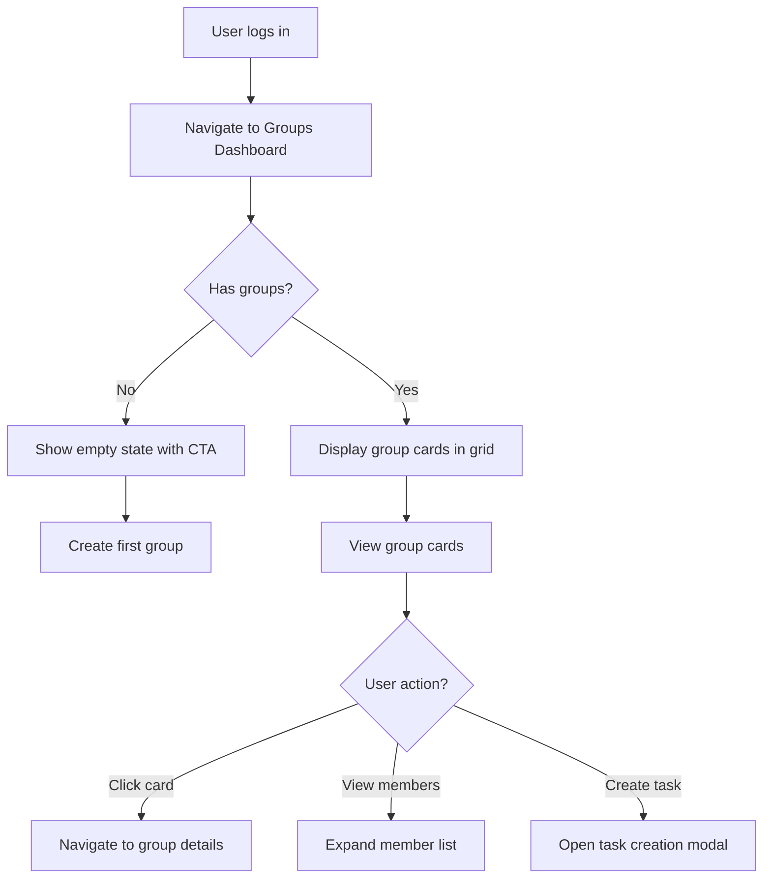
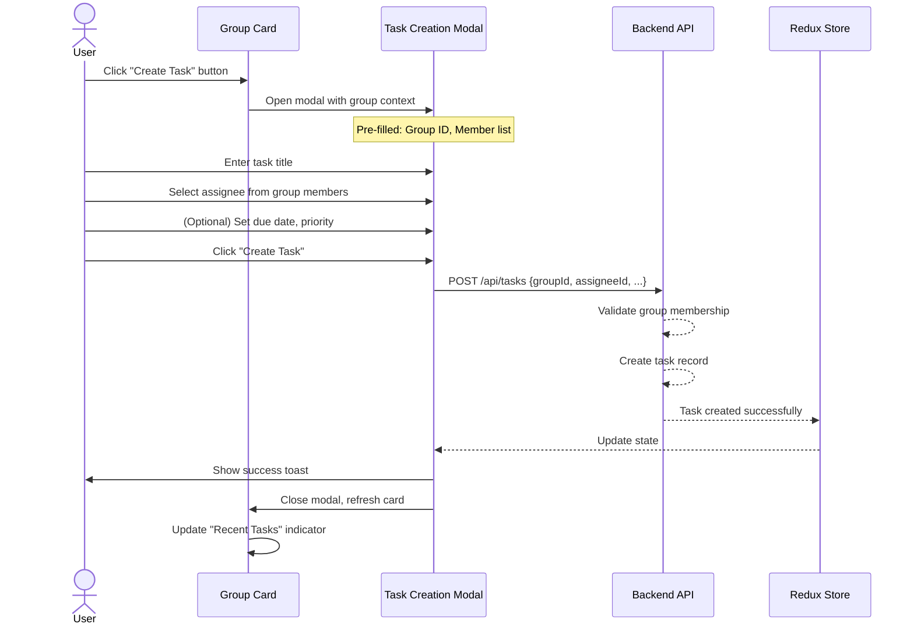

# Product Requirements Document (PRD)
## FR-024: Groups Overview & Task Creation Dashboard

**Version:** 1.0  
**Date:** December 17, 2025  
**Owner:** Product Team  
**Status:** Draft

---

## 1. Executive Summary

This feature introduces a **Groups Overview Dashboard** that displays all groups a user belongs to as visual cards, showcasing member details, admin hierarchy, and enabling quick task creation directly from each group context. This streamlines task assignment workflows by eliminating navigation overhead and providing immediate visibility into group composition and administrative structure.

**Expected Impact:**
- Reduce time-to-task-creation by 40% through contextual task creation
- Improve group awareness and collaboration visibility
- Simplify member identification for task assignment
- Enhance user engagement with visual, card-based group representation

---

## 2. Problem Statement

**Current Pain Points:**
1. **Navigation Friction:** Users must navigate away from group overview to create tasks, breaking their mental context
2. **Limited Group Visibility:** No central view showing all groups a user belongs to with member composition
3. **Member Discovery Challenge:** Users struggle to remember who's in which group and who has admin privileges
4. **Task Assignment Complexity:** Assigning tasks requires multiple steps and context switches

**User Impact:**
- Task creation requires 3-5 clicks and navigation across multiple pages
- Users cannot quickly see group membership distribution across their groups
- Admin identification is not immediately visible, causing confusion about who can manage group settings
- Inefficient workflow for managing multiple group memberships

---

## 3. Goals & Non-Goals

### Goals
1. **Centralized Group View:** Display all user's groups in a single, scannable dashboard
2. **Visual Hierarchy:** Clearly distinguish admins from regular members in each group card
3. **Contextual Task Creation:** Enable one-click task creation from any group card
4. **Member Visibility:** Show active members with visual indicators (avatars, roles)
5. **Quick Actions:** Provide shortcuts for common group operations (invite, settings, tasks)

### Non-Goals
1. **Group Analytics:** Detailed statistics, charts, or performance metrics (separate feature)
2. **Inline Task Editing:** Full task management within cards (tasks remain in dedicated views)
3. **Group Chat/Messaging:** Real-time communication features
4. **Calendar Integration:** Task scheduling or calendar views
5. **Multi-Group Task Assignment:** Tasks spanning multiple groups (v1 scope limitation)

---

## 4. User Flows

### Flow 1: View Groups Overview



**Key Actors:**
- Regular User (Member)
- Group Admin
- New User (no groups yet)

**Main Steps:**
1. User accesses Groups Dashboard from main navigation
2. System fetches all groups where `user.id` exists in `members[]`
3. Groups rendered as cards in responsive grid (3 columns desktop, 1 column mobile)
4. Each card displays:
   - Group name & description
   - Member count badge
   - Admin avatars (highlighted with crown icon)
   - Regular member avatars (up to 5, then +N indicator)
   - Last activity timestamp
   - Quick action buttons (Create Task, Invite, Settings)

**Decision Points:**
- Empty state triggers onboarding flow for new users
- Admin users see additional "Settings" action on their group cards
- Member list truncates after 8 avatars with "+N more" indicator

**Edge Cases:**
- User is admin of some groups but not others → conditional rendering of admin actions
- Groups with 1 member (just the user) → show "Invite members" CTA prominently
- User removed from group while viewing → card disappears with toast notification
- Slow network → skeleton loading states for cards

---

### Flow 2: Create Task from Group Card



**Key Actors:**
- Task Creator (any group member)
- Task Assignee (selected from group members)
- Backend API (validation & persistence)

**Main Steps:**
1. User clicks "Create Task" button on group card
2. Modal opens with group context pre-populated
3. Assignee dropdown auto-populated with group members (name + avatar)
4. Admins highlighted with badge in dropdown
5. User fills task details:
   - Title (required, 3-100 chars)
   - Description (optional, max 1000 chars)
   - Assignee (required, dropdown from group members)
   - Due date (optional, date picker)
   - Priority (optional, High/Medium/Low)
6. Client validates inputs before submission
7. API validates:
   - User is member of group
   - Assignee is member of group
   - Group exists and is active
8. Task created and linked to group
9. Success feedback: toast notification + card update

**Decision Points:**
- If assignee dropdown empty (user only member) → prompt to invite members first
- If user has permission issues → 403 error with clear message
- Due date validation: cannot be in the past

**Edge Cases:**
- Network error during creation → retry mechanism with exponential backoff
- Assignee removed from group before task created → validation error, prompt to select new assignee
- Concurrent task creation → each succeeds independently, no conflicts
- Offline mode → queue task for creation when online (future enhancement)

---

### Flow 3: Member List Interaction

```mermaid
flowchart TD
    A[User views group card] --> B{Member count}
    B -->|≤8 members| C[Show all avatars inline]
    B -->|>8 members| D[Show 8 avatars + "+N more"]
    C --> E{User action}
    D --> F[Click "+N more"]
    F --> G[Expand full member list modal]
    E -->|Hover avatar| H[Show tooltip: Name + Role]
    E -->|Click avatar| I[View member profile]
    G --> J[Scrollable list with search]
    J --> K{Admin user?}
    K -->|Yes| L[Show Promote/Remove actions]
    K -->|No| M[View-only list]
```

**Key Actors:**
- Group Member (viewing)
- Group Admin (viewing + actions)

**Main Steps:**
1. Card displays up to 8 member avatars
2. Admins shown first with crown icon overlay
3. Remaining members shown in alphabetical order
4. "+N more" button expands to full member modal
5. Modal features:
   - Search/filter members
   - Role badges (Admin/Member)
   - Member since date
   - Admin-only: Promote/Remove buttons
6. Hover any avatar shows tooltip: "John Doe (Admin)"
7. Click avatar navigates to member profile (future: FR-025)

**Decision Points:**
- Admin badge display: crown icon + "Admin" text on hover
- Member ordering: Admins first, then alphabetical
- Mobile: Always show "+N" after 4 avatars to save space

**Edge Cases:**
- All members are admins → all show crown icons
- Member has no avatar → show initials in colored circle
- Member name too long → truncate with ellipsis, full name in tooltip
- Searching with no results → "No members match your search"

---

## 5. Functional Requirements

### FR-024.1: Groups Overview Dashboard
**Priority:** P0 (Must Have)

- **FR-024.1.1:** Display all groups user is a member of as cards in a responsive grid
  - Desktop: 3 columns
  - Tablet: 2 columns  
  - Mobile: 1 column (stacked)
  
- **FR-024.1.2:** Each group card must display:
  - Group name (max 50 chars, truncate with ellipsis)
  - Group description (max 100 chars preview, expandable)
  - Member count badge (e.g., "12 members")
  - Last activity timestamp (relative: "2 hours ago")
  - Admin avatars with crown icon (up to 3)
  - Regular member avatars (up to 5)
  - "+N more" indicator if total members > 8
  - Quick action buttons: "Create Task", "Invite", "Settings" (admin only)

- **FR-024.1.3:** Empty state for users with no groups
  - Illustration + message: "You're not part of any groups yet"
  - CTA button: "Create Your First Group"
  - Alternative action: "Join Group with Code"

- **FR-024.1.4:** Loading states
  - Skeleton cards while data fetches
  - Minimum 3 skeleton cards to avoid layout shift

- **FR-024.1.5:** Error states
  - Network error: Retry button with exponential backoff
  - Auth error: Redirect to login
  - Server error: "Something went wrong" with support link

### FR-024.2: Member Visualization
**Priority:** P0 (Must Have)

- **FR-024.2.1:** Avatar display rules
  - Show initials if no avatar uploaded (2 letters)
  - Use consistent color scheme based on user ID hash
  - 40px diameter on desktop, 32px on mobile
  - Overlap avatars slightly (z-index stacking)

- **FR-024.2.2:** Admin identification
  - Crown icon overlay on avatar (top-right corner)
  - "Admin" badge in expanded member list
  - Admins always displayed first in member list

- **FR-024.2.3:** Member tooltip on hover
  - Display: Full name + role
  - Delay: 500ms hover time
  - Position: Above avatar, centered

- **FR-024.2.4:** Expanded member list modal
  - Triggered by "+N more" click
  - Scrollable list with search bar at top
  - Each row shows: avatar, name, role badge, "Member since" date
  - Admin actions visible only to group admins: Promote, Remove buttons
  - Modal dismisses on outside click or ESC key

### FR-024.3: Task Creation from Group Card
**Priority:** P0 (Must Have)

- **FR-024.3.1:** "Create Task" button on every group card
  - Visible to all group members
  - Opens task creation modal with group context

- **FR-024.3.2:** Task creation modal fields
  - **Required:**
    - Task title (3-100 characters)
    - Assignee (dropdown pre-populated with group members)
  - **Optional:**
    - Description (WYSIWYG editor, max 1000 chars)
    - Due date (date picker, cannot be past date)
    - Priority (High/Medium/Low radio buttons)
    - Tags/Categories (multi-select from group's categories)

- **FR-024.3.3:** Assignee dropdown features
  - Searchable by name
  - Shows avatar + full name + role badge
  - Admins highlighted with different background color
  - Defaults to "Unassigned" option

- **FR-024.3.4:** Validation rules
  - Title: 3-100 chars, no special chars except - _ .
  - Assignee: Must be active group member
  - Due date: Must be future date/time
  - Priority: Defaults to Medium if not selected

- **FR-024.3.5:** Success handling
  - Display toast: "Task created and assigned to {assignee}"
  - Close modal automatically
  - Refresh group card to show task count update
  - Optionally redirect to task detail page

- **FR-024.3.6:** Error handling
  - Inline validation errors below each field
  - API errors displayed as alert banner in modal
  - Retry button for network failures
  - Prevent double-submission with loading state

### FR-024.4: Quick Actions
**Priority:** P1 (Should Have)

- **FR-024.4.1:** "Invite" button (visible to all members)
  - Opens invite modal with group context
  - Allows email invitation or shareable link
  - Checks member limit (20 max) before showing

- **FR-024.4.2:** "Settings" button (admin only)
  - Navigate to group settings page
  - Edit group name, description, timezone, language
  - Manage categories, templates, permissions

- **FR-024.4.3:** Card context menu (right-click or three-dot icon)
  - "View Details" - navigate to full group page
  - "Leave Group" - confirmation modal (disabled for last admin)
  - "Mute Notifications" - toggle group notifications
  - Admin-only: "Delete Group" with double confirmation

### FR-024.5: Performance & UX Requirements
**Priority:** P0 (Must Have)

- **FR-024.5.1:** Page load performance
  - Initial cards render within 1 second on 3G connection
  - Pagination: Load 12 groups per page, lazy load more on scroll
  - Image optimization: avatars cached aggressively, lazy loaded

- **FR-024.5.2:** Real-time updates (via WebSocket or polling)
  - Group card updates when member joins/leaves
  - Task count updates when task created/completed
  - Badge shows "New Activity" indicator

- **FR-024.5.3:** Accessibility (WCAG 2.1 AA)
  - Keyboard navigation: Tab through cards, actions
  - Screen reader labels: Announce group name, member count, role
  - Focus indicators on all interactive elements
  - Color contrast ratio: 4.5:1 minimum

- **FR-024.5.4:** Responsive design breakpoints
  - Desktop: ≥1024px (3 columns)
  - Tablet: 768-1023px (2 columns)
  - Mobile: <768px (1 column, simplified card layout)

---

## 6. Technical Considerations

### 6.1 Architecture & Data Model

**Frontend Architecture:**
- **Component Structure:**
  ```
  /web/src/features/groups-dashboard/
    ├── pages/
    │   └── GroupsDashboardPage.tsx (main container)
    ├── components/
    │   ├── GroupCard.tsx (individual card)
    │   ├── MemberAvatarStack.tsx (avatar display)
    │   ├── MemberListModal.tsx (expanded member list)
    │   ├── CreateTaskFromGroupModal.tsx (task creation)
    │   └── EmptyGroupsState.tsx (no groups view)
    ├── hooks/
    │   ├── useGroupsDashboard.ts (data fetching)
    │   └── useCreateTaskFromGroup.ts (task creation logic)
    └── groupsDashboardSlice.ts (Redux state)
  ```

- **State Management (Redux):**
  ```typescript
  interface GroupsDashboardState {
    groups: GroupCard[];
    loading: boolean;
    error: string | null;
    selectedGroupForTask: string | null;
    memberModalOpen: boolean;
    currentPage: number;
    hasMore: boolean;
  }
  
  interface GroupCard {
    id: string;
    name: string;
    description: string;
    memberCount: number;
    admins: MemberSummary[];
    recentMembers: MemberSummary[];
    lastActivity: Date;
    taskCount: number;
    myRole: 'Admin' | 'Member';
  }
  
  interface MemberSummary {
    userId: string;
    firstName: string;
    lastName: string;
    avatarUrl: string | null;
    role: 'Admin' | 'Member';
    joinedAt: Date;
  }
  ```

**Backend API Endpoints:**

1. **GET /api/groups/dashboard**
   - Returns: Paginated list of groups with member summaries
   - Query params: `page`, `pageSize` (default 12)
   - Response: `{ groups: GroupCard[], total: number, hasMore: boolean }`
   - Optimization: Aggregate query to fetch groups + member counts in single DB call

2. **GET /api/groups/{groupId}/members**
   - Returns: Full member list with details
   - Auth: Requires group membership
   - Response: `{ members: Member[], admins: Member[] }`

3. **POST /api/tasks**
   - Body: `{ groupId, title, description, assigneeId, dueDate, priority }`
   - Validation: Verify creator and assignee are group members
   - Response: `{ task: Task }`
   - Side effects: Increment group task count, send notification to assignee

**Database Considerations:**

- **MongoDB Schema Optimization:**
  ```javascript
  // Groups collection
  {
    _id: ObjectId,
    name: string,
    description: string,
    members: [
      { userId: ObjectId, role: 'Admin'|'Member', joinedAt: Date }
    ],
    taskCount: number, // denormalized for performance
    lastActivity: Date, // updated on any group action
    createdAt: Date,
    updatedAt: Date
  }
  
  // Index on members.userId for fast user→groups lookup
  db.groups.createIndex({ "members.userId": 1 })
  
  // Index on lastActivity for sorting recent groups
  db.groups.createIndex({ "members.userId": 1, "lastActivity": -1 })
  ```

- **Performance Optimizations:**
  - Denormalize `taskCount` in groups collection (avoid join on every dashboard load)
  - Cache group cards in Redis (TTL: 5 minutes, invalidate on member/task changes)
  - Use MongoDB aggregation pipeline to fetch member details in single query:
    ```javascript
    db.groups.aggregate([
      { $match: { "members.userId": currentUserId } },
      { $lookup: { from: "users", localField: "members.userId", foreignField: "_id", as: "memberDetails" } },
      { $project: { /* select only needed fields */ } }
    ])
    ```

### 6.2 Integrations & Dependencies

**Internal Dependencies:**
- **Groups Service (FR-002):** Already implemented
- **Task Service:** Requires extension to accept `groupId` and `assigneeId`
- **User Service:** Fetch member details (name, avatar)
- **Notification Service:** Send task assignment notifications

**External Dependencies:**
- None (fully internal feature)

**Third-Party Libraries:**
- **react-virtualized** or **react-window:** Efficient rendering of large member lists
- **date-fns:** Date formatting for "Last activity" timestamps
- **react-hot-toast:** Success/error notifications
- **framer-motion:** Card animations and modal transitions (optional)

### 6.3 Security Considerations

1. **Authorization Checks:**
   - Verify user is member of group before showing group card
   - Verify user is admin before showing admin actions
   - Validate assignee is active group member before task creation

2. **Data Exposure:**
   - Only return member data for groups user belongs to
   - Filter sensitive user data (email, phone) from member summaries
   - Admin-only fields (invitation codes) hidden from regular members

3. **Rate Limiting:**
   - Task creation: Max 10 tasks per minute per user
   - Dashboard refresh: Max 20 requests per minute per user

4. **Input Validation:**
   - Sanitize task title/description to prevent XSS
   - Validate UUIDs for groupId, userId to prevent injection

### 6.4 Scalability & Performance

**Expected Load:**
- Assume average user is in 3-5 groups
- Peak load: 1000 concurrent users viewing dashboard
- 100 tasks created per minute system-wide

**Scaling Strategy:**
- **Horizontal Scaling:** Backend APIs are stateless, scale with load balancer
- **Database Optimization:**
  - Read replicas for dashboard queries
  - Caching layer (Redis) reduces DB load by 70%
- **CDN:** Serve avatar images from CDN (CloudFront or Cloudflare)
- **Lazy Loading:** Load group cards on-demand (infinite scroll pagination)

**Performance Targets:**
- Dashboard initial load: <1 second (p95)
- Task creation: <500ms (p95)
- Member list expansion: <300ms
- Real-time update latency: <2 seconds

---

## 7. Success Metrics

### User Engagement Metrics
1. **Dashboard Adoption Rate**
   - Target: 80% of active users visit dashboard at least once per week
   - Measurement: Track page views `/groups/dashboard`

2. **Task Creation via Cards**
   - Target: 60% of tasks created via group card modal (vs navigating to separate task page)
   - Measurement: Tag task creation events with `source: 'group_card'`

3. **Member Interaction**
   - Target: 40% of users expand member list at least once per session
   - Measurement: Track "View All Members" modal opens

### Performance Metrics
4. **Page Load Time**
   - Target: <1 second for initial dashboard render (p95)
   - Measurement: Browser performance API, Lighthouse scores

5. **Task Creation Success Rate**
   - Target: >95% of task creation attempts succeed
   - Measurement: Track API response codes (201 success vs 4xx/5xx errors)

### Business Impact Metrics
6. **Time to Task Creation**
   - Target: Reduce by 40% compared to baseline (multi-page navigation)
   - Measurement: Funnel analysis from dashboard load → task submitted

7. **Group Awareness**
   - Target: 30% increase in users joining additional groups
   - Measurement: Track group join rate before/after dashboard launch

### Quality Metrics
8. **Bug Rate**
   - Target: <5 critical bugs in first 30 days post-launch
   - Measurement: Bug tracker (severity: critical)

9. **User Satisfaction**
   - Target: Net Promoter Score (NPS) >40 for dashboard feature
   - Measurement: In-app survey 2 weeks after release

---

## 8. Open Questions / Risks

### Open Questions

1. **Q: Should group cards show recent tasks preview?**
   - Option A: Show 3 most recent task titles below member avatars
   - Option B: Only show task count badge
   - **Decision needed by:** Design review (Dec 20, 2025)
   - **Impact:** Affects card height and information density

2. **Q: What happens when user is removed from group while viewing dashboard?**
   - Option A: Card disappears immediately with toast notification
   - Option B: Card grayed out with "You were removed" message, manual dismiss
   - **Decision needed by:** UX review (Dec 22, 2025)
   - **Impact:** Real-time sync complexity

3. **Q: Should we allow assigning tasks to multiple members from card?**
   - Current scope: Single assignee only
   - Future enhancement: Multi-assignee with sub-tasks
   - **Decision needed by:** Product roadmap review (Jan 2026)
   - **Impact:** API design, database schema

4. **Q: How to handle groups with 20 members (at capacity)?**
   - Show "Group Full" badge on card?
   - Disable "Invite" button?
   - **Decision needed by:** Product review (Dec 23, 2025)
   - **Impact:** UI design, user expectations

5. **Q: Should dashboard be default landing page after login?**
   - Alternative: Dashboard as opt-in, traditional "My Tasks" remains default
   - **Decision needed by:** User research findings (Dec 28, 2025)
   - **Impact:** Onboarding flow, user expectations

### Risks

| Risk | Likelihood | Impact | Mitigation Strategy |
|------|-----------|--------|---------------------|
| **Performance degradation with 20+ groups per user** | Medium | High | Implement pagination, lazy loading, aggressive caching |
| **MongoDB query complexity for member aggregation** | Low | High | Use aggregation pipeline, add indexes, benchmark with 10K groups |
| **User confusion with too many groups** | High | Medium | Add search/filter, favorites, group categories |
| **Task creation conflicts (duplicate assignments)** | Low | Low | Add unique constraint on (groupId, title, assigneeId, createdAt) |
| **Avatar image loading delays** | Medium | Medium | Use CDN, aggressive caching, preload avatars, fallback to initials |
| **Mobile viewport too cramped with card design** | Medium | High | Simplify mobile card layout, vertical stacking, fewer elements |
| **Real-time updates causing UI flicker** | Low | Medium | Debounce updates, use optimistic UI, smooth animations |
| **Scope creep (adding analytics, charts)** | High | Medium | Strictly defer non-MVP features to Phase 2, maintain focus |

### Assumptions

1. Users typically belong to 1-5 groups (based on current data analysis)
2. Average group has 5-8 members
3. Most tasks assigned to 1 person (not multi-assignee)
4. Users check dashboard 2-3 times per day
5. Avatar images are <50KB each (optimized)
6. Backend can handle 1000 concurrent dashboard requests
7. MongoDB can serve aggregated member data in <200ms
8. Existing task creation API can be extended to accept `groupId`

### Dependencies to Validate Before Development

- [ ] Confirm task API supports `groupId` parameter (check with backend team)
- [ ] Verify MongoDB indexes exist on `members.userId` (check with DevOps)
- [ ] Ensure Redis cache layer is configured for production (check with infrastructure)
- [ ] Validate avatar storage CDN is set up (check with frontend team)
- [ ] Confirm notification service can handle task assignment events (check with notifications team)

---

## 9. Appendix: Wireframes & Mockups

### Desktop Layout (1920x1080)

```
┌─────────────────────────────────────────────────────────────────┐
│  TasksTracker                                      🔔  👤 Doron  │
├─────────────────────────────────────────────────────────────────┤
│  [Dashboard] [My Tasks] [Groups] [Calendar] [Settings]          │
├─────────────────────────────────────────────────────────────────┤
│                                                                   │
│  My Groups (5)                      [+ Create Group] [Search 🔍] │
│  ═══════════════════════════════════════════════════════════════│
│                                                                   │
│  ┌──────────────┐  ┌──────────────┐  ┌──────────────┐          │
│  │ Family Tasks │  │ Work Team    │  │ Book Club    │          │
│  │ 👑👤👤👤      │  │ 👑👑👤👤👤    │  │ 👤👤👤        │          │
│  │ 8 members    │  │ 12 members   │  │ 5 members    │          │
│  │ 15 tasks     │  │ 23 tasks     │  │ 3 tasks      │          │
│  │ 2h ago       │  │ Active now   │  │ 1 day ago    │          │
│  │              │  │              │  │              │          │
│  │ [Create Task]│  │ [Create Task]│  │ [Create Task]│          │
│  │ [Invite]     │  │ [Invite]     │  │ [Invite] [⚙]│          │
│  └──────────────┘  └──────────────┘  └──────────────┘          │
│                                                                   │
│  ┌──────────────┐  ┌──────────────┐                             │
│  │ Roommates    │  │ Study Group  │                             │
│  │ 👑👤👤        │  │ 👤👤👤👤      │                             │
│  │ ...          │  │ ...          │                             │
└─────────────────────────────────────────────────────────────────┘
```

### Mobile Layout (375x667)

```
┌───────────────────┐
│ TasksTracker  ☰   │
├───────────────────┤
│ My Groups (5)     │
│ [Search 🔍]       │
├───────────────────┤
│                   │
│ ┌───────────────┐ │
│ │ Family Tasks  │ │
│ │ 👑👤👤👤 +4    │ │
│ │ 8 members     │ │
│ │ [Create Task] │ │
│ │ [Invite]      │ │
│ └───────────────┘ │
│                   │
│ ┌───────────────┐ │
│ │ Work Team     │ │
│ │ 👑👑👤👤 +8    │ │
│ │ 12 members    │ │
│ │ [Create Task] │ │
│ │ [Invite] [⚙]  │ │
│ └───────────────┘ │
│                   │
│ ...               │
└───────────────────┘
```

### Task Creation Modal

```
┌──────────────────────────────────────────┐
│ Create Task in "Family Tasks"       [✕] │
├──────────────────────────────────────────┤
│                                          │
│ Task Title *                             │
│ ┌──────────────────────────────────────┐ │
│ │ Pick up groceries                    │ │
│ └──────────────────────────────────────┘ │
│                                          │
│ Assign To *                              │
│ ┌──────────────────────────────────────┐ │
│ │ 👤 John Doe (Admin) ▼                │ │
│ └──────────────────────────────────────┘ │
│                                          │
│ Due Date                                 │
│ ┌──────────────────────────────────────┐ │
│ │ 📅 Dec 20, 2025   ⏰ 3:00 PM        │ │
│ └──────────────────────────────────────┘ │
│                                          │
│ Priority                                 │
│ ○ High  ⦿ Medium  ○ Low                 │
│                                          │
│ Description                              │
│ ┌──────────────────────────────────────┐ │
│ │ Need milk, bread, eggs...            │ │
│ │                                      │ │
│ └──────────────────────────────────────┘ │
│                                          │
│           [Cancel] [Create Task]         │
└──────────────────────────────────────────┘
```

---

**Document Status:** ✅ Ready for Review  
**Next Steps:**
1. Design review session (Dec 19, 2025)
2. Technical feasibility assessment (Dec 20, 2025)
3. User research validation (Dec 21-22, 2025)
4. Final approval and sprint planning (Dec 23, 2025)
5. Development kickoff (Jan 2, 2026)
