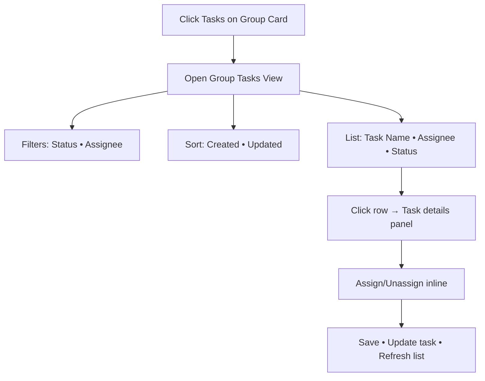

# Product Requirements Document (PRD)
## FR-025: Group Members & Tasks from Group Card

**Version:** 1.0  
**Date:** December 17, 2025  
**Owner:** Product Team  
**Status:** Draft

---

## 1. Executive Summary
This epic adds two contextual capabilities on the Groups Dashboard:
- Members Modal: open from group card to view members and invites, add (invite via email), remove members, and view roles and invite statuses.
- Group Tasks View: open from group card to see all tasks in the group with filters (status, assignee), sorting (created/updated), and inline assign/unassign.

Impact: Reduces navigation friction, clarifies invite lifecycle, and accelerates group task triage.

---

## 2. Problem Statement
- Membership management is fragmented; no consolidated view of members and invite states.
- Task triage requires navigating to separate pages; assignment is slow.
- Lack of visibility into invite status leads to duplicate invites and onboarding delays.

---

## 3. Goals & Non-Goals

### Goals
- One-click access to members and tasks from the group card.
- Full invite lifecycle: send via email, track Pending/Joined/Declined, cancel/resend.
- Manage members: view first/last name, role (Admin/Member), joined date; remove with last-admin protection.
- Tasks triage: filter by status (Pending/InProgress/Completed), by assignee; sort by created/updated; assign/unassign inline.
- Enforce access control: Admins manage invites/members; Admins assign tasks; Members view and optionally self-assign (policy TBD).

### Non-Goals
- Role changes/promotion (display-only in this epic).
- Real-time updates (may follow later).
- Email template/branding overhaul (use existing or minimal templates).

---

## 4. User Flows

### Flow A: Members Modal (from Group Card)
```mermaid
flowchart TD
  A[Click Members on Group Card] --> B[Open Members Modal]
  B --> C[Members Tab]
  B --> D[Invites Tab]
  C --> C1[List members: First Last • Role • Joined]
  C1 --> C2[Remove member (Admin)]
  C2 --> C3{Is last admin?}
  C3 -- Yes --> C4[Block • Show warning]
  C3 -- No --> C5[Confirm • Remove • Refresh]
  D --> D1[List invites: Email • Status(Pending/Joined/Declined)]
  D1 --> D2[Resend • Cancel invite (Admin)]
  B --> E[Add Member]
  E --> E1[Enter Email]
  E1 --> E2[Validate • Create Invite]
  E2 --> E3[Send Email • Status=Pending]
```
- Actors: Admin (invite/remove/resend/cancel), Member (view-only)
- Decision points: last-admin protection; email validity; duplicate pending invite
- Edge cases: already a member; already invited; expired invite

### Flow B: Group Tasks View (from Group Card)

- Actors: Admin (full control), Member (view; self-assign TBD)
- Edge cases: no tasks (empty state); large lists (pagination); stale filters

---

## 5. Functional Requirements

### Members Modal
- Open from group card "Members".
- Tabs: Members, Invites.
- Members tab shows: First Name, Last Name, Role (Admin/Member), Joined date.
- Invites tab shows: Email, Status (Pending/Joined/Declined), InvitedAt, InvitedBy.
- Add Member (Admin): validate email; prevent duplicates; create invite; send email; show success.
- Remove Member (Admin): confirm; block if last admin; update server; refresh lists.
- Resend/Cancel Invite (Admin): only when Pending; update status accordingly.
- Access control: Only Admins see/change invite/remove actions; Members view-only.

### Group Tasks View
- Open from group card "Tasks".
- List fields: Task Name, Assignee (avatar/initials + name), Status chip.
- Filters: Status (Pending/InProgress/Completed), Assignee (All + members).
- Sort: CreatedDate (asc/desc), UpdatedDate (asc/desc).
- Interactions: click row → details panel; assign/unassign inline (Admin); optional self-assign policy.
- Persist filters/sort per group (session/local storage).

### Invite Lifecycle
- States: Pending → Joined (on accept) → Declined; admin Cancel; optional Expired.
- Resend allowed while Pending; increments resend count.
- Cancel allowed while Pending; hides from default view.

---

## 6. Technical Considerations
- Data model: introduce `invites` collection (id, groupId, email, status, token, invitedBy, invitedAt, respondedAt, lastSentAt, sendCount).
- Indexes: `invites.groupId+status`, `invites.email+groupId` (prevent duplicate pending), `invites.token`.
- Backend: Controllers → Services → Repositories (MongoDB). Enforce last-admin protection and duplicate invite checks. No new external integrations beyond existing email infrastructure.
- Email: use existing email infra; templates TBD; ensure no secrets logged.
- Frontend: React + TS + Tailwind; functional components; RTK Query for data fetching; invalidate caches on mutations.
- AuthZ: Admin-only for invite/remove/assign; Member view; optional self-assign policy.
- Performance: batch user hydration; reuse dashboard caching where possible; paginate long lists.

---

## 7. Success Metrics
- Admin action time: invite < 5s; member removal < 3s.
- Error rate: invite send < 1% over 7 days.
- Triage efficiency: 50% fewer navigations for task assignment flows.
- Adoption: 80% of active groups use Members/Tasks modals within 2 weeks.
- Performance: P95 < 150ms for list queries; < 300ms for assign/unassign.

---

## 8. Open Questions / Risks
- Self-assign policy for non-admins (allowed/not; constraints)?
- Invite expiry default (e.g., 14/30 days) and UX for expired.
- Email template localization; sender domain.
- Rate limiting for invites/resends.
- Need for real-time updates (SignalR) in v1 or follow-up.

---

## 9. Related Documents
- [docs/tech/invites-data-model.md](docs/tech/invites-data-model.md)
- [docs/frontend/members-tasks-components.md](docs/frontend/members-tasks-components.md)
- Prior context: [docs/prds/FR-024-groups-overview-task-creation.md](docs/prds/FR-024-groups-overview-task-creation.md)
