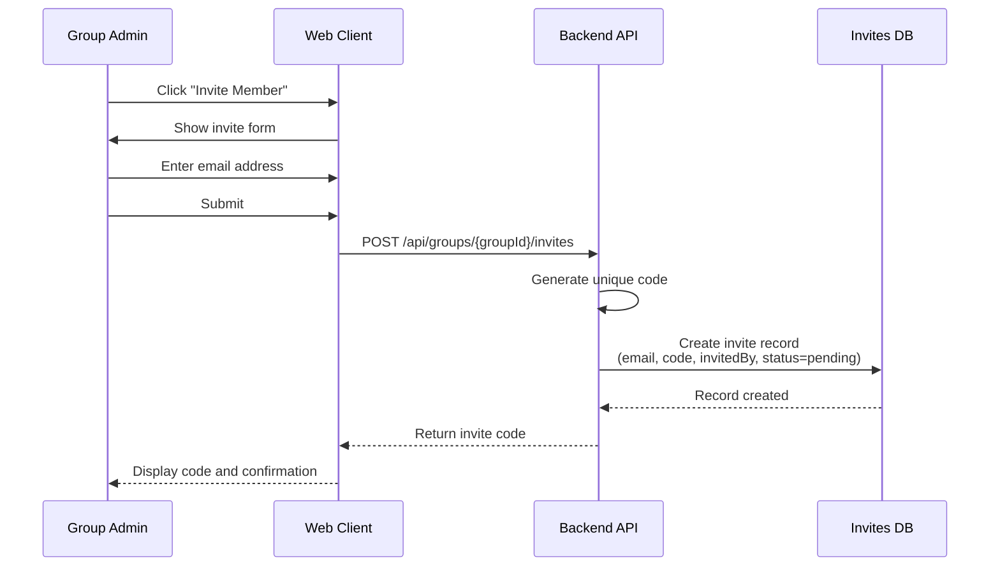
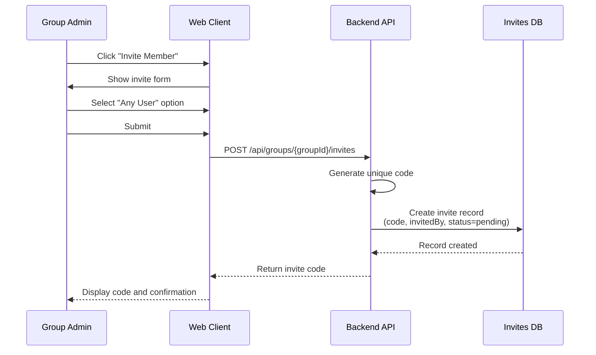
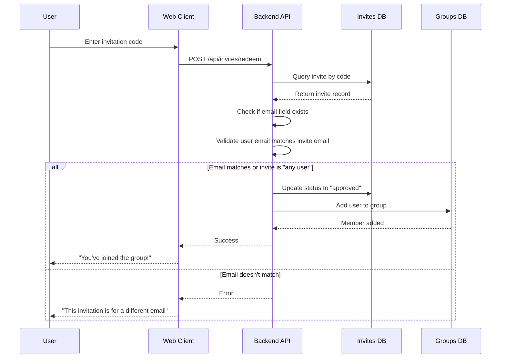
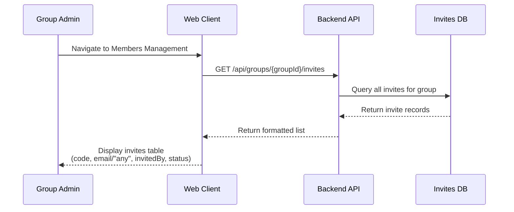
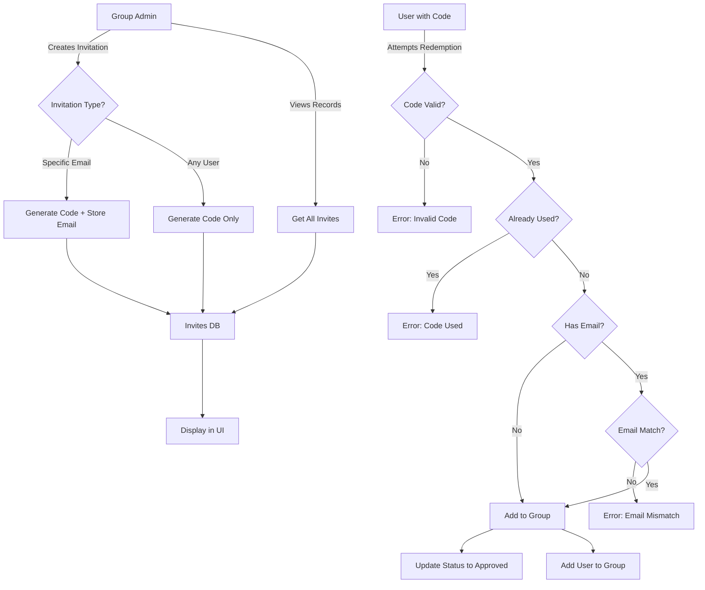

# Product Requirements Document (PRD)
## FR-026: Group Member Invitation System

---

## 1. Executive Summary

This feature enables group administrators to invite new members to their groups through a flexible invitation system. Administrators can generate invitation codes that are either specific to an email address or open to any user. The system tracks invitation status, validates usage, and ensures that invitation codes can only be used once after approval. This capability streamlines group onboarding while maintaining control over group membership.

---

## 2. Problem Statement

Currently, there is no structured way for group administrators to invite and onboard new members. Without an invitation system:
- Group admins cannot pre-authorize specific users to join their groups
- There's no mechanism to track pending invitations
- No validation exists to ensure invitations are used appropriately
- Administrators lack visibility into who invited whom and when

---

## 3. Goals & Non-Goals

### Goals
- Enable group admins to generate two types of invitation codes: email-specific and open (any user)
- Track all invitations with relevant metadata (inviter, invitee, status, timestamp)
- Validate invitation codes during redemption based on type and email match
- Mark invitations as approved and prevent reuse once successfully redeemed
- Provide UI for admins to view and manage all invitations for their group

### Non-Goals
- Invitation expiration/time limits (future enhancement)
- Invitation revocation before use (future enhancement)
- Email notifications when invitations are created or used
- Bulk invitation generation
- Invitation analytics or usage reports

---

## 4. User Flows

### Flow 1: Group Admin Creates Specific Email Invitation



**Key Steps:**
1. Admin accesses member management section
2. Admin selects "Invite Member" option
3. Admin enters specific email address
4. System generates unique invitation code
5. System creates invitation record with email, code, invitedBy (admin's user ID), and status (pending)
6. Admin receives invitation code to share

**Edge Cases:**
- Email already a group member → show warning
- Email has pending invitation → show existing code or allow new one
- Invalid email format → validation error

---

### Flow 2: Group Admin Creates Open (Any User) Invitation



**Key Steps:**
1. Admin accesses member management section
2. Admin selects "Invite Member" option
3. Admin chooses "Any User" (no email specified)
4. System generates unique invitation code
5. System creates invitation record with code, invitedBy (admin's user ID), status (pending), but NO email
6. Admin receives invitation code to share

---

### Flow 3: User Redeems Invitation Code (Specific Email)



**Key Steps:**
1. User receives invitation code from admin
2. User enters code in the application
3. System retrieves invitation record by code
4. System checks if invitation has specific email:
   - **If specific email:** validates user's email matches invitation email
   - **If "any user":** proceeds without email check
5. If validation passes:
   - Update invitation status to "approved"
   - Add user to group
   - Mark code as used (cannot be reused)
6. User is now a group member

**Edge Cases:**
- Code doesn't exist → "Invalid invitation code"
- Code already used (status = approved) → "This invitation has already been used"
- Email mismatch → "This invitation is for another email address"
- User already in group → "You're already a member of this group"

---

### Flow 4: Admin Views Invitation Records



**Key Steps:**
1. Admin navigates to members management section
2. System displays "Invitations" tab or section
3. System shows all invitation records with:
   - Invitation code
   - Target email (or "Any User" if not specified)
   - Invited by (admin name/email)
   - Status (pending/approved)
   - Created date
4. Admin can view history and status of all invitations

---

## 5. Functional Requirements

### FR-026.1: Create Specific Email Invitation
- Group admin can generate invitation code for specific email address
- System generates unique, random invitation code (e.g., 8-12 alphanumeric characters)
- System creates database record with:
  - `groupId`: ID of the group
  - `code`: generated invitation code
  - `email`: specific email address
  - `invitedBy`: user ID of admin who created invitation
  - `status`: "pending" (default)
  - `createdAt`: timestamp
  - `usedAt`: null initially

### FR-026.2: Create Open (Any User) Invitation
- Group admin can generate invitation code for any user
- System generates unique, random invitation code
- System creates database record with:
  - `groupId`: ID of the group
  - `code`: generated invitation code
  - `email`: null or undefined
  - `invitedBy`: user ID of admin who created invitation
  - `status`: "pending" (default)
  - `createdAt`: timestamp
  - `usedAt`: null initially

### FR-026.3: Redeem Invitation Code
- Any authenticated user can attempt to redeem an invitation code
- System validates:
  - Code exists in database
  - Code status is "pending" (not already used)
  - If email is specified: user's email matches invitation email
  - If email is null/undefined: any user can redeem
- On successful validation:
  - Update invitation status to "approved"
  - Set `usedAt` timestamp
  - Set `usedBy` to user ID of redeemer
  - Add user as member of the group
- Code cannot be reused after approval

### FR-026.4: View Invitation Records
- Group admin can view all invitations for their group
- Display shows:
  - Invitation code
  - Target email (or "Any User" label if null)
  - Invited by (name or email of admin)
  - Status (pending/approved)
  - Created date
  - Used date (if approved)
- Records sorted by creation date (newest first)

### FR-026.5: Authorization
- Only group admins can create invitations for their groups
- Only group admins can view invitation records for their groups
- Any authenticated user can attempt to redeem a code

---

## 6. Technical Considerations

### Database Schema

**Invites Collection:**
```typescript
{
  _id: ObjectId,
  groupId: ObjectId,           // Reference to groups collection
  code: string,                // Unique invitation code (indexed)
  email: string | null,        // Null for "any user" invitations
  invitedBy: ObjectId,         // User ID of admin who created
  status: "pending" | "approved",
  usedBy: ObjectId | null,     // User ID who redeemed (null if pending)
  createdAt: Date,
  usedAt: Date | null
}
```

**Indexes:**
- Unique index on `code`
- Compound index on `groupId` + `status` for queries
- Index on `groupId` for admin listing

### API Endpoints

**POST** `/api/groups/{groupId}/invites`
- Create new invitation (specific or any user)
- Request body: `{ email?: string }`
- Response: `{ code: string, expiresAt?: Date }`
- Auth: Requires group admin role

**POST** `/api/invites/redeem`
- Redeem invitation code
- Request body: `{ code: string }`
- Response: `{ groupId: string, groupName: string }`
- Auth: Requires authenticated user

**GET** `/api/groups/{groupId}/invites`
- List all invitations for group
- Query params: `status?: "pending" | "approved"`
- Response: Array of invitation records
- Auth: Requires group admin role

### Code Generation
- Use cryptographically secure random generation
- Format: 8-12 alphanumeric characters (e.g., "ABC123XYZ")
- Ensure uniqueness in database
- Consider using nanoid or similar library

### Validation Rules
- Email format validation for specific invitations
- Code must be unique across all groups
- User email from JWT/auth context for redemption validation
- Check group membership before adding user

### Error Handling
- Invalid code: 404 Not Found
- Already used code: 400 Bad Request with clear message
- Email mismatch: 403 Forbidden with clear message
- Already a member: 400 Bad Request
- Unauthorized admin actions: 403 Forbidden

---

## 7. Success Metrics

### Functional Metrics
- Group admins can successfully create both types of invitations
- Users can redeem valid codes and join groups
- Invitation codes are single-use only (cannot be reused after approval)
- Email-specific codes correctly reject wrong email addresses
- Admin UI displays all invitation records accurately

### Technical Metrics
- Invitation code generation has zero collisions
- Code redemption validation completes in <200ms
- Database queries properly use indexes for performance
- API endpoints return appropriate HTTP status codes

### User Experience Metrics
- Clear error messages guide users when redemption fails
- Admin UI clearly distinguishes between specific and "any user" invitations
- Invitation workflow requires minimal steps (2-3 clicks)

---

## 8. Open Questions / Risks

### Open Questions
1. **Code Format:** Should codes be human-readable (e.g., "JOIN-TEAM-ABC") or random alphanumeric?
2. **Invitation Limits:** Should there be a limit on how many pending invitations a group can have?
3. **Case Sensitivity:** Should invitation codes be case-sensitive or case-insensitive?
4. **Email Matching:** Should email matching be case-insensitive? Handle email aliases (e.g., Gmail +addressing)?
5. **Duplicate Invitations:** Can an admin create multiple pending invitations for the same email?
6. **UI Location:** Where exactly should invitations be managed in the members management UI?

### Risks
1. **Security:** Invitation codes could be shared publicly or leaked. Consider:
   - Rate limiting on redemption attempts
   - Optional expiration dates (future enhancement)
   - Ability to revoke unused codes (future enhancement)

2. **Scalability:** Large groups with many invitations may have performance issues. Consider:
   - Pagination for invitation listing
   - Archive old approved invitations after 30/60 days

3. **Email Privacy:** Displaying full email addresses in admin view may raise privacy concerns. Consider:
   - Partially masking emails (e.g., "j***@example.com")
   - Clear privacy policy

4. **User Confusion:** Users may not understand difference between specific and "any user" invitations. Consider:
   - Clear UI labels and help text
   - Visual distinction (icons, colors)

5. **Collision Risk:** Though unlikely, code generation collision could occur. Ensure:
   - Retry logic if code already exists
   - Monitor collision rate in production

---

## Appendix: Data Flow Diagram



---

**Document Version:** 1.0  
**Created:** December 17, 2025  
**Status:** Draft
