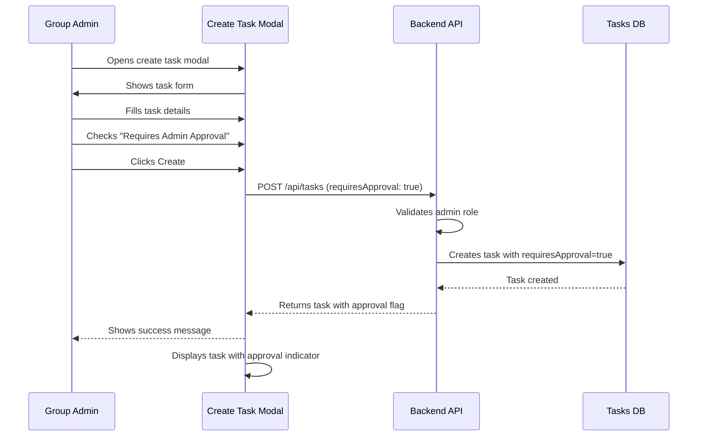
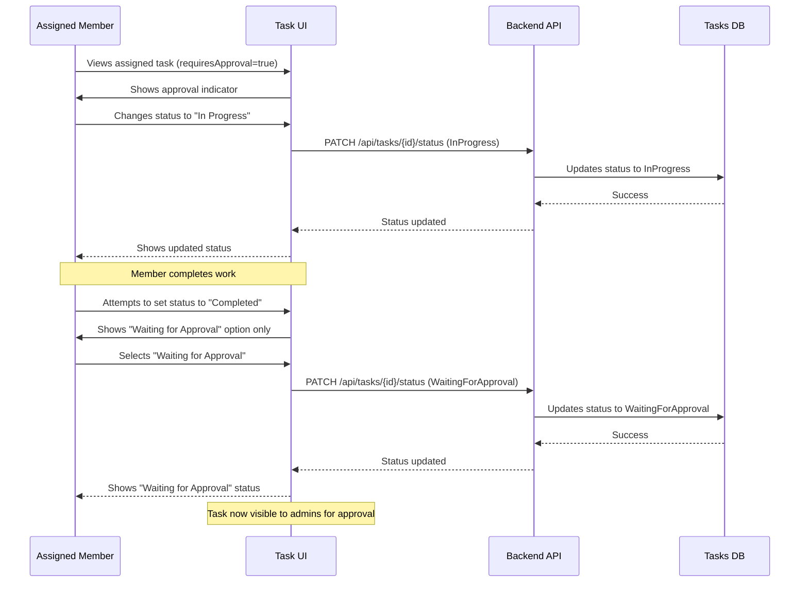
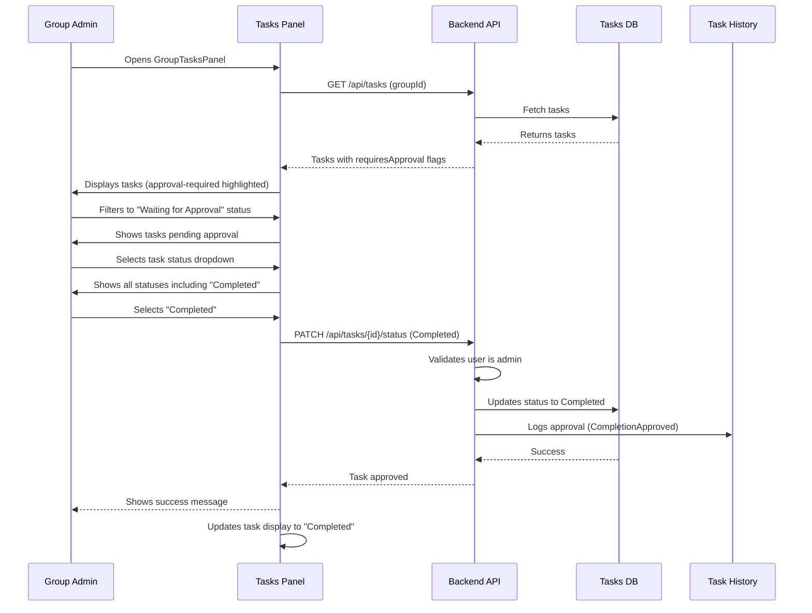
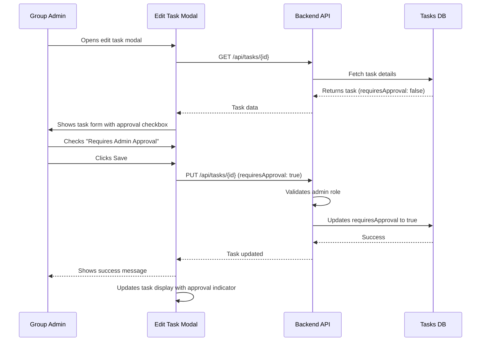

# Product Requirements Document (PRD)
## FR-028: Task Completion Admin Approval System

---

## 1. Executive Summary

This feature introduces an optional "requires admin approval" flag for tasks, allowing group administrators to designate specific tasks that require explicit admin approval before they can be marked as completed. When enabled, this flag modifies the task lifecycle by adding a "Waiting for Approval" status and restricting completion permissions to admins only. This capability provides administrators with greater control over task completion verification, particularly useful for high-stakes, quality-sensitive, or milestone tasks.

**Expected Impact:**
- Enhanced task quality control for critical assignments
- Clear administrative oversight for important deliverables
- Improved accountability through approval workflow
- Flexibility for admins to choose which tasks need verification

---

## 2. Problem Statement

Currently, all group members can mark their assigned tasks as "Completed" without any verification or approval process. This creates several challenges:

- **No Quality Gate:** There's no mechanism to verify that tasks are actually completed to the required standard
- **Lack of Oversight:** Admins cannot enforce review processes for critical or high-value tasks
- **No Approval Workflow:** Tasks marked as complete are immediately considered done without any validation
- **Insufficient Control:** Admins cannot differentiate between routine tasks and those requiring verification

These limitations make the system less suitable for scenarios where task completion needs validation, such as:
- Milestone deliverables
- Quality-sensitive work
- Tasks with financial implications
- Learning/training verification
- Compliance-related activities

---

## 3. Goals & Non-Goals

### Goals
1. **Enable Admin Control:** Allow group admins to designate tasks as "requires admin approval" during task creation
2. **Extend Task Lifecycle:** Add "Waiting for Approval" status for approval-required tasks
3. **Restrict Completion:** Ensure only admins can mark approval-required tasks as "Completed"
4. **Visual Differentiation:** Provide clear UI indicators for tasks requiring approval
5. **Backward Compatibility:** Maintain existing behavior for tasks without approval requirement
6. **Full-Stack Implementation:** Update database schema, API endpoints, and UI components

### Non-Goals
- **Rejection Workflow:** This PRD does not include task rejection/revision cycles (future enhancement)
- **Multi-Level Approvals:** Only single admin approval is supported (no approval chains)
- **Approval Comments:** No comment/feedback system for approvals (future enhancement)
- **Approval Notifications:** No push notifications or email alerts (future enhancement)
- **Approval Analytics:** No reporting on approval times or patterns (future enhancement)
- **Approval History:** Basic history only; no detailed approval timeline (covered by existing task history)
- **Auto-Approval Rules:** No automatic approval based on criteria

---

## 4. User Flows

### Flow 1: Admin Creates Task Requiring Approval



**Key Steps:**
1. Admin opens task creation modal
2. Fills in standard task details (name, assignee, difficulty, due date)
3. Toggles "Requires Admin Approval" checkbox (visible only to admins)
4. Submits task creation
5. Backend validates admin permissions
6. Task is created with `requiresApproval: true` flag
7. UI displays task with visual approval indicator

**Edge Cases:**
- Non-admin users don't see the approval checkbox
- Checkbox defaults to unchecked (false)
- API rejects approval flag from non-admin users

---

### Flow 2: Member Updates Approval-Required Task Status



**Key Steps:**
1. Member views task with approval requirement indicator
2. Member can change status to Pending or InProgress normally
3. When ready to complete, member sees only "Waiting for Approval" option
4. Member submits task for approval
5. Task status changes to "WaitingForApproval"
6. Task appears in admin review queue

**Edge Cases:**
- Members cannot directly mark approval-required tasks as "Completed"
- "Completed" status option is hidden for approval-required tasks (non-admins)
- Status validation occurs on backend

---

### Flow 3: Admin Approves Task Completion



**Key Steps:**
1. Admin views tasks panel with approval indicators
2. Admin filters or identifies tasks with "WaitingForApproval" status
3. Admin reviews task completion
4. Admin changes task status to "Completed"
5. System validates admin permissions
6. Task is marked complete with approval logged in history
7. UI reflects completed status

**Edge Cases:**
- Only admins can change approval-required tasks to "Completed"
- API rejects non-admin attempts to complete approval-required tasks
- Task history logs "CompletionApproved" action with admin attribution

---

### Flow 4: Admin Edits Task to Toggle Approval Requirement



**Key Steps:**
1. Admin opens existing task for editing
2. Form displays current approval requirement status
3. Admin toggles "Requires Admin Approval" checkbox
4. Admin saves changes
5. System updates task with new approval requirement
6. UI reflects updated approval status

**Edge Cases:**
- Changing from approval-required to not-required is allowed
- If task is currently "WaitingForApproval" and approval is removed, admin must decide final status
- Task history logs the change in approval requirement

---

## 5. Functional Requirements

### 5.1 Database Schema Changes

**Task Entity Update:**
```typescript
interface TaskItem {
  // ... existing fields
  requiresApproval: boolean;  // NEW: Default false
}
```

**Migration Requirements:**
- Add `requiresApproval` field to Task collection
- Default value: `false` for all existing tasks
- Field is non-nullable boolean

### 5.2 Task Status Enum Extension

**Updated TaskStatus Enum:**
```csharp
public enum TaskStatus
{
    Pending,
    InProgress,
    WaitingForApproval,  // NEW
    Completed,
    Overdue
}
```

**Status Transition Rules:**

| Current Status | Allowed Next Status (Member) | Allowed Next Status (Admin) |
|----------------|------------------------------|----------------------------|
| Pending | InProgress | All statuses |
| InProgress | WaitingForApproval (if requiresApproval), Completed (if !requiresApproval), Pending | All statuses |
| WaitingForApproval | InProgress, Pending | All statuses including Completed |
| Completed | N/A (read-only) | Can revert to any status |
| Overdue | InProgress, WaitingForApproval (if requiresApproval), Completed (if !requiresApproval) | All statuses |

### 5.3 API Endpoint Updates

**5.3.1 POST /api/tasks (Create Task)**
- Add `requiresApproval: boolean` to `CreateTaskRequest`
- Default: `false`
- Validation: Only admins can set to `true`
- Response includes `requiresApproval` field

**5.3.2 PUT /api/tasks/{id} (Update Task)**
- Add `requiresApproval: boolean` to `UpdateTaskRequest`
- Allow toggling approval requirement
- Validation: Only admins can modify this field
- Log change in task history if modified

**5.3.3 PATCH /api/tasks/{id}/status (Update Status)**
- Enhanced validation logic:
  - If `requiresApproval=true` and new status is `Completed`:
    - Require admin role
    - Return 403 Forbidden if non-admin attempts
  - If `requiresApproval=true` and member tries to complete:
    - Only allow `WaitingForApproval` status
  - If `requiresApproval=false`:
    - Existing behavior (assignee or admin can complete)

**5.3.4 GET /api/tasks (List Tasks)**
- Include `requiresApproval` field in `TaskResponse`
- Support filtering by status including `WaitingForApproval`
- No breaking changes

**5.3.5 GET /api/tasks/my-tasks (User Tasks)**
- Include `requiresApproval` field in response
- Support filtering by status including `WaitingForApproval`

### 5.4 Task History Updates

**New History Action:**
- `ApprovalRequirementChanged`: Logged when `requiresApproval` flag is toggled
  - Tracks: `OldValue: true/false`, `NewValue: true/false`

**Updated History Action:**
- `CompletionApproved`: Already exists, used when admin approves completion

### 5.5 Frontend UI Changes

**5.5.1 Create Task Modal**
- Add checkbox: "Requires Admin Approval"
- Position: After difficulty and before due date
- Visibility: Admin only
- Default: Unchecked
- Label: "Requires Admin Approval" / "דורש אישור מנהל"

**5.5.2 Edit Task Modal**
- Add same checkbox as create modal
- Pre-populate with current task value
- Allow toggling by admins only

**5.5.3 Task Display (All Views)**
- **Approval Indicator:**
  - Icon: Shield icon or checkmark-in-circle
  - Position: Next to task name or status badge
  - Tooltip: "Requires admin approval"
  - Color: Amber/warning color to draw attention
  - Visibility: Always visible when `requiresApproval=true`

**5.5.4 Status Selector (Member View)**
- **For Approval-Required Tasks:**
  - Hide "Completed" option
  - Show "Waiting for Approval" option
  - Add help text: "This task requires admin approval"
- **For Regular Tasks:**
  - Show "Completed" option
  - No "Waiting for Approval" option (unless admin)

**5.5.5 Status Selector (Admin View)**
- Always show all statuses including "Completed"
- Show approval indicator on approval-required tasks
- No restrictions on status changes

**5.5.6 GroupTasksPanel**
- Display approval indicator on task cards
- Support filtering by "Waiting for Approval" status
- Highlight approval-required tasks in filter results

**5.5.7 MyTasksTab**
- Display approval indicator on user's tasks
- Support filtering by "Waiting for Approval" status
- Show explanation tooltip for approval-required tasks

### 5.6 Internationalization (i18n)

**New Translation Keys:**

**English:**
```json
{
  "tasks": {
    "requiresApproval": "Requires Admin Approval",
    "requiresApprovalHint": "This task must be approved by an admin before completion",
    "status": {
      "waitingForApproval": "Waiting for Approval"
    }
  },
  "createTask": {
    "requiresApprovalLabel": "Requires Admin Approval",
    "requiresApprovalHelp": "If enabled, only admins can mark this task as completed"
  },
  "editTask": {
    "requiresApprovalLabel": "Requires Admin Approval"
  },
  "groupTasksPanel": {
    "approvalIndicator": "Approval Required",
    "filters": {
      "waitingForApproval": "Waiting for Approval"
    }
  }
}
```

**Hebrew:**
```json
{
  "tasks": {
    "requiresApproval": "דורש אישור מנהל",
    "requiresApprovalHint": "משימה זו חייבת לקבל אישור מנהל לפני השלמה",
    "status": {
      "waitingForApproval": "ממתין לאישור"
    }
  },
  "createTask": {
    "requiresApprovalLabel": "דורש אישור מנהל",
    "requiresApprovalHelp": "אם מופעל, רק מנהלים יכולים לסמן משימה זו כהושלמה"
  },
  "editTask": {
    "requiresApprovalLabel": "דורש אישור מנהל"
  },
  "groupTasksPanel": {
    "approvalIndicator": "נדרש אישור",
    "filters": {
      "waitingForApproval": "ממתין לאישור"
    }
  }
}
```

### 5.7 Validation Rules

**Backend Validation:**
1. Only group admins can set `requiresApproval=true` on task creation
2. Only group admins can modify `requiresApproval` on task update
3. Only group admins can set status to `Completed` for approval-required tasks
4. Non-admins can only set approval-required tasks to `WaitingForApproval` (not `Completed`)
5. Status transitions must follow allowed rules based on approval requirement

**Frontend Validation:**
1. "Requires Admin Approval" checkbox only visible to admins
2. "Completed" status option hidden for members on approval-required tasks
3. Show appropriate error messages for invalid operations
4. Disable status options that aren't allowed based on approval requirement

---

## 6. Technical Considerations

### 6.1 Architecture

**Backend (.NET/C#):**
- Feature-based architecture maintained
- Controller → Service → Repository pattern
- Primary constructors for DI
- Async/await throughout

**Frontend (React/TypeScript):**
- RTK Query for API state management
- Tailwind CSS for styling
- Heroicons for approval indicator
- i18next for translations

### 6.2 Database Changes

**MongoDB Update:**
```javascript
// Migration: Add requiresApproval field to all tasks
db.tasks.updateMany(
  { requiresApproval: { $exists: false } },
  { $set: { requiresApproval: false } }
);
```

**Index Considerations:**
- Consider compound index on `(groupId, requiresApproval, status)` for efficient filtering
- No breaking changes to existing queries

### 6.3 API Backward Compatibility

**Backward Compatible Changes:**
- `requiresApproval` field defaults to `false` if not provided
- Existing clients that don't send this field will work normally
- New status `WaitingForApproval` is optional (only used for approval-required tasks)

**Response Changes:**
- All task responses now include `requiresApproval: boolean`
- Clients should handle new status type gracefully

### 6.4 State Management

**RTK Query Cache:**
- `updateTask` mutation invalidates task list cache
- Status update invalidates specific task and list caches
- No new cache tags required (reuse existing `Task` tag)

**Component State:**
- Create/Edit modals manage `requiresApproval` checkbox state locally
- No global state changes required

### 6.5 Security Considerations

**Authorization:**
- Backend enforces admin-only permissions for:
  - Setting `requiresApproval=true`
  - Modifying `requiresApproval` field
  - Completing approval-required tasks
- Frontend hides UI elements but relies on backend for security

**Audit Trail:**
- Task history logs all approval requirement changes
- Completion approvals logged with admin attribution
- Existing history infrastructure sufficient

### 6.6 Performance Impact

**Minimal Impact Expected:**
- Single boolean field adds negligible storage
- No complex queries or joins introduced
- Filtering by status uses existing indexes
- No additional API calls required

### 6.7 Testing Strategy

**Backend Testing:**
- Unit tests for `TaskService.CreateAsync` with approval flag
- Unit tests for `TaskService.UpdateTaskAsync` with approval toggle
- Unit tests for status transition validation
- Integration tests for API endpoints with approval scenarios

**Frontend Testing:**
- Component tests for approval checkbox visibility (admin vs non-admin)
- Component tests for status selector options based on approval requirement
- Component tests for approval indicator display
- Integration tests for approval workflow

**Manual Testing Scenarios:**
1. Admin creates approval-required task → verify flag saved and returned
2. Member attempts to complete approval-required task → verify only "Waiting for Approval" available
3. Admin approves task → verify status changes to "Completed"
4. Non-admin attempts to set approval flag → verify rejection (403)
5. Edit task to toggle approval requirement → verify history logged

---

## 7. Success Metrics

### 7.1 Functional Acceptance Criteria

✅ **Admin can create tasks with approval requirement**
- Checkbox visible to admins in create modal
- API accepts and stores `requiresApproval=true`
- Task returned with approval flag

✅ **Members cannot complete approval-required tasks directly**
- "Completed" status hidden for members on approval-required tasks
- "Waiting for Approval" status available
- Backend rejects non-admin completion attempts (403)

✅ **Admins can approve task completion**
- Admin can change status from "Waiting for Approval" to "Completed"
- Approval logged in task history
- UI updates to show completed status

✅ **Approval indicator visible on all tasks requiring approval**
- Icon displayed consistently across all views
- Tooltip explains approval requirement
- Color/styling makes it noticeable

✅ **Task history tracks approval events**
- Approval requirement changes logged
- Completion approvals attributed to admin
- History accessible via existing history modal

✅ **Regular tasks unaffected**
- Tasks without approval requirement work as before
- Existing workflows unchanged
- No performance degradation

### 7.2 User Experience Metrics

**Target Outcomes:**
- **Clarity:** 95%+ of users understand approval indicator meaning (via tooltip/help text)
- **Adoption:** Admins use approval feature for 10-20% of created tasks (high-value tasks)
- **Completion Time:** No significant increase in average task completion time
- **Error Rate:** <2% of users attempt invalid status transitions (rejected by backend)

### 7.3 Technical Metrics

- **API Response Time:** <200ms for task operations (no degradation)
- **Database Query Performance:** No increase in query execution time
- **Frontend Bundle Size:** <10KB increase (icon + translations)
- **Test Coverage:** 80%+ coverage for new code paths

---

## 8. Open Questions / Risks

### 8.1 Open Questions

**Q1: Should approval be revocable?**
- **Question:** Can an admin change a "Completed" approval-required task back to "Waiting for Approval" or "In Progress"?
- **Current Assumption:** Yes, admins can change any status at any time
- **Impact:** Affects UI status selector and validation logic

**Q2: Should there be approval rejection?**
- **Question:** Do we need a "Rejected" status where admin sends task back for revision?
- **Current Assumption:** Out of scope; admin can manually change status to "In Progress" with comment
- **Future Consideration:** Add formal rejection workflow with feedback

**Q3: Should approval notifications be implemented?**
- **Question:** Should admins receive notifications when tasks enter "Waiting for Approval"?
- **Current Assumption:** Out of scope for initial release; admins check manually
- **Future Consideration:** Add notification system

**Q4: Can regular members see who approved a task?**
- **Question:** Should non-admin members see which admin approved completion in task history?
- **Current Assumption:** Yes, task history is visible to all group members
- **Privacy Consideration:** Approval attribution is transparent

**Q5: Should there be approval deadline/SLA?**
- **Question:** Can admins set timeframes for approval review?
- **Current Assumption:** Out of scope; no approval deadlines
- **Future Consideration:** Add approval SLA tracking

**Q6: Multiple approvers needed?**
- **Question:** Should tasks support requiring approval from multiple admins?
- **Current Assumption:** No, single admin approval sufficient
- **Future Consideration:** Multi-approver workflow

### 8.2 Risks & Mitigation

**Risk 1: User Confusion**
- **Risk:** Members may not understand why they can't complete approval-required tasks
- **Likelihood:** Medium
- **Impact:** Medium (frustration, support tickets)
- **Mitigation:** 
  - Clear help text and tooltips
  - Prominent approval indicator
  - Informative error messages
  - Documentation and onboarding

**Risk 2: Admin Bottleneck**
- **Risk:** Admins may become bottlenecks if too many tasks require approval
- **Likelihood:** Medium
- **Impact:** High (slows down team productivity)
- **Mitigation:**
  - Make approval optional (not default)
  - Guide admins to use sparingly (via UI hints)
  - Add "Waiting for Approval" filter for quick admin review
  - Future: Add delegation or multi-approver support

**Risk 3: Backward Compatibility**
- **Risk:** Existing clients may not handle new status type
- **Likelihood:** Low
- **Impact:** Low (graceful degradation expected)
- **Mitigation:**
  - New field defaults to `false` (backward compatible)
  - New status only appears for approval-required tasks
  - API versioning if needed

**Risk 4: Scope Creep**
- **Risk:** Users request approval comments, multi-level approvals, rejection workflows
- **Likelihood:** High
- **Impact:** Medium (delays initial release)
- **Mitigation:**
  - Clearly define MVP scope (this PRD)
  - Document non-goals
  - Plan future enhancements separately

**Risk 5: Performance Degradation**
- **Risk:** Filtering by approval requirement or new status impacts query performance
- **Likelihood:** Low
- **Impact:** Medium
- **Mitigation:**
  - Add database indexes if needed
  - Monitor query performance
  - Load testing before release

**Risk 6: Authorization Bypass**
- **Risk:** Frontend-only validation could be bypassed via API calls
- **Likelihood:** Low
- **Impact:** High (security issue)
- **Mitigation:**
  - All validation enforced in backend
  - Frontend UI is convenience only
  - Security testing of API endpoints

### 8.3 Dependencies

**Technical Dependencies:**
- MongoDB supports boolean fields (✅ Available)
- Backend framework supports enum extension (✅ Available)
- UI component library has appropriate icons (✅ Heroicons available)
- i18n system supports new keys (✅ Available)

**Feature Dependencies:**
- Task history system (✅ Already implemented)
- Task editing functionality (✅ Already implemented)
- Admin role verification (✅ Already implemented)
- Group membership validation (✅ Already implemented)

**No Blocking Dependencies Identified**

---

## 9. Implementation Phases

### Phase 1: Backend Foundation (Est: 2-3 days)
1. Add `requiresApproval` field to Task domain model
2. Update `CreateTaskRequest` and `UpdateTaskRequest` DTOs
3. Extend `TaskStatus` enum with `WaitingForApproval`
4. Update database migration
5. Implement validation logic in `TaskService`
6. Update status transition rules
7. Add unit tests for new logic

### Phase 2: API Endpoints (Est: 1-2 days)
1. Update POST `/api/tasks` to accept approval flag
2. Update PUT `/api/tasks/{id}` to support approval toggle
3. Update PATCH `/api/tasks/{id}/status` with approval validation
4. Update GET endpoints to return approval flag
5. Add integration tests for approval scenarios

### Phase 3: Frontend UI (Est: 3-4 days)
1. Add approval checkbox to Create Task modal
2. Add approval checkbox to Edit Task modal
3. Implement approval indicator component
4. Update status selectors with conditional logic
5. Add approval filter to GroupTasksPanel
6. Update MyTasksTab to display approval status
7. Add component tests

### Phase 4: Internationalization (Est: 1 day)
1. Add English translations
2. Add Hebrew translations
3. Test RTL display
4. Verify all approval-related UI has translations

### Phase 5: Testing & Polish (Est: 2 days)
1. End-to-end testing of approval workflow
2. Cross-browser testing
3. Mobile responsive testing
4. Accessibility review
5. Performance testing
6. Bug fixes and polish

### Phase 6: Documentation (Est: 1 day)
1. Update API documentation
2. Update user guide
3. Create admin guide for approval feature
4. Update progress.md

**Total Estimated Time: 10-13 days**

---

## 10. Future Enhancements (Out of Scope)

1. **Approval Rejection with Feedback**
   - Add "Rejected" status
   - Allow admins to provide revision notes
   - Notify assignee of rejection

2. **Approval Delegation**
   - Allow admins to delegate approval authority
   - Support approval by specific admins

3. **Multi-Level Approvals**
   - Support approval chains (e.g., supervisor → manager)
   - Track approval hierarchy

4. **Approval Notifications**
   - Notify admins when tasks await approval
   - Notify members when tasks are approved/rejected

5. **Approval SLA/Deadlines**
   - Set expected approval timeframes
   - Track approval duration
   - Alert on overdue approvals

6. **Approval Analytics**
   - Dashboard showing approval bottlenecks
   - Average approval time metrics
   - Approval patterns by admin

7. **Conditional Approval Rules**
   - Auto-require approval based on difficulty or category
   - Template-level approval requirements

8. **Approval Comments**
   - Allow admins to add approval notes
   - Thread approval discussion

---

## Appendix A: Database Schema

### Updated Task Schema
```typescript
{
  _id: ObjectId,
  groupId: ObjectId,
  templateId?: ObjectId,
  assignedUserId: ObjectId,
  name: string,
  description?: string,
  difficulty: number,  // 1-10
  status: "Pending" | "InProgress" | "WaitingForApproval" | "Completed" | "Overdue",
  dueAt: Date,
  frequency: "OneTime" | "Daily" | "Weekly" | "Monthly",
  createdAt: Date,
  createdByUserId: ObjectId,
  requiresApproval: boolean,  // NEW - defaults to false
}
```

---

## Appendix B: API Request/Response Examples

### Create Task with Approval Requirement
**Request:**
```json
POST /api/tasks
{
  "groupId": "507f1f77bcf86cd799439011",
  "assignedUserId": "507f191e810c19729de860ea",
  "name": "Complete Q4 Financial Report",
  "description": "Compile and review financial statements",
  "difficulty": 8,
  "dueAt": "2025-12-31T23:59:59Z",
  "frequency": "OneTime",
  "requiresApproval": true
}
```

**Response:**
```json
201 Created
{
  "id": "507f1f77bcf86cd799439012",
  "groupId": "507f1f77bcf86cd799439011",
  "assignedUserId": "507f191e810c19729de860ea",
  "name": "Complete Q4 Financial Report",
  "description": "Compile and review financial statements",
  "difficulty": 8,
  "status": "Pending",
  "dueAt": "2025-12-31T23:59:59Z",
  "isOverdue": false,
  "requiresApproval": true
}
```

### Update Task Status to Waiting for Approval
**Request:**
```json
PATCH /api/tasks/507f1f77bcf86cd799439012/status
{
  "status": "WaitingForApproval"
}
```

**Response:**
```json
200 OK
{
  "message": "Task status updated successfully"
}
```

### Admin Approves Task (Non-Admin Gets 403)
**Request (from Admin):**
```json
PATCH /api/tasks/507f1f77bcf86cd799439012/status
{
  "status": "Completed"
}
```

**Response:**
```json
200 OK
{
  "message": "Task status updated successfully"
}
```

**Request (from Non-Admin):**
```json
PATCH /api/tasks/507f1f77bcf86cd799439012/status
{
  "status": "Completed"
}
```

**Response:**
```json
403 Forbidden
{
  "error": "Only group admins can mark approval-required tasks as completed"
}
```

---

**Document Version:** 1.0  
**Last Updated:** December 23, 2025  
**Status:** Draft - Pending Review  
**Owner:** Product Team  
**Stakeholders:** Engineering, Design, QA
