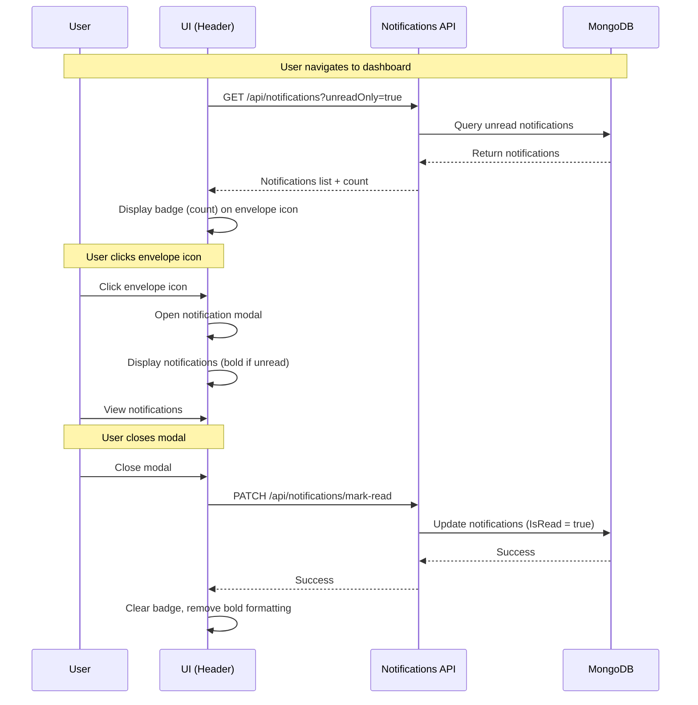
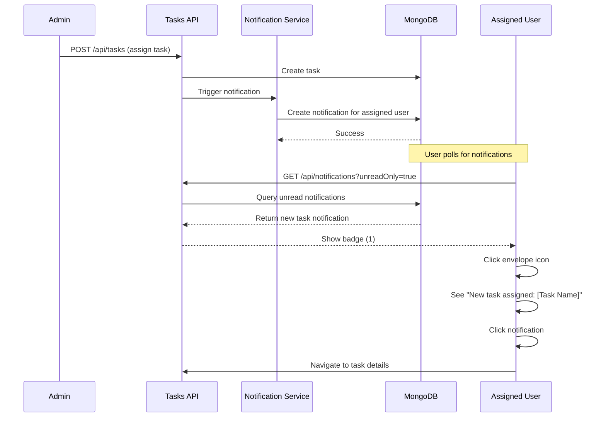
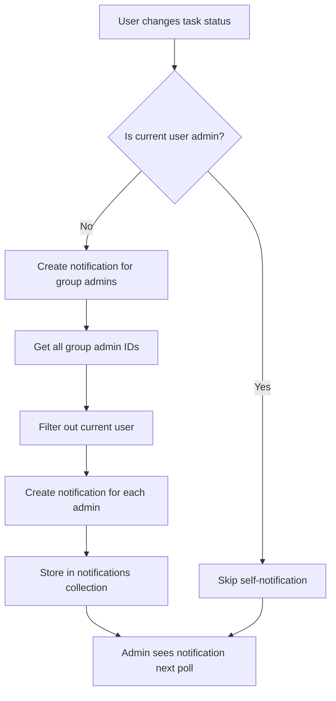
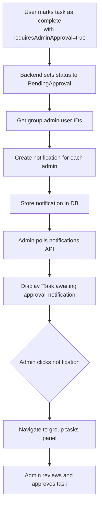
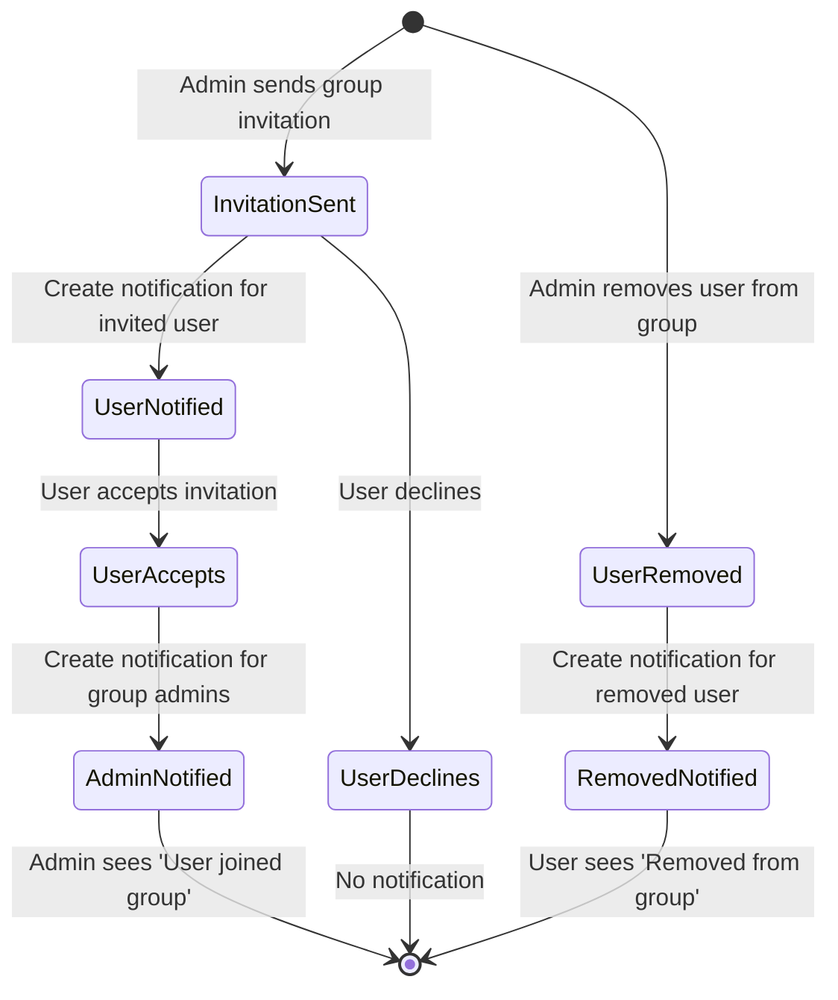

# Product Requirements Document (PRD)
## FR-029: In-App Notifications System

---

## 1. Executive Summary

This feature introduces a comprehensive in-app notifications system that keeps users informed about relevant activities within their groups and tasks. Users will receive real-time notifications for task assignments, status changes, group membership updates, and admin-specific events. The notification center is accessed via an envelope icon with an unread badge indicator, displaying notifications in a modal interface with read/unread state management.

**Expected Impact:**
- Improved user engagement through timely activity notifications
- Enhanced admin oversight with status change and approval notifications
- Better group collaboration through membership update alerts
- Reduced need for external email notifications or manual checking

---

## 2. Problem Statement

Currently, users have no in-app mechanism to stay informed about important events such as:
- New task assignments that require their attention
- Task status changes within their managed groups
- Tasks awaiting admin approval
- Group membership changes (invitations, approvals, removals)

This forces users to manually check for updates, leading to:
- Delayed responses to task assignments
- Missed admin approval requests
- Poor visibility into group membership changes
- Reduced platform engagement and collaboration efficiency

---

## 3. Goals & Non-Goals

### Goals
- ✅ Provide real-time in-app notifications for key user events
- ✅ Implement a notification center accessible from any page via header icon
- ✅ Support read/unread state management with visual indicators
- ✅ Display unread count badge on notification icon
- ✅ Differentiate notification types (task, admin, group) with clear visual design
- ✅ Persist notification state across sessions
- ✅ Support bilingual notifications (English/Hebrew)

### Non-Goals
- ❌ Push notifications (browser/mobile)
- ❌ Email notification delivery
- ❌ SMS or external messaging integrations
- ❌ Notification preferences/settings (Phase 1)
- ❌ Notification search or filtering (Phase 1)
- ❌ Notification deletion/archiving (Phase 1)
- ❌ Real-time websocket updates (will use polling initially)

---

## 4. User Flows

### 4.1 User Journey: Receiving and Reading Notifications



### 4.2 User Journey: Task Assignment Notification



### 4.3 Admin Journey: Task Status Change Notification



### 4.4 Admin Journey: Pending Approval Notification



### 4.5 User Journey: Group Membership Notifications



---

## 5. Functional Requirements

### 5.1 Notification Types

| Type ID | Event | Recipient(s) | Title Template | Body Template | Action Link |
|---------|-------|--------------|----------------|---------------|-------------|
| `TASK_ASSIGNED` | Task assigned to user | Assigned user | "New task assigned" | "You have been assigned: [Task Name]" | `/groups/[groupId]?taskId=[taskId]` |
| `TASK_STATUS_CHANGED` | Task status changed | Group admins (excluding actor) | "Task status updated" | "[User Name] changed [Task Name] to [Status]" | `/groups/[groupId]?taskId=[taskId]` |
| `TASK_PENDING_APPROVAL` | Task marked as complete (requiring approval) | Group admins | "Task awaiting approval" | "[User Name] completed [Task Name] - approval required" | `/groups/[groupId]?taskId=[taskId]` |
| `GROUP_MEMBER_JOINED` | User accepts group invitation | Group admins | "New member joined" | "[User Name] joined [Group Name]" | `/groups/[groupId]` |
| `GROUP_MEMBER_REMOVED` | User removed from group | Removed user | "Removed from group" | "You were removed from [Group Name]" | `/dashboard` |
| `GROUP_INVITATION_RECEIVED` | User invited to group | Invited user | "Group invitation" | "You're invited to join [Group Name]" | `/invitations/[inviteId]` |

### 5.2 UI Components

#### 5.2.1 Notification Icon (Header)
- **Location:** Application header, right side (next to user profile)
- **Icon:** Envelope icon (Heroicons: `EnvelopeIcon`)
- **Badge:** Red circular badge showing unread count (1-99+)
- **Behavior:** 
  - Badge visible only when unread count > 0
  - Click opens notification modal
  - Tooltip on hover: "Notifications"

#### 5.2.2 Notification Modal
- **Trigger:** Click on envelope icon
- **Layout:** Modal overlay with centered panel (max-width: 500px)
- **Header:** 
  - Title: "Notifications"
  - Close button (X icon)
  - Optional: "Mark all as read" button
- **Body:**
  - Scrollable list of notifications (max-height: 400px)
  - Empty state: "No notifications yet" with illustration
  - Loading state: Skeleton loaders
- **Notification Item:**
  - Icon (based on type): Task icon, Shield icon, Users icon
  - Title (bold if unread)
  - Body text (truncated to 2 lines)
  - Timestamp (relative: "2 hours ago", "Yesterday")
  - Hover state: Light background highlight
  - Click behavior: Navigate to action link + mark as read

#### 5.2.3 Notification Item States
- **Unread:** Bold title, blue dot indicator
- **Read:** Normal weight, no dot
- **Hover:** Background color change, cursor pointer
- **Clicked:** Immediate visual feedback, then navigation

### 5.3 Backend Requirements

#### 5.3.1 Data Model: Notification

```typescript
interface Notification {
  id: string;
  userId: string;              // Recipient user ID
  type: NotificationType;      // Enum: TASK_ASSIGNED | TASK_STATUS_CHANGED | etc.
  title: string;               // Localized title
  body: string;                // Localized body text
  actionLink?: string;         // Optional navigation target
  metadata: {                  // Type-specific data
    taskId?: string;
    groupId?: string;
    actorUserId?: string;      // Who triggered the notification
    actorName?: string;
    taskName?: string;
    groupName?: string;
    oldStatus?: TaskStatus;
    newStatus?: TaskStatus;
    inviteId?: string;
  };
  isRead: boolean;             // Default: false
  createdAt: Date;
  readAt?: Date;               // Timestamp when marked as read
}

enum NotificationType {
  TASK_ASSIGNED = 'TASK_ASSIGNED',
  TASK_STATUS_CHANGED = 'TASK_STATUS_CHANGED',
  TASK_PENDING_APPROVAL = 'TASK_PENDING_APPROVAL',
  GROUP_MEMBER_JOINED = 'GROUP_MEMBER_JOINED',
  GROUP_MEMBER_REMOVED = 'GROUP_MEMBER_REMOVED',
  GROUP_INVITATION_RECEIVED = 'GROUP_INVITATION_RECEIVED'
}
```

#### 5.3.2 API Endpoints

**GET /api/notifications**
- Query params: `?unreadOnly=true&page=1&pageSize=20`
- Response: `PagedResult<Notification>`
- Authorization: Current user's notifications only

**GET /api/notifications/unread-count**
- Response: `{ count: number }`
- Used for badge polling

**PATCH /api/notifications/mark-read**
- Body: `{ notificationIds: string[] }` (optional, if empty marks all)
- Response: `{ markedCount: number }`

**PATCH /api/notifications/:id/mark-read**
- Response: `Notification` (updated)

**POST /api/notifications** (Internal service method)
- Body: `CreateNotificationRequest`
- Used internally by other services

#### 5.3.3 Notification Service

**Responsibilities:**
- Create notifications based on events
- Query notifications for users
- Mark notifications as read
- Clean up old notifications (retention policy)

**Integration Points:**
- TaskService: Task assignment, status changes, pending approval
- InvitationService: Group invitations, member joins
- GroupService: Member removals

### 5.4 Internationalization (i18n)

All notification templates must support English and Hebrew:

**Translation Keys:**
```json
{
  "notifications": {
    "title": "Notifications",
    "empty": "No notifications yet",
    "markAllRead": "Mark all as read",
    "types": {
      "taskAssigned": {
        "title": "New task assigned",
        "body": "You have been assigned: {{taskName}}"
      },
      "taskStatusChanged": {
        "title": "Task status updated",
        "body": "{{userName}} changed {{taskName}} to {{status}}"
      },
      "taskPendingApproval": {
        "title": "Task awaiting approval",
        "body": "{{userName}} completed {{taskName}} - approval required"
      },
      "groupMemberJoined": {
        "title": "New member joined",
        "body": "{{userName}} joined {{groupName}}"
      },
      "groupMemberRemoved": {
        "title": "Removed from group",
        "body": "You were removed from {{groupName}}"
      },
      "groupInvitationReceived": {
        "title": "Group invitation",
        "body": "You're invited to join {{groupName}}"
      }
    }
  }
}
```

---

## 6. Technical Considerations

### 6.1 Architecture

**Backend:**
- Feature-based architecture: `Features/Notifications/`
  - `Controllers/NotificationsController.cs`
  - `Services/NotificationService.cs`
  - `Models/` (DTOs and requests)
- Repository pattern: `Infrastructure/Repositories/NotificationRepository.cs`
- MongoDB collection: `notifications`

**Frontend:**
- Component: `components/NotificationCenter.tsx`
- Modal: `components/NotificationModal.tsx`
- API slice: `features/notifications/api/notificationsApi.ts` (RTK Query)
- State: Server state via RTK Query (no local Redux state)

### 6.2 Data Persistence

**MongoDB Schema:**
```javascript
{
  _id: ObjectId,
  userId: ObjectId,
  type: String,  // Indexed
  title: String,
  body: String,
  actionLink: String?,
  metadata: Object,
  isRead: Boolean,  // Indexed
  createdAt: Date,  // Indexed (for cleanup/sorting)
  readAt: Date?
}
```

**Indexes:**
- `{ userId: 1, createdAt: -1 }` - Primary query pattern
- `{ userId: 1, isRead: 1 }` - Unread count queries
- `{ createdAt: 1 }` - TTL index for auto-cleanup (90 days)

### 6.3 Performance Considerations

**Polling Strategy:**
- Poll `/api/notifications/unread-count` every 30 seconds
- Only fetch full notifications when modal is opened
- Cache full notification list for 5 minutes

**Optimization:**
- Limit notifications to last 30 days in UI
- Server-side pagination (20 per page)
- MongoDB TTL index to auto-delete after 90 days
- Aggregate unread count in single query

### 6.4 Dependencies

**Backend:**
- No new external dependencies
- Uses existing MongoDB driver
- Uses existing authorization middleware

**Frontend:**
- RTK Query (existing)
- Heroicons (existing)
- date-fns (existing)
- react-i18next (existing)

### 6.5 Integration Points

**Trigger Locations:**
1. **TaskService.CreateAsync** → Create `TASK_ASSIGNED` notification
2. **TaskService.UpdateTaskStatusAsync** → Create `TASK_STATUS_CHANGED` and/or `TASK_PENDING_APPROVAL` notifications
3. **InvitationService.AcceptInvitation** → Create `GROUP_MEMBER_JOINED` notification
4. **InvitationService.SendInvitation** → Create `GROUP_INVITATION_RECEIVED` notification
5. **GroupService.RemoveMember** → Create `GROUP_MEMBER_REMOVED` notification

### 6.6 Security Considerations

- Users can only access their own notifications (userId filter in all queries)
- Authorization verified via JWT claims
- No sensitive data in notification body (only IDs and names)
- XSS prevention via proper React escaping
- SQL injection prevention via parameterized MongoDB queries

### 6.7 Scalability

**Current Implementation (Phase 1):**
- Polling-based (30s interval)
- Acceptable for < 1000 concurrent users
- MongoDB can handle millions of notifications

**Future Optimization (Phase 2):**
- WebSocket/SignalR for real-time updates
- Redis pub/sub for notification fanout
- Notification batching for high-volume events

---

## 7. Success Metrics

### 7.1 Adoption Metrics
- **% of users who open notification modal** (target: >60% within first week)
- **Average notifications per user per day** (benchmark: 2-5)
- **Unread notification rate** (target: <20% after 24 hours)

### 7.2 Engagement Metrics
- **Click-through rate on notifications** (target: >40%)
- **Time to first interaction after notification** (target: <5 minutes)
- **Return visits from notification clicks** (measure navigation success)

### 7.3 Performance Metrics
- **API response time for GET /notifications** (target: <200ms p95)
- **Time to display unread badge** (target: <100ms after page load)
- **Modal open time** (target: <300ms)

### 7.4 User Satisfaction
- **Survey: "How useful are notifications?"** (target: >4/5)
- **Support tickets related to missed updates** (target: 50% reduction)

---

## 8. Open Questions / Risks

### 8.1 Open Questions

1. **Notification Retention:**
   - Q: Should users be able to delete notifications manually?
   - Current: Auto-delete after 90 days (not exposed in UI)
   - Decision: Phase 2 feature

2. **Notification Preferences:**
   - Q: Should users control which notification types they receive?
   - Current: All notifications enabled by default
   - Decision: Phase 2 feature

3. **Read State:**
   - Q: Should notifications be marked as read on modal open or modal close?
   - Current Proposal: Mark as read when modal closes (user had opportunity to view)
   - Alternative: Mark individual notifications as read on click

4. **Real-time Updates:**
   - Q: When should we move from polling to WebSockets?
   - Current: Polling every 30s
   - Decision: Evaluate after MVP launch based on user feedback and scale

5. **Notification Grouping:**
   - Q: Should multiple similar notifications be grouped? (e.g., "3 new tasks assigned")
   - Current: No grouping
   - Decision: Phase 2 feature if noise becomes an issue

### 8.2 Risks & Mitigations

| Risk | Impact | Probability | Mitigation |
|------|--------|-------------|------------|
| **Notification fatigue** | High | Medium | Start with conservative triggers; add preferences in Phase 2 |
| **Polling overhead** | Medium | Low | Optimize query with indexes; implement exponential backoff |
| **i18n template complexity** | Low | Low | Use established i18next patterns; test both languages |
| **Missed notifications due to caching** | Medium | Low | Short cache TTL (30s); invalidate on mutation |
| **Notification spam from high-activity groups** | High | Medium | Future: Rate limiting and notification batching |
| **MongoDB performance at scale** | Medium | Low | Proper indexes; TTL cleanup; pagination |
| **Cross-browser notification icon inconsistency** | Low | Low | Use SVG icons (Heroicons); test on all supported browsers |

### 8.3 Assumptions

1. Users check the app at least once per day (notifications not urgent enough to require push)
2. English and Hebrew are sufficient for MVP (no additional languages)
3. 90-day retention is adequate (no user request for longer history)
4. Polling every 30 seconds is acceptable UX (not too slow, not too resource-intensive)
5. Admins want to see all task status changes (not just critical ones)

---

## 9. Appendix

### 9.1 Example Notification Payloads

**Task Assigned:**
```json
{
  "userId": "user123",
  "type": "TASK_ASSIGNED",
  "title": "New task assigned",
  "body": "You have been assigned: Fix login bug",
  "actionLink": "/groups/grp456?taskId=tsk789",
  "metadata": {
    "taskId": "tsk789",
    "taskName": "Fix login bug",
    "groupId": "grp456",
    "groupName": "Development Team",
    "actorUserId": "admin123",
    "actorName": "John Doe"
  },
  "isRead": false,
  "createdAt": "2025-12-23T10:30:00Z"
}
```

**Task Pending Approval:**
```json
{
  "userId": "admin123",
  "type": "TASK_PENDING_APPROVAL",
  "title": "Task awaiting approval",
  "body": "Jane Smith completed Fix login bug - approval required",
  "actionLink": "/groups/grp456?taskId=tsk789",
  "metadata": {
    "taskId": "tsk789",
    "taskName": "Fix login bug",
    "groupId": "grp456",
    "groupName": "Development Team",
    "actorUserId": "user123",
    "actorName": "Jane Smith"
  },
  "isRead": false,
  "createdAt": "2025-12-23T11:45:00Z"
}
```

### 9.2 UI Mockup References

**Notification Badge:**
```
┌─────────────────────────────────────┐
│  NU Tasks Tracker            👤 🔔③ │  ← Badge with count
└─────────────────────────────────────┘
```

**Notification Modal:**
```
╔═══════════════════════════════════════╗
║ Notifications                      ✕  ║
╠═══════════════════════════════════════╣
║ 🔵 📋 New task assigned               ║  ← Unread (bold)
║   You have been assigned: Fix bug     ║
║   2 hours ago                         ║
╟───────────────────────────────────────╢
║   🛡️ Task awaiting approval            ║  ← Read (normal)
║   John completed Deploy feature       ║
║   Yesterday                           ║
╟───────────────────────────────────────╢
║   👥 New member joined                 ║
║   Alice joined Development Team       ║
║   3 days ago                          ║
╚═══════════════════════════════════════╝
```

---

**Document Version:** 1.0  
**Created:** December 23, 2025  
**Author:** Product Team  
**Status:** Draft - Awaiting Approval
