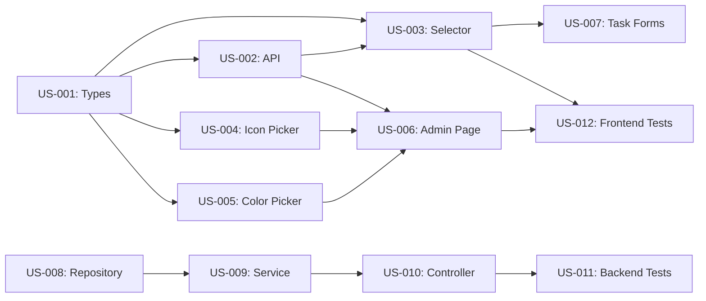

# Work Plan: Category Management (FR-003)

**Project:** NU - Tasks Management Application  
**Feature:** Category Management  
**Created:** December 15, 2025  
**Design Reference:** [design-category-management.md](design-category-management.md)  
**PRD Reference:** [prd.md](prd.md#fr-003-category-management)

---

## Vision & Metrics

**Vision:**
For families and small teams who need structured task organization,
NU's Category Management is a visual classification system that 
enables efficient task filtering, reporting, and group-specific customization
while maintaining consistent system-wide defaults.

**Success Metrics:**

| Metric | Target | Measurement |
|--------|--------|-------------|
| **User Adoption** | 85% of groups use at least 3 categories | Analytics: category usage per group |
| **Custom Category Usage** | 40% of admins create custom categories | DB query: custom categories created |
| **Task Categorization** | 90% of tasks assigned to categories | DB query: tasks with categoryId |
| **Category Performance** | <50ms category list retrieval | API response time monitoring |
| **Delete Conflict Prevention** | 100% validation before deletion | Zero 500 errors on delete attempts |

---

## Timeline Overview

**Total Effort:** 3 Epics, 12 Stories, ~15 days (3 sprints)  
**Approach:** Client-first → Backend → Tests  
**Team Size:** 1 developer + AI assistance  
**Sprint Duration:** 1 week per sprint

---

## Epic E1: Frontend Category Management

**Description:** Build React components for category display, selection, and admin management UI

**Business Value:**
- Users can visually identify and select categories when creating tasks
- Admins have self-service UI to customize their group's categories
- Improved UX through icon/color visual cues

**Success Criteria:**
- Category selector displays system + custom categories with icons/colors
- Admin can create/edit/delete custom categories via management page
- Delete validation prevents removing categories with assigned tasks
- Responsive UI works on mobile and desktop

**Estimated Effort:** 2 sprints (10 days)  
**Priority:** Critical (blocks task categorization feature)

---

### Story US-001: Category Type Definitions

**As a** developer **I want to** define TypeScript types for categories **So that** I have type-safe category data structures across the frontend

**Acceptance Criteria:**
- [x] `Category` interface defined with id, groupId, name, icon, color, isSystemCategory, taskCount, createdAt
- [x] `CreateCategoryRequest` and `UpdateCategoryRequest` types defined
- [x] System categories constant array defined with 10 default categories
- [x] Types exported from `web/src/types/category.ts`
- [x] Heroicon names type union for icon validation

**Technical Notes:**
- Place in `web/src/types/category.ts`
- System categories: House (home, orange-500), Yard (scissors, green-600), Pets (paw, amber-500), Studies (academic-cap, purple-600), Work (briefcase, blue-600), Vehicle (truck, gray-700), Finance (currency-dollar, emerald-600), Shopping (shopping-cart, pink-600), Health (heart, red-500), Other (ellipsis-horizontal, slate-500)

**Dependencies:** None  
**Estimated Effort:** 0.5 days (Type definitions with AI)  
**Priority:** Must Have

---

### Story US-002: Category API Slice (RTK Query)

**As a** developer **I want to** integrate category endpoints with RTK Query **So that** I have cached, optimized API calls for category data

**Acceptance Criteria:**
- [x] `categoryApi` slice created in `web/src/features/categories/api/categoryApi.ts`
- [x] `getCategories` query endpoint with groupId parameter
- [x] `createCategory` mutation endpoint
- [x] `updateCategory` mutation endpoint  
- [x] `deleteCategory` mutation endpoint
- [x] Cache tags configured (`Category`) with 10-minute TTL
- [x] Automatic cache invalidation on mutations

**Technical Notes:**
- Inject endpoints into existing `apiSlice`
- Use `providesTags` and `invalidatesTags` for cache management
- Handle 409 Conflict on delete (tasks exist) with error toast

**Dependencies:** US-001 (types)  
**Estimated Effort:** 1 day (API integration, error handling)  
**Priority:** Must Have

---

### Story US-003: Category Selector Component

**As a** user **I want to** select a category from a dropdown when creating/editing tasks **So that** I can organize tasks efficiently

**Acceptance Criteria:**
- [x] `CategorySelector` component accepts `value` and `onChange` props
- [x] Displays icon + name + color badge for each category
- [x] System categories appear at top, custom categories below
- [x] Search/filter functionality for long lists
- [x] Keyboard navigation support (arrow keys, Enter)
- [x] Shows loading state while fetching categories
- [x] Handles empty state (no custom categories)
- [x] Accessible with ARIA labels

**Technical Notes:**
- Use Headless UI Listbox for dropdown
- Icon rendering with Heroicons dynamic import
- Tailwind classes for color badges
- Place in `web/src/features/categories/components/CategorySelector.tsx`

**Dependencies:** US-001, US-002  
**Estimated Effort:** 2 days (Component + search + accessibility)  
**Priority:** Must Have

---

### Story US-004: Category Icon Picker Component

**As an** admin **I want to** select an icon from a visual grid **So that** I can customize my category's appearance

**Acceptance Criteria:**
- [x] Grid displays 50 common Heroicons with search
- [x] Selected icon highlighted with visual feedback
- [x] Search filters icons by name (debounced 300ms)
- [x] Clicking icon updates parent form state
- [x] Icon preview shows actual Heroicon component
- [x] Responsive grid (3 cols mobile, 6 cols desktop)
- [x] Accessible with keyboard navigation

**Technical Notes:**
- Predefined list of icons: home, scissors, paw, academic-cap, briefcase, truck, currency-dollar, shopping-cart, heart, ellipsis-horizontal, wrench-screwdriver, gift, book-open, calendar, user-group, bell, star, chart-bar, cog, folder, tag, clipboard-document-list, light-bulb, puzzle-piece, sparkles, rocket-launch, beaker, cake, camera, paintbrush, musical-note, globe-alt, sun, moon, cloud, fire, bolt, shield-check, key, lock-closed, envelope, phone, map-pin, building-office, banknote, credit-card, calculator, document-text, archive-box
- Place in `web/src/features/categories/components/CategoryIconPicker.tsx`

**Dependencies:** US-001  
**Estimated Effort:** 1.5 days (Grid + search + icons)  
**Priority:** Must Have

---

### Story US-005: Category Color Picker Component

**As an** admin **I want to** select a color from a predefined palette **So that** I can visually distinguish my categories

**Acceptance Criteria:**
- [x] Palette displays 20 Tailwind colors in grid
- [x] Selected color highlighted with border
- [x] Each color shows name + preview circle
- [x] Colors meet WCAG AA contrast requirements
- [x] Clicking color updates parent form state
- [x] Responsive grid (4 cols mobile, 5 cols desktop)
- [x] Accessible with keyboard navigation

**Technical Notes:**
- Colors: red-500, orange-500, amber-500, yellow-500, lime-500, green-500, emerald-500, teal-500, cyan-500, sky-500, blue-500, indigo-500, violet-500, purple-500, fuchsia-500, pink-500, rose-500, slate-500, gray-700, stone-500
- Place in `web/src/features/categories/components/CategoryColorPicker.tsx`
- Use dynamic Tailwind classes with safelist in config

**Dependencies:** US-001  
**Estimated Effort:** 1 day (Grid + validation)  
**Priority:** Must Have

---

### Story US-006: Category Management Page (Admin UI)

**As a** group admin **I want to** view, create, edit, and delete custom categories **So that** I can customize my group's task organization

**Acceptance Criteria:**
- [x] Page displays table: Name | Icon | Color | Task Count | Actions
- [x] "Create Category" button opens modal (admin-only)
- [x] Edit icon button opens modal with prefilled form
- [x] Delete icon button shows confirmation modal
- [x] Delete disabled with tooltip when taskCount > 0
- [x] System categories shown with "System" badge (no actions)
- [x] Custom categories shown with edit/delete actions
- [x] Filter dropdown: All / System Only / Custom Only
- [x] Loading states during API calls
- [x] Success/error toast notifications

**Technical Notes:**
- Route: `/groups/:groupId/categories`
- Check user role: only admins see create/edit/delete buttons
- Use US-004 (icon picker) and US-005 (color picker) in modals
- Place in `web/src/features/categories/pages/CategoryManagementPage.tsx`

**Dependencies:** US-002, US-004, US-005  
**Estimated Effort:** 3 days (Table + modals + validation + UX polish)  
**Priority:** Must Have

---

### Story US-007: Integrate Category Selector in Task Forms

**As a** user **I want to** assign a category when creating or editing a task **So that** my tasks are organized

**Acceptance Criteria:**
- [x] Category selector field added to task creation form
- [x] Category selector field added to task edit form
- [x] Selected category persisted to task entity
- [x] Category field optional (defaults to "Other" if unselected)
- [x] Form validation includes category selection
- [x] Category shown in task list/detail views

**Technical Notes:**
- Update `CreateTaskPage.tsx` and `EditTaskPage.tsx`
- Add categoryId to task Redux state
- Display category icon/color badge in TaskCard component
- May require task entity updates (confirm categoryId field exists)

**Dependencies:** US-003  
**Estimated Effort:** 1.5 days (Form integration + display updates)  
**Priority:** Should Have

---

## Epic E2: Backend Category Management

**Description:** Implement ASP.NET Core API endpoints, service layer, and MongoDB repository for category CRUD operations

**Business Value:**
- Secure category management with role-based authorization
- Data persistence for custom categories
- Validation logic prevents data integrity issues
- Scalable architecture supports future category features

**Success Criteria:**
- 5 RESTful endpoints functional with JWT auth
- Admin-only operations enforced via authorization
- Name uniqueness validated per group
- Delete operations check task count
- <50ms response time for GET requests

**Estimated Effort:** 1 sprint (4 days)  
**Priority:** Critical (required for frontend functionality)

---

### Story US-008: Category Domain Model & Repository

**As a** developer **I want to** create the Category entity and repository **So that** I can persist custom categories in MongoDB

**Acceptance Criteria:**
- [x] `Category.cs` entity created in `Features/Categories/Domain/`
- [x] Properties: Id, GroupId, Name, Icon, Color, IsSystemCategory, CreatedAt, CreatedBy, SchemaVersion
- [x] BSON attributes configured (ObjectId mappings, required fields)
- [x] `ICategoryRepository` interface with methods: GetByGroupAsync, CreateAsync, UpdateAsync, DeleteAsync, NameExistsInGroupAsync, GetTaskCountAsync
- [x] `CategoryRepository.cs` implementation extends BaseRepository
- [x] MongoDB indexes: (groupId + name) unique, (groupId + createdAt)
- [x] Repository registered in DI container

**Technical Notes:**
- Place in `backend/src/TasksTracker.Api/Features/Categories/`
- Use existing `BaseRepository<T>` pattern
- `GetTaskCountAsync` queries tasks collection by categoryId
- System categories NOT stored in DB (constants only)

**Dependencies:** None  
**Estimated Effort:** 1.5 days (Entity + repository + indexes)  
**Priority:** Must Have

---

### Story US-009: Category Service Layer

**As a** developer **I want to** implement category business logic **So that** I have validated, secure category operations

**Acceptance Criteria:**
- [x] `ICategoryService` interface defined
- [x] `CategoryService.cs` with methods: GetCategoriesAsync, CreateCategoryAsync, UpdateCategoryAsync, DeleteCategoryAsync, GetSystemCategories
- [x] `GetCategoriesAsync` combines system + custom categories
- [x] `CreateCategoryAsync` validates admin role, checks name uniqueness (case-insensitive)
- [x] `UpdateCategoryAsync` prevents editing system categories, validates admin
- [x] `DeleteCategoryAsync` checks task count, throws 409 Conflict if > 0
- [x] Service registered in DI container with scoped lifetime

**Technical Notes:**
- System categories hardcoded as static readonly array
- Use `IGroupService.IsUserAdminAsync()` for role checks
- Throw `UnauthorizedAccessException` for non-admins
- Throw `ArgumentException` for duplicate names
- Place in `backend/src/TasksTracker.Api/Features/Categories/Services/`

**Dependencies:** US-008, existing GroupService  
**Estimated Effort:** 2 days (Business logic + validation + error handling)  
**Priority:** Must Have

---

### Story US-010: Categories Controller & API Endpoints

**As a** frontend developer **I want to** consume category REST API endpoints **So that** I can build the category management UI

**Acceptance Criteria:**
- [x] `CategoriesController.cs` created with [Authorize] attribute
- [x] GET `/api/categories?groupId={id}` returns system + custom categories
- [x] POST `/api/categories` creates custom category (admin-only)
- [x] PUT `/api/categories/{id}` updates custom category (admin-only)
- [x] DELETE `/api/categories/{id}` removes custom category (admin-only)
- [x] All responses use `ApiResponse<T>` wrapper
- [x] Validation attributes on DTOs (StringLength, Required, RegularExpression)
- [x] Returns 401 Unauthorized for non-authenticated users
- [x] Returns 403 Forbidden for non-admin operations
- [x] Returns 409 Conflict for delete with tasks assigned

**Technical Notes:**
- DTOs: `CreateCategoryRequest`, `UpdateCategoryRequest`, `CategoryResponse`
- `CategoryResponse` includes taskCount field
- Color validation regex: `^[a-z]+-\d{3}$` (e.g., blue-500)
- Name length: 2-50 characters
- Place in `backend/src/TasksTracker.Api/Features/Categories/Controllers/`

**Dependencies:** US-009  
**Estimated Effort:** 1.5 days (Controller + DTOs + validation + error handling)  
**Priority:** Must Have

---

## Epic E3: Testing & Quality Assurance

**Description:** Comprehensive test coverage for category management feature across frontend and backend

**Business Value:**
- Prevents regressions in category logic
- Validates business rules (uniqueness, task count, admin-only)
- Ensures UI accessibility and usability
- Enables confident refactoring

**Success Criteria:**
- Backend: 70%+ code coverage for category services/repositories
- Frontend: Component tests for all UI elements
- Integration tests for API endpoints
- E2E test for admin creating custom category

**Estimated Effort:** 0.5 sprints (3 days)  
**Priority:** High (quality gate before release)

---

### Story US-011: Backend Unit & Integration Tests

**As a** developer **I want to** test category business logic and API endpoints **So that** I ensure correct behavior and prevent bugs

**Acceptance Criteria:**
- [x] Unit tests for `CategoryService`:
  - CreateCategoryAsync validates admin role
  - CreateCategoryAsync rejects duplicate names (case-insensitive)
  - DeleteCategoryAsync throws 409 when tasks exist
  - UpdateCategoryAsync prevents editing system categories
  - GetCategoriesAsync combines system + custom categories
- [x] Unit tests for `CategoryRepository`:
  - NameExistsInGroupAsync performs case-insensitive check
  - GetTaskCountAsync returns correct count
- [x] Integration tests for `CategoriesController`:
  - POST /api/categories with duplicate name returns 400
  - DELETE /api/categories/{id} with tasks returns 409
  - GET /api/categories returns system + custom sorted
  - POST requires admin role (403 for regular users)
- [x] Mock dependencies with Moq
- [x] Use FluentAssertions for readable assertions
- [x] 70%+ code coverage for category feature

**Technical Notes:**
- Place in `backend/tests/TasksTracker.Api.Tests/Categories/`
- Use existing `CustomWebApplicationFactory` for integration tests
- Mock `IGroupService.IsUserAdminAsync()` in unit tests

**Dependencies:** US-008, US-009, US-010  
**Estimated Effort:** 2 days (Unit tests: 1d, Integration tests: 1d)  
**Priority:** Must Have

---

### Story US-012: Frontend Component Tests

**As a** developer **I want to** test category UI components **So that** I ensure correct rendering, interactions, and accessibility

**Acceptance Criteria:**
- [x] Tests for `CategorySelector`:
  - Renders system + custom categories
  - Search filters category list
  - Calls onChange when category selected
  - Shows loading state during fetch
- [x] Tests for `CategoryIconPicker`:
  - Renders icon grid
  - Search filters icons
  - Highlights selected icon
- [x] Tests for `CategoryColorPicker`:
  - Renders color palette
  - Highlights selected color
  - Calls onChange with Tailwind class
- [x] Tests for `CategoryManagementPage`:
  - Admin sees create/edit/delete buttons
  - Delete button disabled when taskCount > 0
  - Filter dropdown works correctly
  - System categories show "System" badge
- [x] Use Vitest + React Testing Library
- [x] Mock RTK Query hooks with MSW or manual mocks

**Technical Notes:**
- Place in `web/src/features/categories/components/__tests__/`
- Use existing Vitest setup with ResizeObserver polyfill
- Test accessibility with `getByRole` queries

**Dependencies:** US-003, US-004, US-005, US-006  
**Estimated Effort:** 1.5 days (Component tests)  
**Priority:** Should Have

---

## Sprint Plan

### Sprint 1: Frontend Foundation (Week 1)

**Sprint Goal:** Build category type system, API integration, and core reusable components

**Stories:**
- US-001: Category Type Definitions (0.5d) - Must Have
- US-002: Category API Slice (1d) - Must Have
- US-003: Category Selector Component (2d) - Must Have
- US-004: Category Icon Picker Component (1.5d) - Must Have

**Capacity:** 5 days  
**Committed:** 5 days  
**Sprint Deliverables:**
- Type-safe category data structures
- Cached API integration with RTK Query
- Functional category selector dropdown
- Icon picker UI component

---

### Sprint 2: Frontend Admin UI & Backend Implementation (Week 2)

**Sprint Goal:** Complete admin management UI and build backend API with validation

**Stories:**
- US-005: Category Color Picker Component (1d) - Must Have
- US-006: Category Management Page (3d) - Must Have
- US-008: Category Domain Model & Repository (1.5d) - Must Have
- US-009: Category Service Layer (2d) - Must Have

**Capacity:** 5 days  
**Committed:** 7.5 days (overflow into Sprint 3)  
**Sprint Deliverables:**
- Color picker component
- Full admin CRUD UI
- MongoDB category persistence
- Business logic with validation

**Notes:** US-006 may slip to Sprint 3 due to 7.5 day commitment (20% over capacity)

---

### Sprint 3: Backend API, Integration & Testing (Week 3)

**Sprint Goal:** Complete backend endpoints, integrate with task forms, and achieve test coverage

**Stories:**
- US-006: Category Management Page (overflow if needed)
- US-007: Integrate Category Selector in Task Forms (1.5d) - Should Have
- US-010: Categories Controller & API Endpoints (1.5d) - Must Have
- US-011: Backend Unit & Integration Tests (2d) - Must Have
- US-012: Frontend Component Tests (1.5d) - Should Have

**Capacity:** 5 days  
**Committed:** 6.5 days (30% over, but US-007 and US-012 are Should Have, can defer)  
**Sprint Deliverables:**
- Working REST API endpoints
- Category selection in task forms
- 70%+ backend test coverage
- Component test suite

**Risk Mitigation:** If running behind, defer US-007 (task form integration) and US-012 (component tests) to Sprint 4 polish phase

---

## Dependencies & Risks

### External Dependencies
- **Heroicons Library:** Verify version compatibility (v2 expected)
- **Task Entity Schema:** Confirm `categoryId` field exists, or add migration
- **Group Service:** Existing `IsUserAdminAsync()` method required

### Technical Dependencies

### Risks & Mitigation

| Risk | Impact | Probability | Mitigation |
|------|--------|-------------|------------|
| **Heroicons version mismatch** | High | Low | Verify `@heroicons/react` version in package.json during US-001 |
| **Task entity missing categoryId** | High | Medium | Check schema early (Sprint 1), add migration if needed |
| **Sprint 2 capacity overflow (7.5d)** | Medium | High | Move US-006 completion to Sprint 3, focus on backend first |
| **Icon/color picker complexity** | Medium | Medium | Use simple grid layout, defer advanced features (drag-drop, color customization) |
| **Delete validation performance** | Low | Low | Index categoryId in tasks collection for fast count queries |

---

## Release Phases

### Phase 1: MVP (Sprints 1-3, 3 weeks)
**Deliverables:**
- System + custom categories functional
- Admin CRUD UI complete
- Backend API with validation
- Task form integration
- 70% test coverage

**Release Criteria:**
- All Must Have stories completed
- No critical bugs in QA
- Performance: <50ms category list retrieval
- Security: Admin authorization enforced

---

### Phase 2: Enhancements (Sprint 4+, Future)
**Potential Features:**
- Category-based task filtering in dashboard
- Category analytics (completion rate by category)
- Bulk task reassignment between categories
- Category favorites for quick access
- Import/export category templates

---

### Phase 3: Optimization (Sprint 5+, Future)
**Potential Improvements:**
- Category hierarchy (parent/child relationships)
- Custom icon upload (PNG/SVG)
- Advanced color customization (HSL picker)
- Category suggestions based on task name (AI/ML)
- Category usage heat map in reports

---

## Validation Checklist

- [x] **INVEST Principles:** All stories are independent, negotiable, valuable, estimable, small, testable
- [x] **AI Estimates:** Include 3-5x productivity multiplier for CRUD, adjusted for complexity
- [x] **Dependencies:** Technical dependencies mapped, external dependencies identified
- [x] **Shippable Value:** Each sprint delivers functional, demo-able features
- [x] **Acceptance Criteria:** All stories have specific, testable outcomes
- [x] **Client-First Order:** Frontend stories prioritized in Sprints 1-2, backend in Sprint 2-3, tests last
- [x] **Buffer:** 20% capacity buffer considered (Sprint 2/3 overflow acknowledged)
- [x] **MoSCoW Priority:** Must/Should/Could/Won't clearly labeled

---

## Notes

**Estimation Assumptions:**
- Developer has moderate experience with React, ASP.NET Core, and MongoDB
- AI assistance (GitHub Copilot, ChatGPT) used for:
  - Boilerplate generation (CRUD repositories, DTOs)
  - Test scaffolding (xUnit, Vitest)
  - Type definitions and interface contracts
  - Documentation generation
- Productivity multipliers applied:
  - CRUD operations: 4x (repositories, basic endpoints)
  - UI components: 2.5x (form inputs, modals)
  - Business logic: 2x (validation, authorization)
  - Testing: 5x (unit tests, mocks)

**Sprint Velocity:**
- Target: 5 days per sprint (1 developer, 40 hours/week)
- Actual commitment: Sprint 1 (5d), Sprint 2 (7.5d), Sprint 3 (6.5d)
- Overflow managed by deferring Should Have stories

**Definition of Done:**
- Code reviewed (self-review with AI assistance)
- Unit tests passing with 70%+ coverage
- Integration tests passing
- No console errors or warnings
- Documentation updated (inline comments + README)
- Deployed to staging environment
- QA sign-off on acceptance criteria

---

**DOCUMENT COMPLETE**
